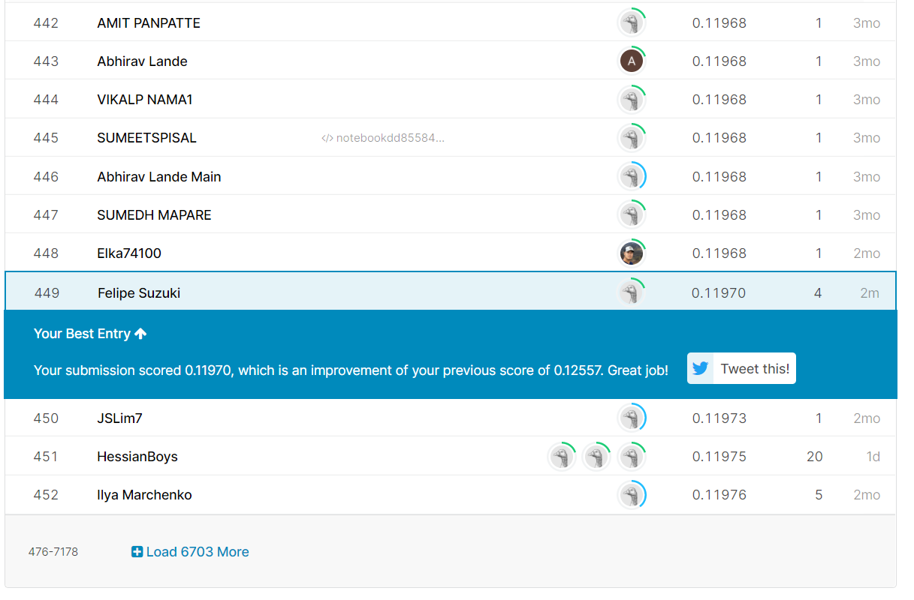

```{r setup, include=FALSE}
knitr::opts_chunk$set(echo = FALSE,WARNING=F,message=F, results='hide',fig.align='center')
#knitr::opts_chunk$set(echo = T,WARNING=F,message=F, results='hide',fig.align='center')

library(plyr)
library(data.table)
library(hash)
library(ggplot2)
library(reshape2)
#library(lattice)
library(grid)
library(gridExtra)
library(ggpubr)
#library(scales)
library(tidyr)
library(car)
library(mltools)
library(kableExtra)
#library(magrittr)
#library(faux)
#library(randomForest)
library(caret)
library(xgboost)
library(Matrix)
#library(glmnet)
library(e1071)
```

## **1. Introduction**

House prices are commonly known to be influenced by the house area, the preservation of the rooms and the overall quality of the construction. However, other not so intuitive factors may play a hand in the pricing of the house. Some of these factors may include the proximity to a railroad, the shape of the property, the material of the road that leads to the house and many others.

The aim of this notebook is to analyze the main factors impacting the house prices in the city of Ames in Iowa as well as predict their values using machine learning models.

The data is obtained from a kaggle competition available at ([House Prices](https://www.kaggle.com/c/house-prices-advanced-regression-techniques/overview)). The data contains a total of **79 variables** explaining different aspects of the homes. The data is divided into a **training dataset of 1460 observations** with information about the price and a **validation dataset of 1459 observations**, where the prices are unknown. This objective is to predict the validation dataset prices and submit them to kaggle, which will then rank the submissions sent by different people.

The metric used to rank the different submissions was the root mean squared logarithm error (RMSLE - the RMSE between the logarithm of the predicted value and the logarithm of the observed price), which means that errors in predicting expensive and cheap houses will affect the result equally.

## **2. Processing the data**

The raw data which was collected directly from the csv files is shown below. For more information about the meaning of each variable, check the README file available at the [github repository](https://github.com/Brandevin/Project_Real_State). 

The data contains information about the area, quality and condition of different rooms, the number of rooms, the styles and materials of house components, the neighborhood, the type of house, the type and date of sale and many others.

```{r importing_dataset,results='asis'}
df=read.csv('./Inputs/train.csv')
df_validate=read.csv('./Inputs/test.csv')

## Separate into training and test
smp_size<-floor(0.75*nrow(df))
set.seed(0)

train_ind<- sample(seq_len(nrow(df)), size = smp_size)

train <- df[train_ind, ]
test <- df[-train_ind, ]

row.names(train) <- NULL

head(train,60) %>%kbl()%>%kable_styling(bootstrap_options = c("striped", "hover", "condensed"),fixed_thead = T) %>%
  kableExtra::scroll_box(width = "100%", height = "300px") %>%
  kable_material()
```


The data was then divided into a training set (**1095** observations) and a test set (**365** observations). All analysis and model training were performed on the training set, while the test set was used to calculate the model metrics.

By analyzing scatterplots and barplots, it was found the dataset had missing values, outliers and messy data. To deal with this, the following operations were performed:

1. Missing values were replaced by 0 for features related to the area or the number of rooms. 
2. Categorical variables with missing values were assigned a value according to the variable description (Ex: The variable "Fence" had no value when there was no fence. The missing values in this case were assigned as belonging to a category named "No fence").
3. Categorical variables which had almost all observations in the same category (Ex: 1450 observations in a single category, 10 in others) were dropped, as there was not enough data for them to be statistically relevant.
4. Categorical variables which belonged to a category with few samples (Ex: A variable that has a category with only 8 observations) were either lumped together in another similar category or into a category which was then named "Others"
5. Observations that had integer variables much higher than the others (outliers) were assigned a lower number to reduce the leverage these variables could exert in a linear regression. (Ex: Only 4 houses had more than 3 garage parking spots. These 4 houses were assigned as having 3 garages)
6. The quality and condition variables, which had values "Ex","Gd","TA","Fa","Po" (Excellent, good, typical, fair, poor), were transformed into continous variables with the values: 5, 4, 3, 2, 1.
7. Some variables related to whether the house has a second floor, a porch or other room were created based on whether the area was equal to 0 or not.


The processed table after all these modifications is shown below.

```{r common_preprocessor,results='asis'}
#A function that performs multiple changes and operations in the dataset is created, so that it can be applied to the training, test and validation set.

skew_calc <- function(series){
  return (sum((series - mean(series))^3)/length(series))/((sum((series - mean(series))^2)/length(series)))^(3/2)
}

common_preprocessor <-function(df,garage_yr_blt_mean,quantile_96_dict,columns_96,quantile_4_dict,columns_04,min_values_dict,columns_min) {
    #Replacing cells without value with their meaning, when possible
    # If the reason was because there was no room (Ex: garage), with the properties, create categorical variable "No room_name". If the feature is the area, consider the area as being equal to 0
    df$Alley<-df$Alley %>% replace_na("No Alley")
    df$BsmtExposure<-df$BsmtExposure %>% replace_na("NA")
    df$BsmtFinType1<-df$BsmtFinType1 %>% replace_na("No basement")
    df$BsmtCond<-df$BsmtCond %>% replace_na(0)
    df$BsmtQual<-df$BsmtQual %>% replace_na(0)
    df$Fence<-df$Fence %>% replace_na("No fence")
    df$FireplaceQu<-df$FireplaceQu %>% replace_na(0)
    df$GarageCond<-df$GarageCond %>% replace_na(0)
    df$GarageFinish<-df$GarageFinish %>% replace_na("No garage")
    df$GarageQual<-df$GarageQual %>% replace_na(0)
    df$GarageType<-df$GarageType %>% replace_na("No garage")
    df$LotFrontage<-df$LotFrontage %>% replace_na(0)
    df$MasVnrArea<-df$MasVnrArea %>% replace_na(0)
    df$MasVnrType<-df$MasVnrType %>% replace_na('None')
    df$Electrical<-df$Electrical %>% replace_na('Other')
    #Dropping features that dont have enough samples distributed in different categories (Some features had only 5 samples that had a different value, for example)
    drop<-c("RoofMatl","BsmtFinType2","BsmtFinSF2","Heating","KitchenAbvGr","EnclosedPorch","ScreenPorch","PoolArea","MiscFeature","PoolQC","MiscVal","Street","Utilities")
    df<-df[,!(names(df) %in% drop)]
    #Substituting Categories by categories that, although less descriptive, are able to generalize more, as there are more samples per category. Either group similar categorizations together, or lump some of them together as "Other".
    df$BedroomAbvGr<-ifelse(df$BedroomAbvGr<1,1,ifelse(df$BedroomAbvGr>5,5,df$BedroomAbvGr))
    df$TotRmsAbvGrd<-ifelse(df$TotRmsAbvGrd<4,4,ifelse(df$TotRmsAbvGrd>10,10,df$TotRmsAbvGrd))
    df$Fireplaces<-ifelse(df$Fireplaces>2,2,df$Fireplaces)
    df$LotShape <- mapvalues(df$LotShape, from=c("IR1", "IR2", "IR3","Reg"), to=c("IR1", "IR2&IR3","IR2&IR3", "Reg"),warn_missing=FALSE)
    df$MSSubClass <- mapvalues(df$MSSubClass, from=c(20,30,40,45,50,60,70,75,80,85,90,120,150,160,180,190), to=c("20","30","Other","Other","50","60","70","70","80","80","90","120","Other","160","Other","190"),warn_missing=FALSE)
    #df$LotConfig <- mapvalues(df$LotConfig, from=c("Corner","CulDSac","FR2","FR3","Inside"), to=c("Corner","CulDSac","FR2&FR3","FR2&FR3","Inside"),warn_missing=FALSE)
    df$Neighborhood <- mapvalues(df$Neighborhood, from=c("Blueste","NPkVill","Veenker"), to=c("Other","Other","Other"),warn_missing=FALSE)
    df$BsmtExposure <- ifelse(df$BsmtExposure=="Gd","Good",df$BsmtExposure)
    df$RoofStyle <- ifelse(df$RoofStyle=="Gable","Gable",ifelse(df$RoofStyle=="Hip","Hip","Other"))
    #df$LandSlope <- ifelse(df$LandSlope=="Gtl","Gtl","Other")
    #df$Foundation <- ifelse(df$Foundation=="Stone","Other",ifelse(df$Foundation=="Wood","Other",ifelse(df$Foundation=="Slab","Other",df$Foundation)))
    #df$MSZoning <- ifelse(df$MSZoning=="FV","FV",ifelse(df$MSZoning=="RM","RM",ifelse(df$MSZoning=="RL","RL","Other")))
    df$Electrical <- ifelse(df$Electrical=="SBrkr","SBrkr",ifelse(df$Electrical=="FuseA","FuseA","Other"))
    #df$Functional <- ifelse(df$Functional=="Typ","Typ","Other")
    df$GarageType <- ifelse(df$GarageType=="Attchd","Attchd",ifelse(df$GarageType=="BuiltIn","BuiltIn",ifelse(df$GarageType=="Detchd","Detchd","Other")))
    df$SaleType <- ifelse(df$SaleType=="WD","WD",ifelse(df$SaleType=="New","New",ifelse(df$SaleType=="COD","COD","Other")))
    df$SaleCondition <- ifelse(df$SaleCondition=="Normal","Normal",ifelse(df$SaleCondition=="Partial","Abnormal","Other"))
    df$HouseStyle <- ifelse(df$HouseStyle=="1Story","1Story",ifelse(df$HouseStyle=="1.5Fin","1.5Fin",ifelse(df$HouseStyle=="2Story","2Story",ifelse(df$HouseStyle=="SFoyer","SFoyer",ifelse(df$HouseStyle=="SLvl","SLvl","Other")))))
    #df$Exterior1st <- ifelse(df$Exterior1st=="HdBoard","HdBoard",ifelse(df$Exterior1st=="MetalSd","MetalSd",ifelse(df$Exterior1st=="VinylSd","VinylSd",ifelse(df$Exterior1st=="Wd Sdng","Wd Sdng",ifelse(df$Exterior1st=="CemntBd","CemntBd",ifelse(df$Exterior1st=="BrkFace","BrkFace",ifelse(df$Exterior1st=="WdShing","WdShing","Other")))))))
    #df$Exterior2nd <- ifelse(df$Exterior2nd=="HdBoard","HdBoard",ifelse(df$Exterior2nd=="MetalSd","MetalSd",ifelse(df$Exterior2nd=="VinylSd","VinylSd",ifelse(df$Exterior2nd=="Wd Sdng","Wd Sdng",ifelse(df$Exterior2nd=="CemntBd","CemntBd",ifelse(df$Exterior2nd=="BrkFace","BrkFace",ifelse(df$Exterior1st=="WdShing","WdShing","Other")))))))
    
    df$BsmtFullBath[df$BsmtFullBath > 0 ] <- 1
    df$BsmtHalfBath[df$BsmtHalfBath > 0 ] <- 1
    df$FullBath[df$FullBath == 0 ] <- 1
    #df$HalfBath[df$HalfBath > 1 ] <- 1
    #df$GarageCars[df$GarageCars > 3 ] <- 3
    
    #Create new variables from some of the features, such as condition 1 & condition 2, Exterior1st &Exterior2nd
    
    df$Condition<-ifelse(df$Condition1=="Artery" | df$Condition2=="Artery","Artery",ifelse(df$Condition1=="Feedr"|df$Condition2=="Feedr","Feedr","Other"))
    
    df$Ext_matl_cementbd<-ifelse(df$Exterior1st=="CemntBd" | df$Exterior2nd=="CemntBd",1,0)
    df$Ext_matl_brkface<-ifelse(df$Exterior1st=="BrkFace" | df$Exterior2nd=="BrkFace",1,0)
    df$Ext_matl_hdboard<-ifelse(df$Exterior1st=="HdBoard" | df$Exterior2nd=="HdBoard",1,0)
    df$Ext_matl_metalsd<-ifelse(df$Exterior1st=="MetalSd" | df$Exterior2nd=="MetalSd",1,0)
    df$Ext_matl_vinylsd<-ifelse(df$Exterior1st=="VinylSd" | df$Exterior2nd=="VinylSd",1,0)
    df$Ext_matl_wdsdng<-ifelse(df$Exterior1st=="Wd Sdng" | df$Exterior2nd=="Wd Sdng",1,0)
    df$Ext_matl_wdshing<-ifelse(df$Exterior1st=="WdShing" | df$Exterior2nd=="WdShing",1,0)
    
    #Replace ratings by rating number
    
    df[df=="Ex"]<-5
    df[df=="Gd"]<-4
    df[df=="TA"]<-3
    df[df=="Fa"]<-2
    df[df=="Po"]<-1
    
    #Creating new variables when area is equal to 0
    
    df$Has2ndFlr<-df$X2ndFlrSF>0
    df$HasPorch<-df$X3SsnPorch>0
    df$HaslowQuality_finished<-df$LowQualFinSF>0
    df$HasOpenPorch<-df$OpenPorchSF>0
    
    # Drop columns that were not valid after the creation of the new variables
    
    drop<-c("Condition1","Condition2","Exterior1st","Exterior2nd","X3SsnPorch","LowQualFinSF")
    df<-df[,!(names(df) %in% drop)]

    # Trim Outliers. Assign the values above the threshold as being equal to the threshold
    for (col in columns_96){
 #df[[col]][df[[col]] > quantile_96_dict[[col]] ] <- quantile_96_dict[[col]]
    }
  
    for (col in columns_04){
 #df[[col]][df[[col]] < quantile_4_dict[[col]] ] <- quantile_4_dict[[col]]
    }
  
    #Substituting values equal to 0 to the minimum value. This way, the leverage of these points is decreased
    for (col in columns_min){
 min_values_dict[col]<-min(df[df[[col]]>0,col])
 df[[col]][df[[col]]==0] <-min_values_dict[[col]]
  
    }
    
    #Replacing nan by mean value
    df$GarageYrBlt<-df$GarageYrBlt %>% replace_na(garage_yr_blt_mean)
  
   df$LotFrontage<-df$LotFrontage %>% replace_na(0)
 
    numberic_feats<-c("LotFrontage","LotArea","OverallQual","OverallCond","YearBuilt","YearRemodAdd","MasVnrArea","BsmtFinSF1","BsmtUnfSF", "TotalBsmtSF","X1stFlrSF","X2ndFlrSF","GrLivArea","BsmtFullBath","BsmtHalfBath","FullBath","HalfBath","BedroomAbvGr","TotRmsAbvGrd","Fireplaces","GarageYrBlt","GarageCars","GarageArea","WoodDeckSF","OpenPorchSF","YrSold","SalePrice","ExterQual", "ExterCond","BsmtQual", "BsmtCond","HeatingQC","KitchenQual","FireplaceQu","GarageQual","GarageCond")  
    binary_feats<-c("Ext_matl_cementbd","Ext_matl_brkface",  "Ext_matl_hdboard",  "Ext_matl_metalsd", "Ext_matl_vinylsd",  "Ext_matl_wdsdng"  ,"Ext_matl_wdshing","Has2ndFlr", "HasPorch", "HaslowQuality_finished", "HasOpenPorch")
    cat_feats<-c("LandContour","LotConfig","LandSlope", "Neighborhood",  "HouseStyle","RoofStyle", "MasVnrType", "Foundation",  "BsmtExposure","BsmtFinType1", "CentralAir","Electrical", "Functional", "GarageType","GarageFinish","PavedDrive","Fence","SaleType", "SaleCondition","MoSold","Condition")
 
    df[, numberic_feats] <- sapply(df[, numberic_feats], as.numeric)
    df[, cat_feats] <- sapply(df[, cat_feats], as.factor)

    return (df)
}


# Getting 96th percentile of some columns to trim outliers. Values above the 96th percentile for these columns are going to be assigned as equal to the 96th percentile

columns_96<-c("LotFrontage","LotArea","MasVnrArea","BsmtFinSF1","BsmtUnfSF","TotalBsmtSF","X1stFlrSF","X2ndFlrSF","GrLivArea","GarageArea","WoodDeckSF","OpenPorchSF")
quantile_96_dict<-hash()
for (col in columns_96){
  quantile_96_dict[col]<-quantile(train[[col]],0.96,na.rm=TRUE)
}

# Getting 4th percentile of some columns to trim outliers. Values above the 96th percentile for these columns are going to be assigned as equal to the 4th percentile

columns_04<-c("GrLivArea","LotArea","TotalBsmtSF","X1stFlrSF","X2ndFlrSF","YearBuilt","WoodDeckSF")
quantile_4_dict<-hash()
for (col in columns_04){
  quantile_4_dict[col]<-quantile(train[train[[col]]>0,col],0.04,na.rm=TRUE)
}
#Substituting 0s by the minimum value

min_values_dict<-hash()
columns_min<-c("GarageArea","LotFrontage","TotalBsmtSF","X1stFlrSF","X2ndFlrSF","WoodDeckSF")
for (col in columns_min){
  min_values_dict[col]<-min(train[train[[col]]>0,col])
}

#Getting mean garage year built value
garage_yr_blt_mean<-mean(train$GarageYrBlt,na.rm=TRUE)

train<-common_preprocessor(train,garage_yr_blt_mean,quantile_96_dict,columns_96,quantile_4_dict,columns_04,min_values_dict,columns_min)

test<-common_preprocessor(test,garage_yr_blt_mean,quantile_96_dict,columns_96,quantile_4_dict,columns_04,min_values_dict,columns_min)

head(train,60) %>%kbl()%>%kable_styling(bootstrap_options = c("striped", "hover", "condensed"),fixed_thead = T) %>%
  kableExtra::scroll_box(width = "100%", height = "300px") %>%
  kable_material()
```

## **3. Exploration of the data**

### **3.1 Continous variables**

Before starting to build the models, it is interesting to analyze the relationship between the different variables to understand how each of them affects the price and how similar one variable may be to the other. The figure below shows the correlation matrix of the continous variables of the dataset.

``` {r correlation_matrix,fig.width=15, fig.height=15,}

plot_cormat<-function(features){
train_selection<-train[,features]
train_selection[, features] <- sapply(train_selection[, features], as.numeric)


cormat <- round(cor(train_selection),2)

melted_cormat <- melt(cormat)

ggplot(melted_cormat, aes(Var2, Var1, fill = value))+
 geom_tile(color = "white")+
 scale_fill_gradient2(low = "blue", high = "red", mid = "white", 
   midpoint = 0, limit = c(-1,1), space = "Lab", 
    name="Pearson\nCorrelation") +
  theme_minimal()+ # minimal theme
 theme(axis.text.x = element_text(angle = 90, vjust = 1, 
    size = 12, hjust = 1),axis.text.y = element_text(angle = 0, vjust = 1, 
    size = 12, hjust = 1))+
 coord_fixed() + geom_text(aes(Var2, Var1, label = value), color = "black", size = 4) +
theme(
  axis.title.x = element_blank(),
  axis.title.y = element_blank(),
  panel.grid.major = element_blank(),
  panel.border = element_blank(),
  panel.background = element_blank(),
  axis.ticks = element_blank(),
  legend.justification = c(1, 0),
  legend.direction = "horizontal")+
  guides(fill = guide_colorbar(barwidth = 7, barheight = 1,
 title.position = "top", title.hjust = 0.5))  
  
}


plot_cormat(c("TotRmsAbvGrd","BedroomAbvGr","GarageCars","FullBath","BsmtCond","Fireplaces","GrLivArea","LotArea","GarageArea","MasVnrArea","OpenPorchSF","X1stFlrSF","X2ndFlrSF","TotalBsmtSF","BsmtUnfSF","WoodDeckSF","BsmtQual","ExterCond","ExterQual","FireplaceQu","GarageCond","GarageQual","HeatingQC","KitchenQual","OverallCond","OverallQual","GarageYrBlt","YearBuilt","YearRemodAdd","YrSold","SalePrice"))

```
From the figure:

* Area variables were highly correlated with each other, with the number of rooms and with the price: The bigger the house, the more amount of rooms there are, the higher the total room area and the higher the price.

* The same happened for condition and quality: A house that has a room with a high quality normally has a high quality for the other rooms and the expected price is higher.

* The variables most correlated with price were the quality and area. The year the house was built or remodeled was also useful.

* The variables Fireplaces, TotalBsmtSF, GarageArea, TotalRmsAbvGrd, X1stFlrSF were very correlated to other variables and will be eliminated for the final model.


``` {r initial_analysis_of_prices, fig.width=10, fig.height=10}

feat<-c("BsmtQual","ExterQual","FireplaceQu","GarageQual","HeatingQC","KitchenQual","SalePrice","LotArea","GarageArea","MasVnrArea","OpenPorchSF","X2ndFlrSF","TotalBsmtSF","BsmtUnfSF","WoodDeckSF")
train_selection<-train[,feat]
train_selection[, feat] <- sapply(train_selection[, feat], as.numeric)
test_selection<-test[,feat]
test_selection[, feat] <- sapply(test_selection[, feat], as.numeric)

fit_lm_exploratory<-lm(SalePrice~.,train_selection)
coefs_lm_expl<-summary(fit_lm_exploratory)$coefficients
r2_lm_expl<-summary(fit_lm_exploratory)$r.squared
vif_lm_expl<-vif(fit_lm_exploratory)
```

The effect of both quality and area for the different parts of the house was analyzed through a multilinear regression. Only the following features were considered: **(BsmtQual, ExterQual, FireplaceQu, GarageQual, HeatingQC, KitchenQual, LotArea, GarageArea, MasVnrArea, OpenPorchSF, X2ndFlrSF, TotalBsmtSF, BsmtUnfSF,WoodDeckSF)**. 
The regression had an R-squared (percentage of total variance explained) equal to **`r round(100*r2_lm_expl,1)` %**.

The multilinear regression uses the equation below. It calculates the parameters _a0_ and _bi_ that best reduce the square error between the regression and the real data.

$$
SalePrice = a_0+b_1*BsmtQual+b_2*ExterQual+b_3*FireplaceQu+b_4*GarageQual+b_5*HeatingQC+b_6*KitchenQual\\+b_7*LotArea+b_8*GarageArea+b_9*MasVnrArea+b_{10}*OpenPorchSF+b_{11}*X2ndFlrSF+b_{12}*TotalBsmtSF\\+b_{13}*BsmtUnfSF+b_{14}*WoodDeckSF
$$

The _bi_ parameters, which are the slopes of the different variables, can be used to analyze the relation between each variable and the price. The plot below shows each of the slopes as well as their 95% interval of confidence. It shows by how much the price increases for each additional "Star" in the quality of the room.

The rooms where the quality matters the most are the External and Kitchen room, where each additional star is expected to increase the house price by **20k$**. The garage quality did not seem to impact the price.

```{r plot_quality,fig.width=6, fig.height=6}
coefs_quality<-c("BsmtQual","ExterQual","FireplaceQu","GarageQual","HeatingQC","KitchenQual")
means_qual<-coefs_lm_expl[coefs_quality,"Estimate"]
std_qual<-coefs_lm_expl[coefs_quality,"Std. Error"]
relevant_qual<-ifelse(coefs_lm_expl[coefs_quality,"Pr(>|t|)"]<0.05,"deepskyblue","tomato")[order(means_qual,decreasing=FALSE)]


df_qual<-data.frame(means_qual,std_qual,coefs_quality,relevant_qual) %>% arrange(means_qual)
names(df_qual)<-c("Regression_coefficient","Standard_Error","Feature","Statistically_relevant")
p <- ggplot(df_qual, aes(x=reorder(Feature, -Regression_coefficient), y=Regression_coefficient)) + 
   geom_bar(stat="identity", position=position_dodge(),fill=relevant_qual) +
   geom_errorbar(aes(ymin=qnorm(.95,Regression_coefficient,Standard_Error), ymax=qnorm(.05,Regression_coefficient,Standard_Error)), width=.2,position=position_dodge(.9))+
   geom_text(aes(label=round(Regression_coefficient)), vjust=-0.3, color="black",fontface ="bold",
position = position_dodge(0.9), size=3.5)+ 
   theme(panel.grid.major.x = element_blank(), panel.grid.minor.x = element_blank(),panel.background = element_blank(), axis.line = element_line(colour = "black"),plot.title = element_text(hjust = 0.5),
  plot.subtitle = element_text(hjust = 0.5))+ 
  labs(title = "Regression coefficients for features related to quality",
subtitle = "For each 1 star increase, the price increases according to the bar value.\n Vertical lines shows the 95% interval of confidence of the slope value.\nBlue bars are statistically significant.",
x="Feature Name",y="Feature Slope in the regression ($/star)")+ 
  scale_y_continuous(breaks=seq(0,25000,5000))

  
  
p + scale_fill_brewer(palette="Paired")
```

The slopes of the area variables were also analyzed. Through these slopes it is possible to understand by how much each square foot increases the price in different rooms. 

The Basement area (or 1st floor area, since this variable was very correlated to X1stFlrSF in the correlation matrix) and the Garage area were the most important area variables. For each 1 extra square foot in the garage, the price increased by **64$**.

Interesting to notice is that, although BsmtUnfSF has a negative slope, the correct interpretation is that an additional unfinished square foot actually increases the price by 50.1-12.5=**37.6$** (Since this unfinished area is part of the total. It is better to have a house with 100 SF, out of which 20 SF are unfinished, than to have a house with 80 SF).

Finally, the OpenPorch area influence on the price was not statistically relevant for a 95% interval of confidence (p_value=0.05).

```{r plot_area,fig.width=8, fig.height=6}
coefs_area<-c("LotArea","GarageArea","MasVnrArea","OpenPorchSF","X2ndFlrSF","TotalBsmtSF","BsmtUnfSF","WoodDeckSF")
means_area<-coefs_lm_expl[coefs_area,"Estimate"]
std_area<-coefs_lm_expl[coefs_area,"Std. Error"]
relevant_area<-ifelse(coefs_lm_expl[coefs_area,"Pr(>|t|)"]<0.05,"deepskyblue","tomato")[order(means_area,decreasing=FALSE)]


df_area<-data.frame(means_area,std_area,coefs_area,relevant_area) %>% arrange(means_area)
names(df_area)<-c("Regression_coefficient","Standard_Error","Feature","Statistically_relevant")
p <- ggplot(df_area, aes(x=reorder(Feature, -Regression_coefficient), y=Regression_coefficient)) + 
   geom_bar(stat="identity", position=position_dodge(),fill=relevant_area) +
   geom_errorbar(aes(ymin=qnorm(.95,Regression_coefficient,Standard_Error), ymax=qnorm(.05,Regression_coefficient,Standard_Error)), width=.2,position=position_dodge(.9))+
   geom_text(aes(label=round(Regression_coefficient,1)), vjust=-0.3, color="black",fontface ="bold",
position = position_dodge(0.9), size=3.5)+ 
   theme(panel.grid.major.x = element_blank(), panel.grid.minor.x = element_blank(),panel.background = element_blank(), axis.line = element_line(colour = "black"),plot.title = element_text(hjust = 0.5),
  plot.subtitle = element_text(hjust = 0.5))+ 
  labs(title = "Regression coefficients for features related to Area",
subtitle = "For each 1 Square Foot increase, the price increases according to the bar value.\n Vertical lines shows the 95% interval of confidence of the slope value.\nBlue bars are statistically significant.",
x="Feature Name",y="Feature Slope in the regression ($/SF)")+ 
  scale_y_continuous(breaks=seq(-20,90,10))

  
  
p + scale_fill_brewer(palette="Paired")
```


#### **3.1.1 A note on the validity of the slope analysis**

To validate the slope values obtained in the previous section, it is important to check if the regressor may have a Multicollinearity problem.

Multicollinearity is a phenomenom that may arise in a multi regression where one input variable can be linearly predicted by the other variables with a good degree of accuracy. When multicollinearity occurs, the coefficient estimates (slopes) may change a lot for small changes in the model data.

The higher the collinearity between the features, the higher will be the standard error of each of the coefficient estimates. A higher standard error means that the estimation of these coefficients is less precise (interval of where the real value may be is wider).

To measure this phenomenom, the Variation Inflation Factor (VIF) is used. This factor is calculated as the variance of the predictor in the multi-regressor divided by the variance if this was the only predictor used in a regressor. A VIF equal to 1.7 means that the variance of this predictor's coefficient in the model is 70% higher than it would be if this was the only predictor used in the model.

Normally, a VIF of less than 4 is acceptable ([*](https://online.stat.psu.edu/stat462/node/180/)), meaning that the multi-regressor coefficients can be interpreted. The table below shows that there was no multicollinearity problem in the previous analysis.

```{r vif,results='asis'}

round(vif_lm_expl,1)%>%kbl(col.names='VIF')%>%kable_styling(bootstrap_options = c("striped", "hover", "condensed"),fixed_thead = T,full_width = F) %>%
  kable_material()

```


#### **3.1.2 Accounting for skewness**

Some of the variables presented a very big asymmetry in the distribution. One example is the SalePrice itself, which presents a lognormal distribution. As some models perform better when the variables have a normal distribution, the variables with the highest asymmetry will be subjected to a logarithmic operation.

``` {r plot_skewness, width=8,height=4}

p1<-ggplot(data = train,aes(x = SalePrice))+geom_histogram(color="black", fill="white")+ggtitle("Histogram before Log Operation")+labs(x="Sale Price ($)")
p2<-ggplot(data = train,aes(x = log(SalePrice)))+geom_histogram(color="black", fill="white")+ggtitle("Histogram after Log Operation")+
  labs(x="Ln(SalePrice+1)")
grid.arrange(p1,p2,nrow=1)

```

To select which variables would have this change, the skewness, a metric of asymmetry, was used. Variables which had an absolute skewness value above 2 were subjected to a log operation. These variables are shown below:


``` {r skewness_test,results='asis'}
numeric_feats<-c("LotFrontage","LotArea","OverallQual","OverallCond","YearBuilt","YearRemodAdd","MasVnrArea","BsmtFinSF1","BsmtUnfSF", "TotalBsmtSF","X1stFlrSF","X2ndFlrSF","GrLivArea","BsmtFullBath","BsmtHalfBath","FullBath","HalfBath","BedroomAbvGr","TotRmsAbvGrd","Fireplaces","GarageYrBlt","GarageCars","GarageArea","WoodDeckSF","OpenPorchSF","YrSold","SalePrice","ExterQual", "ExterCond","BsmtQual", "BsmtCond","HeatingQC","KitchenQual","FireplaceQu","GarageQual","GarageCond")  
numeric_feats_without_sale_price<-numeric_feats[!numeric_feats %in% c("SalePrice")]
train_selection<-train[,numeric_feats]
test_selection<-test[,numeric_feats]
y_test<-test_selection$SalePrice

fit_lm_no_skew<-lm(SalePrice~.,train_selection)

sc1<-rmsle(predict(fit_lm_no_skew,test_selection),y_test)

skewness_values<-sapply(train[,numeric_feats], function(x) skew_calc(x))
skewness_values<-skewness_values[abs(skewness_values)>2]
skewness_values<-skewness_values[order(abs(skewness_values),decreasing=T)]

high_skew<-numeric_feats[sapply(train[,numeric_feats], function(x) abs(skew_calc(x)))>2]

for (column in high_skew){
  train_selection[,column]<-log1p(train_selection[,column])
  test_selection[,column]<-log1p(test_selection[,column])
}


fit_lm_skew<-lm(SalePrice~.,train_selection)
sc2<-rmsle(exp(predict(fit_lm_skew,test_selection))-1,y_test)

signif(skewness_values,digits=3)%>%kbl(col.names='Skewness')%>%kable_styling(bootstrap_options = c("striped", "hover", "condensed"),fixed_thead = T,full_width = F) %>%
  kable_material()

```

By training a linear model with only numerical features and no logarithm correction, an RMSLE of **`r round(sc1*1000)/1000`** was obtained. On the other hand, using these same features but applying a logarithm transformation to the most skewed variables led to an RMSLE of **`r round(sc2*1000)/1000`**.

### **3.2 Categorical variables**

#### **3.2.1 Transforming categorical variables into dummy variables**

In order for the models to process the categorical data, these were transformed into multiple binary variables, as seen in the table below. There are a total of **`r dim(parsed_matrix_train_common)[2]`** features.

```{r dummy_variables,results='asis'}

for (column in high_skew){
  train[,column]<-log1p(train[,column])
  test[,column]<-log1p(test[,column])
}

# Dropping variables that had a high correlation to other variables
drop<-c("TotalBsmtSF","GarageArea","TotalRmsAbvGrd","X1stFlrSF")
train<-train[,!(names(train) %in% drop)]
test<-test[,!(names(test) %in% drop)]

x_train<-train[,!(names(train) %in% c("SalePrice","Id"))]
y_train<-train$SalePrice
  
x_test<-test[,!(names(test) %in% c("SalePrice","Id"))]
y_test<-test$SalePrice

parsed_matrix_train<-model.matrix(SalePrice ~ ., data = train[,!names(train) %in% c("Id")])
parsed_matrix_train<-parsed_matrix_train[,!colnames(parsed_matrix_train) %in% c("BldgTypeDuplex")]
parsed_matrix_test<-model.matrix(SalePrice ~ ., data = test[,!names(test) %in% c("Id")])
parsed_matrix_test<-parsed_matrix_test[,!colnames(parsed_matrix_test) %in% c("BldgTypeDuplex")]

common_cols <- intersect(colnames(parsed_matrix_train), colnames(parsed_matrix_test))

parsed_matrix_train_common=parsed_matrix_train[,common_cols]
parsed_matrix_test_common=parsed_matrix_test[,common_cols]

head(data.frame(parsed_matrix_train_common[,2:dim(parsed_matrix_train_common)[2]]),10)%>%kbl()%>%kable_styling(bootstrap_options = c("striped", "hover", "condensed"),fixed_thead = T)%>%
  kableExtra::scroll_box(width = "100%", height = "300px") %>%
  kable_material()


```

#### **3.2.2 Recursive Feature elimination (RFE) and selecting the most important variables**

As there are a lot of features, training a model using all of them would lead the models to overfit to the training data. To avoid this, a recursive feature elimination (RFE) was performed.

The objective of the RFE is to remove features in iterative steps, the features removed either were not very good predictors or were very correlated to the other variables.

In the plot below, the RMSLE for different numbers of selected variables is shown. It is possible to see that, using more than 65 features does not increase the model accuracy.

```{r feat_elimination,eval=T}

set.seed(123)

# Define the control using a random forest selection function
control <- rfeControl(functions = rfFuncs, # random forest
  method = "repeatedcv", # repeated cv
  repeats = 3, # number of repeats
  number = 5,
  verbose=F) # number of folds

result_rfe1 <- rfe(x = parsed_matrix_train_common, 
    y = y_train,
    sizes = seq(10,170,10),
    rfeControl = control)


plot(result_rfe1, type = c("g", "o"))
```


 As such, only the top 65 features will be used. Their importance, calculated by considering how essential they were in a random forest model (how many times they appeared and how close they were to the top of the tree), is shown below. It is possible to see the most important features were the numerical ones analyzed in the previous section.
 
Other important features include the type of dwelling (MSSubClass), the class of the sale operation (MSZoning) and the Neighbourhood.


```{r feat_elimination2, fig.width=10,fig.height=13,eval=T}
control2 <- rfeControl(functions = rfFuncs, # random forest
  method = "repeatedcv", # repeated cv
  repeats = 3, # number of repeats
  number = 5,
  verbose=F) # number of folds

# Selecting the top 60 variables

result_rfe2 <- rfe(x = parsed_matrix_train_common, 
    y = y_train,
    sizes = c(65),
    rfeControl = control2)
varimp_data <- data.frame(feature = row.names(varImp(result_rfe2)),importance = varImp(result_rfe2))

feat_imp_order<-predictors(result_rfe2)

varimp_data_top_values<-unlist(lapply(feat_imp_order,function(x) {as.vector(varimp_data[varimp_data$feature==x,"Overall"])}))
varimp_data_top_values_df<-data.frame(feature=feat_imp_order,importance=varimp_data_top_values)

ggplot(data = varimp_data_top_values_df[1:65,], 
  aes(x = reorder(feature, -importance), y = importance, fill = feature)) +
  geom_bar(stat="identity") + labs(x = "Features", y = "Variable Importance") + 
  geom_text(aes(label = round(importance, 2)), vjust=0, color="black", size=4) + 
  theme_bw() + theme(legend.position = "none")+
  coord_flip()
```


## **4. Model training**

Three models were trained using the data, each model had its hyperparameters optimized to minimize the RMSLE between the prediction and the training data. 


``` {r testing_models,results='asis',WARNING=FALSE,message=FALSE}


numeric_feats<-c("LotFrontage","LotArea","OverallQual","OverallCond","YearBuilt","YearRemodAdd","MasVnrArea","BsmtFinSF1","BsmtUnfSF","X2ndFlrSF","GrLivArea","BsmtFullBath","BsmtHalfBath","FullBath","HalfBath","BedroomAbvGr","TotRmsAbvGrd","Fireplaces","GarageYrBlt","GarageCars","WoodDeckSF","OpenPorchSF","YrSold","SalePrice","ExterQual", "ExterCond","BsmtQual", "BsmtCond","HeatingQC","KitchenQual","FireplaceQu","GarageQual","GarageCond")  
numeric_feats_without_sale_price<-numeric_feats[!numeric_feats %in% c("SalePrice")]

# Centering and scaling numeric features
preProcValues <- preProcess(train[,numeric_feats_without_sale_price], method = c("center", "scale"))

train[,numeric_feats_without_sale_price]<-predict(preProcValues,train[,numeric_feats_without_sale_price])
test[,numeric_feats_without_sale_price]<-predict(preProcValues,test[,numeric_feats_without_sale_price])

#Separating into input and output
x_train<-train[,!(names(train) %in% c("SalePrice","Id"))]
y_train<-train$SalePrice
  
x_test<-test[,!(names(test) %in% c("SalePrice","Id"))]
y_test<-test$SalePrice

# One of the features is linearly dependent of the others. It was removed
parsed_matrix_train<-model.matrix(SalePrice ~ ., data = train[,!names(train) %in% c("Id")])
parsed_matrix_test<-model.matrix(SalePrice ~ ., data = test[,!names(test) %in% c("Id")])

parsed_matrix_train<-parsed_matrix_train[,!colnames(parsed_matrix_train) %in% c("BldgTypeDuplex")]
parsed_matrix_test<-parsed_matrix_test[,!colnames(parsed_matrix_test) %in% c("BldgTypeDuplex")]


#Keep only common features in both train and test

common_cols <- intersect(colnames(parsed_matrix_train), colnames(parsed_matrix_test))
parsed_matrix_train_common=parsed_matrix_train[,common_cols]
parsed_matrix_test_common=parsed_matrix_test[,common_cols]


#Select top features selected by RFE


parsed_matrix_train_common_top_65=parsed_matrix_train_common[,intersect(varimp_data_top_values_df[1:65,1],colnames(parsed_matrix_test_common))]
parsed_matrix_test_common_top_65=parsed_matrix_test_common[,intersect(varimp_data_top_values_df[1:65,1],colnames(parsed_matrix_test_common))]

#################
#Multi Linear Regression

fit_lm<-lm(SalePrice~. -Id-BldgType-MoSold-HasPorch-Alley-FireplaceQu-HeatingQC-BsmtFullBath-BsmtHalfBath-GarageType-GarageFinish-PavedDrive,train)
prediction_lm<-predict(fit_lm,test)
sc_lm<-rmsle(exp(prediction_lm)-1,exp(y_test)-1)


#################
# Extreme Gradient Boosting

#Creating hyperparameter grid

hyper_grid_xgb <- expand.grid(max_depth = seq(3, 6, 1),  eta = seq(.0, .5, .025))
xgb_test_rmse <- NULL

#Search grid for best hyperparameters

for (j in 1:nrow(hyper_grid_xgb)) {
  set.seed(124)
  m_xgb_untuned <- xgb.cv(
    data = parsed_matrix_train_common_top_65,
    #data = parsed_matrix_train_common[,feat_imp_order[1:hyper_grid_xgb$dimension[j]]],
    label = y_train,
    nrounds = 1000,
    objective = "reg:squarederror",
    early_stopping_rounds = 3,
    nfold = 5,
    max_depth = hyper_grid_xgb$max_depth[j],
    eta = hyper_grid_xgb$eta[j],
    verbose=F
  )
  
  xgb_test_rmse[j] <- m_xgb_untuned$evaluation_log$test_rmse_mean[m_xgb_untuned$best_iteration]
  
}

#Best scoring hyperparamters

optimal_par<-hyper_grid_xgb[which.min(xgb_test_rmse), ]

#Using the model with the best performing parameters

m_xgb_tuned <- xgboost(
    data = parsed_matrix_train_common_top_65,
    #data = parsed_matrix_train_common[,feat_imp_order[1:optimal_par$dimension]],
    label = y_train,
    nrounds = 1000,
    objective = "reg:squarederror",
    early_stopping_rounds = 3,
    max_depth =optimal_par$max_depth,
    eta = optimal_par$eta,
    verbose=F
  )

prediction_xgb=predict(m_xgb_tuned,parsed_matrix_test_common_top_65)

sc_xgb<-rmsle(exp(prediction_xgb)-1,exp(y_test)-1)

#################
# Support vector machines

#Hyperparameter grid

tuneResult <- tune(svm,  train.x=data.frame(parsed_matrix_train_common_top_65),train.y=y_train,
              ranges = list(epsilon = seq(0.1,0.16,0.02), cost = 2^(0:2),gamma=2^(-8:-6))
)

#Retraining with best feature

tunedModel <- tuneResult$best.model
prediction_svm <- predict(tunedModel, data.frame(parsed_matrix_test_common_top_65)) 
sc_svm<-rmsle(exp(prediction_svm)-1,exp(y_test)-1)


#data_final<-data.frame(true=exp(y_test)-1,lm=exp(prediction_lm)-1,xgb=exp(prediction_xgb)-1)

#Calculating mean score
prediction_avg<-(prediction_xgb+prediction_lm+prediction_svm)/3
sc_avg<-rmsle(exp((prediction_xgb+prediction_lm+prediction_svm)/3)-1,exp(y_test)-1)

compiled_df_log2_pred<-data.frame(y_test=y_test,prediction_svm=(prediction_svm),prediction_lm=(prediction_lm),prediction_xgb=(prediction_xgb),prediction_avg=(prediction_avg))

comp_df_melt_log2<-melt(compiled_df_log2_pred,id.vars=c("y_test"))

```

1. A linear model was trained using the original variables, before the creation of the dummy variables. It obtained an RMSLE equal to **`r round(1000*sc_lm)/1000`**.

2. An X-Gradient Boosting model was trained using the 65 selected features. It obtained an RMSLE equal to **`r round(1000*sc_xgb)/1000`**. The best performing model had a max tree depth equal to  **`r optimal_par$max_depth`** and a learning rate equal to **`r optimal_par$eta`**

3. A support vector machine model was trained using the 65 selected features. It obtained an RMSLE equal to **`r round(1000*sc_svm)/1000`**. The best model had the following parameters: A regularization parameter C of **`r tunedModel$cost`**, a gamma of **`r tunedModel$gamma`** and a margin of tolerance (epsilon) of **`r tunedModel$epsilon`**

4. All of the model results were averaged with equal weight to obtain a new prediction. This prediction had an RMSLE equal to **`r round(1000*sc_avg)/1000`**.

The comparison of the prediction with the real value is shown below. All models had very similar predictions.

The models were less accurate for houses with low price (Less than e<sup>11</sup> or 60k $), where the predictions were higher than reality, and for houses with high price (More than e<sup>13</sup> or 450k\$), where the model predicted values lower than reality.

```{r plot_prediction}

ggplot(comp_df_melt_log2, mapping=aes(x=y_test, y=value)) + 
  geom_point() +
  facet_wrap(~ variable, scales="fixed") +
  theme(axis.text.x=element_text(angle=90))+geom_abline(slope=1, intercept=0,color='red')+ggtitle("Predicted vs real Sale Price of the test dataset")+ labs(main="Prediction vs real values of the training dataset",y='ln(prediction+1)', x = 'ln(SalePrice+1)')+
  theme(plot.title = element_text(hjust = 0.5))

```


By looking at the relative error below, it is possible to see that the models predicted some houses with an error as high as 100%.

```{r plot_residuals}
prediction_lm<-exp(prediction_lm)-1
prediction_xgb<-exp(prediction_xgb)-1
prediction_svm<-exp(prediction_svm)-1
prediction_avg<-exp(prediction_avg)-1
y_test<-exp(y_test)-1

compiled_df<-data.frame(y_test=y_test,residual_svm=100*(prediction_svm-y_test)/y_test,residual_lm=100*(prediction_lm-y_test)/y_test,residual_xgb=100*(prediction_xgb-y_test)/y_test,residual_avg=100*(prediction_avg-y_test)/y_test)


comp_df_melt<-melt(compiled_df,id.vars=c("y_test"))

ggplot(comp_df_melt, mapping=aes(x=y_test, y=value)) + 
  geom_point() +
  facet_wrap(~ variable, scales="fixed") +
  theme(axis.text.x=element_text(angle=90))+ggtitle("Predicted vs real Sale Price of the test dataset")+ labs(main="Prediction vs real values of the training dataset",y="Relative error (predicted-real)/real", x = "Sale Price ($)")+
  theme(plot.title = element_text(hjust = 0.5))

```

```{r residual_hist_calc}
breaks<-seq(-35,105,5)
h=hist(100*(prediction_avg-y_test)/y_test,breaks=breaks,plot=F)

h$density = h$counts/sum(h$counts)*100

pctg_below_10<-round(sum(h$density[which((breaks>=-10)&(breaks<10))])*100)/100
```

However, from the histogram below, **`r pctg_below_10`%** of the values had a relative error below 10%. Only more than 


```{r residuals_histogram}

plot(h,freq=FALSE,xlab="Relative error (prediction_avg-real)/real (%)",main="Histogram of the relative error between predicted and\n real Sale Price",ylab="Density (%)",ylim=c(0,25))

```

## **5. Model performance evaluation**

After all the exploration was done using the provided data, it was then time to apply what was learned to predict the kaggle competition data. Using a code with similar structure, available at [Github](https://github.com/Brandevin/Project_Real_State/blob/master/predict_validation_data.R), four predictions were submitted:

* Model using Multilinear regression.
* Model using Support Vector machine regression.
* Model using X-Gradient Boosting.
* Average of the previous models.

The scores obtained by each model is shown below:

```{r pred_img,results='asis'}
knitr::include_graphics('figure/Prediction_scores.PNG')
```


The best score was obtained with the average of all models, awarding the submission a **top 7% position - 449 out of 7178 teams**.

```{r pred_position,results='asis'}

```


## **6. Final conclusions**

From studying this problem, the most important takeaways and learnings were:

1. For this particular problem, the numerical features were by far the most important. A simple linear model considering only the numerical features was able to achieve an RMSLE of **`r round(sc2*1000)/1000`**.
2. Accounting for the skewness and applying a logarithmic transformation to the data increased the performance of the linear model by a lot. From an RMSLE of **`r round(sc1*1000)/1000`** to an RMSLE of **`r round(sc2*1000)/1000`**. This transformation did not affect the performance of the XGB and SVM as much.
3. Trimming outliers for continuous variables such as Area and Quality was tested. It normally decreased the performance and because of this was not considered in the final model.
4. For categorical variables, grouping categories with few samples together increased the performance of the models.
5. The Recursive Feature Eliminator increased the performance of the SVM and XGB models. When using all **`r dim(parsed_matrix_train_common)[2]`** features these models normally overfit (had a better performance for the training set, but a worst for the testing set). When only the **65** most important features were used, these models performed better. This problem did not occur so much for the Multilinear Model.

6. By using multiple models and averaging their result, it was possible to obtain a better result, since any

```{r exploratory_plots, eval=FALSE,echo = FALSE}
#Exploratory plots used to understand each column before preprocessing

continous_vars<-c()
discrete_vars<-c()
for (col in names(train)){
 if (nrow(unique(train[col]))>26){
  continous_vars<-c(continous_vars,col)
 }
 else {
  discrete_vars<-c(discrete_vars,col)
 }
}

for (col in names(test)){
 number_nan<-sum(is.na(test[[col]]))
 test_filter<-test[!is.na(test[col]),]
 test_filter<-test_filter[order(as.numeric(as.character(test_filter[[col]]))),]
 if (col %in% continous_vars){
plot1<-ggplot(test_filter,aes_string(x=col,y=(prediction_lm-y_test)/y_test))+geom_point()+ theme(axis.text.x = element_text(angle = 90, vjust = 0.5, hjust=1))+
  xlab(col) + ylab("Residual")+
scale_y_log10(breaks = trans_breaks("log10", function(x) 10^x),
labels = trans_format("log10", math_format(10^.x)))
 }
 else {
test_filter$col_factor<-factor(x=test_filter[[col]],levels=sort(unique(test_filter[[col]])),
labels=as.character(sort(unique(test_filter[[col]]))))
plot1<-ggplot(test_filter,aes_string(x=test_filter$col_factor,y=(prediction_lm-y_test)/y_test))+geom_boxplot()+ggtitle(col)+ theme(axis.text.x = element_text(angle = 90, vjust = 0.5, hjust=1))+
  xlab(col) + ylab("Residual")+
scale_y_log10(breaks = trans_breaks("log10", function(x) 10^x),
labels = trans_format("log10", math_format(10^.x)))
 }
 train_grouped<-as.data.frame(table(train[col]))
plot2<-ggplot(train_grouped,aes(x=Var1,y=Freq))+geom_bar(stat="identity")+ggtitle(col)+ theme(axis.text.x = element_text(angle = 90, vjust = 0.5, hjust=1))+
  geom_text(aes(label = Freq, x = Var1, y = Freq), position = position_dodge(width = 0.8), vjust = -0.6)+ylim(0, max(train_grouped$Freq)*1.2) +
  xlab(col) + ylab("Frequency")

figure <- ggarrange(plot1, plot2,
ncol = 1, nrow = 2)
figure<-annotate_figure(figure,
top = text_grob(sprintf('%s - Number of NaN: %i',col,number_nan), color = "red", face = "bold", size = 14))
ggsave(figure,file=paste0("./plots_residuals/",col,".png"),width=14,height=10,units="cm")
}


```

