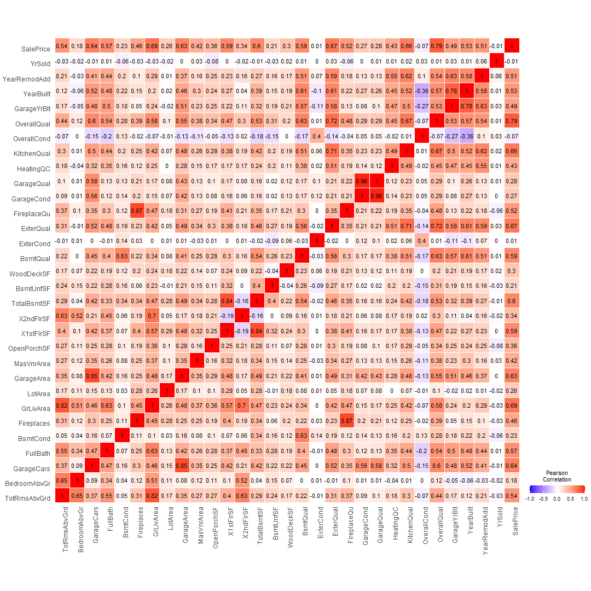

## Introduction to the problem

## Describe the data

## R Markdown

This is an R Markdown document. Markdown is a simple formatting syntax for authoring HTML, PDF, and MS Word documents. For more details on using R Markdown see <http://rmarkdown.rstudio.com>.

When you click the **Knit** button a document will be generated that includes both content as well as the output of any embedded R code chunks within the document. You can embed an R code chunk like this:

The effect of quality for the different parts of the house was analyzed through a multilinear regression. Only the following features were considered: **(BsmtQual, ExterQual, FireplaceQu, GarageQual, HeatingQC, KitchenQual)**.
The results of this regressions are seen in the table below, which had a R-squared value equal to **65.1 %**

