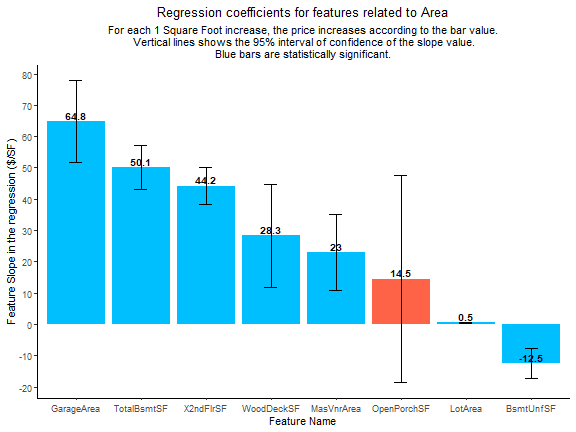

## 1. Introduction

House prices are commonly known to be influenced by the house area, the preservation of the rooms and the overall quality of the construction. However, other not so intuitive factors may play a hand in the pricing of the house. Some of these factors may include the proximity to a railroad, the shape of the property, the material of the road that leads to the house and many others.

The aim of this notebook is to analyze the main factors impacting the house prices in the city of Ames as well as predict their values using machine learning models.

The data is obtained from a kaggle competition available at ([House Prices](https://www.kaggle.com/c/house-prices-advanced-regression-techniques/overview)). The data contains a total of **79 variables** explaining different aspects of the homes. The data is divided into a **training dataset of 1460 observations** with information about the price and a **validation dataset of 1459 observations**, where the prices are unknown. This objective is to predict the validation dataset prices and submit them to kaggle, which will then rank the submissions sent by different people.

The metric used to rank the different submissions was the root mean squared logarithm error (RMSLE - the RMSE between the logarithm of the predicted value and the logarithm of the observed price), which means that errors in predicting expensive and cheap houses will affect the result equally.

## 2. Processing the data

The raw data which was collected directly from the csv files is shown below. For more information about the meaning of each variable, check the README file available at the [github repository](https://github.com/Brandevin/Project_Real_State). 

The data contains information about the area, quality and condition of different rooms, the number of rooms, the styles and materials of house components, the neighborhood, the type of house, the type and date of sale and many others.

<table class="table table-striped table-hover table-condensed" style="margin-left: auto; margin-right: auto;">
 <thead>
  <tr>
   <th style="text-align:right;position: sticky; top:0; background-color: #FFFFFF;position: sticky; top:0; background-color: #FFFFFF;"> Id </th>
   <th style="text-align:right;position: sticky; top:0; background-color: #FFFFFF;position: sticky; top:0; background-color: #FFFFFF;"> MSSubClass </th>
   <th style="text-align:left;position: sticky; top:0; background-color: #FFFFFF;position: sticky; top:0; background-color: #FFFFFF;"> MSZoning </th>
   <th style="text-align:right;position: sticky; top:0; background-color: #FFFFFF;position: sticky; top:0; background-color: #FFFFFF;"> LotFrontage </th>
   <th style="text-align:right;position: sticky; top:0; background-color: #FFFFFF;position: sticky; top:0; background-color: #FFFFFF;"> LotArea </th>
   <th style="text-align:left;position: sticky; top:0; background-color: #FFFFFF;position: sticky; top:0; background-color: #FFFFFF;"> Street </th>
   <th style="text-align:left;position: sticky; top:0; background-color: #FFFFFF;position: sticky; top:0; background-color: #FFFFFF;"> Alley </th>
   <th style="text-align:left;position: sticky; top:0; background-color: #FFFFFF;position: sticky; top:0; background-color: #FFFFFF;"> LotShape </th>
   <th style="text-align:left;position: sticky; top:0; background-color: #FFFFFF;position: sticky; top:0; background-color: #FFFFFF;"> LandContour </th>
   <th style="text-align:left;position: sticky; top:0; background-color: #FFFFFF;position: sticky; top:0; background-color: #FFFFFF;"> Utilities </th>
   <th style="text-align:left;position: sticky; top:0; background-color: #FFFFFF;position: sticky; top:0; background-color: #FFFFFF;"> LotConfig </th>
   <th style="text-align:left;position: sticky; top:0; background-color: #FFFFFF;position: sticky; top:0; background-color: #FFFFFF;"> LandSlope </th>
   <th style="text-align:left;position: sticky; top:0; background-color: #FFFFFF;position: sticky; top:0; background-color: #FFFFFF;"> Neighborhood </th>
   <th style="text-align:left;position: sticky; top:0; background-color: #FFFFFF;position: sticky; top:0; background-color: #FFFFFF;"> Condition1 </th>
   <th style="text-align:left;position: sticky; top:0; background-color: #FFFFFF;position: sticky; top:0; background-color: #FFFFFF;"> Condition2 </th>
   <th style="text-align:left;position: sticky; top:0; background-color: #FFFFFF;position: sticky; top:0; background-color: #FFFFFF;"> BldgType </th>
   <th style="text-align:left;position: sticky; top:0; background-color: #FFFFFF;position: sticky; top:0; background-color: #FFFFFF;"> HouseStyle </th>
   <th style="text-align:right;position: sticky; top:0; background-color: #FFFFFF;position: sticky; top:0; background-color: #FFFFFF;"> OverallQual </th>
   <th style="text-align:right;position: sticky; top:0; background-color: #FFFFFF;position: sticky; top:0; background-color: #FFFFFF;"> OverallCond </th>
   <th style="text-align:right;position: sticky; top:0; background-color: #FFFFFF;position: sticky; top:0; background-color: #FFFFFF;"> YearBuilt </th>
   <th style="text-align:right;position: sticky; top:0; background-color: #FFFFFF;position: sticky; top:0; background-color: #FFFFFF;"> YearRemodAdd </th>
   <th style="text-align:left;position: sticky; top:0; background-color: #FFFFFF;position: sticky; top:0; background-color: #FFFFFF;"> RoofStyle </th>
   <th style="text-align:left;position: sticky; top:0; background-color: #FFFFFF;position: sticky; top:0; background-color: #FFFFFF;"> RoofMatl </th>
   <th style="text-align:left;position: sticky; top:0; background-color: #FFFFFF;position: sticky; top:0; background-color: #FFFFFF;"> Exterior1st </th>
   <th style="text-align:left;position: sticky; top:0; background-color: #FFFFFF;position: sticky; top:0; background-color: #FFFFFF;"> Exterior2nd </th>
   <th style="text-align:left;position: sticky; top:0; background-color: #FFFFFF;position: sticky; top:0; background-color: #FFFFFF;"> MasVnrType </th>
   <th style="text-align:right;position: sticky; top:0; background-color: #FFFFFF;position: sticky; top:0; background-color: #FFFFFF;"> MasVnrArea </th>
   <th style="text-align:left;position: sticky; top:0; background-color: #FFFFFF;position: sticky; top:0; background-color: #FFFFFF;"> ExterQual </th>
   <th style="text-align:left;position: sticky; top:0; background-color: #FFFFFF;position: sticky; top:0; background-color: #FFFFFF;"> ExterCond </th>
   <th style="text-align:left;position: sticky; top:0; background-color: #FFFFFF;position: sticky; top:0; background-color: #FFFFFF;"> Foundation </th>
   <th style="text-align:left;position: sticky; top:0; background-color: #FFFFFF;position: sticky; top:0; background-color: #FFFFFF;"> BsmtQual </th>
   <th style="text-align:left;position: sticky; top:0; background-color: #FFFFFF;position: sticky; top:0; background-color: #FFFFFF;"> BsmtCond </th>
   <th style="text-align:left;position: sticky; top:0; background-color: #FFFFFF;position: sticky; top:0; background-color: #FFFFFF;"> BsmtExposure </th>
   <th style="text-align:left;position: sticky; top:0; background-color: #FFFFFF;position: sticky; top:0; background-color: #FFFFFF;"> BsmtFinType1 </th>
   <th style="text-align:right;position: sticky; top:0; background-color: #FFFFFF;position: sticky; top:0; background-color: #FFFFFF;"> BsmtFinSF1 </th>
   <th style="text-align:left;position: sticky; top:0; background-color: #FFFFFF;position: sticky; top:0; background-color: #FFFFFF;"> BsmtFinType2 </th>
   <th style="text-align:right;position: sticky; top:0; background-color: #FFFFFF;position: sticky; top:0; background-color: #FFFFFF;"> BsmtFinSF2 </th>
   <th style="text-align:right;position: sticky; top:0; background-color: #FFFFFF;position: sticky; top:0; background-color: #FFFFFF;"> BsmtUnfSF </th>
   <th style="text-align:right;position: sticky; top:0; background-color: #FFFFFF;position: sticky; top:0; background-color: #FFFFFF;"> TotalBsmtSF </th>
   <th style="text-align:left;position: sticky; top:0; background-color: #FFFFFF;position: sticky; top:0; background-color: #FFFFFF;"> Heating </th>
   <th style="text-align:left;position: sticky; top:0; background-color: #FFFFFF;position: sticky; top:0; background-color: #FFFFFF;"> HeatingQC </th>
   <th style="text-align:left;position: sticky; top:0; background-color: #FFFFFF;position: sticky; top:0; background-color: #FFFFFF;"> CentralAir </th>
   <th style="text-align:left;position: sticky; top:0; background-color: #FFFFFF;position: sticky; top:0; background-color: #FFFFFF;"> Electrical </th>
   <th style="text-align:right;position: sticky; top:0; background-color: #FFFFFF;position: sticky; top:0; background-color: #FFFFFF;"> X1stFlrSF </th>
   <th style="text-align:right;position: sticky; top:0; background-color: #FFFFFF;position: sticky; top:0; background-color: #FFFFFF;"> X2ndFlrSF </th>
   <th style="text-align:right;position: sticky; top:0; background-color: #FFFFFF;position: sticky; top:0; background-color: #FFFFFF;"> LowQualFinSF </th>
   <th style="text-align:right;position: sticky; top:0; background-color: #FFFFFF;position: sticky; top:0; background-color: #FFFFFF;"> GrLivArea </th>
   <th style="text-align:right;position: sticky; top:0; background-color: #FFFFFF;position: sticky; top:0; background-color: #FFFFFF;"> BsmtFullBath </th>
   <th style="text-align:right;position: sticky; top:0; background-color: #FFFFFF;position: sticky; top:0; background-color: #FFFFFF;"> BsmtHalfBath </th>
   <th style="text-align:right;position: sticky; top:0; background-color: #FFFFFF;position: sticky; top:0; background-color: #FFFFFF;"> FullBath </th>
   <th style="text-align:right;position: sticky; top:0; background-color: #FFFFFF;position: sticky; top:0; background-color: #FFFFFF;"> HalfBath </th>
   <th style="text-align:right;position: sticky; top:0; background-color: #FFFFFF;position: sticky; top:0; background-color: #FFFFFF;"> BedroomAbvGr </th>
   <th style="text-align:right;position: sticky; top:0; background-color: #FFFFFF;position: sticky; top:0; background-color: #FFFFFF;"> KitchenAbvGr </th>
   <th style="text-align:left;position: sticky; top:0; background-color: #FFFFFF;position: sticky; top:0; background-color: #FFFFFF;"> KitchenQual </th>
   <th style="text-align:right;position: sticky; top:0; background-color: #FFFFFF;position: sticky; top:0; background-color: #FFFFFF;"> TotRmsAbvGrd </th>
   <th style="text-align:left;position: sticky; top:0; background-color: #FFFFFF;position: sticky; top:0; background-color: #FFFFFF;"> Functional </th>
   <th style="text-align:right;position: sticky; top:0; background-color: #FFFFFF;position: sticky; top:0; background-color: #FFFFFF;"> Fireplaces </th>
   <th style="text-align:left;position: sticky; top:0; background-color: #FFFFFF;position: sticky; top:0; background-color: #FFFFFF;"> FireplaceQu </th>
   <th style="text-align:left;position: sticky; top:0; background-color: #FFFFFF;position: sticky; top:0; background-color: #FFFFFF;"> GarageType </th>
   <th style="text-align:right;position: sticky; top:0; background-color: #FFFFFF;position: sticky; top:0; background-color: #FFFFFF;"> GarageYrBlt </th>
   <th style="text-align:left;position: sticky; top:0; background-color: #FFFFFF;position: sticky; top:0; background-color: #FFFFFF;"> GarageFinish </th>
   <th style="text-align:right;position: sticky; top:0; background-color: #FFFFFF;position: sticky; top:0; background-color: #FFFFFF;"> GarageCars </th>
   <th style="text-align:right;position: sticky; top:0; background-color: #FFFFFF;position: sticky; top:0; background-color: #FFFFFF;"> GarageArea </th>
   <th style="text-align:left;position: sticky; top:0; background-color: #FFFFFF;position: sticky; top:0; background-color: #FFFFFF;"> GarageQual </th>
   <th style="text-align:left;position: sticky; top:0; background-color: #FFFFFF;position: sticky; top:0; background-color: #FFFFFF;"> GarageCond </th>
   <th style="text-align:left;position: sticky; top:0; background-color: #FFFFFF;position: sticky; top:0; background-color: #FFFFFF;"> PavedDrive </th>
   <th style="text-align:right;position: sticky; top:0; background-color: #FFFFFF;position: sticky; top:0; background-color: #FFFFFF;"> WoodDeckSF </th>
   <th style="text-align:right;position: sticky; top:0; background-color: #FFFFFF;position: sticky; top:0; background-color: #FFFFFF;"> OpenPorchSF </th>
   <th style="text-align:right;position: sticky; top:0; background-color: #FFFFFF;position: sticky; top:0; background-color: #FFFFFF;"> EnclosedPorch </th>
   <th style="text-align:right;position: sticky; top:0; background-color: #FFFFFF;position: sticky; top:0; background-color: #FFFFFF;"> X3SsnPorch </th>
   <th style="text-align:right;position: sticky; top:0; background-color: #FFFFFF;position: sticky; top:0; background-color: #FFFFFF;"> ScreenPorch </th>
   <th style="text-align:right;position: sticky; top:0; background-color: #FFFFFF;position: sticky; top:0; background-color: #FFFFFF;"> PoolArea </th>
   <th style="text-align:left;position: sticky; top:0; background-color: #FFFFFF;position: sticky; top:0; background-color: #FFFFFF;"> PoolQC </th>
   <th style="text-align:left;position: sticky; top:0; background-color: #FFFFFF;position: sticky; top:0; background-color: #FFFFFF;"> Fence </th>
   <th style="text-align:left;position: sticky; top:0; background-color: #FFFFFF;position: sticky; top:0; background-color: #FFFFFF;"> MiscFeature </th>
   <th style="text-align:right;position: sticky; top:0; background-color: #FFFFFF;position: sticky; top:0; background-color: #FFFFFF;"> MiscVal </th>
   <th style="text-align:right;position: sticky; top:0; background-color: #FFFFFF;position: sticky; top:0; background-color: #FFFFFF;"> MoSold </th>
   <th style="text-align:right;position: sticky; top:0; background-color: #FFFFFF;position: sticky; top:0; background-color: #FFFFFF;"> YrSold </th>
   <th style="text-align:left;position: sticky; top:0; background-color: #FFFFFF;position: sticky; top:0; background-color: #FFFFFF;"> SaleType </th>
   <th style="text-align:left;position: sticky; top:0; background-color: #FFFFFF;position: sticky; top:0; background-color: #FFFFFF;"> SaleCondition </th>
   <th style="text-align:right;position: sticky; top:0; background-color: #FFFFFF;position: sticky; top:0; background-color: #FFFFFF;"> SalePrice </th>
  </tr>
 </thead>
<tbody>
  <tr>
   <td style="text-align:right;"> 1422 </td>
   <td style="text-align:right;"> 120 </td>
   <td style="text-align:left;"> RL </td>
   <td style="text-align:right;"> 53 </td>
   <td style="text-align:right;"> 4043 </td>
   <td style="text-align:left;"> Pave </td>
   <td style="text-align:left;"> NA </td>
   <td style="text-align:left;"> Reg </td>
   <td style="text-align:left;"> Lvl </td>
   <td style="text-align:left;"> AllPub </td>
   <td style="text-align:left;"> Inside </td>
   <td style="text-align:left;"> Gtl </td>
   <td style="text-align:left;"> NPkVill </td>
   <td style="text-align:left;"> Norm </td>
   <td style="text-align:left;"> Norm </td>
   <td style="text-align:left;"> TwnhsE </td>
   <td style="text-align:left;"> 1Story </td>
   <td style="text-align:right;"> 6 </td>
   <td style="text-align:right;"> 5 </td>
   <td style="text-align:right;"> 1977 </td>
   <td style="text-align:right;"> 1977 </td>
   <td style="text-align:left;"> Gable </td>
   <td style="text-align:left;"> CompShg </td>
   <td style="text-align:left;"> Plywood </td>
   <td style="text-align:left;"> Plywood </td>
   <td style="text-align:left;"> None </td>
   <td style="text-align:right;"> 0 </td>
   <td style="text-align:left;"> TA </td>
   <td style="text-align:left;"> TA </td>
   <td style="text-align:left;"> CBlock </td>
   <td style="text-align:left;"> Gd </td>
   <td style="text-align:left;"> TA </td>
   <td style="text-align:left;"> No </td>
   <td style="text-align:left;"> ALQ </td>
   <td style="text-align:right;"> 360 </td>
   <td style="text-align:left;"> Unf </td>
   <td style="text-align:right;"> 0 </td>
   <td style="text-align:right;"> 709 </td>
   <td style="text-align:right;"> 1069 </td>
   <td style="text-align:left;"> GasA </td>
   <td style="text-align:left;"> TA </td>
   <td style="text-align:left;"> Y </td>
   <td style="text-align:left;"> SBrkr </td>
   <td style="text-align:right;"> 1069 </td>
   <td style="text-align:right;"> 0 </td>
   <td style="text-align:right;"> 0 </td>
   <td style="text-align:right;"> 1069 </td>
   <td style="text-align:right;"> 0 </td>
   <td style="text-align:right;"> 0 </td>
   <td style="text-align:right;"> 2 </td>
   <td style="text-align:right;"> 0 </td>
   <td style="text-align:right;"> 2 </td>
   <td style="text-align:right;"> 1 </td>
   <td style="text-align:left;"> TA </td>
   <td style="text-align:right;"> 4 </td>
   <td style="text-align:left;"> Typ </td>
   <td style="text-align:right;"> 1 </td>
   <td style="text-align:left;"> Fa </td>
   <td style="text-align:left;"> Attchd </td>
   <td style="text-align:right;"> 1977 </td>
   <td style="text-align:left;"> RFn </td>
   <td style="text-align:right;"> 2 </td>
   <td style="text-align:right;"> 440 </td>
   <td style="text-align:left;"> TA </td>
   <td style="text-align:left;"> TA </td>
   <td style="text-align:left;"> Y </td>
   <td style="text-align:right;"> 0 </td>
   <td style="text-align:right;"> 55 </td>
   <td style="text-align:right;"> 0 </td>
   <td style="text-align:right;"> 0 </td>
   <td style="text-align:right;"> 165 </td>
   <td style="text-align:right;"> 0 </td>
   <td style="text-align:left;"> NA </td>
   <td style="text-align:left;"> NA </td>
   <td style="text-align:left;"> NA </td>
   <td style="text-align:right;"> 0 </td>
   <td style="text-align:right;"> 7 </td>
   <td style="text-align:right;"> 2010 </td>
   <td style="text-align:left;"> WD </td>
   <td style="text-align:left;"> Normal </td>
   <td style="text-align:right;"> 127500 </td>
  </tr>
  <tr>
   <td style="text-align:right;"> 1017 </td>
   <td style="text-align:right;"> 20 </td>
   <td style="text-align:left;"> RL </td>
   <td style="text-align:right;"> 73 </td>
   <td style="text-align:right;"> 11883 </td>
   <td style="text-align:left;"> Pave </td>
   <td style="text-align:left;"> NA </td>
   <td style="text-align:left;"> Reg </td>
   <td style="text-align:left;"> Lvl </td>
   <td style="text-align:left;"> AllPub </td>
   <td style="text-align:left;"> Inside </td>
   <td style="text-align:left;"> Gtl </td>
   <td style="text-align:left;"> CollgCr </td>
   <td style="text-align:left;"> Norm </td>
   <td style="text-align:left;"> Norm </td>
   <td style="text-align:left;"> 1Fam </td>
   <td style="text-align:left;"> 1Story </td>
   <td style="text-align:right;"> 7 </td>
   <td style="text-align:right;"> 5 </td>
   <td style="text-align:right;"> 1996 </td>
   <td style="text-align:right;"> 1996 </td>
   <td style="text-align:left;"> Hip </td>
   <td style="text-align:left;"> CompShg </td>
   <td style="text-align:left;"> VinylSd </td>
   <td style="text-align:left;"> VinylSd </td>
   <td style="text-align:left;"> BrkFace </td>
   <td style="text-align:right;"> 196 </td>
   <td style="text-align:left;"> Gd </td>
   <td style="text-align:left;"> TA </td>
   <td style="text-align:left;"> PConc </td>
   <td style="text-align:left;"> Gd </td>
   <td style="text-align:left;"> TA </td>
   <td style="text-align:left;"> Gd </td>
   <td style="text-align:left;"> GLQ </td>
   <td style="text-align:right;"> 690 </td>
   <td style="text-align:left;"> Unf </td>
   <td style="text-align:right;"> 0 </td>
   <td style="text-align:right;"> 814 </td>
   <td style="text-align:right;"> 1504 </td>
   <td style="text-align:left;"> GasA </td>
   <td style="text-align:left;"> Ex </td>
   <td style="text-align:left;"> Y </td>
   <td style="text-align:left;"> SBrkr </td>
   <td style="text-align:right;"> 1504 </td>
   <td style="text-align:right;"> 0 </td>
   <td style="text-align:right;"> 0 </td>
   <td style="text-align:right;"> 1504 </td>
   <td style="text-align:right;"> 1 </td>
   <td style="text-align:right;"> 0 </td>
   <td style="text-align:right;"> 2 </td>
   <td style="text-align:right;"> 0 </td>
   <td style="text-align:right;"> 3 </td>
   <td style="text-align:right;"> 1 </td>
   <td style="text-align:left;"> Gd </td>
   <td style="text-align:right;"> 6 </td>
   <td style="text-align:left;"> Typ </td>
   <td style="text-align:right;"> 1 </td>
   <td style="text-align:left;"> TA </td>
   <td style="text-align:left;"> Attchd </td>
   <td style="text-align:right;"> 1996 </td>
   <td style="text-align:left;"> Fin </td>
   <td style="text-align:right;"> 2 </td>
   <td style="text-align:right;"> 478 </td>
   <td style="text-align:left;"> TA </td>
   <td style="text-align:left;"> TA </td>
   <td style="text-align:left;"> Y </td>
   <td style="text-align:right;"> 115 </td>
   <td style="text-align:right;"> 66 </td>
   <td style="text-align:right;"> 0 </td>
   <td style="text-align:right;"> 0 </td>
   <td style="text-align:right;"> 0 </td>
   <td style="text-align:right;"> 0 </td>
   <td style="text-align:left;"> NA </td>
   <td style="text-align:left;"> NA </td>
   <td style="text-align:left;"> NA </td>
   <td style="text-align:right;"> 0 </td>
   <td style="text-align:right;"> 6 </td>
   <td style="text-align:right;"> 2009 </td>
   <td style="text-align:left;"> WD </td>
   <td style="text-align:left;"> Normal </td>
   <td style="text-align:right;"> 203000 </td>
  </tr>
  <tr>
   <td style="text-align:right;"> 679 </td>
   <td style="text-align:right;"> 20 </td>
   <td style="text-align:left;"> RL </td>
   <td style="text-align:right;"> 80 </td>
   <td style="text-align:right;"> 11844 </td>
   <td style="text-align:left;"> Pave </td>
   <td style="text-align:left;"> NA </td>
   <td style="text-align:left;"> IR1 </td>
   <td style="text-align:left;"> Lvl </td>
   <td style="text-align:left;"> AllPub </td>
   <td style="text-align:left;"> Inside </td>
   <td style="text-align:left;"> Gtl </td>
   <td style="text-align:left;"> StoneBr </td>
   <td style="text-align:left;"> Norm </td>
   <td style="text-align:left;"> Norm </td>
   <td style="text-align:left;"> 1Fam </td>
   <td style="text-align:left;"> 1Story </td>
   <td style="text-align:right;"> 8 </td>
   <td style="text-align:right;"> 5 </td>
   <td style="text-align:right;"> 2008 </td>
   <td style="text-align:right;"> 2008 </td>
   <td style="text-align:left;"> Hip </td>
   <td style="text-align:left;"> CompShg </td>
   <td style="text-align:left;"> VinylSd </td>
   <td style="text-align:left;"> VinylSd </td>
   <td style="text-align:left;"> Stone </td>
   <td style="text-align:right;"> 464 </td>
   <td style="text-align:left;"> Gd </td>
   <td style="text-align:left;"> TA </td>
   <td style="text-align:left;"> PConc </td>
   <td style="text-align:left;"> Ex </td>
   <td style="text-align:left;"> TA </td>
   <td style="text-align:left;"> Mn </td>
   <td style="text-align:left;"> Unf </td>
   <td style="text-align:right;"> 0 </td>
   <td style="text-align:left;"> Unf </td>
   <td style="text-align:right;"> 0 </td>
   <td style="text-align:right;"> 2046 </td>
   <td style="text-align:right;"> 2046 </td>
   <td style="text-align:left;"> GasA </td>
   <td style="text-align:left;"> Ex </td>
   <td style="text-align:left;"> Y </td>
   <td style="text-align:left;"> SBrkr </td>
   <td style="text-align:right;"> 2046 </td>
   <td style="text-align:right;"> 0 </td>
   <td style="text-align:right;"> 0 </td>
   <td style="text-align:right;"> 2046 </td>
   <td style="text-align:right;"> 0 </td>
   <td style="text-align:right;"> 0 </td>
   <td style="text-align:right;"> 2 </td>
   <td style="text-align:right;"> 1 </td>
   <td style="text-align:right;"> 3 </td>
   <td style="text-align:right;"> 1 </td>
   <td style="text-align:left;"> Gd </td>
   <td style="text-align:right;"> 7 </td>
   <td style="text-align:left;"> Typ </td>
   <td style="text-align:right;"> 1 </td>
   <td style="text-align:left;"> Gd </td>
   <td style="text-align:left;"> Attchd </td>
   <td style="text-align:right;"> 2008 </td>
   <td style="text-align:left;"> Fin </td>
   <td style="text-align:right;"> 3 </td>
   <td style="text-align:right;"> 834 </td>
   <td style="text-align:left;"> TA </td>
   <td style="text-align:left;"> TA </td>
   <td style="text-align:left;"> Y </td>
   <td style="text-align:right;"> 322 </td>
   <td style="text-align:right;"> 82 </td>
   <td style="text-align:right;"> 0 </td>
   <td style="text-align:right;"> 0 </td>
   <td style="text-align:right;"> 0 </td>
   <td style="text-align:right;"> 0 </td>
   <td style="text-align:left;"> NA </td>
   <td style="text-align:left;"> NA </td>
   <td style="text-align:left;"> NA </td>
   <td style="text-align:right;"> 0 </td>
   <td style="text-align:right;"> 7 </td>
   <td style="text-align:right;"> 2009 </td>
   <td style="text-align:left;"> New </td>
   <td style="text-align:left;"> Partial </td>
   <td style="text-align:right;"> 372500 </td>
  </tr>
  <tr>
   <td style="text-align:right;"> 129 </td>
   <td style="text-align:right;"> 60 </td>
   <td style="text-align:left;"> RL </td>
   <td style="text-align:right;"> 69 </td>
   <td style="text-align:right;"> 7590 </td>
   <td style="text-align:left;"> Pave </td>
   <td style="text-align:left;"> NA </td>
   <td style="text-align:left;"> Reg </td>
   <td style="text-align:left;"> Lvl </td>
   <td style="text-align:left;"> AllPub </td>
   <td style="text-align:left;"> Inside </td>
   <td style="text-align:left;"> Gtl </td>
   <td style="text-align:left;"> NAmes </td>
   <td style="text-align:left;"> PosN </td>
   <td style="text-align:left;"> Norm </td>
   <td style="text-align:left;"> 1Fam </td>
   <td style="text-align:left;"> 2Story </td>
   <td style="text-align:right;"> 6 </td>
   <td style="text-align:right;"> 5 </td>
   <td style="text-align:right;"> 1966 </td>
   <td style="text-align:right;"> 1966 </td>
   <td style="text-align:left;"> Gable </td>
   <td style="text-align:left;"> CompShg </td>
   <td style="text-align:left;"> VinylSd </td>
   <td style="text-align:left;"> VinylSd </td>
   <td style="text-align:left;"> BrkFace </td>
   <td style="text-align:right;"> 266 </td>
   <td style="text-align:left;"> TA </td>
   <td style="text-align:left;"> TA </td>
   <td style="text-align:left;"> CBlock </td>
   <td style="text-align:left;"> TA </td>
   <td style="text-align:left;"> TA </td>
   <td style="text-align:left;"> No </td>
   <td style="text-align:left;"> BLQ </td>
   <td style="text-align:right;"> 512 </td>
   <td style="text-align:left;"> Unf </td>
   <td style="text-align:right;"> 0 </td>
   <td style="text-align:right;"> 148 </td>
   <td style="text-align:right;"> 660 </td>
   <td style="text-align:left;"> GasA </td>
   <td style="text-align:left;"> TA </td>
   <td style="text-align:left;"> Y </td>
   <td style="text-align:left;"> SBrkr </td>
   <td style="text-align:right;"> 660 </td>
   <td style="text-align:right;"> 688 </td>
   <td style="text-align:right;"> 0 </td>
   <td style="text-align:right;"> 1348 </td>
   <td style="text-align:right;"> 0 </td>
   <td style="text-align:right;"> 0 </td>
   <td style="text-align:right;"> 1 </td>
   <td style="text-align:right;"> 1 </td>
   <td style="text-align:right;"> 3 </td>
   <td style="text-align:right;"> 1 </td>
   <td style="text-align:left;"> TA </td>
   <td style="text-align:right;"> 6 </td>
   <td style="text-align:left;"> Typ </td>
   <td style="text-align:right;"> 1 </td>
   <td style="text-align:left;"> Fa </td>
   <td style="text-align:left;"> Attchd </td>
   <td style="text-align:right;"> 1966 </td>
   <td style="text-align:left;"> RFn </td>
   <td style="text-align:right;"> 2 </td>
   <td style="text-align:right;"> 453 </td>
   <td style="text-align:left;"> TA </td>
   <td style="text-align:left;"> TA </td>
   <td style="text-align:left;"> Y </td>
   <td style="text-align:right;"> 188 </td>
   <td style="text-align:right;"> 108 </td>
   <td style="text-align:right;"> 0 </td>
   <td style="text-align:right;"> 0 </td>
   <td style="text-align:right;"> 0 </td>
   <td style="text-align:right;"> 0 </td>
   <td style="text-align:left;"> NA </td>
   <td style="text-align:left;"> NA </td>
   <td style="text-align:left;"> NA </td>
   <td style="text-align:right;"> 0 </td>
   <td style="text-align:right;"> 7 </td>
   <td style="text-align:right;"> 2006 </td>
   <td style="text-align:left;"> WD </td>
   <td style="text-align:left;"> Normal </td>
   <td style="text-align:right;"> 155000 </td>
  </tr>
  <tr>
   <td style="text-align:right;"> 930 </td>
   <td style="text-align:right;"> 60 </td>
   <td style="text-align:left;"> RL </td>
   <td style="text-align:right;"> NA </td>
   <td style="text-align:right;"> 13006 </td>
   <td style="text-align:left;"> Pave </td>
   <td style="text-align:left;"> NA </td>
   <td style="text-align:left;"> IR1 </td>
   <td style="text-align:left;"> Lvl </td>
   <td style="text-align:left;"> AllPub </td>
   <td style="text-align:left;"> Corner </td>
   <td style="text-align:left;"> Gtl </td>
   <td style="text-align:left;"> Gilbert </td>
   <td style="text-align:left;"> Norm </td>
   <td style="text-align:left;"> Norm </td>
   <td style="text-align:left;"> 1Fam </td>
   <td style="text-align:left;"> 2Story </td>
   <td style="text-align:right;"> 7 </td>
   <td style="text-align:right;"> 5 </td>
   <td style="text-align:right;"> 1997 </td>
   <td style="text-align:right;"> 1997 </td>
   <td style="text-align:left;"> Gable </td>
   <td style="text-align:left;"> CompShg </td>
   <td style="text-align:left;"> HdBoard </td>
   <td style="text-align:left;"> HdBoard </td>
   <td style="text-align:left;"> BrkFace </td>
   <td style="text-align:right;"> 285 </td>
   <td style="text-align:left;"> TA </td>
   <td style="text-align:left;"> TA </td>
   <td style="text-align:left;"> PConc </td>
   <td style="text-align:left;"> Gd </td>
   <td style="text-align:left;"> TA </td>
   <td style="text-align:left;"> No </td>
   <td style="text-align:left;"> Unf </td>
   <td style="text-align:right;"> 0 </td>
   <td style="text-align:left;"> Unf </td>
   <td style="text-align:right;"> 0 </td>
   <td style="text-align:right;"> 964 </td>
   <td style="text-align:right;"> 964 </td>
   <td style="text-align:left;"> GasA </td>
   <td style="text-align:left;"> Gd </td>
   <td style="text-align:left;"> Y </td>
   <td style="text-align:left;"> SBrkr </td>
   <td style="text-align:right;"> 993 </td>
   <td style="text-align:right;"> 1243 </td>
   <td style="text-align:right;"> 0 </td>
   <td style="text-align:right;"> 2236 </td>
   <td style="text-align:right;"> 0 </td>
   <td style="text-align:right;"> 0 </td>
   <td style="text-align:right;"> 2 </td>
   <td style="text-align:right;"> 1 </td>
   <td style="text-align:right;"> 4 </td>
   <td style="text-align:right;"> 1 </td>
   <td style="text-align:left;"> Gd </td>
   <td style="text-align:right;"> 8 </td>
   <td style="text-align:left;"> Typ </td>
   <td style="text-align:right;"> 1 </td>
   <td style="text-align:left;"> TA </td>
   <td style="text-align:left;"> BuiltIn </td>
   <td style="text-align:right;"> 1997 </td>
   <td style="text-align:left;"> Fin </td>
   <td style="text-align:right;"> 2 </td>
   <td style="text-align:right;"> 642 </td>
   <td style="text-align:left;"> TA </td>
   <td style="text-align:left;"> TA </td>
   <td style="text-align:left;"> Y </td>
   <td style="text-align:right;"> 0 </td>
   <td style="text-align:right;"> 0 </td>
   <td style="text-align:right;"> 0 </td>
   <td style="text-align:right;"> 0 </td>
   <td style="text-align:right;"> 0 </td>
   <td style="text-align:right;"> 0 </td>
   <td style="text-align:left;"> NA </td>
   <td style="text-align:left;"> NA </td>
   <td style="text-align:left;"> NA </td>
   <td style="text-align:right;"> 0 </td>
   <td style="text-align:right;"> 11 </td>
   <td style="text-align:right;"> 2006 </td>
   <td style="text-align:left;"> WD </td>
   <td style="text-align:left;"> Normal </td>
   <td style="text-align:right;"> 222000 </td>
  </tr>
  <tr>
   <td style="text-align:right;"> 471 </td>
   <td style="text-align:right;"> 120 </td>
   <td style="text-align:left;"> RL </td>
   <td style="text-align:right;"> NA </td>
   <td style="text-align:right;"> 6820 </td>
   <td style="text-align:left;"> Pave </td>
   <td style="text-align:left;"> NA </td>
   <td style="text-align:left;"> IR1 </td>
   <td style="text-align:left;"> Lvl </td>
   <td style="text-align:left;"> AllPub </td>
   <td style="text-align:left;"> Corner </td>
   <td style="text-align:left;"> Gtl </td>
   <td style="text-align:left;"> StoneBr </td>
   <td style="text-align:left;"> Norm </td>
   <td style="text-align:left;"> Norm </td>
   <td style="text-align:left;"> TwnhsE </td>
   <td style="text-align:left;"> 1Story </td>
   <td style="text-align:right;"> 8 </td>
   <td style="text-align:right;"> 5 </td>
   <td style="text-align:right;"> 1985 </td>
   <td style="text-align:right;"> 1985 </td>
   <td style="text-align:left;"> Gable </td>
   <td style="text-align:left;"> CompShg </td>
   <td style="text-align:left;"> HdBoard </td>
   <td style="text-align:left;"> HdBoard </td>
   <td style="text-align:left;"> None </td>
   <td style="text-align:right;"> 0 </td>
   <td style="text-align:left;"> Gd </td>
   <td style="text-align:left;"> TA </td>
   <td style="text-align:left;"> PConc </td>
   <td style="text-align:left;"> Gd </td>
   <td style="text-align:left;"> TA </td>
   <td style="text-align:left;"> Av </td>
   <td style="text-align:left;"> GLQ </td>
   <td style="text-align:right;"> 368 </td>
   <td style="text-align:left;"> BLQ </td>
   <td style="text-align:right;"> 1120 </td>
   <td style="text-align:right;"> 0 </td>
   <td style="text-align:right;"> 1488 </td>
   <td style="text-align:left;"> GasA </td>
   <td style="text-align:left;"> TA </td>
   <td style="text-align:left;"> Y </td>
   <td style="text-align:left;"> SBrkr </td>
   <td style="text-align:right;"> 1502 </td>
   <td style="text-align:right;"> 0 </td>
   <td style="text-align:right;"> 0 </td>
   <td style="text-align:right;"> 1502 </td>
   <td style="text-align:right;"> 1 </td>
   <td style="text-align:right;"> 0 </td>
   <td style="text-align:right;"> 1 </td>
   <td style="text-align:right;"> 1 </td>
   <td style="text-align:right;"> 1 </td>
   <td style="text-align:right;"> 1 </td>
   <td style="text-align:left;"> Gd </td>
   <td style="text-align:right;"> 4 </td>
   <td style="text-align:left;"> Typ </td>
   <td style="text-align:right;"> 0 </td>
   <td style="text-align:left;"> NA </td>
   <td style="text-align:left;"> Attchd </td>
   <td style="text-align:right;"> 1985 </td>
   <td style="text-align:left;"> RFn </td>
   <td style="text-align:right;"> 2 </td>
   <td style="text-align:right;"> 528 </td>
   <td style="text-align:left;"> TA </td>
   <td style="text-align:left;"> TA </td>
   <td style="text-align:left;"> Y </td>
   <td style="text-align:right;"> 0 </td>
   <td style="text-align:right;"> 54 </td>
   <td style="text-align:right;"> 0 </td>
   <td style="text-align:right;"> 0 </td>
   <td style="text-align:right;"> 140 </td>
   <td style="text-align:right;"> 0 </td>
   <td style="text-align:left;"> NA </td>
   <td style="text-align:left;"> NA </td>
   <td style="text-align:left;"> NA </td>
   <td style="text-align:right;"> 0 </td>
   <td style="text-align:right;"> 6 </td>
   <td style="text-align:right;"> 2010 </td>
   <td style="text-align:left;"> WD </td>
   <td style="text-align:left;"> Normal </td>
   <td style="text-align:right;"> 212000 </td>
  </tr>
  <tr>
   <td style="text-align:right;"> 299 </td>
   <td style="text-align:right;"> 60 </td>
   <td style="text-align:left;"> RL </td>
   <td style="text-align:right;"> 90 </td>
   <td style="text-align:right;"> 11700 </td>
   <td style="text-align:left;"> Pave </td>
   <td style="text-align:left;"> NA </td>
   <td style="text-align:left;"> Reg </td>
   <td style="text-align:left;"> Lvl </td>
   <td style="text-align:left;"> AllPub </td>
   <td style="text-align:left;"> Inside </td>
   <td style="text-align:left;"> Gtl </td>
   <td style="text-align:left;"> NWAmes </td>
   <td style="text-align:left;"> Norm </td>
   <td style="text-align:left;"> Norm </td>
   <td style="text-align:left;"> 1Fam </td>
   <td style="text-align:left;"> 2Story </td>
   <td style="text-align:right;"> 6 </td>
   <td style="text-align:right;"> 6 </td>
   <td style="text-align:right;"> 1968 </td>
   <td style="text-align:right;"> 1968 </td>
   <td style="text-align:left;"> Mansard </td>
   <td style="text-align:left;"> CompShg </td>
   <td style="text-align:left;"> HdBoard </td>
   <td style="text-align:left;"> AsphShn </td>
   <td style="text-align:left;"> BrkFace </td>
   <td style="text-align:right;"> 365 </td>
   <td style="text-align:left;"> Gd </td>
   <td style="text-align:left;"> TA </td>
   <td style="text-align:left;"> CBlock </td>
   <td style="text-align:left;"> TA </td>
   <td style="text-align:left;"> TA </td>
   <td style="text-align:left;"> No </td>
   <td style="text-align:left;"> ALQ </td>
   <td style="text-align:right;"> 384 </td>
   <td style="text-align:left;"> Rec </td>
   <td style="text-align:right;"> 175 </td>
   <td style="text-align:right;"> 143 </td>
   <td style="text-align:right;"> 702 </td>
   <td style="text-align:left;"> GasA </td>
   <td style="text-align:left;"> Gd </td>
   <td style="text-align:left;"> Y </td>
   <td style="text-align:left;"> SBrkr </td>
   <td style="text-align:right;"> 1041 </td>
   <td style="text-align:right;"> 702 </td>
   <td style="text-align:right;"> 0 </td>
   <td style="text-align:right;"> 1743 </td>
   <td style="text-align:right;"> 0 </td>
   <td style="text-align:right;"> 1 </td>
   <td style="text-align:right;"> 1 </td>
   <td style="text-align:right;"> 2 </td>
   <td style="text-align:right;"> 3 </td>
   <td style="text-align:right;"> 1 </td>
   <td style="text-align:left;"> TA </td>
   <td style="text-align:right;"> 7 </td>
   <td style="text-align:left;"> Typ </td>
   <td style="text-align:right;"> 1 </td>
   <td style="text-align:left;"> Gd </td>
   <td style="text-align:left;"> Attchd </td>
   <td style="text-align:right;"> 1968 </td>
   <td style="text-align:left;"> Unf </td>
   <td style="text-align:right;"> 2 </td>
   <td style="text-align:right;"> 539 </td>
   <td style="text-align:left;"> TA </td>
   <td style="text-align:left;"> TA </td>
   <td style="text-align:left;"> Y </td>
   <td style="text-align:right;"> 224 </td>
   <td style="text-align:right;"> 0 </td>
   <td style="text-align:right;"> 0 </td>
   <td style="text-align:right;"> 0 </td>
   <td style="text-align:right;"> 0 </td>
   <td style="text-align:right;"> 0 </td>
   <td style="text-align:left;"> NA </td>
   <td style="text-align:left;"> NA </td>
   <td style="text-align:left;"> NA </td>
   <td style="text-align:right;"> 0 </td>
   <td style="text-align:right;"> 6 </td>
   <td style="text-align:right;"> 2007 </td>
   <td style="text-align:left;"> WD </td>
   <td style="text-align:left;"> Normal </td>
   <td style="text-align:right;"> 175000 </td>
  </tr>
  <tr>
   <td style="text-align:right;"> 270 </td>
   <td style="text-align:right;"> 20 </td>
   <td style="text-align:left;"> RL </td>
   <td style="text-align:right;"> NA </td>
   <td style="text-align:right;"> 7917 </td>
   <td style="text-align:left;"> Pave </td>
   <td style="text-align:left;"> NA </td>
   <td style="text-align:left;"> IR1 </td>
   <td style="text-align:left;"> Lvl </td>
   <td style="text-align:left;"> AllPub </td>
   <td style="text-align:left;"> Corner </td>
   <td style="text-align:left;"> Gtl </td>
   <td style="text-align:left;"> Edwards </td>
   <td style="text-align:left;"> Norm </td>
   <td style="text-align:left;"> Norm </td>
   <td style="text-align:left;"> 1Fam </td>
   <td style="text-align:left;"> 1Story </td>
   <td style="text-align:right;"> 6 </td>
   <td style="text-align:right;"> 7 </td>
   <td style="text-align:right;"> 1976 </td>
   <td style="text-align:right;"> 1976 </td>
   <td style="text-align:left;"> Hip </td>
   <td style="text-align:left;"> CompShg </td>
   <td style="text-align:left;"> HdBoard </td>
   <td style="text-align:left;"> HdBoard </td>
   <td style="text-align:left;"> BrkFace </td>
   <td style="text-align:right;"> 174 </td>
   <td style="text-align:left;"> TA </td>
   <td style="text-align:left;"> Gd </td>
   <td style="text-align:left;"> CBlock </td>
   <td style="text-align:left;"> TA </td>
   <td style="text-align:left;"> Gd </td>
   <td style="text-align:left;"> No </td>
   <td style="text-align:left;"> BLQ </td>
   <td style="text-align:right;"> 751 </td>
   <td style="text-align:left;"> Unf </td>
   <td style="text-align:right;"> 0 </td>
   <td style="text-align:right;"> 392 </td>
   <td style="text-align:right;"> 1143 </td>
   <td style="text-align:left;"> GasA </td>
   <td style="text-align:left;"> TA </td>
   <td style="text-align:left;"> Y </td>
   <td style="text-align:left;"> SBrkr </td>
   <td style="text-align:right;"> 1113 </td>
   <td style="text-align:right;"> 0 </td>
   <td style="text-align:right;"> 0 </td>
   <td style="text-align:right;"> 1113 </td>
   <td style="text-align:right;"> 1 </td>
   <td style="text-align:right;"> 0 </td>
   <td style="text-align:right;"> 1 </td>
   <td style="text-align:right;"> 1 </td>
   <td style="text-align:right;"> 3 </td>
   <td style="text-align:right;"> 1 </td>
   <td style="text-align:left;"> TA </td>
   <td style="text-align:right;"> 6 </td>
   <td style="text-align:left;"> Typ </td>
   <td style="text-align:right;"> 1 </td>
   <td style="text-align:left;"> Fa </td>
   <td style="text-align:left;"> Attchd </td>
   <td style="text-align:right;"> 1987 </td>
   <td style="text-align:left;"> RFn </td>
   <td style="text-align:right;"> 1 </td>
   <td style="text-align:right;"> 504 </td>
   <td style="text-align:left;"> TA </td>
   <td style="text-align:left;"> Gd </td>
   <td style="text-align:left;"> Y </td>
   <td style="text-align:right;"> 370 </td>
   <td style="text-align:right;"> 30 </td>
   <td style="text-align:right;"> 0 </td>
   <td style="text-align:right;"> 0 </td>
   <td style="text-align:right;"> 0 </td>
   <td style="text-align:right;"> 0 </td>
   <td style="text-align:left;"> NA </td>
   <td style="text-align:left;"> GdPrv </td>
   <td style="text-align:left;"> NA </td>
   <td style="text-align:right;"> 0 </td>
   <td style="text-align:right;"> 5 </td>
   <td style="text-align:right;"> 2007 </td>
   <td style="text-align:left;"> WD </td>
   <td style="text-align:left;"> Normal </td>
   <td style="text-align:right;"> 148000 </td>
  </tr>
  <tr>
   <td style="text-align:right;"> 1211 </td>
   <td style="text-align:right;"> 60 </td>
   <td style="text-align:left;"> RL </td>
   <td style="text-align:right;"> 70 </td>
   <td style="text-align:right;"> 11218 </td>
   <td style="text-align:left;"> Pave </td>
   <td style="text-align:left;"> NA </td>
   <td style="text-align:left;"> Reg </td>
   <td style="text-align:left;"> Lvl </td>
   <td style="text-align:left;"> AllPub </td>
   <td style="text-align:left;"> Inside </td>
   <td style="text-align:left;"> Gtl </td>
   <td style="text-align:left;"> SawyerW </td>
   <td style="text-align:left;"> Norm </td>
   <td style="text-align:left;"> Norm </td>
   <td style="text-align:left;"> 1Fam </td>
   <td style="text-align:left;"> 2Story </td>
   <td style="text-align:right;"> 6 </td>
   <td style="text-align:right;"> 5 </td>
   <td style="text-align:right;"> 1992 </td>
   <td style="text-align:right;"> 1992 </td>
   <td style="text-align:left;"> Gable </td>
   <td style="text-align:left;"> CompShg </td>
   <td style="text-align:left;"> Wd Sdng </td>
   <td style="text-align:left;"> Wd Sdng </td>
   <td style="text-align:left;"> None </td>
   <td style="text-align:right;"> 0 </td>
   <td style="text-align:left;"> Gd </td>
   <td style="text-align:left;"> TA </td>
   <td style="text-align:left;"> PConc </td>
   <td style="text-align:left;"> Gd </td>
   <td style="text-align:left;"> TA </td>
   <td style="text-align:left;"> No </td>
   <td style="text-align:left;"> Unf </td>
   <td style="text-align:right;"> 0 </td>
   <td style="text-align:left;"> Unf </td>
   <td style="text-align:right;"> 0 </td>
   <td style="text-align:right;"> 1055 </td>
   <td style="text-align:right;"> 1055 </td>
   <td style="text-align:left;"> GasA </td>
   <td style="text-align:left;"> Ex </td>
   <td style="text-align:left;"> Y </td>
   <td style="text-align:left;"> SBrkr </td>
   <td style="text-align:right;"> 1055 </td>
   <td style="text-align:right;"> 790 </td>
   <td style="text-align:right;"> 0 </td>
   <td style="text-align:right;"> 1845 </td>
   <td style="text-align:right;"> 0 </td>
   <td style="text-align:right;"> 0 </td>
   <td style="text-align:right;"> 2 </td>
   <td style="text-align:right;"> 1 </td>
   <td style="text-align:right;"> 3 </td>
   <td style="text-align:right;"> 1 </td>
   <td style="text-align:left;"> Gd </td>
   <td style="text-align:right;"> 8 </td>
   <td style="text-align:left;"> Typ </td>
   <td style="text-align:right;"> 1 </td>
   <td style="text-align:left;"> TA </td>
   <td style="text-align:left;"> Attchd </td>
   <td style="text-align:right;"> 1992 </td>
   <td style="text-align:left;"> RFn </td>
   <td style="text-align:right;"> 2 </td>
   <td style="text-align:right;"> 462 </td>
   <td style="text-align:left;"> TA </td>
   <td style="text-align:left;"> TA </td>
   <td style="text-align:left;"> Y </td>
   <td style="text-align:right;"> 635 </td>
   <td style="text-align:right;"> 104 </td>
   <td style="text-align:right;"> 0 </td>
   <td style="text-align:right;"> 0 </td>
   <td style="text-align:right;"> 0 </td>
   <td style="text-align:right;"> 0 </td>
   <td style="text-align:left;"> NA </td>
   <td style="text-align:left;"> GdPrv </td>
   <td style="text-align:left;"> Shed </td>
   <td style="text-align:right;"> 400 </td>
   <td style="text-align:right;"> 5 </td>
   <td style="text-align:right;"> 2010 </td>
   <td style="text-align:left;"> WD </td>
   <td style="text-align:left;"> Normal </td>
   <td style="text-align:right;"> 189000 </td>
  </tr>
  <tr>
   <td style="text-align:right;"> 1331 </td>
   <td style="text-align:right;"> 20 </td>
   <td style="text-align:left;"> RL </td>
   <td style="text-align:right;"> 85 </td>
   <td style="text-align:right;"> 10000 </td>
   <td style="text-align:left;"> Pave </td>
   <td style="text-align:left;"> NA </td>
   <td style="text-align:left;"> Reg </td>
   <td style="text-align:left;"> Lvl </td>
   <td style="text-align:left;"> AllPub </td>
   <td style="text-align:left;"> Inside </td>
   <td style="text-align:left;"> Gtl </td>
   <td style="text-align:left;"> Somerst </td>
   <td style="text-align:left;"> Norm </td>
   <td style="text-align:left;"> Norm </td>
   <td style="text-align:left;"> 1Fam </td>
   <td style="text-align:left;"> 1Story </td>
   <td style="text-align:right;"> 8 </td>
   <td style="text-align:right;"> 5 </td>
   <td style="text-align:right;"> 2006 </td>
   <td style="text-align:right;"> 2006 </td>
   <td style="text-align:left;"> Hip </td>
   <td style="text-align:left;"> CompShg </td>
   <td style="text-align:left;"> VinylSd </td>
   <td style="text-align:left;"> VinylSd </td>
   <td style="text-align:left;"> Stone </td>
   <td style="text-align:right;"> 410 </td>
   <td style="text-align:left;"> Gd </td>
   <td style="text-align:left;"> TA </td>
   <td style="text-align:left;"> PConc </td>
   <td style="text-align:left;"> Gd </td>
   <td style="text-align:left;"> Gd </td>
   <td style="text-align:left;"> Av </td>
   <td style="text-align:left;"> Unf </td>
   <td style="text-align:right;"> 0 </td>
   <td style="text-align:left;"> Unf </td>
   <td style="text-align:right;"> 0 </td>
   <td style="text-align:right;"> 1588 </td>
   <td style="text-align:right;"> 1588 </td>
   <td style="text-align:left;"> GasA </td>
   <td style="text-align:left;"> Ex </td>
   <td style="text-align:left;"> Y </td>
   <td style="text-align:left;"> SBrkr </td>
   <td style="text-align:right;"> 1588 </td>
   <td style="text-align:right;"> 0 </td>
   <td style="text-align:right;"> 0 </td>
   <td style="text-align:right;"> 1588 </td>
   <td style="text-align:right;"> 0 </td>
   <td style="text-align:right;"> 0 </td>
   <td style="text-align:right;"> 2 </td>
   <td style="text-align:right;"> 0 </td>
   <td style="text-align:right;"> 3 </td>
   <td style="text-align:right;"> 1 </td>
   <td style="text-align:left;"> Gd </td>
   <td style="text-align:right;"> 7 </td>
   <td style="text-align:left;"> Typ </td>
   <td style="text-align:right;"> 1 </td>
   <td style="text-align:left;"> Gd </td>
   <td style="text-align:left;"> Attchd </td>
   <td style="text-align:right;"> 2006 </td>
   <td style="text-align:left;"> RFn </td>
   <td style="text-align:right;"> 3 </td>
   <td style="text-align:right;"> 825 </td>
   <td style="text-align:left;"> TA </td>
   <td style="text-align:left;"> TA </td>
   <td style="text-align:left;"> Y </td>
   <td style="text-align:right;"> 144 </td>
   <td style="text-align:right;"> 45 </td>
   <td style="text-align:right;"> 0 </td>
   <td style="text-align:right;"> 0 </td>
   <td style="text-align:right;"> 0 </td>
   <td style="text-align:right;"> 0 </td>
   <td style="text-align:left;"> NA </td>
   <td style="text-align:left;"> NA </td>
   <td style="text-align:left;"> NA </td>
   <td style="text-align:right;"> 0 </td>
   <td style="text-align:right;"> 12 </td>
   <td style="text-align:right;"> 2007 </td>
   <td style="text-align:left;"> WD </td>
   <td style="text-align:left;"> Normal </td>
   <td style="text-align:right;"> 227000 </td>
  </tr>
  <tr>
   <td style="text-align:right;"> 597 </td>
   <td style="text-align:right;"> 70 </td>
   <td style="text-align:left;"> RM </td>
   <td style="text-align:right;"> 60 </td>
   <td style="text-align:right;"> 3600 </td>
   <td style="text-align:left;"> Pave </td>
   <td style="text-align:left;"> Grvl </td>
   <td style="text-align:left;"> Reg </td>
   <td style="text-align:left;"> Lvl </td>
   <td style="text-align:left;"> AllPub </td>
   <td style="text-align:left;"> Inside </td>
   <td style="text-align:left;"> Gtl </td>
   <td style="text-align:left;"> OldTown </td>
   <td style="text-align:left;"> Norm </td>
   <td style="text-align:left;"> Norm </td>
   <td style="text-align:left;"> 1Fam </td>
   <td style="text-align:left;"> 2Story </td>
   <td style="text-align:right;"> 6 </td>
   <td style="text-align:right;"> 7 </td>
   <td style="text-align:right;"> 1910 </td>
   <td style="text-align:right;"> 1993 </td>
   <td style="text-align:left;"> Gable </td>
   <td style="text-align:left;"> CompShg </td>
   <td style="text-align:left;"> VinylSd </td>
   <td style="text-align:left;"> VinylSd </td>
   <td style="text-align:left;"> None </td>
   <td style="text-align:right;"> 0 </td>
   <td style="text-align:left;"> TA </td>
   <td style="text-align:left;"> TA </td>
   <td style="text-align:left;"> CBlock </td>
   <td style="text-align:left;"> TA </td>
   <td style="text-align:left;"> TA </td>
   <td style="text-align:left;"> No </td>
   <td style="text-align:left;"> Unf </td>
   <td style="text-align:right;"> 0 </td>
   <td style="text-align:left;"> Unf </td>
   <td style="text-align:right;"> 0 </td>
   <td style="text-align:right;"> 684 </td>
   <td style="text-align:right;"> 684 </td>
   <td style="text-align:left;"> GasA </td>
   <td style="text-align:left;"> Ex </td>
   <td style="text-align:left;"> N </td>
   <td style="text-align:left;"> FuseA </td>
   <td style="text-align:right;"> 684 </td>
   <td style="text-align:right;"> 684 </td>
   <td style="text-align:right;"> 0 </td>
   <td style="text-align:right;"> 1368 </td>
   <td style="text-align:right;"> 0 </td>
   <td style="text-align:right;"> 0 </td>
   <td style="text-align:right;"> 1 </td>
   <td style="text-align:right;"> 0 </td>
   <td style="text-align:right;"> 3 </td>
   <td style="text-align:right;"> 1 </td>
   <td style="text-align:left;"> TA </td>
   <td style="text-align:right;"> 7 </td>
   <td style="text-align:left;"> Typ </td>
   <td style="text-align:right;"> 0 </td>
   <td style="text-align:left;"> NA </td>
   <td style="text-align:left;"> Detchd </td>
   <td style="text-align:right;"> 1930 </td>
   <td style="text-align:left;"> Unf </td>
   <td style="text-align:right;"> 1 </td>
   <td style="text-align:right;"> 216 </td>
   <td style="text-align:left;"> TA </td>
   <td style="text-align:left;"> Fa </td>
   <td style="text-align:left;"> N </td>
   <td style="text-align:right;"> 0 </td>
   <td style="text-align:right;"> 158 </td>
   <td style="text-align:right;"> 0 </td>
   <td style="text-align:right;"> 0 </td>
   <td style="text-align:right;"> 0 </td>
   <td style="text-align:right;"> 0 </td>
   <td style="text-align:left;"> NA </td>
   <td style="text-align:left;"> NA </td>
   <td style="text-align:left;"> NA </td>
   <td style="text-align:right;"> 0 </td>
   <td style="text-align:right;"> 10 </td>
   <td style="text-align:right;"> 2006 </td>
   <td style="text-align:left;"> WD </td>
   <td style="text-align:left;"> Normal </td>
   <td style="text-align:right;"> 114504 </td>
  </tr>
  <tr>
   <td style="text-align:right;"> 1301 </td>
   <td style="text-align:right;"> 60 </td>
   <td style="text-align:left;"> RL </td>
   <td style="text-align:right;"> NA </td>
   <td style="text-align:right;"> 10762 </td>
   <td style="text-align:left;"> Pave </td>
   <td style="text-align:left;"> NA </td>
   <td style="text-align:left;"> IR1 </td>
   <td style="text-align:left;"> Lvl </td>
   <td style="text-align:left;"> AllPub </td>
   <td style="text-align:left;"> CulDSac </td>
   <td style="text-align:left;"> Gtl </td>
   <td style="text-align:left;"> Gilbert </td>
   <td style="text-align:left;"> Norm </td>
   <td style="text-align:left;"> Norm </td>
   <td style="text-align:left;"> 1Fam </td>
   <td style="text-align:left;"> 2Story </td>
   <td style="text-align:right;"> 7 </td>
   <td style="text-align:right;"> 5 </td>
   <td style="text-align:right;"> 1999 </td>
   <td style="text-align:right;"> 1999 </td>
   <td style="text-align:left;"> Gable </td>
   <td style="text-align:left;"> CompShg </td>
   <td style="text-align:left;"> VinylSd </td>
   <td style="text-align:left;"> VinylSd </td>
   <td style="text-align:left;"> None </td>
   <td style="text-align:right;"> 344 </td>
   <td style="text-align:left;"> Gd </td>
   <td style="text-align:left;"> TA </td>
   <td style="text-align:left;"> PConc </td>
   <td style="text-align:left;"> Gd </td>
   <td style="text-align:left;"> TA </td>
   <td style="text-align:left;"> No </td>
   <td style="text-align:left;"> GLQ </td>
   <td style="text-align:right;"> 694 </td>
   <td style="text-align:left;"> Unf </td>
   <td style="text-align:right;"> 0 </td>
   <td style="text-align:right;"> 284 </td>
   <td style="text-align:right;"> 978 </td>
   <td style="text-align:left;"> GasA </td>
   <td style="text-align:left;"> Ex </td>
   <td style="text-align:left;"> Y </td>
   <td style="text-align:left;"> SBrkr </td>
   <td style="text-align:right;"> 1005 </td>
   <td style="text-align:right;"> 978 </td>
   <td style="text-align:right;"> 0 </td>
   <td style="text-align:right;"> 1983 </td>
   <td style="text-align:right;"> 0 </td>
   <td style="text-align:right;"> 0 </td>
   <td style="text-align:right;"> 2 </td>
   <td style="text-align:right;"> 1 </td>
   <td style="text-align:right;"> 3 </td>
   <td style="text-align:right;"> 1 </td>
   <td style="text-align:left;"> Gd </td>
   <td style="text-align:right;"> 9 </td>
   <td style="text-align:left;"> Typ </td>
   <td style="text-align:right;"> 1 </td>
   <td style="text-align:left;"> TA </td>
   <td style="text-align:left;"> Attchd </td>
   <td style="text-align:right;"> 1999 </td>
   <td style="text-align:left;"> Fin </td>
   <td style="text-align:right;"> 2 </td>
   <td style="text-align:right;"> 490 </td>
   <td style="text-align:left;"> TA </td>
   <td style="text-align:left;"> TA </td>
   <td style="text-align:left;"> Y </td>
   <td style="text-align:right;"> 0 </td>
   <td style="text-align:right;"> 0 </td>
   <td style="text-align:right;"> 0 </td>
   <td style="text-align:right;"> 0 </td>
   <td style="text-align:right;"> 0 </td>
   <td style="text-align:right;"> 0 </td>
   <td style="text-align:left;"> NA </td>
   <td style="text-align:left;"> NA </td>
   <td style="text-align:left;"> NA </td>
   <td style="text-align:right;"> 0 </td>
   <td style="text-align:right;"> 5 </td>
   <td style="text-align:right;"> 2009 </td>
   <td style="text-align:left;"> WD </td>
   <td style="text-align:left;"> Normal </td>
   <td style="text-align:right;"> 225000 </td>
  </tr>
  <tr>
   <td style="text-align:right;"> 330 </td>
   <td style="text-align:right;"> 70 </td>
   <td style="text-align:left;"> RM </td>
   <td style="text-align:right;"> 60 </td>
   <td style="text-align:right;"> 6402 </td>
   <td style="text-align:left;"> Pave </td>
   <td style="text-align:left;"> NA </td>
   <td style="text-align:left;"> Reg </td>
   <td style="text-align:left;"> Lvl </td>
   <td style="text-align:left;"> AllPub </td>
   <td style="text-align:left;"> Corner </td>
   <td style="text-align:left;"> Gtl </td>
   <td style="text-align:left;"> IDOTRR </td>
   <td style="text-align:left;"> Norm </td>
   <td style="text-align:left;"> Norm </td>
   <td style="text-align:left;"> 1Fam </td>
   <td style="text-align:left;"> 2Story </td>
   <td style="text-align:right;"> 5 </td>
   <td style="text-align:right;"> 5 </td>
   <td style="text-align:right;"> 1920 </td>
   <td style="text-align:right;"> 1950 </td>
   <td style="text-align:left;"> Gable </td>
   <td style="text-align:left;"> CompShg </td>
   <td style="text-align:left;"> Wd Sdng </td>
   <td style="text-align:left;"> Wd Shng </td>
   <td style="text-align:left;"> None </td>
   <td style="text-align:right;"> 0 </td>
   <td style="text-align:left;"> TA </td>
   <td style="text-align:left;"> TA </td>
   <td style="text-align:left;"> PConc </td>
   <td style="text-align:left;"> TA </td>
   <td style="text-align:left;"> TA </td>
   <td style="text-align:left;"> Mn </td>
   <td style="text-align:left;"> Unf </td>
   <td style="text-align:right;"> 0 </td>
   <td style="text-align:left;"> Unf </td>
   <td style="text-align:right;"> 0 </td>
   <td style="text-align:right;"> 596 </td>
   <td style="text-align:right;"> 596 </td>
   <td style="text-align:left;"> GasA </td>
   <td style="text-align:left;"> TA </td>
   <td style="text-align:left;"> N </td>
   <td style="text-align:left;"> SBrkr </td>
   <td style="text-align:right;"> 596 </td>
   <td style="text-align:right;"> 596 </td>
   <td style="text-align:right;"> 0 </td>
   <td style="text-align:right;"> 1192 </td>
   <td style="text-align:right;"> 0 </td>
   <td style="text-align:right;"> 0 </td>
   <td style="text-align:right;"> 1 </td>
   <td style="text-align:right;"> 0 </td>
   <td style="text-align:right;"> 3 </td>
   <td style="text-align:right;"> 1 </td>
   <td style="text-align:left;"> TA </td>
   <td style="text-align:right;"> 6 </td>
   <td style="text-align:left;"> Typ </td>
   <td style="text-align:right;"> 0 </td>
   <td style="text-align:left;"> NA </td>
   <td style="text-align:left;"> Detchd </td>
   <td style="text-align:right;"> 1920 </td>
   <td style="text-align:left;"> Unf </td>
   <td style="text-align:right;"> 1 </td>
   <td style="text-align:right;"> 189 </td>
   <td style="text-align:left;"> Fa </td>
   <td style="text-align:left;"> Fa </td>
   <td style="text-align:left;"> N </td>
   <td style="text-align:right;"> 0 </td>
   <td style="text-align:right;"> 0 </td>
   <td style="text-align:right;"> 137 </td>
   <td style="text-align:right;"> 0 </td>
   <td style="text-align:right;"> 0 </td>
   <td style="text-align:right;"> 0 </td>
   <td style="text-align:left;"> NA </td>
   <td style="text-align:left;"> GdWo </td>
   <td style="text-align:left;"> NA </td>
   <td style="text-align:right;"> 0 </td>
   <td style="text-align:right;"> 7 </td>
   <td style="text-align:right;"> 2009 </td>
   <td style="text-align:left;"> WD </td>
   <td style="text-align:left;"> Normal </td>
   <td style="text-align:right;"> 78000 </td>
  </tr>
  <tr>
   <td style="text-align:right;"> 37 </td>
   <td style="text-align:right;"> 20 </td>
   <td style="text-align:left;"> RL </td>
   <td style="text-align:right;"> 112 </td>
   <td style="text-align:right;"> 10859 </td>
   <td style="text-align:left;"> Pave </td>
   <td style="text-align:left;"> NA </td>
   <td style="text-align:left;"> Reg </td>
   <td style="text-align:left;"> Lvl </td>
   <td style="text-align:left;"> AllPub </td>
   <td style="text-align:left;"> Corner </td>
   <td style="text-align:left;"> Gtl </td>
   <td style="text-align:left;"> CollgCr </td>
   <td style="text-align:left;"> Norm </td>
   <td style="text-align:left;"> Norm </td>
   <td style="text-align:left;"> 1Fam </td>
   <td style="text-align:left;"> 1Story </td>
   <td style="text-align:right;"> 5 </td>
   <td style="text-align:right;"> 5 </td>
   <td style="text-align:right;"> 1994 </td>
   <td style="text-align:right;"> 1995 </td>
   <td style="text-align:left;"> Gable </td>
   <td style="text-align:left;"> CompShg </td>
   <td style="text-align:left;"> VinylSd </td>
   <td style="text-align:left;"> VinylSd </td>
   <td style="text-align:left;"> None </td>
   <td style="text-align:right;"> 0 </td>
   <td style="text-align:left;"> TA </td>
   <td style="text-align:left;"> TA </td>
   <td style="text-align:left;"> PConc </td>
   <td style="text-align:left;"> Gd </td>
   <td style="text-align:left;"> TA </td>
   <td style="text-align:left;"> No </td>
   <td style="text-align:left;"> Unf </td>
   <td style="text-align:right;"> 0 </td>
   <td style="text-align:left;"> Unf </td>
   <td style="text-align:right;"> 0 </td>
   <td style="text-align:right;"> 1097 </td>
   <td style="text-align:right;"> 1097 </td>
   <td style="text-align:left;"> GasA </td>
   <td style="text-align:left;"> Ex </td>
   <td style="text-align:left;"> Y </td>
   <td style="text-align:left;"> SBrkr </td>
   <td style="text-align:right;"> 1097 </td>
   <td style="text-align:right;"> 0 </td>
   <td style="text-align:right;"> 0 </td>
   <td style="text-align:right;"> 1097 </td>
   <td style="text-align:right;"> 0 </td>
   <td style="text-align:right;"> 0 </td>
   <td style="text-align:right;"> 1 </td>
   <td style="text-align:right;"> 1 </td>
   <td style="text-align:right;"> 3 </td>
   <td style="text-align:right;"> 1 </td>
   <td style="text-align:left;"> TA </td>
   <td style="text-align:right;"> 6 </td>
   <td style="text-align:left;"> Typ </td>
   <td style="text-align:right;"> 0 </td>
   <td style="text-align:left;"> NA </td>
   <td style="text-align:left;"> Attchd </td>
   <td style="text-align:right;"> 1995 </td>
   <td style="text-align:left;"> Unf </td>
   <td style="text-align:right;"> 2 </td>
   <td style="text-align:right;"> 672 </td>
   <td style="text-align:left;"> TA </td>
   <td style="text-align:left;"> TA </td>
   <td style="text-align:left;"> Y </td>
   <td style="text-align:right;"> 392 </td>
   <td style="text-align:right;"> 64 </td>
   <td style="text-align:right;"> 0 </td>
   <td style="text-align:right;"> 0 </td>
   <td style="text-align:right;"> 0 </td>
   <td style="text-align:right;"> 0 </td>
   <td style="text-align:left;"> NA </td>
   <td style="text-align:left;"> NA </td>
   <td style="text-align:left;"> NA </td>
   <td style="text-align:right;"> 0 </td>
   <td style="text-align:right;"> 6 </td>
   <td style="text-align:right;"> 2009 </td>
   <td style="text-align:left;"> WD </td>
   <td style="text-align:left;"> Normal </td>
   <td style="text-align:right;"> 145000 </td>
  </tr>
  <tr>
   <td style="text-align:right;"> 1129 </td>
   <td style="text-align:right;"> 60 </td>
   <td style="text-align:left;"> RL </td>
   <td style="text-align:right;"> 59 </td>
   <td style="text-align:right;"> 11796 </td>
   <td style="text-align:left;"> Pave </td>
   <td style="text-align:left;"> NA </td>
   <td style="text-align:left;"> IR1 </td>
   <td style="text-align:left;"> Lvl </td>
   <td style="text-align:left;"> AllPub </td>
   <td style="text-align:left;"> Inside </td>
   <td style="text-align:left;"> Gtl </td>
   <td style="text-align:left;"> Gilbert </td>
   <td style="text-align:left;"> Norm </td>
   <td style="text-align:left;"> Norm </td>
   <td style="text-align:left;"> 1Fam </td>
   <td style="text-align:left;"> 2Story </td>
   <td style="text-align:right;"> 7 </td>
   <td style="text-align:right;"> 5 </td>
   <td style="text-align:right;"> 2004 </td>
   <td style="text-align:right;"> 2005 </td>
   <td style="text-align:left;"> Gable </td>
   <td style="text-align:left;"> CompShg </td>
   <td style="text-align:left;"> VinylSd </td>
   <td style="text-align:left;"> VinylSd </td>
   <td style="text-align:left;"> None </td>
   <td style="text-align:right;"> 0 </td>
   <td style="text-align:left;"> Gd </td>
   <td style="text-align:left;"> TA </td>
   <td style="text-align:left;"> PConc </td>
   <td style="text-align:left;"> Gd </td>
   <td style="text-align:left;"> TA </td>
   <td style="text-align:left;"> Av </td>
   <td style="text-align:left;"> Unf </td>
   <td style="text-align:right;"> 0 </td>
   <td style="text-align:left;"> Unf </td>
   <td style="text-align:right;"> 0 </td>
   <td style="text-align:right;"> 847 </td>
   <td style="text-align:right;"> 847 </td>
   <td style="text-align:left;"> GasA </td>
   <td style="text-align:left;"> Ex </td>
   <td style="text-align:left;"> Y </td>
   <td style="text-align:left;"> SBrkr </td>
   <td style="text-align:right;"> 847 </td>
   <td style="text-align:right;"> 1112 </td>
   <td style="text-align:right;"> 0 </td>
   <td style="text-align:right;"> 1959 </td>
   <td style="text-align:right;"> 0 </td>
   <td style="text-align:right;"> 0 </td>
   <td style="text-align:right;"> 2 </td>
   <td style="text-align:right;"> 1 </td>
   <td style="text-align:right;"> 4 </td>
   <td style="text-align:right;"> 1 </td>
   <td style="text-align:left;"> Gd </td>
   <td style="text-align:right;"> 8 </td>
   <td style="text-align:left;"> Typ </td>
   <td style="text-align:right;"> 1 </td>
   <td style="text-align:left;"> Gd </td>
   <td style="text-align:left;"> BuiltIn </td>
   <td style="text-align:right;"> 2004 </td>
   <td style="text-align:left;"> Fin </td>
   <td style="text-align:right;"> 2 </td>
   <td style="text-align:right;"> 434 </td>
   <td style="text-align:left;"> TA </td>
   <td style="text-align:left;"> TA </td>
   <td style="text-align:left;"> Y </td>
   <td style="text-align:right;"> 100 </td>
   <td style="text-align:right;"> 48 </td>
   <td style="text-align:right;"> 0 </td>
   <td style="text-align:right;"> 0 </td>
   <td style="text-align:right;"> 0 </td>
   <td style="text-align:right;"> 0 </td>
   <td style="text-align:left;"> NA </td>
   <td style="text-align:left;"> NA </td>
   <td style="text-align:left;"> NA </td>
   <td style="text-align:right;"> 0 </td>
   <td style="text-align:right;"> 7 </td>
   <td style="text-align:right;"> 2007 </td>
   <td style="text-align:left;"> WD </td>
   <td style="text-align:left;"> Normal </td>
   <td style="text-align:right;"> 215000 </td>
  </tr>
  <tr>
   <td style="text-align:right;"> 729 </td>
   <td style="text-align:right;"> 90 </td>
   <td style="text-align:left;"> RL </td>
   <td style="text-align:right;"> 85 </td>
   <td style="text-align:right;"> 11475 </td>
   <td style="text-align:left;"> Pave </td>
   <td style="text-align:left;"> NA </td>
   <td style="text-align:left;"> Reg </td>
   <td style="text-align:left;"> Lvl </td>
   <td style="text-align:left;"> AllPub </td>
   <td style="text-align:left;"> Corner </td>
   <td style="text-align:left;"> Gtl </td>
   <td style="text-align:left;"> NAmes </td>
   <td style="text-align:left;"> Norm </td>
   <td style="text-align:left;"> Norm </td>
   <td style="text-align:left;"> Duplex </td>
   <td style="text-align:left;"> 1Story </td>
   <td style="text-align:right;"> 5 </td>
   <td style="text-align:right;"> 5 </td>
   <td style="text-align:right;"> 1958 </td>
   <td style="text-align:right;"> 1958 </td>
   <td style="text-align:left;"> Gable </td>
   <td style="text-align:left;"> CompShg </td>
   <td style="text-align:left;"> VinylSd </td>
   <td style="text-align:left;"> VinylSd </td>
   <td style="text-align:left;"> BrkFace </td>
   <td style="text-align:right;"> 95 </td>
   <td style="text-align:left;"> TA </td>
   <td style="text-align:left;"> TA </td>
   <td style="text-align:left;"> CBlock </td>
   <td style="text-align:left;"> TA </td>
   <td style="text-align:left;"> TA </td>
   <td style="text-align:left;"> No </td>
   <td style="text-align:left;"> Unf </td>
   <td style="text-align:right;"> 0 </td>
   <td style="text-align:left;"> Unf </td>
   <td style="text-align:right;"> 0 </td>
   <td style="text-align:right;"> 1584 </td>
   <td style="text-align:right;"> 1584 </td>
   <td style="text-align:left;"> GasA </td>
   <td style="text-align:left;"> TA </td>
   <td style="text-align:left;"> Y </td>
   <td style="text-align:left;"> SBrkr </td>
   <td style="text-align:right;"> 1776 </td>
   <td style="text-align:right;"> 0 </td>
   <td style="text-align:right;"> 0 </td>
   <td style="text-align:right;"> 1776 </td>
   <td style="text-align:right;"> 1 </td>
   <td style="text-align:right;"> 0 </td>
   <td style="text-align:right;"> 2 </td>
   <td style="text-align:right;"> 0 </td>
   <td style="text-align:right;"> 4 </td>
   <td style="text-align:right;"> 2 </td>
   <td style="text-align:left;"> TA </td>
   <td style="text-align:right;"> 9 </td>
   <td style="text-align:left;"> Typ </td>
   <td style="text-align:right;"> 0 </td>
   <td style="text-align:left;"> NA </td>
   <td style="text-align:left;"> Detchd </td>
   <td style="text-align:right;"> 1968 </td>
   <td style="text-align:left;"> Unf </td>
   <td style="text-align:right;"> 3 </td>
   <td style="text-align:right;"> 888 </td>
   <td style="text-align:left;"> TA </td>
   <td style="text-align:left;"> TA </td>
   <td style="text-align:left;"> Y </td>
   <td style="text-align:right;"> 0 </td>
   <td style="text-align:right;"> 25 </td>
   <td style="text-align:right;"> 0 </td>
   <td style="text-align:right;"> 0 </td>
   <td style="text-align:right;"> 0 </td>
   <td style="text-align:right;"> 0 </td>
   <td style="text-align:left;"> NA </td>
   <td style="text-align:left;"> NA </td>
   <td style="text-align:left;"> NA </td>
   <td style="text-align:right;"> 0 </td>
   <td style="text-align:right;"> 7 </td>
   <td style="text-align:right;"> 2009 </td>
   <td style="text-align:left;"> COD </td>
   <td style="text-align:left;"> Abnorml </td>
   <td style="text-align:right;"> 110000 </td>
  </tr>
  <tr>
   <td style="text-align:right;"> 878 </td>
   <td style="text-align:right;"> 60 </td>
   <td style="text-align:left;"> RL </td>
   <td style="text-align:right;"> 74 </td>
   <td style="text-align:right;"> 8834 </td>
   <td style="text-align:left;"> Pave </td>
   <td style="text-align:left;"> NA </td>
   <td style="text-align:left;"> Reg </td>
   <td style="text-align:left;"> Lvl </td>
   <td style="text-align:left;"> AllPub </td>
   <td style="text-align:left;"> Inside </td>
   <td style="text-align:left;"> Gtl </td>
   <td style="text-align:left;"> NridgHt </td>
   <td style="text-align:left;"> Norm </td>
   <td style="text-align:left;"> Norm </td>
   <td style="text-align:left;"> 1Fam </td>
   <td style="text-align:left;"> 2Story </td>
   <td style="text-align:right;"> 9 </td>
   <td style="text-align:right;"> 5 </td>
   <td style="text-align:right;"> 2004 </td>
   <td style="text-align:right;"> 2005 </td>
   <td style="text-align:left;"> Hip </td>
   <td style="text-align:left;"> CompShg </td>
   <td style="text-align:left;"> VinylSd </td>
   <td style="text-align:left;"> VinylSd </td>
   <td style="text-align:left;"> Stone </td>
   <td style="text-align:right;"> 216 </td>
   <td style="text-align:left;"> Gd </td>
   <td style="text-align:left;"> TA </td>
   <td style="text-align:left;"> PConc </td>
   <td style="text-align:left;"> Ex </td>
   <td style="text-align:left;"> TA </td>
   <td style="text-align:left;"> No </td>
   <td style="text-align:left;"> GLQ </td>
   <td style="text-align:right;"> 1170 </td>
   <td style="text-align:left;"> Unf </td>
   <td style="text-align:right;"> 0 </td>
   <td style="text-align:right;"> 292 </td>
   <td style="text-align:right;"> 1462 </td>
   <td style="text-align:left;"> GasA </td>
   <td style="text-align:left;"> Ex </td>
   <td style="text-align:left;"> Y </td>
   <td style="text-align:left;"> SBrkr </td>
   <td style="text-align:right;"> 1462 </td>
   <td style="text-align:right;"> 762 </td>
   <td style="text-align:right;"> 0 </td>
   <td style="text-align:right;"> 2224 </td>
   <td style="text-align:right;"> 1 </td>
   <td style="text-align:right;"> 0 </td>
   <td style="text-align:right;"> 2 </td>
   <td style="text-align:right;"> 1 </td>
   <td style="text-align:right;"> 4 </td>
   <td style="text-align:right;"> 1 </td>
   <td style="text-align:left;"> Ex </td>
   <td style="text-align:right;"> 10 </td>
   <td style="text-align:left;"> Typ </td>
   <td style="text-align:right;"> 1 </td>
   <td style="text-align:left;"> Gd </td>
   <td style="text-align:left;"> Attchd </td>
   <td style="text-align:right;"> 2004 </td>
   <td style="text-align:left;"> Fin </td>
   <td style="text-align:right;"> 3 </td>
   <td style="text-align:right;"> 738 </td>
   <td style="text-align:left;"> TA </td>
   <td style="text-align:left;"> TA </td>
   <td style="text-align:left;"> Y </td>
   <td style="text-align:right;"> 184 </td>
   <td style="text-align:right;"> 0 </td>
   <td style="text-align:right;"> 0 </td>
   <td style="text-align:right;"> 0 </td>
   <td style="text-align:right;"> 0 </td>
   <td style="text-align:right;"> 0 </td>
   <td style="text-align:left;"> NA </td>
   <td style="text-align:left;"> NA </td>
   <td style="text-align:left;"> NA </td>
   <td style="text-align:right;"> 0 </td>
   <td style="text-align:right;"> 6 </td>
   <td style="text-align:right;"> 2009 </td>
   <td style="text-align:left;"> WD </td>
   <td style="text-align:left;"> Normal </td>
   <td style="text-align:right;"> 350000 </td>
  </tr>
  <tr>
   <td style="text-align:right;"> 485 </td>
   <td style="text-align:right;"> 20 </td>
   <td style="text-align:left;"> RL </td>
   <td style="text-align:right;"> NA </td>
   <td style="text-align:right;"> 7758 </td>
   <td style="text-align:left;"> Pave </td>
   <td style="text-align:left;"> NA </td>
   <td style="text-align:left;"> IR1 </td>
   <td style="text-align:left;"> Lvl </td>
   <td style="text-align:left;"> AllPub </td>
   <td style="text-align:left;"> Corner </td>
   <td style="text-align:left;"> Gtl </td>
   <td style="text-align:left;"> Sawyer </td>
   <td style="text-align:left;"> Norm </td>
   <td style="text-align:left;"> Norm </td>
   <td style="text-align:left;"> 1Fam </td>
   <td style="text-align:left;"> 1Story </td>
   <td style="text-align:right;"> 5 </td>
   <td style="text-align:right;"> 7 </td>
   <td style="text-align:right;"> 1962 </td>
   <td style="text-align:right;"> 2001 </td>
   <td style="text-align:left;"> Gable </td>
   <td style="text-align:left;"> CompShg </td>
   <td style="text-align:left;"> HdBoard </td>
   <td style="text-align:left;"> Plywood </td>
   <td style="text-align:left;"> None </td>
   <td style="text-align:right;"> 0 </td>
   <td style="text-align:left;"> TA </td>
   <td style="text-align:left;"> Gd </td>
   <td style="text-align:left;"> CBlock </td>
   <td style="text-align:left;"> TA </td>
   <td style="text-align:left;"> TA </td>
   <td style="text-align:left;"> No </td>
   <td style="text-align:left;"> ALQ </td>
   <td style="text-align:right;"> 588 </td>
   <td style="text-align:left;"> Unf </td>
   <td style="text-align:right;"> 0 </td>
   <td style="text-align:right;"> 411 </td>
   <td style="text-align:right;"> 999 </td>
   <td style="text-align:left;"> GasA </td>
   <td style="text-align:left;"> Gd </td>
   <td style="text-align:left;"> Y </td>
   <td style="text-align:left;"> SBrkr </td>
   <td style="text-align:right;"> 999 </td>
   <td style="text-align:right;"> 0 </td>
   <td style="text-align:right;"> 0 </td>
   <td style="text-align:right;"> 999 </td>
   <td style="text-align:right;"> 1 </td>
   <td style="text-align:right;"> 0 </td>
   <td style="text-align:right;"> 1 </td>
   <td style="text-align:right;"> 0 </td>
   <td style="text-align:right;"> 3 </td>
   <td style="text-align:right;"> 1 </td>
   <td style="text-align:left;"> Gd </td>
   <td style="text-align:right;"> 6 </td>
   <td style="text-align:left;"> Typ </td>
   <td style="text-align:right;"> 0 </td>
   <td style="text-align:left;"> NA </td>
   <td style="text-align:left;"> Detchd </td>
   <td style="text-align:right;"> 1963 </td>
   <td style="text-align:left;"> Unf </td>
   <td style="text-align:right;"> 1 </td>
   <td style="text-align:right;"> 264 </td>
   <td style="text-align:left;"> TA </td>
   <td style="text-align:left;"> TA </td>
   <td style="text-align:left;"> Y </td>
   <td style="text-align:right;"> 0 </td>
   <td style="text-align:right;"> 132 </td>
   <td style="text-align:right;"> 0 </td>
   <td style="text-align:right;"> 0 </td>
   <td style="text-align:right;"> 0 </td>
   <td style="text-align:right;"> 0 </td>
   <td style="text-align:left;"> NA </td>
   <td style="text-align:left;"> NA </td>
   <td style="text-align:left;"> NA </td>
   <td style="text-align:right;"> 0 </td>
   <td style="text-align:right;"> 3 </td>
   <td style="text-align:right;"> 2007 </td>
   <td style="text-align:left;"> WD </td>
   <td style="text-align:left;"> Normal </td>
   <td style="text-align:right;"> 132500 </td>
  </tr>
  <tr>
   <td style="text-align:right;"> 874 </td>
   <td style="text-align:right;"> 40 </td>
   <td style="text-align:left;"> RL </td>
   <td style="text-align:right;"> 60 </td>
   <td style="text-align:right;"> 12144 </td>
   <td style="text-align:left;"> Pave </td>
   <td style="text-align:left;"> NA </td>
   <td style="text-align:left;"> Reg </td>
   <td style="text-align:left;"> Lvl </td>
   <td style="text-align:left;"> AllPub </td>
   <td style="text-align:left;"> Inside </td>
   <td style="text-align:left;"> Gtl </td>
   <td style="text-align:left;"> NAmes </td>
   <td style="text-align:left;"> Norm </td>
   <td style="text-align:left;"> Norm </td>
   <td style="text-align:left;"> 1Fam </td>
   <td style="text-align:left;"> 1Story </td>
   <td style="text-align:right;"> 5 </td>
   <td style="text-align:right;"> 7 </td>
   <td style="text-align:right;"> 1949 </td>
   <td style="text-align:right;"> 1950 </td>
   <td style="text-align:left;"> Gable </td>
   <td style="text-align:left;"> CompShg </td>
   <td style="text-align:left;"> HdBoard </td>
   <td style="text-align:left;"> HdBoard </td>
   <td style="text-align:left;"> None </td>
   <td style="text-align:right;"> 0 </td>
   <td style="text-align:left;"> Gd </td>
   <td style="text-align:left;"> TA </td>
   <td style="text-align:left;"> CBlock </td>
   <td style="text-align:left;"> TA </td>
   <td style="text-align:left;"> TA </td>
   <td style="text-align:left;"> No </td>
   <td style="text-align:left;"> Rec </td>
   <td style="text-align:right;"> 375 </td>
   <td style="text-align:left;"> Unf </td>
   <td style="text-align:right;"> 0 </td>
   <td style="text-align:right;"> 457 </td>
   <td style="text-align:right;"> 832 </td>
   <td style="text-align:left;"> GasA </td>
   <td style="text-align:left;"> Gd </td>
   <td style="text-align:left;"> Y </td>
   <td style="text-align:left;"> SBrkr </td>
   <td style="text-align:right;"> 1036 </td>
   <td style="text-align:right;"> 0 </td>
   <td style="text-align:right;"> 232 </td>
   <td style="text-align:right;"> 1268 </td>
   <td style="text-align:right;"> 0 </td>
   <td style="text-align:right;"> 0 </td>
   <td style="text-align:right;"> 1 </td>
   <td style="text-align:right;"> 0 </td>
   <td style="text-align:right;"> 3 </td>
   <td style="text-align:right;"> 1 </td>
   <td style="text-align:left;"> TA </td>
   <td style="text-align:right;"> 6 </td>
   <td style="text-align:left;"> Typ </td>
   <td style="text-align:right;"> 1 </td>
   <td style="text-align:left;"> Gd </td>
   <td style="text-align:left;"> Attchd </td>
   <td style="text-align:right;"> 1949 </td>
   <td style="text-align:left;"> Unf </td>
   <td style="text-align:right;"> 1 </td>
   <td style="text-align:right;"> 288 </td>
   <td style="text-align:left;"> TA </td>
   <td style="text-align:left;"> TA </td>
   <td style="text-align:left;"> Y </td>
   <td style="text-align:right;"> 0 </td>
   <td style="text-align:right;"> 28 </td>
   <td style="text-align:right;"> 0 </td>
   <td style="text-align:right;"> 0 </td>
   <td style="text-align:right;"> 0 </td>
   <td style="text-align:right;"> 0 </td>
   <td style="text-align:left;"> NA </td>
   <td style="text-align:left;"> NA </td>
   <td style="text-align:left;"> Othr </td>
   <td style="text-align:right;"> 0 </td>
   <td style="text-align:right;"> 9 </td>
   <td style="text-align:right;"> 2009 </td>
   <td style="text-align:left;"> WD </td>
   <td style="text-align:left;"> Normal </td>
   <td style="text-align:right;"> 133000 </td>
  </tr>
  <tr>
   <td style="text-align:right;"> 382 </td>
   <td style="text-align:right;"> 20 </td>
   <td style="text-align:left;"> FV </td>
   <td style="text-align:right;"> 60 </td>
   <td style="text-align:right;"> 7200 </td>
   <td style="text-align:left;"> Pave </td>
   <td style="text-align:left;"> Pave </td>
   <td style="text-align:left;"> Reg </td>
   <td style="text-align:left;"> Lvl </td>
   <td style="text-align:left;"> AllPub </td>
   <td style="text-align:left;"> Inside </td>
   <td style="text-align:left;"> Gtl </td>
   <td style="text-align:left;"> Somerst </td>
   <td style="text-align:left;"> Norm </td>
   <td style="text-align:left;"> Norm </td>
   <td style="text-align:left;"> 1Fam </td>
   <td style="text-align:left;"> 1Story </td>
   <td style="text-align:right;"> 7 </td>
   <td style="text-align:right;"> 5 </td>
   <td style="text-align:right;"> 2006 </td>
   <td style="text-align:right;"> 2006 </td>
   <td style="text-align:left;"> Gable </td>
   <td style="text-align:left;"> CompShg </td>
   <td style="text-align:left;"> VinylSd </td>
   <td style="text-align:left;"> VinylSd </td>
   <td style="text-align:left;"> None </td>
   <td style="text-align:right;"> 0 </td>
   <td style="text-align:left;"> Gd </td>
   <td style="text-align:left;"> TA </td>
   <td style="text-align:left;"> PConc </td>
   <td style="text-align:left;"> Gd </td>
   <td style="text-align:left;"> Gd </td>
   <td style="text-align:left;"> No </td>
   <td style="text-align:left;"> Unf </td>
   <td style="text-align:right;"> 0 </td>
   <td style="text-align:left;"> Unf </td>
   <td style="text-align:right;"> 0 </td>
   <td style="text-align:right;"> 1293 </td>
   <td style="text-align:right;"> 1293 </td>
   <td style="text-align:left;"> GasA </td>
   <td style="text-align:left;"> Ex </td>
   <td style="text-align:left;"> Y </td>
   <td style="text-align:left;"> SBrkr </td>
   <td style="text-align:right;"> 1301 </td>
   <td style="text-align:right;"> 0 </td>
   <td style="text-align:right;"> 0 </td>
   <td style="text-align:right;"> 1301 </td>
   <td style="text-align:right;"> 1 </td>
   <td style="text-align:right;"> 0 </td>
   <td style="text-align:right;"> 2 </td>
   <td style="text-align:right;"> 0 </td>
   <td style="text-align:right;"> 2 </td>
   <td style="text-align:right;"> 1 </td>
   <td style="text-align:left;"> Gd </td>
   <td style="text-align:right;"> 5 </td>
   <td style="text-align:left;"> Typ </td>
   <td style="text-align:right;"> 1 </td>
   <td style="text-align:left;"> Gd </td>
   <td style="text-align:left;"> Attchd </td>
   <td style="text-align:right;"> 2006 </td>
   <td style="text-align:left;"> RFn </td>
   <td style="text-align:right;"> 2 </td>
   <td style="text-align:right;"> 572 </td>
   <td style="text-align:left;"> TA </td>
   <td style="text-align:left;"> TA </td>
   <td style="text-align:left;"> Y </td>
   <td style="text-align:right;"> 216 </td>
   <td style="text-align:right;"> 121 </td>
   <td style="text-align:right;"> 0 </td>
   <td style="text-align:right;"> 0 </td>
   <td style="text-align:right;"> 0 </td>
   <td style="text-align:right;"> 0 </td>
   <td style="text-align:left;"> NA </td>
   <td style="text-align:left;"> NA </td>
   <td style="text-align:left;"> NA </td>
   <td style="text-align:right;"> 0 </td>
   <td style="text-align:right;"> 8 </td>
   <td style="text-align:right;"> 2006 </td>
   <td style="text-align:left;"> New </td>
   <td style="text-align:left;"> Partial </td>
   <td style="text-align:right;"> 187750 </td>
  </tr>
  <tr>
   <td style="text-align:right;"> 975 </td>
   <td style="text-align:right;"> 70 </td>
   <td style="text-align:left;"> RL </td>
   <td style="text-align:right;"> 60 </td>
   <td style="text-align:right;"> 11414 </td>
   <td style="text-align:left;"> Pave </td>
   <td style="text-align:left;"> NA </td>
   <td style="text-align:left;"> IR1 </td>
   <td style="text-align:left;"> Lvl </td>
   <td style="text-align:left;"> AllPub </td>
   <td style="text-align:left;"> Corner </td>
   <td style="text-align:left;"> Gtl </td>
   <td style="text-align:left;"> BrkSide </td>
   <td style="text-align:left;"> RRAn </td>
   <td style="text-align:left;"> Feedr </td>
   <td style="text-align:left;"> 1Fam </td>
   <td style="text-align:left;"> 2Story </td>
   <td style="text-align:right;"> 7 </td>
   <td style="text-align:right;"> 8 </td>
   <td style="text-align:right;"> 1910 </td>
   <td style="text-align:right;"> 1993 </td>
   <td style="text-align:left;"> Gable </td>
   <td style="text-align:left;"> CompShg </td>
   <td style="text-align:left;"> HdBoard </td>
   <td style="text-align:left;"> HdBoard </td>
   <td style="text-align:left;"> None </td>
   <td style="text-align:right;"> 0 </td>
   <td style="text-align:left;"> TA </td>
   <td style="text-align:left;"> Gd </td>
   <td style="text-align:left;"> BrkTil </td>
   <td style="text-align:left;"> Gd </td>
   <td style="text-align:left;"> TA </td>
   <td style="text-align:left;"> No </td>
   <td style="text-align:left;"> Unf </td>
   <td style="text-align:right;"> 0 </td>
   <td style="text-align:left;"> Unf </td>
   <td style="text-align:right;"> 0 </td>
   <td style="text-align:right;"> 728 </td>
   <td style="text-align:right;"> 728 </td>
   <td style="text-align:left;"> GasA </td>
   <td style="text-align:left;"> TA </td>
   <td style="text-align:left;"> N </td>
   <td style="text-align:left;"> SBrkr </td>
   <td style="text-align:right;"> 1136 </td>
   <td style="text-align:right;"> 883 </td>
   <td style="text-align:right;"> 0 </td>
   <td style="text-align:right;"> 2019 </td>
   <td style="text-align:right;"> 0 </td>
   <td style="text-align:right;"> 0 </td>
   <td style="text-align:right;"> 1 </td>
   <td style="text-align:right;"> 0 </td>
   <td style="text-align:right;"> 3 </td>
   <td style="text-align:right;"> 1 </td>
   <td style="text-align:left;"> Gd </td>
   <td style="text-align:right;"> 8 </td>
   <td style="text-align:left;"> Typ </td>
   <td style="text-align:right;"> 0 </td>
   <td style="text-align:left;"> NA </td>
   <td style="text-align:left;"> Detchd </td>
   <td style="text-align:right;"> 1997 </td>
   <td style="text-align:left;"> Unf </td>
   <td style="text-align:right;"> 2 </td>
   <td style="text-align:right;"> 532 </td>
   <td style="text-align:left;"> TA </td>
   <td style="text-align:left;"> TA </td>
   <td style="text-align:left;"> Y </td>
   <td style="text-align:right;"> 509 </td>
   <td style="text-align:right;"> 135 </td>
   <td style="text-align:right;"> 0 </td>
   <td style="text-align:right;"> 0 </td>
   <td style="text-align:right;"> 0 </td>
   <td style="text-align:right;"> 0 </td>
   <td style="text-align:left;"> NA </td>
   <td style="text-align:left;"> GdPrv </td>
   <td style="text-align:left;"> NA </td>
   <td style="text-align:right;"> 0 </td>
   <td style="text-align:right;"> 10 </td>
   <td style="text-align:right;"> 2009 </td>
   <td style="text-align:left;"> WD </td>
   <td style="text-align:left;"> Normal </td>
   <td style="text-align:right;"> 167500 </td>
  </tr>
  <tr>
   <td style="text-align:right;"> 801 </td>
   <td style="text-align:right;"> 60 </td>
   <td style="text-align:left;"> RL </td>
   <td style="text-align:right;"> 79 </td>
   <td style="text-align:right;"> 12798 </td>
   <td style="text-align:left;"> Pave </td>
   <td style="text-align:left;"> NA </td>
   <td style="text-align:left;"> IR1 </td>
   <td style="text-align:left;"> HLS </td>
   <td style="text-align:left;"> AllPub </td>
   <td style="text-align:left;"> Inside </td>
   <td style="text-align:left;"> Mod </td>
   <td style="text-align:left;"> ClearCr </td>
   <td style="text-align:left;"> Feedr </td>
   <td style="text-align:left;"> Norm </td>
   <td style="text-align:left;"> 1Fam </td>
   <td style="text-align:left;"> 2Story </td>
   <td style="text-align:right;"> 6 </td>
   <td style="text-align:right;"> 5 </td>
   <td style="text-align:right;"> 1997 </td>
   <td style="text-align:right;"> 1997 </td>
   <td style="text-align:left;"> Gable </td>
   <td style="text-align:left;"> CompShg </td>
   <td style="text-align:left;"> VinylSd </td>
   <td style="text-align:left;"> VinylSd </td>
   <td style="text-align:left;"> None </td>
   <td style="text-align:right;"> 0 </td>
   <td style="text-align:left;"> TA </td>
   <td style="text-align:left;"> TA </td>
   <td style="text-align:left;"> PConc </td>
   <td style="text-align:left;"> Gd </td>
   <td style="text-align:left;"> TA </td>
   <td style="text-align:left;"> Gd </td>
   <td style="text-align:left;"> GLQ </td>
   <td style="text-align:right;"> 462 </td>
   <td style="text-align:left;"> Unf </td>
   <td style="text-align:right;"> 0 </td>
   <td style="text-align:right;"> 154 </td>
   <td style="text-align:right;"> 616 </td>
   <td style="text-align:left;"> GasA </td>
   <td style="text-align:left;"> Gd </td>
   <td style="text-align:left;"> Y </td>
   <td style="text-align:left;"> SBrkr </td>
   <td style="text-align:right;"> 616 </td>
   <td style="text-align:right;"> 1072 </td>
   <td style="text-align:right;"> 0 </td>
   <td style="text-align:right;"> 1688 </td>
   <td style="text-align:right;"> 1 </td>
   <td style="text-align:right;"> 0 </td>
   <td style="text-align:right;"> 2 </td>
   <td style="text-align:right;"> 1 </td>
   <td style="text-align:right;"> 4 </td>
   <td style="text-align:right;"> 1 </td>
   <td style="text-align:left;"> Gd </td>
   <td style="text-align:right;"> 8 </td>
   <td style="text-align:left;"> Typ </td>
   <td style="text-align:right;"> 0 </td>
   <td style="text-align:left;"> NA </td>
   <td style="text-align:left;"> Attchd </td>
   <td style="text-align:right;"> 1997 </td>
   <td style="text-align:left;"> RFn </td>
   <td style="text-align:right;"> 2 </td>
   <td style="text-align:right;"> 603 </td>
   <td style="text-align:left;"> TA </td>
   <td style="text-align:left;"> TA </td>
   <td style="text-align:left;"> Y </td>
   <td style="text-align:right;"> 403 </td>
   <td style="text-align:right;"> 114 </td>
   <td style="text-align:right;"> 185 </td>
   <td style="text-align:right;"> 0 </td>
   <td style="text-align:right;"> 0 </td>
   <td style="text-align:right;"> 0 </td>
   <td style="text-align:left;"> NA </td>
   <td style="text-align:left;"> NA </td>
   <td style="text-align:left;"> Shed </td>
   <td style="text-align:right;"> 400 </td>
   <td style="text-align:right;"> 5 </td>
   <td style="text-align:right;"> 2008 </td>
   <td style="text-align:left;"> WD </td>
   <td style="text-align:left;"> Normal </td>
   <td style="text-align:right;"> 200000 </td>
  </tr>
  <tr>
   <td style="text-align:right;"> 852 </td>
   <td style="text-align:right;"> 120 </td>
   <td style="text-align:left;"> RL </td>
   <td style="text-align:right;"> NA </td>
   <td style="text-align:right;"> 3196 </td>
   <td style="text-align:left;"> Pave </td>
   <td style="text-align:left;"> NA </td>
   <td style="text-align:left;"> Reg </td>
   <td style="text-align:left;"> Lvl </td>
   <td style="text-align:left;"> AllPub </td>
   <td style="text-align:left;"> Inside </td>
   <td style="text-align:left;"> Gtl </td>
   <td style="text-align:left;"> Blmngtn </td>
   <td style="text-align:left;"> Norm </td>
   <td style="text-align:left;"> Norm </td>
   <td style="text-align:left;"> TwnhsE </td>
   <td style="text-align:left;"> 1Story </td>
   <td style="text-align:right;"> 8 </td>
   <td style="text-align:right;"> 5 </td>
   <td style="text-align:right;"> 2003 </td>
   <td style="text-align:right;"> 2003 </td>
   <td style="text-align:left;"> Gable </td>
   <td style="text-align:left;"> CompShg </td>
   <td style="text-align:left;"> VinylSd </td>
   <td style="text-align:left;"> VinylSd </td>
   <td style="text-align:left;"> BrkFace </td>
   <td style="text-align:right;"> 40 </td>
   <td style="text-align:left;"> Gd </td>
   <td style="text-align:left;"> TA </td>
   <td style="text-align:left;"> PConc </td>
   <td style="text-align:left;"> Gd </td>
   <td style="text-align:left;"> TA </td>
   <td style="text-align:left;"> Gd </td>
   <td style="text-align:left;"> Unf </td>
   <td style="text-align:right;"> 0 </td>
   <td style="text-align:left;"> Unf </td>
   <td style="text-align:right;"> 0 </td>
   <td style="text-align:right;"> 1273 </td>
   <td style="text-align:right;"> 1273 </td>
   <td style="text-align:left;"> GasA </td>
   <td style="text-align:left;"> Ex </td>
   <td style="text-align:left;"> Y </td>
   <td style="text-align:left;"> SBrkr </td>
   <td style="text-align:right;"> 1456 </td>
   <td style="text-align:right;"> 0 </td>
   <td style="text-align:right;"> 0 </td>
   <td style="text-align:right;"> 1456 </td>
   <td style="text-align:right;"> 0 </td>
   <td style="text-align:right;"> 0 </td>
   <td style="text-align:right;"> 2 </td>
   <td style="text-align:right;"> 0 </td>
   <td style="text-align:right;"> 2 </td>
   <td style="text-align:right;"> 1 </td>
   <td style="text-align:left;"> Gd </td>
   <td style="text-align:right;"> 7 </td>
   <td style="text-align:left;"> Typ </td>
   <td style="text-align:right;"> 1 </td>
   <td style="text-align:left;"> TA </td>
   <td style="text-align:left;"> Attchd </td>
   <td style="text-align:right;"> 2003 </td>
   <td style="text-align:left;"> Fin </td>
   <td style="text-align:right;"> 2 </td>
   <td style="text-align:right;"> 400 </td>
   <td style="text-align:left;"> TA </td>
   <td style="text-align:left;"> TA </td>
   <td style="text-align:left;"> Y </td>
   <td style="text-align:right;"> 143 </td>
   <td style="text-align:right;"> 20 </td>
   <td style="text-align:right;"> 0 </td>
   <td style="text-align:right;"> 0 </td>
   <td style="text-align:right;"> 0 </td>
   <td style="text-align:right;"> 0 </td>
   <td style="text-align:left;"> NA </td>
   <td style="text-align:left;"> NA </td>
   <td style="text-align:left;"> NA </td>
   <td style="text-align:right;"> 0 </td>
   <td style="text-align:right;"> 5 </td>
   <td style="text-align:right;"> 2006 </td>
   <td style="text-align:left;"> WD </td>
   <td style="text-align:left;"> Normal </td>
   <td style="text-align:right;"> 215000 </td>
  </tr>
  <tr>
   <td style="text-align:right;"> 931 </td>
   <td style="text-align:right;"> 20 </td>
   <td style="text-align:left;"> RL </td>
   <td style="text-align:right;"> 73 </td>
   <td style="text-align:right;"> 8925 </td>
   <td style="text-align:left;"> Pave </td>
   <td style="text-align:left;"> NA </td>
   <td style="text-align:left;"> IR1 </td>
   <td style="text-align:left;"> HLS </td>
   <td style="text-align:left;"> AllPub </td>
   <td style="text-align:left;"> Inside </td>
   <td style="text-align:left;"> Gtl </td>
   <td style="text-align:left;"> Timber </td>
   <td style="text-align:left;"> Norm </td>
   <td style="text-align:left;"> Norm </td>
   <td style="text-align:left;"> 1Fam </td>
   <td style="text-align:left;"> 1Story </td>
   <td style="text-align:right;"> 8 </td>
   <td style="text-align:right;"> 5 </td>
   <td style="text-align:right;"> 2007 </td>
   <td style="text-align:right;"> 2007 </td>
   <td style="text-align:left;"> Gable </td>
   <td style="text-align:left;"> CompShg </td>
   <td style="text-align:left;"> VinylSd </td>
   <td style="text-align:left;"> VinylSd </td>
   <td style="text-align:left;"> None </td>
   <td style="text-align:right;"> 0 </td>
   <td style="text-align:left;"> Gd </td>
   <td style="text-align:left;"> TA </td>
   <td style="text-align:left;"> PConc </td>
   <td style="text-align:left;"> Gd </td>
   <td style="text-align:left;"> TA </td>
   <td style="text-align:left;"> Av </td>
   <td style="text-align:left;"> GLQ </td>
   <td style="text-align:right;"> 16 </td>
   <td style="text-align:left;"> Unf </td>
   <td style="text-align:right;"> 0 </td>
   <td style="text-align:right;"> 1450 </td>
   <td style="text-align:right;"> 1466 </td>
   <td style="text-align:left;"> GasA </td>
   <td style="text-align:left;"> Ex </td>
   <td style="text-align:left;"> Y </td>
   <td style="text-align:left;"> SBrkr </td>
   <td style="text-align:right;"> 1466 </td>
   <td style="text-align:right;"> 0 </td>
   <td style="text-align:right;"> 0 </td>
   <td style="text-align:right;"> 1466 </td>
   <td style="text-align:right;"> 0 </td>
   <td style="text-align:right;"> 0 </td>
   <td style="text-align:right;"> 2 </td>
   <td style="text-align:right;"> 0 </td>
   <td style="text-align:right;"> 3 </td>
   <td style="text-align:right;"> 1 </td>
   <td style="text-align:left;"> Gd </td>
   <td style="text-align:right;"> 7 </td>
   <td style="text-align:left;"> Typ </td>
   <td style="text-align:right;"> 0 </td>
   <td style="text-align:left;"> NA </td>
   <td style="text-align:left;"> Attchd </td>
   <td style="text-align:right;"> 2007 </td>
   <td style="text-align:left;"> Fin </td>
   <td style="text-align:right;"> 3 </td>
   <td style="text-align:right;"> 610 </td>
   <td style="text-align:left;"> TA </td>
   <td style="text-align:left;"> TA </td>
   <td style="text-align:left;"> Y </td>
   <td style="text-align:right;"> 100 </td>
   <td style="text-align:right;"> 18 </td>
   <td style="text-align:right;"> 0 </td>
   <td style="text-align:right;"> 0 </td>
   <td style="text-align:right;"> 0 </td>
   <td style="text-align:right;"> 0 </td>
   <td style="text-align:left;"> NA </td>
   <td style="text-align:left;"> NA </td>
   <td style="text-align:left;"> NA </td>
   <td style="text-align:right;"> 0 </td>
   <td style="text-align:right;"> 7 </td>
   <td style="text-align:right;"> 2009 </td>
   <td style="text-align:left;"> WD </td>
   <td style="text-align:left;"> Normal </td>
   <td style="text-align:right;"> 201000 </td>
  </tr>
  <tr>
   <td style="text-align:right;"> 326 </td>
   <td style="text-align:right;"> 45 </td>
   <td style="text-align:left;"> RM </td>
   <td style="text-align:right;"> 50 </td>
   <td style="text-align:right;"> 5000 </td>
   <td style="text-align:left;"> Pave </td>
   <td style="text-align:left;"> NA </td>
   <td style="text-align:left;"> Reg </td>
   <td style="text-align:left;"> Lvl </td>
   <td style="text-align:left;"> AllPub </td>
   <td style="text-align:left;"> Inside </td>
   <td style="text-align:left;"> Gtl </td>
   <td style="text-align:left;"> IDOTRR </td>
   <td style="text-align:left;"> RRAe </td>
   <td style="text-align:left;"> Norm </td>
   <td style="text-align:left;"> 1Fam </td>
   <td style="text-align:left;"> 1.5Unf </td>
   <td style="text-align:right;"> 5 </td>
   <td style="text-align:right;"> 6 </td>
   <td style="text-align:right;"> 1941 </td>
   <td style="text-align:right;"> 1950 </td>
   <td style="text-align:left;"> Gable </td>
   <td style="text-align:left;"> CompShg </td>
   <td style="text-align:left;"> MetalSd </td>
   <td style="text-align:left;"> MetalSd </td>
   <td style="text-align:left;"> None </td>
   <td style="text-align:right;"> 0 </td>
   <td style="text-align:left;"> TA </td>
   <td style="text-align:left;"> TA </td>
   <td style="text-align:left;"> CBlock </td>
   <td style="text-align:left;"> TA </td>
   <td style="text-align:left;"> TA </td>
   <td style="text-align:left;"> Av </td>
   <td style="text-align:left;"> BLQ </td>
   <td style="text-align:right;"> 116 </td>
   <td style="text-align:left;"> Unf </td>
   <td style="text-align:right;"> 0 </td>
   <td style="text-align:right;"> 604 </td>
   <td style="text-align:right;"> 720 </td>
   <td style="text-align:left;"> GasA </td>
   <td style="text-align:left;"> Po </td>
   <td style="text-align:left;"> N </td>
   <td style="text-align:left;"> FuseF </td>
   <td style="text-align:right;"> 803 </td>
   <td style="text-align:right;"> 0 </td>
   <td style="text-align:right;"> 0 </td>
   <td style="text-align:right;"> 803 </td>
   <td style="text-align:right;"> 0 </td>
   <td style="text-align:right;"> 0 </td>
   <td style="text-align:right;"> 1 </td>
   <td style="text-align:right;"> 0 </td>
   <td style="text-align:right;"> 2 </td>
   <td style="text-align:right;"> 1 </td>
   <td style="text-align:left;"> TA </td>
   <td style="text-align:right;"> 5 </td>
   <td style="text-align:left;"> Typ </td>
   <td style="text-align:right;"> 0 </td>
   <td style="text-align:left;"> NA </td>
   <td style="text-align:left;"> Detchd </td>
   <td style="text-align:right;"> 1941 </td>
   <td style="text-align:left;"> Unf </td>
   <td style="text-align:right;"> 2 </td>
   <td style="text-align:right;"> 360 </td>
   <td style="text-align:left;"> TA </td>
   <td style="text-align:left;"> TA </td>
   <td style="text-align:left;"> Y </td>
   <td style="text-align:right;"> 0 </td>
   <td style="text-align:right;"> 0 </td>
   <td style="text-align:right;"> 244 </td>
   <td style="text-align:right;"> 0 </td>
   <td style="text-align:right;"> 0 </td>
   <td style="text-align:right;"> 0 </td>
   <td style="text-align:left;"> NA </td>
   <td style="text-align:left;"> NA </td>
   <td style="text-align:left;"> NA </td>
   <td style="text-align:right;"> 0 </td>
   <td style="text-align:right;"> 12 </td>
   <td style="text-align:right;"> 2007 </td>
   <td style="text-align:left;"> WD </td>
   <td style="text-align:left;"> Normal </td>
   <td style="text-align:right;"> 87000 </td>
  </tr>
  <tr>
   <td style="text-align:right;"> 1448 </td>
   <td style="text-align:right;"> 60 </td>
   <td style="text-align:left;"> RL </td>
   <td style="text-align:right;"> 80 </td>
   <td style="text-align:right;"> 10000 </td>
   <td style="text-align:left;"> Pave </td>
   <td style="text-align:left;"> NA </td>
   <td style="text-align:left;"> Reg </td>
   <td style="text-align:left;"> Lvl </td>
   <td style="text-align:left;"> AllPub </td>
   <td style="text-align:left;"> Inside </td>
   <td style="text-align:left;"> Gtl </td>
   <td style="text-align:left;"> CollgCr </td>
   <td style="text-align:left;"> Norm </td>
   <td style="text-align:left;"> Norm </td>
   <td style="text-align:left;"> 1Fam </td>
   <td style="text-align:left;"> 2Story </td>
   <td style="text-align:right;"> 8 </td>
   <td style="text-align:right;"> 5 </td>
   <td style="text-align:right;"> 1995 </td>
   <td style="text-align:right;"> 1996 </td>
   <td style="text-align:left;"> Gable </td>
   <td style="text-align:left;"> CompShg </td>
   <td style="text-align:left;"> VinylSd </td>
   <td style="text-align:left;"> VinylSd </td>
   <td style="text-align:left;"> BrkFace </td>
   <td style="text-align:right;"> 438 </td>
   <td style="text-align:left;"> Gd </td>
   <td style="text-align:left;"> TA </td>
   <td style="text-align:left;"> PConc </td>
   <td style="text-align:left;"> Gd </td>
   <td style="text-align:left;"> TA </td>
   <td style="text-align:left;"> No </td>
   <td style="text-align:left;"> GLQ </td>
   <td style="text-align:right;"> 1079 </td>
   <td style="text-align:left;"> Unf </td>
   <td style="text-align:right;"> 0 </td>
   <td style="text-align:right;"> 141 </td>
   <td style="text-align:right;"> 1220 </td>
   <td style="text-align:left;"> GasA </td>
   <td style="text-align:left;"> Ex </td>
   <td style="text-align:left;"> Y </td>
   <td style="text-align:left;"> SBrkr </td>
   <td style="text-align:right;"> 1220 </td>
   <td style="text-align:right;"> 870 </td>
   <td style="text-align:right;"> 0 </td>
   <td style="text-align:right;"> 2090 </td>
   <td style="text-align:right;"> 1 </td>
   <td style="text-align:right;"> 0 </td>
   <td style="text-align:right;"> 2 </td>
   <td style="text-align:right;"> 1 </td>
   <td style="text-align:right;"> 3 </td>
   <td style="text-align:right;"> 1 </td>
   <td style="text-align:left;"> Gd </td>
   <td style="text-align:right;"> 8 </td>
   <td style="text-align:left;"> Typ </td>
   <td style="text-align:right;"> 1 </td>
   <td style="text-align:left;"> TA </td>
   <td style="text-align:left;"> Attchd </td>
   <td style="text-align:right;"> 1995 </td>
   <td style="text-align:left;"> RFn </td>
   <td style="text-align:right;"> 2 </td>
   <td style="text-align:right;"> 556 </td>
   <td style="text-align:left;"> TA </td>
   <td style="text-align:left;"> TA </td>
   <td style="text-align:left;"> Y </td>
   <td style="text-align:right;"> 0 </td>
   <td style="text-align:right;"> 65 </td>
   <td style="text-align:right;"> 0 </td>
   <td style="text-align:right;"> 0 </td>
   <td style="text-align:right;"> 0 </td>
   <td style="text-align:right;"> 0 </td>
   <td style="text-align:left;"> NA </td>
   <td style="text-align:left;"> NA </td>
   <td style="text-align:left;"> NA </td>
   <td style="text-align:right;"> 0 </td>
   <td style="text-align:right;"> 12 </td>
   <td style="text-align:right;"> 2007 </td>
   <td style="text-align:left;"> WD </td>
   <td style="text-align:left;"> Normal </td>
   <td style="text-align:right;"> 240000 </td>
  </tr>
  <tr>
   <td style="text-align:right;"> 554 </td>
   <td style="text-align:right;"> 20 </td>
   <td style="text-align:left;"> RL </td>
   <td style="text-align:right;"> 67 </td>
   <td style="text-align:right;"> 8777 </td>
   <td style="text-align:left;"> Pave </td>
   <td style="text-align:left;"> NA </td>
   <td style="text-align:left;"> Reg </td>
   <td style="text-align:left;"> Lvl </td>
   <td style="text-align:left;"> AllPub </td>
   <td style="text-align:left;"> Inside </td>
   <td style="text-align:left;"> Gtl </td>
   <td style="text-align:left;"> Edwards </td>
   <td style="text-align:left;"> Feedr </td>
   <td style="text-align:left;"> Norm </td>
   <td style="text-align:left;"> 1Fam </td>
   <td style="text-align:left;"> 1Story </td>
   <td style="text-align:right;"> 4 </td>
   <td style="text-align:right;"> 5 </td>
   <td style="text-align:right;"> 1949 </td>
   <td style="text-align:right;"> 2003 </td>
   <td style="text-align:left;"> Gable </td>
   <td style="text-align:left;"> CompShg </td>
   <td style="text-align:left;"> VinylSd </td>
   <td style="text-align:left;"> VinylSd </td>
   <td style="text-align:left;"> None </td>
   <td style="text-align:right;"> 0 </td>
   <td style="text-align:left;"> TA </td>
   <td style="text-align:left;"> TA </td>
   <td style="text-align:left;"> CBlock </td>
   <td style="text-align:left;"> NA </td>
   <td style="text-align:left;"> NA </td>
   <td style="text-align:left;"> NA </td>
   <td style="text-align:left;"> NA </td>
   <td style="text-align:right;"> 0 </td>
   <td style="text-align:left;"> NA </td>
   <td style="text-align:right;"> 0 </td>
   <td style="text-align:right;"> 0 </td>
   <td style="text-align:right;"> 0 </td>
   <td style="text-align:left;"> GasA </td>
   <td style="text-align:left;"> Ex </td>
   <td style="text-align:left;"> Y </td>
   <td style="text-align:left;"> SBrkr </td>
   <td style="text-align:right;"> 1126 </td>
   <td style="text-align:right;"> 0 </td>
   <td style="text-align:right;"> 0 </td>
   <td style="text-align:right;"> 1126 </td>
   <td style="text-align:right;"> 0 </td>
   <td style="text-align:right;"> 0 </td>
   <td style="text-align:right;"> 2 </td>
   <td style="text-align:right;"> 0 </td>
   <td style="text-align:right;"> 2 </td>
   <td style="text-align:right;"> 1 </td>
   <td style="text-align:left;"> Gd </td>
   <td style="text-align:right;"> 5 </td>
   <td style="text-align:left;"> Typ </td>
   <td style="text-align:right;"> 0 </td>
   <td style="text-align:left;"> NA </td>
   <td style="text-align:left;"> Detchd </td>
   <td style="text-align:right;"> 2002 </td>
   <td style="text-align:left;"> Fin </td>
   <td style="text-align:right;"> 2 </td>
   <td style="text-align:right;"> 520 </td>
   <td style="text-align:left;"> TA </td>
   <td style="text-align:left;"> TA </td>
   <td style="text-align:left;"> N </td>
   <td style="text-align:right;"> 0 </td>
   <td style="text-align:right;"> 96 </td>
   <td style="text-align:right;"> 0 </td>
   <td style="text-align:right;"> 0 </td>
   <td style="text-align:right;"> 0 </td>
   <td style="text-align:right;"> 0 </td>
   <td style="text-align:left;"> NA </td>
   <td style="text-align:left;"> MnPrv </td>
   <td style="text-align:left;"> NA </td>
   <td style="text-align:right;"> 0 </td>
   <td style="text-align:right;"> 5 </td>
   <td style="text-align:right;"> 2009 </td>
   <td style="text-align:left;"> WD </td>
   <td style="text-align:left;"> Normal </td>
   <td style="text-align:right;"> 108000 </td>
  </tr>
  <tr>
   <td style="text-align:right;"> 111 </td>
   <td style="text-align:right;"> 50 </td>
   <td style="text-align:left;"> RL </td>
   <td style="text-align:right;"> 75 </td>
   <td style="text-align:right;"> 9525 </td>
   <td style="text-align:left;"> Pave </td>
   <td style="text-align:left;"> NA </td>
   <td style="text-align:left;"> Reg </td>
   <td style="text-align:left;"> Lvl </td>
   <td style="text-align:left;"> AllPub </td>
   <td style="text-align:left;"> Inside </td>
   <td style="text-align:left;"> Gtl </td>
   <td style="text-align:left;"> Edwards </td>
   <td style="text-align:left;"> Norm </td>
   <td style="text-align:left;"> Norm </td>
   <td style="text-align:left;"> 1Fam </td>
   <td style="text-align:left;"> 1.5Fin </td>
   <td style="text-align:right;"> 6 </td>
   <td style="text-align:right;"> 4 </td>
   <td style="text-align:right;"> 1954 </td>
   <td style="text-align:right;"> 1972 </td>
   <td style="text-align:left;"> Gable </td>
   <td style="text-align:left;"> CompShg </td>
   <td style="text-align:left;"> Wd Sdng </td>
   <td style="text-align:left;"> Wd Sdng </td>
   <td style="text-align:left;"> None </td>
   <td style="text-align:right;"> 0 </td>
   <td style="text-align:left;"> TA </td>
   <td style="text-align:left;"> TA </td>
   <td style="text-align:left;"> CBlock </td>
   <td style="text-align:left;"> TA </td>
   <td style="text-align:left;"> Fa </td>
   <td style="text-align:left;"> No </td>
   <td style="text-align:left;"> Rec </td>
   <td style="text-align:right;"> 444 </td>
   <td style="text-align:left;"> Unf </td>
   <td style="text-align:right;"> 0 </td>
   <td style="text-align:right;"> 550 </td>
   <td style="text-align:right;"> 994 </td>
   <td style="text-align:left;"> GasA </td>
   <td style="text-align:left;"> Gd </td>
   <td style="text-align:left;"> Y </td>
   <td style="text-align:left;"> SBrkr </td>
   <td style="text-align:right;"> 1216 </td>
   <td style="text-align:right;"> 639 </td>
   <td style="text-align:right;"> 0 </td>
   <td style="text-align:right;"> 1855 </td>
   <td style="text-align:right;"> 0 </td>
   <td style="text-align:right;"> 0 </td>
   <td style="text-align:right;"> 2 </td>
   <td style="text-align:right;"> 0 </td>
   <td style="text-align:right;"> 4 </td>
   <td style="text-align:right;"> 1 </td>
   <td style="text-align:left;"> TA </td>
   <td style="text-align:right;"> 7 </td>
   <td style="text-align:left;"> Typ </td>
   <td style="text-align:right;"> 0 </td>
   <td style="text-align:left;"> NA </td>
   <td style="text-align:left;"> Attchd </td>
   <td style="text-align:right;"> 1954 </td>
   <td style="text-align:left;"> Unf </td>
   <td style="text-align:right;"> 1 </td>
   <td style="text-align:right;"> 325 </td>
   <td style="text-align:left;"> TA </td>
   <td style="text-align:left;"> TA </td>
   <td style="text-align:left;"> Y </td>
   <td style="text-align:right;"> 182 </td>
   <td style="text-align:right;"> 0 </td>
   <td style="text-align:right;"> 0 </td>
   <td style="text-align:right;"> 0 </td>
   <td style="text-align:right;"> 0 </td>
   <td style="text-align:right;"> 0 </td>
   <td style="text-align:left;"> NA </td>
   <td style="text-align:left;"> NA </td>
   <td style="text-align:left;"> NA </td>
   <td style="text-align:right;"> 0 </td>
   <td style="text-align:right;"> 10 </td>
   <td style="text-align:right;"> 2006 </td>
   <td style="text-align:left;"> WD </td>
   <td style="text-align:left;"> Normal </td>
   <td style="text-align:right;"> 136900 </td>
  </tr>
  <tr>
   <td style="text-align:right;"> 1428 </td>
   <td style="text-align:right;"> 50 </td>
   <td style="text-align:left;"> RL </td>
   <td style="text-align:right;"> 60 </td>
   <td style="text-align:right;"> 10930 </td>
   <td style="text-align:left;"> Pave </td>
   <td style="text-align:left;"> Grvl </td>
   <td style="text-align:left;"> Reg </td>
   <td style="text-align:left;"> Bnk </td>
   <td style="text-align:left;"> AllPub </td>
   <td style="text-align:left;"> Inside </td>
   <td style="text-align:left;"> Gtl </td>
   <td style="text-align:left;"> NAmes </td>
   <td style="text-align:left;"> Artery </td>
   <td style="text-align:left;"> Norm </td>
   <td style="text-align:left;"> 1Fam </td>
   <td style="text-align:left;"> 1.5Fin </td>
   <td style="text-align:right;"> 5 </td>
   <td style="text-align:right;"> 6 </td>
   <td style="text-align:right;"> 1945 </td>
   <td style="text-align:right;"> 1950 </td>
   <td style="text-align:left;"> Gable </td>
   <td style="text-align:left;"> CompShg </td>
   <td style="text-align:left;"> MetalSd </td>
   <td style="text-align:left;"> MetalSd </td>
   <td style="text-align:left;"> None </td>
   <td style="text-align:right;"> 0 </td>
   <td style="text-align:left;"> TA </td>
   <td style="text-align:left;"> TA </td>
   <td style="text-align:left;"> CBlock </td>
   <td style="text-align:left;"> TA </td>
   <td style="text-align:left;"> TA </td>
   <td style="text-align:left;"> No </td>
   <td style="text-align:left;"> BLQ </td>
   <td style="text-align:right;"> 580 </td>
   <td style="text-align:left;"> Unf </td>
   <td style="text-align:right;"> 0 </td>
   <td style="text-align:right;"> 333 </td>
   <td style="text-align:right;"> 913 </td>
   <td style="text-align:left;"> GasA </td>
   <td style="text-align:left;"> TA </td>
   <td style="text-align:left;"> Y </td>
   <td style="text-align:left;"> FuseA </td>
   <td style="text-align:right;"> 1048 </td>
   <td style="text-align:right;"> 510 </td>
   <td style="text-align:right;"> 0 </td>
   <td style="text-align:right;"> 1558 </td>
   <td style="text-align:right;"> 1 </td>
   <td style="text-align:right;"> 0 </td>
   <td style="text-align:right;"> 1 </td>
   <td style="text-align:right;"> 1 </td>
   <td style="text-align:right;"> 3 </td>
   <td style="text-align:right;"> 1 </td>
   <td style="text-align:left;"> TA </td>
   <td style="text-align:right;"> 6 </td>
   <td style="text-align:left;"> Typ </td>
   <td style="text-align:right;"> 1 </td>
   <td style="text-align:left;"> TA </td>
   <td style="text-align:left;"> Attchd </td>
   <td style="text-align:right;"> 1962 </td>
   <td style="text-align:left;"> Unf </td>
   <td style="text-align:right;"> 1 </td>
   <td style="text-align:right;"> 288 </td>
   <td style="text-align:left;"> TA </td>
   <td style="text-align:left;"> TA </td>
   <td style="text-align:left;"> Y </td>
   <td style="text-align:right;"> 0 </td>
   <td style="text-align:right;"> 0 </td>
   <td style="text-align:right;"> 0 </td>
   <td style="text-align:right;"> 0 </td>
   <td style="text-align:right;"> 0 </td>
   <td style="text-align:right;"> 0 </td>
   <td style="text-align:left;"> NA </td>
   <td style="text-align:left;"> NA </td>
   <td style="text-align:left;"> NA </td>
   <td style="text-align:right;"> 0 </td>
   <td style="text-align:right;"> 4 </td>
   <td style="text-align:right;"> 2008 </td>
   <td style="text-align:left;"> WD </td>
   <td style="text-align:left;"> Normal </td>
   <td style="text-align:right;"> 140000 </td>
  </tr>
  <tr>
   <td style="text-align:right;"> 532 </td>
   <td style="text-align:right;"> 70 </td>
   <td style="text-align:left;"> RM </td>
   <td style="text-align:right;"> 60 </td>
   <td style="text-align:right;"> 6155 </td>
   <td style="text-align:left;"> Pave </td>
   <td style="text-align:left;"> NA </td>
   <td style="text-align:left;"> IR1 </td>
   <td style="text-align:left;"> Lvl </td>
   <td style="text-align:left;"> AllPub </td>
   <td style="text-align:left;"> FR3 </td>
   <td style="text-align:left;"> Gtl </td>
   <td style="text-align:left;"> BrkSide </td>
   <td style="text-align:left;"> RRNn </td>
   <td style="text-align:left;"> Feedr </td>
   <td style="text-align:left;"> 1Fam </td>
   <td style="text-align:left;"> 2Story </td>
   <td style="text-align:right;"> 6 </td>
   <td style="text-align:right;"> 8 </td>
   <td style="text-align:right;"> 1920 </td>
   <td style="text-align:right;"> 1999 </td>
   <td style="text-align:left;"> Gable </td>
   <td style="text-align:left;"> CompShg </td>
   <td style="text-align:left;"> Wd Sdng </td>
   <td style="text-align:left;"> Wd Sdng </td>
   <td style="text-align:left;"> None </td>
   <td style="text-align:right;"> 0 </td>
   <td style="text-align:left;"> TA </td>
   <td style="text-align:left;"> TA </td>
   <td style="text-align:left;"> BrkTil </td>
   <td style="text-align:left;"> Fa </td>
   <td style="text-align:left;"> Fa </td>
   <td style="text-align:left;"> Mn </td>
   <td style="text-align:left;"> Unf </td>
   <td style="text-align:right;"> 0 </td>
   <td style="text-align:left;"> Unf </td>
   <td style="text-align:right;"> 0 </td>
   <td style="text-align:right;"> 611 </td>
   <td style="text-align:right;"> 611 </td>
   <td style="text-align:left;"> GasA </td>
   <td style="text-align:left;"> Ex </td>
   <td style="text-align:left;"> Y </td>
   <td style="text-align:left;"> SBrkr </td>
   <td style="text-align:right;"> 751 </td>
   <td style="text-align:right;"> 611 </td>
   <td style="text-align:right;"> 0 </td>
   <td style="text-align:right;"> 1362 </td>
   <td style="text-align:right;"> 0 </td>
   <td style="text-align:right;"> 0 </td>
   <td style="text-align:right;"> 2 </td>
   <td style="text-align:right;"> 0 </td>
   <td style="text-align:right;"> 3 </td>
   <td style="text-align:right;"> 1 </td>
   <td style="text-align:left;"> TA </td>
   <td style="text-align:right;"> 6 </td>
   <td style="text-align:left;"> Typ </td>
   <td style="text-align:right;"> 0 </td>
   <td style="text-align:left;"> NA </td>
   <td style="text-align:left;"> Detchd </td>
   <td style="text-align:right;"> 1920 </td>
   <td style="text-align:left;"> Fin </td>
   <td style="text-align:right;"> 2 </td>
   <td style="text-align:right;"> 502 </td>
   <td style="text-align:left;"> TA </td>
   <td style="text-align:left;"> Fa </td>
   <td style="text-align:left;"> Y </td>
   <td style="text-align:right;"> 0 </td>
   <td style="text-align:right;"> 0 </td>
   <td style="text-align:right;"> 84 </td>
   <td style="text-align:right;"> 0 </td>
   <td style="text-align:right;"> 0 </td>
   <td style="text-align:right;"> 0 </td>
   <td style="text-align:left;"> NA </td>
   <td style="text-align:left;"> NA </td>
   <td style="text-align:left;"> NA </td>
   <td style="text-align:right;"> 0 </td>
   <td style="text-align:right;"> 6 </td>
   <td style="text-align:right;"> 2008 </td>
   <td style="text-align:left;"> WD </td>
   <td style="text-align:left;"> Normal </td>
   <td style="text-align:right;"> 128000 </td>
  </tr>
  <tr>
   <td style="text-align:right;"> 556 </td>
   <td style="text-align:right;"> 45 </td>
   <td style="text-align:left;"> RM </td>
   <td style="text-align:right;"> 58 </td>
   <td style="text-align:right;"> 6380 </td>
   <td style="text-align:left;"> Pave </td>
   <td style="text-align:left;"> NA </td>
   <td style="text-align:left;"> Reg </td>
   <td style="text-align:left;"> Lvl </td>
   <td style="text-align:left;"> AllPub </td>
   <td style="text-align:left;"> Inside </td>
   <td style="text-align:left;"> Gtl </td>
   <td style="text-align:left;"> BrkSide </td>
   <td style="text-align:left;"> Norm </td>
   <td style="text-align:left;"> Norm </td>
   <td style="text-align:left;"> 1Fam </td>
   <td style="text-align:left;"> 1.5Unf </td>
   <td style="text-align:right;"> 5 </td>
   <td style="text-align:right;"> 6 </td>
   <td style="text-align:right;"> 1922 </td>
   <td style="text-align:right;"> 1950 </td>
   <td style="text-align:left;"> Gable </td>
   <td style="text-align:left;"> CompShg </td>
   <td style="text-align:left;"> MetalSd </td>
   <td style="text-align:left;"> MetalSd </td>
   <td style="text-align:left;"> None </td>
   <td style="text-align:right;"> 0 </td>
   <td style="text-align:left;"> TA </td>
   <td style="text-align:left;"> TA </td>
   <td style="text-align:left;"> BrkTil </td>
   <td style="text-align:left;"> TA </td>
   <td style="text-align:left;"> Fa </td>
   <td style="text-align:left;"> No </td>
   <td style="text-align:left;"> Unf </td>
   <td style="text-align:right;"> 0 </td>
   <td style="text-align:left;"> Unf </td>
   <td style="text-align:right;"> 0 </td>
   <td style="text-align:right;"> 993 </td>
   <td style="text-align:right;"> 993 </td>
   <td style="text-align:left;"> GasA </td>
   <td style="text-align:left;"> TA </td>
   <td style="text-align:left;"> Y </td>
   <td style="text-align:left;"> FuseA </td>
   <td style="text-align:right;"> 1048 </td>
   <td style="text-align:right;"> 0 </td>
   <td style="text-align:right;"> 0 </td>
   <td style="text-align:right;"> 1048 </td>
   <td style="text-align:right;"> 0 </td>
   <td style="text-align:right;"> 0 </td>
   <td style="text-align:right;"> 1 </td>
   <td style="text-align:right;"> 0 </td>
   <td style="text-align:right;"> 2 </td>
   <td style="text-align:right;"> 1 </td>
   <td style="text-align:left;"> TA </td>
   <td style="text-align:right;"> 5 </td>
   <td style="text-align:left;"> Typ </td>
   <td style="text-align:right;"> 1 </td>
   <td style="text-align:left;"> Gd </td>
   <td style="text-align:left;"> Detchd </td>
   <td style="text-align:right;"> 1922 </td>
   <td style="text-align:left;"> Unf </td>
   <td style="text-align:right;"> 1 </td>
   <td style="text-align:right;"> 280 </td>
   <td style="text-align:left;"> TA </td>
   <td style="text-align:left;"> TA </td>
   <td style="text-align:left;"> Y </td>
   <td style="text-align:right;"> 0 </td>
   <td style="text-align:right;"> 0 </td>
   <td style="text-align:right;"> 116 </td>
   <td style="text-align:right;"> 0 </td>
   <td style="text-align:right;"> 0 </td>
   <td style="text-align:right;"> 0 </td>
   <td style="text-align:left;"> NA </td>
   <td style="text-align:left;"> NA </td>
   <td style="text-align:left;"> NA </td>
   <td style="text-align:right;"> 0 </td>
   <td style="text-align:right;"> 8 </td>
   <td style="text-align:right;"> 2006 </td>
   <td style="text-align:left;"> WD </td>
   <td style="text-align:left;"> Normal </td>
   <td style="text-align:right;"> 113000 </td>
  </tr>
  <tr>
   <td style="text-align:right;"> 889 </td>
   <td style="text-align:right;"> 20 </td>
   <td style="text-align:left;"> RL </td>
   <td style="text-align:right;"> 95 </td>
   <td style="text-align:right;"> 15865 </td>
   <td style="text-align:left;"> Pave </td>
   <td style="text-align:left;"> NA </td>
   <td style="text-align:left;"> IR1 </td>
   <td style="text-align:left;"> Lvl </td>
   <td style="text-align:left;"> AllPub </td>
   <td style="text-align:left;"> Inside </td>
   <td style="text-align:left;"> Mod </td>
   <td style="text-align:left;"> NAmes </td>
   <td style="text-align:left;"> Norm </td>
   <td style="text-align:left;"> Norm </td>
   <td style="text-align:left;"> 1Fam </td>
   <td style="text-align:left;"> 1Story </td>
   <td style="text-align:right;"> 8 </td>
   <td style="text-align:right;"> 6 </td>
   <td style="text-align:right;"> 1970 </td>
   <td style="text-align:right;"> 1970 </td>
   <td style="text-align:left;"> Flat </td>
   <td style="text-align:left;"> Tar&amp;Grv </td>
   <td style="text-align:left;"> Wd Sdng </td>
   <td style="text-align:left;"> Wd Sdng </td>
   <td style="text-align:left;"> None </td>
   <td style="text-align:right;"> 0 </td>
   <td style="text-align:left;"> Gd </td>
   <td style="text-align:left;"> Gd </td>
   <td style="text-align:left;"> PConc </td>
   <td style="text-align:left;"> TA </td>
   <td style="text-align:left;"> Gd </td>
   <td style="text-align:left;"> Gd </td>
   <td style="text-align:left;"> ALQ </td>
   <td style="text-align:right;"> 351 </td>
   <td style="text-align:left;"> Rec </td>
   <td style="text-align:right;"> 823 </td>
   <td style="text-align:right;"> 1043 </td>
   <td style="text-align:right;"> 2217 </td>
   <td style="text-align:left;"> GasA </td>
   <td style="text-align:left;"> Ex </td>
   <td style="text-align:left;"> Y </td>
   <td style="text-align:left;"> SBrkr </td>
   <td style="text-align:right;"> 2217 </td>
   <td style="text-align:right;"> 0 </td>
   <td style="text-align:right;"> 0 </td>
   <td style="text-align:right;"> 2217 </td>
   <td style="text-align:right;"> 1 </td>
   <td style="text-align:right;"> 0 </td>
   <td style="text-align:right;"> 2 </td>
   <td style="text-align:right;"> 0 </td>
   <td style="text-align:right;"> 4 </td>
   <td style="text-align:right;"> 1 </td>
   <td style="text-align:left;"> Gd </td>
   <td style="text-align:right;"> 8 </td>
   <td style="text-align:left;"> Typ </td>
   <td style="text-align:right;"> 1 </td>
   <td style="text-align:left;"> TA </td>
   <td style="text-align:left;"> Attchd </td>
   <td style="text-align:right;"> 1970 </td>
   <td style="text-align:left;"> Unf </td>
   <td style="text-align:right;"> 2 </td>
   <td style="text-align:right;"> 621 </td>
   <td style="text-align:left;"> TA </td>
   <td style="text-align:left;"> TA </td>
   <td style="text-align:left;"> Y </td>
   <td style="text-align:right;"> 81 </td>
   <td style="text-align:right;"> 207 </td>
   <td style="text-align:right;"> 0 </td>
   <td style="text-align:right;"> 0 </td>
   <td style="text-align:right;"> 224 </td>
   <td style="text-align:right;"> 0 </td>
   <td style="text-align:left;"> NA </td>
   <td style="text-align:left;"> NA </td>
   <td style="text-align:left;"> NA </td>
   <td style="text-align:right;"> 0 </td>
   <td style="text-align:right;"> 10 </td>
   <td style="text-align:right;"> 2007 </td>
   <td style="text-align:left;"> WD </td>
   <td style="text-align:left;"> Normal </td>
   <td style="text-align:right;"> 268000 </td>
  </tr>
  <tr>
   <td style="text-align:right;"> 343 </td>
   <td style="text-align:right;"> 90 </td>
   <td style="text-align:left;"> RL </td>
   <td style="text-align:right;"> NA </td>
   <td style="text-align:right;"> 8544 </td>
   <td style="text-align:left;"> Pave </td>
   <td style="text-align:left;"> NA </td>
   <td style="text-align:left;"> Reg </td>
   <td style="text-align:left;"> Lvl </td>
   <td style="text-align:left;"> AllPub </td>
   <td style="text-align:left;"> Inside </td>
   <td style="text-align:left;"> Gtl </td>
   <td style="text-align:left;"> NAmes </td>
   <td style="text-align:left;"> Norm </td>
   <td style="text-align:left;"> Norm </td>
   <td style="text-align:left;"> Duplex </td>
   <td style="text-align:left;"> 1Story </td>
   <td style="text-align:right;"> 3 </td>
   <td style="text-align:right;"> 4 </td>
   <td style="text-align:right;"> 1949 </td>
   <td style="text-align:right;"> 1950 </td>
   <td style="text-align:left;"> Gable </td>
   <td style="text-align:left;"> CompShg </td>
   <td style="text-align:left;"> Stucco </td>
   <td style="text-align:left;"> Stucco </td>
   <td style="text-align:left;"> BrkFace </td>
   <td style="text-align:right;"> 340 </td>
   <td style="text-align:left;"> TA </td>
   <td style="text-align:left;"> TA </td>
   <td style="text-align:left;"> Slab </td>
   <td style="text-align:left;"> NA </td>
   <td style="text-align:left;"> NA </td>
   <td style="text-align:left;"> NA </td>
   <td style="text-align:left;"> NA </td>
   <td style="text-align:right;"> 0 </td>
   <td style="text-align:left;"> NA </td>
   <td style="text-align:right;"> 0 </td>
   <td style="text-align:right;"> 0 </td>
   <td style="text-align:right;"> 0 </td>
   <td style="text-align:left;"> Wall </td>
   <td style="text-align:left;"> Fa </td>
   <td style="text-align:left;"> N </td>
   <td style="text-align:left;"> FuseA </td>
   <td style="text-align:right;"> 1040 </td>
   <td style="text-align:right;"> 0 </td>
   <td style="text-align:right;"> 0 </td>
   <td style="text-align:right;"> 1040 </td>
   <td style="text-align:right;"> 0 </td>
   <td style="text-align:right;"> 0 </td>
   <td style="text-align:right;"> 2 </td>
   <td style="text-align:right;"> 0 </td>
   <td style="text-align:right;"> 2 </td>
   <td style="text-align:right;"> 2 </td>
   <td style="text-align:left;"> TA </td>
   <td style="text-align:right;"> 6 </td>
   <td style="text-align:left;"> Typ </td>
   <td style="text-align:right;"> 0 </td>
   <td style="text-align:left;"> NA </td>
   <td style="text-align:left;"> Detchd </td>
   <td style="text-align:right;"> 1949 </td>
   <td style="text-align:left;"> Unf </td>
   <td style="text-align:right;"> 2 </td>
   <td style="text-align:right;"> 400 </td>
   <td style="text-align:left;"> TA </td>
   <td style="text-align:left;"> TA </td>
   <td style="text-align:left;"> Y </td>
   <td style="text-align:right;"> 0 </td>
   <td style="text-align:right;"> 0 </td>
   <td style="text-align:right;"> 0 </td>
   <td style="text-align:right;"> 0 </td>
   <td style="text-align:right;"> 0 </td>
   <td style="text-align:right;"> 0 </td>
   <td style="text-align:left;"> NA </td>
   <td style="text-align:left;"> NA </td>
   <td style="text-align:left;"> NA </td>
   <td style="text-align:right;"> 0 </td>
   <td style="text-align:right;"> 5 </td>
   <td style="text-align:right;"> 2006 </td>
   <td style="text-align:left;"> WD </td>
   <td style="text-align:left;"> Normal </td>
   <td style="text-align:right;"> 87500 </td>
  </tr>
  <tr>
   <td style="text-align:right;"> 582 </td>
   <td style="text-align:right;"> 20 </td>
   <td style="text-align:left;"> RL </td>
   <td style="text-align:right;"> 98 </td>
   <td style="text-align:right;"> 12704 </td>
   <td style="text-align:left;"> Pave </td>
   <td style="text-align:left;"> NA </td>
   <td style="text-align:left;"> Reg </td>
   <td style="text-align:left;"> Lvl </td>
   <td style="text-align:left;"> AllPub </td>
   <td style="text-align:left;"> Inside </td>
   <td style="text-align:left;"> Gtl </td>
   <td style="text-align:left;"> NridgHt </td>
   <td style="text-align:left;"> Norm </td>
   <td style="text-align:left;"> Norm </td>
   <td style="text-align:left;"> 1Fam </td>
   <td style="text-align:left;"> 1Story </td>
   <td style="text-align:right;"> 8 </td>
   <td style="text-align:right;"> 5 </td>
   <td style="text-align:right;"> 2008 </td>
   <td style="text-align:right;"> 2009 </td>
   <td style="text-align:left;"> Hip </td>
   <td style="text-align:left;"> CompShg </td>
   <td style="text-align:left;"> VinylSd </td>
   <td style="text-align:left;"> VinylSd </td>
   <td style="text-align:left;"> BrkFace </td>
   <td style="text-align:right;"> 306 </td>
   <td style="text-align:left;"> Ex </td>
   <td style="text-align:left;"> TA </td>
   <td style="text-align:left;"> PConc </td>
   <td style="text-align:left;"> Ex </td>
   <td style="text-align:left;"> TA </td>
   <td style="text-align:left;"> No </td>
   <td style="text-align:left;"> Unf </td>
   <td style="text-align:right;"> 0 </td>
   <td style="text-align:left;"> Unf </td>
   <td style="text-align:right;"> 0 </td>
   <td style="text-align:right;"> 2042 </td>
   <td style="text-align:right;"> 2042 </td>
   <td style="text-align:left;"> GasA </td>
   <td style="text-align:left;"> Ex </td>
   <td style="text-align:left;"> Y </td>
   <td style="text-align:left;"> SBrkr </td>
   <td style="text-align:right;"> 2042 </td>
   <td style="text-align:right;"> 0 </td>
   <td style="text-align:right;"> 0 </td>
   <td style="text-align:right;"> 2042 </td>
   <td style="text-align:right;"> 0 </td>
   <td style="text-align:right;"> 0 </td>
   <td style="text-align:right;"> 2 </td>
   <td style="text-align:right;"> 1 </td>
   <td style="text-align:right;"> 3 </td>
   <td style="text-align:right;"> 1 </td>
   <td style="text-align:left;"> Ex </td>
   <td style="text-align:right;"> 8 </td>
   <td style="text-align:left;"> Typ </td>
   <td style="text-align:right;"> 1 </td>
   <td style="text-align:left;"> Gd </td>
   <td style="text-align:left;"> Attchd </td>
   <td style="text-align:right;"> 2009 </td>
   <td style="text-align:left;"> RFn </td>
   <td style="text-align:right;"> 3 </td>
   <td style="text-align:right;"> 1390 </td>
   <td style="text-align:left;"> TA </td>
   <td style="text-align:left;"> TA </td>
   <td style="text-align:left;"> Y </td>
   <td style="text-align:right;"> 0 </td>
   <td style="text-align:right;"> 90 </td>
   <td style="text-align:right;"> 0 </td>
   <td style="text-align:right;"> 0 </td>
   <td style="text-align:right;"> 0 </td>
   <td style="text-align:right;"> 0 </td>
   <td style="text-align:left;"> NA </td>
   <td style="text-align:left;"> NA </td>
   <td style="text-align:left;"> NA </td>
   <td style="text-align:right;"> 0 </td>
   <td style="text-align:right;"> 8 </td>
   <td style="text-align:right;"> 2009 </td>
   <td style="text-align:left;"> New </td>
   <td style="text-align:left;"> Partial </td>
   <td style="text-align:right;"> 253293 </td>
  </tr>
  <tr>
   <td style="text-align:right;"> 1145 </td>
   <td style="text-align:right;"> 190 </td>
   <td style="text-align:left;"> RL </td>
   <td style="text-align:right;"> 60 </td>
   <td style="text-align:right;"> 12180 </td>
   <td style="text-align:left;"> Pave </td>
   <td style="text-align:left;"> NA </td>
   <td style="text-align:left;"> Reg </td>
   <td style="text-align:left;"> Lvl </td>
   <td style="text-align:left;"> AllPub </td>
   <td style="text-align:left;"> Inside </td>
   <td style="text-align:left;"> Gtl </td>
   <td style="text-align:left;"> Edwards </td>
   <td style="text-align:left;"> Norm </td>
   <td style="text-align:left;"> Norm </td>
   <td style="text-align:left;"> 2fmCon </td>
   <td style="text-align:left;"> 1.5Fin </td>
   <td style="text-align:right;"> 4 </td>
   <td style="text-align:right;"> 4 </td>
   <td style="text-align:right;"> 1941 </td>
   <td style="text-align:right;"> 1950 </td>
   <td style="text-align:left;"> Gable </td>
   <td style="text-align:left;"> CompShg </td>
   <td style="text-align:left;"> MetalSd </td>
   <td style="text-align:left;"> MetalSd </td>
   <td style="text-align:left;"> None </td>
   <td style="text-align:right;"> 0 </td>
   <td style="text-align:left;"> TA </td>
   <td style="text-align:left;"> Fa </td>
   <td style="text-align:left;"> BrkTil </td>
   <td style="text-align:left;"> Gd </td>
   <td style="text-align:left;"> TA </td>
   <td style="text-align:left;"> No </td>
   <td style="text-align:left;"> BLQ </td>
   <td style="text-align:right;"> 348 </td>
   <td style="text-align:left;"> Unf </td>
   <td style="text-align:right;"> 0 </td>
   <td style="text-align:right;"> 324 </td>
   <td style="text-align:right;"> 672 </td>
   <td style="text-align:left;"> Grav </td>
   <td style="text-align:left;"> Fa </td>
   <td style="text-align:left;"> N </td>
   <td style="text-align:left;"> FuseA </td>
   <td style="text-align:right;"> 672 </td>
   <td style="text-align:right;"> 252 </td>
   <td style="text-align:right;"> 0 </td>
   <td style="text-align:right;"> 924 </td>
   <td style="text-align:right;"> 1 </td>
   <td style="text-align:right;"> 0 </td>
   <td style="text-align:right;"> 1 </td>
   <td style="text-align:right;"> 0 </td>
   <td style="text-align:right;"> 2 </td>
   <td style="text-align:right;"> 1 </td>
   <td style="text-align:left;"> Fa </td>
   <td style="text-align:right;"> 5 </td>
   <td style="text-align:left;"> Typ </td>
   <td style="text-align:right;"> 0 </td>
   <td style="text-align:left;"> NA </td>
   <td style="text-align:left;"> Detchd </td>
   <td style="text-align:right;"> 1941 </td>
   <td style="text-align:left;"> Unf </td>
   <td style="text-align:right;"> 1 </td>
   <td style="text-align:right;"> 280 </td>
   <td style="text-align:left;"> TA </td>
   <td style="text-align:left;"> TA </td>
   <td style="text-align:left;"> Y </td>
   <td style="text-align:right;"> 0 </td>
   <td style="text-align:right;"> 0 </td>
   <td style="text-align:right;"> 0 </td>
   <td style="text-align:right;"> 0 </td>
   <td style="text-align:right;"> 0 </td>
   <td style="text-align:right;"> 0 </td>
   <td style="text-align:left;"> NA </td>
   <td style="text-align:left;"> MnPrv </td>
   <td style="text-align:left;"> NA </td>
   <td style="text-align:right;"> 0 </td>
   <td style="text-align:right;"> 7 </td>
   <td style="text-align:right;"> 2010 </td>
   <td style="text-align:left;"> WD </td>
   <td style="text-align:left;"> Normal </td>
   <td style="text-align:right;"> 80000 </td>
  </tr>
  <tr>
   <td style="text-align:right;"> 40 </td>
   <td style="text-align:right;"> 90 </td>
   <td style="text-align:left;"> RL </td>
   <td style="text-align:right;"> 65 </td>
   <td style="text-align:right;"> 6040 </td>
   <td style="text-align:left;"> Pave </td>
   <td style="text-align:left;"> NA </td>
   <td style="text-align:left;"> Reg </td>
   <td style="text-align:left;"> Lvl </td>
   <td style="text-align:left;"> AllPub </td>
   <td style="text-align:left;"> Inside </td>
   <td style="text-align:left;"> Gtl </td>
   <td style="text-align:left;"> Edwards </td>
   <td style="text-align:left;"> Norm </td>
   <td style="text-align:left;"> Norm </td>
   <td style="text-align:left;"> Duplex </td>
   <td style="text-align:left;"> 1Story </td>
   <td style="text-align:right;"> 4 </td>
   <td style="text-align:right;"> 5 </td>
   <td style="text-align:right;"> 1955 </td>
   <td style="text-align:right;"> 1955 </td>
   <td style="text-align:left;"> Gable </td>
   <td style="text-align:left;"> CompShg </td>
   <td style="text-align:left;"> AsbShng </td>
   <td style="text-align:left;"> Plywood </td>
   <td style="text-align:left;"> None </td>
   <td style="text-align:right;"> 0 </td>
   <td style="text-align:left;"> TA </td>
   <td style="text-align:left;"> TA </td>
   <td style="text-align:left;"> PConc </td>
   <td style="text-align:left;"> NA </td>
   <td style="text-align:left;"> NA </td>
   <td style="text-align:left;"> NA </td>
   <td style="text-align:left;"> NA </td>
   <td style="text-align:right;"> 0 </td>
   <td style="text-align:left;"> NA </td>
   <td style="text-align:right;"> 0 </td>
   <td style="text-align:right;"> 0 </td>
   <td style="text-align:right;"> 0 </td>
   <td style="text-align:left;"> GasA </td>
   <td style="text-align:left;"> TA </td>
   <td style="text-align:left;"> N </td>
   <td style="text-align:left;"> FuseP </td>
   <td style="text-align:right;"> 1152 </td>
   <td style="text-align:right;"> 0 </td>
   <td style="text-align:right;"> 0 </td>
   <td style="text-align:right;"> 1152 </td>
   <td style="text-align:right;"> 0 </td>
   <td style="text-align:right;"> 0 </td>
   <td style="text-align:right;"> 2 </td>
   <td style="text-align:right;"> 0 </td>
   <td style="text-align:right;"> 2 </td>
   <td style="text-align:right;"> 2 </td>
   <td style="text-align:left;"> Fa </td>
   <td style="text-align:right;"> 6 </td>
   <td style="text-align:left;"> Typ </td>
   <td style="text-align:right;"> 0 </td>
   <td style="text-align:left;"> NA </td>
   <td style="text-align:left;"> NA </td>
   <td style="text-align:right;"> NA </td>
   <td style="text-align:left;"> NA </td>
   <td style="text-align:right;"> 0 </td>
   <td style="text-align:right;"> 0 </td>
   <td style="text-align:left;"> NA </td>
   <td style="text-align:left;"> NA </td>
   <td style="text-align:left;"> N </td>
   <td style="text-align:right;"> 0 </td>
   <td style="text-align:right;"> 0 </td>
   <td style="text-align:right;"> 0 </td>
   <td style="text-align:right;"> 0 </td>
   <td style="text-align:right;"> 0 </td>
   <td style="text-align:right;"> 0 </td>
   <td style="text-align:left;"> NA </td>
   <td style="text-align:left;"> NA </td>
   <td style="text-align:left;"> NA </td>
   <td style="text-align:right;"> 0 </td>
   <td style="text-align:right;"> 6 </td>
   <td style="text-align:right;"> 2008 </td>
   <td style="text-align:left;"> WD </td>
   <td style="text-align:left;"> AdjLand </td>
   <td style="text-align:right;"> 82000 </td>
  </tr>
  <tr>
   <td style="text-align:right;"> 537 </td>
   <td style="text-align:right;"> 60 </td>
   <td style="text-align:left;"> RL </td>
   <td style="text-align:right;"> 57 </td>
   <td style="text-align:right;"> 8924 </td>
   <td style="text-align:left;"> Pave </td>
   <td style="text-align:left;"> NA </td>
   <td style="text-align:left;"> IR1 </td>
   <td style="text-align:left;"> Lvl </td>
   <td style="text-align:left;"> AllPub </td>
   <td style="text-align:left;"> CulDSac </td>
   <td style="text-align:left;"> Gtl </td>
   <td style="text-align:left;"> CollgCr </td>
   <td style="text-align:left;"> Norm </td>
   <td style="text-align:left;"> Norm </td>
   <td style="text-align:left;"> 1Fam </td>
   <td style="text-align:left;"> 2Story </td>
   <td style="text-align:right;"> 7 </td>
   <td style="text-align:right;"> 5 </td>
   <td style="text-align:right;"> 1998 </td>
   <td style="text-align:right;"> 1999 </td>
   <td style="text-align:left;"> Gable </td>
   <td style="text-align:left;"> CompShg </td>
   <td style="text-align:left;"> VinylSd </td>
   <td style="text-align:left;"> VinylSd </td>
   <td style="text-align:left;"> None </td>
   <td style="text-align:right;"> 0 </td>
   <td style="text-align:left;"> TA </td>
   <td style="text-align:left;"> TA </td>
   <td style="text-align:left;"> PConc </td>
   <td style="text-align:left;"> Gd </td>
   <td style="text-align:left;"> TA </td>
   <td style="text-align:left;"> Av </td>
   <td style="text-align:left;"> Unf </td>
   <td style="text-align:right;"> 0 </td>
   <td style="text-align:left;"> Unf </td>
   <td style="text-align:right;"> 0 </td>
   <td style="text-align:right;"> 880 </td>
   <td style="text-align:right;"> 880 </td>
   <td style="text-align:left;"> GasA </td>
   <td style="text-align:left;"> Ex </td>
   <td style="text-align:left;"> Y </td>
   <td style="text-align:left;"> SBrkr </td>
   <td style="text-align:right;"> 880 </td>
   <td style="text-align:right;"> 844 </td>
   <td style="text-align:right;"> 0 </td>
   <td style="text-align:right;"> 1724 </td>
   <td style="text-align:right;"> 0 </td>
   <td style="text-align:right;"> 0 </td>
   <td style="text-align:right;"> 2 </td>
   <td style="text-align:right;"> 1 </td>
   <td style="text-align:right;"> 3 </td>
   <td style="text-align:right;"> 1 </td>
   <td style="text-align:left;"> Gd </td>
   <td style="text-align:right;"> 8 </td>
   <td style="text-align:left;"> Typ </td>
   <td style="text-align:right;"> 0 </td>
   <td style="text-align:left;"> NA </td>
   <td style="text-align:left;"> Attchd </td>
   <td style="text-align:right;"> 1998 </td>
   <td style="text-align:left;"> Fin </td>
   <td style="text-align:right;"> 2 </td>
   <td style="text-align:right;"> 527 </td>
   <td style="text-align:left;"> TA </td>
   <td style="text-align:left;"> TA </td>
   <td style="text-align:left;"> Y </td>
   <td style="text-align:right;"> 120 </td>
   <td style="text-align:right;"> 155 </td>
   <td style="text-align:right;"> 0 </td>
   <td style="text-align:right;"> 0 </td>
   <td style="text-align:right;"> 0 </td>
   <td style="text-align:right;"> 0 </td>
   <td style="text-align:left;"> NA </td>
   <td style="text-align:left;"> NA </td>
   <td style="text-align:left;"> NA </td>
   <td style="text-align:right;"> 0 </td>
   <td style="text-align:right;"> 7 </td>
   <td style="text-align:right;"> 2008 </td>
   <td style="text-align:left;"> WD </td>
   <td style="text-align:left;"> Normal </td>
   <td style="text-align:right;"> 188000 </td>
  </tr>
  <tr>
   <td style="text-align:right;"> 375 </td>
   <td style="text-align:right;"> 60 </td>
   <td style="text-align:left;"> RL </td>
   <td style="text-align:right;"> 65 </td>
   <td style="text-align:right;"> 8200 </td>
   <td style="text-align:left;"> Pave </td>
   <td style="text-align:left;"> NA </td>
   <td style="text-align:left;"> Reg </td>
   <td style="text-align:left;"> Lvl </td>
   <td style="text-align:left;"> AllPub </td>
   <td style="text-align:left;"> Inside </td>
   <td style="text-align:left;"> Gtl </td>
   <td style="text-align:left;"> CollgCr </td>
   <td style="text-align:left;"> Norm </td>
   <td style="text-align:left;"> Norm </td>
   <td style="text-align:left;"> 1Fam </td>
   <td style="text-align:left;"> 2Story </td>
   <td style="text-align:right;"> 7 </td>
   <td style="text-align:right;"> 5 </td>
   <td style="text-align:right;"> 2003 </td>
   <td style="text-align:right;"> 2004 </td>
   <td style="text-align:left;"> Gable </td>
   <td style="text-align:left;"> CompShg </td>
   <td style="text-align:left;"> VinylSd </td>
   <td style="text-align:left;"> VinylSd </td>
   <td style="text-align:left;"> None </td>
   <td style="text-align:right;"> 0 </td>
   <td style="text-align:left;"> Gd </td>
   <td style="text-align:left;"> TA </td>
   <td style="text-align:left;"> PConc </td>
   <td style="text-align:left;"> Gd </td>
   <td style="text-align:left;"> TA </td>
   <td style="text-align:left;"> No </td>
   <td style="text-align:left;"> Unf </td>
   <td style="text-align:right;"> 0 </td>
   <td style="text-align:left;"> Unf </td>
   <td style="text-align:right;"> 0 </td>
   <td style="text-align:right;"> 847 </td>
   <td style="text-align:right;"> 847 </td>
   <td style="text-align:left;"> GasA </td>
   <td style="text-align:left;"> Ex </td>
   <td style="text-align:left;"> Y </td>
   <td style="text-align:left;"> SBrkr </td>
   <td style="text-align:right;"> 847 </td>
   <td style="text-align:right;"> 1081 </td>
   <td style="text-align:right;"> 0 </td>
   <td style="text-align:right;"> 1928 </td>
   <td style="text-align:right;"> 0 </td>
   <td style="text-align:right;"> 0 </td>
   <td style="text-align:right;"> 2 </td>
   <td style="text-align:right;"> 1 </td>
   <td style="text-align:right;"> 4 </td>
   <td style="text-align:right;"> 1 </td>
   <td style="text-align:left;"> Gd </td>
   <td style="text-align:right;"> 8 </td>
   <td style="text-align:left;"> Typ </td>
   <td style="text-align:right;"> 1 </td>
   <td style="text-align:left;"> Gd </td>
   <td style="text-align:left;"> BuiltIn </td>
   <td style="text-align:right;"> 2003 </td>
   <td style="text-align:left;"> Fin </td>
   <td style="text-align:right;"> 2 </td>
   <td style="text-align:right;"> 434 </td>
   <td style="text-align:left;"> TA </td>
   <td style="text-align:left;"> TA </td>
   <td style="text-align:left;"> Y </td>
   <td style="text-align:right;"> 100 </td>
   <td style="text-align:right;"> 48 </td>
   <td style="text-align:right;"> 0 </td>
   <td style="text-align:right;"> 0 </td>
   <td style="text-align:right;"> 0 </td>
   <td style="text-align:right;"> 0 </td>
   <td style="text-align:left;"> NA </td>
   <td style="text-align:left;"> NA </td>
   <td style="text-align:left;"> NA </td>
   <td style="text-align:right;"> 0 </td>
   <td style="text-align:right;"> 7 </td>
   <td style="text-align:right;"> 2007 </td>
   <td style="text-align:left;"> WD </td>
   <td style="text-align:left;"> Normal </td>
   <td style="text-align:right;"> 219500 </td>
  </tr>
  <tr>
   <td style="text-align:right;"> 248 </td>
   <td style="text-align:right;"> 20 </td>
   <td style="text-align:left;"> RL </td>
   <td style="text-align:right;"> 75 </td>
   <td style="text-align:right;"> 11310 </td>
   <td style="text-align:left;"> Pave </td>
   <td style="text-align:left;"> NA </td>
   <td style="text-align:left;"> Reg </td>
   <td style="text-align:left;"> Lvl </td>
   <td style="text-align:left;"> AllPub </td>
   <td style="text-align:left;"> Inside </td>
   <td style="text-align:left;"> Gtl </td>
   <td style="text-align:left;"> NAmes </td>
   <td style="text-align:left;"> Norm </td>
   <td style="text-align:left;"> Norm </td>
   <td style="text-align:left;"> 1Fam </td>
   <td style="text-align:left;"> 1Story </td>
   <td style="text-align:right;"> 6 </td>
   <td style="text-align:right;"> 5 </td>
   <td style="text-align:right;"> 1954 </td>
   <td style="text-align:right;"> 1954 </td>
   <td style="text-align:left;"> Hip </td>
   <td style="text-align:left;"> CompShg </td>
   <td style="text-align:left;"> Wd Sdng </td>
   <td style="text-align:left;"> BrkFace </td>
   <td style="text-align:left;"> None </td>
   <td style="text-align:right;"> 0 </td>
   <td style="text-align:left;"> TA </td>
   <td style="text-align:left;"> TA </td>
   <td style="text-align:left;"> CBlock </td>
   <td style="text-align:left;"> TA </td>
   <td style="text-align:left;"> TA </td>
   <td style="text-align:left;"> No </td>
   <td style="text-align:left;"> Unf </td>
   <td style="text-align:right;"> 0 </td>
   <td style="text-align:left;"> Unf </td>
   <td style="text-align:right;"> 0 </td>
   <td style="text-align:right;"> 1367 </td>
   <td style="text-align:right;"> 1367 </td>
   <td style="text-align:left;"> GasA </td>
   <td style="text-align:left;"> Ex </td>
   <td style="text-align:left;"> Y </td>
   <td style="text-align:left;"> SBrkr </td>
   <td style="text-align:right;"> 1375 </td>
   <td style="text-align:right;"> 0 </td>
   <td style="text-align:right;"> 0 </td>
   <td style="text-align:right;"> 1375 </td>
   <td style="text-align:right;"> 0 </td>
   <td style="text-align:right;"> 0 </td>
   <td style="text-align:right;"> 1 </td>
   <td style="text-align:right;"> 0 </td>
   <td style="text-align:right;"> 2 </td>
   <td style="text-align:right;"> 1 </td>
   <td style="text-align:left;"> TA </td>
   <td style="text-align:right;"> 5 </td>
   <td style="text-align:left;"> Typ </td>
   <td style="text-align:right;"> 1 </td>
   <td style="text-align:left;"> TA </td>
   <td style="text-align:left;"> Attchd </td>
   <td style="text-align:right;"> 1954 </td>
   <td style="text-align:left;"> Unf </td>
   <td style="text-align:right;"> 2 </td>
   <td style="text-align:right;"> 451 </td>
   <td style="text-align:left;"> TA </td>
   <td style="text-align:left;"> TA </td>
   <td style="text-align:left;"> Y </td>
   <td style="text-align:right;"> 0 </td>
   <td style="text-align:right;"> 30 </td>
   <td style="text-align:right;"> 0 </td>
   <td style="text-align:right;"> 0 </td>
   <td style="text-align:right;"> 0 </td>
   <td style="text-align:right;"> 0 </td>
   <td style="text-align:left;"> NA </td>
   <td style="text-align:left;"> NA </td>
   <td style="text-align:left;"> NA </td>
   <td style="text-align:right;"> 0 </td>
   <td style="text-align:right;"> 6 </td>
   <td style="text-align:right;"> 2006 </td>
   <td style="text-align:left;"> WD </td>
   <td style="text-align:left;"> Normal </td>
   <td style="text-align:right;"> 140000 </td>
  </tr>
  <tr>
   <td style="text-align:right;"> 1222 </td>
   <td style="text-align:right;"> 20 </td>
   <td style="text-align:left;"> RL </td>
   <td style="text-align:right;"> 55 </td>
   <td style="text-align:right;"> 8250 </td>
   <td style="text-align:left;"> Pave </td>
   <td style="text-align:left;"> NA </td>
   <td style="text-align:left;"> Reg </td>
   <td style="text-align:left;"> Lvl </td>
   <td style="text-align:left;"> AllPub </td>
   <td style="text-align:left;"> Inside </td>
   <td style="text-align:left;"> Gtl </td>
   <td style="text-align:left;"> Sawyer </td>
   <td style="text-align:left;"> Feedr </td>
   <td style="text-align:left;"> Norm </td>
   <td style="text-align:left;"> 1Fam </td>
   <td style="text-align:left;"> 1Story </td>
   <td style="text-align:right;"> 5 </td>
   <td style="text-align:right;"> 5 </td>
   <td style="text-align:right;"> 1968 </td>
   <td style="text-align:right;"> 1968 </td>
   <td style="text-align:left;"> Hip </td>
   <td style="text-align:left;"> CompShg </td>
   <td style="text-align:left;"> HdBoard </td>
   <td style="text-align:left;"> HdBoard </td>
   <td style="text-align:left;"> None </td>
   <td style="text-align:right;"> 0 </td>
   <td style="text-align:left;"> TA </td>
   <td style="text-align:left;"> TA </td>
   <td style="text-align:left;"> CBlock </td>
   <td style="text-align:left;"> TA </td>
   <td style="text-align:left;"> TA </td>
   <td style="text-align:left;"> No </td>
   <td style="text-align:left;"> BLQ </td>
   <td style="text-align:right;"> 250 </td>
   <td style="text-align:left;"> LwQ </td>
   <td style="text-align:right;"> 492 </td>
   <td style="text-align:right;"> 210 </td>
   <td style="text-align:right;"> 952 </td>
   <td style="text-align:left;"> GasA </td>
   <td style="text-align:left;"> Ex </td>
   <td style="text-align:left;"> Y </td>
   <td style="text-align:left;"> SBrkr </td>
   <td style="text-align:right;"> 1211 </td>
   <td style="text-align:right;"> 0 </td>
   <td style="text-align:right;"> 0 </td>
   <td style="text-align:right;"> 1211 </td>
   <td style="text-align:right;"> 0 </td>
   <td style="text-align:right;"> 0 </td>
   <td style="text-align:right;"> 1 </td>
   <td style="text-align:right;"> 0 </td>
   <td style="text-align:right;"> 3 </td>
   <td style="text-align:right;"> 1 </td>
   <td style="text-align:left;"> TA </td>
   <td style="text-align:right;"> 5 </td>
   <td style="text-align:left;"> Typ </td>
   <td style="text-align:right;"> 1 </td>
   <td style="text-align:left;"> TA </td>
   <td style="text-align:left;"> Attchd </td>
   <td style="text-align:right;"> 1968 </td>
   <td style="text-align:left;"> Unf </td>
   <td style="text-align:right;"> 1 </td>
   <td style="text-align:right;"> 322 </td>
   <td style="text-align:left;"> TA </td>
   <td style="text-align:left;"> TA </td>
   <td style="text-align:left;"> Y </td>
   <td style="text-align:right;"> 0 </td>
   <td style="text-align:right;"> 63 </td>
   <td style="text-align:right;"> 0 </td>
   <td style="text-align:right;"> 0 </td>
   <td style="text-align:right;"> 0 </td>
   <td style="text-align:right;"> 0 </td>
   <td style="text-align:left;"> NA </td>
   <td style="text-align:left;"> NA </td>
   <td style="text-align:left;"> NA </td>
   <td style="text-align:right;"> 0 </td>
   <td style="text-align:right;"> 8 </td>
   <td style="text-align:right;"> 2008 </td>
   <td style="text-align:left;"> WD </td>
   <td style="text-align:left;"> Normal </td>
   <td style="text-align:right;"> 134000 </td>
  </tr>
  <tr>
   <td style="text-align:right;"> 378 </td>
   <td style="text-align:right;"> 60 </td>
   <td style="text-align:left;"> FV </td>
   <td style="text-align:right;"> 102 </td>
   <td style="text-align:right;"> 11143 </td>
   <td style="text-align:left;"> Pave </td>
   <td style="text-align:left;"> NA </td>
   <td style="text-align:left;"> IR1 </td>
   <td style="text-align:left;"> Lvl </td>
   <td style="text-align:left;"> AllPub </td>
   <td style="text-align:left;"> Corner </td>
   <td style="text-align:left;"> Gtl </td>
   <td style="text-align:left;"> Somerst </td>
   <td style="text-align:left;"> Norm </td>
   <td style="text-align:left;"> Norm </td>
   <td style="text-align:left;"> 1Fam </td>
   <td style="text-align:left;"> 2Story </td>
   <td style="text-align:right;"> 8 </td>
   <td style="text-align:right;"> 5 </td>
   <td style="text-align:right;"> 2004 </td>
   <td style="text-align:right;"> 2005 </td>
   <td style="text-align:left;"> Gable </td>
   <td style="text-align:left;"> CompShg </td>
   <td style="text-align:left;"> CemntBd </td>
   <td style="text-align:left;"> CmentBd </td>
   <td style="text-align:left;"> None </td>
   <td style="text-align:right;"> 0 </td>
   <td style="text-align:left;"> Gd </td>
   <td style="text-align:left;"> TA </td>
   <td style="text-align:left;"> PConc </td>
   <td style="text-align:left;"> Gd </td>
   <td style="text-align:left;"> TA </td>
   <td style="text-align:left;"> No </td>
   <td style="text-align:left;"> Unf </td>
   <td style="text-align:right;"> 0 </td>
   <td style="text-align:left;"> Unf </td>
   <td style="text-align:right;"> 0 </td>
   <td style="text-align:right;"> 1580 </td>
   <td style="text-align:right;"> 1580 </td>
   <td style="text-align:left;"> GasA </td>
   <td style="text-align:left;"> Ex </td>
   <td style="text-align:left;"> Y </td>
   <td style="text-align:left;"> SBrkr </td>
   <td style="text-align:right;"> 1580 </td>
   <td style="text-align:right;"> 886 </td>
   <td style="text-align:right;"> 0 </td>
   <td style="text-align:right;"> 2466 </td>
   <td style="text-align:right;"> 0 </td>
   <td style="text-align:right;"> 0 </td>
   <td style="text-align:right;"> 3 </td>
   <td style="text-align:right;"> 0 </td>
   <td style="text-align:right;"> 4 </td>
   <td style="text-align:right;"> 1 </td>
   <td style="text-align:left;"> Gd </td>
   <td style="text-align:right;"> 8 </td>
   <td style="text-align:left;"> Typ </td>
   <td style="text-align:right;"> 1 </td>
   <td style="text-align:left;"> Gd </td>
   <td style="text-align:left;"> Attchd </td>
   <td style="text-align:right;"> 2004 </td>
   <td style="text-align:left;"> RFn </td>
   <td style="text-align:right;"> 2 </td>
   <td style="text-align:right;"> 610 </td>
   <td style="text-align:left;"> TA </td>
   <td style="text-align:left;"> TA </td>
   <td style="text-align:left;"> Y </td>
   <td style="text-align:right;"> 159 </td>
   <td style="text-align:right;"> 214 </td>
   <td style="text-align:right;"> 0 </td>
   <td style="text-align:right;"> 0 </td>
   <td style="text-align:right;"> 0 </td>
   <td style="text-align:right;"> 0 </td>
   <td style="text-align:left;"> NA </td>
   <td style="text-align:left;"> NA </td>
   <td style="text-align:left;"> NA </td>
   <td style="text-align:right;"> 0 </td>
   <td style="text-align:right;"> 12 </td>
   <td style="text-align:right;"> 2007 </td>
   <td style="text-align:left;"> WD </td>
   <td style="text-align:left;"> Normal </td>
   <td style="text-align:right;"> 340000 </td>
  </tr>
  <tr>
   <td style="text-align:right;"> 39 </td>
   <td style="text-align:right;"> 20 </td>
   <td style="text-align:left;"> RL </td>
   <td style="text-align:right;"> 68 </td>
   <td style="text-align:right;"> 7922 </td>
   <td style="text-align:left;"> Pave </td>
   <td style="text-align:left;"> NA </td>
   <td style="text-align:left;"> Reg </td>
   <td style="text-align:left;"> Lvl </td>
   <td style="text-align:left;"> AllPub </td>
   <td style="text-align:left;"> Inside </td>
   <td style="text-align:left;"> Gtl </td>
   <td style="text-align:left;"> NAmes </td>
   <td style="text-align:left;"> Norm </td>
   <td style="text-align:left;"> Norm </td>
   <td style="text-align:left;"> 1Fam </td>
   <td style="text-align:left;"> 1Story </td>
   <td style="text-align:right;"> 5 </td>
   <td style="text-align:right;"> 7 </td>
   <td style="text-align:right;"> 1953 </td>
   <td style="text-align:right;"> 2007 </td>
   <td style="text-align:left;"> Gable </td>
   <td style="text-align:left;"> CompShg </td>
   <td style="text-align:left;"> VinylSd </td>
   <td style="text-align:left;"> VinylSd </td>
   <td style="text-align:left;"> None </td>
   <td style="text-align:right;"> 0 </td>
   <td style="text-align:left;"> TA </td>
   <td style="text-align:left;"> Gd </td>
   <td style="text-align:left;"> CBlock </td>
   <td style="text-align:left;"> TA </td>
   <td style="text-align:left;"> TA </td>
   <td style="text-align:left;"> No </td>
   <td style="text-align:left;"> GLQ </td>
   <td style="text-align:right;"> 731 </td>
   <td style="text-align:left;"> Unf </td>
   <td style="text-align:right;"> 0 </td>
   <td style="text-align:right;"> 326 </td>
   <td style="text-align:right;"> 1057 </td>
   <td style="text-align:left;"> GasA </td>
   <td style="text-align:left;"> TA </td>
   <td style="text-align:left;"> Y </td>
   <td style="text-align:left;"> SBrkr </td>
   <td style="text-align:right;"> 1057 </td>
   <td style="text-align:right;"> 0 </td>
   <td style="text-align:right;"> 0 </td>
   <td style="text-align:right;"> 1057 </td>
   <td style="text-align:right;"> 1 </td>
   <td style="text-align:right;"> 0 </td>
   <td style="text-align:right;"> 1 </td>
   <td style="text-align:right;"> 0 </td>
   <td style="text-align:right;"> 3 </td>
   <td style="text-align:right;"> 1 </td>
   <td style="text-align:left;"> Gd </td>
   <td style="text-align:right;"> 5 </td>
   <td style="text-align:left;"> Typ </td>
   <td style="text-align:right;"> 0 </td>
   <td style="text-align:left;"> NA </td>
   <td style="text-align:left;"> Detchd </td>
   <td style="text-align:right;"> 1953 </td>
   <td style="text-align:left;"> Unf </td>
   <td style="text-align:right;"> 1 </td>
   <td style="text-align:right;"> 246 </td>
   <td style="text-align:left;"> TA </td>
   <td style="text-align:left;"> TA </td>
   <td style="text-align:left;"> Y </td>
   <td style="text-align:right;"> 0 </td>
   <td style="text-align:right;"> 52 </td>
   <td style="text-align:right;"> 0 </td>
   <td style="text-align:right;"> 0 </td>
   <td style="text-align:right;"> 0 </td>
   <td style="text-align:right;"> 0 </td>
   <td style="text-align:left;"> NA </td>
   <td style="text-align:left;"> NA </td>
   <td style="text-align:left;"> NA </td>
   <td style="text-align:right;"> 0 </td>
   <td style="text-align:right;"> 1 </td>
   <td style="text-align:right;"> 2010 </td>
   <td style="text-align:left;"> WD </td>
   <td style="text-align:left;"> Abnorml </td>
   <td style="text-align:right;"> 109000 </td>
  </tr>
  <tr>
   <td style="text-align:right;"> 435 </td>
   <td style="text-align:right;"> 180 </td>
   <td style="text-align:left;"> RM </td>
   <td style="text-align:right;"> 21 </td>
   <td style="text-align:right;"> 1890 </td>
   <td style="text-align:left;"> Pave </td>
   <td style="text-align:left;"> NA </td>
   <td style="text-align:left;"> Reg </td>
   <td style="text-align:left;"> Lvl </td>
   <td style="text-align:left;"> AllPub </td>
   <td style="text-align:left;"> Inside </td>
   <td style="text-align:left;"> Gtl </td>
   <td style="text-align:left;"> MeadowV </td>
   <td style="text-align:left;"> Norm </td>
   <td style="text-align:left;"> Norm </td>
   <td style="text-align:left;"> Twnhs </td>
   <td style="text-align:left;"> SFoyer </td>
   <td style="text-align:right;"> 4 </td>
   <td style="text-align:right;"> 7 </td>
   <td style="text-align:right;"> 1972 </td>
   <td style="text-align:right;"> 1972 </td>
   <td style="text-align:left;"> Gable </td>
   <td style="text-align:left;"> CompShg </td>
   <td style="text-align:left;"> CemntBd </td>
   <td style="text-align:left;"> CmentBd </td>
   <td style="text-align:left;"> None </td>
   <td style="text-align:right;"> 0 </td>
   <td style="text-align:left;"> TA </td>
   <td style="text-align:left;"> Gd </td>
   <td style="text-align:left;"> CBlock </td>
   <td style="text-align:left;"> Gd </td>
   <td style="text-align:left;"> TA </td>
   <td style="text-align:left;"> Av </td>
   <td style="text-align:left;"> ALQ </td>
   <td style="text-align:right;"> 495 </td>
   <td style="text-align:left;"> Unf </td>
   <td style="text-align:right;"> 0 </td>
   <td style="text-align:right;"> 135 </td>
   <td style="text-align:right;"> 630 </td>
   <td style="text-align:left;"> GasA </td>
   <td style="text-align:left;"> Gd </td>
   <td style="text-align:left;"> Y </td>
   <td style="text-align:left;"> SBrkr </td>
   <td style="text-align:right;"> 630 </td>
   <td style="text-align:right;"> 0 </td>
   <td style="text-align:right;"> 0 </td>
   <td style="text-align:right;"> 630 </td>
   <td style="text-align:right;"> 1 </td>
   <td style="text-align:right;"> 0 </td>
   <td style="text-align:right;"> 1 </td>
   <td style="text-align:right;"> 0 </td>
   <td style="text-align:right;"> 1 </td>
   <td style="text-align:right;"> 1 </td>
   <td style="text-align:left;"> TA </td>
   <td style="text-align:right;"> 3 </td>
   <td style="text-align:left;"> Typ </td>
   <td style="text-align:right;"> 0 </td>
   <td style="text-align:left;"> NA </td>
   <td style="text-align:left;"> NA </td>
   <td style="text-align:right;"> NA </td>
   <td style="text-align:left;"> NA </td>
   <td style="text-align:right;"> 0 </td>
   <td style="text-align:right;"> 0 </td>
   <td style="text-align:left;"> NA </td>
   <td style="text-align:left;"> NA </td>
   <td style="text-align:left;"> Y </td>
   <td style="text-align:right;"> 88 </td>
   <td style="text-align:right;"> 0 </td>
   <td style="text-align:right;"> 0 </td>
   <td style="text-align:right;"> 0 </td>
   <td style="text-align:right;"> 0 </td>
   <td style="text-align:right;"> 0 </td>
   <td style="text-align:left;"> NA </td>
   <td style="text-align:left;"> NA </td>
   <td style="text-align:left;"> NA </td>
   <td style="text-align:right;"> 0 </td>
   <td style="text-align:right;"> 6 </td>
   <td style="text-align:right;"> 2008 </td>
   <td style="text-align:left;"> WD </td>
   <td style="text-align:left;"> Normal </td>
   <td style="text-align:right;"> 81000 </td>
  </tr>
  <tr>
   <td style="text-align:right;"> 810 </td>
   <td style="text-align:right;"> 75 </td>
   <td style="text-align:left;"> RM </td>
   <td style="text-align:right;"> 90 </td>
   <td style="text-align:right;"> 8100 </td>
   <td style="text-align:left;"> Pave </td>
   <td style="text-align:left;"> NA </td>
   <td style="text-align:left;"> Reg </td>
   <td style="text-align:left;"> Lvl </td>
   <td style="text-align:left;"> AllPub </td>
   <td style="text-align:left;"> Corner </td>
   <td style="text-align:left;"> Gtl </td>
   <td style="text-align:left;"> OldTown </td>
   <td style="text-align:left;"> Norm </td>
   <td style="text-align:left;"> Norm </td>
   <td style="text-align:left;"> 1Fam </td>
   <td style="text-align:left;"> 2.5Unf </td>
   <td style="text-align:right;"> 5 </td>
   <td style="text-align:right;"> 5 </td>
   <td style="text-align:right;"> 1898 </td>
   <td style="text-align:right;"> 1965 </td>
   <td style="text-align:left;"> Hip </td>
   <td style="text-align:left;"> CompShg </td>
   <td style="text-align:left;"> AsbShng </td>
   <td style="text-align:left;"> AsbShng </td>
   <td style="text-align:left;"> None </td>
   <td style="text-align:right;"> 0 </td>
   <td style="text-align:left;"> TA </td>
   <td style="text-align:left;"> TA </td>
   <td style="text-align:left;"> PConc </td>
   <td style="text-align:left;"> TA </td>
   <td style="text-align:left;"> TA </td>
   <td style="text-align:left;"> No </td>
   <td style="text-align:left;"> Unf </td>
   <td style="text-align:right;"> 0 </td>
   <td style="text-align:left;"> Unf </td>
   <td style="text-align:right;"> 0 </td>
   <td style="text-align:right;"> 849 </td>
   <td style="text-align:right;"> 849 </td>
   <td style="text-align:left;"> GasA </td>
   <td style="text-align:left;"> TA </td>
   <td style="text-align:left;"> N </td>
   <td style="text-align:left;"> FuseA </td>
   <td style="text-align:right;"> 1075 </td>
   <td style="text-align:right;"> 1063 </td>
   <td style="text-align:right;"> 0 </td>
   <td style="text-align:right;"> 2138 </td>
   <td style="text-align:right;"> 0 </td>
   <td style="text-align:right;"> 0 </td>
   <td style="text-align:right;"> 2 </td>
   <td style="text-align:right;"> 0 </td>
   <td style="text-align:right;"> 2 </td>
   <td style="text-align:right;"> 3 </td>
   <td style="text-align:left;"> TA </td>
   <td style="text-align:right;"> 11 </td>
   <td style="text-align:left;"> Typ </td>
   <td style="text-align:right;"> 0 </td>
   <td style="text-align:left;"> NA </td>
   <td style="text-align:left;"> Detchd </td>
   <td style="text-align:right;"> 1910 </td>
   <td style="text-align:left;"> Unf </td>
   <td style="text-align:right;"> 2 </td>
   <td style="text-align:right;"> 360 </td>
   <td style="text-align:left;"> Fa </td>
   <td style="text-align:left;"> Po </td>
   <td style="text-align:left;"> N </td>
   <td style="text-align:right;"> 40 </td>
   <td style="text-align:right;"> 156 </td>
   <td style="text-align:right;"> 0 </td>
   <td style="text-align:right;"> 0 </td>
   <td style="text-align:right;"> 0 </td>
   <td style="text-align:right;"> 0 </td>
   <td style="text-align:left;"> NA </td>
   <td style="text-align:left;"> MnPrv </td>
   <td style="text-align:left;"> NA </td>
   <td style="text-align:right;"> 0 </td>
   <td style="text-align:right;"> 11 </td>
   <td style="text-align:right;"> 2009 </td>
   <td style="text-align:left;"> WD </td>
   <td style="text-align:left;"> Normal </td>
   <td style="text-align:right;"> 106000 </td>
  </tr>
  <tr>
   <td style="text-align:right;"> 1414 </td>
   <td style="text-align:right;"> 20 </td>
   <td style="text-align:left;"> RL </td>
   <td style="text-align:right;"> 88 </td>
   <td style="text-align:right;"> 10994 </td>
   <td style="text-align:left;"> Pave </td>
   <td style="text-align:left;"> NA </td>
   <td style="text-align:left;"> IR1 </td>
   <td style="text-align:left;"> Lvl </td>
   <td style="text-align:left;"> AllPub </td>
   <td style="text-align:left;"> Corner </td>
   <td style="text-align:left;"> Gtl </td>
   <td style="text-align:left;"> SawyerW </td>
   <td style="text-align:left;"> Norm </td>
   <td style="text-align:left;"> Norm </td>
   <td style="text-align:left;"> 1Fam </td>
   <td style="text-align:left;"> 1Story </td>
   <td style="text-align:right;"> 8 </td>
   <td style="text-align:right;"> 5 </td>
   <td style="text-align:right;"> 2005 </td>
   <td style="text-align:right;"> 2006 </td>
   <td style="text-align:left;"> Gable </td>
   <td style="text-align:left;"> CompShg </td>
   <td style="text-align:left;"> VinylSd </td>
   <td style="text-align:left;"> VinylSd </td>
   <td style="text-align:left;"> Stone </td>
   <td style="text-align:right;"> 366 </td>
   <td style="text-align:left;"> Gd </td>
   <td style="text-align:left;"> TA </td>
   <td style="text-align:left;"> PConc </td>
   <td style="text-align:left;"> Gd </td>
   <td style="text-align:left;"> Gd </td>
   <td style="text-align:left;"> No </td>
   <td style="text-align:left;"> GLQ </td>
   <td style="text-align:right;"> 976 </td>
   <td style="text-align:left;"> Unf </td>
   <td style="text-align:right;"> 0 </td>
   <td style="text-align:right;"> 868 </td>
   <td style="text-align:right;"> 1844 </td>
   <td style="text-align:left;"> GasA </td>
   <td style="text-align:left;"> Ex </td>
   <td style="text-align:left;"> Y </td>
   <td style="text-align:left;"> SBrkr </td>
   <td style="text-align:right;"> 1844 </td>
   <td style="text-align:right;"> 0 </td>
   <td style="text-align:right;"> 0 </td>
   <td style="text-align:right;"> 1844 </td>
   <td style="text-align:right;"> 1 </td>
   <td style="text-align:right;"> 0 </td>
   <td style="text-align:right;"> 2 </td>
   <td style="text-align:right;"> 0 </td>
   <td style="text-align:right;"> 2 </td>
   <td style="text-align:right;"> 1 </td>
   <td style="text-align:left;"> Gd </td>
   <td style="text-align:right;"> 7 </td>
   <td style="text-align:left;"> Typ </td>
   <td style="text-align:right;"> 1 </td>
   <td style="text-align:left;"> Gd </td>
   <td style="text-align:left;"> Attchd </td>
   <td style="text-align:right;"> 2005 </td>
   <td style="text-align:left;"> Fin </td>
   <td style="text-align:right;"> 2 </td>
   <td style="text-align:right;"> 620 </td>
   <td style="text-align:left;"> TA </td>
   <td style="text-align:left;"> TA </td>
   <td style="text-align:left;"> Y </td>
   <td style="text-align:right;"> 165 </td>
   <td style="text-align:right;"> 44 </td>
   <td style="text-align:right;"> 0 </td>
   <td style="text-align:right;"> 0 </td>
   <td style="text-align:right;"> 0 </td>
   <td style="text-align:right;"> 0 </td>
   <td style="text-align:left;"> NA </td>
   <td style="text-align:left;"> NA </td>
   <td style="text-align:left;"> NA </td>
   <td style="text-align:right;"> 0 </td>
   <td style="text-align:right;"> 9 </td>
   <td style="text-align:right;"> 2009 </td>
   <td style="text-align:left;"> COD </td>
   <td style="text-align:left;"> Abnorml </td>
   <td style="text-align:right;"> 257000 </td>
  </tr>
  <tr>
   <td style="text-align:right;"> 1304 </td>
   <td style="text-align:right;"> 20 </td>
   <td style="text-align:left;"> RL </td>
   <td style="text-align:right;"> 73 </td>
   <td style="text-align:right;"> 8688 </td>
   <td style="text-align:left;"> Pave </td>
   <td style="text-align:left;"> NA </td>
   <td style="text-align:left;"> Reg </td>
   <td style="text-align:left;"> Lvl </td>
   <td style="text-align:left;"> AllPub </td>
   <td style="text-align:left;"> Inside </td>
   <td style="text-align:left;"> Gtl </td>
   <td style="text-align:left;"> Somerst </td>
   <td style="text-align:left;"> Norm </td>
   <td style="text-align:left;"> Norm </td>
   <td style="text-align:left;"> 1Fam </td>
   <td style="text-align:left;"> 1Story </td>
   <td style="text-align:right;"> 7 </td>
   <td style="text-align:right;"> 5 </td>
   <td style="text-align:right;"> 2005 </td>
   <td style="text-align:right;"> 2005 </td>
   <td style="text-align:left;"> Gable </td>
   <td style="text-align:left;"> CompShg </td>
   <td style="text-align:left;"> VinylSd </td>
   <td style="text-align:left;"> VinylSd </td>
   <td style="text-align:left;"> BrkFace </td>
   <td style="text-align:right;"> 228 </td>
   <td style="text-align:left;"> Gd </td>
   <td style="text-align:left;"> TA </td>
   <td style="text-align:left;"> PConc </td>
   <td style="text-align:left;"> Gd </td>
   <td style="text-align:left;"> TA </td>
   <td style="text-align:left;"> Av </td>
   <td style="text-align:left;"> Unf </td>
   <td style="text-align:right;"> 0 </td>
   <td style="text-align:left;"> Unf </td>
   <td style="text-align:right;"> 0 </td>
   <td style="text-align:right;"> 1616 </td>
   <td style="text-align:right;"> 1616 </td>
   <td style="text-align:left;"> GasA </td>
   <td style="text-align:left;"> Ex </td>
   <td style="text-align:left;"> Y </td>
   <td style="text-align:left;"> SBrkr </td>
   <td style="text-align:right;"> 1616 </td>
   <td style="text-align:right;"> 0 </td>
   <td style="text-align:right;"> 0 </td>
   <td style="text-align:right;"> 1616 </td>
   <td style="text-align:right;"> 0 </td>
   <td style="text-align:right;"> 0 </td>
   <td style="text-align:right;"> 2 </td>
   <td style="text-align:right;"> 0 </td>
   <td style="text-align:right;"> 3 </td>
   <td style="text-align:right;"> 1 </td>
   <td style="text-align:left;"> Gd </td>
   <td style="text-align:right;"> 7 </td>
   <td style="text-align:left;"> Typ </td>
   <td style="text-align:right;"> 0 </td>
   <td style="text-align:left;"> NA </td>
   <td style="text-align:left;"> Attchd </td>
   <td style="text-align:right;"> 2005 </td>
   <td style="text-align:left;"> RFn </td>
   <td style="text-align:right;"> 3 </td>
   <td style="text-align:right;"> 834 </td>
   <td style="text-align:left;"> TA </td>
   <td style="text-align:left;"> TA </td>
   <td style="text-align:left;"> Y </td>
   <td style="text-align:right;"> 208 </td>
   <td style="text-align:right;"> 59 </td>
   <td style="text-align:right;"> 0 </td>
   <td style="text-align:right;"> 0 </td>
   <td style="text-align:right;"> 0 </td>
   <td style="text-align:right;"> 0 </td>
   <td style="text-align:left;"> NA </td>
   <td style="text-align:left;"> NA </td>
   <td style="text-align:left;"> NA </td>
   <td style="text-align:right;"> 0 </td>
   <td style="text-align:right;"> 4 </td>
   <td style="text-align:right;"> 2006 </td>
   <td style="text-align:left;"> WD </td>
   <td style="text-align:left;"> Normal </td>
   <td style="text-align:right;"> 232000 </td>
  </tr>
  <tr>
   <td style="text-align:right;"> 526 </td>
   <td style="text-align:right;"> 20 </td>
   <td style="text-align:left;"> FV </td>
   <td style="text-align:right;"> 62 </td>
   <td style="text-align:right;"> 7500 </td>
   <td style="text-align:left;"> Pave </td>
   <td style="text-align:left;"> Pave </td>
   <td style="text-align:left;"> Reg </td>
   <td style="text-align:left;"> Lvl </td>
   <td style="text-align:left;"> AllPub </td>
   <td style="text-align:left;"> Inside </td>
   <td style="text-align:left;"> Gtl </td>
   <td style="text-align:left;"> Somerst </td>
   <td style="text-align:left;"> Norm </td>
   <td style="text-align:left;"> Norm </td>
   <td style="text-align:left;"> 1Fam </td>
   <td style="text-align:left;"> 1Story </td>
   <td style="text-align:right;"> 7 </td>
   <td style="text-align:right;"> 5 </td>
   <td style="text-align:right;"> 2005 </td>
   <td style="text-align:right;"> 2005 </td>
   <td style="text-align:left;"> Gable </td>
   <td style="text-align:left;"> CompShg </td>
   <td style="text-align:left;"> VinylSd </td>
   <td style="text-align:left;"> VinylSd </td>
   <td style="text-align:left;"> None </td>
   <td style="text-align:right;"> 0 </td>
   <td style="text-align:left;"> Gd </td>
   <td style="text-align:left;"> TA </td>
   <td style="text-align:left;"> PConc </td>
   <td style="text-align:left;"> Gd </td>
   <td style="text-align:left;"> TA </td>
   <td style="text-align:left;"> No </td>
   <td style="text-align:left;"> Unf </td>
   <td style="text-align:right;"> 0 </td>
   <td style="text-align:left;"> Unf </td>
   <td style="text-align:right;"> 0 </td>
   <td style="text-align:right;"> 1257 </td>
   <td style="text-align:right;"> 1257 </td>
   <td style="text-align:left;"> GasA </td>
   <td style="text-align:left;"> Ex </td>
   <td style="text-align:left;"> Y </td>
   <td style="text-align:left;"> SBrkr </td>
   <td style="text-align:right;"> 1266 </td>
   <td style="text-align:right;"> 0 </td>
   <td style="text-align:right;"> 0 </td>
   <td style="text-align:right;"> 1266 </td>
   <td style="text-align:right;"> 0 </td>
   <td style="text-align:right;"> 0 </td>
   <td style="text-align:right;"> 2 </td>
   <td style="text-align:right;"> 0 </td>
   <td style="text-align:right;"> 3 </td>
   <td style="text-align:right;"> 1 </td>
   <td style="text-align:left;"> Gd </td>
   <td style="text-align:right;"> 6 </td>
   <td style="text-align:left;"> Typ </td>
   <td style="text-align:right;"> 1 </td>
   <td style="text-align:left;"> TA </td>
   <td style="text-align:left;"> Attchd </td>
   <td style="text-align:right;"> 2005 </td>
   <td style="text-align:left;"> Unf </td>
   <td style="text-align:right;"> 2 </td>
   <td style="text-align:right;"> 453 </td>
   <td style="text-align:left;"> TA </td>
   <td style="text-align:left;"> TA </td>
   <td style="text-align:left;"> Y </td>
   <td style="text-align:right;"> 38 </td>
   <td style="text-align:right;"> 144 </td>
   <td style="text-align:right;"> 0 </td>
   <td style="text-align:right;"> 0 </td>
   <td style="text-align:right;"> 0 </td>
   <td style="text-align:right;"> 0 </td>
   <td style="text-align:left;"> NA </td>
   <td style="text-align:left;"> NA </td>
   <td style="text-align:left;"> NA </td>
   <td style="text-align:right;"> 0 </td>
   <td style="text-align:right;"> 4 </td>
   <td style="text-align:right;"> 2006 </td>
   <td style="text-align:left;"> WD </td>
   <td style="text-align:left;"> Normal </td>
   <td style="text-align:right;"> 176000 </td>
  </tr>
  <tr>
   <td style="text-align:right;"> 642 </td>
   <td style="text-align:right;"> 60 </td>
   <td style="text-align:left;"> FV </td>
   <td style="text-align:right;"> NA </td>
   <td style="text-align:right;"> 7050 </td>
   <td style="text-align:left;"> Pave </td>
   <td style="text-align:left;"> NA </td>
   <td style="text-align:left;"> Reg </td>
   <td style="text-align:left;"> Lvl </td>
   <td style="text-align:left;"> AllPub </td>
   <td style="text-align:left;"> Inside </td>
   <td style="text-align:left;"> Gtl </td>
   <td style="text-align:left;"> Somerst </td>
   <td style="text-align:left;"> Norm </td>
   <td style="text-align:left;"> Norm </td>
   <td style="text-align:left;"> 1Fam </td>
   <td style="text-align:left;"> 2Story </td>
   <td style="text-align:right;"> 7 </td>
   <td style="text-align:right;"> 5 </td>
   <td style="text-align:right;"> 2001 </td>
   <td style="text-align:right;"> 2001 </td>
   <td style="text-align:left;"> Gable </td>
   <td style="text-align:left;"> CompShg </td>
   <td style="text-align:left;"> VinylSd </td>
   <td style="text-align:left;"> VinylSd </td>
   <td style="text-align:left;"> None </td>
   <td style="text-align:right;"> 0 </td>
   <td style="text-align:left;"> Gd </td>
   <td style="text-align:left;"> TA </td>
   <td style="text-align:left;"> PConc </td>
   <td style="text-align:left;"> Gd </td>
   <td style="text-align:left;"> TA </td>
   <td style="text-align:left;"> No </td>
   <td style="text-align:left;"> GLQ </td>
   <td style="text-align:right;"> 738 </td>
   <td style="text-align:left;"> Unf </td>
   <td style="text-align:right;"> 0 </td>
   <td style="text-align:right;"> 319 </td>
   <td style="text-align:right;"> 1057 </td>
   <td style="text-align:left;"> GasA </td>
   <td style="text-align:left;"> Ex </td>
   <td style="text-align:left;"> Y </td>
   <td style="text-align:left;"> SBrkr </td>
   <td style="text-align:right;"> 1057 </td>
   <td style="text-align:right;"> 872 </td>
   <td style="text-align:right;"> 0 </td>
   <td style="text-align:right;"> 1929 </td>
   <td style="text-align:right;"> 1 </td>
   <td style="text-align:right;"> 0 </td>
   <td style="text-align:right;"> 2 </td>
   <td style="text-align:right;"> 1 </td>
   <td style="text-align:right;"> 3 </td>
   <td style="text-align:right;"> 1 </td>
   <td style="text-align:left;"> Gd </td>
   <td style="text-align:right;"> 7 </td>
   <td style="text-align:left;"> Typ </td>
   <td style="text-align:right;"> 1 </td>
   <td style="text-align:left;"> TA </td>
   <td style="text-align:left;"> Attchd </td>
   <td style="text-align:right;"> 2001 </td>
   <td style="text-align:left;"> Fin </td>
   <td style="text-align:right;"> 2 </td>
   <td style="text-align:right;"> 650 </td>
   <td style="text-align:left;"> TA </td>
   <td style="text-align:left;"> TA </td>
   <td style="text-align:left;"> Y </td>
   <td style="text-align:right;"> 0 </td>
   <td style="text-align:right;"> 235 </td>
   <td style="text-align:right;"> 0 </td>
   <td style="text-align:right;"> 0 </td>
   <td style="text-align:right;"> 0 </td>
   <td style="text-align:right;"> 0 </td>
   <td style="text-align:left;"> NA </td>
   <td style="text-align:left;"> NA </td>
   <td style="text-align:left;"> NA </td>
   <td style="text-align:right;"> 0 </td>
   <td style="text-align:right;"> 5 </td>
   <td style="text-align:right;"> 2007 </td>
   <td style="text-align:left;"> WD </td>
   <td style="text-align:left;"> Normal </td>
   <td style="text-align:right;"> 226000 </td>
  </tr>
  <tr>
   <td style="text-align:right;"> 1069 </td>
   <td style="text-align:right;"> 160 </td>
   <td style="text-align:left;"> RM </td>
   <td style="text-align:right;"> 42 </td>
   <td style="text-align:right;"> 3964 </td>
   <td style="text-align:left;"> Pave </td>
   <td style="text-align:left;"> NA </td>
   <td style="text-align:left;"> Reg </td>
   <td style="text-align:left;"> Lvl </td>
   <td style="text-align:left;"> AllPub </td>
   <td style="text-align:left;"> Inside </td>
   <td style="text-align:left;"> Gtl </td>
   <td style="text-align:left;"> MeadowV </td>
   <td style="text-align:left;"> Norm </td>
   <td style="text-align:left;"> Norm </td>
   <td style="text-align:left;"> TwnhsE </td>
   <td style="text-align:left;"> 2Story </td>
   <td style="text-align:right;"> 6 </td>
   <td style="text-align:right;"> 4 </td>
   <td style="text-align:right;"> 1973 </td>
   <td style="text-align:right;"> 1973 </td>
   <td style="text-align:left;"> Gable </td>
   <td style="text-align:left;"> CompShg </td>
   <td style="text-align:left;"> CemntBd </td>
   <td style="text-align:left;"> CmentBd </td>
   <td style="text-align:left;"> None </td>
   <td style="text-align:right;"> 0 </td>
   <td style="text-align:left;"> TA </td>
   <td style="text-align:left;"> TA </td>
   <td style="text-align:left;"> CBlock </td>
   <td style="text-align:left;"> Gd </td>
   <td style="text-align:left;"> TA </td>
   <td style="text-align:left;"> No </td>
   <td style="text-align:left;"> ALQ </td>
   <td style="text-align:right;"> 837 </td>
   <td style="text-align:left;"> Unf </td>
   <td style="text-align:right;"> 0 </td>
   <td style="text-align:right;"> 105 </td>
   <td style="text-align:right;"> 942 </td>
   <td style="text-align:left;"> GasA </td>
   <td style="text-align:left;"> Gd </td>
   <td style="text-align:left;"> Y </td>
   <td style="text-align:left;"> SBrkr </td>
   <td style="text-align:right;"> 1291 </td>
   <td style="text-align:right;"> 1230 </td>
   <td style="text-align:right;"> 0 </td>
   <td style="text-align:right;"> 2521 </td>
   <td style="text-align:right;"> 1 </td>
   <td style="text-align:right;"> 0 </td>
   <td style="text-align:right;"> 2 </td>
   <td style="text-align:right;"> 1 </td>
   <td style="text-align:right;"> 5 </td>
   <td style="text-align:right;"> 1 </td>
   <td style="text-align:left;"> TA </td>
   <td style="text-align:right;"> 10 </td>
   <td style="text-align:left;"> Maj1 </td>
   <td style="text-align:right;"> 1 </td>
   <td style="text-align:left;"> Gd </td>
   <td style="text-align:left;"> Attchd </td>
   <td style="text-align:right;"> 1973 </td>
   <td style="text-align:left;"> Fin </td>
   <td style="text-align:right;"> 2 </td>
   <td style="text-align:right;"> 576 </td>
   <td style="text-align:left;"> TA </td>
   <td style="text-align:left;"> TA </td>
   <td style="text-align:left;"> Y </td>
   <td style="text-align:right;"> 728 </td>
   <td style="text-align:right;"> 20 </td>
   <td style="text-align:right;"> 0 </td>
   <td style="text-align:right;"> 0 </td>
   <td style="text-align:right;"> 0 </td>
   <td style="text-align:right;"> 0 </td>
   <td style="text-align:left;"> NA </td>
   <td style="text-align:left;"> GdPrv </td>
   <td style="text-align:left;"> NA </td>
   <td style="text-align:right;"> 0 </td>
   <td style="text-align:right;"> 6 </td>
   <td style="text-align:right;"> 2006 </td>
   <td style="text-align:left;"> WD </td>
   <td style="text-align:left;"> Normal </td>
   <td style="text-align:right;"> 151400 </td>
  </tr>
  <tr>
   <td style="text-align:right;"> 22 </td>
   <td style="text-align:right;"> 45 </td>
   <td style="text-align:left;"> RM </td>
   <td style="text-align:right;"> 57 </td>
   <td style="text-align:right;"> 7449 </td>
   <td style="text-align:left;"> Pave </td>
   <td style="text-align:left;"> Grvl </td>
   <td style="text-align:left;"> Reg </td>
   <td style="text-align:left;"> Bnk </td>
   <td style="text-align:left;"> AllPub </td>
   <td style="text-align:left;"> Inside </td>
   <td style="text-align:left;"> Gtl </td>
   <td style="text-align:left;"> IDOTRR </td>
   <td style="text-align:left;"> Norm </td>
   <td style="text-align:left;"> Norm </td>
   <td style="text-align:left;"> 1Fam </td>
   <td style="text-align:left;"> 1.5Unf </td>
   <td style="text-align:right;"> 7 </td>
   <td style="text-align:right;"> 7 </td>
   <td style="text-align:right;"> 1930 </td>
   <td style="text-align:right;"> 1950 </td>
   <td style="text-align:left;"> Gable </td>
   <td style="text-align:left;"> CompShg </td>
   <td style="text-align:left;"> Wd Sdng </td>
   <td style="text-align:left;"> Wd Sdng </td>
   <td style="text-align:left;"> None </td>
   <td style="text-align:right;"> 0 </td>
   <td style="text-align:left;"> TA </td>
   <td style="text-align:left;"> TA </td>
   <td style="text-align:left;"> PConc </td>
   <td style="text-align:left;"> TA </td>
   <td style="text-align:left;"> TA </td>
   <td style="text-align:left;"> No </td>
   <td style="text-align:left;"> Unf </td>
   <td style="text-align:right;"> 0 </td>
   <td style="text-align:left;"> Unf </td>
   <td style="text-align:right;"> 0 </td>
   <td style="text-align:right;"> 637 </td>
   <td style="text-align:right;"> 637 </td>
   <td style="text-align:left;"> GasA </td>
   <td style="text-align:left;"> Ex </td>
   <td style="text-align:left;"> Y </td>
   <td style="text-align:left;"> FuseF </td>
   <td style="text-align:right;"> 1108 </td>
   <td style="text-align:right;"> 0 </td>
   <td style="text-align:right;"> 0 </td>
   <td style="text-align:right;"> 1108 </td>
   <td style="text-align:right;"> 0 </td>
   <td style="text-align:right;"> 0 </td>
   <td style="text-align:right;"> 1 </td>
   <td style="text-align:right;"> 0 </td>
   <td style="text-align:right;"> 3 </td>
   <td style="text-align:right;"> 1 </td>
   <td style="text-align:left;"> Gd </td>
   <td style="text-align:right;"> 6 </td>
   <td style="text-align:left;"> Typ </td>
   <td style="text-align:right;"> 1 </td>
   <td style="text-align:left;"> Gd </td>
   <td style="text-align:left;"> Attchd </td>
   <td style="text-align:right;"> 1930 </td>
   <td style="text-align:left;"> Unf </td>
   <td style="text-align:right;"> 1 </td>
   <td style="text-align:right;"> 280 </td>
   <td style="text-align:left;"> TA </td>
   <td style="text-align:left;"> TA </td>
   <td style="text-align:left;"> N </td>
   <td style="text-align:right;"> 0 </td>
   <td style="text-align:right;"> 0 </td>
   <td style="text-align:right;"> 205 </td>
   <td style="text-align:right;"> 0 </td>
   <td style="text-align:right;"> 0 </td>
   <td style="text-align:right;"> 0 </td>
   <td style="text-align:left;"> NA </td>
   <td style="text-align:left;"> GdPrv </td>
   <td style="text-align:left;"> NA </td>
   <td style="text-align:right;"> 0 </td>
   <td style="text-align:right;"> 6 </td>
   <td style="text-align:right;"> 2007 </td>
   <td style="text-align:left;"> WD </td>
   <td style="text-align:left;"> Normal </td>
   <td style="text-align:right;"> 139400 </td>
  </tr>
  <tr>
   <td style="text-align:right;"> 193 </td>
   <td style="text-align:right;"> 20 </td>
   <td style="text-align:left;"> RL </td>
   <td style="text-align:right;"> 68 </td>
   <td style="text-align:right;"> 9017 </td>
   <td style="text-align:left;"> Pave </td>
   <td style="text-align:left;"> NA </td>
   <td style="text-align:left;"> IR1 </td>
   <td style="text-align:left;"> Lvl </td>
   <td style="text-align:left;"> AllPub </td>
   <td style="text-align:left;"> Inside </td>
   <td style="text-align:left;"> Gtl </td>
   <td style="text-align:left;"> CollgCr </td>
   <td style="text-align:left;"> Norm </td>
   <td style="text-align:left;"> Norm </td>
   <td style="text-align:left;"> 1Fam </td>
   <td style="text-align:left;"> 1Story </td>
   <td style="text-align:right;"> 7 </td>
   <td style="text-align:right;"> 5 </td>
   <td style="text-align:right;"> 1999 </td>
   <td style="text-align:right;"> 1999 </td>
   <td style="text-align:left;"> Gable </td>
   <td style="text-align:left;"> CompShg </td>
   <td style="text-align:left;"> VinylSd </td>
   <td style="text-align:left;"> VinylSd </td>
   <td style="text-align:left;"> None </td>
   <td style="text-align:right;"> 0 </td>
   <td style="text-align:left;"> Gd </td>
   <td style="text-align:left;"> TA </td>
   <td style="text-align:left;"> PConc </td>
   <td style="text-align:left;"> Gd </td>
   <td style="text-align:left;"> TA </td>
   <td style="text-align:left;"> Av </td>
   <td style="text-align:left;"> GLQ </td>
   <td style="text-align:right;"> 560 </td>
   <td style="text-align:left;"> Unf </td>
   <td style="text-align:right;"> 0 </td>
   <td style="text-align:right;"> 871 </td>
   <td style="text-align:right;"> 1431 </td>
   <td style="text-align:left;"> GasA </td>
   <td style="text-align:left;"> Ex </td>
   <td style="text-align:left;"> Y </td>
   <td style="text-align:left;"> SBrkr </td>
   <td style="text-align:right;"> 1431 </td>
   <td style="text-align:right;"> 0 </td>
   <td style="text-align:right;"> 0 </td>
   <td style="text-align:right;"> 1431 </td>
   <td style="text-align:right;"> 1 </td>
   <td style="text-align:right;"> 0 </td>
   <td style="text-align:right;"> 2 </td>
   <td style="text-align:right;"> 0 </td>
   <td style="text-align:right;"> 3 </td>
   <td style="text-align:right;"> 1 </td>
   <td style="text-align:left;"> Gd </td>
   <td style="text-align:right;"> 6 </td>
   <td style="text-align:left;"> Typ </td>
   <td style="text-align:right;"> 0 </td>
   <td style="text-align:left;"> NA </td>
   <td style="text-align:left;"> Attchd </td>
   <td style="text-align:right;"> 1999 </td>
   <td style="text-align:left;"> Fin </td>
   <td style="text-align:right;"> 2 </td>
   <td style="text-align:right;"> 666 </td>
   <td style="text-align:left;"> TA </td>
   <td style="text-align:left;"> TA </td>
   <td style="text-align:left;"> Y </td>
   <td style="text-align:right;"> 0 </td>
   <td style="text-align:right;"> 35 </td>
   <td style="text-align:right;"> 0 </td>
   <td style="text-align:right;"> 0 </td>
   <td style="text-align:right;"> 0 </td>
   <td style="text-align:right;"> 0 </td>
   <td style="text-align:left;"> NA </td>
   <td style="text-align:left;"> NA </td>
   <td style="text-align:left;"> NA </td>
   <td style="text-align:right;"> 0 </td>
   <td style="text-align:right;"> 9 </td>
   <td style="text-align:right;"> 2009 </td>
   <td style="text-align:left;"> WD </td>
   <td style="text-align:left;"> Normal </td>
   <td style="text-align:right;"> 192000 </td>
  </tr>
  <tr>
   <td style="text-align:right;"> 1395 </td>
   <td style="text-align:right;"> 120 </td>
   <td style="text-align:left;"> RL </td>
   <td style="text-align:right;"> 53 </td>
   <td style="text-align:right;"> 4045 </td>
   <td style="text-align:left;"> Pave </td>
   <td style="text-align:left;"> NA </td>
   <td style="text-align:left;"> Reg </td>
   <td style="text-align:left;"> Lvl </td>
   <td style="text-align:left;"> AllPub </td>
   <td style="text-align:left;"> Inside </td>
   <td style="text-align:left;"> Gtl </td>
   <td style="text-align:left;"> Blmngtn </td>
   <td style="text-align:left;"> Norm </td>
   <td style="text-align:left;"> Norm </td>
   <td style="text-align:left;"> TwnhsE </td>
   <td style="text-align:left;"> 1Story </td>
   <td style="text-align:right;"> 7 </td>
   <td style="text-align:right;"> 5 </td>
   <td style="text-align:right;"> 2006 </td>
   <td style="text-align:right;"> 2006 </td>
   <td style="text-align:left;"> Hip </td>
   <td style="text-align:left;"> CompShg </td>
   <td style="text-align:left;"> VinylSd </td>
   <td style="text-align:left;"> VinylSd </td>
   <td style="text-align:left;"> BrkFace </td>
   <td style="text-align:right;"> 45 </td>
   <td style="text-align:left;"> Gd </td>
   <td style="text-align:left;"> TA </td>
   <td style="text-align:left;"> PConc </td>
   <td style="text-align:left;"> Gd </td>
   <td style="text-align:left;"> TA </td>
   <td style="text-align:left;"> Av </td>
   <td style="text-align:left;"> GLQ </td>
   <td style="text-align:right;"> 1070 </td>
   <td style="text-align:left;"> Unf </td>
   <td style="text-align:right;"> 0 </td>
   <td style="text-align:right;"> 286 </td>
   <td style="text-align:right;"> 1356 </td>
   <td style="text-align:left;"> GasA </td>
   <td style="text-align:left;"> Ex </td>
   <td style="text-align:left;"> Y </td>
   <td style="text-align:left;"> SBrkr </td>
   <td style="text-align:right;"> 1500 </td>
   <td style="text-align:right;"> 0 </td>
   <td style="text-align:right;"> 0 </td>
   <td style="text-align:right;"> 1500 </td>
   <td style="text-align:right;"> 1 </td>
   <td style="text-align:right;"> 0 </td>
   <td style="text-align:right;"> 2 </td>
   <td style="text-align:right;"> 0 </td>
   <td style="text-align:right;"> 2 </td>
   <td style="text-align:right;"> 1 </td>
   <td style="text-align:left;"> Gd </td>
   <td style="text-align:right;"> 6 </td>
   <td style="text-align:left;"> Typ </td>
   <td style="text-align:right;"> 1 </td>
   <td style="text-align:left;"> Gd </td>
   <td style="text-align:left;"> Attchd </td>
   <td style="text-align:right;"> 2006 </td>
   <td style="text-align:left;"> Fin </td>
   <td style="text-align:right;"> 3 </td>
   <td style="text-align:right;"> 648 </td>
   <td style="text-align:left;"> TA </td>
   <td style="text-align:left;"> TA </td>
   <td style="text-align:left;"> Y </td>
   <td style="text-align:right;"> 161 </td>
   <td style="text-align:right;"> 20 </td>
   <td style="text-align:right;"> 0 </td>
   <td style="text-align:right;"> 0 </td>
   <td style="text-align:right;"> 0 </td>
   <td style="text-align:right;"> 0 </td>
   <td style="text-align:left;"> NA </td>
   <td style="text-align:left;"> NA </td>
   <td style="text-align:left;"> NA </td>
   <td style="text-align:right;"> 0 </td>
   <td style="text-align:right;"> 10 </td>
   <td style="text-align:right;"> 2006 </td>
   <td style="text-align:left;"> New </td>
   <td style="text-align:left;"> Partial </td>
   <td style="text-align:right;"> 246578 </td>
  </tr>
  <tr>
   <td style="text-align:right;"> 499 </td>
   <td style="text-align:right;"> 20 </td>
   <td style="text-align:left;"> RL </td>
   <td style="text-align:right;"> 65 </td>
   <td style="text-align:right;"> 7800 </td>
   <td style="text-align:left;"> Pave </td>
   <td style="text-align:left;"> NA </td>
   <td style="text-align:left;"> Reg </td>
   <td style="text-align:left;"> Lvl </td>
   <td style="text-align:left;"> AllPub </td>
   <td style="text-align:left;"> Inside </td>
   <td style="text-align:left;"> Gtl </td>
   <td style="text-align:left;"> Sawyer </td>
   <td style="text-align:left;"> Norm </td>
   <td style="text-align:left;"> Norm </td>
   <td style="text-align:left;"> 1Fam </td>
   <td style="text-align:left;"> 1Story </td>
   <td style="text-align:right;"> 5 </td>
   <td style="text-align:right;"> 7 </td>
   <td style="text-align:right;"> 1967 </td>
   <td style="text-align:right;"> 2004 </td>
   <td style="text-align:left;"> Hip </td>
   <td style="text-align:left;"> CompShg </td>
   <td style="text-align:left;"> HdBoard </td>
   <td style="text-align:left;"> HdBoard </td>
   <td style="text-align:left;"> BrkFace </td>
   <td style="text-align:right;"> 89 </td>
   <td style="text-align:left;"> TA </td>
   <td style="text-align:left;"> TA </td>
   <td style="text-align:left;"> PConc </td>
   <td style="text-align:left;"> TA </td>
   <td style="text-align:left;"> TA </td>
   <td style="text-align:left;"> No </td>
   <td style="text-align:left;"> ALQ </td>
   <td style="text-align:right;"> 450 </td>
   <td style="text-align:left;"> Unf </td>
   <td style="text-align:right;"> 0 </td>
   <td style="text-align:right;"> 414 </td>
   <td style="text-align:right;"> 864 </td>
   <td style="text-align:left;"> GasA </td>
   <td style="text-align:left;"> Ex </td>
   <td style="text-align:left;"> Y </td>
   <td style="text-align:left;"> SBrkr </td>
   <td style="text-align:right;"> 899 </td>
   <td style="text-align:right;"> 0 </td>
   <td style="text-align:right;"> 0 </td>
   <td style="text-align:right;"> 899 </td>
   <td style="text-align:right;"> 0 </td>
   <td style="text-align:right;"> 0 </td>
   <td style="text-align:right;"> 1 </td>
   <td style="text-align:right;"> 0 </td>
   <td style="text-align:right;"> 3 </td>
   <td style="text-align:right;"> 1 </td>
   <td style="text-align:left;"> Gd </td>
   <td style="text-align:right;"> 5 </td>
   <td style="text-align:left;"> Typ </td>
   <td style="text-align:right;"> 0 </td>
   <td style="text-align:left;"> NA </td>
   <td style="text-align:left;"> Attchd </td>
   <td style="text-align:right;"> 1967 </td>
   <td style="text-align:left;"> Fin </td>
   <td style="text-align:right;"> 1 </td>
   <td style="text-align:right;"> 288 </td>
   <td style="text-align:left;"> TA </td>
   <td style="text-align:left;"> TA </td>
   <td style="text-align:left;"> Y </td>
   <td style="text-align:right;"> 64 </td>
   <td style="text-align:right;"> 0 </td>
   <td style="text-align:right;"> 0 </td>
   <td style="text-align:right;"> 0 </td>
   <td style="text-align:right;"> 0 </td>
   <td style="text-align:right;"> 0 </td>
   <td style="text-align:left;"> NA </td>
   <td style="text-align:left;"> MnPrv </td>
   <td style="text-align:left;"> NA </td>
   <td style="text-align:right;"> 0 </td>
   <td style="text-align:right;"> 6 </td>
   <td style="text-align:right;"> 2009 </td>
   <td style="text-align:left;"> WD </td>
   <td style="text-align:left;"> Normal </td>
   <td style="text-align:right;"> 130000 </td>
  </tr>
  <tr>
   <td style="text-align:right;"> 1128 </td>
   <td style="text-align:right;"> 20 </td>
   <td style="text-align:left;"> RL </td>
   <td style="text-align:right;"> 182 </td>
   <td style="text-align:right;"> 14572 </td>
   <td style="text-align:left;"> Pave </td>
   <td style="text-align:left;"> NA </td>
   <td style="text-align:left;"> IR3 </td>
   <td style="text-align:left;"> Lvl </td>
   <td style="text-align:left;"> AllPub </td>
   <td style="text-align:left;"> Corner </td>
   <td style="text-align:left;"> Gtl </td>
   <td style="text-align:left;"> Gilbert </td>
   <td style="text-align:left;"> Norm </td>
   <td style="text-align:left;"> Norm </td>
   <td style="text-align:left;"> 1Fam </td>
   <td style="text-align:left;"> 1Story </td>
   <td style="text-align:right;"> 7 </td>
   <td style="text-align:right;"> 5 </td>
   <td style="text-align:right;"> 2004 </td>
   <td style="text-align:right;"> 2004 </td>
   <td style="text-align:left;"> Hip </td>
   <td style="text-align:left;"> CompShg </td>
   <td style="text-align:left;"> VinylSd </td>
   <td style="text-align:left;"> VinylSd </td>
   <td style="text-align:left;"> None </td>
   <td style="text-align:right;"> 0 </td>
   <td style="text-align:left;"> Gd </td>
   <td style="text-align:left;"> TA </td>
   <td style="text-align:left;"> PConc </td>
   <td style="text-align:left;"> Gd </td>
   <td style="text-align:left;"> TA </td>
   <td style="text-align:left;"> Av </td>
   <td style="text-align:left;"> GLQ </td>
   <td style="text-align:right;"> 1300 </td>
   <td style="text-align:left;"> Unf </td>
   <td style="text-align:right;"> 0 </td>
   <td style="text-align:right;"> 230 </td>
   <td style="text-align:right;"> 1530 </td>
   <td style="text-align:left;"> GasA </td>
   <td style="text-align:left;"> Ex </td>
   <td style="text-align:left;"> Y </td>
   <td style="text-align:left;"> SBrkr </td>
   <td style="text-align:right;"> 1530 </td>
   <td style="text-align:right;"> 0 </td>
   <td style="text-align:right;"> 0 </td>
   <td style="text-align:right;"> 1530 </td>
   <td style="text-align:right;"> 1 </td>
   <td style="text-align:right;"> 0 </td>
   <td style="text-align:right;"> 2 </td>
   <td style="text-align:right;"> 0 </td>
   <td style="text-align:right;"> 3 </td>
   <td style="text-align:right;"> 1 </td>
   <td style="text-align:left;"> Gd </td>
   <td style="text-align:right;"> 7 </td>
   <td style="text-align:left;"> Typ </td>
   <td style="text-align:right;"> 1 </td>
   <td style="text-align:left;"> Gd </td>
   <td style="text-align:left;"> Attchd </td>
   <td style="text-align:right;"> 2004 </td>
   <td style="text-align:left;"> Fin </td>
   <td style="text-align:right;"> 3 </td>
   <td style="text-align:right;"> 630 </td>
   <td style="text-align:left;"> TA </td>
   <td style="text-align:left;"> TA </td>
   <td style="text-align:left;"> Y </td>
   <td style="text-align:right;"> 144 </td>
   <td style="text-align:right;"> 36 </td>
   <td style="text-align:right;"> 0 </td>
   <td style="text-align:right;"> 0 </td>
   <td style="text-align:right;"> 0 </td>
   <td style="text-align:right;"> 0 </td>
   <td style="text-align:left;"> NA </td>
   <td style="text-align:left;"> NA </td>
   <td style="text-align:left;"> NA </td>
   <td style="text-align:right;"> 0 </td>
   <td style="text-align:right;"> 11 </td>
   <td style="text-align:right;"> 2007 </td>
   <td style="text-align:left;"> WD </td>
   <td style="text-align:left;"> Family </td>
   <td style="text-align:right;"> 259000 </td>
  </tr>
  <tr>
   <td style="text-align:right;"> 1350 </td>
   <td style="text-align:right;"> 70 </td>
   <td style="text-align:left;"> RM </td>
   <td style="text-align:right;"> 50 </td>
   <td style="text-align:right;"> 5250 </td>
   <td style="text-align:left;"> Pave </td>
   <td style="text-align:left;"> Pave </td>
   <td style="text-align:left;"> Reg </td>
   <td style="text-align:left;"> Lvl </td>
   <td style="text-align:left;"> AllPub </td>
   <td style="text-align:left;"> Inside </td>
   <td style="text-align:left;"> Gtl </td>
   <td style="text-align:left;"> OldTown </td>
   <td style="text-align:left;"> Norm </td>
   <td style="text-align:left;"> Norm </td>
   <td style="text-align:left;"> 1Fam </td>
   <td style="text-align:left;"> 2Story </td>
   <td style="text-align:right;"> 8 </td>
   <td style="text-align:right;"> 5 </td>
   <td style="text-align:right;"> 1872 </td>
   <td style="text-align:right;"> 1987 </td>
   <td style="text-align:left;"> Gable </td>
   <td style="text-align:left;"> CompShg </td>
   <td style="text-align:left;"> MetalSd </td>
   <td style="text-align:left;"> MetalSd </td>
   <td style="text-align:left;"> None </td>
   <td style="text-align:right;"> 0 </td>
   <td style="text-align:left;"> TA </td>
   <td style="text-align:left;"> Gd </td>
   <td style="text-align:left;"> BrkTil </td>
   <td style="text-align:left;"> TA </td>
   <td style="text-align:left;"> Fa </td>
   <td style="text-align:left;"> No </td>
   <td style="text-align:left;"> LwQ </td>
   <td style="text-align:right;"> 259 </td>
   <td style="text-align:left;"> Unf </td>
   <td style="text-align:right;"> 0 </td>
   <td style="text-align:right;"> 425 </td>
   <td style="text-align:right;"> 684 </td>
   <td style="text-align:left;"> OthW </td>
   <td style="text-align:left;"> Fa </td>
   <td style="text-align:left;"> N </td>
   <td style="text-align:left;"> SBrkr </td>
   <td style="text-align:right;"> 938 </td>
   <td style="text-align:right;"> 1215 </td>
   <td style="text-align:right;"> 205 </td>
   <td style="text-align:right;"> 2358 </td>
   <td style="text-align:right;"> 0 </td>
   <td style="text-align:right;"> 0 </td>
   <td style="text-align:right;"> 2 </td>
   <td style="text-align:right;"> 0 </td>
   <td style="text-align:right;"> 4 </td>
   <td style="text-align:right;"> 1 </td>
   <td style="text-align:left;"> TA </td>
   <td style="text-align:right;"> 8 </td>
   <td style="text-align:left;"> Typ </td>
   <td style="text-align:right;"> 0 </td>
   <td style="text-align:left;"> NA </td>
   <td style="text-align:left;"> NA </td>
   <td style="text-align:right;"> NA </td>
   <td style="text-align:left;"> NA </td>
   <td style="text-align:right;"> 0 </td>
   <td style="text-align:right;"> 0 </td>
   <td style="text-align:left;"> NA </td>
   <td style="text-align:left;"> NA </td>
   <td style="text-align:left;"> Y </td>
   <td style="text-align:right;"> 0 </td>
   <td style="text-align:right;"> 54 </td>
   <td style="text-align:right;"> 20 </td>
   <td style="text-align:right;"> 0 </td>
   <td style="text-align:right;"> 0 </td>
   <td style="text-align:right;"> 0 </td>
   <td style="text-align:left;"> NA </td>
   <td style="text-align:left;"> NA </td>
   <td style="text-align:left;"> NA </td>
   <td style="text-align:right;"> 0 </td>
   <td style="text-align:right;"> 12 </td>
   <td style="text-align:right;"> 2008 </td>
   <td style="text-align:left;"> WD </td>
   <td style="text-align:left;"> Normal </td>
   <td style="text-align:right;"> 122000 </td>
  </tr>
  <tr>
   <td style="text-align:right;"> 983 </td>
   <td style="text-align:right;"> 20 </td>
   <td style="text-align:left;"> RL </td>
   <td style="text-align:right;"> 43 </td>
   <td style="text-align:right;"> 3182 </td>
   <td style="text-align:left;"> Pave </td>
   <td style="text-align:left;"> NA </td>
   <td style="text-align:left;"> Reg </td>
   <td style="text-align:left;"> Lvl </td>
   <td style="text-align:left;"> AllPub </td>
   <td style="text-align:left;"> Inside </td>
   <td style="text-align:left;"> Gtl </td>
   <td style="text-align:left;"> Blmngtn </td>
   <td style="text-align:left;"> Norm </td>
   <td style="text-align:left;"> Norm </td>
   <td style="text-align:left;"> 1Fam </td>
   <td style="text-align:left;"> 1Story </td>
   <td style="text-align:right;"> 7 </td>
   <td style="text-align:right;"> 5 </td>
   <td style="text-align:right;"> 2007 </td>
   <td style="text-align:right;"> 2007 </td>
   <td style="text-align:left;"> Gable </td>
   <td style="text-align:left;"> CompShg </td>
   <td style="text-align:left;"> VinylSd </td>
   <td style="text-align:left;"> VinylSd </td>
   <td style="text-align:left;"> BrkFace </td>
   <td style="text-align:right;"> 16 </td>
   <td style="text-align:left;"> Gd </td>
   <td style="text-align:left;"> TA </td>
   <td style="text-align:left;"> PConc </td>
   <td style="text-align:left;"> Gd </td>
   <td style="text-align:left;"> TA </td>
   <td style="text-align:left;"> Av </td>
   <td style="text-align:left;"> Unf </td>
   <td style="text-align:right;"> 0 </td>
   <td style="text-align:left;"> Unf </td>
   <td style="text-align:right;"> 0 </td>
   <td style="text-align:right;"> 1266 </td>
   <td style="text-align:right;"> 1266 </td>
   <td style="text-align:left;"> GasA </td>
   <td style="text-align:left;"> Ex </td>
   <td style="text-align:left;"> Y </td>
   <td style="text-align:left;"> SBrkr </td>
   <td style="text-align:right;"> 1266 </td>
   <td style="text-align:right;"> 0 </td>
   <td style="text-align:right;"> 0 </td>
   <td style="text-align:right;"> 1266 </td>
   <td style="text-align:right;"> 0 </td>
   <td style="text-align:right;"> 0 </td>
   <td style="text-align:right;"> 2 </td>
   <td style="text-align:right;"> 0 </td>
   <td style="text-align:right;"> 2 </td>
   <td style="text-align:right;"> 1 </td>
   <td style="text-align:left;"> Gd </td>
   <td style="text-align:right;"> 6 </td>
   <td style="text-align:left;"> Typ </td>
   <td style="text-align:right;"> 1 </td>
   <td style="text-align:left;"> Gd </td>
   <td style="text-align:left;"> Attchd </td>
   <td style="text-align:right;"> 2007 </td>
   <td style="text-align:left;"> Fin </td>
   <td style="text-align:right;"> 2 </td>
   <td style="text-align:right;"> 388 </td>
   <td style="text-align:left;"> TA </td>
   <td style="text-align:left;"> TA </td>
   <td style="text-align:left;"> Y </td>
   <td style="text-align:right;"> 100 </td>
   <td style="text-align:right;"> 16 </td>
   <td style="text-align:right;"> 0 </td>
   <td style="text-align:right;"> 0 </td>
   <td style="text-align:right;"> 0 </td>
   <td style="text-align:right;"> 0 </td>
   <td style="text-align:left;"> NA </td>
   <td style="text-align:left;"> NA </td>
   <td style="text-align:left;"> NA </td>
   <td style="text-align:right;"> 0 </td>
   <td style="text-align:right;"> 3 </td>
   <td style="text-align:right;"> 2008 </td>
   <td style="text-align:left;"> WD </td>
   <td style="text-align:left;"> Normal </td>
   <td style="text-align:right;"> 159895 </td>
  </tr>
  <tr>
   <td style="text-align:right;"> 843 </td>
   <td style="text-align:right;"> 80 </td>
   <td style="text-align:left;"> RL </td>
   <td style="text-align:right;"> 82 </td>
   <td style="text-align:right;"> 9020 </td>
   <td style="text-align:left;"> Pave </td>
   <td style="text-align:left;"> NA </td>
   <td style="text-align:left;"> Reg </td>
   <td style="text-align:left;"> Lvl </td>
   <td style="text-align:left;"> AllPub </td>
   <td style="text-align:left;"> Inside </td>
   <td style="text-align:left;"> Gtl </td>
   <td style="text-align:left;"> NAmes </td>
   <td style="text-align:left;"> Norm </td>
   <td style="text-align:left;"> Norm </td>
   <td style="text-align:left;"> 1Fam </td>
   <td style="text-align:left;"> SLvl </td>
   <td style="text-align:right;"> 6 </td>
   <td style="text-align:right;"> 7 </td>
   <td style="text-align:right;"> 1966 </td>
   <td style="text-align:right;"> 1966 </td>
   <td style="text-align:left;"> Gable </td>
   <td style="text-align:left;"> CompShg </td>
   <td style="text-align:left;"> HdBoard </td>
   <td style="text-align:left;"> HdBoard </td>
   <td style="text-align:left;"> BrkFace </td>
   <td style="text-align:right;"> 183 </td>
   <td style="text-align:left;"> TA </td>
   <td style="text-align:left;"> TA </td>
   <td style="text-align:left;"> CBlock </td>
   <td style="text-align:left;"> TA </td>
   <td style="text-align:left;"> TA </td>
   <td style="text-align:left;"> Gd </td>
   <td style="text-align:left;"> Rec </td>
   <td style="text-align:right;"> 312 </td>
   <td style="text-align:left;"> ALQ </td>
   <td style="text-align:right;"> 539 </td>
   <td style="text-align:right;"> 276 </td>
   <td style="text-align:right;"> 1127 </td>
   <td style="text-align:left;"> GasA </td>
   <td style="text-align:left;"> TA </td>
   <td style="text-align:left;"> Y </td>
   <td style="text-align:left;"> SBrkr </td>
   <td style="text-align:right;"> 1165 </td>
   <td style="text-align:right;"> 0 </td>
   <td style="text-align:right;"> 0 </td>
   <td style="text-align:right;"> 1165 </td>
   <td style="text-align:right;"> 1 </td>
   <td style="text-align:right;"> 0 </td>
   <td style="text-align:right;"> 1 </td>
   <td style="text-align:right;"> 1 </td>
   <td style="text-align:right;"> 3 </td>
   <td style="text-align:right;"> 1 </td>
   <td style="text-align:left;"> TA </td>
   <td style="text-align:right;"> 6 </td>
   <td style="text-align:left;"> Typ </td>
   <td style="text-align:right;"> 0 </td>
   <td style="text-align:left;"> NA </td>
   <td style="text-align:left;"> Attchd </td>
   <td style="text-align:right;"> 1966 </td>
   <td style="text-align:left;"> RFn </td>
   <td style="text-align:right;"> 2 </td>
   <td style="text-align:right;"> 490 </td>
   <td style="text-align:left;"> Gd </td>
   <td style="text-align:left;"> Gd </td>
   <td style="text-align:left;"> Y </td>
   <td style="text-align:right;"> 0 </td>
   <td style="text-align:right;"> 129 </td>
   <td style="text-align:right;"> 0 </td>
   <td style="text-align:right;"> 0 </td>
   <td style="text-align:right;"> 0 </td>
   <td style="text-align:right;"> 0 </td>
   <td style="text-align:left;"> NA </td>
   <td style="text-align:left;"> GdPrv </td>
   <td style="text-align:left;"> NA </td>
   <td style="text-align:right;"> 0 </td>
   <td style="text-align:right;"> 5 </td>
   <td style="text-align:right;"> 2008 </td>
   <td style="text-align:left;"> WD </td>
   <td style="text-align:left;"> Normal </td>
   <td style="text-align:right;"> 174900 </td>
  </tr>
  <tr>
   <td style="text-align:right;"> 465 </td>
   <td style="text-align:right;"> 20 </td>
   <td style="text-align:left;"> RL </td>
   <td style="text-align:right;"> 60 </td>
   <td style="text-align:right;"> 8430 </td>
   <td style="text-align:left;"> Pave </td>
   <td style="text-align:left;"> NA </td>
   <td style="text-align:left;"> Reg </td>
   <td style="text-align:left;"> HLS </td>
   <td style="text-align:left;"> AllPub </td>
   <td style="text-align:left;"> Inside </td>
   <td style="text-align:left;"> Mod </td>
   <td style="text-align:left;"> CollgCr </td>
   <td style="text-align:left;"> Norm </td>
   <td style="text-align:left;"> Norm </td>
   <td style="text-align:left;"> 1Fam </td>
   <td style="text-align:left;"> 1Story </td>
   <td style="text-align:right;"> 5 </td>
   <td style="text-align:right;"> 5 </td>
   <td style="text-align:right;"> 1978 </td>
   <td style="text-align:right;"> 1978 </td>
   <td style="text-align:left;"> Gable </td>
   <td style="text-align:left;"> CompShg </td>
   <td style="text-align:left;"> HdBoard </td>
   <td style="text-align:left;"> HdBoard </td>
   <td style="text-align:left;"> BrkFace </td>
   <td style="text-align:right;"> 136 </td>
   <td style="text-align:left;"> TA </td>
   <td style="text-align:left;"> TA </td>
   <td style="text-align:left;"> CBlock </td>
   <td style="text-align:left;"> Gd </td>
   <td style="text-align:left;"> TA </td>
   <td style="text-align:left;"> No </td>
   <td style="text-align:left;"> Rec </td>
   <td style="text-align:right;"> 616 </td>
   <td style="text-align:left;"> Unf </td>
   <td style="text-align:right;"> 0 </td>
   <td style="text-align:right;"> 424 </td>
   <td style="text-align:right;"> 1040 </td>
   <td style="text-align:left;"> GasA </td>
   <td style="text-align:left;"> TA </td>
   <td style="text-align:left;"> Y </td>
   <td style="text-align:left;"> SBrkr </td>
   <td style="text-align:right;"> 1040 </td>
   <td style="text-align:right;"> 0 </td>
   <td style="text-align:right;"> 0 </td>
   <td style="text-align:right;"> 1040 </td>
   <td style="text-align:right;"> 0 </td>
   <td style="text-align:right;"> 0 </td>
   <td style="text-align:right;"> 2 </td>
   <td style="text-align:right;"> 0 </td>
   <td style="text-align:right;"> 3 </td>
   <td style="text-align:right;"> 1 </td>
   <td style="text-align:left;"> TA </td>
   <td style="text-align:right;"> 5 </td>
   <td style="text-align:left;"> Typ </td>
   <td style="text-align:right;"> 0 </td>
   <td style="text-align:left;"> NA </td>
   <td style="text-align:left;"> NA </td>
   <td style="text-align:right;"> NA </td>
   <td style="text-align:left;"> NA </td>
   <td style="text-align:right;"> 0 </td>
   <td style="text-align:right;"> 0 </td>
   <td style="text-align:left;"> NA </td>
   <td style="text-align:left;"> NA </td>
   <td style="text-align:left;"> Y </td>
   <td style="text-align:right;"> 0 </td>
   <td style="text-align:right;"> 0 </td>
   <td style="text-align:right;"> 0 </td>
   <td style="text-align:right;"> 0 </td>
   <td style="text-align:right;"> 0 </td>
   <td style="text-align:right;"> 0 </td>
   <td style="text-align:left;"> NA </td>
   <td style="text-align:left;"> NA </td>
   <td style="text-align:left;"> NA </td>
   <td style="text-align:right;"> 0 </td>
   <td style="text-align:right;"> 8 </td>
   <td style="text-align:right;"> 2009 </td>
   <td style="text-align:left;"> WD </td>
   <td style="text-align:left;"> Normal </td>
   <td style="text-align:right;"> 124000 </td>
  </tr>
  <tr>
   <td style="text-align:right;"> 996 </td>
   <td style="text-align:right;"> 50 </td>
   <td style="text-align:left;"> RL </td>
   <td style="text-align:right;"> 51 </td>
   <td style="text-align:right;"> 4712 </td>
   <td style="text-align:left;"> Pave </td>
   <td style="text-align:left;"> NA </td>
   <td style="text-align:left;"> IR1 </td>
   <td style="text-align:left;"> Lvl </td>
   <td style="text-align:left;"> AllPub </td>
   <td style="text-align:left;"> Inside </td>
   <td style="text-align:left;"> Mod </td>
   <td style="text-align:left;"> BrkSide </td>
   <td style="text-align:left;"> Feedr </td>
   <td style="text-align:left;"> Norm </td>
   <td style="text-align:left;"> 1Fam </td>
   <td style="text-align:left;"> 1.5Fin </td>
   <td style="text-align:right;"> 4 </td>
   <td style="text-align:right;"> 7 </td>
   <td style="text-align:right;"> 1946 </td>
   <td style="text-align:right;"> 1950 </td>
   <td style="text-align:left;"> Gable </td>
   <td style="text-align:left;"> CompShg </td>
   <td style="text-align:left;"> MetalSd </td>
   <td style="text-align:left;"> MetalSd </td>
   <td style="text-align:left;"> None </td>
   <td style="text-align:right;"> 0 </td>
   <td style="text-align:left;"> TA </td>
   <td style="text-align:left;"> TA </td>
   <td style="text-align:left;"> CBlock </td>
   <td style="text-align:left;"> TA </td>
   <td style="text-align:left;"> TA </td>
   <td style="text-align:left;"> No </td>
   <td style="text-align:left;"> ALQ </td>
   <td style="text-align:right;"> 384 </td>
   <td style="text-align:left;"> Unf </td>
   <td style="text-align:right;"> 0 </td>
   <td style="text-align:right;"> 363 </td>
   <td style="text-align:right;"> 747 </td>
   <td style="text-align:left;"> GasA </td>
   <td style="text-align:left;"> TA </td>
   <td style="text-align:left;"> Y </td>
   <td style="text-align:left;"> SBrkr </td>
   <td style="text-align:right;"> 774 </td>
   <td style="text-align:right;"> 456 </td>
   <td style="text-align:right;"> 0 </td>
   <td style="text-align:right;"> 1230 </td>
   <td style="text-align:right;"> 1 </td>
   <td style="text-align:right;"> 0 </td>
   <td style="text-align:right;"> 1 </td>
   <td style="text-align:right;"> 1 </td>
   <td style="text-align:right;"> 3 </td>
   <td style="text-align:right;"> 1 </td>
   <td style="text-align:left;"> TA </td>
   <td style="text-align:right;"> 5 </td>
   <td style="text-align:left;"> Typ </td>
   <td style="text-align:right;"> 0 </td>
   <td style="text-align:left;"> NA </td>
   <td style="text-align:left;"> Detchd </td>
   <td style="text-align:right;"> 1946 </td>
   <td style="text-align:left;"> Unf </td>
   <td style="text-align:right;"> 1 </td>
   <td style="text-align:right;"> 305 </td>
   <td style="text-align:left;"> TA </td>
   <td style="text-align:left;"> TA </td>
   <td style="text-align:left;"> Y </td>
   <td style="text-align:right;"> 0 </td>
   <td style="text-align:right;"> 57 </td>
   <td style="text-align:right;"> 0 </td>
   <td style="text-align:right;"> 0 </td>
   <td style="text-align:right;"> 63 </td>
   <td style="text-align:right;"> 0 </td>
   <td style="text-align:left;"> NA </td>
   <td style="text-align:left;"> MnPrv </td>
   <td style="text-align:left;"> NA </td>
   <td style="text-align:right;"> 0 </td>
   <td style="text-align:right;"> 8 </td>
   <td style="text-align:right;"> 2006 </td>
   <td style="text-align:left;"> WD </td>
   <td style="text-align:left;"> Abnorml </td>
   <td style="text-align:right;"> 121600 </td>
  </tr>
  <tr>
   <td style="text-align:right;"> 1200 </td>
   <td style="text-align:right;"> 20 </td>
   <td style="text-align:left;"> RL </td>
   <td style="text-align:right;"> 75 </td>
   <td style="text-align:right;"> 11235 </td>
   <td style="text-align:left;"> Pave </td>
   <td style="text-align:left;"> NA </td>
   <td style="text-align:left;"> Reg </td>
   <td style="text-align:left;"> Lvl </td>
   <td style="text-align:left;"> AllPub </td>
   <td style="text-align:left;"> Inside </td>
   <td style="text-align:left;"> Gtl </td>
   <td style="text-align:left;"> Sawyer </td>
   <td style="text-align:left;"> Norm </td>
   <td style="text-align:left;"> Norm </td>
   <td style="text-align:left;"> 1Fam </td>
   <td style="text-align:left;"> 1Story </td>
   <td style="text-align:right;"> 4 </td>
   <td style="text-align:right;"> 5 </td>
   <td style="text-align:right;"> 1963 </td>
   <td style="text-align:right;"> 1979 </td>
   <td style="text-align:left;"> Gable </td>
   <td style="text-align:left;"> CompShg </td>
   <td style="text-align:left;"> HdBoard </td>
   <td style="text-align:left;"> HdBoard </td>
   <td style="text-align:left;"> BrkFace </td>
   <td style="text-align:right;"> 51 </td>
   <td style="text-align:left;"> TA </td>
   <td style="text-align:left;"> TA </td>
   <td style="text-align:left;"> CBlock </td>
   <td style="text-align:left;"> TA </td>
   <td style="text-align:left;"> TA </td>
   <td style="text-align:left;"> No </td>
   <td style="text-align:left;"> Rec </td>
   <td style="text-align:right;"> 547 </td>
   <td style="text-align:left;"> Unf </td>
   <td style="text-align:right;"> 0 </td>
   <td style="text-align:right;"> 504 </td>
   <td style="text-align:right;"> 1051 </td>
   <td style="text-align:left;"> GasA </td>
   <td style="text-align:left;"> Gd </td>
   <td style="text-align:left;"> Y </td>
   <td style="text-align:left;"> SBrkr </td>
   <td style="text-align:right;"> 1382 </td>
   <td style="text-align:right;"> 0 </td>
   <td style="text-align:right;"> 0 </td>
   <td style="text-align:right;"> 1382 </td>
   <td style="text-align:right;"> 0 </td>
   <td style="text-align:right;"> 0 </td>
   <td style="text-align:right;"> 1 </td>
   <td style="text-align:right;"> 1 </td>
   <td style="text-align:right;"> 3 </td>
   <td style="text-align:right;"> 1 </td>
   <td style="text-align:left;"> TA </td>
   <td style="text-align:right;"> 6 </td>
   <td style="text-align:left;"> Typ </td>
   <td style="text-align:right;"> 1 </td>
   <td style="text-align:left;"> Po </td>
   <td style="text-align:left;"> Attchd </td>
   <td style="text-align:right;"> 1974 </td>
   <td style="text-align:left;"> Unf </td>
   <td style="text-align:right;"> 2 </td>
   <td style="text-align:right;"> 459 </td>
   <td style="text-align:left;"> TA </td>
   <td style="text-align:left;"> TA </td>
   <td style="text-align:left;"> Y </td>
   <td style="text-align:right;"> 0 </td>
   <td style="text-align:right;"> 82 </td>
   <td style="text-align:right;"> 0 </td>
   <td style="text-align:right;"> 0 </td>
   <td style="text-align:right;"> 0 </td>
   <td style="text-align:right;"> 0 </td>
   <td style="text-align:left;"> NA </td>
   <td style="text-align:left;"> NA </td>
   <td style="text-align:left;"> NA </td>
   <td style="text-align:right;"> 0 </td>
   <td style="text-align:right;"> 10 </td>
   <td style="text-align:right;"> 2006 </td>
   <td style="text-align:left;"> WD </td>
   <td style="text-align:left;"> Normal </td>
   <td style="text-align:right;"> 148000 </td>
  </tr>
</tbody>
</table>

The data was then divided into a training set (**1095** observations) and a test set (**365** observations). All analysis and model training were performed on the training set, while the test set was used to calculate the model metrics.

By analyzing scatterplots and barplots, it was found the dataset had missing values, outliers and messy data. To deal with this, the following operations were performed:

1. Missing values were replaced by 0 for features related to the area or the number of components (Ex: The variable "MasVnrArea" was missing when there was no Masonry veneer, which means its area is equal to 0). 
2. Categorical variables with missing values were assigned a value according to the variable description (Ex: The variable "Fence" had no value when there was no fence. The missing values in this case were assigned as belonging to a category named "No fence").
3. In the particular case of "GarageYrBlt", missing values meant that there was no garage. To make sure these values had low leverage, they were made to be equal to the mean year of the other observations.
4. Categorical variables which had almost all observations in the same category (Ex: 1450 observations in a single category, 10 in others) were dropped, as there was not enough data for them to be statistically relevant.
5. Categorical variables which belonged to a category with few samples (Ex: A variable that has a category with only 8 observations) were either lumped together in another similar category or into a category which was them named "Others"
6. Observations that had integer variables much higher than the others (outliers) were assigned a lower number to reduce the leverage these variables could exert in a linear regression. (Ex: Only 4 houses had more than 3 garage parking spots. These 4 houses were assigned as having 3 garages)
7. Similar to the integer values, continous variables (such as Area) were assigned an upper and lower bound value to decrease the leverage of the outliers These bounds were based on the 4th and 96th percentile of the training set.
8. The quality and condition variables, which had values "Ex","Gd","TA","Fa","Po" (Excellent, good, typical, fair, poor), were transformed into continous variables with the values: 5, 4, 3, 2, 1.
9. Some variables related to whether the house has a second floor, a porch or other room were created based on whether the area was equal to 0 or not.

The processed table after all these modifications is shown below.

<table class="table table-striped table-hover table-condensed" style="margin-left: auto; margin-right: auto;">
 <thead>
  <tr>
   <th style="text-align:right;position: sticky; top:0; background-color: #FFFFFF;position: sticky; top:0; background-color: #FFFFFF;"> Id </th>
   <th style="text-align:left;position: sticky; top:0; background-color: #FFFFFF;position: sticky; top:0; background-color: #FFFFFF;"> MSSubClass </th>
   <th style="text-align:left;position: sticky; top:0; background-color: #FFFFFF;position: sticky; top:0; background-color: #FFFFFF;"> MSZoning </th>
   <th style="text-align:right;position: sticky; top:0; background-color: #FFFFFF;position: sticky; top:0; background-color: #FFFFFF;"> LotFrontage </th>
   <th style="text-align:right;position: sticky; top:0; background-color: #FFFFFF;position: sticky; top:0; background-color: #FFFFFF;"> LotArea </th>
   <th style="text-align:left;position: sticky; top:0; background-color: #FFFFFF;position: sticky; top:0; background-color: #FFFFFF;"> Alley </th>
   <th style="text-align:left;position: sticky; top:0; background-color: #FFFFFF;position: sticky; top:0; background-color: #FFFFFF;"> LotShape </th>
   <th style="text-align:left;position: sticky; top:0; background-color: #FFFFFF;position: sticky; top:0; background-color: #FFFFFF;"> LandContour </th>
   <th style="text-align:left;position: sticky; top:0; background-color: #FFFFFF;position: sticky; top:0; background-color: #FFFFFF;"> LotConfig </th>
   <th style="text-align:left;position: sticky; top:0; background-color: #FFFFFF;position: sticky; top:0; background-color: #FFFFFF;"> LandSlope </th>
   <th style="text-align:left;position: sticky; top:0; background-color: #FFFFFF;position: sticky; top:0; background-color: #FFFFFF;"> Neighborhood </th>
   <th style="text-align:left;position: sticky; top:0; background-color: #FFFFFF;position: sticky; top:0; background-color: #FFFFFF;"> BldgType </th>
   <th style="text-align:left;position: sticky; top:0; background-color: #FFFFFF;position: sticky; top:0; background-color: #FFFFFF;"> HouseStyle </th>
   <th style="text-align:right;position: sticky; top:0; background-color: #FFFFFF;position: sticky; top:0; background-color: #FFFFFF;"> OverallQual </th>
   <th style="text-align:right;position: sticky; top:0; background-color: #FFFFFF;position: sticky; top:0; background-color: #FFFFFF;"> OverallCond </th>
   <th style="text-align:right;position: sticky; top:0; background-color: #FFFFFF;position: sticky; top:0; background-color: #FFFFFF;"> YearBuilt </th>
   <th style="text-align:right;position: sticky; top:0; background-color: #FFFFFF;position: sticky; top:0; background-color: #FFFFFF;"> YearRemodAdd </th>
   <th style="text-align:left;position: sticky; top:0; background-color: #FFFFFF;position: sticky; top:0; background-color: #FFFFFF;"> RoofStyle </th>
   <th style="text-align:left;position: sticky; top:0; background-color: #FFFFFF;position: sticky; top:0; background-color: #FFFFFF;"> MasVnrType </th>
   <th style="text-align:right;position: sticky; top:0; background-color: #FFFFFF;position: sticky; top:0; background-color: #FFFFFF;"> MasVnrArea </th>
   <th style="text-align:left;position: sticky; top:0; background-color: #FFFFFF;position: sticky; top:0; background-color: #FFFFFF;"> ExterQual </th>
   <th style="text-align:left;position: sticky; top:0; background-color: #FFFFFF;position: sticky; top:0; background-color: #FFFFFF;"> ExterCond </th>
   <th style="text-align:left;position: sticky; top:0; background-color: #FFFFFF;position: sticky; top:0; background-color: #FFFFFF;"> Foundation </th>
   <th style="text-align:left;position: sticky; top:0; background-color: #FFFFFF;position: sticky; top:0; background-color: #FFFFFF;"> BsmtQual </th>
   <th style="text-align:left;position: sticky; top:0; background-color: #FFFFFF;position: sticky; top:0; background-color: #FFFFFF;"> BsmtCond </th>
   <th style="text-align:left;position: sticky; top:0; background-color: #FFFFFF;position: sticky; top:0; background-color: #FFFFFF;"> BsmtExposure </th>
   <th style="text-align:left;position: sticky; top:0; background-color: #FFFFFF;position: sticky; top:0; background-color: #FFFFFF;"> BsmtFinType1 </th>
   <th style="text-align:right;position: sticky; top:0; background-color: #FFFFFF;position: sticky; top:0; background-color: #FFFFFF;"> BsmtFinSF1 </th>
   <th style="text-align:right;position: sticky; top:0; background-color: #FFFFFF;position: sticky; top:0; background-color: #FFFFFF;"> BsmtUnfSF </th>
   <th style="text-align:right;position: sticky; top:0; background-color: #FFFFFF;position: sticky; top:0; background-color: #FFFFFF;"> TotalBsmtSF </th>
   <th style="text-align:left;position: sticky; top:0; background-color: #FFFFFF;position: sticky; top:0; background-color: #FFFFFF;"> HeatingQC </th>
   <th style="text-align:left;position: sticky; top:0; background-color: #FFFFFF;position: sticky; top:0; background-color: #FFFFFF;"> CentralAir </th>
   <th style="text-align:left;position: sticky; top:0; background-color: #FFFFFF;position: sticky; top:0; background-color: #FFFFFF;"> Electrical </th>
   <th style="text-align:right;position: sticky; top:0; background-color: #FFFFFF;position: sticky; top:0; background-color: #FFFFFF;"> X1stFlrSF </th>
   <th style="text-align:right;position: sticky; top:0; background-color: #FFFFFF;position: sticky; top:0; background-color: #FFFFFF;"> X2ndFlrSF </th>
   <th style="text-align:right;position: sticky; top:0; background-color: #FFFFFF;position: sticky; top:0; background-color: #FFFFFF;"> GrLivArea </th>
   <th style="text-align:right;position: sticky; top:0; background-color: #FFFFFF;position: sticky; top:0; background-color: #FFFFFF;"> BsmtFullBath </th>
   <th style="text-align:right;position: sticky; top:0; background-color: #FFFFFF;position: sticky; top:0; background-color: #FFFFFF;"> BsmtHalfBath </th>
   <th style="text-align:right;position: sticky; top:0; background-color: #FFFFFF;position: sticky; top:0; background-color: #FFFFFF;"> FullBath </th>
   <th style="text-align:right;position: sticky; top:0; background-color: #FFFFFF;position: sticky; top:0; background-color: #FFFFFF;"> HalfBath </th>
   <th style="text-align:right;position: sticky; top:0; background-color: #FFFFFF;position: sticky; top:0; background-color: #FFFFFF;"> BedroomAbvGr </th>
   <th style="text-align:left;position: sticky; top:0; background-color: #FFFFFF;position: sticky; top:0; background-color: #FFFFFF;"> KitchenQual </th>
   <th style="text-align:right;position: sticky; top:0; background-color: #FFFFFF;position: sticky; top:0; background-color: #FFFFFF;"> TotRmsAbvGrd </th>
   <th style="text-align:left;position: sticky; top:0; background-color: #FFFFFF;position: sticky; top:0; background-color: #FFFFFF;"> Functional </th>
   <th style="text-align:right;position: sticky; top:0; background-color: #FFFFFF;position: sticky; top:0; background-color: #FFFFFF;"> Fireplaces </th>
   <th style="text-align:left;position: sticky; top:0; background-color: #FFFFFF;position: sticky; top:0; background-color: #FFFFFF;"> FireplaceQu </th>
   <th style="text-align:left;position: sticky; top:0; background-color: #FFFFFF;position: sticky; top:0; background-color: #FFFFFF;"> GarageType </th>
   <th style="text-align:right;position: sticky; top:0; background-color: #FFFFFF;position: sticky; top:0; background-color: #FFFFFF;"> GarageYrBlt </th>
   <th style="text-align:left;position: sticky; top:0; background-color: #FFFFFF;position: sticky; top:0; background-color: #FFFFFF;"> GarageFinish </th>
   <th style="text-align:right;position: sticky; top:0; background-color: #FFFFFF;position: sticky; top:0; background-color: #FFFFFF;"> GarageCars </th>
   <th style="text-align:right;position: sticky; top:0; background-color: #FFFFFF;position: sticky; top:0; background-color: #FFFFFF;"> GarageArea </th>
   <th style="text-align:left;position: sticky; top:0; background-color: #FFFFFF;position: sticky; top:0; background-color: #FFFFFF;"> GarageQual </th>
   <th style="text-align:left;position: sticky; top:0; background-color: #FFFFFF;position: sticky; top:0; background-color: #FFFFFF;"> GarageCond </th>
   <th style="text-align:left;position: sticky; top:0; background-color: #FFFFFF;position: sticky; top:0; background-color: #FFFFFF;"> PavedDrive </th>
   <th style="text-align:right;position: sticky; top:0; background-color: #FFFFFF;position: sticky; top:0; background-color: #FFFFFF;"> WoodDeckSF </th>
   <th style="text-align:right;position: sticky; top:0; background-color: #FFFFFF;position: sticky; top:0; background-color: #FFFFFF;"> OpenPorchSF </th>
   <th style="text-align:left;position: sticky; top:0; background-color: #FFFFFF;position: sticky; top:0; background-color: #FFFFFF;"> Fence </th>
   <th style="text-align:right;position: sticky; top:0; background-color: #FFFFFF;position: sticky; top:0; background-color: #FFFFFF;"> MoSold </th>
   <th style="text-align:right;position: sticky; top:0; background-color: #FFFFFF;position: sticky; top:0; background-color: #FFFFFF;"> YrSold </th>
   <th style="text-align:left;position: sticky; top:0; background-color: #FFFFFF;position: sticky; top:0; background-color: #FFFFFF;"> SaleType </th>
   <th style="text-align:left;position: sticky; top:0; background-color: #FFFFFF;position: sticky; top:0; background-color: #FFFFFF;"> SaleCondition </th>
   <th style="text-align:right;position: sticky; top:0; background-color: #FFFFFF;position: sticky; top:0; background-color: #FFFFFF;"> SalePrice </th>
   <th style="text-align:left;position: sticky; top:0; background-color: #FFFFFF;position: sticky; top:0; background-color: #FFFFFF;"> Condition </th>
   <th style="text-align:right;position: sticky; top:0; background-color: #FFFFFF;position: sticky; top:0; background-color: #FFFFFF;"> Ext_matl_cementbd </th>
   <th style="text-align:right;position: sticky; top:0; background-color: #FFFFFF;position: sticky; top:0; background-color: #FFFFFF;"> Ext_matl_brkface </th>
   <th style="text-align:right;position: sticky; top:0; background-color: #FFFFFF;position: sticky; top:0; background-color: #FFFFFF;"> Ext_matl_hdboard </th>
   <th style="text-align:right;position: sticky; top:0; background-color: #FFFFFF;position: sticky; top:0; background-color: #FFFFFF;"> Ext_matl_metalsd </th>
   <th style="text-align:right;position: sticky; top:0; background-color: #FFFFFF;position: sticky; top:0; background-color: #FFFFFF;"> Ext_matl_vinylsd </th>
   <th style="text-align:right;position: sticky; top:0; background-color: #FFFFFF;position: sticky; top:0; background-color: #FFFFFF;"> Ext_matl_wdsdng </th>
   <th style="text-align:right;position: sticky; top:0; background-color: #FFFFFF;position: sticky; top:0; background-color: #FFFFFF;"> Ext_matl_wdshing </th>
   <th style="text-align:left;position: sticky; top:0; background-color: #FFFFFF;position: sticky; top:0; background-color: #FFFFFF;"> Has2ndFlr </th>
   <th style="text-align:left;position: sticky; top:0; background-color: #FFFFFF;position: sticky; top:0; background-color: #FFFFFF;"> HasPorch </th>
   <th style="text-align:left;position: sticky; top:0; background-color: #FFFFFF;position: sticky; top:0; background-color: #FFFFFF;"> HaslowQuality_finished </th>
   <th style="text-align:left;position: sticky; top:0; background-color: #FFFFFF;position: sticky; top:0; background-color: #FFFFFF;"> HasOpenPorch </th>
  </tr>
 </thead>
<tbody>
  <tr>
   <td style="text-align:right;"> 1422 </td>
   <td style="text-align:left;"> 120 </td>
   <td style="text-align:left;"> RL </td>
   <td style="text-align:right;"> 53 </td>
   <td style="text-align:right;"> 4043 </td>
   <td style="text-align:left;"> No Alley </td>
   <td style="text-align:left;"> Reg </td>
   <td style="text-align:left;"> Lvl </td>
   <td style="text-align:left;"> Inside </td>
   <td style="text-align:left;"> Gtl </td>
   <td style="text-align:left;"> Other </td>
   <td style="text-align:left;"> TwnhsE </td>
   <td style="text-align:left;"> 1Story </td>
   <td style="text-align:right;"> 6 </td>
   <td style="text-align:right;"> 5 </td>
   <td style="text-align:right;"> 1977 </td>
   <td style="text-align:right;"> 1977 </td>
   <td style="text-align:left;"> Gable </td>
   <td style="text-align:left;"> None </td>
   <td style="text-align:right;"> 0 </td>
   <td style="text-align:left;"> 3 </td>
   <td style="text-align:left;"> 3 </td>
   <td style="text-align:left;"> CBlock </td>
   <td style="text-align:left;"> 4 </td>
   <td style="text-align:left;"> 3 </td>
   <td style="text-align:left;"> No </td>
   <td style="text-align:left;"> ALQ </td>
   <td style="text-align:right;"> 360 </td>
   <td style="text-align:right;"> 709.00 </td>
   <td style="text-align:right;"> 1069.00 </td>
   <td style="text-align:left;"> 3 </td>
   <td style="text-align:left;"> Y </td>
   <td style="text-align:left;"> SBrkr </td>
   <td style="text-align:right;"> 1069.00 </td>
   <td style="text-align:right;"> 377.72 </td>
   <td style="text-align:right;"> 1069 </td>
   <td style="text-align:right;"> 0 </td>
   <td style="text-align:right;"> 0 </td>
   <td style="text-align:right;"> 2 </td>
   <td style="text-align:right;"> 0 </td>
   <td style="text-align:right;"> 2 </td>
   <td style="text-align:left;"> 3 </td>
   <td style="text-align:right;"> 4 </td>
   <td style="text-align:left;"> Typ </td>
   <td style="text-align:right;"> 1 </td>
   <td style="text-align:left;"> 2 </td>
   <td style="text-align:left;"> Attchd </td>
   <td style="text-align:right;"> 1977.000 </td>
   <td style="text-align:left;"> RFn </td>
   <td style="text-align:right;"> 2 </td>
   <td style="text-align:right;"> 440 </td>
   <td style="text-align:left;"> 3 </td>
   <td style="text-align:left;"> 3 </td>
   <td style="text-align:left;"> Y </td>
   <td style="text-align:right;"> 52.80 </td>
   <td style="text-align:right;"> 55 </td>
   <td style="text-align:left;"> No fence </td>
   <td style="text-align:right;"> 7 </td>
   <td style="text-align:right;"> 2010 </td>
   <td style="text-align:left;"> WD </td>
   <td style="text-align:left;"> Normal </td>
   <td style="text-align:right;"> 127500 </td>
   <td style="text-align:left;"> Other </td>
   <td style="text-align:right;"> 0 </td>
   <td style="text-align:right;"> 0 </td>
   <td style="text-align:right;"> 0 </td>
   <td style="text-align:right;"> 0 </td>
   <td style="text-align:right;"> 0 </td>
   <td style="text-align:right;"> 0 </td>
   <td style="text-align:right;"> 0 </td>
   <td style="text-align:left;"> FALSE </td>
   <td style="text-align:left;"> FALSE </td>
   <td style="text-align:left;"> FALSE </td>
   <td style="text-align:left;"> TRUE </td>
  </tr>
  <tr>
   <td style="text-align:right;"> 1017 </td>
   <td style="text-align:left;"> 20 </td>
   <td style="text-align:left;"> RL </td>
   <td style="text-align:right;"> 73 </td>
   <td style="text-align:right;"> 11883 </td>
   <td style="text-align:left;"> No Alley </td>
   <td style="text-align:left;"> Reg </td>
   <td style="text-align:left;"> Lvl </td>
   <td style="text-align:left;"> Inside </td>
   <td style="text-align:left;"> Gtl </td>
   <td style="text-align:left;"> CollgCr </td>
   <td style="text-align:left;"> 1Fam </td>
   <td style="text-align:left;"> 1Story </td>
   <td style="text-align:right;"> 7 </td>
   <td style="text-align:right;"> 5 </td>
   <td style="text-align:right;"> 1996 </td>
   <td style="text-align:right;"> 1996 </td>
   <td style="text-align:left;"> Hip </td>
   <td style="text-align:left;"> BrkFace </td>
   <td style="text-align:right;"> 196 </td>
   <td style="text-align:left;"> 4 </td>
   <td style="text-align:left;"> 3 </td>
   <td style="text-align:left;"> PConc </td>
   <td style="text-align:left;"> 4 </td>
   <td style="text-align:left;"> 3 </td>
   <td style="text-align:left;"> Good </td>
   <td style="text-align:left;"> GLQ </td>
   <td style="text-align:right;"> 690 </td>
   <td style="text-align:right;"> 814.00 </td>
   <td style="text-align:right;"> 1504.00 </td>
   <td style="text-align:left;"> 5 </td>
   <td style="text-align:left;"> Y </td>
   <td style="text-align:left;"> SBrkr </td>
   <td style="text-align:right;"> 1504.00 </td>
   <td style="text-align:right;"> 377.72 </td>
   <td style="text-align:right;"> 1504 </td>
   <td style="text-align:right;"> 1 </td>
   <td style="text-align:right;"> 0 </td>
   <td style="text-align:right;"> 2 </td>
   <td style="text-align:right;"> 0 </td>
   <td style="text-align:right;"> 3 </td>
   <td style="text-align:left;"> 4 </td>
   <td style="text-align:right;"> 6 </td>
   <td style="text-align:left;"> Typ </td>
   <td style="text-align:right;"> 1 </td>
   <td style="text-align:left;"> 3 </td>
   <td style="text-align:left;"> Attchd </td>
   <td style="text-align:right;"> 1996.000 </td>
   <td style="text-align:left;"> Fin </td>
   <td style="text-align:right;"> 2 </td>
   <td style="text-align:right;"> 478 </td>
   <td style="text-align:left;"> 3 </td>
   <td style="text-align:left;"> 3 </td>
   <td style="text-align:left;"> Y </td>
   <td style="text-align:right;"> 115.00 </td>
   <td style="text-align:right;"> 66 </td>
   <td style="text-align:left;"> No fence </td>
   <td style="text-align:right;"> 6 </td>
   <td style="text-align:right;"> 2009 </td>
   <td style="text-align:left;"> WD </td>
   <td style="text-align:left;"> Normal </td>
   <td style="text-align:right;"> 203000 </td>
   <td style="text-align:left;"> Other </td>
   <td style="text-align:right;"> 0 </td>
   <td style="text-align:right;"> 0 </td>
   <td style="text-align:right;"> 0 </td>
   <td style="text-align:right;"> 0 </td>
   <td style="text-align:right;"> 1 </td>
   <td style="text-align:right;"> 0 </td>
   <td style="text-align:right;"> 0 </td>
   <td style="text-align:left;"> FALSE </td>
   <td style="text-align:left;"> FALSE </td>
   <td style="text-align:left;"> FALSE </td>
   <td style="text-align:left;"> TRUE </td>
  </tr>
  <tr>
   <td style="text-align:right;"> 679 </td>
   <td style="text-align:left;"> 20 </td>
   <td style="text-align:left;"> RL </td>
   <td style="text-align:right;"> 80 </td>
   <td style="text-align:right;"> 11844 </td>
   <td style="text-align:left;"> No Alley </td>
   <td style="text-align:left;"> IR1 </td>
   <td style="text-align:left;"> Lvl </td>
   <td style="text-align:left;"> Inside </td>
   <td style="text-align:left;"> Gtl </td>
   <td style="text-align:left;"> StoneBr </td>
   <td style="text-align:left;"> 1Fam </td>
   <td style="text-align:left;"> 1Story </td>
   <td style="text-align:right;"> 8 </td>
   <td style="text-align:right;"> 5 </td>
   <td style="text-align:right;"> 2008 </td>
   <td style="text-align:right;"> 2008 </td>
   <td style="text-align:left;"> Hip </td>
   <td style="text-align:left;"> Stone </td>
   <td style="text-align:right;"> 464 </td>
   <td style="text-align:left;"> 4 </td>
   <td style="text-align:left;"> 3 </td>
   <td style="text-align:left;"> PConc </td>
   <td style="text-align:left;"> 5 </td>
   <td style="text-align:left;"> 3 </td>
   <td style="text-align:left;"> Mn </td>
   <td style="text-align:left;"> Unf </td>
   <td style="text-align:right;"> 0 </td>
   <td style="text-align:right;"> 1528.48 </td>
   <td style="text-align:right;"> 1815.92 </td>
   <td style="text-align:left;"> 5 </td>
   <td style="text-align:left;"> Y </td>
   <td style="text-align:left;"> SBrkr </td>
   <td style="text-align:right;"> 1858.64 </td>
   <td style="text-align:right;"> 377.72 </td>
   <td style="text-align:right;"> 2046 </td>
   <td style="text-align:right;"> 0 </td>
   <td style="text-align:right;"> 0 </td>
   <td style="text-align:right;"> 2 </td>
   <td style="text-align:right;"> 1 </td>
   <td style="text-align:right;"> 3 </td>
   <td style="text-align:left;"> 4 </td>
   <td style="text-align:right;"> 7 </td>
   <td style="text-align:left;"> Typ </td>
   <td style="text-align:right;"> 1 </td>
   <td style="text-align:left;"> 4 </td>
   <td style="text-align:left;"> Attchd </td>
   <td style="text-align:right;"> 2008.000 </td>
   <td style="text-align:left;"> Fin </td>
   <td style="text-align:right;"> 3 </td>
   <td style="text-align:right;"> 834 </td>
   <td style="text-align:left;"> 3 </td>
   <td style="text-align:left;"> 3 </td>
   <td style="text-align:left;"> Y </td>
   <td style="text-align:right;"> 322.00 </td>
   <td style="text-align:right;"> 82 </td>
   <td style="text-align:left;"> No fence </td>
   <td style="text-align:right;"> 7 </td>
   <td style="text-align:right;"> 2009 </td>
   <td style="text-align:left;"> New </td>
   <td style="text-align:left;"> Abnormal </td>
   <td style="text-align:right;"> 372500 </td>
   <td style="text-align:left;"> Other </td>
   <td style="text-align:right;"> 0 </td>
   <td style="text-align:right;"> 0 </td>
   <td style="text-align:right;"> 0 </td>
   <td style="text-align:right;"> 0 </td>
   <td style="text-align:right;"> 1 </td>
   <td style="text-align:right;"> 0 </td>
   <td style="text-align:right;"> 0 </td>
   <td style="text-align:left;"> FALSE </td>
   <td style="text-align:left;"> FALSE </td>
   <td style="text-align:left;"> FALSE </td>
   <td style="text-align:left;"> TRUE </td>
  </tr>
  <tr>
   <td style="text-align:right;"> 129 </td>
   <td style="text-align:left;"> 60 </td>
   <td style="text-align:left;"> RL </td>
   <td style="text-align:right;"> 69 </td>
   <td style="text-align:right;"> 7590 </td>
   <td style="text-align:left;"> No Alley </td>
   <td style="text-align:left;"> Reg </td>
   <td style="text-align:left;"> Lvl </td>
   <td style="text-align:left;"> Inside </td>
   <td style="text-align:left;"> Gtl </td>
   <td style="text-align:left;"> NAmes </td>
   <td style="text-align:left;"> 1Fam </td>
   <td style="text-align:left;"> 2Story </td>
   <td style="text-align:right;"> 6 </td>
   <td style="text-align:right;"> 5 </td>
   <td style="text-align:right;"> 1966 </td>
   <td style="text-align:right;"> 1966 </td>
   <td style="text-align:left;"> Gable </td>
   <td style="text-align:left;"> BrkFace </td>
   <td style="text-align:right;"> 266 </td>
   <td style="text-align:left;"> 3 </td>
   <td style="text-align:left;"> 3 </td>
   <td style="text-align:left;"> CBlock </td>
   <td style="text-align:left;"> 3 </td>
   <td style="text-align:left;"> 3 </td>
   <td style="text-align:left;"> No </td>
   <td style="text-align:left;"> BLQ </td>
   <td style="text-align:right;"> 512 </td>
   <td style="text-align:right;"> 148.00 </td>
   <td style="text-align:right;"> 660.00 </td>
   <td style="text-align:left;"> 3 </td>
   <td style="text-align:left;"> Y </td>
   <td style="text-align:left;"> SBrkr </td>
   <td style="text-align:right;"> 672.00 </td>
   <td style="text-align:right;"> 688.00 </td>
   <td style="text-align:right;"> 1348 </td>
   <td style="text-align:right;"> 0 </td>
   <td style="text-align:right;"> 0 </td>
   <td style="text-align:right;"> 1 </td>
   <td style="text-align:right;"> 1 </td>
   <td style="text-align:right;"> 3 </td>
   <td style="text-align:left;"> 3 </td>
   <td style="text-align:right;"> 6 </td>
   <td style="text-align:left;"> Typ </td>
   <td style="text-align:right;"> 1 </td>
   <td style="text-align:left;"> 2 </td>
   <td style="text-align:left;"> Attchd </td>
   <td style="text-align:right;"> 1966.000 </td>
   <td style="text-align:left;"> RFn </td>
   <td style="text-align:right;"> 2 </td>
   <td style="text-align:right;"> 453 </td>
   <td style="text-align:left;"> 3 </td>
   <td style="text-align:left;"> 3 </td>
   <td style="text-align:left;"> Y </td>
   <td style="text-align:right;"> 188.00 </td>
   <td style="text-align:right;"> 108 </td>
   <td style="text-align:left;"> No fence </td>
   <td style="text-align:right;"> 7 </td>
   <td style="text-align:right;"> 2006 </td>
   <td style="text-align:left;"> WD </td>
   <td style="text-align:left;"> Normal </td>
   <td style="text-align:right;"> 155000 </td>
   <td style="text-align:left;"> Other </td>
   <td style="text-align:right;"> 0 </td>
   <td style="text-align:right;"> 0 </td>
   <td style="text-align:right;"> 0 </td>
   <td style="text-align:right;"> 0 </td>
   <td style="text-align:right;"> 1 </td>
   <td style="text-align:right;"> 0 </td>
   <td style="text-align:right;"> 0 </td>
   <td style="text-align:left;"> TRUE </td>
   <td style="text-align:left;"> FALSE </td>
   <td style="text-align:left;"> FALSE </td>
   <td style="text-align:left;"> TRUE </td>
  </tr>
  <tr>
   <td style="text-align:right;"> 930 </td>
   <td style="text-align:left;"> 60 </td>
   <td style="text-align:left;"> RL </td>
   <td style="text-align:right;"> 0 </td>
   <td style="text-align:right;"> 13006 </td>
   <td style="text-align:left;"> No Alley </td>
   <td style="text-align:left;"> IR1 </td>
   <td style="text-align:left;"> Lvl </td>
   <td style="text-align:left;"> Corner </td>
   <td style="text-align:left;"> Gtl </td>
   <td style="text-align:left;"> Gilbert </td>
   <td style="text-align:left;"> 1Fam </td>
   <td style="text-align:left;"> 2Story </td>
   <td style="text-align:right;"> 7 </td>
   <td style="text-align:right;"> 5 </td>
   <td style="text-align:right;"> 1997 </td>
   <td style="text-align:right;"> 1997 </td>
   <td style="text-align:left;"> Gable </td>
   <td style="text-align:left;"> BrkFace </td>
   <td style="text-align:right;"> 285 </td>
   <td style="text-align:left;"> 3 </td>
   <td style="text-align:left;"> 3 </td>
   <td style="text-align:left;"> PConc </td>
   <td style="text-align:left;"> 4 </td>
   <td style="text-align:left;"> 3 </td>
   <td style="text-align:left;"> No </td>
   <td style="text-align:left;"> Unf </td>
   <td style="text-align:right;"> 0 </td>
   <td style="text-align:right;"> 964.00 </td>
   <td style="text-align:right;"> 964.00 </td>
   <td style="text-align:left;"> 4 </td>
   <td style="text-align:left;"> Y </td>
   <td style="text-align:left;"> SBrkr </td>
   <td style="text-align:right;"> 993.00 </td>
   <td style="text-align:right;"> 1175.48 </td>
   <td style="text-align:right;"> 2236 </td>
   <td style="text-align:right;"> 0 </td>
   <td style="text-align:right;"> 0 </td>
   <td style="text-align:right;"> 2 </td>
   <td style="text-align:right;"> 1 </td>
   <td style="text-align:right;"> 4 </td>
   <td style="text-align:left;"> 4 </td>
   <td style="text-align:right;"> 8 </td>
   <td style="text-align:left;"> Typ </td>
   <td style="text-align:right;"> 1 </td>
   <td style="text-align:left;"> 3 </td>
   <td style="text-align:left;"> BuiltIn </td>
   <td style="text-align:right;"> 1997.000 </td>
   <td style="text-align:left;"> Fin </td>
   <td style="text-align:right;"> 2 </td>
   <td style="text-align:right;"> 642 </td>
   <td style="text-align:left;"> 3 </td>
   <td style="text-align:left;"> 3 </td>
   <td style="text-align:left;"> Y </td>
   <td style="text-align:right;"> 52.80 </td>
   <td style="text-align:right;"> 0 </td>
   <td style="text-align:left;"> No fence </td>
   <td style="text-align:right;"> 11 </td>
   <td style="text-align:right;"> 2006 </td>
   <td style="text-align:left;"> WD </td>
   <td style="text-align:left;"> Normal </td>
   <td style="text-align:right;"> 222000 </td>
   <td style="text-align:left;"> Other </td>
   <td style="text-align:right;"> 0 </td>
   <td style="text-align:right;"> 0 </td>
   <td style="text-align:right;"> 1 </td>
   <td style="text-align:right;"> 0 </td>
   <td style="text-align:right;"> 0 </td>
   <td style="text-align:right;"> 0 </td>
   <td style="text-align:right;"> 0 </td>
   <td style="text-align:left;"> TRUE </td>
   <td style="text-align:left;"> FALSE </td>
   <td style="text-align:left;"> FALSE </td>
   <td style="text-align:left;"> FALSE </td>
  </tr>
  <tr>
   <td style="text-align:right;"> 471 </td>
   <td style="text-align:left;"> 120 </td>
   <td style="text-align:left;"> RL </td>
   <td style="text-align:right;"> 0 </td>
   <td style="text-align:right;"> 6820 </td>
   <td style="text-align:left;"> No Alley </td>
   <td style="text-align:left;"> IR1 </td>
   <td style="text-align:left;"> Lvl </td>
   <td style="text-align:left;"> Corner </td>
   <td style="text-align:left;"> Gtl </td>
   <td style="text-align:left;"> StoneBr </td>
   <td style="text-align:left;"> TwnhsE </td>
   <td style="text-align:left;"> 1Story </td>
   <td style="text-align:right;"> 8 </td>
   <td style="text-align:right;"> 5 </td>
   <td style="text-align:right;"> 1985 </td>
   <td style="text-align:right;"> 1985 </td>
   <td style="text-align:left;"> Gable </td>
   <td style="text-align:left;"> None </td>
   <td style="text-align:right;"> 0 </td>
   <td style="text-align:left;"> 4 </td>
   <td style="text-align:left;"> 3 </td>
   <td style="text-align:left;"> PConc </td>
   <td style="text-align:left;"> 4 </td>
   <td style="text-align:left;"> 3 </td>
   <td style="text-align:left;"> Av </td>
   <td style="text-align:left;"> GLQ </td>
   <td style="text-align:right;"> 368 </td>
   <td style="text-align:right;"> 0.00 </td>
   <td style="text-align:right;"> 1488.00 </td>
   <td style="text-align:left;"> 3 </td>
   <td style="text-align:left;"> Y </td>
   <td style="text-align:left;"> SBrkr </td>
   <td style="text-align:right;"> 1502.00 </td>
   <td style="text-align:right;"> 377.72 </td>
   <td style="text-align:right;"> 1502 </td>
   <td style="text-align:right;"> 1 </td>
   <td style="text-align:right;"> 0 </td>
   <td style="text-align:right;"> 1 </td>
   <td style="text-align:right;"> 1 </td>
   <td style="text-align:right;"> 1 </td>
   <td style="text-align:left;"> 4 </td>
   <td style="text-align:right;"> 4 </td>
   <td style="text-align:left;"> Typ </td>
   <td style="text-align:right;"> 0 </td>
   <td style="text-align:left;"> 0 </td>
   <td style="text-align:left;"> Attchd </td>
   <td style="text-align:right;"> 1985.000 </td>
   <td style="text-align:left;"> RFn </td>
   <td style="text-align:right;"> 2 </td>
   <td style="text-align:right;"> 528 </td>
   <td style="text-align:left;"> 3 </td>
   <td style="text-align:left;"> 3 </td>
   <td style="text-align:left;"> Y </td>
   <td style="text-align:right;"> 52.80 </td>
   <td style="text-align:right;"> 54 </td>
   <td style="text-align:left;"> No fence </td>
   <td style="text-align:right;"> 6 </td>
   <td style="text-align:right;"> 2010 </td>
   <td style="text-align:left;"> WD </td>
   <td style="text-align:left;"> Normal </td>
   <td style="text-align:right;"> 212000 </td>
   <td style="text-align:left;"> Other </td>
   <td style="text-align:right;"> 0 </td>
   <td style="text-align:right;"> 0 </td>
   <td style="text-align:right;"> 1 </td>
   <td style="text-align:right;"> 0 </td>
   <td style="text-align:right;"> 0 </td>
   <td style="text-align:right;"> 0 </td>
   <td style="text-align:right;"> 0 </td>
   <td style="text-align:left;"> FALSE </td>
   <td style="text-align:left;"> FALSE </td>
   <td style="text-align:left;"> FALSE </td>
   <td style="text-align:left;"> TRUE </td>
  </tr>
  <tr>
   <td style="text-align:right;"> 299 </td>
   <td style="text-align:left;"> 60 </td>
   <td style="text-align:left;"> RL </td>
   <td style="text-align:right;"> 90 </td>
   <td style="text-align:right;"> 11700 </td>
   <td style="text-align:left;"> No Alley </td>
   <td style="text-align:left;"> Reg </td>
   <td style="text-align:left;"> Lvl </td>
   <td style="text-align:left;"> Inside </td>
   <td style="text-align:left;"> Gtl </td>
   <td style="text-align:left;"> NWAmes </td>
   <td style="text-align:left;"> 1Fam </td>
   <td style="text-align:left;"> 2Story </td>
   <td style="text-align:right;"> 6 </td>
   <td style="text-align:right;"> 6 </td>
   <td style="text-align:right;"> 1968 </td>
   <td style="text-align:right;"> 1968 </td>
   <td style="text-align:left;"> Other </td>
   <td style="text-align:left;"> BrkFace </td>
   <td style="text-align:right;"> 365 </td>
   <td style="text-align:left;"> 4 </td>
   <td style="text-align:left;"> 3 </td>
   <td style="text-align:left;"> CBlock </td>
   <td style="text-align:left;"> 3 </td>
   <td style="text-align:left;"> 3 </td>
   <td style="text-align:left;"> No </td>
   <td style="text-align:left;"> ALQ </td>
   <td style="text-align:right;"> 384 </td>
   <td style="text-align:right;"> 143.00 </td>
   <td style="text-align:right;"> 702.00 </td>
   <td style="text-align:left;"> 4 </td>
   <td style="text-align:left;"> Y </td>
   <td style="text-align:left;"> SBrkr </td>
   <td style="text-align:right;"> 1041.00 </td>
   <td style="text-align:right;"> 702.00 </td>
   <td style="text-align:right;"> 1743 </td>
   <td style="text-align:right;"> 0 </td>
   <td style="text-align:right;"> 1 </td>
   <td style="text-align:right;"> 1 </td>
   <td style="text-align:right;"> 1 </td>
   <td style="text-align:right;"> 3 </td>
   <td style="text-align:left;"> 3 </td>
   <td style="text-align:right;"> 7 </td>
   <td style="text-align:left;"> Typ </td>
   <td style="text-align:right;"> 1 </td>
   <td style="text-align:left;"> 4 </td>
   <td style="text-align:left;"> Attchd </td>
   <td style="text-align:right;"> 1968.000 </td>
   <td style="text-align:left;"> Unf </td>
   <td style="text-align:right;"> 2 </td>
   <td style="text-align:right;"> 539 </td>
   <td style="text-align:left;"> 3 </td>
   <td style="text-align:left;"> 3 </td>
   <td style="text-align:left;"> Y </td>
   <td style="text-align:right;"> 224.00 </td>
   <td style="text-align:right;"> 0 </td>
   <td style="text-align:left;"> No fence </td>
   <td style="text-align:right;"> 6 </td>
   <td style="text-align:right;"> 2007 </td>
   <td style="text-align:left;"> WD </td>
   <td style="text-align:left;"> Normal </td>
   <td style="text-align:right;"> 175000 </td>
   <td style="text-align:left;"> Other </td>
   <td style="text-align:right;"> 0 </td>
   <td style="text-align:right;"> 0 </td>
   <td style="text-align:right;"> 1 </td>
   <td style="text-align:right;"> 0 </td>
   <td style="text-align:right;"> 0 </td>
   <td style="text-align:right;"> 0 </td>
   <td style="text-align:right;"> 0 </td>
   <td style="text-align:left;"> TRUE </td>
   <td style="text-align:left;"> FALSE </td>
   <td style="text-align:left;"> FALSE </td>
   <td style="text-align:left;"> FALSE </td>
  </tr>
  <tr>
   <td style="text-align:right;"> 270 </td>
   <td style="text-align:left;"> 20 </td>
   <td style="text-align:left;"> RL </td>
   <td style="text-align:right;"> 0 </td>
   <td style="text-align:right;"> 7917 </td>
   <td style="text-align:left;"> No Alley </td>
   <td style="text-align:left;"> IR1 </td>
   <td style="text-align:left;"> Lvl </td>
   <td style="text-align:left;"> Corner </td>
   <td style="text-align:left;"> Gtl </td>
   <td style="text-align:left;"> Edwards </td>
   <td style="text-align:left;"> 1Fam </td>
   <td style="text-align:left;"> 1Story </td>
   <td style="text-align:right;"> 6 </td>
   <td style="text-align:right;"> 7 </td>
   <td style="text-align:right;"> 1976 </td>
   <td style="text-align:right;"> 1976 </td>
   <td style="text-align:left;"> Hip </td>
   <td style="text-align:left;"> BrkFace </td>
   <td style="text-align:right;"> 174 </td>
   <td style="text-align:left;"> 3 </td>
   <td style="text-align:left;"> 4 </td>
   <td style="text-align:left;"> CBlock </td>
   <td style="text-align:left;"> 3 </td>
   <td style="text-align:left;"> 4 </td>
   <td style="text-align:left;"> No </td>
   <td style="text-align:left;"> BLQ </td>
   <td style="text-align:right;"> 751 </td>
   <td style="text-align:right;"> 392.00 </td>
   <td style="text-align:right;"> 1143.00 </td>
   <td style="text-align:left;"> 3 </td>
   <td style="text-align:left;"> Y </td>
   <td style="text-align:left;"> SBrkr </td>
   <td style="text-align:right;"> 1113.00 </td>
   <td style="text-align:right;"> 377.72 </td>
   <td style="text-align:right;"> 1113 </td>
   <td style="text-align:right;"> 1 </td>
   <td style="text-align:right;"> 0 </td>
   <td style="text-align:right;"> 1 </td>
   <td style="text-align:right;"> 1 </td>
   <td style="text-align:right;"> 3 </td>
   <td style="text-align:left;"> 3 </td>
   <td style="text-align:right;"> 6 </td>
   <td style="text-align:left;"> Typ </td>
   <td style="text-align:right;"> 1 </td>
   <td style="text-align:left;"> 2 </td>
   <td style="text-align:left;"> Attchd </td>
   <td style="text-align:right;"> 1987.000 </td>
   <td style="text-align:left;"> RFn </td>
   <td style="text-align:right;"> 1 </td>
   <td style="text-align:right;"> 504 </td>
   <td style="text-align:left;"> 3 </td>
   <td style="text-align:left;"> 4 </td>
   <td style="text-align:left;"> Y </td>
   <td style="text-align:right;"> 367.72 </td>
   <td style="text-align:right;"> 30 </td>
   <td style="text-align:left;"> GdPrv </td>
   <td style="text-align:right;"> 5 </td>
   <td style="text-align:right;"> 2007 </td>
   <td style="text-align:left;"> WD </td>
   <td style="text-align:left;"> Normal </td>
   <td style="text-align:right;"> 148000 </td>
   <td style="text-align:left;"> Other </td>
   <td style="text-align:right;"> 0 </td>
   <td style="text-align:right;"> 0 </td>
   <td style="text-align:right;"> 1 </td>
   <td style="text-align:right;"> 0 </td>
   <td style="text-align:right;"> 0 </td>
   <td style="text-align:right;"> 0 </td>
   <td style="text-align:right;"> 0 </td>
   <td style="text-align:left;"> FALSE </td>
   <td style="text-align:left;"> FALSE </td>
   <td style="text-align:left;"> FALSE </td>
   <td style="text-align:left;"> TRUE </td>
  </tr>
  <tr>
   <td style="text-align:right;"> 1211 </td>
   <td style="text-align:left;"> 60 </td>
   <td style="text-align:left;"> RL </td>
   <td style="text-align:right;"> 70 </td>
   <td style="text-align:right;"> 11218 </td>
   <td style="text-align:left;"> No Alley </td>
   <td style="text-align:left;"> Reg </td>
   <td style="text-align:left;"> Lvl </td>
   <td style="text-align:left;"> Inside </td>
   <td style="text-align:left;"> Gtl </td>
   <td style="text-align:left;"> SawyerW </td>
   <td style="text-align:left;"> 1Fam </td>
   <td style="text-align:left;"> 2Story </td>
   <td style="text-align:right;"> 6 </td>
   <td style="text-align:right;"> 5 </td>
   <td style="text-align:right;"> 1992 </td>
   <td style="text-align:right;"> 1992 </td>
   <td style="text-align:left;"> Gable </td>
   <td style="text-align:left;"> None </td>
   <td style="text-align:right;"> 0 </td>
   <td style="text-align:left;"> 4 </td>
   <td style="text-align:left;"> 3 </td>
   <td style="text-align:left;"> PConc </td>
   <td style="text-align:left;"> 4 </td>
   <td style="text-align:left;"> 3 </td>
   <td style="text-align:left;"> No </td>
   <td style="text-align:left;"> Unf </td>
   <td style="text-align:right;"> 0 </td>
   <td style="text-align:right;"> 1055.00 </td>
   <td style="text-align:right;"> 1055.00 </td>
   <td style="text-align:left;"> 5 </td>
   <td style="text-align:left;"> Y </td>
   <td style="text-align:left;"> SBrkr </td>
   <td style="text-align:right;"> 1055.00 </td>
   <td style="text-align:right;"> 790.00 </td>
   <td style="text-align:right;"> 1845 </td>
   <td style="text-align:right;"> 0 </td>
   <td style="text-align:right;"> 0 </td>
   <td style="text-align:right;"> 2 </td>
   <td style="text-align:right;"> 1 </td>
   <td style="text-align:right;"> 3 </td>
   <td style="text-align:left;"> 4 </td>
   <td style="text-align:right;"> 8 </td>
   <td style="text-align:left;"> Typ </td>
   <td style="text-align:right;"> 1 </td>
   <td style="text-align:left;"> 3 </td>
   <td style="text-align:left;"> Attchd </td>
   <td style="text-align:right;"> 1992.000 </td>
   <td style="text-align:left;"> RFn </td>
   <td style="text-align:right;"> 2 </td>
   <td style="text-align:right;"> 462 </td>
   <td style="text-align:left;"> 3 </td>
   <td style="text-align:left;"> 3 </td>
   <td style="text-align:left;"> Y </td>
   <td style="text-align:right;"> 367.72 </td>
   <td style="text-align:right;"> 104 </td>
   <td style="text-align:left;"> GdPrv </td>
   <td style="text-align:right;"> 5 </td>
   <td style="text-align:right;"> 2010 </td>
   <td style="text-align:left;"> WD </td>
   <td style="text-align:left;"> Normal </td>
   <td style="text-align:right;"> 189000 </td>
   <td style="text-align:left;"> Other </td>
   <td style="text-align:right;"> 0 </td>
   <td style="text-align:right;"> 0 </td>
   <td style="text-align:right;"> 0 </td>
   <td style="text-align:right;"> 0 </td>
   <td style="text-align:right;"> 0 </td>
   <td style="text-align:right;"> 1 </td>
   <td style="text-align:right;"> 0 </td>
   <td style="text-align:left;"> TRUE </td>
   <td style="text-align:left;"> FALSE </td>
   <td style="text-align:left;"> FALSE </td>
   <td style="text-align:left;"> TRUE </td>
  </tr>
  <tr>
   <td style="text-align:right;"> 1331 </td>
   <td style="text-align:left;"> 20 </td>
   <td style="text-align:left;"> RL </td>
   <td style="text-align:right;"> 85 </td>
   <td style="text-align:right;"> 10000 </td>
   <td style="text-align:left;"> No Alley </td>
   <td style="text-align:left;"> Reg </td>
   <td style="text-align:left;"> Lvl </td>
   <td style="text-align:left;"> Inside </td>
   <td style="text-align:left;"> Gtl </td>
   <td style="text-align:left;"> Somerst </td>
   <td style="text-align:left;"> 1Fam </td>
   <td style="text-align:left;"> 1Story </td>
   <td style="text-align:right;"> 8 </td>
   <td style="text-align:right;"> 5 </td>
   <td style="text-align:right;"> 2006 </td>
   <td style="text-align:right;"> 2006 </td>
   <td style="text-align:left;"> Hip </td>
   <td style="text-align:left;"> Stone </td>
   <td style="text-align:right;"> 410 </td>
   <td style="text-align:left;"> 4 </td>
   <td style="text-align:left;"> 3 </td>
   <td style="text-align:left;"> PConc </td>
   <td style="text-align:left;"> 4 </td>
   <td style="text-align:left;"> 4 </td>
   <td style="text-align:left;"> Av </td>
   <td style="text-align:left;"> Unf </td>
   <td style="text-align:right;"> 0 </td>
   <td style="text-align:right;"> 1528.48 </td>
   <td style="text-align:right;"> 1588.00 </td>
   <td style="text-align:left;"> 5 </td>
   <td style="text-align:left;"> Y </td>
   <td style="text-align:left;"> SBrkr </td>
   <td style="text-align:right;"> 1588.00 </td>
   <td style="text-align:right;"> 377.72 </td>
   <td style="text-align:right;"> 1588 </td>
   <td style="text-align:right;"> 0 </td>
   <td style="text-align:right;"> 0 </td>
   <td style="text-align:right;"> 2 </td>
   <td style="text-align:right;"> 0 </td>
   <td style="text-align:right;"> 3 </td>
   <td style="text-align:left;"> 4 </td>
   <td style="text-align:right;"> 7 </td>
   <td style="text-align:left;"> Typ </td>
   <td style="text-align:right;"> 1 </td>
   <td style="text-align:left;"> 4 </td>
   <td style="text-align:left;"> Attchd </td>
   <td style="text-align:right;"> 2006.000 </td>
   <td style="text-align:left;"> RFn </td>
   <td style="text-align:right;"> 3 </td>
   <td style="text-align:right;"> 825 </td>
   <td style="text-align:left;"> 3 </td>
   <td style="text-align:left;"> 3 </td>
   <td style="text-align:left;"> Y </td>
   <td style="text-align:right;"> 144.00 </td>
   <td style="text-align:right;"> 45 </td>
   <td style="text-align:left;"> No fence </td>
   <td style="text-align:right;"> 12 </td>
   <td style="text-align:right;"> 2007 </td>
   <td style="text-align:left;"> WD </td>
   <td style="text-align:left;"> Normal </td>
   <td style="text-align:right;"> 227000 </td>
   <td style="text-align:left;"> Other </td>
   <td style="text-align:right;"> 0 </td>
   <td style="text-align:right;"> 0 </td>
   <td style="text-align:right;"> 0 </td>
   <td style="text-align:right;"> 0 </td>
   <td style="text-align:right;"> 1 </td>
   <td style="text-align:right;"> 0 </td>
   <td style="text-align:right;"> 0 </td>
   <td style="text-align:left;"> FALSE </td>
   <td style="text-align:left;"> FALSE </td>
   <td style="text-align:left;"> FALSE </td>
   <td style="text-align:left;"> TRUE </td>
  </tr>
  <tr>
   <td style="text-align:right;"> 597 </td>
   <td style="text-align:left;"> 70 </td>
   <td style="text-align:left;"> RM </td>
   <td style="text-align:right;"> 60 </td>
   <td style="text-align:right;"> 3600 </td>
   <td style="text-align:left;"> Grvl </td>
   <td style="text-align:left;"> Reg </td>
   <td style="text-align:left;"> Lvl </td>
   <td style="text-align:left;"> Inside </td>
   <td style="text-align:left;"> Gtl </td>
   <td style="text-align:left;"> OldTown </td>
   <td style="text-align:left;"> 1Fam </td>
   <td style="text-align:left;"> 2Story </td>
   <td style="text-align:right;"> 6 </td>
   <td style="text-align:right;"> 7 </td>
   <td style="text-align:right;"> 1915 </td>
   <td style="text-align:right;"> 1993 </td>
   <td style="text-align:left;"> Gable </td>
   <td style="text-align:left;"> None </td>
   <td style="text-align:right;"> 0 </td>
   <td style="text-align:left;"> 3 </td>
   <td style="text-align:left;"> 3 </td>
   <td style="text-align:left;"> CBlock </td>
   <td style="text-align:left;"> 3 </td>
   <td style="text-align:left;"> 3 </td>
   <td style="text-align:left;"> No </td>
   <td style="text-align:left;"> Unf </td>
   <td style="text-align:right;"> 0 </td>
   <td style="text-align:right;"> 684.00 </td>
   <td style="text-align:right;"> 684.00 </td>
   <td style="text-align:left;"> 5 </td>
   <td style="text-align:left;"> N </td>
   <td style="text-align:left;"> FuseA </td>
   <td style="text-align:right;"> 684.00 </td>
   <td style="text-align:right;"> 684.00 </td>
   <td style="text-align:right;"> 1368 </td>
   <td style="text-align:right;"> 0 </td>
   <td style="text-align:right;"> 0 </td>
   <td style="text-align:right;"> 1 </td>
   <td style="text-align:right;"> 0 </td>
   <td style="text-align:right;"> 3 </td>
   <td style="text-align:left;"> 3 </td>
   <td style="text-align:right;"> 7 </td>
   <td style="text-align:left;"> Typ </td>
   <td style="text-align:right;"> 0 </td>
   <td style="text-align:left;"> 0 </td>
   <td style="text-align:left;"> Detchd </td>
   <td style="text-align:right;"> 1930.000 </td>
   <td style="text-align:left;"> Unf </td>
   <td style="text-align:right;"> 1 </td>
   <td style="text-align:right;"> 216 </td>
   <td style="text-align:left;"> 3 </td>
   <td style="text-align:left;"> 2 </td>
   <td style="text-align:left;"> N </td>
   <td style="text-align:right;"> 52.80 </td>
   <td style="text-align:right;"> 158 </td>
   <td style="text-align:left;"> No fence </td>
   <td style="text-align:right;"> 10 </td>
   <td style="text-align:right;"> 2006 </td>
   <td style="text-align:left;"> WD </td>
   <td style="text-align:left;"> Normal </td>
   <td style="text-align:right;"> 114504 </td>
   <td style="text-align:left;"> Other </td>
   <td style="text-align:right;"> 0 </td>
   <td style="text-align:right;"> 0 </td>
   <td style="text-align:right;"> 0 </td>
   <td style="text-align:right;"> 0 </td>
   <td style="text-align:right;"> 1 </td>
   <td style="text-align:right;"> 0 </td>
   <td style="text-align:right;"> 0 </td>
   <td style="text-align:left;"> TRUE </td>
   <td style="text-align:left;"> FALSE </td>
   <td style="text-align:left;"> FALSE </td>
   <td style="text-align:left;"> TRUE </td>
  </tr>
  <tr>
   <td style="text-align:right;"> 1301 </td>
   <td style="text-align:left;"> 60 </td>
   <td style="text-align:left;"> RL </td>
   <td style="text-align:right;"> 0 </td>
   <td style="text-align:right;"> 10762 </td>
   <td style="text-align:left;"> No Alley </td>
   <td style="text-align:left;"> IR1 </td>
   <td style="text-align:left;"> Lvl </td>
   <td style="text-align:left;"> CulDSac </td>
   <td style="text-align:left;"> Gtl </td>
   <td style="text-align:left;"> Gilbert </td>
   <td style="text-align:left;"> 1Fam </td>
   <td style="text-align:left;"> 2Story </td>
   <td style="text-align:right;"> 7 </td>
   <td style="text-align:right;"> 5 </td>
   <td style="text-align:right;"> 1999 </td>
   <td style="text-align:right;"> 1999 </td>
   <td style="text-align:left;"> Gable </td>
   <td style="text-align:left;"> None </td>
   <td style="text-align:right;"> 344 </td>
   <td style="text-align:left;"> 4 </td>
   <td style="text-align:left;"> 3 </td>
   <td style="text-align:left;"> PConc </td>
   <td style="text-align:left;"> 4 </td>
   <td style="text-align:left;"> 3 </td>
   <td style="text-align:left;"> No </td>
   <td style="text-align:left;"> GLQ </td>
   <td style="text-align:right;"> 694 </td>
   <td style="text-align:right;"> 284.00 </td>
   <td style="text-align:right;"> 978.00 </td>
   <td style="text-align:left;"> 5 </td>
   <td style="text-align:left;"> Y </td>
   <td style="text-align:left;"> SBrkr </td>
   <td style="text-align:right;"> 1005.00 </td>
   <td style="text-align:right;"> 978.00 </td>
   <td style="text-align:right;"> 1983 </td>
   <td style="text-align:right;"> 0 </td>
   <td style="text-align:right;"> 0 </td>
   <td style="text-align:right;"> 2 </td>
   <td style="text-align:right;"> 1 </td>
   <td style="text-align:right;"> 3 </td>
   <td style="text-align:left;"> 4 </td>
   <td style="text-align:right;"> 9 </td>
   <td style="text-align:left;"> Typ </td>
   <td style="text-align:right;"> 1 </td>
   <td style="text-align:left;"> 3 </td>
   <td style="text-align:left;"> Attchd </td>
   <td style="text-align:right;"> 1999.000 </td>
   <td style="text-align:left;"> Fin </td>
   <td style="text-align:right;"> 2 </td>
   <td style="text-align:right;"> 490 </td>
   <td style="text-align:left;"> 3 </td>
   <td style="text-align:left;"> 3 </td>
   <td style="text-align:left;"> Y </td>
   <td style="text-align:right;"> 52.80 </td>
   <td style="text-align:right;"> 0 </td>
   <td style="text-align:left;"> No fence </td>
   <td style="text-align:right;"> 5 </td>
   <td style="text-align:right;"> 2009 </td>
   <td style="text-align:left;"> WD </td>
   <td style="text-align:left;"> Normal </td>
   <td style="text-align:right;"> 225000 </td>
   <td style="text-align:left;"> Other </td>
   <td style="text-align:right;"> 0 </td>
   <td style="text-align:right;"> 0 </td>
   <td style="text-align:right;"> 0 </td>
   <td style="text-align:right;"> 0 </td>
   <td style="text-align:right;"> 1 </td>
   <td style="text-align:right;"> 0 </td>
   <td style="text-align:right;"> 0 </td>
   <td style="text-align:left;"> TRUE </td>
   <td style="text-align:left;"> FALSE </td>
   <td style="text-align:left;"> FALSE </td>
   <td style="text-align:left;"> FALSE </td>
  </tr>
  <tr>
   <td style="text-align:right;"> 330 </td>
   <td style="text-align:left;"> 70 </td>
   <td style="text-align:left;"> RM </td>
   <td style="text-align:right;"> 60 </td>
   <td style="text-align:right;"> 6402 </td>
   <td style="text-align:left;"> No Alley </td>
   <td style="text-align:left;"> Reg </td>
   <td style="text-align:left;"> Lvl </td>
   <td style="text-align:left;"> Corner </td>
   <td style="text-align:left;"> Gtl </td>
   <td style="text-align:left;"> IDOTRR </td>
   <td style="text-align:left;"> 1Fam </td>
   <td style="text-align:left;"> 2Story </td>
   <td style="text-align:right;"> 5 </td>
   <td style="text-align:right;"> 5 </td>
   <td style="text-align:right;"> 1920 </td>
   <td style="text-align:right;"> 1950 </td>
   <td style="text-align:left;"> Gable </td>
   <td style="text-align:left;"> None </td>
   <td style="text-align:right;"> 0 </td>
   <td style="text-align:left;"> 3 </td>
   <td style="text-align:left;"> 3 </td>
   <td style="text-align:left;"> PConc </td>
   <td style="text-align:left;"> 3 </td>
   <td style="text-align:left;"> 3 </td>
   <td style="text-align:left;"> Mn </td>
   <td style="text-align:left;"> Unf </td>
   <td style="text-align:right;"> 0 </td>
   <td style="text-align:right;"> 596.00 </td>
   <td style="text-align:right;"> 596.00 </td>
   <td style="text-align:left;"> 3 </td>
   <td style="text-align:left;"> N </td>
   <td style="text-align:left;"> SBrkr </td>
   <td style="text-align:right;"> 672.00 </td>
   <td style="text-align:right;"> 596.00 </td>
   <td style="text-align:right;"> 1192 </td>
   <td style="text-align:right;"> 0 </td>
   <td style="text-align:right;"> 0 </td>
   <td style="text-align:right;"> 1 </td>
   <td style="text-align:right;"> 0 </td>
   <td style="text-align:right;"> 3 </td>
   <td style="text-align:left;"> 3 </td>
   <td style="text-align:right;"> 6 </td>
   <td style="text-align:left;"> Typ </td>
   <td style="text-align:right;"> 0 </td>
   <td style="text-align:left;"> 0 </td>
   <td style="text-align:left;"> Detchd </td>
   <td style="text-align:right;"> 1920.000 </td>
   <td style="text-align:left;"> Unf </td>
   <td style="text-align:right;"> 1 </td>
   <td style="text-align:right;"> 189 </td>
   <td style="text-align:left;"> 2 </td>
   <td style="text-align:left;"> 2 </td>
   <td style="text-align:left;"> N </td>
   <td style="text-align:right;"> 52.80 </td>
   <td style="text-align:right;"> 0 </td>
   <td style="text-align:left;"> GdWo </td>
   <td style="text-align:right;"> 7 </td>
   <td style="text-align:right;"> 2009 </td>
   <td style="text-align:left;"> WD </td>
   <td style="text-align:left;"> Normal </td>
   <td style="text-align:right;"> 78000 </td>
   <td style="text-align:left;"> Other </td>
   <td style="text-align:right;"> 0 </td>
   <td style="text-align:right;"> 0 </td>
   <td style="text-align:right;"> 0 </td>
   <td style="text-align:right;"> 0 </td>
   <td style="text-align:right;"> 0 </td>
   <td style="text-align:right;"> 1 </td>
   <td style="text-align:right;"> 0 </td>
   <td style="text-align:left;"> TRUE </td>
   <td style="text-align:left;"> FALSE </td>
   <td style="text-align:left;"> FALSE </td>
   <td style="text-align:left;"> FALSE </td>
  </tr>
  <tr>
   <td style="text-align:right;"> 37 </td>
   <td style="text-align:left;"> 20 </td>
   <td style="text-align:left;"> RL </td>
   <td style="text-align:right;"> 110 </td>
   <td style="text-align:right;"> 10859 </td>
   <td style="text-align:left;"> No Alley </td>
   <td style="text-align:left;"> Reg </td>
   <td style="text-align:left;"> Lvl </td>
   <td style="text-align:left;"> Corner </td>
   <td style="text-align:left;"> Gtl </td>
   <td style="text-align:left;"> CollgCr </td>
   <td style="text-align:left;"> 1Fam </td>
   <td style="text-align:left;"> 1Story </td>
   <td style="text-align:right;"> 5 </td>
   <td style="text-align:right;"> 5 </td>
   <td style="text-align:right;"> 1994 </td>
   <td style="text-align:right;"> 1995 </td>
   <td style="text-align:left;"> Gable </td>
   <td style="text-align:left;"> None </td>
   <td style="text-align:right;"> 0 </td>
   <td style="text-align:left;"> 3 </td>
   <td style="text-align:left;"> 3 </td>
   <td style="text-align:left;"> PConc </td>
   <td style="text-align:left;"> 4 </td>
   <td style="text-align:left;"> 3 </td>
   <td style="text-align:left;"> No </td>
   <td style="text-align:left;"> Unf </td>
   <td style="text-align:right;"> 0 </td>
   <td style="text-align:right;"> 1097.00 </td>
   <td style="text-align:right;"> 1097.00 </td>
   <td style="text-align:left;"> 5 </td>
   <td style="text-align:left;"> Y </td>
   <td style="text-align:left;"> SBrkr </td>
   <td style="text-align:right;"> 1097.00 </td>
   <td style="text-align:right;"> 377.72 </td>
   <td style="text-align:right;"> 1097 </td>
   <td style="text-align:right;"> 0 </td>
   <td style="text-align:right;"> 0 </td>
   <td style="text-align:right;"> 1 </td>
   <td style="text-align:right;"> 1 </td>
   <td style="text-align:right;"> 3 </td>
   <td style="text-align:left;"> 3 </td>
   <td style="text-align:right;"> 6 </td>
   <td style="text-align:left;"> Typ </td>
   <td style="text-align:right;"> 0 </td>
   <td style="text-align:left;"> 0 </td>
   <td style="text-align:left;"> Attchd </td>
   <td style="text-align:right;"> 1995.000 </td>
   <td style="text-align:left;"> Unf </td>
   <td style="text-align:right;"> 2 </td>
   <td style="text-align:right;"> 672 </td>
   <td style="text-align:left;"> 3 </td>
   <td style="text-align:left;"> 3 </td>
   <td style="text-align:left;"> Y </td>
   <td style="text-align:right;"> 367.72 </td>
   <td style="text-align:right;"> 64 </td>
   <td style="text-align:left;"> No fence </td>
   <td style="text-align:right;"> 6 </td>
   <td style="text-align:right;"> 2009 </td>
   <td style="text-align:left;"> WD </td>
   <td style="text-align:left;"> Normal </td>
   <td style="text-align:right;"> 145000 </td>
   <td style="text-align:left;"> Other </td>
   <td style="text-align:right;"> 0 </td>
   <td style="text-align:right;"> 0 </td>
   <td style="text-align:right;"> 0 </td>
   <td style="text-align:right;"> 0 </td>
   <td style="text-align:right;"> 1 </td>
   <td style="text-align:right;"> 0 </td>
   <td style="text-align:right;"> 0 </td>
   <td style="text-align:left;"> FALSE </td>
   <td style="text-align:left;"> FALSE </td>
   <td style="text-align:left;"> FALSE </td>
   <td style="text-align:left;"> TRUE </td>
  </tr>
  <tr>
   <td style="text-align:right;"> 1129 </td>
   <td style="text-align:left;"> 60 </td>
   <td style="text-align:left;"> RL </td>
   <td style="text-align:right;"> 59 </td>
   <td style="text-align:right;"> 11796 </td>
   <td style="text-align:left;"> No Alley </td>
   <td style="text-align:left;"> IR1 </td>
   <td style="text-align:left;"> Lvl </td>
   <td style="text-align:left;"> Inside </td>
   <td style="text-align:left;"> Gtl </td>
   <td style="text-align:left;"> Gilbert </td>
   <td style="text-align:left;"> 1Fam </td>
   <td style="text-align:left;"> 2Story </td>
   <td style="text-align:right;"> 7 </td>
   <td style="text-align:right;"> 5 </td>
   <td style="text-align:right;"> 2004 </td>
   <td style="text-align:right;"> 2005 </td>
   <td style="text-align:left;"> Gable </td>
   <td style="text-align:left;"> None </td>
   <td style="text-align:right;"> 0 </td>
   <td style="text-align:left;"> 4 </td>
   <td style="text-align:left;"> 3 </td>
   <td style="text-align:left;"> PConc </td>
   <td style="text-align:left;"> 4 </td>
   <td style="text-align:left;"> 3 </td>
   <td style="text-align:left;"> Av </td>
   <td style="text-align:left;"> Unf </td>
   <td style="text-align:right;"> 0 </td>
   <td style="text-align:right;"> 847.00 </td>
   <td style="text-align:right;"> 847.00 </td>
   <td style="text-align:left;"> 5 </td>
   <td style="text-align:left;"> Y </td>
   <td style="text-align:left;"> SBrkr </td>
   <td style="text-align:right;"> 847.00 </td>
   <td style="text-align:right;"> 1112.00 </td>
   <td style="text-align:right;"> 1959 </td>
   <td style="text-align:right;"> 0 </td>
   <td style="text-align:right;"> 0 </td>
   <td style="text-align:right;"> 2 </td>
   <td style="text-align:right;"> 1 </td>
   <td style="text-align:right;"> 4 </td>
   <td style="text-align:left;"> 4 </td>
   <td style="text-align:right;"> 8 </td>
   <td style="text-align:left;"> Typ </td>
   <td style="text-align:right;"> 1 </td>
   <td style="text-align:left;"> 4 </td>
   <td style="text-align:left;"> BuiltIn </td>
   <td style="text-align:right;"> 2004.000 </td>
   <td style="text-align:left;"> Fin </td>
   <td style="text-align:right;"> 2 </td>
   <td style="text-align:right;"> 434 </td>
   <td style="text-align:left;"> 3 </td>
   <td style="text-align:left;"> 3 </td>
   <td style="text-align:left;"> Y </td>
   <td style="text-align:right;"> 100.00 </td>
   <td style="text-align:right;"> 48 </td>
   <td style="text-align:left;"> No fence </td>
   <td style="text-align:right;"> 7 </td>
   <td style="text-align:right;"> 2007 </td>
   <td style="text-align:left;"> WD </td>
   <td style="text-align:left;"> Normal </td>
   <td style="text-align:right;"> 215000 </td>
   <td style="text-align:left;"> Other </td>
   <td style="text-align:right;"> 0 </td>
   <td style="text-align:right;"> 0 </td>
   <td style="text-align:right;"> 0 </td>
   <td style="text-align:right;"> 0 </td>
   <td style="text-align:right;"> 1 </td>
   <td style="text-align:right;"> 0 </td>
   <td style="text-align:right;"> 0 </td>
   <td style="text-align:left;"> TRUE </td>
   <td style="text-align:left;"> FALSE </td>
   <td style="text-align:left;"> FALSE </td>
   <td style="text-align:left;"> TRUE </td>
  </tr>
  <tr>
   <td style="text-align:right;"> 729 </td>
   <td style="text-align:left;"> 90 </td>
   <td style="text-align:left;"> RL </td>
   <td style="text-align:right;"> 85 </td>
   <td style="text-align:right;"> 11475 </td>
   <td style="text-align:left;"> No Alley </td>
   <td style="text-align:left;"> Reg </td>
   <td style="text-align:left;"> Lvl </td>
   <td style="text-align:left;"> Corner </td>
   <td style="text-align:left;"> Gtl </td>
   <td style="text-align:left;"> NAmes </td>
   <td style="text-align:left;"> Duplex </td>
   <td style="text-align:left;"> 1Story </td>
   <td style="text-align:right;"> 5 </td>
   <td style="text-align:right;"> 5 </td>
   <td style="text-align:right;"> 1958 </td>
   <td style="text-align:right;"> 1958 </td>
   <td style="text-align:left;"> Gable </td>
   <td style="text-align:left;"> BrkFace </td>
   <td style="text-align:right;"> 95 </td>
   <td style="text-align:left;"> 3 </td>
   <td style="text-align:left;"> 3 </td>
   <td style="text-align:left;"> CBlock </td>
   <td style="text-align:left;"> 3 </td>
   <td style="text-align:left;"> 3 </td>
   <td style="text-align:left;"> No </td>
   <td style="text-align:left;"> Unf </td>
   <td style="text-align:right;"> 0 </td>
   <td style="text-align:right;"> 1528.48 </td>
   <td style="text-align:right;"> 1584.00 </td>
   <td style="text-align:left;"> 3 </td>
   <td style="text-align:left;"> Y </td>
   <td style="text-align:left;"> SBrkr </td>
   <td style="text-align:right;"> 1776.00 </td>
   <td style="text-align:right;"> 377.72 </td>
   <td style="text-align:right;"> 1776 </td>
   <td style="text-align:right;"> 1 </td>
   <td style="text-align:right;"> 0 </td>
   <td style="text-align:right;"> 2 </td>
   <td style="text-align:right;"> 0 </td>
   <td style="text-align:right;"> 4 </td>
   <td style="text-align:left;"> 3 </td>
   <td style="text-align:right;"> 9 </td>
   <td style="text-align:left;"> Typ </td>
   <td style="text-align:right;"> 0 </td>
   <td style="text-align:left;"> 0 </td>
   <td style="text-align:left;"> Detchd </td>
   <td style="text-align:right;"> 1968.000 </td>
   <td style="text-align:left;"> Unf </td>
   <td style="text-align:right;"> 3 </td>
   <td style="text-align:right;"> 868 </td>
   <td style="text-align:left;"> 3 </td>
   <td style="text-align:left;"> 3 </td>
   <td style="text-align:left;"> Y </td>
   <td style="text-align:right;"> 52.80 </td>
   <td style="text-align:right;"> 25 </td>
   <td style="text-align:left;"> No fence </td>
   <td style="text-align:right;"> 7 </td>
   <td style="text-align:right;"> 2009 </td>
   <td style="text-align:left;"> COD </td>
   <td style="text-align:left;"> Other </td>
   <td style="text-align:right;"> 110000 </td>
   <td style="text-align:left;"> Other </td>
   <td style="text-align:right;"> 0 </td>
   <td style="text-align:right;"> 0 </td>
   <td style="text-align:right;"> 0 </td>
   <td style="text-align:right;"> 0 </td>
   <td style="text-align:right;"> 1 </td>
   <td style="text-align:right;"> 0 </td>
   <td style="text-align:right;"> 0 </td>
   <td style="text-align:left;"> FALSE </td>
   <td style="text-align:left;"> FALSE </td>
   <td style="text-align:left;"> FALSE </td>
   <td style="text-align:left;"> TRUE </td>
  </tr>
  <tr>
   <td style="text-align:right;"> 878 </td>
   <td style="text-align:left;"> 60 </td>
   <td style="text-align:left;"> RL </td>
   <td style="text-align:right;"> 74 </td>
   <td style="text-align:right;"> 8834 </td>
   <td style="text-align:left;"> No Alley </td>
   <td style="text-align:left;"> Reg </td>
   <td style="text-align:left;"> Lvl </td>
   <td style="text-align:left;"> Inside </td>
   <td style="text-align:left;"> Gtl </td>
   <td style="text-align:left;"> NridgHt </td>
   <td style="text-align:left;"> 1Fam </td>
   <td style="text-align:left;"> 2Story </td>
   <td style="text-align:right;"> 9 </td>
   <td style="text-align:right;"> 5 </td>
   <td style="text-align:right;"> 2004 </td>
   <td style="text-align:right;"> 2005 </td>
   <td style="text-align:left;"> Hip </td>
   <td style="text-align:left;"> Stone </td>
   <td style="text-align:right;"> 216 </td>
   <td style="text-align:left;"> 4 </td>
   <td style="text-align:left;"> 3 </td>
   <td style="text-align:left;"> PConc </td>
   <td style="text-align:left;"> 5 </td>
   <td style="text-align:left;"> 3 </td>
   <td style="text-align:left;"> No </td>
   <td style="text-align:left;"> GLQ </td>
   <td style="text-align:right;"> 1170 </td>
   <td style="text-align:right;"> 292.00 </td>
   <td style="text-align:right;"> 1462.00 </td>
   <td style="text-align:left;"> 5 </td>
   <td style="text-align:left;"> Y </td>
   <td style="text-align:left;"> SBrkr </td>
   <td style="text-align:right;"> 1462.00 </td>
   <td style="text-align:right;"> 762.00 </td>
   <td style="text-align:right;"> 2224 </td>
   <td style="text-align:right;"> 1 </td>
   <td style="text-align:right;"> 0 </td>
   <td style="text-align:right;"> 2 </td>
   <td style="text-align:right;"> 1 </td>
   <td style="text-align:right;"> 4 </td>
   <td style="text-align:left;"> 5 </td>
   <td style="text-align:right;"> 10 </td>
   <td style="text-align:left;"> Typ </td>
   <td style="text-align:right;"> 1 </td>
   <td style="text-align:left;"> 4 </td>
   <td style="text-align:left;"> Attchd </td>
   <td style="text-align:right;"> 2004.000 </td>
   <td style="text-align:left;"> Fin </td>
   <td style="text-align:right;"> 3 </td>
   <td style="text-align:right;"> 738 </td>
   <td style="text-align:left;"> 3 </td>
   <td style="text-align:left;"> 3 </td>
   <td style="text-align:left;"> Y </td>
   <td style="text-align:right;"> 184.00 </td>
   <td style="text-align:right;"> 0 </td>
   <td style="text-align:left;"> No fence </td>
   <td style="text-align:right;"> 6 </td>
   <td style="text-align:right;"> 2009 </td>
   <td style="text-align:left;"> WD </td>
   <td style="text-align:left;"> Normal </td>
   <td style="text-align:right;"> 350000 </td>
   <td style="text-align:left;"> Other </td>
   <td style="text-align:right;"> 0 </td>
   <td style="text-align:right;"> 0 </td>
   <td style="text-align:right;"> 0 </td>
   <td style="text-align:right;"> 0 </td>
   <td style="text-align:right;"> 1 </td>
   <td style="text-align:right;"> 0 </td>
   <td style="text-align:right;"> 0 </td>
   <td style="text-align:left;"> TRUE </td>
   <td style="text-align:left;"> FALSE </td>
   <td style="text-align:left;"> FALSE </td>
   <td style="text-align:left;"> FALSE </td>
  </tr>
  <tr>
   <td style="text-align:right;"> 485 </td>
   <td style="text-align:left;"> 20 </td>
   <td style="text-align:left;"> RL </td>
   <td style="text-align:right;"> 0 </td>
   <td style="text-align:right;"> 7758 </td>
   <td style="text-align:left;"> No Alley </td>
   <td style="text-align:left;"> IR1 </td>
   <td style="text-align:left;"> Lvl </td>
   <td style="text-align:left;"> Corner </td>
   <td style="text-align:left;"> Gtl </td>
   <td style="text-align:left;"> Sawyer </td>
   <td style="text-align:left;"> 1Fam </td>
   <td style="text-align:left;"> 1Story </td>
   <td style="text-align:right;"> 5 </td>
   <td style="text-align:right;"> 7 </td>
   <td style="text-align:right;"> 1962 </td>
   <td style="text-align:right;"> 2001 </td>
   <td style="text-align:left;"> Gable </td>
   <td style="text-align:left;"> None </td>
   <td style="text-align:right;"> 0 </td>
   <td style="text-align:left;"> 3 </td>
   <td style="text-align:left;"> 4 </td>
   <td style="text-align:left;"> CBlock </td>
   <td style="text-align:left;"> 3 </td>
   <td style="text-align:left;"> 3 </td>
   <td style="text-align:left;"> No </td>
   <td style="text-align:left;"> ALQ </td>
   <td style="text-align:right;"> 588 </td>
   <td style="text-align:right;"> 411.00 </td>
   <td style="text-align:right;"> 999.00 </td>
   <td style="text-align:left;"> 4 </td>
   <td style="text-align:left;"> Y </td>
   <td style="text-align:left;"> SBrkr </td>
   <td style="text-align:right;"> 999.00 </td>
   <td style="text-align:right;"> 377.72 </td>
   <td style="text-align:right;"> 999 </td>
   <td style="text-align:right;"> 1 </td>
   <td style="text-align:right;"> 0 </td>
   <td style="text-align:right;"> 1 </td>
   <td style="text-align:right;"> 0 </td>
   <td style="text-align:right;"> 3 </td>
   <td style="text-align:left;"> 4 </td>
   <td style="text-align:right;"> 6 </td>
   <td style="text-align:left;"> Typ </td>
   <td style="text-align:right;"> 0 </td>
   <td style="text-align:left;"> 0 </td>
   <td style="text-align:left;"> Detchd </td>
   <td style="text-align:right;"> 1963.000 </td>
   <td style="text-align:left;"> Unf </td>
   <td style="text-align:right;"> 1 </td>
   <td style="text-align:right;"> 264 </td>
   <td style="text-align:left;"> 3 </td>
   <td style="text-align:left;"> 3 </td>
   <td style="text-align:left;"> Y </td>
   <td style="text-align:right;"> 52.80 </td>
   <td style="text-align:right;"> 132 </td>
   <td style="text-align:left;"> No fence </td>
   <td style="text-align:right;"> 3 </td>
   <td style="text-align:right;"> 2007 </td>
   <td style="text-align:left;"> WD </td>
   <td style="text-align:left;"> Normal </td>
   <td style="text-align:right;"> 132500 </td>
   <td style="text-align:left;"> Other </td>
   <td style="text-align:right;"> 0 </td>
   <td style="text-align:right;"> 0 </td>
   <td style="text-align:right;"> 1 </td>
   <td style="text-align:right;"> 0 </td>
   <td style="text-align:right;"> 0 </td>
   <td style="text-align:right;"> 0 </td>
   <td style="text-align:right;"> 0 </td>
   <td style="text-align:left;"> FALSE </td>
   <td style="text-align:left;"> FALSE </td>
   <td style="text-align:left;"> FALSE </td>
   <td style="text-align:left;"> TRUE </td>
  </tr>
  <tr>
   <td style="text-align:right;"> 874 </td>
   <td style="text-align:left;"> Other </td>
   <td style="text-align:left;"> RL </td>
   <td style="text-align:right;"> 60 </td>
   <td style="text-align:right;"> 12144 </td>
   <td style="text-align:left;"> No Alley </td>
   <td style="text-align:left;"> Reg </td>
   <td style="text-align:left;"> Lvl </td>
   <td style="text-align:left;"> Inside </td>
   <td style="text-align:left;"> Gtl </td>
   <td style="text-align:left;"> NAmes </td>
   <td style="text-align:left;"> 1Fam </td>
   <td style="text-align:left;"> 1Story </td>
   <td style="text-align:right;"> 5 </td>
   <td style="text-align:right;"> 7 </td>
   <td style="text-align:right;"> 1949 </td>
   <td style="text-align:right;"> 1950 </td>
   <td style="text-align:left;"> Gable </td>
   <td style="text-align:left;"> None </td>
   <td style="text-align:right;"> 0 </td>
   <td style="text-align:left;"> 4 </td>
   <td style="text-align:left;"> 3 </td>
   <td style="text-align:left;"> CBlock </td>
   <td style="text-align:left;"> 3 </td>
   <td style="text-align:left;"> 3 </td>
   <td style="text-align:left;"> No </td>
   <td style="text-align:left;"> Rec </td>
   <td style="text-align:right;"> 375 </td>
   <td style="text-align:right;"> 457.00 </td>
   <td style="text-align:right;"> 832.00 </td>
   <td style="text-align:left;"> 4 </td>
   <td style="text-align:left;"> Y </td>
   <td style="text-align:left;"> SBrkr </td>
   <td style="text-align:right;"> 1036.00 </td>
   <td style="text-align:right;"> 377.72 </td>
   <td style="text-align:right;"> 1268 </td>
   <td style="text-align:right;"> 0 </td>
   <td style="text-align:right;"> 0 </td>
   <td style="text-align:right;"> 1 </td>
   <td style="text-align:right;"> 0 </td>
   <td style="text-align:right;"> 3 </td>
   <td style="text-align:left;"> 3 </td>
   <td style="text-align:right;"> 6 </td>
   <td style="text-align:left;"> Typ </td>
   <td style="text-align:right;"> 1 </td>
   <td style="text-align:left;"> 4 </td>
   <td style="text-align:left;"> Attchd </td>
   <td style="text-align:right;"> 1949.000 </td>
   <td style="text-align:left;"> Unf </td>
   <td style="text-align:right;"> 1 </td>
   <td style="text-align:right;"> 288 </td>
   <td style="text-align:left;"> 3 </td>
   <td style="text-align:left;"> 3 </td>
   <td style="text-align:left;"> Y </td>
   <td style="text-align:right;"> 52.80 </td>
   <td style="text-align:right;"> 28 </td>
   <td style="text-align:left;"> No fence </td>
   <td style="text-align:right;"> 9 </td>
   <td style="text-align:right;"> 2009 </td>
   <td style="text-align:left;"> WD </td>
   <td style="text-align:left;"> Normal </td>
   <td style="text-align:right;"> 133000 </td>
   <td style="text-align:left;"> Other </td>
   <td style="text-align:right;"> 0 </td>
   <td style="text-align:right;"> 0 </td>
   <td style="text-align:right;"> 1 </td>
   <td style="text-align:right;"> 0 </td>
   <td style="text-align:right;"> 0 </td>
   <td style="text-align:right;"> 0 </td>
   <td style="text-align:right;"> 0 </td>
   <td style="text-align:left;"> FALSE </td>
   <td style="text-align:left;"> FALSE </td>
   <td style="text-align:left;"> TRUE </td>
   <td style="text-align:left;"> TRUE </td>
  </tr>
  <tr>
   <td style="text-align:right;"> 382 </td>
   <td style="text-align:left;"> 20 </td>
   <td style="text-align:left;"> FV </td>
   <td style="text-align:right;"> 60 </td>
   <td style="text-align:right;"> 7200 </td>
   <td style="text-align:left;"> Pave </td>
   <td style="text-align:left;"> Reg </td>
   <td style="text-align:left;"> Lvl </td>
   <td style="text-align:left;"> Inside </td>
   <td style="text-align:left;"> Gtl </td>
   <td style="text-align:left;"> Somerst </td>
   <td style="text-align:left;"> 1Fam </td>
   <td style="text-align:left;"> 1Story </td>
   <td style="text-align:right;"> 7 </td>
   <td style="text-align:right;"> 5 </td>
   <td style="text-align:right;"> 2006 </td>
   <td style="text-align:right;"> 2006 </td>
   <td style="text-align:left;"> Gable </td>
   <td style="text-align:left;"> None </td>
   <td style="text-align:right;"> 0 </td>
   <td style="text-align:left;"> 4 </td>
   <td style="text-align:left;"> 3 </td>
   <td style="text-align:left;"> PConc </td>
   <td style="text-align:left;"> 4 </td>
   <td style="text-align:left;"> 4 </td>
   <td style="text-align:left;"> No </td>
   <td style="text-align:left;"> Unf </td>
   <td style="text-align:right;"> 0 </td>
   <td style="text-align:right;"> 1293.00 </td>
   <td style="text-align:right;"> 1293.00 </td>
   <td style="text-align:left;"> 5 </td>
   <td style="text-align:left;"> Y </td>
   <td style="text-align:left;"> SBrkr </td>
   <td style="text-align:right;"> 1301.00 </td>
   <td style="text-align:right;"> 377.72 </td>
   <td style="text-align:right;"> 1301 </td>
   <td style="text-align:right;"> 1 </td>
   <td style="text-align:right;"> 0 </td>
   <td style="text-align:right;"> 2 </td>
   <td style="text-align:right;"> 0 </td>
   <td style="text-align:right;"> 2 </td>
   <td style="text-align:left;"> 4 </td>
   <td style="text-align:right;"> 5 </td>
   <td style="text-align:left;"> Typ </td>
   <td style="text-align:right;"> 1 </td>
   <td style="text-align:left;"> 4 </td>
   <td style="text-align:left;"> Attchd </td>
   <td style="text-align:right;"> 2006.000 </td>
   <td style="text-align:left;"> RFn </td>
   <td style="text-align:right;"> 2 </td>
   <td style="text-align:right;"> 572 </td>
   <td style="text-align:left;"> 3 </td>
   <td style="text-align:left;"> 3 </td>
   <td style="text-align:left;"> Y </td>
   <td style="text-align:right;"> 216.00 </td>
   <td style="text-align:right;"> 121 </td>
   <td style="text-align:left;"> No fence </td>
   <td style="text-align:right;"> 8 </td>
   <td style="text-align:right;"> 2006 </td>
   <td style="text-align:left;"> New </td>
   <td style="text-align:left;"> Abnormal </td>
   <td style="text-align:right;"> 187750 </td>
   <td style="text-align:left;"> Other </td>
   <td style="text-align:right;"> 0 </td>
   <td style="text-align:right;"> 0 </td>
   <td style="text-align:right;"> 0 </td>
   <td style="text-align:right;"> 0 </td>
   <td style="text-align:right;"> 1 </td>
   <td style="text-align:right;"> 0 </td>
   <td style="text-align:right;"> 0 </td>
   <td style="text-align:left;"> FALSE </td>
   <td style="text-align:left;"> FALSE </td>
   <td style="text-align:left;"> FALSE </td>
   <td style="text-align:left;"> TRUE </td>
  </tr>
  <tr>
   <td style="text-align:right;"> 975 </td>
   <td style="text-align:left;"> 70 </td>
   <td style="text-align:left;"> RL </td>
   <td style="text-align:right;"> 60 </td>
   <td style="text-align:right;"> 11414 </td>
   <td style="text-align:left;"> No Alley </td>
   <td style="text-align:left;"> IR1 </td>
   <td style="text-align:left;"> Lvl </td>
   <td style="text-align:left;"> Corner </td>
   <td style="text-align:left;"> Gtl </td>
   <td style="text-align:left;"> BrkSide </td>
   <td style="text-align:left;"> 1Fam </td>
   <td style="text-align:left;"> 2Story </td>
   <td style="text-align:right;"> 7 </td>
   <td style="text-align:right;"> 8 </td>
   <td style="text-align:right;"> 1915 </td>
   <td style="text-align:right;"> 1993 </td>
   <td style="text-align:left;"> Gable </td>
   <td style="text-align:left;"> None </td>
   <td style="text-align:right;"> 0 </td>
   <td style="text-align:left;"> 3 </td>
   <td style="text-align:left;"> 4 </td>
   <td style="text-align:left;"> BrkTil </td>
   <td style="text-align:left;"> 4 </td>
   <td style="text-align:left;"> 3 </td>
   <td style="text-align:left;"> No </td>
   <td style="text-align:left;"> Unf </td>
   <td style="text-align:right;"> 0 </td>
   <td style="text-align:right;"> 728.00 </td>
   <td style="text-align:right;"> 728.00 </td>
   <td style="text-align:left;"> 3 </td>
   <td style="text-align:left;"> N </td>
   <td style="text-align:left;"> SBrkr </td>
   <td style="text-align:right;"> 1136.00 </td>
   <td style="text-align:right;"> 883.00 </td>
   <td style="text-align:right;"> 2019 </td>
   <td style="text-align:right;"> 0 </td>
   <td style="text-align:right;"> 0 </td>
   <td style="text-align:right;"> 1 </td>
   <td style="text-align:right;"> 0 </td>
   <td style="text-align:right;"> 3 </td>
   <td style="text-align:left;"> 4 </td>
   <td style="text-align:right;"> 8 </td>
   <td style="text-align:left;"> Typ </td>
   <td style="text-align:right;"> 0 </td>
   <td style="text-align:left;"> 0 </td>
   <td style="text-align:left;"> Detchd </td>
   <td style="text-align:right;"> 1997.000 </td>
   <td style="text-align:left;"> Unf </td>
   <td style="text-align:right;"> 2 </td>
   <td style="text-align:right;"> 532 </td>
   <td style="text-align:left;"> 3 </td>
   <td style="text-align:left;"> 3 </td>
   <td style="text-align:left;"> Y </td>
   <td style="text-align:right;"> 367.72 </td>
   <td style="text-align:right;"> 135 </td>
   <td style="text-align:left;"> GdPrv </td>
   <td style="text-align:right;"> 10 </td>
   <td style="text-align:right;"> 2009 </td>
   <td style="text-align:left;"> WD </td>
   <td style="text-align:left;"> Normal </td>
   <td style="text-align:right;"> 167500 </td>
   <td style="text-align:left;"> Feedr </td>
   <td style="text-align:right;"> 0 </td>
   <td style="text-align:right;"> 0 </td>
   <td style="text-align:right;"> 1 </td>
   <td style="text-align:right;"> 0 </td>
   <td style="text-align:right;"> 0 </td>
   <td style="text-align:right;"> 0 </td>
   <td style="text-align:right;"> 0 </td>
   <td style="text-align:left;"> TRUE </td>
   <td style="text-align:left;"> FALSE </td>
   <td style="text-align:left;"> FALSE </td>
   <td style="text-align:left;"> TRUE </td>
  </tr>
  <tr>
   <td style="text-align:right;"> 801 </td>
   <td style="text-align:left;"> 60 </td>
   <td style="text-align:left;"> RL </td>
   <td style="text-align:right;"> 79 </td>
   <td style="text-align:right;"> 12798 </td>
   <td style="text-align:left;"> No Alley </td>
   <td style="text-align:left;"> IR1 </td>
   <td style="text-align:left;"> HLS </td>
   <td style="text-align:left;"> Inside </td>
   <td style="text-align:left;"> Other </td>
   <td style="text-align:left;"> ClearCr </td>
   <td style="text-align:left;"> 1Fam </td>
   <td style="text-align:left;"> 2Story </td>
   <td style="text-align:right;"> 6 </td>
   <td style="text-align:right;"> 5 </td>
   <td style="text-align:right;"> 1997 </td>
   <td style="text-align:right;"> 1997 </td>
   <td style="text-align:left;"> Gable </td>
   <td style="text-align:left;"> None </td>
   <td style="text-align:right;"> 0 </td>
   <td style="text-align:left;"> 3 </td>
   <td style="text-align:left;"> 3 </td>
   <td style="text-align:left;"> PConc </td>
   <td style="text-align:left;"> 4 </td>
   <td style="text-align:left;"> 3 </td>
   <td style="text-align:left;"> Good </td>
   <td style="text-align:left;"> GLQ </td>
   <td style="text-align:right;"> 462 </td>
   <td style="text-align:right;"> 154.00 </td>
   <td style="text-align:right;"> 616.00 </td>
   <td style="text-align:left;"> 4 </td>
   <td style="text-align:left;"> Y </td>
   <td style="text-align:left;"> SBrkr </td>
   <td style="text-align:right;"> 672.00 </td>
   <td style="text-align:right;"> 1072.00 </td>
   <td style="text-align:right;"> 1688 </td>
   <td style="text-align:right;"> 1 </td>
   <td style="text-align:right;"> 0 </td>
   <td style="text-align:right;"> 2 </td>
   <td style="text-align:right;"> 1 </td>
   <td style="text-align:right;"> 4 </td>
   <td style="text-align:left;"> 4 </td>
   <td style="text-align:right;"> 8 </td>
   <td style="text-align:left;"> Typ </td>
   <td style="text-align:right;"> 0 </td>
   <td style="text-align:left;"> 0 </td>
   <td style="text-align:left;"> Attchd </td>
   <td style="text-align:right;"> 1997.000 </td>
   <td style="text-align:left;"> RFn </td>
   <td style="text-align:right;"> 2 </td>
   <td style="text-align:right;"> 603 </td>
   <td style="text-align:left;"> 3 </td>
   <td style="text-align:left;"> 3 </td>
   <td style="text-align:left;"> Y </td>
   <td style="text-align:right;"> 367.72 </td>
   <td style="text-align:right;"> 114 </td>
   <td style="text-align:left;"> No fence </td>
   <td style="text-align:right;"> 5 </td>
   <td style="text-align:right;"> 2008 </td>
   <td style="text-align:left;"> WD </td>
   <td style="text-align:left;"> Normal </td>
   <td style="text-align:right;"> 200000 </td>
   <td style="text-align:left;"> Feedr </td>
   <td style="text-align:right;"> 0 </td>
   <td style="text-align:right;"> 0 </td>
   <td style="text-align:right;"> 0 </td>
   <td style="text-align:right;"> 0 </td>
   <td style="text-align:right;"> 1 </td>
   <td style="text-align:right;"> 0 </td>
   <td style="text-align:right;"> 0 </td>
   <td style="text-align:left;"> TRUE </td>
   <td style="text-align:left;"> FALSE </td>
   <td style="text-align:left;"> FALSE </td>
   <td style="text-align:left;"> TRUE </td>
  </tr>
  <tr>
   <td style="text-align:right;"> 852 </td>
   <td style="text-align:left;"> 120 </td>
   <td style="text-align:left;"> RL </td>
   <td style="text-align:right;"> 0 </td>
   <td style="text-align:right;"> 3196 </td>
   <td style="text-align:left;"> No Alley </td>
   <td style="text-align:left;"> Reg </td>
   <td style="text-align:left;"> Lvl </td>
   <td style="text-align:left;"> Inside </td>
   <td style="text-align:left;"> Gtl </td>
   <td style="text-align:left;"> Blmngtn </td>
   <td style="text-align:left;"> TwnhsE </td>
   <td style="text-align:left;"> 1Story </td>
   <td style="text-align:right;"> 8 </td>
   <td style="text-align:right;"> 5 </td>
   <td style="text-align:right;"> 2003 </td>
   <td style="text-align:right;"> 2003 </td>
   <td style="text-align:left;"> Gable </td>
   <td style="text-align:left;"> BrkFace </td>
   <td style="text-align:right;"> 40 </td>
   <td style="text-align:left;"> 4 </td>
   <td style="text-align:left;"> 3 </td>
   <td style="text-align:left;"> PConc </td>
   <td style="text-align:left;"> 4 </td>
   <td style="text-align:left;"> 3 </td>
   <td style="text-align:left;"> Good </td>
   <td style="text-align:left;"> Unf </td>
   <td style="text-align:right;"> 0 </td>
   <td style="text-align:right;"> 1273.00 </td>
   <td style="text-align:right;"> 1273.00 </td>
   <td style="text-align:left;"> 5 </td>
   <td style="text-align:left;"> Y </td>
   <td style="text-align:left;"> SBrkr </td>
   <td style="text-align:right;"> 1456.00 </td>
   <td style="text-align:right;"> 377.72 </td>
   <td style="text-align:right;"> 1456 </td>
   <td style="text-align:right;"> 0 </td>
   <td style="text-align:right;"> 0 </td>
   <td style="text-align:right;"> 2 </td>
   <td style="text-align:right;"> 0 </td>
   <td style="text-align:right;"> 2 </td>
   <td style="text-align:left;"> 4 </td>
   <td style="text-align:right;"> 7 </td>
   <td style="text-align:left;"> Typ </td>
   <td style="text-align:right;"> 1 </td>
   <td style="text-align:left;"> 3 </td>
   <td style="text-align:left;"> Attchd </td>
   <td style="text-align:right;"> 2003.000 </td>
   <td style="text-align:left;"> Fin </td>
   <td style="text-align:right;"> 2 </td>
   <td style="text-align:right;"> 400 </td>
   <td style="text-align:left;"> 3 </td>
   <td style="text-align:left;"> 3 </td>
   <td style="text-align:left;"> Y </td>
   <td style="text-align:right;"> 143.00 </td>
   <td style="text-align:right;"> 20 </td>
   <td style="text-align:left;"> No fence </td>
   <td style="text-align:right;"> 5 </td>
   <td style="text-align:right;"> 2006 </td>
   <td style="text-align:left;"> WD </td>
   <td style="text-align:left;"> Normal </td>
   <td style="text-align:right;"> 215000 </td>
   <td style="text-align:left;"> Other </td>
   <td style="text-align:right;"> 0 </td>
   <td style="text-align:right;"> 0 </td>
   <td style="text-align:right;"> 0 </td>
   <td style="text-align:right;"> 0 </td>
   <td style="text-align:right;"> 1 </td>
   <td style="text-align:right;"> 0 </td>
   <td style="text-align:right;"> 0 </td>
   <td style="text-align:left;"> FALSE </td>
   <td style="text-align:left;"> FALSE </td>
   <td style="text-align:left;"> FALSE </td>
   <td style="text-align:left;"> TRUE </td>
  </tr>
  <tr>
   <td style="text-align:right;"> 931 </td>
   <td style="text-align:left;"> 20 </td>
   <td style="text-align:left;"> RL </td>
   <td style="text-align:right;"> 73 </td>
   <td style="text-align:right;"> 8925 </td>
   <td style="text-align:left;"> No Alley </td>
   <td style="text-align:left;"> IR1 </td>
   <td style="text-align:left;"> HLS </td>
   <td style="text-align:left;"> Inside </td>
   <td style="text-align:left;"> Gtl </td>
   <td style="text-align:left;"> Timber </td>
   <td style="text-align:left;"> 1Fam </td>
   <td style="text-align:left;"> 1Story </td>
   <td style="text-align:right;"> 8 </td>
   <td style="text-align:right;"> 5 </td>
   <td style="text-align:right;"> 2007 </td>
   <td style="text-align:right;"> 2007 </td>
   <td style="text-align:left;"> Gable </td>
   <td style="text-align:left;"> None </td>
   <td style="text-align:right;"> 0 </td>
   <td style="text-align:left;"> 4 </td>
   <td style="text-align:left;"> 3 </td>
   <td style="text-align:left;"> PConc </td>
   <td style="text-align:left;"> 4 </td>
   <td style="text-align:left;"> 3 </td>
   <td style="text-align:left;"> Av </td>
   <td style="text-align:left;"> GLQ </td>
   <td style="text-align:right;"> 16 </td>
   <td style="text-align:right;"> 1450.00 </td>
   <td style="text-align:right;"> 1466.00 </td>
   <td style="text-align:left;"> 5 </td>
   <td style="text-align:left;"> Y </td>
   <td style="text-align:left;"> SBrkr </td>
   <td style="text-align:right;"> 1466.00 </td>
   <td style="text-align:right;"> 377.72 </td>
   <td style="text-align:right;"> 1466 </td>
   <td style="text-align:right;"> 0 </td>
   <td style="text-align:right;"> 0 </td>
   <td style="text-align:right;"> 2 </td>
   <td style="text-align:right;"> 0 </td>
   <td style="text-align:right;"> 3 </td>
   <td style="text-align:left;"> 4 </td>
   <td style="text-align:right;"> 7 </td>
   <td style="text-align:left;"> Typ </td>
   <td style="text-align:right;"> 0 </td>
   <td style="text-align:left;"> 0 </td>
   <td style="text-align:left;"> Attchd </td>
   <td style="text-align:right;"> 2007.000 </td>
   <td style="text-align:left;"> Fin </td>
   <td style="text-align:right;"> 3 </td>
   <td style="text-align:right;"> 610 </td>
   <td style="text-align:left;"> 3 </td>
   <td style="text-align:left;"> 3 </td>
   <td style="text-align:left;"> Y </td>
   <td style="text-align:right;"> 100.00 </td>
   <td style="text-align:right;"> 18 </td>
   <td style="text-align:left;"> No fence </td>
   <td style="text-align:right;"> 7 </td>
   <td style="text-align:right;"> 2009 </td>
   <td style="text-align:left;"> WD </td>
   <td style="text-align:left;"> Normal </td>
   <td style="text-align:right;"> 201000 </td>
   <td style="text-align:left;"> Other </td>
   <td style="text-align:right;"> 0 </td>
   <td style="text-align:right;"> 0 </td>
   <td style="text-align:right;"> 0 </td>
   <td style="text-align:right;"> 0 </td>
   <td style="text-align:right;"> 1 </td>
   <td style="text-align:right;"> 0 </td>
   <td style="text-align:right;"> 0 </td>
   <td style="text-align:left;"> FALSE </td>
   <td style="text-align:left;"> FALSE </td>
   <td style="text-align:left;"> FALSE </td>
   <td style="text-align:left;"> TRUE </td>
  </tr>
  <tr>
   <td style="text-align:right;"> 326 </td>
   <td style="text-align:left;"> Other </td>
   <td style="text-align:left;"> RM </td>
   <td style="text-align:right;"> 50 </td>
   <td style="text-align:right;"> 5000 </td>
   <td style="text-align:left;"> No Alley </td>
   <td style="text-align:left;"> Reg </td>
   <td style="text-align:left;"> Lvl </td>
   <td style="text-align:left;"> Inside </td>
   <td style="text-align:left;"> Gtl </td>
   <td style="text-align:left;"> IDOTRR </td>
   <td style="text-align:left;"> 1Fam </td>
   <td style="text-align:left;"> Other </td>
   <td style="text-align:right;"> 5 </td>
   <td style="text-align:right;"> 6 </td>
   <td style="text-align:right;"> 1941 </td>
   <td style="text-align:right;"> 1950 </td>
   <td style="text-align:left;"> Gable </td>
   <td style="text-align:left;"> None </td>
   <td style="text-align:right;"> 0 </td>
   <td style="text-align:left;"> 3 </td>
   <td style="text-align:left;"> 3 </td>
   <td style="text-align:left;"> CBlock </td>
   <td style="text-align:left;"> 3 </td>
   <td style="text-align:left;"> 3 </td>
   <td style="text-align:left;"> Av </td>
   <td style="text-align:left;"> BLQ </td>
   <td style="text-align:right;"> 116 </td>
   <td style="text-align:right;"> 604.00 </td>
   <td style="text-align:right;"> 720.00 </td>
   <td style="text-align:left;"> 1 </td>
   <td style="text-align:left;"> N </td>
   <td style="text-align:left;"> Other </td>
   <td style="text-align:right;"> 803.00 </td>
   <td style="text-align:right;"> 377.72 </td>
   <td style="text-align:right;"> 833 </td>
   <td style="text-align:right;"> 0 </td>
   <td style="text-align:right;"> 0 </td>
   <td style="text-align:right;"> 1 </td>
   <td style="text-align:right;"> 0 </td>
   <td style="text-align:right;"> 2 </td>
   <td style="text-align:left;"> 3 </td>
   <td style="text-align:right;"> 5 </td>
   <td style="text-align:left;"> Typ </td>
   <td style="text-align:right;"> 0 </td>
   <td style="text-align:left;"> 0 </td>
   <td style="text-align:left;"> Detchd </td>
   <td style="text-align:right;"> 1941.000 </td>
   <td style="text-align:left;"> Unf </td>
   <td style="text-align:right;"> 2 </td>
   <td style="text-align:right;"> 360 </td>
   <td style="text-align:left;"> 3 </td>
   <td style="text-align:left;"> 3 </td>
   <td style="text-align:left;"> Y </td>
   <td style="text-align:right;"> 52.80 </td>
   <td style="text-align:right;"> 0 </td>
   <td style="text-align:left;"> No fence </td>
   <td style="text-align:right;"> 12 </td>
   <td style="text-align:right;"> 2007 </td>
   <td style="text-align:left;"> WD </td>
   <td style="text-align:left;"> Normal </td>
   <td style="text-align:right;"> 87000 </td>
   <td style="text-align:left;"> Other </td>
   <td style="text-align:right;"> 0 </td>
   <td style="text-align:right;"> 0 </td>
   <td style="text-align:right;"> 0 </td>
   <td style="text-align:right;"> 1 </td>
   <td style="text-align:right;"> 0 </td>
   <td style="text-align:right;"> 0 </td>
   <td style="text-align:right;"> 0 </td>
   <td style="text-align:left;"> FALSE </td>
   <td style="text-align:left;"> FALSE </td>
   <td style="text-align:left;"> FALSE </td>
   <td style="text-align:left;"> FALSE </td>
  </tr>
  <tr>
   <td style="text-align:right;"> 1448 </td>
   <td style="text-align:left;"> 60 </td>
   <td style="text-align:left;"> RL </td>
   <td style="text-align:right;"> 80 </td>
   <td style="text-align:right;"> 10000 </td>
   <td style="text-align:left;"> No Alley </td>
   <td style="text-align:left;"> Reg </td>
   <td style="text-align:left;"> Lvl </td>
   <td style="text-align:left;"> Inside </td>
   <td style="text-align:left;"> Gtl </td>
   <td style="text-align:left;"> CollgCr </td>
   <td style="text-align:left;"> 1Fam </td>
   <td style="text-align:left;"> 2Story </td>
   <td style="text-align:right;"> 8 </td>
   <td style="text-align:right;"> 5 </td>
   <td style="text-align:right;"> 1995 </td>
   <td style="text-align:right;"> 1996 </td>
   <td style="text-align:left;"> Gable </td>
   <td style="text-align:left;"> BrkFace </td>
   <td style="text-align:right;"> 438 </td>
   <td style="text-align:left;"> 4 </td>
   <td style="text-align:left;"> 3 </td>
   <td style="text-align:left;"> PConc </td>
   <td style="text-align:left;"> 4 </td>
   <td style="text-align:left;"> 3 </td>
   <td style="text-align:left;"> No </td>
   <td style="text-align:left;"> GLQ </td>
   <td style="text-align:right;"> 1079 </td>
   <td style="text-align:right;"> 141.00 </td>
   <td style="text-align:right;"> 1220.00 </td>
   <td style="text-align:left;"> 5 </td>
   <td style="text-align:left;"> Y </td>
   <td style="text-align:left;"> SBrkr </td>
   <td style="text-align:right;"> 1220.00 </td>
   <td style="text-align:right;"> 870.00 </td>
   <td style="text-align:right;"> 2090 </td>
   <td style="text-align:right;"> 1 </td>
   <td style="text-align:right;"> 0 </td>
   <td style="text-align:right;"> 2 </td>
   <td style="text-align:right;"> 1 </td>
   <td style="text-align:right;"> 3 </td>
   <td style="text-align:left;"> 4 </td>
   <td style="text-align:right;"> 8 </td>
   <td style="text-align:left;"> Typ </td>
   <td style="text-align:right;"> 1 </td>
   <td style="text-align:left;"> 3 </td>
   <td style="text-align:left;"> Attchd </td>
   <td style="text-align:right;"> 1995.000 </td>
   <td style="text-align:left;"> RFn </td>
   <td style="text-align:right;"> 2 </td>
   <td style="text-align:right;"> 556 </td>
   <td style="text-align:left;"> 3 </td>
   <td style="text-align:left;"> 3 </td>
   <td style="text-align:left;"> Y </td>
   <td style="text-align:right;"> 52.80 </td>
   <td style="text-align:right;"> 65 </td>
   <td style="text-align:left;"> No fence </td>
   <td style="text-align:right;"> 12 </td>
   <td style="text-align:right;"> 2007 </td>
   <td style="text-align:left;"> WD </td>
   <td style="text-align:left;"> Normal </td>
   <td style="text-align:right;"> 240000 </td>
   <td style="text-align:left;"> Other </td>
   <td style="text-align:right;"> 0 </td>
   <td style="text-align:right;"> 0 </td>
   <td style="text-align:right;"> 0 </td>
   <td style="text-align:right;"> 0 </td>
   <td style="text-align:right;"> 1 </td>
   <td style="text-align:right;"> 0 </td>
   <td style="text-align:right;"> 0 </td>
   <td style="text-align:left;"> TRUE </td>
   <td style="text-align:left;"> FALSE </td>
   <td style="text-align:left;"> FALSE </td>
   <td style="text-align:left;"> TRUE </td>
  </tr>
  <tr>
   <td style="text-align:right;"> 554 </td>
   <td style="text-align:left;"> 20 </td>
   <td style="text-align:left;"> RL </td>
   <td style="text-align:right;"> 67 </td>
   <td style="text-align:right;"> 8777 </td>
   <td style="text-align:left;"> No Alley </td>
   <td style="text-align:left;"> Reg </td>
   <td style="text-align:left;"> Lvl </td>
   <td style="text-align:left;"> Inside </td>
   <td style="text-align:left;"> Gtl </td>
   <td style="text-align:left;"> Edwards </td>
   <td style="text-align:left;"> 1Fam </td>
   <td style="text-align:left;"> 1Story </td>
   <td style="text-align:right;"> 4 </td>
   <td style="text-align:right;"> 5 </td>
   <td style="text-align:right;"> 1949 </td>
   <td style="text-align:right;"> 2003 </td>
   <td style="text-align:left;"> Gable </td>
   <td style="text-align:left;"> None </td>
   <td style="text-align:right;"> 0 </td>
   <td style="text-align:left;"> 3 </td>
   <td style="text-align:left;"> 3 </td>
   <td style="text-align:left;"> CBlock </td>
   <td style="text-align:left;"> 0 </td>
   <td style="text-align:left;"> 0 </td>
   <td style="text-align:left;"> NA </td>
   <td style="text-align:left;"> No basement </td>
   <td style="text-align:right;"> 0 </td>
   <td style="text-align:right;"> 0.00 </td>
   <td style="text-align:right;"> 556.44 </td>
   <td style="text-align:left;"> 5 </td>
   <td style="text-align:left;"> Y </td>
   <td style="text-align:left;"> SBrkr </td>
   <td style="text-align:right;"> 1126.00 </td>
   <td style="text-align:right;"> 377.72 </td>
   <td style="text-align:right;"> 1126 </td>
   <td style="text-align:right;"> 0 </td>
   <td style="text-align:right;"> 0 </td>
   <td style="text-align:right;"> 2 </td>
   <td style="text-align:right;"> 0 </td>
   <td style="text-align:right;"> 2 </td>
   <td style="text-align:left;"> 4 </td>
   <td style="text-align:right;"> 5 </td>
   <td style="text-align:left;"> Typ </td>
   <td style="text-align:right;"> 0 </td>
   <td style="text-align:left;"> 0 </td>
   <td style="text-align:left;"> Detchd </td>
   <td style="text-align:right;"> 2002.000 </td>
   <td style="text-align:left;"> Fin </td>
   <td style="text-align:right;"> 2 </td>
   <td style="text-align:right;"> 520 </td>
   <td style="text-align:left;"> 3 </td>
   <td style="text-align:left;"> 3 </td>
   <td style="text-align:left;"> N </td>
   <td style="text-align:right;"> 52.80 </td>
   <td style="text-align:right;"> 96 </td>
   <td style="text-align:left;"> MnPrv </td>
   <td style="text-align:right;"> 5 </td>
   <td style="text-align:right;"> 2009 </td>
   <td style="text-align:left;"> WD </td>
   <td style="text-align:left;"> Normal </td>
   <td style="text-align:right;"> 108000 </td>
   <td style="text-align:left;"> Feedr </td>
   <td style="text-align:right;"> 0 </td>
   <td style="text-align:right;"> 0 </td>
   <td style="text-align:right;"> 0 </td>
   <td style="text-align:right;"> 0 </td>
   <td style="text-align:right;"> 1 </td>
   <td style="text-align:right;"> 0 </td>
   <td style="text-align:right;"> 0 </td>
   <td style="text-align:left;"> FALSE </td>
   <td style="text-align:left;"> FALSE </td>
   <td style="text-align:left;"> FALSE </td>
   <td style="text-align:left;"> TRUE </td>
  </tr>
  <tr>
   <td style="text-align:right;"> 111 </td>
   <td style="text-align:left;"> 50 </td>
   <td style="text-align:left;"> RL </td>
   <td style="text-align:right;"> 75 </td>
   <td style="text-align:right;"> 9525 </td>
   <td style="text-align:left;"> No Alley </td>
   <td style="text-align:left;"> Reg </td>
   <td style="text-align:left;"> Lvl </td>
   <td style="text-align:left;"> Inside </td>
   <td style="text-align:left;"> Gtl </td>
   <td style="text-align:left;"> Edwards </td>
   <td style="text-align:left;"> 1Fam </td>
   <td style="text-align:left;"> 1.5Fin </td>
   <td style="text-align:right;"> 6 </td>
   <td style="text-align:right;"> 4 </td>
   <td style="text-align:right;"> 1954 </td>
   <td style="text-align:right;"> 1972 </td>
   <td style="text-align:left;"> Gable </td>
   <td style="text-align:left;"> None </td>
   <td style="text-align:right;"> 0 </td>
   <td style="text-align:left;"> 3 </td>
   <td style="text-align:left;"> 3 </td>
   <td style="text-align:left;"> CBlock </td>
   <td style="text-align:left;"> 3 </td>
   <td style="text-align:left;"> 2 </td>
   <td style="text-align:left;"> No </td>
   <td style="text-align:left;"> Rec </td>
   <td style="text-align:right;"> 444 </td>
   <td style="text-align:right;"> 550.00 </td>
   <td style="text-align:right;"> 994.00 </td>
   <td style="text-align:left;"> 4 </td>
   <td style="text-align:left;"> Y </td>
   <td style="text-align:left;"> SBrkr </td>
   <td style="text-align:right;"> 1216.00 </td>
   <td style="text-align:right;"> 639.00 </td>
   <td style="text-align:right;"> 1855 </td>
   <td style="text-align:right;"> 0 </td>
   <td style="text-align:right;"> 0 </td>
   <td style="text-align:right;"> 2 </td>
   <td style="text-align:right;"> 0 </td>
   <td style="text-align:right;"> 4 </td>
   <td style="text-align:left;"> 3 </td>
   <td style="text-align:right;"> 7 </td>
   <td style="text-align:left;"> Typ </td>
   <td style="text-align:right;"> 0 </td>
   <td style="text-align:left;"> 0 </td>
   <td style="text-align:left;"> Attchd </td>
   <td style="text-align:right;"> 1954.000 </td>
   <td style="text-align:left;"> Unf </td>
   <td style="text-align:right;"> 1 </td>
   <td style="text-align:right;"> 325 </td>
   <td style="text-align:left;"> 3 </td>
   <td style="text-align:left;"> 3 </td>
   <td style="text-align:left;"> Y </td>
   <td style="text-align:right;"> 182.00 </td>
   <td style="text-align:right;"> 0 </td>
   <td style="text-align:left;"> No fence </td>
   <td style="text-align:right;"> 10 </td>
   <td style="text-align:right;"> 2006 </td>
   <td style="text-align:left;"> WD </td>
   <td style="text-align:left;"> Normal </td>
   <td style="text-align:right;"> 136900 </td>
   <td style="text-align:left;"> Other </td>
   <td style="text-align:right;"> 0 </td>
   <td style="text-align:right;"> 0 </td>
   <td style="text-align:right;"> 0 </td>
   <td style="text-align:right;"> 0 </td>
   <td style="text-align:right;"> 0 </td>
   <td style="text-align:right;"> 1 </td>
   <td style="text-align:right;"> 0 </td>
   <td style="text-align:left;"> TRUE </td>
   <td style="text-align:left;"> FALSE </td>
   <td style="text-align:left;"> FALSE </td>
   <td style="text-align:left;"> FALSE </td>
  </tr>
  <tr>
   <td style="text-align:right;"> 1428 </td>
   <td style="text-align:left;"> 50 </td>
   <td style="text-align:left;"> RL </td>
   <td style="text-align:right;"> 60 </td>
   <td style="text-align:right;"> 10930 </td>
   <td style="text-align:left;"> Grvl </td>
   <td style="text-align:left;"> Reg </td>
   <td style="text-align:left;"> Bnk </td>
   <td style="text-align:left;"> Inside </td>
   <td style="text-align:left;"> Gtl </td>
   <td style="text-align:left;"> NAmes </td>
   <td style="text-align:left;"> 1Fam </td>
   <td style="text-align:left;"> 1.5Fin </td>
   <td style="text-align:right;"> 5 </td>
   <td style="text-align:right;"> 6 </td>
   <td style="text-align:right;"> 1945 </td>
   <td style="text-align:right;"> 1950 </td>
   <td style="text-align:left;"> Gable </td>
   <td style="text-align:left;"> None </td>
   <td style="text-align:right;"> 0 </td>
   <td style="text-align:left;"> 3 </td>
   <td style="text-align:left;"> 3 </td>
   <td style="text-align:left;"> CBlock </td>
   <td style="text-align:left;"> 3 </td>
   <td style="text-align:left;"> 3 </td>
   <td style="text-align:left;"> No </td>
   <td style="text-align:left;"> BLQ </td>
   <td style="text-align:right;"> 580 </td>
   <td style="text-align:right;"> 333.00 </td>
   <td style="text-align:right;"> 913.00 </td>
   <td style="text-align:left;"> 3 </td>
   <td style="text-align:left;"> Y </td>
   <td style="text-align:left;"> FuseA </td>
   <td style="text-align:right;"> 1048.00 </td>
   <td style="text-align:right;"> 510.00 </td>
   <td style="text-align:right;"> 1558 </td>
   <td style="text-align:right;"> 1 </td>
   <td style="text-align:right;"> 0 </td>
   <td style="text-align:right;"> 1 </td>
   <td style="text-align:right;"> 1 </td>
   <td style="text-align:right;"> 3 </td>
   <td style="text-align:left;"> 3 </td>
   <td style="text-align:right;"> 6 </td>
   <td style="text-align:left;"> Typ </td>
   <td style="text-align:right;"> 1 </td>
   <td style="text-align:left;"> 3 </td>
   <td style="text-align:left;"> Attchd </td>
   <td style="text-align:right;"> 1962.000 </td>
   <td style="text-align:left;"> Unf </td>
   <td style="text-align:right;"> 1 </td>
   <td style="text-align:right;"> 288 </td>
   <td style="text-align:left;"> 3 </td>
   <td style="text-align:left;"> 3 </td>
   <td style="text-align:left;"> Y </td>
   <td style="text-align:right;"> 52.80 </td>
   <td style="text-align:right;"> 0 </td>
   <td style="text-align:left;"> No fence </td>
   <td style="text-align:right;"> 4 </td>
   <td style="text-align:right;"> 2008 </td>
   <td style="text-align:left;"> WD </td>
   <td style="text-align:left;"> Normal </td>
   <td style="text-align:right;"> 140000 </td>
   <td style="text-align:left;"> Artery </td>
   <td style="text-align:right;"> 0 </td>
   <td style="text-align:right;"> 0 </td>
   <td style="text-align:right;"> 0 </td>
   <td style="text-align:right;"> 1 </td>
   <td style="text-align:right;"> 0 </td>
   <td style="text-align:right;"> 0 </td>
   <td style="text-align:right;"> 0 </td>
   <td style="text-align:left;"> TRUE </td>
   <td style="text-align:left;"> FALSE </td>
   <td style="text-align:left;"> FALSE </td>
   <td style="text-align:left;"> FALSE </td>
  </tr>
  <tr>
   <td style="text-align:right;"> 532 </td>
   <td style="text-align:left;"> 70 </td>
   <td style="text-align:left;"> RM </td>
   <td style="text-align:right;"> 60 </td>
   <td style="text-align:right;"> 6155 </td>
   <td style="text-align:left;"> No Alley </td>
   <td style="text-align:left;"> IR1 </td>
   <td style="text-align:left;"> Lvl </td>
   <td style="text-align:left;"> FR2&amp;FR3 </td>
   <td style="text-align:left;"> Gtl </td>
   <td style="text-align:left;"> BrkSide </td>
   <td style="text-align:left;"> 1Fam </td>
   <td style="text-align:left;"> 2Story </td>
   <td style="text-align:right;"> 6 </td>
   <td style="text-align:right;"> 8 </td>
   <td style="text-align:right;"> 1920 </td>
   <td style="text-align:right;"> 1999 </td>
   <td style="text-align:left;"> Gable </td>
   <td style="text-align:left;"> None </td>
   <td style="text-align:right;"> 0 </td>
   <td style="text-align:left;"> 3 </td>
   <td style="text-align:left;"> 3 </td>
   <td style="text-align:left;"> BrkTil </td>
   <td style="text-align:left;"> 2 </td>
   <td style="text-align:left;"> 2 </td>
   <td style="text-align:left;"> Mn </td>
   <td style="text-align:left;"> Unf </td>
   <td style="text-align:right;"> 0 </td>
   <td style="text-align:right;"> 611.00 </td>
   <td style="text-align:right;"> 611.00 </td>
   <td style="text-align:left;"> 5 </td>
   <td style="text-align:left;"> Y </td>
   <td style="text-align:left;"> SBrkr </td>
   <td style="text-align:right;"> 751.00 </td>
   <td style="text-align:right;"> 611.00 </td>
   <td style="text-align:right;"> 1362 </td>
   <td style="text-align:right;"> 0 </td>
   <td style="text-align:right;"> 0 </td>
   <td style="text-align:right;"> 2 </td>
   <td style="text-align:right;"> 0 </td>
   <td style="text-align:right;"> 3 </td>
   <td style="text-align:left;"> 3 </td>
   <td style="text-align:right;"> 6 </td>
   <td style="text-align:left;"> Typ </td>
   <td style="text-align:right;"> 0 </td>
   <td style="text-align:left;"> 0 </td>
   <td style="text-align:left;"> Detchd </td>
   <td style="text-align:right;"> 1920.000 </td>
   <td style="text-align:left;"> Fin </td>
   <td style="text-align:right;"> 2 </td>
   <td style="text-align:right;"> 502 </td>
   <td style="text-align:left;"> 3 </td>
   <td style="text-align:left;"> 2 </td>
   <td style="text-align:left;"> Y </td>
   <td style="text-align:right;"> 52.80 </td>
   <td style="text-align:right;"> 0 </td>
   <td style="text-align:left;"> No fence </td>
   <td style="text-align:right;"> 6 </td>
   <td style="text-align:right;"> 2008 </td>
   <td style="text-align:left;"> WD </td>
   <td style="text-align:left;"> Normal </td>
   <td style="text-align:right;"> 128000 </td>
   <td style="text-align:left;"> Feedr </td>
   <td style="text-align:right;"> 0 </td>
   <td style="text-align:right;"> 0 </td>
   <td style="text-align:right;"> 0 </td>
   <td style="text-align:right;"> 0 </td>
   <td style="text-align:right;"> 0 </td>
   <td style="text-align:right;"> 1 </td>
   <td style="text-align:right;"> 0 </td>
   <td style="text-align:left;"> TRUE </td>
   <td style="text-align:left;"> FALSE </td>
   <td style="text-align:left;"> FALSE </td>
   <td style="text-align:left;"> FALSE </td>
  </tr>
  <tr>
   <td style="text-align:right;"> 556 </td>
   <td style="text-align:left;"> Other </td>
   <td style="text-align:left;"> RM </td>
   <td style="text-align:right;"> 58 </td>
   <td style="text-align:right;"> 6380 </td>
   <td style="text-align:left;"> No Alley </td>
   <td style="text-align:left;"> Reg </td>
   <td style="text-align:left;"> Lvl </td>
   <td style="text-align:left;"> Inside </td>
   <td style="text-align:left;"> Gtl </td>
   <td style="text-align:left;"> BrkSide </td>
   <td style="text-align:left;"> 1Fam </td>
   <td style="text-align:left;"> Other </td>
   <td style="text-align:right;"> 5 </td>
   <td style="text-align:right;"> 6 </td>
   <td style="text-align:right;"> 1922 </td>
   <td style="text-align:right;"> 1950 </td>
   <td style="text-align:left;"> Gable </td>
   <td style="text-align:left;"> None </td>
   <td style="text-align:right;"> 0 </td>
   <td style="text-align:left;"> 3 </td>
   <td style="text-align:left;"> 3 </td>
   <td style="text-align:left;"> BrkTil </td>
   <td style="text-align:left;"> 3 </td>
   <td style="text-align:left;"> 2 </td>
   <td style="text-align:left;"> No </td>
   <td style="text-align:left;"> Unf </td>
   <td style="text-align:right;"> 0 </td>
   <td style="text-align:right;"> 993.00 </td>
   <td style="text-align:right;"> 993.00 </td>
   <td style="text-align:left;"> 3 </td>
   <td style="text-align:left;"> Y </td>
   <td style="text-align:left;"> FuseA </td>
   <td style="text-align:right;"> 1048.00 </td>
   <td style="text-align:right;"> 377.72 </td>
   <td style="text-align:right;"> 1048 </td>
   <td style="text-align:right;"> 0 </td>
   <td style="text-align:right;"> 0 </td>
   <td style="text-align:right;"> 1 </td>
   <td style="text-align:right;"> 0 </td>
   <td style="text-align:right;"> 2 </td>
   <td style="text-align:left;"> 3 </td>
   <td style="text-align:right;"> 5 </td>
   <td style="text-align:left;"> Typ </td>
   <td style="text-align:right;"> 1 </td>
   <td style="text-align:left;"> 4 </td>
   <td style="text-align:left;"> Detchd </td>
   <td style="text-align:right;"> 1922.000 </td>
   <td style="text-align:left;"> Unf </td>
   <td style="text-align:right;"> 1 </td>
   <td style="text-align:right;"> 280 </td>
   <td style="text-align:left;"> 3 </td>
   <td style="text-align:left;"> 3 </td>
   <td style="text-align:left;"> Y </td>
   <td style="text-align:right;"> 52.80 </td>
   <td style="text-align:right;"> 0 </td>
   <td style="text-align:left;"> No fence </td>
   <td style="text-align:right;"> 8 </td>
   <td style="text-align:right;"> 2006 </td>
   <td style="text-align:left;"> WD </td>
   <td style="text-align:left;"> Normal </td>
   <td style="text-align:right;"> 113000 </td>
   <td style="text-align:left;"> Other </td>
   <td style="text-align:right;"> 0 </td>
   <td style="text-align:right;"> 0 </td>
   <td style="text-align:right;"> 0 </td>
   <td style="text-align:right;"> 1 </td>
   <td style="text-align:right;"> 0 </td>
   <td style="text-align:right;"> 0 </td>
   <td style="text-align:right;"> 0 </td>
   <td style="text-align:left;"> FALSE </td>
   <td style="text-align:left;"> FALSE </td>
   <td style="text-align:left;"> FALSE </td>
   <td style="text-align:left;"> FALSE </td>
  </tr>
  <tr>
   <td style="text-align:right;"> 889 </td>
   <td style="text-align:left;"> 20 </td>
   <td style="text-align:left;"> RL </td>
   <td style="text-align:right;"> 95 </td>
   <td style="text-align:right;"> 15865 </td>
   <td style="text-align:left;"> No Alley </td>
   <td style="text-align:left;"> IR1 </td>
   <td style="text-align:left;"> Lvl </td>
   <td style="text-align:left;"> Inside </td>
   <td style="text-align:left;"> Other </td>
   <td style="text-align:left;"> NAmes </td>
   <td style="text-align:left;"> 1Fam </td>
   <td style="text-align:left;"> 1Story </td>
   <td style="text-align:right;"> 8 </td>
   <td style="text-align:right;"> 6 </td>
   <td style="text-align:right;"> 1970 </td>
   <td style="text-align:right;"> 1970 </td>
   <td style="text-align:left;"> Other </td>
   <td style="text-align:left;"> None </td>
   <td style="text-align:right;"> 0 </td>
   <td style="text-align:left;"> 4 </td>
   <td style="text-align:left;"> 4 </td>
   <td style="text-align:left;"> PConc </td>
   <td style="text-align:left;"> 3 </td>
   <td style="text-align:left;"> 4 </td>
   <td style="text-align:left;"> Good </td>
   <td style="text-align:left;"> ALQ </td>
   <td style="text-align:right;"> 351 </td>
   <td style="text-align:right;"> 1043.00 </td>
   <td style="text-align:right;"> 1815.92 </td>
   <td style="text-align:left;"> 5 </td>
   <td style="text-align:left;"> Y </td>
   <td style="text-align:left;"> SBrkr </td>
   <td style="text-align:right;"> 1858.64 </td>
   <td style="text-align:right;"> 377.72 </td>
   <td style="text-align:right;"> 2217 </td>
   <td style="text-align:right;"> 1 </td>
   <td style="text-align:right;"> 0 </td>
   <td style="text-align:right;"> 2 </td>
   <td style="text-align:right;"> 0 </td>
   <td style="text-align:right;"> 4 </td>
   <td style="text-align:left;"> 4 </td>
   <td style="text-align:right;"> 8 </td>
   <td style="text-align:left;"> Typ </td>
   <td style="text-align:right;"> 1 </td>
   <td style="text-align:left;"> 3 </td>
   <td style="text-align:left;"> Attchd </td>
   <td style="text-align:right;"> 1970.000 </td>
   <td style="text-align:left;"> Unf </td>
   <td style="text-align:right;"> 2 </td>
   <td style="text-align:right;"> 621 </td>
   <td style="text-align:left;"> 3 </td>
   <td style="text-align:left;"> 3 </td>
   <td style="text-align:left;"> Y </td>
   <td style="text-align:right;"> 81.00 </td>
   <td style="text-align:right;"> 192 </td>
   <td style="text-align:left;"> No fence </td>
   <td style="text-align:right;"> 10 </td>
   <td style="text-align:right;"> 2007 </td>
   <td style="text-align:left;"> WD </td>
   <td style="text-align:left;"> Normal </td>
   <td style="text-align:right;"> 268000 </td>
   <td style="text-align:left;"> Other </td>
   <td style="text-align:right;"> 0 </td>
   <td style="text-align:right;"> 0 </td>
   <td style="text-align:right;"> 0 </td>
   <td style="text-align:right;"> 0 </td>
   <td style="text-align:right;"> 0 </td>
   <td style="text-align:right;"> 1 </td>
   <td style="text-align:right;"> 0 </td>
   <td style="text-align:left;"> FALSE </td>
   <td style="text-align:left;"> FALSE </td>
   <td style="text-align:left;"> FALSE </td>
   <td style="text-align:left;"> TRUE </td>
  </tr>
  <tr>
   <td style="text-align:right;"> 343 </td>
   <td style="text-align:left;"> 90 </td>
   <td style="text-align:left;"> RL </td>
   <td style="text-align:right;"> 0 </td>
   <td style="text-align:right;"> 8544 </td>
   <td style="text-align:left;"> No Alley </td>
   <td style="text-align:left;"> Reg </td>
   <td style="text-align:left;"> Lvl </td>
   <td style="text-align:left;"> Inside </td>
   <td style="text-align:left;"> Gtl </td>
   <td style="text-align:left;"> NAmes </td>
   <td style="text-align:left;"> Duplex </td>
   <td style="text-align:left;"> 1Story </td>
   <td style="text-align:right;"> 3 </td>
   <td style="text-align:right;"> 4 </td>
   <td style="text-align:right;"> 1949 </td>
   <td style="text-align:right;"> 1950 </td>
   <td style="text-align:left;"> Gable </td>
   <td style="text-align:left;"> BrkFace </td>
   <td style="text-align:right;"> 340 </td>
   <td style="text-align:left;"> 3 </td>
   <td style="text-align:left;"> 3 </td>
   <td style="text-align:left;"> Slab </td>
   <td style="text-align:left;"> 0 </td>
   <td style="text-align:left;"> 0 </td>
   <td style="text-align:left;"> NA </td>
   <td style="text-align:left;"> No basement </td>
   <td style="text-align:right;"> 0 </td>
   <td style="text-align:right;"> 0.00 </td>
   <td style="text-align:right;"> 556.44 </td>
   <td style="text-align:left;"> 2 </td>
   <td style="text-align:left;"> N </td>
   <td style="text-align:left;"> FuseA </td>
   <td style="text-align:right;"> 1040.00 </td>
   <td style="text-align:right;"> 377.72 </td>
   <td style="text-align:right;"> 1040 </td>
   <td style="text-align:right;"> 0 </td>
   <td style="text-align:right;"> 0 </td>
   <td style="text-align:right;"> 2 </td>
   <td style="text-align:right;"> 0 </td>
   <td style="text-align:right;"> 2 </td>
   <td style="text-align:left;"> 3 </td>
   <td style="text-align:right;"> 6 </td>
   <td style="text-align:left;"> Typ </td>
   <td style="text-align:right;"> 0 </td>
   <td style="text-align:left;"> 0 </td>
   <td style="text-align:left;"> Detchd </td>
   <td style="text-align:right;"> 1949.000 </td>
   <td style="text-align:left;"> Unf </td>
   <td style="text-align:right;"> 2 </td>
   <td style="text-align:right;"> 400 </td>
   <td style="text-align:left;"> 3 </td>
   <td style="text-align:left;"> 3 </td>
   <td style="text-align:left;"> Y </td>
   <td style="text-align:right;"> 52.80 </td>
   <td style="text-align:right;"> 0 </td>
   <td style="text-align:left;"> No fence </td>
   <td style="text-align:right;"> 5 </td>
   <td style="text-align:right;"> 2006 </td>
   <td style="text-align:left;"> WD </td>
   <td style="text-align:left;"> Normal </td>
   <td style="text-align:right;"> 87500 </td>
   <td style="text-align:left;"> Other </td>
   <td style="text-align:right;"> 0 </td>
   <td style="text-align:right;"> 0 </td>
   <td style="text-align:right;"> 0 </td>
   <td style="text-align:right;"> 0 </td>
   <td style="text-align:right;"> 0 </td>
   <td style="text-align:right;"> 0 </td>
   <td style="text-align:right;"> 0 </td>
   <td style="text-align:left;"> FALSE </td>
   <td style="text-align:left;"> FALSE </td>
   <td style="text-align:left;"> FALSE </td>
   <td style="text-align:left;"> FALSE </td>
  </tr>
  <tr>
   <td style="text-align:right;"> 582 </td>
   <td style="text-align:left;"> 20 </td>
   <td style="text-align:left;"> RL </td>
   <td style="text-align:right;"> 98 </td>
   <td style="text-align:right;"> 12704 </td>
   <td style="text-align:left;"> No Alley </td>
   <td style="text-align:left;"> Reg </td>
   <td style="text-align:left;"> Lvl </td>
   <td style="text-align:left;"> Inside </td>
   <td style="text-align:left;"> Gtl </td>
   <td style="text-align:left;"> NridgHt </td>
   <td style="text-align:left;"> 1Fam </td>
   <td style="text-align:left;"> 1Story </td>
   <td style="text-align:right;"> 8 </td>
   <td style="text-align:right;"> 5 </td>
   <td style="text-align:right;"> 2008 </td>
   <td style="text-align:right;"> 2009 </td>
   <td style="text-align:left;"> Hip </td>
   <td style="text-align:left;"> BrkFace </td>
   <td style="text-align:right;"> 306 </td>
   <td style="text-align:left;"> 5 </td>
   <td style="text-align:left;"> 3 </td>
   <td style="text-align:left;"> PConc </td>
   <td style="text-align:left;"> 5 </td>
   <td style="text-align:left;"> 3 </td>
   <td style="text-align:left;"> No </td>
   <td style="text-align:left;"> Unf </td>
   <td style="text-align:right;"> 0 </td>
   <td style="text-align:right;"> 1528.48 </td>
   <td style="text-align:right;"> 1815.92 </td>
   <td style="text-align:left;"> 5 </td>
   <td style="text-align:left;"> Y </td>
   <td style="text-align:left;"> SBrkr </td>
   <td style="text-align:right;"> 1858.64 </td>
   <td style="text-align:right;"> 377.72 </td>
   <td style="text-align:right;"> 2042 </td>
   <td style="text-align:right;"> 0 </td>
   <td style="text-align:right;"> 0 </td>
   <td style="text-align:right;"> 2 </td>
   <td style="text-align:right;"> 1 </td>
   <td style="text-align:right;"> 3 </td>
   <td style="text-align:left;"> 5 </td>
   <td style="text-align:right;"> 8 </td>
   <td style="text-align:left;"> Typ </td>
   <td style="text-align:right;"> 1 </td>
   <td style="text-align:left;"> 4 </td>
   <td style="text-align:left;"> Attchd </td>
   <td style="text-align:right;"> 2009.000 </td>
   <td style="text-align:left;"> RFn </td>
   <td style="text-align:right;"> 3 </td>
   <td style="text-align:right;"> 868 </td>
   <td style="text-align:left;"> 3 </td>
   <td style="text-align:left;"> 3 </td>
   <td style="text-align:left;"> Y </td>
   <td style="text-align:right;"> 52.80 </td>
   <td style="text-align:right;"> 90 </td>
   <td style="text-align:left;"> No fence </td>
   <td style="text-align:right;"> 8 </td>
   <td style="text-align:right;"> 2009 </td>
   <td style="text-align:left;"> New </td>
   <td style="text-align:left;"> Abnormal </td>
   <td style="text-align:right;"> 253293 </td>
   <td style="text-align:left;"> Other </td>
   <td style="text-align:right;"> 0 </td>
   <td style="text-align:right;"> 0 </td>
   <td style="text-align:right;"> 0 </td>
   <td style="text-align:right;"> 0 </td>
   <td style="text-align:right;"> 1 </td>
   <td style="text-align:right;"> 0 </td>
   <td style="text-align:right;"> 0 </td>
   <td style="text-align:left;"> FALSE </td>
   <td style="text-align:left;"> FALSE </td>
   <td style="text-align:left;"> FALSE </td>
   <td style="text-align:left;"> TRUE </td>
  </tr>
  <tr>
   <td style="text-align:right;"> 1145 </td>
   <td style="text-align:left;"> 190 </td>
   <td style="text-align:left;"> RL </td>
   <td style="text-align:right;"> 60 </td>
   <td style="text-align:right;"> 12180 </td>
   <td style="text-align:left;"> No Alley </td>
   <td style="text-align:left;"> Reg </td>
   <td style="text-align:left;"> Lvl </td>
   <td style="text-align:left;"> Inside </td>
   <td style="text-align:left;"> Gtl </td>
   <td style="text-align:left;"> Edwards </td>
   <td style="text-align:left;"> 2fmCon </td>
   <td style="text-align:left;"> 1.5Fin </td>
   <td style="text-align:right;"> 4 </td>
   <td style="text-align:right;"> 4 </td>
   <td style="text-align:right;"> 1941 </td>
   <td style="text-align:right;"> 1950 </td>
   <td style="text-align:left;"> Gable </td>
   <td style="text-align:left;"> None </td>
   <td style="text-align:right;"> 0 </td>
   <td style="text-align:left;"> 3 </td>
   <td style="text-align:left;"> 2 </td>
   <td style="text-align:left;"> BrkTil </td>
   <td style="text-align:left;"> 4 </td>
   <td style="text-align:left;"> 3 </td>
   <td style="text-align:left;"> No </td>
   <td style="text-align:left;"> BLQ </td>
   <td style="text-align:right;"> 348 </td>
   <td style="text-align:right;"> 324.00 </td>
   <td style="text-align:right;"> 672.00 </td>
   <td style="text-align:left;"> 2 </td>
   <td style="text-align:left;"> N </td>
   <td style="text-align:left;"> FuseA </td>
   <td style="text-align:right;"> 672.00 </td>
   <td style="text-align:right;"> 377.72 </td>
   <td style="text-align:right;"> 924 </td>
   <td style="text-align:right;"> 1 </td>
   <td style="text-align:right;"> 0 </td>
   <td style="text-align:right;"> 1 </td>
   <td style="text-align:right;"> 0 </td>
   <td style="text-align:right;"> 2 </td>
   <td style="text-align:left;"> 2 </td>
   <td style="text-align:right;"> 5 </td>
   <td style="text-align:left;"> Typ </td>
   <td style="text-align:right;"> 0 </td>
   <td style="text-align:left;"> 0 </td>
   <td style="text-align:left;"> Detchd </td>
   <td style="text-align:right;"> 1941.000 </td>
   <td style="text-align:left;"> Unf </td>
   <td style="text-align:right;"> 1 </td>
   <td style="text-align:right;"> 280 </td>
   <td style="text-align:left;"> 3 </td>
   <td style="text-align:left;"> 3 </td>
   <td style="text-align:left;"> Y </td>
   <td style="text-align:right;"> 52.80 </td>
   <td style="text-align:right;"> 0 </td>
   <td style="text-align:left;"> MnPrv </td>
   <td style="text-align:right;"> 7 </td>
   <td style="text-align:right;"> 2010 </td>
   <td style="text-align:left;"> WD </td>
   <td style="text-align:left;"> Normal </td>
   <td style="text-align:right;"> 80000 </td>
   <td style="text-align:left;"> Other </td>
   <td style="text-align:right;"> 0 </td>
   <td style="text-align:right;"> 0 </td>
   <td style="text-align:right;"> 0 </td>
   <td style="text-align:right;"> 1 </td>
   <td style="text-align:right;"> 0 </td>
   <td style="text-align:right;"> 0 </td>
   <td style="text-align:right;"> 0 </td>
   <td style="text-align:left;"> TRUE </td>
   <td style="text-align:left;"> FALSE </td>
   <td style="text-align:left;"> FALSE </td>
   <td style="text-align:left;"> FALSE </td>
  </tr>
  <tr>
   <td style="text-align:right;"> 40 </td>
   <td style="text-align:left;"> 90 </td>
   <td style="text-align:left;"> RL </td>
   <td style="text-align:right;"> 65 </td>
   <td style="text-align:right;"> 6040 </td>
   <td style="text-align:left;"> No Alley </td>
   <td style="text-align:left;"> Reg </td>
   <td style="text-align:left;"> Lvl </td>
   <td style="text-align:left;"> Inside </td>
   <td style="text-align:left;"> Gtl </td>
   <td style="text-align:left;"> Edwards </td>
   <td style="text-align:left;"> Duplex </td>
   <td style="text-align:left;"> 1Story </td>
   <td style="text-align:right;"> 4 </td>
   <td style="text-align:right;"> 5 </td>
   <td style="text-align:right;"> 1955 </td>
   <td style="text-align:right;"> 1955 </td>
   <td style="text-align:left;"> Gable </td>
   <td style="text-align:left;"> None </td>
   <td style="text-align:right;"> 0 </td>
   <td style="text-align:left;"> 3 </td>
   <td style="text-align:left;"> 3 </td>
   <td style="text-align:left;"> PConc </td>
   <td style="text-align:left;"> 0 </td>
   <td style="text-align:left;"> 0 </td>
   <td style="text-align:left;"> NA </td>
   <td style="text-align:left;"> No basement </td>
   <td style="text-align:right;"> 0 </td>
   <td style="text-align:right;"> 0.00 </td>
   <td style="text-align:right;"> 556.44 </td>
   <td style="text-align:left;"> 3 </td>
   <td style="text-align:left;"> N </td>
   <td style="text-align:left;"> Other </td>
   <td style="text-align:right;"> 1152.00 </td>
   <td style="text-align:right;"> 377.72 </td>
   <td style="text-align:right;"> 1152 </td>
   <td style="text-align:right;"> 0 </td>
   <td style="text-align:right;"> 0 </td>
   <td style="text-align:right;"> 2 </td>
   <td style="text-align:right;"> 0 </td>
   <td style="text-align:right;"> 2 </td>
   <td style="text-align:left;"> 2 </td>
   <td style="text-align:right;"> 6 </td>
   <td style="text-align:left;"> Typ </td>
   <td style="text-align:right;"> 0 </td>
   <td style="text-align:left;"> 0 </td>
   <td style="text-align:left;"> Other </td>
   <td style="text-align:right;"> 1978.573 </td>
   <td style="text-align:left;"> No garage </td>
   <td style="text-align:right;"> 0 </td>
   <td style="text-align:right;"> 160 </td>
   <td style="text-align:left;"> 0 </td>
   <td style="text-align:left;"> 0 </td>
   <td style="text-align:left;"> N </td>
   <td style="text-align:right;"> 52.80 </td>
   <td style="text-align:right;"> 0 </td>
   <td style="text-align:left;"> No fence </td>
   <td style="text-align:right;"> 6 </td>
   <td style="text-align:right;"> 2008 </td>
   <td style="text-align:left;"> WD </td>
   <td style="text-align:left;"> Other </td>
   <td style="text-align:right;"> 82000 </td>
   <td style="text-align:left;"> Other </td>
   <td style="text-align:right;"> 0 </td>
   <td style="text-align:right;"> 0 </td>
   <td style="text-align:right;"> 0 </td>
   <td style="text-align:right;"> 0 </td>
   <td style="text-align:right;"> 0 </td>
   <td style="text-align:right;"> 0 </td>
   <td style="text-align:right;"> 0 </td>
   <td style="text-align:left;"> FALSE </td>
   <td style="text-align:left;"> FALSE </td>
   <td style="text-align:left;"> FALSE </td>
   <td style="text-align:left;"> FALSE </td>
  </tr>
  <tr>
   <td style="text-align:right;"> 537 </td>
   <td style="text-align:left;"> 60 </td>
   <td style="text-align:left;"> RL </td>
   <td style="text-align:right;"> 57 </td>
   <td style="text-align:right;"> 8924 </td>
   <td style="text-align:left;"> No Alley </td>
   <td style="text-align:left;"> IR1 </td>
   <td style="text-align:left;"> Lvl </td>
   <td style="text-align:left;"> CulDSac </td>
   <td style="text-align:left;"> Gtl </td>
   <td style="text-align:left;"> CollgCr </td>
   <td style="text-align:left;"> 1Fam </td>
   <td style="text-align:left;"> 2Story </td>
   <td style="text-align:right;"> 7 </td>
   <td style="text-align:right;"> 5 </td>
   <td style="text-align:right;"> 1998 </td>
   <td style="text-align:right;"> 1999 </td>
   <td style="text-align:left;"> Gable </td>
   <td style="text-align:left;"> None </td>
   <td style="text-align:right;"> 0 </td>
   <td style="text-align:left;"> 3 </td>
   <td style="text-align:left;"> 3 </td>
   <td style="text-align:left;"> PConc </td>
   <td style="text-align:left;"> 4 </td>
   <td style="text-align:left;"> 3 </td>
   <td style="text-align:left;"> Av </td>
   <td style="text-align:left;"> Unf </td>
   <td style="text-align:right;"> 0 </td>
   <td style="text-align:right;"> 880.00 </td>
   <td style="text-align:right;"> 880.00 </td>
   <td style="text-align:left;"> 5 </td>
   <td style="text-align:left;"> Y </td>
   <td style="text-align:left;"> SBrkr </td>
   <td style="text-align:right;"> 880.00 </td>
   <td style="text-align:right;"> 844.00 </td>
   <td style="text-align:right;"> 1724 </td>
   <td style="text-align:right;"> 0 </td>
   <td style="text-align:right;"> 0 </td>
   <td style="text-align:right;"> 2 </td>
   <td style="text-align:right;"> 1 </td>
   <td style="text-align:right;"> 3 </td>
   <td style="text-align:left;"> 4 </td>
   <td style="text-align:right;"> 8 </td>
   <td style="text-align:left;"> Typ </td>
   <td style="text-align:right;"> 0 </td>
   <td style="text-align:left;"> 0 </td>
   <td style="text-align:left;"> Attchd </td>
   <td style="text-align:right;"> 1998.000 </td>
   <td style="text-align:left;"> Fin </td>
   <td style="text-align:right;"> 2 </td>
   <td style="text-align:right;"> 527 </td>
   <td style="text-align:left;"> 3 </td>
   <td style="text-align:left;"> 3 </td>
   <td style="text-align:left;"> Y </td>
   <td style="text-align:right;"> 120.00 </td>
   <td style="text-align:right;"> 155 </td>
   <td style="text-align:left;"> No fence </td>
   <td style="text-align:right;"> 7 </td>
   <td style="text-align:right;"> 2008 </td>
   <td style="text-align:left;"> WD </td>
   <td style="text-align:left;"> Normal </td>
   <td style="text-align:right;"> 188000 </td>
   <td style="text-align:left;"> Other </td>
   <td style="text-align:right;"> 0 </td>
   <td style="text-align:right;"> 0 </td>
   <td style="text-align:right;"> 0 </td>
   <td style="text-align:right;"> 0 </td>
   <td style="text-align:right;"> 1 </td>
   <td style="text-align:right;"> 0 </td>
   <td style="text-align:right;"> 0 </td>
   <td style="text-align:left;"> TRUE </td>
   <td style="text-align:left;"> FALSE </td>
   <td style="text-align:left;"> FALSE </td>
   <td style="text-align:left;"> TRUE </td>
  </tr>
  <tr>
   <td style="text-align:right;"> 375 </td>
   <td style="text-align:left;"> 60 </td>
   <td style="text-align:left;"> RL </td>
   <td style="text-align:right;"> 65 </td>
   <td style="text-align:right;"> 8200 </td>
   <td style="text-align:left;"> No Alley </td>
   <td style="text-align:left;"> Reg </td>
   <td style="text-align:left;"> Lvl </td>
   <td style="text-align:left;"> Inside </td>
   <td style="text-align:left;"> Gtl </td>
   <td style="text-align:left;"> CollgCr </td>
   <td style="text-align:left;"> 1Fam </td>
   <td style="text-align:left;"> 2Story </td>
   <td style="text-align:right;"> 7 </td>
   <td style="text-align:right;"> 5 </td>
   <td style="text-align:right;"> 2003 </td>
   <td style="text-align:right;"> 2004 </td>
   <td style="text-align:left;"> Gable </td>
   <td style="text-align:left;"> None </td>
   <td style="text-align:right;"> 0 </td>
   <td style="text-align:left;"> 4 </td>
   <td style="text-align:left;"> 3 </td>
   <td style="text-align:left;"> PConc </td>
   <td style="text-align:left;"> 4 </td>
   <td style="text-align:left;"> 3 </td>
   <td style="text-align:left;"> No </td>
   <td style="text-align:left;"> Unf </td>
   <td style="text-align:right;"> 0 </td>
   <td style="text-align:right;"> 847.00 </td>
   <td style="text-align:right;"> 847.00 </td>
   <td style="text-align:left;"> 5 </td>
   <td style="text-align:left;"> Y </td>
   <td style="text-align:left;"> SBrkr </td>
   <td style="text-align:right;"> 847.00 </td>
   <td style="text-align:right;"> 1081.00 </td>
   <td style="text-align:right;"> 1928 </td>
   <td style="text-align:right;"> 0 </td>
   <td style="text-align:right;"> 0 </td>
   <td style="text-align:right;"> 2 </td>
   <td style="text-align:right;"> 1 </td>
   <td style="text-align:right;"> 4 </td>
   <td style="text-align:left;"> 4 </td>
   <td style="text-align:right;"> 8 </td>
   <td style="text-align:left;"> Typ </td>
   <td style="text-align:right;"> 1 </td>
   <td style="text-align:left;"> 4 </td>
   <td style="text-align:left;"> BuiltIn </td>
   <td style="text-align:right;"> 2003.000 </td>
   <td style="text-align:left;"> Fin </td>
   <td style="text-align:right;"> 2 </td>
   <td style="text-align:right;"> 434 </td>
   <td style="text-align:left;"> 3 </td>
   <td style="text-align:left;"> 3 </td>
   <td style="text-align:left;"> Y </td>
   <td style="text-align:right;"> 100.00 </td>
   <td style="text-align:right;"> 48 </td>
   <td style="text-align:left;"> No fence </td>
   <td style="text-align:right;"> 7 </td>
   <td style="text-align:right;"> 2007 </td>
   <td style="text-align:left;"> WD </td>
   <td style="text-align:left;"> Normal </td>
   <td style="text-align:right;"> 219500 </td>
   <td style="text-align:left;"> Other </td>
   <td style="text-align:right;"> 0 </td>
   <td style="text-align:right;"> 0 </td>
   <td style="text-align:right;"> 0 </td>
   <td style="text-align:right;"> 0 </td>
   <td style="text-align:right;"> 1 </td>
   <td style="text-align:right;"> 0 </td>
   <td style="text-align:right;"> 0 </td>
   <td style="text-align:left;"> TRUE </td>
   <td style="text-align:left;"> FALSE </td>
   <td style="text-align:left;"> FALSE </td>
   <td style="text-align:left;"> TRUE </td>
  </tr>
  <tr>
   <td style="text-align:right;"> 248 </td>
   <td style="text-align:left;"> 20 </td>
   <td style="text-align:left;"> RL </td>
   <td style="text-align:right;"> 75 </td>
   <td style="text-align:right;"> 11310 </td>
   <td style="text-align:left;"> No Alley </td>
   <td style="text-align:left;"> Reg </td>
   <td style="text-align:left;"> Lvl </td>
   <td style="text-align:left;"> Inside </td>
   <td style="text-align:left;"> Gtl </td>
   <td style="text-align:left;"> NAmes </td>
   <td style="text-align:left;"> 1Fam </td>
   <td style="text-align:left;"> 1Story </td>
   <td style="text-align:right;"> 6 </td>
   <td style="text-align:right;"> 5 </td>
   <td style="text-align:right;"> 1954 </td>
   <td style="text-align:right;"> 1954 </td>
   <td style="text-align:left;"> Hip </td>
   <td style="text-align:left;"> None </td>
   <td style="text-align:right;"> 0 </td>
   <td style="text-align:left;"> 3 </td>
   <td style="text-align:left;"> 3 </td>
   <td style="text-align:left;"> CBlock </td>
   <td style="text-align:left;"> 3 </td>
   <td style="text-align:left;"> 3 </td>
   <td style="text-align:left;"> No </td>
   <td style="text-align:left;"> Unf </td>
   <td style="text-align:right;"> 0 </td>
   <td style="text-align:right;"> 1367.00 </td>
   <td style="text-align:right;"> 1367.00 </td>
   <td style="text-align:left;"> 5 </td>
   <td style="text-align:left;"> Y </td>
   <td style="text-align:left;"> SBrkr </td>
   <td style="text-align:right;"> 1375.00 </td>
   <td style="text-align:right;"> 377.72 </td>
   <td style="text-align:right;"> 1375 </td>
   <td style="text-align:right;"> 0 </td>
   <td style="text-align:right;"> 0 </td>
   <td style="text-align:right;"> 1 </td>
   <td style="text-align:right;"> 0 </td>
   <td style="text-align:right;"> 2 </td>
   <td style="text-align:left;"> 3 </td>
   <td style="text-align:right;"> 5 </td>
   <td style="text-align:left;"> Typ </td>
   <td style="text-align:right;"> 1 </td>
   <td style="text-align:left;"> 3 </td>
   <td style="text-align:left;"> Attchd </td>
   <td style="text-align:right;"> 1954.000 </td>
   <td style="text-align:left;"> Unf </td>
   <td style="text-align:right;"> 2 </td>
   <td style="text-align:right;"> 451 </td>
   <td style="text-align:left;"> 3 </td>
   <td style="text-align:left;"> 3 </td>
   <td style="text-align:left;"> Y </td>
   <td style="text-align:right;"> 52.80 </td>
   <td style="text-align:right;"> 30 </td>
   <td style="text-align:left;"> No fence </td>
   <td style="text-align:right;"> 6 </td>
   <td style="text-align:right;"> 2006 </td>
   <td style="text-align:left;"> WD </td>
   <td style="text-align:left;"> Normal </td>
   <td style="text-align:right;"> 140000 </td>
   <td style="text-align:left;"> Other </td>
   <td style="text-align:right;"> 0 </td>
   <td style="text-align:right;"> 1 </td>
   <td style="text-align:right;"> 0 </td>
   <td style="text-align:right;"> 0 </td>
   <td style="text-align:right;"> 0 </td>
   <td style="text-align:right;"> 1 </td>
   <td style="text-align:right;"> 0 </td>
   <td style="text-align:left;"> FALSE </td>
   <td style="text-align:left;"> FALSE </td>
   <td style="text-align:left;"> FALSE </td>
   <td style="text-align:left;"> TRUE </td>
  </tr>
  <tr>
   <td style="text-align:right;"> 1222 </td>
   <td style="text-align:left;"> 20 </td>
   <td style="text-align:left;"> RL </td>
   <td style="text-align:right;"> 55 </td>
   <td style="text-align:right;"> 8250 </td>
   <td style="text-align:left;"> No Alley </td>
   <td style="text-align:left;"> Reg </td>
   <td style="text-align:left;"> Lvl </td>
   <td style="text-align:left;"> Inside </td>
   <td style="text-align:left;"> Gtl </td>
   <td style="text-align:left;"> Sawyer </td>
   <td style="text-align:left;"> 1Fam </td>
   <td style="text-align:left;"> 1Story </td>
   <td style="text-align:right;"> 5 </td>
   <td style="text-align:right;"> 5 </td>
   <td style="text-align:right;"> 1968 </td>
   <td style="text-align:right;"> 1968 </td>
   <td style="text-align:left;"> Hip </td>
   <td style="text-align:left;"> None </td>
   <td style="text-align:right;"> 0 </td>
   <td style="text-align:left;"> 3 </td>
   <td style="text-align:left;"> 3 </td>
   <td style="text-align:left;"> CBlock </td>
   <td style="text-align:left;"> 3 </td>
   <td style="text-align:left;"> 3 </td>
   <td style="text-align:left;"> No </td>
   <td style="text-align:left;"> BLQ </td>
   <td style="text-align:right;"> 250 </td>
   <td style="text-align:right;"> 210.00 </td>
   <td style="text-align:right;"> 952.00 </td>
   <td style="text-align:left;"> 5 </td>
   <td style="text-align:left;"> Y </td>
   <td style="text-align:left;"> SBrkr </td>
   <td style="text-align:right;"> 1211.00 </td>
   <td style="text-align:right;"> 377.72 </td>
   <td style="text-align:right;"> 1211 </td>
   <td style="text-align:right;"> 0 </td>
   <td style="text-align:right;"> 0 </td>
   <td style="text-align:right;"> 1 </td>
   <td style="text-align:right;"> 0 </td>
   <td style="text-align:right;"> 3 </td>
   <td style="text-align:left;"> 3 </td>
   <td style="text-align:right;"> 5 </td>
   <td style="text-align:left;"> Typ </td>
   <td style="text-align:right;"> 1 </td>
   <td style="text-align:left;"> 3 </td>
   <td style="text-align:left;"> Attchd </td>
   <td style="text-align:right;"> 1968.000 </td>
   <td style="text-align:left;"> Unf </td>
   <td style="text-align:right;"> 1 </td>
   <td style="text-align:right;"> 322 </td>
   <td style="text-align:left;"> 3 </td>
   <td style="text-align:left;"> 3 </td>
   <td style="text-align:left;"> Y </td>
   <td style="text-align:right;"> 52.80 </td>
   <td style="text-align:right;"> 63 </td>
   <td style="text-align:left;"> No fence </td>
   <td style="text-align:right;"> 8 </td>
   <td style="text-align:right;"> 2008 </td>
   <td style="text-align:left;"> WD </td>
   <td style="text-align:left;"> Normal </td>
   <td style="text-align:right;"> 134000 </td>
   <td style="text-align:left;"> Feedr </td>
   <td style="text-align:right;"> 0 </td>
   <td style="text-align:right;"> 0 </td>
   <td style="text-align:right;"> 1 </td>
   <td style="text-align:right;"> 0 </td>
   <td style="text-align:right;"> 0 </td>
   <td style="text-align:right;"> 0 </td>
   <td style="text-align:right;"> 0 </td>
   <td style="text-align:left;"> FALSE </td>
   <td style="text-align:left;"> FALSE </td>
   <td style="text-align:left;"> FALSE </td>
   <td style="text-align:left;"> TRUE </td>
  </tr>
  <tr>
   <td style="text-align:right;"> 378 </td>
   <td style="text-align:left;"> 60 </td>
   <td style="text-align:left;"> FV </td>
   <td style="text-align:right;"> 102 </td>
   <td style="text-align:right;"> 11143 </td>
   <td style="text-align:left;"> No Alley </td>
   <td style="text-align:left;"> IR1 </td>
   <td style="text-align:left;"> Lvl </td>
   <td style="text-align:left;"> Corner </td>
   <td style="text-align:left;"> Gtl </td>
   <td style="text-align:left;"> Somerst </td>
   <td style="text-align:left;"> 1Fam </td>
   <td style="text-align:left;"> 2Story </td>
   <td style="text-align:right;"> 8 </td>
   <td style="text-align:right;"> 5 </td>
   <td style="text-align:right;"> 2004 </td>
   <td style="text-align:right;"> 2005 </td>
   <td style="text-align:left;"> Gable </td>
   <td style="text-align:left;"> None </td>
   <td style="text-align:right;"> 0 </td>
   <td style="text-align:left;"> 4 </td>
   <td style="text-align:left;"> 3 </td>
   <td style="text-align:left;"> PConc </td>
   <td style="text-align:left;"> 4 </td>
   <td style="text-align:left;"> 3 </td>
   <td style="text-align:left;"> No </td>
   <td style="text-align:left;"> Unf </td>
   <td style="text-align:right;"> 0 </td>
   <td style="text-align:right;"> 1528.48 </td>
   <td style="text-align:right;"> 1580.00 </td>
   <td style="text-align:left;"> 5 </td>
   <td style="text-align:left;"> Y </td>
   <td style="text-align:left;"> SBrkr </td>
   <td style="text-align:right;"> 1580.00 </td>
   <td style="text-align:right;"> 886.00 </td>
   <td style="text-align:right;"> 2466 </td>
   <td style="text-align:right;"> 0 </td>
   <td style="text-align:right;"> 0 </td>
   <td style="text-align:right;"> 3 </td>
   <td style="text-align:right;"> 0 </td>
   <td style="text-align:right;"> 4 </td>
   <td style="text-align:left;"> 4 </td>
   <td style="text-align:right;"> 8 </td>
   <td style="text-align:left;"> Typ </td>
   <td style="text-align:right;"> 1 </td>
   <td style="text-align:left;"> 4 </td>
   <td style="text-align:left;"> Attchd </td>
   <td style="text-align:right;"> 2004.000 </td>
   <td style="text-align:left;"> RFn </td>
   <td style="text-align:right;"> 2 </td>
   <td style="text-align:right;"> 610 </td>
   <td style="text-align:left;"> 3 </td>
   <td style="text-align:left;"> 3 </td>
   <td style="text-align:left;"> Y </td>
   <td style="text-align:right;"> 159.00 </td>
   <td style="text-align:right;"> 192 </td>
   <td style="text-align:left;"> No fence </td>
   <td style="text-align:right;"> 12 </td>
   <td style="text-align:right;"> 2007 </td>
   <td style="text-align:left;"> WD </td>
   <td style="text-align:left;"> Normal </td>
   <td style="text-align:right;"> 340000 </td>
   <td style="text-align:left;"> Other </td>
   <td style="text-align:right;"> 1 </td>
   <td style="text-align:right;"> 0 </td>
   <td style="text-align:right;"> 0 </td>
   <td style="text-align:right;"> 0 </td>
   <td style="text-align:right;"> 0 </td>
   <td style="text-align:right;"> 0 </td>
   <td style="text-align:right;"> 0 </td>
   <td style="text-align:left;"> TRUE </td>
   <td style="text-align:left;"> FALSE </td>
   <td style="text-align:left;"> FALSE </td>
   <td style="text-align:left;"> TRUE </td>
  </tr>
  <tr>
   <td style="text-align:right;"> 39 </td>
   <td style="text-align:left;"> 20 </td>
   <td style="text-align:left;"> RL </td>
   <td style="text-align:right;"> 68 </td>
   <td style="text-align:right;"> 7922 </td>
   <td style="text-align:left;"> No Alley </td>
   <td style="text-align:left;"> Reg </td>
   <td style="text-align:left;"> Lvl </td>
   <td style="text-align:left;"> Inside </td>
   <td style="text-align:left;"> Gtl </td>
   <td style="text-align:left;"> NAmes </td>
   <td style="text-align:left;"> 1Fam </td>
   <td style="text-align:left;"> 1Story </td>
   <td style="text-align:right;"> 5 </td>
   <td style="text-align:right;"> 7 </td>
   <td style="text-align:right;"> 1953 </td>
   <td style="text-align:right;"> 2007 </td>
   <td style="text-align:left;"> Gable </td>
   <td style="text-align:left;"> None </td>
   <td style="text-align:right;"> 0 </td>
   <td style="text-align:left;"> 3 </td>
   <td style="text-align:left;"> 4 </td>
   <td style="text-align:left;"> CBlock </td>
   <td style="text-align:left;"> 3 </td>
   <td style="text-align:left;"> 3 </td>
   <td style="text-align:left;"> No </td>
   <td style="text-align:left;"> GLQ </td>
   <td style="text-align:right;"> 731 </td>
   <td style="text-align:right;"> 326.00 </td>
   <td style="text-align:right;"> 1057.00 </td>
   <td style="text-align:left;"> 3 </td>
   <td style="text-align:left;"> Y </td>
   <td style="text-align:left;"> SBrkr </td>
   <td style="text-align:right;"> 1057.00 </td>
   <td style="text-align:right;"> 377.72 </td>
   <td style="text-align:right;"> 1057 </td>
   <td style="text-align:right;"> 1 </td>
   <td style="text-align:right;"> 0 </td>
   <td style="text-align:right;"> 1 </td>
   <td style="text-align:right;"> 0 </td>
   <td style="text-align:right;"> 3 </td>
   <td style="text-align:left;"> 4 </td>
   <td style="text-align:right;"> 5 </td>
   <td style="text-align:left;"> Typ </td>
   <td style="text-align:right;"> 0 </td>
   <td style="text-align:left;"> 0 </td>
   <td style="text-align:left;"> Detchd </td>
   <td style="text-align:right;"> 1953.000 </td>
   <td style="text-align:left;"> Unf </td>
   <td style="text-align:right;"> 1 </td>
   <td style="text-align:right;"> 246 </td>
   <td style="text-align:left;"> 3 </td>
   <td style="text-align:left;"> 3 </td>
   <td style="text-align:left;"> Y </td>
   <td style="text-align:right;"> 52.80 </td>
   <td style="text-align:right;"> 52 </td>
   <td style="text-align:left;"> No fence </td>
   <td style="text-align:right;"> 1 </td>
   <td style="text-align:right;"> 2010 </td>
   <td style="text-align:left;"> WD </td>
   <td style="text-align:left;"> Other </td>
   <td style="text-align:right;"> 109000 </td>
   <td style="text-align:left;"> Other </td>
   <td style="text-align:right;"> 0 </td>
   <td style="text-align:right;"> 0 </td>
   <td style="text-align:right;"> 0 </td>
   <td style="text-align:right;"> 0 </td>
   <td style="text-align:right;"> 1 </td>
   <td style="text-align:right;"> 0 </td>
   <td style="text-align:right;"> 0 </td>
   <td style="text-align:left;"> FALSE </td>
   <td style="text-align:left;"> FALSE </td>
   <td style="text-align:left;"> FALSE </td>
   <td style="text-align:left;"> TRUE </td>
  </tr>
  <tr>
   <td style="text-align:right;"> 435 </td>
   <td style="text-align:left;"> Other </td>
   <td style="text-align:left;"> RM </td>
   <td style="text-align:right;"> 21 </td>
   <td style="text-align:right;"> 3182 </td>
   <td style="text-align:left;"> No Alley </td>
   <td style="text-align:left;"> Reg </td>
   <td style="text-align:left;"> Lvl </td>
   <td style="text-align:left;"> Inside </td>
   <td style="text-align:left;"> Gtl </td>
   <td style="text-align:left;"> MeadowV </td>
   <td style="text-align:left;"> Twnhs </td>
   <td style="text-align:left;"> SFoyer </td>
   <td style="text-align:right;"> 4 </td>
   <td style="text-align:right;"> 7 </td>
   <td style="text-align:right;"> 1972 </td>
   <td style="text-align:right;"> 1972 </td>
   <td style="text-align:left;"> Gable </td>
   <td style="text-align:left;"> None </td>
   <td style="text-align:right;"> 0 </td>
   <td style="text-align:left;"> 3 </td>
   <td style="text-align:left;"> 4 </td>
   <td style="text-align:left;"> CBlock </td>
   <td style="text-align:left;"> 4 </td>
   <td style="text-align:left;"> 3 </td>
   <td style="text-align:left;"> Av </td>
   <td style="text-align:left;"> ALQ </td>
   <td style="text-align:right;"> 495 </td>
   <td style="text-align:right;"> 135.00 </td>
   <td style="text-align:right;"> 630.00 </td>
   <td style="text-align:left;"> 4 </td>
   <td style="text-align:left;"> Y </td>
   <td style="text-align:left;"> SBrkr </td>
   <td style="text-align:right;"> 672.00 </td>
   <td style="text-align:right;"> 377.72 </td>
   <td style="text-align:right;"> 833 </td>
   <td style="text-align:right;"> 1 </td>
   <td style="text-align:right;"> 0 </td>
   <td style="text-align:right;"> 1 </td>
   <td style="text-align:right;"> 0 </td>
   <td style="text-align:right;"> 1 </td>
   <td style="text-align:left;"> 3 </td>
   <td style="text-align:right;"> 4 </td>
   <td style="text-align:left;"> Typ </td>
   <td style="text-align:right;"> 0 </td>
   <td style="text-align:left;"> 0 </td>
   <td style="text-align:left;"> Other </td>
   <td style="text-align:right;"> 1978.573 </td>
   <td style="text-align:left;"> No garage </td>
   <td style="text-align:right;"> 0 </td>
   <td style="text-align:right;"> 160 </td>
   <td style="text-align:left;"> 0 </td>
   <td style="text-align:left;"> 0 </td>
   <td style="text-align:left;"> Y </td>
   <td style="text-align:right;"> 88.00 </td>
   <td style="text-align:right;"> 0 </td>
   <td style="text-align:left;"> No fence </td>
   <td style="text-align:right;"> 6 </td>
   <td style="text-align:right;"> 2008 </td>
   <td style="text-align:left;"> WD </td>
   <td style="text-align:left;"> Normal </td>
   <td style="text-align:right;"> 81000 </td>
   <td style="text-align:left;"> Other </td>
   <td style="text-align:right;"> 1 </td>
   <td style="text-align:right;"> 0 </td>
   <td style="text-align:right;"> 0 </td>
   <td style="text-align:right;"> 0 </td>
   <td style="text-align:right;"> 0 </td>
   <td style="text-align:right;"> 0 </td>
   <td style="text-align:right;"> 0 </td>
   <td style="text-align:left;"> FALSE </td>
   <td style="text-align:left;"> FALSE </td>
   <td style="text-align:left;"> FALSE </td>
   <td style="text-align:left;"> FALSE </td>
  </tr>
  <tr>
   <td style="text-align:right;"> 810 </td>
   <td style="text-align:left;"> 70 </td>
   <td style="text-align:left;"> RM </td>
   <td style="text-align:right;"> 90 </td>
   <td style="text-align:right;"> 8100 </td>
   <td style="text-align:left;"> No Alley </td>
   <td style="text-align:left;"> Reg </td>
   <td style="text-align:left;"> Lvl </td>
   <td style="text-align:left;"> Corner </td>
   <td style="text-align:left;"> Gtl </td>
   <td style="text-align:left;"> OldTown </td>
   <td style="text-align:left;"> 1Fam </td>
   <td style="text-align:left;"> Other </td>
   <td style="text-align:right;"> 5 </td>
   <td style="text-align:right;"> 5 </td>
   <td style="text-align:right;"> 1915 </td>
   <td style="text-align:right;"> 1965 </td>
   <td style="text-align:left;"> Hip </td>
   <td style="text-align:left;"> None </td>
   <td style="text-align:right;"> 0 </td>
   <td style="text-align:left;"> 3 </td>
   <td style="text-align:left;"> 3 </td>
   <td style="text-align:left;"> PConc </td>
   <td style="text-align:left;"> 3 </td>
   <td style="text-align:left;"> 3 </td>
   <td style="text-align:left;"> No </td>
   <td style="text-align:left;"> Unf </td>
   <td style="text-align:right;"> 0 </td>
   <td style="text-align:right;"> 849.00 </td>
   <td style="text-align:right;"> 849.00 </td>
   <td style="text-align:left;"> 3 </td>
   <td style="text-align:left;"> N </td>
   <td style="text-align:left;"> FuseA </td>
   <td style="text-align:right;"> 1075.00 </td>
   <td style="text-align:right;"> 1063.00 </td>
   <td style="text-align:right;"> 2138 </td>
   <td style="text-align:right;"> 0 </td>
   <td style="text-align:right;"> 0 </td>
   <td style="text-align:right;"> 2 </td>
   <td style="text-align:right;"> 0 </td>
   <td style="text-align:right;"> 2 </td>
   <td style="text-align:left;"> 3 </td>
   <td style="text-align:right;"> 10 </td>
   <td style="text-align:left;"> Typ </td>
   <td style="text-align:right;"> 0 </td>
   <td style="text-align:left;"> 0 </td>
   <td style="text-align:left;"> Detchd </td>
   <td style="text-align:right;"> 1910.000 </td>
   <td style="text-align:left;"> Unf </td>
   <td style="text-align:right;"> 2 </td>
   <td style="text-align:right;"> 360 </td>
   <td style="text-align:left;"> 2 </td>
   <td style="text-align:left;"> 1 </td>
   <td style="text-align:left;"> N </td>
   <td style="text-align:right;"> 52.80 </td>
   <td style="text-align:right;"> 156 </td>
   <td style="text-align:left;"> MnPrv </td>
   <td style="text-align:right;"> 11 </td>
   <td style="text-align:right;"> 2009 </td>
   <td style="text-align:left;"> WD </td>
   <td style="text-align:left;"> Normal </td>
   <td style="text-align:right;"> 106000 </td>
   <td style="text-align:left;"> Other </td>
   <td style="text-align:right;"> 0 </td>
   <td style="text-align:right;"> 0 </td>
   <td style="text-align:right;"> 0 </td>
   <td style="text-align:right;"> 0 </td>
   <td style="text-align:right;"> 0 </td>
   <td style="text-align:right;"> 0 </td>
   <td style="text-align:right;"> 0 </td>
   <td style="text-align:left;"> TRUE </td>
   <td style="text-align:left;"> FALSE </td>
   <td style="text-align:left;"> FALSE </td>
   <td style="text-align:left;"> TRUE </td>
  </tr>
  <tr>
   <td style="text-align:right;"> 1414 </td>
   <td style="text-align:left;"> 20 </td>
   <td style="text-align:left;"> RL </td>
   <td style="text-align:right;"> 88 </td>
   <td style="text-align:right;"> 10994 </td>
   <td style="text-align:left;"> No Alley </td>
   <td style="text-align:left;"> IR1 </td>
   <td style="text-align:left;"> Lvl </td>
   <td style="text-align:left;"> Corner </td>
   <td style="text-align:left;"> Gtl </td>
   <td style="text-align:left;"> SawyerW </td>
   <td style="text-align:left;"> 1Fam </td>
   <td style="text-align:left;"> 1Story </td>
   <td style="text-align:right;"> 8 </td>
   <td style="text-align:right;"> 5 </td>
   <td style="text-align:right;"> 2005 </td>
   <td style="text-align:right;"> 2006 </td>
   <td style="text-align:left;"> Gable </td>
   <td style="text-align:left;"> Stone </td>
   <td style="text-align:right;"> 366 </td>
   <td style="text-align:left;"> 4 </td>
   <td style="text-align:left;"> 3 </td>
   <td style="text-align:left;"> PConc </td>
   <td style="text-align:left;"> 4 </td>
   <td style="text-align:left;"> 4 </td>
   <td style="text-align:left;"> No </td>
   <td style="text-align:left;"> GLQ </td>
   <td style="text-align:right;"> 976 </td>
   <td style="text-align:right;"> 868.00 </td>
   <td style="text-align:right;"> 1815.92 </td>
   <td style="text-align:left;"> 5 </td>
   <td style="text-align:left;"> Y </td>
   <td style="text-align:left;"> SBrkr </td>
   <td style="text-align:right;"> 1844.00 </td>
   <td style="text-align:right;"> 377.72 </td>
   <td style="text-align:right;"> 1844 </td>
   <td style="text-align:right;"> 1 </td>
   <td style="text-align:right;"> 0 </td>
   <td style="text-align:right;"> 2 </td>
   <td style="text-align:right;"> 0 </td>
   <td style="text-align:right;"> 2 </td>
   <td style="text-align:left;"> 4 </td>
   <td style="text-align:right;"> 7 </td>
   <td style="text-align:left;"> Typ </td>
   <td style="text-align:right;"> 1 </td>
   <td style="text-align:left;"> 4 </td>
   <td style="text-align:left;"> Attchd </td>
   <td style="text-align:right;"> 2005.000 </td>
   <td style="text-align:left;"> Fin </td>
   <td style="text-align:right;"> 2 </td>
   <td style="text-align:right;"> 620 </td>
   <td style="text-align:left;"> 3 </td>
   <td style="text-align:left;"> 3 </td>
   <td style="text-align:left;"> Y </td>
   <td style="text-align:right;"> 165.00 </td>
   <td style="text-align:right;"> 44 </td>
   <td style="text-align:left;"> No fence </td>
   <td style="text-align:right;"> 9 </td>
   <td style="text-align:right;"> 2009 </td>
   <td style="text-align:left;"> COD </td>
   <td style="text-align:left;"> Other </td>
   <td style="text-align:right;"> 257000 </td>
   <td style="text-align:left;"> Other </td>
   <td style="text-align:right;"> 0 </td>
   <td style="text-align:right;"> 0 </td>
   <td style="text-align:right;"> 0 </td>
   <td style="text-align:right;"> 0 </td>
   <td style="text-align:right;"> 1 </td>
   <td style="text-align:right;"> 0 </td>
   <td style="text-align:right;"> 0 </td>
   <td style="text-align:left;"> FALSE </td>
   <td style="text-align:left;"> FALSE </td>
   <td style="text-align:left;"> FALSE </td>
   <td style="text-align:left;"> TRUE </td>
  </tr>
  <tr>
   <td style="text-align:right;"> 1304 </td>
   <td style="text-align:left;"> 20 </td>
   <td style="text-align:left;"> RL </td>
   <td style="text-align:right;"> 73 </td>
   <td style="text-align:right;"> 8688 </td>
   <td style="text-align:left;"> No Alley </td>
   <td style="text-align:left;"> Reg </td>
   <td style="text-align:left;"> Lvl </td>
   <td style="text-align:left;"> Inside </td>
   <td style="text-align:left;"> Gtl </td>
   <td style="text-align:left;"> Somerst </td>
   <td style="text-align:left;"> 1Fam </td>
   <td style="text-align:left;"> 1Story </td>
   <td style="text-align:right;"> 7 </td>
   <td style="text-align:right;"> 5 </td>
   <td style="text-align:right;"> 2005 </td>
   <td style="text-align:right;"> 2005 </td>
   <td style="text-align:left;"> Gable </td>
   <td style="text-align:left;"> BrkFace </td>
   <td style="text-align:right;"> 228 </td>
   <td style="text-align:left;"> 4 </td>
   <td style="text-align:left;"> 3 </td>
   <td style="text-align:left;"> PConc </td>
   <td style="text-align:left;"> 4 </td>
   <td style="text-align:left;"> 3 </td>
   <td style="text-align:left;"> Av </td>
   <td style="text-align:left;"> Unf </td>
   <td style="text-align:right;"> 0 </td>
   <td style="text-align:right;"> 1528.48 </td>
   <td style="text-align:right;"> 1616.00 </td>
   <td style="text-align:left;"> 5 </td>
   <td style="text-align:left;"> Y </td>
   <td style="text-align:left;"> SBrkr </td>
   <td style="text-align:right;"> 1616.00 </td>
   <td style="text-align:right;"> 377.72 </td>
   <td style="text-align:right;"> 1616 </td>
   <td style="text-align:right;"> 0 </td>
   <td style="text-align:right;"> 0 </td>
   <td style="text-align:right;"> 2 </td>
   <td style="text-align:right;"> 0 </td>
   <td style="text-align:right;"> 3 </td>
   <td style="text-align:left;"> 4 </td>
   <td style="text-align:right;"> 7 </td>
   <td style="text-align:left;"> Typ </td>
   <td style="text-align:right;"> 0 </td>
   <td style="text-align:left;"> 0 </td>
   <td style="text-align:left;"> Attchd </td>
   <td style="text-align:right;"> 2005.000 </td>
   <td style="text-align:left;"> RFn </td>
   <td style="text-align:right;"> 3 </td>
   <td style="text-align:right;"> 834 </td>
   <td style="text-align:left;"> 3 </td>
   <td style="text-align:left;"> 3 </td>
   <td style="text-align:left;"> Y </td>
   <td style="text-align:right;"> 208.00 </td>
   <td style="text-align:right;"> 59 </td>
   <td style="text-align:left;"> No fence </td>
   <td style="text-align:right;"> 4 </td>
   <td style="text-align:right;"> 2006 </td>
   <td style="text-align:left;"> WD </td>
   <td style="text-align:left;"> Normal </td>
   <td style="text-align:right;"> 232000 </td>
   <td style="text-align:left;"> Other </td>
   <td style="text-align:right;"> 0 </td>
   <td style="text-align:right;"> 0 </td>
   <td style="text-align:right;"> 0 </td>
   <td style="text-align:right;"> 0 </td>
   <td style="text-align:right;"> 1 </td>
   <td style="text-align:right;"> 0 </td>
   <td style="text-align:right;"> 0 </td>
   <td style="text-align:left;"> FALSE </td>
   <td style="text-align:left;"> FALSE </td>
   <td style="text-align:left;"> FALSE </td>
   <td style="text-align:left;"> TRUE </td>
  </tr>
  <tr>
   <td style="text-align:right;"> 526 </td>
   <td style="text-align:left;"> 20 </td>
   <td style="text-align:left;"> FV </td>
   <td style="text-align:right;"> 62 </td>
   <td style="text-align:right;"> 7500 </td>
   <td style="text-align:left;"> Pave </td>
   <td style="text-align:left;"> Reg </td>
   <td style="text-align:left;"> Lvl </td>
   <td style="text-align:left;"> Inside </td>
   <td style="text-align:left;"> Gtl </td>
   <td style="text-align:left;"> Somerst </td>
   <td style="text-align:left;"> 1Fam </td>
   <td style="text-align:left;"> 1Story </td>
   <td style="text-align:right;"> 7 </td>
   <td style="text-align:right;"> 5 </td>
   <td style="text-align:right;"> 2005 </td>
   <td style="text-align:right;"> 2005 </td>
   <td style="text-align:left;"> Gable </td>
   <td style="text-align:left;"> None </td>
   <td style="text-align:right;"> 0 </td>
   <td style="text-align:left;"> 4 </td>
   <td style="text-align:left;"> 3 </td>
   <td style="text-align:left;"> PConc </td>
   <td style="text-align:left;"> 4 </td>
   <td style="text-align:left;"> 3 </td>
   <td style="text-align:left;"> No </td>
   <td style="text-align:left;"> Unf </td>
   <td style="text-align:right;"> 0 </td>
   <td style="text-align:right;"> 1257.00 </td>
   <td style="text-align:right;"> 1257.00 </td>
   <td style="text-align:left;"> 5 </td>
   <td style="text-align:left;"> Y </td>
   <td style="text-align:left;"> SBrkr </td>
   <td style="text-align:right;"> 1266.00 </td>
   <td style="text-align:right;"> 377.72 </td>
   <td style="text-align:right;"> 1266 </td>
   <td style="text-align:right;"> 0 </td>
   <td style="text-align:right;"> 0 </td>
   <td style="text-align:right;"> 2 </td>
   <td style="text-align:right;"> 0 </td>
   <td style="text-align:right;"> 3 </td>
   <td style="text-align:left;"> 4 </td>
   <td style="text-align:right;"> 6 </td>
   <td style="text-align:left;"> Typ </td>
   <td style="text-align:right;"> 1 </td>
   <td style="text-align:left;"> 3 </td>
   <td style="text-align:left;"> Attchd </td>
   <td style="text-align:right;"> 2005.000 </td>
   <td style="text-align:left;"> Unf </td>
   <td style="text-align:right;"> 2 </td>
   <td style="text-align:right;"> 453 </td>
   <td style="text-align:left;"> 3 </td>
   <td style="text-align:left;"> 3 </td>
   <td style="text-align:left;"> Y </td>
   <td style="text-align:right;"> 52.80 </td>
   <td style="text-align:right;"> 144 </td>
   <td style="text-align:left;"> No fence </td>
   <td style="text-align:right;"> 4 </td>
   <td style="text-align:right;"> 2006 </td>
   <td style="text-align:left;"> WD </td>
   <td style="text-align:left;"> Normal </td>
   <td style="text-align:right;"> 176000 </td>
   <td style="text-align:left;"> Other </td>
   <td style="text-align:right;"> 0 </td>
   <td style="text-align:right;"> 0 </td>
   <td style="text-align:right;"> 0 </td>
   <td style="text-align:right;"> 0 </td>
   <td style="text-align:right;"> 1 </td>
   <td style="text-align:right;"> 0 </td>
   <td style="text-align:right;"> 0 </td>
   <td style="text-align:left;"> FALSE </td>
   <td style="text-align:left;"> FALSE </td>
   <td style="text-align:left;"> FALSE </td>
   <td style="text-align:left;"> TRUE </td>
  </tr>
  <tr>
   <td style="text-align:right;"> 642 </td>
   <td style="text-align:left;"> 60 </td>
   <td style="text-align:left;"> FV </td>
   <td style="text-align:right;"> 0 </td>
   <td style="text-align:right;"> 7050 </td>
   <td style="text-align:left;"> No Alley </td>
   <td style="text-align:left;"> Reg </td>
   <td style="text-align:left;"> Lvl </td>
   <td style="text-align:left;"> Inside </td>
   <td style="text-align:left;"> Gtl </td>
   <td style="text-align:left;"> Somerst </td>
   <td style="text-align:left;"> 1Fam </td>
   <td style="text-align:left;"> 2Story </td>
   <td style="text-align:right;"> 7 </td>
   <td style="text-align:right;"> 5 </td>
   <td style="text-align:right;"> 2001 </td>
   <td style="text-align:right;"> 2001 </td>
   <td style="text-align:left;"> Gable </td>
   <td style="text-align:left;"> None </td>
   <td style="text-align:right;"> 0 </td>
   <td style="text-align:left;"> 4 </td>
   <td style="text-align:left;"> 3 </td>
   <td style="text-align:left;"> PConc </td>
   <td style="text-align:left;"> 4 </td>
   <td style="text-align:left;"> 3 </td>
   <td style="text-align:left;"> No </td>
   <td style="text-align:left;"> GLQ </td>
   <td style="text-align:right;"> 738 </td>
   <td style="text-align:right;"> 319.00 </td>
   <td style="text-align:right;"> 1057.00 </td>
   <td style="text-align:left;"> 5 </td>
   <td style="text-align:left;"> Y </td>
   <td style="text-align:left;"> SBrkr </td>
   <td style="text-align:right;"> 1057.00 </td>
   <td style="text-align:right;"> 872.00 </td>
   <td style="text-align:right;"> 1929 </td>
   <td style="text-align:right;"> 1 </td>
   <td style="text-align:right;"> 0 </td>
   <td style="text-align:right;"> 2 </td>
   <td style="text-align:right;"> 1 </td>
   <td style="text-align:right;"> 3 </td>
   <td style="text-align:left;"> 4 </td>
   <td style="text-align:right;"> 7 </td>
   <td style="text-align:left;"> Typ </td>
   <td style="text-align:right;"> 1 </td>
   <td style="text-align:left;"> 3 </td>
   <td style="text-align:left;"> Attchd </td>
   <td style="text-align:right;"> 2001.000 </td>
   <td style="text-align:left;"> Fin </td>
   <td style="text-align:right;"> 2 </td>
   <td style="text-align:right;"> 650 </td>
   <td style="text-align:left;"> 3 </td>
   <td style="text-align:left;"> 3 </td>
   <td style="text-align:left;"> Y </td>
   <td style="text-align:right;"> 52.80 </td>
   <td style="text-align:right;"> 192 </td>
   <td style="text-align:left;"> No fence </td>
   <td style="text-align:right;"> 5 </td>
   <td style="text-align:right;"> 2007 </td>
   <td style="text-align:left;"> WD </td>
   <td style="text-align:left;"> Normal </td>
   <td style="text-align:right;"> 226000 </td>
   <td style="text-align:left;"> Other </td>
   <td style="text-align:right;"> 0 </td>
   <td style="text-align:right;"> 0 </td>
   <td style="text-align:right;"> 0 </td>
   <td style="text-align:right;"> 0 </td>
   <td style="text-align:right;"> 1 </td>
   <td style="text-align:right;"> 0 </td>
   <td style="text-align:right;"> 0 </td>
   <td style="text-align:left;"> TRUE </td>
   <td style="text-align:left;"> FALSE </td>
   <td style="text-align:left;"> FALSE </td>
   <td style="text-align:left;"> TRUE </td>
  </tr>
  <tr>
   <td style="text-align:right;"> 1069 </td>
   <td style="text-align:left;"> 160 </td>
   <td style="text-align:left;"> RM </td>
   <td style="text-align:right;"> 42 </td>
   <td style="text-align:right;"> 3964 </td>
   <td style="text-align:left;"> No Alley </td>
   <td style="text-align:left;"> Reg </td>
   <td style="text-align:left;"> Lvl </td>
   <td style="text-align:left;"> Inside </td>
   <td style="text-align:left;"> Gtl </td>
   <td style="text-align:left;"> MeadowV </td>
   <td style="text-align:left;"> TwnhsE </td>
   <td style="text-align:left;"> 2Story </td>
   <td style="text-align:right;"> 6 </td>
   <td style="text-align:right;"> 4 </td>
   <td style="text-align:right;"> 1973 </td>
   <td style="text-align:right;"> 1973 </td>
   <td style="text-align:left;"> Gable </td>
   <td style="text-align:left;"> None </td>
   <td style="text-align:right;"> 0 </td>
   <td style="text-align:left;"> 3 </td>
   <td style="text-align:left;"> 3 </td>
   <td style="text-align:left;"> CBlock </td>
   <td style="text-align:left;"> 4 </td>
   <td style="text-align:left;"> 3 </td>
   <td style="text-align:left;"> No </td>
   <td style="text-align:left;"> ALQ </td>
   <td style="text-align:right;"> 837 </td>
   <td style="text-align:right;"> 105.00 </td>
   <td style="text-align:right;"> 942.00 </td>
   <td style="text-align:left;"> 4 </td>
   <td style="text-align:left;"> Y </td>
   <td style="text-align:left;"> SBrkr </td>
   <td style="text-align:right;"> 1291.00 </td>
   <td style="text-align:right;"> 1175.48 </td>
   <td style="text-align:right;"> 2521 </td>
   <td style="text-align:right;"> 1 </td>
   <td style="text-align:right;"> 0 </td>
   <td style="text-align:right;"> 2 </td>
   <td style="text-align:right;"> 1 </td>
   <td style="text-align:right;"> 5 </td>
   <td style="text-align:left;"> 3 </td>
   <td style="text-align:right;"> 10 </td>
   <td style="text-align:left;"> Other </td>
   <td style="text-align:right;"> 1 </td>
   <td style="text-align:left;"> 4 </td>
   <td style="text-align:left;"> Attchd </td>
   <td style="text-align:right;"> 1973.000 </td>
   <td style="text-align:left;"> Fin </td>
   <td style="text-align:right;"> 2 </td>
   <td style="text-align:right;"> 576 </td>
   <td style="text-align:left;"> 3 </td>
   <td style="text-align:left;"> 3 </td>
   <td style="text-align:left;"> Y </td>
   <td style="text-align:right;"> 367.72 </td>
   <td style="text-align:right;"> 20 </td>
   <td style="text-align:left;"> GdPrv </td>
   <td style="text-align:right;"> 6 </td>
   <td style="text-align:right;"> 2006 </td>
   <td style="text-align:left;"> WD </td>
   <td style="text-align:left;"> Normal </td>
   <td style="text-align:right;"> 151400 </td>
   <td style="text-align:left;"> Other </td>
   <td style="text-align:right;"> 1 </td>
   <td style="text-align:right;"> 0 </td>
   <td style="text-align:right;"> 0 </td>
   <td style="text-align:right;"> 0 </td>
   <td style="text-align:right;"> 0 </td>
   <td style="text-align:right;"> 0 </td>
   <td style="text-align:right;"> 0 </td>
   <td style="text-align:left;"> TRUE </td>
   <td style="text-align:left;"> FALSE </td>
   <td style="text-align:left;"> FALSE </td>
   <td style="text-align:left;"> TRUE </td>
  </tr>
  <tr>
   <td style="text-align:right;"> 22 </td>
   <td style="text-align:left;"> Other </td>
   <td style="text-align:left;"> RM </td>
   <td style="text-align:right;"> 57 </td>
   <td style="text-align:right;"> 7449 </td>
   <td style="text-align:left;"> Grvl </td>
   <td style="text-align:left;"> Reg </td>
   <td style="text-align:left;"> Bnk </td>
   <td style="text-align:left;"> Inside </td>
   <td style="text-align:left;"> Gtl </td>
   <td style="text-align:left;"> IDOTRR </td>
   <td style="text-align:left;"> 1Fam </td>
   <td style="text-align:left;"> Other </td>
   <td style="text-align:right;"> 7 </td>
   <td style="text-align:right;"> 7 </td>
   <td style="text-align:right;"> 1930 </td>
   <td style="text-align:right;"> 1950 </td>
   <td style="text-align:left;"> Gable </td>
   <td style="text-align:left;"> None </td>
   <td style="text-align:right;"> 0 </td>
   <td style="text-align:left;"> 3 </td>
   <td style="text-align:left;"> 3 </td>
   <td style="text-align:left;"> PConc </td>
   <td style="text-align:left;"> 3 </td>
   <td style="text-align:left;"> 3 </td>
   <td style="text-align:left;"> No </td>
   <td style="text-align:left;"> Unf </td>
   <td style="text-align:right;"> 0 </td>
   <td style="text-align:right;"> 637.00 </td>
   <td style="text-align:right;"> 637.00 </td>
   <td style="text-align:left;"> 5 </td>
   <td style="text-align:left;"> Y </td>
   <td style="text-align:left;"> Other </td>
   <td style="text-align:right;"> 1108.00 </td>
   <td style="text-align:right;"> 377.72 </td>
   <td style="text-align:right;"> 1108 </td>
   <td style="text-align:right;"> 0 </td>
   <td style="text-align:right;"> 0 </td>
   <td style="text-align:right;"> 1 </td>
   <td style="text-align:right;"> 0 </td>
   <td style="text-align:right;"> 3 </td>
   <td style="text-align:left;"> 4 </td>
   <td style="text-align:right;"> 6 </td>
   <td style="text-align:left;"> Typ </td>
   <td style="text-align:right;"> 1 </td>
   <td style="text-align:left;"> 4 </td>
   <td style="text-align:left;"> Attchd </td>
   <td style="text-align:right;"> 1930.000 </td>
   <td style="text-align:left;"> Unf </td>
   <td style="text-align:right;"> 1 </td>
   <td style="text-align:right;"> 280 </td>
   <td style="text-align:left;"> 3 </td>
   <td style="text-align:left;"> 3 </td>
   <td style="text-align:left;"> N </td>
   <td style="text-align:right;"> 52.80 </td>
   <td style="text-align:right;"> 0 </td>
   <td style="text-align:left;"> GdPrv </td>
   <td style="text-align:right;"> 6 </td>
   <td style="text-align:right;"> 2007 </td>
   <td style="text-align:left;"> WD </td>
   <td style="text-align:left;"> Normal </td>
   <td style="text-align:right;"> 139400 </td>
   <td style="text-align:left;"> Other </td>
   <td style="text-align:right;"> 0 </td>
   <td style="text-align:right;"> 0 </td>
   <td style="text-align:right;"> 0 </td>
   <td style="text-align:right;"> 0 </td>
   <td style="text-align:right;"> 0 </td>
   <td style="text-align:right;"> 1 </td>
   <td style="text-align:right;"> 0 </td>
   <td style="text-align:left;"> FALSE </td>
   <td style="text-align:left;"> FALSE </td>
   <td style="text-align:left;"> FALSE </td>
   <td style="text-align:left;"> FALSE </td>
  </tr>
  <tr>
   <td style="text-align:right;"> 193 </td>
   <td style="text-align:left;"> 20 </td>
   <td style="text-align:left;"> RL </td>
   <td style="text-align:right;"> 68 </td>
   <td style="text-align:right;"> 9017 </td>
   <td style="text-align:left;"> No Alley </td>
   <td style="text-align:left;"> IR1 </td>
   <td style="text-align:left;"> Lvl </td>
   <td style="text-align:left;"> Inside </td>
   <td style="text-align:left;"> Gtl </td>
   <td style="text-align:left;"> CollgCr </td>
   <td style="text-align:left;"> 1Fam </td>
   <td style="text-align:left;"> 1Story </td>
   <td style="text-align:right;"> 7 </td>
   <td style="text-align:right;"> 5 </td>
   <td style="text-align:right;"> 1999 </td>
   <td style="text-align:right;"> 1999 </td>
   <td style="text-align:left;"> Gable </td>
   <td style="text-align:left;"> None </td>
   <td style="text-align:right;"> 0 </td>
   <td style="text-align:left;"> 4 </td>
   <td style="text-align:left;"> 3 </td>
   <td style="text-align:left;"> PConc </td>
   <td style="text-align:left;"> 4 </td>
   <td style="text-align:left;"> 3 </td>
   <td style="text-align:left;"> Av </td>
   <td style="text-align:left;"> GLQ </td>
   <td style="text-align:right;"> 560 </td>
   <td style="text-align:right;"> 871.00 </td>
   <td style="text-align:right;"> 1431.00 </td>
   <td style="text-align:left;"> 5 </td>
   <td style="text-align:left;"> Y </td>
   <td style="text-align:left;"> SBrkr </td>
   <td style="text-align:right;"> 1431.00 </td>
   <td style="text-align:right;"> 377.72 </td>
   <td style="text-align:right;"> 1431 </td>
   <td style="text-align:right;"> 1 </td>
   <td style="text-align:right;"> 0 </td>
   <td style="text-align:right;"> 2 </td>
   <td style="text-align:right;"> 0 </td>
   <td style="text-align:right;"> 3 </td>
   <td style="text-align:left;"> 4 </td>
   <td style="text-align:right;"> 6 </td>
   <td style="text-align:left;"> Typ </td>
   <td style="text-align:right;"> 0 </td>
   <td style="text-align:left;"> 0 </td>
   <td style="text-align:left;"> Attchd </td>
   <td style="text-align:right;"> 1999.000 </td>
   <td style="text-align:left;"> Fin </td>
   <td style="text-align:right;"> 2 </td>
   <td style="text-align:right;"> 666 </td>
   <td style="text-align:left;"> 3 </td>
   <td style="text-align:left;"> 3 </td>
   <td style="text-align:left;"> Y </td>
   <td style="text-align:right;"> 52.80 </td>
   <td style="text-align:right;"> 35 </td>
   <td style="text-align:left;"> No fence </td>
   <td style="text-align:right;"> 9 </td>
   <td style="text-align:right;"> 2009 </td>
   <td style="text-align:left;"> WD </td>
   <td style="text-align:left;"> Normal </td>
   <td style="text-align:right;"> 192000 </td>
   <td style="text-align:left;"> Other </td>
   <td style="text-align:right;"> 0 </td>
   <td style="text-align:right;"> 0 </td>
   <td style="text-align:right;"> 0 </td>
   <td style="text-align:right;"> 0 </td>
   <td style="text-align:right;"> 1 </td>
   <td style="text-align:right;"> 0 </td>
   <td style="text-align:right;"> 0 </td>
   <td style="text-align:left;"> FALSE </td>
   <td style="text-align:left;"> FALSE </td>
   <td style="text-align:left;"> FALSE </td>
   <td style="text-align:left;"> TRUE </td>
  </tr>
  <tr>
   <td style="text-align:right;"> 1395 </td>
   <td style="text-align:left;"> 120 </td>
   <td style="text-align:left;"> RL </td>
   <td style="text-align:right;"> 53 </td>
   <td style="text-align:right;"> 4045 </td>
   <td style="text-align:left;"> No Alley </td>
   <td style="text-align:left;"> Reg </td>
   <td style="text-align:left;"> Lvl </td>
   <td style="text-align:left;"> Inside </td>
   <td style="text-align:left;"> Gtl </td>
   <td style="text-align:left;"> Blmngtn </td>
   <td style="text-align:left;"> TwnhsE </td>
   <td style="text-align:left;"> 1Story </td>
   <td style="text-align:right;"> 7 </td>
   <td style="text-align:right;"> 5 </td>
   <td style="text-align:right;"> 2006 </td>
   <td style="text-align:right;"> 2006 </td>
   <td style="text-align:left;"> Hip </td>
   <td style="text-align:left;"> BrkFace </td>
   <td style="text-align:right;"> 45 </td>
   <td style="text-align:left;"> 4 </td>
   <td style="text-align:left;"> 3 </td>
   <td style="text-align:left;"> PConc </td>
   <td style="text-align:left;"> 4 </td>
   <td style="text-align:left;"> 3 </td>
   <td style="text-align:left;"> Av </td>
   <td style="text-align:left;"> GLQ </td>
   <td style="text-align:right;"> 1070 </td>
   <td style="text-align:right;"> 286.00 </td>
   <td style="text-align:right;"> 1356.00 </td>
   <td style="text-align:left;"> 5 </td>
   <td style="text-align:left;"> Y </td>
   <td style="text-align:left;"> SBrkr </td>
   <td style="text-align:right;"> 1500.00 </td>
   <td style="text-align:right;"> 377.72 </td>
   <td style="text-align:right;"> 1500 </td>
   <td style="text-align:right;"> 1 </td>
   <td style="text-align:right;"> 0 </td>
   <td style="text-align:right;"> 2 </td>
   <td style="text-align:right;"> 0 </td>
   <td style="text-align:right;"> 2 </td>
   <td style="text-align:left;"> 4 </td>
   <td style="text-align:right;"> 6 </td>
   <td style="text-align:left;"> Typ </td>
   <td style="text-align:right;"> 1 </td>
   <td style="text-align:left;"> 4 </td>
   <td style="text-align:left;"> Attchd </td>
   <td style="text-align:right;"> 2006.000 </td>
   <td style="text-align:left;"> Fin </td>
   <td style="text-align:right;"> 3 </td>
   <td style="text-align:right;"> 648 </td>
   <td style="text-align:left;"> 3 </td>
   <td style="text-align:left;"> 3 </td>
   <td style="text-align:left;"> Y </td>
   <td style="text-align:right;"> 161.00 </td>
   <td style="text-align:right;"> 20 </td>
   <td style="text-align:left;"> No fence </td>
   <td style="text-align:right;"> 10 </td>
   <td style="text-align:right;"> 2006 </td>
   <td style="text-align:left;"> New </td>
   <td style="text-align:left;"> Abnormal </td>
   <td style="text-align:right;"> 246578 </td>
   <td style="text-align:left;"> Other </td>
   <td style="text-align:right;"> 0 </td>
   <td style="text-align:right;"> 0 </td>
   <td style="text-align:right;"> 0 </td>
   <td style="text-align:right;"> 0 </td>
   <td style="text-align:right;"> 1 </td>
   <td style="text-align:right;"> 0 </td>
   <td style="text-align:right;"> 0 </td>
   <td style="text-align:left;"> FALSE </td>
   <td style="text-align:left;"> FALSE </td>
   <td style="text-align:left;"> FALSE </td>
   <td style="text-align:left;"> TRUE </td>
  </tr>
  <tr>
   <td style="text-align:right;"> 499 </td>
   <td style="text-align:left;"> 20 </td>
   <td style="text-align:left;"> RL </td>
   <td style="text-align:right;"> 65 </td>
   <td style="text-align:right;"> 7800 </td>
   <td style="text-align:left;"> No Alley </td>
   <td style="text-align:left;"> Reg </td>
   <td style="text-align:left;"> Lvl </td>
   <td style="text-align:left;"> Inside </td>
   <td style="text-align:left;"> Gtl </td>
   <td style="text-align:left;"> Sawyer </td>
   <td style="text-align:left;"> 1Fam </td>
   <td style="text-align:left;"> 1Story </td>
   <td style="text-align:right;"> 5 </td>
   <td style="text-align:right;"> 7 </td>
   <td style="text-align:right;"> 1967 </td>
   <td style="text-align:right;"> 2004 </td>
   <td style="text-align:left;"> Hip </td>
   <td style="text-align:left;"> BrkFace </td>
   <td style="text-align:right;"> 89 </td>
   <td style="text-align:left;"> 3 </td>
   <td style="text-align:left;"> 3 </td>
   <td style="text-align:left;"> PConc </td>
   <td style="text-align:left;"> 3 </td>
   <td style="text-align:left;"> 3 </td>
   <td style="text-align:left;"> No </td>
   <td style="text-align:left;"> ALQ </td>
   <td style="text-align:right;"> 450 </td>
   <td style="text-align:right;"> 414.00 </td>
   <td style="text-align:right;"> 864.00 </td>
   <td style="text-align:left;"> 5 </td>
   <td style="text-align:left;"> Y </td>
   <td style="text-align:left;"> SBrkr </td>
   <td style="text-align:right;"> 899.00 </td>
   <td style="text-align:right;"> 377.72 </td>
   <td style="text-align:right;"> 899 </td>
   <td style="text-align:right;"> 0 </td>
   <td style="text-align:right;"> 0 </td>
   <td style="text-align:right;"> 1 </td>
   <td style="text-align:right;"> 0 </td>
   <td style="text-align:right;"> 3 </td>
   <td style="text-align:left;"> 4 </td>
   <td style="text-align:right;"> 5 </td>
   <td style="text-align:left;"> Typ </td>
   <td style="text-align:right;"> 0 </td>
   <td style="text-align:left;"> 0 </td>
   <td style="text-align:left;"> Attchd </td>
   <td style="text-align:right;"> 1967.000 </td>
   <td style="text-align:left;"> Fin </td>
   <td style="text-align:right;"> 1 </td>
   <td style="text-align:right;"> 288 </td>
   <td style="text-align:left;"> 3 </td>
   <td style="text-align:left;"> 3 </td>
   <td style="text-align:left;"> Y </td>
   <td style="text-align:right;"> 64.00 </td>
   <td style="text-align:right;"> 0 </td>
   <td style="text-align:left;"> MnPrv </td>
   <td style="text-align:right;"> 6 </td>
   <td style="text-align:right;"> 2009 </td>
   <td style="text-align:left;"> WD </td>
   <td style="text-align:left;"> Normal </td>
   <td style="text-align:right;"> 130000 </td>
   <td style="text-align:left;"> Other </td>
   <td style="text-align:right;"> 0 </td>
   <td style="text-align:right;"> 0 </td>
   <td style="text-align:right;"> 1 </td>
   <td style="text-align:right;"> 0 </td>
   <td style="text-align:right;"> 0 </td>
   <td style="text-align:right;"> 0 </td>
   <td style="text-align:right;"> 0 </td>
   <td style="text-align:left;"> FALSE </td>
   <td style="text-align:left;"> FALSE </td>
   <td style="text-align:left;"> FALSE </td>
   <td style="text-align:left;"> FALSE </td>
  </tr>
  <tr>
   <td style="text-align:right;"> 1128 </td>
   <td style="text-align:left;"> 20 </td>
   <td style="text-align:left;"> RL </td>
   <td style="text-align:right;"> 110 </td>
   <td style="text-align:right;"> 14572 </td>
   <td style="text-align:left;"> No Alley </td>
   <td style="text-align:left;"> IR2&amp;IR3 </td>
   <td style="text-align:left;"> Lvl </td>
   <td style="text-align:left;"> Corner </td>
   <td style="text-align:left;"> Gtl </td>
   <td style="text-align:left;"> Gilbert </td>
   <td style="text-align:left;"> 1Fam </td>
   <td style="text-align:left;"> 1Story </td>
   <td style="text-align:right;"> 7 </td>
   <td style="text-align:right;"> 5 </td>
   <td style="text-align:right;"> 2004 </td>
   <td style="text-align:right;"> 2004 </td>
   <td style="text-align:left;"> Hip </td>
   <td style="text-align:left;"> None </td>
   <td style="text-align:right;"> 0 </td>
   <td style="text-align:left;"> 4 </td>
   <td style="text-align:left;"> 3 </td>
   <td style="text-align:left;"> PConc </td>
   <td style="text-align:left;"> 4 </td>
   <td style="text-align:left;"> 3 </td>
   <td style="text-align:left;"> Av </td>
   <td style="text-align:left;"> GLQ </td>
   <td style="text-align:right;"> 1300 </td>
   <td style="text-align:right;"> 230.00 </td>
   <td style="text-align:right;"> 1530.00 </td>
   <td style="text-align:left;"> 5 </td>
   <td style="text-align:left;"> Y </td>
   <td style="text-align:left;"> SBrkr </td>
   <td style="text-align:right;"> 1530.00 </td>
   <td style="text-align:right;"> 377.72 </td>
   <td style="text-align:right;"> 1530 </td>
   <td style="text-align:right;"> 1 </td>
   <td style="text-align:right;"> 0 </td>
   <td style="text-align:right;"> 2 </td>
   <td style="text-align:right;"> 0 </td>
   <td style="text-align:right;"> 3 </td>
   <td style="text-align:left;"> 4 </td>
   <td style="text-align:right;"> 7 </td>
   <td style="text-align:left;"> Typ </td>
   <td style="text-align:right;"> 1 </td>
   <td style="text-align:left;"> 4 </td>
   <td style="text-align:left;"> Attchd </td>
   <td style="text-align:right;"> 2004.000 </td>
   <td style="text-align:left;"> Fin </td>
   <td style="text-align:right;"> 3 </td>
   <td style="text-align:right;"> 630 </td>
   <td style="text-align:left;"> 3 </td>
   <td style="text-align:left;"> 3 </td>
   <td style="text-align:left;"> Y </td>
   <td style="text-align:right;"> 144.00 </td>
   <td style="text-align:right;"> 36 </td>
   <td style="text-align:left;"> No fence </td>
   <td style="text-align:right;"> 11 </td>
   <td style="text-align:right;"> 2007 </td>
   <td style="text-align:left;"> WD </td>
   <td style="text-align:left;"> Other </td>
   <td style="text-align:right;"> 259000 </td>
   <td style="text-align:left;"> Other </td>
   <td style="text-align:right;"> 0 </td>
   <td style="text-align:right;"> 0 </td>
   <td style="text-align:right;"> 0 </td>
   <td style="text-align:right;"> 0 </td>
   <td style="text-align:right;"> 1 </td>
   <td style="text-align:right;"> 0 </td>
   <td style="text-align:right;"> 0 </td>
   <td style="text-align:left;"> FALSE </td>
   <td style="text-align:left;"> FALSE </td>
   <td style="text-align:left;"> FALSE </td>
   <td style="text-align:left;"> TRUE </td>
  </tr>
  <tr>
   <td style="text-align:right;"> 1350 </td>
   <td style="text-align:left;"> 70 </td>
   <td style="text-align:left;"> RM </td>
   <td style="text-align:right;"> 50 </td>
   <td style="text-align:right;"> 5250 </td>
   <td style="text-align:left;"> Pave </td>
   <td style="text-align:left;"> Reg </td>
   <td style="text-align:left;"> Lvl </td>
   <td style="text-align:left;"> Inside </td>
   <td style="text-align:left;"> Gtl </td>
   <td style="text-align:left;"> OldTown </td>
   <td style="text-align:left;"> 1Fam </td>
   <td style="text-align:left;"> 2Story </td>
   <td style="text-align:right;"> 8 </td>
   <td style="text-align:right;"> 5 </td>
   <td style="text-align:right;"> 1915 </td>
   <td style="text-align:right;"> 1987 </td>
   <td style="text-align:left;"> Gable </td>
   <td style="text-align:left;"> None </td>
   <td style="text-align:right;"> 0 </td>
   <td style="text-align:left;"> 3 </td>
   <td style="text-align:left;"> 4 </td>
   <td style="text-align:left;"> BrkTil </td>
   <td style="text-align:left;"> 3 </td>
   <td style="text-align:left;"> 2 </td>
   <td style="text-align:left;"> No </td>
   <td style="text-align:left;"> LwQ </td>
   <td style="text-align:right;"> 259 </td>
   <td style="text-align:right;"> 425.00 </td>
   <td style="text-align:right;"> 684.00 </td>
   <td style="text-align:left;"> 2 </td>
   <td style="text-align:left;"> N </td>
   <td style="text-align:left;"> SBrkr </td>
   <td style="text-align:right;"> 938.00 </td>
   <td style="text-align:right;"> 1175.48 </td>
   <td style="text-align:right;"> 2358 </td>
   <td style="text-align:right;"> 0 </td>
   <td style="text-align:right;"> 0 </td>
   <td style="text-align:right;"> 2 </td>
   <td style="text-align:right;"> 0 </td>
   <td style="text-align:right;"> 4 </td>
   <td style="text-align:left;"> 3 </td>
   <td style="text-align:right;"> 8 </td>
   <td style="text-align:left;"> Typ </td>
   <td style="text-align:right;"> 0 </td>
   <td style="text-align:left;"> 0 </td>
   <td style="text-align:left;"> Other </td>
   <td style="text-align:right;"> 1978.573 </td>
   <td style="text-align:left;"> No garage </td>
   <td style="text-align:right;"> 0 </td>
   <td style="text-align:right;"> 160 </td>
   <td style="text-align:left;"> 0 </td>
   <td style="text-align:left;"> 0 </td>
   <td style="text-align:left;"> Y </td>
   <td style="text-align:right;"> 52.80 </td>
   <td style="text-align:right;"> 54 </td>
   <td style="text-align:left;"> No fence </td>
   <td style="text-align:right;"> 12 </td>
   <td style="text-align:right;"> 2008 </td>
   <td style="text-align:left;"> WD </td>
   <td style="text-align:left;"> Normal </td>
   <td style="text-align:right;"> 122000 </td>
   <td style="text-align:left;"> Other </td>
   <td style="text-align:right;"> 0 </td>
   <td style="text-align:right;"> 0 </td>
   <td style="text-align:right;"> 0 </td>
   <td style="text-align:right;"> 1 </td>
   <td style="text-align:right;"> 0 </td>
   <td style="text-align:right;"> 0 </td>
   <td style="text-align:right;"> 0 </td>
   <td style="text-align:left;"> TRUE </td>
   <td style="text-align:left;"> FALSE </td>
   <td style="text-align:left;"> TRUE </td>
   <td style="text-align:left;"> TRUE </td>
  </tr>
  <tr>
   <td style="text-align:right;"> 983 </td>
   <td style="text-align:left;"> 20 </td>
   <td style="text-align:left;"> RL </td>
   <td style="text-align:right;"> 43 </td>
   <td style="text-align:right;"> 3182 </td>
   <td style="text-align:left;"> No Alley </td>
   <td style="text-align:left;"> Reg </td>
   <td style="text-align:left;"> Lvl </td>
   <td style="text-align:left;"> Inside </td>
   <td style="text-align:left;"> Gtl </td>
   <td style="text-align:left;"> Blmngtn </td>
   <td style="text-align:left;"> 1Fam </td>
   <td style="text-align:left;"> 1Story </td>
   <td style="text-align:right;"> 7 </td>
   <td style="text-align:right;"> 5 </td>
   <td style="text-align:right;"> 2007 </td>
   <td style="text-align:right;"> 2007 </td>
   <td style="text-align:left;"> Gable </td>
   <td style="text-align:left;"> BrkFace </td>
   <td style="text-align:right;"> 16 </td>
   <td style="text-align:left;"> 4 </td>
   <td style="text-align:left;"> 3 </td>
   <td style="text-align:left;"> PConc </td>
   <td style="text-align:left;"> 4 </td>
   <td style="text-align:left;"> 3 </td>
   <td style="text-align:left;"> Av </td>
   <td style="text-align:left;"> Unf </td>
   <td style="text-align:right;"> 0 </td>
   <td style="text-align:right;"> 1266.00 </td>
   <td style="text-align:right;"> 1266.00 </td>
   <td style="text-align:left;"> 5 </td>
   <td style="text-align:left;"> Y </td>
   <td style="text-align:left;"> SBrkr </td>
   <td style="text-align:right;"> 1266.00 </td>
   <td style="text-align:right;"> 377.72 </td>
   <td style="text-align:right;"> 1266 </td>
   <td style="text-align:right;"> 0 </td>
   <td style="text-align:right;"> 0 </td>
   <td style="text-align:right;"> 2 </td>
   <td style="text-align:right;"> 0 </td>
   <td style="text-align:right;"> 2 </td>
   <td style="text-align:left;"> 4 </td>
   <td style="text-align:right;"> 6 </td>
   <td style="text-align:left;"> Typ </td>
   <td style="text-align:right;"> 1 </td>
   <td style="text-align:left;"> 4 </td>
   <td style="text-align:left;"> Attchd </td>
   <td style="text-align:right;"> 2007.000 </td>
   <td style="text-align:left;"> Fin </td>
   <td style="text-align:right;"> 2 </td>
   <td style="text-align:right;"> 388 </td>
   <td style="text-align:left;"> 3 </td>
   <td style="text-align:left;"> 3 </td>
   <td style="text-align:left;"> Y </td>
   <td style="text-align:right;"> 100.00 </td>
   <td style="text-align:right;"> 16 </td>
   <td style="text-align:left;"> No fence </td>
   <td style="text-align:right;"> 3 </td>
   <td style="text-align:right;"> 2008 </td>
   <td style="text-align:left;"> WD </td>
   <td style="text-align:left;"> Normal </td>
   <td style="text-align:right;"> 159895 </td>
   <td style="text-align:left;"> Other </td>
   <td style="text-align:right;"> 0 </td>
   <td style="text-align:right;"> 0 </td>
   <td style="text-align:right;"> 0 </td>
   <td style="text-align:right;"> 0 </td>
   <td style="text-align:right;"> 1 </td>
   <td style="text-align:right;"> 0 </td>
   <td style="text-align:right;"> 0 </td>
   <td style="text-align:left;"> FALSE </td>
   <td style="text-align:left;"> FALSE </td>
   <td style="text-align:left;"> FALSE </td>
   <td style="text-align:left;"> TRUE </td>
  </tr>
  <tr>
   <td style="text-align:right;"> 843 </td>
   <td style="text-align:left;"> 80 </td>
   <td style="text-align:left;"> RL </td>
   <td style="text-align:right;"> 82 </td>
   <td style="text-align:right;"> 9020 </td>
   <td style="text-align:left;"> No Alley </td>
   <td style="text-align:left;"> Reg </td>
   <td style="text-align:left;"> Lvl </td>
   <td style="text-align:left;"> Inside </td>
   <td style="text-align:left;"> Gtl </td>
   <td style="text-align:left;"> NAmes </td>
   <td style="text-align:left;"> 1Fam </td>
   <td style="text-align:left;"> SLvl </td>
   <td style="text-align:right;"> 6 </td>
   <td style="text-align:right;"> 7 </td>
   <td style="text-align:right;"> 1966 </td>
   <td style="text-align:right;"> 1966 </td>
   <td style="text-align:left;"> Gable </td>
   <td style="text-align:left;"> BrkFace </td>
   <td style="text-align:right;"> 183 </td>
   <td style="text-align:left;"> 3 </td>
   <td style="text-align:left;"> 3 </td>
   <td style="text-align:left;"> CBlock </td>
   <td style="text-align:left;"> 3 </td>
   <td style="text-align:left;"> 3 </td>
   <td style="text-align:left;"> Good </td>
   <td style="text-align:left;"> Rec </td>
   <td style="text-align:right;"> 312 </td>
   <td style="text-align:right;"> 276.00 </td>
   <td style="text-align:right;"> 1127.00 </td>
   <td style="text-align:left;"> 3 </td>
   <td style="text-align:left;"> Y </td>
   <td style="text-align:left;"> SBrkr </td>
   <td style="text-align:right;"> 1165.00 </td>
   <td style="text-align:right;"> 377.72 </td>
   <td style="text-align:right;"> 1165 </td>
   <td style="text-align:right;"> 1 </td>
   <td style="text-align:right;"> 0 </td>
   <td style="text-align:right;"> 1 </td>
   <td style="text-align:right;"> 1 </td>
   <td style="text-align:right;"> 3 </td>
   <td style="text-align:left;"> 3 </td>
   <td style="text-align:right;"> 6 </td>
   <td style="text-align:left;"> Typ </td>
   <td style="text-align:right;"> 0 </td>
   <td style="text-align:left;"> 0 </td>
   <td style="text-align:left;"> Attchd </td>
   <td style="text-align:right;"> 1966.000 </td>
   <td style="text-align:left;"> RFn </td>
   <td style="text-align:right;"> 2 </td>
   <td style="text-align:right;"> 490 </td>
   <td style="text-align:left;"> 4 </td>
   <td style="text-align:left;"> 4 </td>
   <td style="text-align:left;"> Y </td>
   <td style="text-align:right;"> 52.80 </td>
   <td style="text-align:right;"> 129 </td>
   <td style="text-align:left;"> GdPrv </td>
   <td style="text-align:right;"> 5 </td>
   <td style="text-align:right;"> 2008 </td>
   <td style="text-align:left;"> WD </td>
   <td style="text-align:left;"> Normal </td>
   <td style="text-align:right;"> 174900 </td>
   <td style="text-align:left;"> Other </td>
   <td style="text-align:right;"> 0 </td>
   <td style="text-align:right;"> 0 </td>
   <td style="text-align:right;"> 1 </td>
   <td style="text-align:right;"> 0 </td>
   <td style="text-align:right;"> 0 </td>
   <td style="text-align:right;"> 0 </td>
   <td style="text-align:right;"> 0 </td>
   <td style="text-align:left;"> FALSE </td>
   <td style="text-align:left;"> FALSE </td>
   <td style="text-align:left;"> FALSE </td>
   <td style="text-align:left;"> TRUE </td>
  </tr>
  <tr>
   <td style="text-align:right;"> 465 </td>
   <td style="text-align:left;"> 20 </td>
   <td style="text-align:left;"> RL </td>
   <td style="text-align:right;"> 60 </td>
   <td style="text-align:right;"> 8430 </td>
   <td style="text-align:left;"> No Alley </td>
   <td style="text-align:left;"> Reg </td>
   <td style="text-align:left;"> HLS </td>
   <td style="text-align:left;"> Inside </td>
   <td style="text-align:left;"> Other </td>
   <td style="text-align:left;"> CollgCr </td>
   <td style="text-align:left;"> 1Fam </td>
   <td style="text-align:left;"> 1Story </td>
   <td style="text-align:right;"> 5 </td>
   <td style="text-align:right;"> 5 </td>
   <td style="text-align:right;"> 1978 </td>
   <td style="text-align:right;"> 1978 </td>
   <td style="text-align:left;"> Gable </td>
   <td style="text-align:left;"> BrkFace </td>
   <td style="text-align:right;"> 136 </td>
   <td style="text-align:left;"> 3 </td>
   <td style="text-align:left;"> 3 </td>
   <td style="text-align:left;"> CBlock </td>
   <td style="text-align:left;"> 4 </td>
   <td style="text-align:left;"> 3 </td>
   <td style="text-align:left;"> No </td>
   <td style="text-align:left;"> Rec </td>
   <td style="text-align:right;"> 616 </td>
   <td style="text-align:right;"> 424.00 </td>
   <td style="text-align:right;"> 1040.00 </td>
   <td style="text-align:left;"> 3 </td>
   <td style="text-align:left;"> Y </td>
   <td style="text-align:left;"> SBrkr </td>
   <td style="text-align:right;"> 1040.00 </td>
   <td style="text-align:right;"> 377.72 </td>
   <td style="text-align:right;"> 1040 </td>
   <td style="text-align:right;"> 0 </td>
   <td style="text-align:right;"> 0 </td>
   <td style="text-align:right;"> 2 </td>
   <td style="text-align:right;"> 0 </td>
   <td style="text-align:right;"> 3 </td>
   <td style="text-align:left;"> 3 </td>
   <td style="text-align:right;"> 5 </td>
   <td style="text-align:left;"> Typ </td>
   <td style="text-align:right;"> 0 </td>
   <td style="text-align:left;"> 0 </td>
   <td style="text-align:left;"> Other </td>
   <td style="text-align:right;"> 1978.573 </td>
   <td style="text-align:left;"> No garage </td>
   <td style="text-align:right;"> 0 </td>
   <td style="text-align:right;"> 160 </td>
   <td style="text-align:left;"> 0 </td>
   <td style="text-align:left;"> 0 </td>
   <td style="text-align:left;"> Y </td>
   <td style="text-align:right;"> 52.80 </td>
   <td style="text-align:right;"> 0 </td>
   <td style="text-align:left;"> No fence </td>
   <td style="text-align:right;"> 8 </td>
   <td style="text-align:right;"> 2009 </td>
   <td style="text-align:left;"> WD </td>
   <td style="text-align:left;"> Normal </td>
   <td style="text-align:right;"> 124000 </td>
   <td style="text-align:left;"> Other </td>
   <td style="text-align:right;"> 0 </td>
   <td style="text-align:right;"> 0 </td>
   <td style="text-align:right;"> 1 </td>
   <td style="text-align:right;"> 0 </td>
   <td style="text-align:right;"> 0 </td>
   <td style="text-align:right;"> 0 </td>
   <td style="text-align:right;"> 0 </td>
   <td style="text-align:left;"> FALSE </td>
   <td style="text-align:left;"> FALSE </td>
   <td style="text-align:left;"> FALSE </td>
   <td style="text-align:left;"> FALSE </td>
  </tr>
  <tr>
   <td style="text-align:right;"> 996 </td>
   <td style="text-align:left;"> 50 </td>
   <td style="text-align:left;"> RL </td>
   <td style="text-align:right;"> 51 </td>
   <td style="text-align:right;"> 4712 </td>
   <td style="text-align:left;"> No Alley </td>
   <td style="text-align:left;"> IR1 </td>
   <td style="text-align:left;"> Lvl </td>
   <td style="text-align:left;"> Inside </td>
   <td style="text-align:left;"> Other </td>
   <td style="text-align:left;"> BrkSide </td>
   <td style="text-align:left;"> 1Fam </td>
   <td style="text-align:left;"> 1.5Fin </td>
   <td style="text-align:right;"> 4 </td>
   <td style="text-align:right;"> 7 </td>
   <td style="text-align:right;"> 1946 </td>
   <td style="text-align:right;"> 1950 </td>
   <td style="text-align:left;"> Gable </td>
   <td style="text-align:left;"> None </td>
   <td style="text-align:right;"> 0 </td>
   <td style="text-align:left;"> 3 </td>
   <td style="text-align:left;"> 3 </td>
   <td style="text-align:left;"> CBlock </td>
   <td style="text-align:left;"> 3 </td>
   <td style="text-align:left;"> 3 </td>
   <td style="text-align:left;"> No </td>
   <td style="text-align:left;"> ALQ </td>
   <td style="text-align:right;"> 384 </td>
   <td style="text-align:right;"> 363.00 </td>
   <td style="text-align:right;"> 747.00 </td>
   <td style="text-align:left;"> 3 </td>
   <td style="text-align:left;"> Y </td>
   <td style="text-align:left;"> SBrkr </td>
   <td style="text-align:right;"> 774.00 </td>
   <td style="text-align:right;"> 456.00 </td>
   <td style="text-align:right;"> 1230 </td>
   <td style="text-align:right;"> 1 </td>
   <td style="text-align:right;"> 0 </td>
   <td style="text-align:right;"> 1 </td>
   <td style="text-align:right;"> 1 </td>
   <td style="text-align:right;"> 3 </td>
   <td style="text-align:left;"> 3 </td>
   <td style="text-align:right;"> 5 </td>
   <td style="text-align:left;"> Typ </td>
   <td style="text-align:right;"> 0 </td>
   <td style="text-align:left;"> 0 </td>
   <td style="text-align:left;"> Detchd </td>
   <td style="text-align:right;"> 1946.000 </td>
   <td style="text-align:left;"> Unf </td>
   <td style="text-align:right;"> 1 </td>
   <td style="text-align:right;"> 305 </td>
   <td style="text-align:left;"> 3 </td>
   <td style="text-align:left;"> 3 </td>
   <td style="text-align:left;"> Y </td>
   <td style="text-align:right;"> 52.80 </td>
   <td style="text-align:right;"> 57 </td>
   <td style="text-align:left;"> MnPrv </td>
   <td style="text-align:right;"> 8 </td>
   <td style="text-align:right;"> 2006 </td>
   <td style="text-align:left;"> WD </td>
   <td style="text-align:left;"> Other </td>
   <td style="text-align:right;"> 121600 </td>
   <td style="text-align:left;"> Feedr </td>
   <td style="text-align:right;"> 0 </td>
   <td style="text-align:right;"> 0 </td>
   <td style="text-align:right;"> 0 </td>
   <td style="text-align:right;"> 1 </td>
   <td style="text-align:right;"> 0 </td>
   <td style="text-align:right;"> 0 </td>
   <td style="text-align:right;"> 0 </td>
   <td style="text-align:left;"> TRUE </td>
   <td style="text-align:left;"> FALSE </td>
   <td style="text-align:left;"> FALSE </td>
   <td style="text-align:left;"> TRUE </td>
  </tr>
  <tr>
   <td style="text-align:right;"> 1200 </td>
   <td style="text-align:left;"> 20 </td>
   <td style="text-align:left;"> RL </td>
   <td style="text-align:right;"> 75 </td>
   <td style="text-align:right;"> 11235 </td>
   <td style="text-align:left;"> No Alley </td>
   <td style="text-align:left;"> Reg </td>
   <td style="text-align:left;"> Lvl </td>
   <td style="text-align:left;"> Inside </td>
   <td style="text-align:left;"> Gtl </td>
   <td style="text-align:left;"> Sawyer </td>
   <td style="text-align:left;"> 1Fam </td>
   <td style="text-align:left;"> 1Story </td>
   <td style="text-align:right;"> 4 </td>
   <td style="text-align:right;"> 5 </td>
   <td style="text-align:right;"> 1963 </td>
   <td style="text-align:right;"> 1979 </td>
   <td style="text-align:left;"> Gable </td>
   <td style="text-align:left;"> BrkFace </td>
   <td style="text-align:right;"> 51 </td>
   <td style="text-align:left;"> 3 </td>
   <td style="text-align:left;"> 3 </td>
   <td style="text-align:left;"> CBlock </td>
   <td style="text-align:left;"> 3 </td>
   <td style="text-align:left;"> 3 </td>
   <td style="text-align:left;"> No </td>
   <td style="text-align:left;"> Rec </td>
   <td style="text-align:right;"> 547 </td>
   <td style="text-align:right;"> 504.00 </td>
   <td style="text-align:right;"> 1051.00 </td>
   <td style="text-align:left;"> 4 </td>
   <td style="text-align:left;"> Y </td>
   <td style="text-align:left;"> SBrkr </td>
   <td style="text-align:right;"> 1382.00 </td>
   <td style="text-align:right;"> 377.72 </td>
   <td style="text-align:right;"> 1382 </td>
   <td style="text-align:right;"> 0 </td>
   <td style="text-align:right;"> 0 </td>
   <td style="text-align:right;"> 1 </td>
   <td style="text-align:right;"> 1 </td>
   <td style="text-align:right;"> 3 </td>
   <td style="text-align:left;"> 3 </td>
   <td style="text-align:right;"> 6 </td>
   <td style="text-align:left;"> Typ </td>
   <td style="text-align:right;"> 1 </td>
   <td style="text-align:left;"> 1 </td>
   <td style="text-align:left;"> Attchd </td>
   <td style="text-align:right;"> 1974.000 </td>
   <td style="text-align:left;"> Unf </td>
   <td style="text-align:right;"> 2 </td>
   <td style="text-align:right;"> 459 </td>
   <td style="text-align:left;"> 3 </td>
   <td style="text-align:left;"> 3 </td>
   <td style="text-align:left;"> Y </td>
   <td style="text-align:right;"> 52.80 </td>
   <td style="text-align:right;"> 82 </td>
   <td style="text-align:left;"> No fence </td>
   <td style="text-align:right;"> 10 </td>
   <td style="text-align:right;"> 2006 </td>
   <td style="text-align:left;"> WD </td>
   <td style="text-align:left;"> Normal </td>
   <td style="text-align:right;"> 148000 </td>
   <td style="text-align:left;"> Other </td>
   <td style="text-align:right;"> 0 </td>
   <td style="text-align:right;"> 0 </td>
   <td style="text-align:right;"> 1 </td>
   <td style="text-align:right;"> 0 </td>
   <td style="text-align:right;"> 0 </td>
   <td style="text-align:right;"> 0 </td>
   <td style="text-align:right;"> 0 </td>
   <td style="text-align:left;"> FALSE </td>
   <td style="text-align:left;"> FALSE </td>
   <td style="text-align:left;"> FALSE </td>
   <td style="text-align:left;"> TRUE </td>
  </tr>
</tbody>
</table>

## 3. Exploration of the data

### 3.1 Continous variables

Before starting to build the models, it is interesting to analyze the relationship between the different variables to understand how each of them affects the price and how similar one variable may be to the other. The figure below shows the correlation matrix of the continous variables of the dataset.

From the figure:

* Area variables were highly correlated between themselves, with the number of rooms and with the price: The bigger the house, the more amount of rooms there are, the higher the total room area and the higher the price.

* The same happened for condition and quality: A house that has a room with a high quality normally has a high quality for the other rooms and the expected price is higher.

* The variables better correlated with price were the quality and area. The year the house was built or remodeled was also useful.

The effect of both quality and area for the different parts of the house was analyzed through a multilinear regression. Only the following features were considered: **(BsmtQual, ExterQual, FireplaceQu, GarageQual, HeatingQC, KitchenQual, LotArea, GarageArea, MasVnrArea, OpenPorchSF, X2ndFlrSF, TotalBsmtSF, BsmtUnfSF,WoodDeckSF)**. 
The regression had an R-squared (percentage of total variance explained) equal to **79.5 %**.

The multilinear regression uses the equation below. It calculates the parameters _a0_ and _bi_ that best reduce the square error between the regression and the real data.

$$
SalePrice = a_0+b_1*BsmtQual+b_2*ExterQual+b_3*FireplaceQu+b_4*GarageQual+b_5*HeatingQC+b_6*KitchenQual\\+b_7*LotArea+b_8*GarageArea+b_9*MasVnrArea+b_{10}*OpenPorchSF+b_{11}*X2ndFlrSF+b_{12}*TotalBsmtSF\\+b_{13}*BsmtUnfSF+b_{14}*WoodDeckSF
$$

The _bi_ parameters, which are the slopes of the different variables, can be used to analyze the relation between each variable and the price. The plot below shows each of the slopes as well as their 95% interval of confidence. It shows by how much the price increases for each additional "Star" in the quality of the room.

The rooms where the quality matters the most are the External and Kitchen room, where each additional star is expected to increase the house price by 20k$. The garage quality did not seem to impact the price.

The slopes of the area variables were also analyzed. Through these slopes it is possible to understand by how much each square foot increases the price in different rooms. 

The Basement area (or 1st floor area, since this variable was very correlated to X1stFlrSF in the matrix) and the 2nd floor area were the most important area variables. For each 1 extra square foot, the price increased by 80$.

Interesting to notice is that, although BsmtUnfSF has a negative slope, the correct interpretation is that an additional unfinished square foot actually increases the price by 80.9-20.1=60.8$ (Since this unfinished area is part of the total. It is better to have a house with 100 SF, out of which 20 SF are unfinished, than to have a house with 80 SF).

Finally, the OpenPorch area influence on the price was not statistically relevant for a 95% interval of confidence (p_value=0.05).

#### **3.1.1 A note on the validity of the slope analysis**

Before finishing the analysis of the relation between the features and the price, it is important to understand the validity of the slope values and if the regression may have a multicollinearity problem.

Multicollinearity is a phenomenom in which one predictor variable in a multi regression can be linearly predicted by the other variables with a good degree of accuracy. In a regression with many correlated variables, the coefficient estimates (slopes) may change a lot for small changes in the model data.

In other words, the higher the collinearity between the features, the higher will be the standard error of each of the coefficient estimates. A higher standard error means that the estimation of these coefficients is less precise (interval of confidence of where the real value may be is wider).

To account for this, the Variation Inflation Factor (VIF) is used. This factor is the ratio between the variance of the predictor in the model by the variance if only this predictor was used. A VIF equal to 1.7 means that the variance of this predictor is 70% higher than it would be if only this predictor was used to estimate the model.

Normally, a VIF of less than 4 is acceptable ([https://online.stat.psu.edu/stat462/node/180/](*)), meaning that the multi-regressor coefficients can be interpreted. The table below shows that there was no multicollinearity problem in the previous analysis.

<table class="table table-striped table-hover table-condensed lightable-material" style='width: auto !important; margin-left: auto; margin-right: auto; font-family: "Source Sans Pro", helvetica, sans-serif; margin-left: auto; margin-right: auto;'>
<tbody>
  <tr>
   <td style="text-align:left;"> BsmtQual </td>
   <td style="text-align:right;"> 1.8 </td>
  </tr>
  <tr>
   <td style="text-align:left;"> ExterQual </td>
   <td style="text-align:right;"> 2.6 </td>
  </tr>
  <tr>
   <td style="text-align:left;"> FireplaceQu </td>
   <td style="text-align:right;"> 1.4 </td>
  </tr>
  <tr>
   <td style="text-align:left;"> GarageQual </td>
   <td style="text-align:right;"> 1.3 </td>
  </tr>
  <tr>
   <td style="text-align:left;"> HeatingQC </td>
   <td style="text-align:right;"> 1.5 </td>
  </tr>
  <tr>
   <td style="text-align:left;"> KitchenQual </td>
   <td style="text-align:right;"> 2.3 </td>
  </tr>
  <tr>
   <td style="text-align:left;"> LotArea </td>
   <td style="text-align:right;"> 1.4 </td>
  </tr>
  <tr>
   <td style="text-align:left;"> GarageArea </td>
   <td style="text-align:right;"> 2.1 </td>
  </tr>
  <tr>
   <td style="text-align:left;"> MasVnrArea </td>
   <td style="text-align:right;"> 1.3 </td>
  </tr>
  <tr>
   <td style="text-align:left;"> OpenPorchSF </td>
   <td style="text-align:right;"> 1.2 </td>
  </tr>
  <tr>
   <td style="text-align:left;"> X2ndFlrSF </td>
   <td style="text-align:right;"> 1.6 </td>
  </tr>
  <tr>
   <td style="text-align:left;"> TotalBsmtSF </td>
   <td style="text-align:right;"> 2.8 </td>
  </tr>
  <tr>
   <td style="text-align:left;"> BsmtUnfSF </td>
   <td style="text-align:right;"> 1.3 </td>
  </tr>
  <tr>
   <td style="text-align:left;"> WoodDeckSF </td>
   <td style="text-align:right;"> 1.1 </td>
  </tr>
</tbody>
</table>

The use of highly correlated features in a multiple regression is known as multicollinearity. In this

