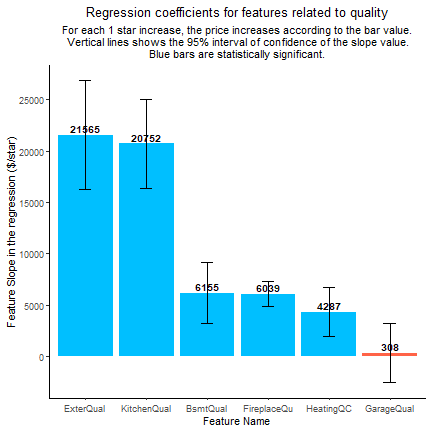
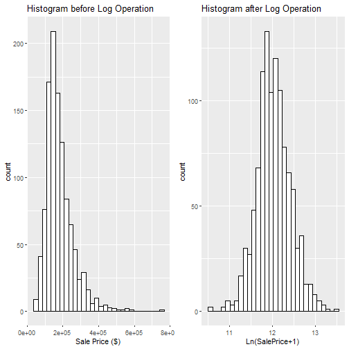
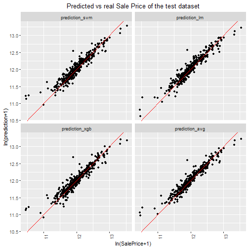
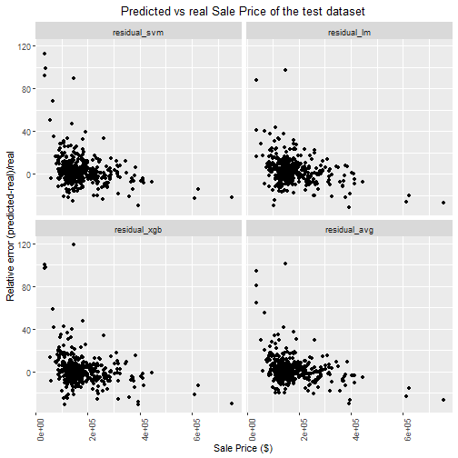
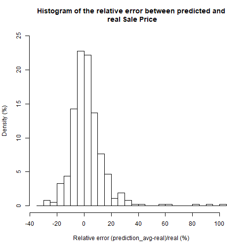
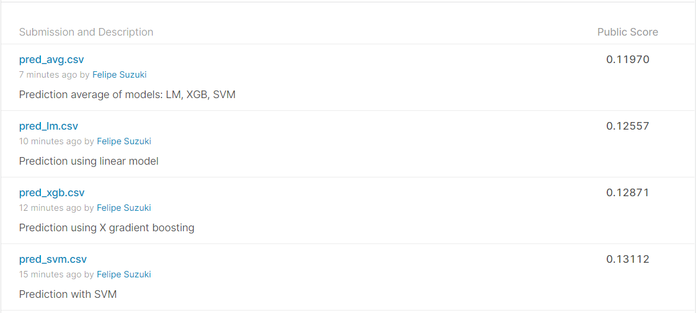

## **1. Introduction**

House prices are commonly known to be influenced by the house area, the preservation of the rooms and the overall quality of the construction. However, other not so intuitive factors may play a hand in the pricing of the house. Some of these factors may include the proximity to a railroad, the shape of the property, the material of the road that leads to the house and many others.

The aim of this notebook is to analyze the main factors impacting the house prices in the city of Ames in Iowa as well as predict their values using machine learning models.

The data is obtained from a kaggle competition available at ([House Prices](https://www.kaggle.com/c/house-prices-advanced-regression-techniques/overview)). The data contains a total of **79 variables** explaining different aspects of the homes. The data is divided into a **training dataset of 1460 observations** with information about the price and a **validation dataset of 1459 observations**, where the prices are unknown. This objective is to predict the validation dataset prices and submit them to kaggle, which will then rank the submissions sent by different people.

The metric used to rank the different submissions was the root mean squared logarithm error (RMSLE - the RMSE between the logarithm of the predicted value and the logarithm of the observed price), which means that errors in predicting expensive and cheap houses will affect the result equally.

## **2. Processing the data**

The raw data which was collected directly from the csv files is shown below. For more information about the meaning of each variable, check the README file available at the [github repository](https://github.com/Brandevin/Project_Real_State). 

The data contains information about the area, quality and condition of different rooms, the number of rooms, the styles and materials of house components, the neighborhood, the type of house, the type and date of sale and many others.


```r
df=read.csv('./Inputs/train.csv')
df_validate=read.csv('./Inputs/test.csv')

## Separate into training and test
smp_size<-floor(0.75*nrow(df))
set.seed(0)

train_ind<- sample(seq_len(nrow(df)), size = smp_size)

train <- df[train_ind, ]
test <- df[-train_ind, ]

row.names(train) <- NULL

head(train,60) %>%kbl()%>%kable_styling(bootstrap_options = c("striped", "hover", "condensed"),fixed_thead = T) %>%
  kableExtra::scroll_box(width = "100%", height = "300px") %>%
  kable_material()
```

<div style='border: 1px solid #ddd; padding: 0px; overflow-y: scroll; height:300px; overflow-x: scroll; width:100%;  font-family: "Source Sans Pro", helvetica, sans-serif; margin-left: auto; margin-right: auto;' class=" lightable-material"><table class="table table-striped table-hover table-condensed" style="margin-left: auto; margin-right: auto;">
 <thead>
  <tr>
   <th style="text-align:right;position: sticky; top:0; background-color: #FFFFFF;position: sticky; top:0; background-color: #FFFFFF;"> Id </th>
   <th style="text-align:right;position: sticky; top:0; background-color: #FFFFFF;position: sticky; top:0; background-color: #FFFFFF;"> MSSubClass </th>
   <th style="text-align:left;position: sticky; top:0; background-color: #FFFFFF;position: sticky; top:0; background-color: #FFFFFF;"> MSZoning </th>
   <th style="text-align:right;position: sticky; top:0; background-color: #FFFFFF;position: sticky; top:0; background-color: #FFFFFF;"> LotFrontage </th>
   <th style="text-align:right;position: sticky; top:0; background-color: #FFFFFF;position: sticky; top:0; background-color: #FFFFFF;"> LotArea </th>
   <th style="text-align:left;position: sticky; top:0; background-color: #FFFFFF;position: sticky; top:0; background-color: #FFFFFF;"> Street </th>
   <th style="text-align:left;position: sticky; top:0; background-color: #FFFFFF;position: sticky; top:0; background-color: #FFFFFF;"> Alley </th>
   <th style="text-align:left;position: sticky; top:0; background-color: #FFFFFF;position: sticky; top:0; background-color: #FFFFFF;"> LotShape </th>
   <th style="text-align:left;position: sticky; top:0; background-color: #FFFFFF;position: sticky; top:0; background-color: #FFFFFF;"> LandContour </th>
   <th style="text-align:left;position: sticky; top:0; background-color: #FFFFFF;position: sticky; top:0; background-color: #FFFFFF;"> Utilities </th>
   <th style="text-align:left;position: sticky; top:0; background-color: #FFFFFF;position: sticky; top:0; background-color: #FFFFFF;"> LotConfig </th>
   <th style="text-align:left;position: sticky; top:0; background-color: #FFFFFF;position: sticky; top:0; background-color: #FFFFFF;"> LandSlope </th>
   <th style="text-align:left;position: sticky; top:0; background-color: #FFFFFF;position: sticky; top:0; background-color: #FFFFFF;"> Neighborhood </th>
   <th style="text-align:left;position: sticky; top:0; background-color: #FFFFFF;position: sticky; top:0; background-color: #FFFFFF;"> Condition1 </th>
   <th style="text-align:left;position: sticky; top:0; background-color: #FFFFFF;position: sticky; top:0; background-color: #FFFFFF;"> Condition2 </th>
   <th style="text-align:left;position: sticky; top:0; background-color: #FFFFFF;position: sticky; top:0; background-color: #FFFFFF;"> BldgType </th>
   <th style="text-align:left;position: sticky; top:0; background-color: #FFFFFF;position: sticky; top:0; background-color: #FFFFFF;"> HouseStyle </th>
   <th style="text-align:right;position: sticky; top:0; background-color: #FFFFFF;position: sticky; top:0; background-color: #FFFFFF;"> OverallQual </th>
   <th style="text-align:right;position: sticky; top:0; background-color: #FFFFFF;position: sticky; top:0; background-color: #FFFFFF;"> OverallCond </th>
   <th style="text-align:right;position: sticky; top:0; background-color: #FFFFFF;position: sticky; top:0; background-color: #FFFFFF;"> YearBuilt </th>
   <th style="text-align:right;position: sticky; top:0; background-color: #FFFFFF;position: sticky; top:0; background-color: #FFFFFF;"> YearRemodAdd </th>
   <th style="text-align:left;position: sticky; top:0; background-color: #FFFFFF;position: sticky; top:0; background-color: #FFFFFF;"> RoofStyle </th>
   <th style="text-align:left;position: sticky; top:0; background-color: #FFFFFF;position: sticky; top:0; background-color: #FFFFFF;"> RoofMatl </th>
   <th style="text-align:left;position: sticky; top:0; background-color: #FFFFFF;position: sticky; top:0; background-color: #FFFFFF;"> Exterior1st </th>
   <th style="text-align:left;position: sticky; top:0; background-color: #FFFFFF;position: sticky; top:0; background-color: #FFFFFF;"> Exterior2nd </th>
   <th style="text-align:left;position: sticky; top:0; background-color: #FFFFFF;position: sticky; top:0; background-color: #FFFFFF;"> MasVnrType </th>
   <th style="text-align:right;position: sticky; top:0; background-color: #FFFFFF;position: sticky; top:0; background-color: #FFFFFF;"> MasVnrArea </th>
   <th style="text-align:left;position: sticky; top:0; background-color: #FFFFFF;position: sticky; top:0; background-color: #FFFFFF;"> ExterQual </th>
   <th style="text-align:left;position: sticky; top:0; background-color: #FFFFFF;position: sticky; top:0; background-color: #FFFFFF;"> ExterCond </th>
   <th style="text-align:left;position: sticky; top:0; background-color: #FFFFFF;position: sticky; top:0; background-color: #FFFFFF;"> Foundation </th>
   <th style="text-align:left;position: sticky; top:0; background-color: #FFFFFF;position: sticky; top:0; background-color: #FFFFFF;"> BsmtQual </th>
   <th style="text-align:left;position: sticky; top:0; background-color: #FFFFFF;position: sticky; top:0; background-color: #FFFFFF;"> BsmtCond </th>
   <th style="text-align:left;position: sticky; top:0; background-color: #FFFFFF;position: sticky; top:0; background-color: #FFFFFF;"> BsmtExposure </th>
   <th style="text-align:left;position: sticky; top:0; background-color: #FFFFFF;position: sticky; top:0; background-color: #FFFFFF;"> BsmtFinType1 </th>
   <th style="text-align:right;position: sticky; top:0; background-color: #FFFFFF;position: sticky; top:0; background-color: #FFFFFF;"> BsmtFinSF1 </th>
   <th style="text-align:left;position: sticky; top:0; background-color: #FFFFFF;position: sticky; top:0; background-color: #FFFFFF;"> BsmtFinType2 </th>
   <th style="text-align:right;position: sticky; top:0; background-color: #FFFFFF;position: sticky; top:0; background-color: #FFFFFF;"> BsmtFinSF2 </th>
   <th style="text-align:right;position: sticky; top:0; background-color: #FFFFFF;position: sticky; top:0; background-color: #FFFFFF;"> BsmtUnfSF </th>
   <th style="text-align:right;position: sticky; top:0; background-color: #FFFFFF;position: sticky; top:0; background-color: #FFFFFF;"> TotalBsmtSF </th>
   <th style="text-align:left;position: sticky; top:0; background-color: #FFFFFF;position: sticky; top:0; background-color: #FFFFFF;"> Heating </th>
   <th style="text-align:left;position: sticky; top:0; background-color: #FFFFFF;position: sticky; top:0; background-color: #FFFFFF;"> HeatingQC </th>
   <th style="text-align:left;position: sticky; top:0; background-color: #FFFFFF;position: sticky; top:0; background-color: #FFFFFF;"> CentralAir </th>
   <th style="text-align:left;position: sticky; top:0; background-color: #FFFFFF;position: sticky; top:0; background-color: #FFFFFF;"> Electrical </th>
   <th style="text-align:right;position: sticky; top:0; background-color: #FFFFFF;position: sticky; top:0; background-color: #FFFFFF;"> X1stFlrSF </th>
   <th style="text-align:right;position: sticky; top:0; background-color: #FFFFFF;position: sticky; top:0; background-color: #FFFFFF;"> X2ndFlrSF </th>
   <th style="text-align:right;position: sticky; top:0; background-color: #FFFFFF;position: sticky; top:0; background-color: #FFFFFF;"> LowQualFinSF </th>
   <th style="text-align:right;position: sticky; top:0; background-color: #FFFFFF;position: sticky; top:0; background-color: #FFFFFF;"> GrLivArea </th>
   <th style="text-align:right;position: sticky; top:0; background-color: #FFFFFF;position: sticky; top:0; background-color: #FFFFFF;"> BsmtFullBath </th>
   <th style="text-align:right;position: sticky; top:0; background-color: #FFFFFF;position: sticky; top:0; background-color: #FFFFFF;"> BsmtHalfBath </th>
   <th style="text-align:right;position: sticky; top:0; background-color: #FFFFFF;position: sticky; top:0; background-color: #FFFFFF;"> FullBath </th>
   <th style="text-align:right;position: sticky; top:0; background-color: #FFFFFF;position: sticky; top:0; background-color: #FFFFFF;"> HalfBath </th>
   <th style="text-align:right;position: sticky; top:0; background-color: #FFFFFF;position: sticky; top:0; background-color: #FFFFFF;"> BedroomAbvGr </th>
   <th style="text-align:right;position: sticky; top:0; background-color: #FFFFFF;position: sticky; top:0; background-color: #FFFFFF;"> KitchenAbvGr </th>
   <th style="text-align:left;position: sticky; top:0; background-color: #FFFFFF;position: sticky; top:0; background-color: #FFFFFF;"> KitchenQual </th>
   <th style="text-align:right;position: sticky; top:0; background-color: #FFFFFF;position: sticky; top:0; background-color: #FFFFFF;"> TotRmsAbvGrd </th>
   <th style="text-align:left;position: sticky; top:0; background-color: #FFFFFF;position: sticky; top:0; background-color: #FFFFFF;"> Functional </th>
   <th style="text-align:right;position: sticky; top:0; background-color: #FFFFFF;position: sticky; top:0; background-color: #FFFFFF;"> Fireplaces </th>
   <th style="text-align:left;position: sticky; top:0; background-color: #FFFFFF;position: sticky; top:0; background-color: #FFFFFF;"> FireplaceQu </th>
   <th style="text-align:left;position: sticky; top:0; background-color: #FFFFFF;position: sticky; top:0; background-color: #FFFFFF;"> GarageType </th>
   <th style="text-align:right;position: sticky; top:0; background-color: #FFFFFF;position: sticky; top:0; background-color: #FFFFFF;"> GarageYrBlt </th>
   <th style="text-align:left;position: sticky; top:0; background-color: #FFFFFF;position: sticky; top:0; background-color: #FFFFFF;"> GarageFinish </th>
   <th style="text-align:right;position: sticky; top:0; background-color: #FFFFFF;position: sticky; top:0; background-color: #FFFFFF;"> GarageCars </th>
   <th style="text-align:right;position: sticky; top:0; background-color: #FFFFFF;position: sticky; top:0; background-color: #FFFFFF;"> GarageArea </th>
   <th style="text-align:left;position: sticky; top:0; background-color: #FFFFFF;position: sticky; top:0; background-color: #FFFFFF;"> GarageQual </th>
   <th style="text-align:left;position: sticky; top:0; background-color: #FFFFFF;position: sticky; top:0; background-color: #FFFFFF;"> GarageCond </th>
   <th style="text-align:left;position: sticky; top:0; background-color: #FFFFFF;position: sticky; top:0; background-color: #FFFFFF;"> PavedDrive </th>
   <th style="text-align:right;position: sticky; top:0; background-color: #FFFFFF;position: sticky; top:0; background-color: #FFFFFF;"> WoodDeckSF </th>
   <th style="text-align:right;position: sticky; top:0; background-color: #FFFFFF;position: sticky; top:0; background-color: #FFFFFF;"> OpenPorchSF </th>
   <th style="text-align:right;position: sticky; top:0; background-color: #FFFFFF;position: sticky; top:0; background-color: #FFFFFF;"> EnclosedPorch </th>
   <th style="text-align:right;position: sticky; top:0; background-color: #FFFFFF;position: sticky; top:0; background-color: #FFFFFF;"> X3SsnPorch </th>
   <th style="text-align:right;position: sticky; top:0; background-color: #FFFFFF;position: sticky; top:0; background-color: #FFFFFF;"> ScreenPorch </th>
   <th style="text-align:right;position: sticky; top:0; background-color: #FFFFFF;position: sticky; top:0; background-color: #FFFFFF;"> PoolArea </th>
   <th style="text-align:left;position: sticky; top:0; background-color: #FFFFFF;position: sticky; top:0; background-color: #FFFFFF;"> PoolQC </th>
   <th style="text-align:left;position: sticky; top:0; background-color: #FFFFFF;position: sticky; top:0; background-color: #FFFFFF;"> Fence </th>
   <th style="text-align:left;position: sticky; top:0; background-color: #FFFFFF;position: sticky; top:0; background-color: #FFFFFF;"> MiscFeature </th>
   <th style="text-align:right;position: sticky; top:0; background-color: #FFFFFF;position: sticky; top:0; background-color: #FFFFFF;"> MiscVal </th>
   <th style="text-align:right;position: sticky; top:0; background-color: #FFFFFF;position: sticky; top:0; background-color: #FFFFFF;"> MoSold </th>
   <th style="text-align:right;position: sticky; top:0; background-color: #FFFFFF;position: sticky; top:0; background-color: #FFFFFF;"> YrSold </th>
   <th style="text-align:left;position: sticky; top:0; background-color: #FFFFFF;position: sticky; top:0; background-color: #FFFFFF;"> SaleType </th>
   <th style="text-align:left;position: sticky; top:0; background-color: #FFFFFF;position: sticky; top:0; background-color: #FFFFFF;"> SaleCondition </th>
   <th style="text-align:right;position: sticky; top:0; background-color: #FFFFFF;position: sticky; top:0; background-color: #FFFFFF;"> SalePrice </th>
  </tr>
 </thead>
<tbody>
  <tr>
   <td style="text-align:right;"> 1422 </td>
   <td style="text-align:right;"> 120 </td>
   <td style="text-align:left;"> RL </td>
   <td style="text-align:right;"> 53 </td>
   <td style="text-align:right;"> 4043 </td>
   <td style="text-align:left;"> Pave </td>
   <td style="text-align:left;"> NA </td>
   <td style="text-align:left;"> Reg </td>
   <td style="text-align:left;"> Lvl </td>
   <td style="text-align:left;"> AllPub </td>
   <td style="text-align:left;"> Inside </td>
   <td style="text-align:left;"> Gtl </td>
   <td style="text-align:left;"> NPkVill </td>
   <td style="text-align:left;"> Norm </td>
   <td style="text-align:left;"> Norm </td>
   <td style="text-align:left;"> TwnhsE </td>
   <td style="text-align:left;"> 1Story </td>
   <td style="text-align:right;"> 6 </td>
   <td style="text-align:right;"> 5 </td>
   <td style="text-align:right;"> 1977 </td>
   <td style="text-align:right;"> 1977 </td>
   <td style="text-align:left;"> Gable </td>
   <td style="text-align:left;"> CompShg </td>
   <td style="text-align:left;"> Plywood </td>
   <td style="text-align:left;"> Plywood </td>
   <td style="text-align:left;"> None </td>
   <td style="text-align:right;"> 0 </td>
   <td style="text-align:left;"> TA </td>
   <td style="text-align:left;"> TA </td>
   <td style="text-align:left;"> CBlock </td>
   <td style="text-align:left;"> Gd </td>
   <td style="text-align:left;"> TA </td>
   <td style="text-align:left;"> No </td>
   <td style="text-align:left;"> ALQ </td>
   <td style="text-align:right;"> 360 </td>
   <td style="text-align:left;"> Unf </td>
   <td style="text-align:right;"> 0 </td>
   <td style="text-align:right;"> 709 </td>
   <td style="text-align:right;"> 1069 </td>
   <td style="text-align:left;"> GasA </td>
   <td style="text-align:left;"> TA </td>
   <td style="text-align:left;"> Y </td>
   <td style="text-align:left;"> SBrkr </td>
   <td style="text-align:right;"> 1069 </td>
   <td style="text-align:right;"> 0 </td>
   <td style="text-align:right;"> 0 </td>
   <td style="text-align:right;"> 1069 </td>
   <td style="text-align:right;"> 0 </td>
   <td style="text-align:right;"> 0 </td>
   <td style="text-align:right;"> 2 </td>
   <td style="text-align:right;"> 0 </td>
   <td style="text-align:right;"> 2 </td>
   <td style="text-align:right;"> 1 </td>
   <td style="text-align:left;"> TA </td>
   <td style="text-align:right;"> 4 </td>
   <td style="text-align:left;"> Typ </td>
   <td style="text-align:right;"> 1 </td>
   <td style="text-align:left;"> Fa </td>
   <td style="text-align:left;"> Attchd </td>
   <td style="text-align:right;"> 1977 </td>
   <td style="text-align:left;"> RFn </td>
   <td style="text-align:right;"> 2 </td>
   <td style="text-align:right;"> 440 </td>
   <td style="text-align:left;"> TA </td>
   <td style="text-align:left;"> TA </td>
   <td style="text-align:left;"> Y </td>
   <td style="text-align:right;"> 0 </td>
   <td style="text-align:right;"> 55 </td>
   <td style="text-align:right;"> 0 </td>
   <td style="text-align:right;"> 0 </td>
   <td style="text-align:right;"> 165 </td>
   <td style="text-align:right;"> 0 </td>
   <td style="text-align:left;"> NA </td>
   <td style="text-align:left;"> NA </td>
   <td style="text-align:left;"> NA </td>
   <td style="text-align:right;"> 0 </td>
   <td style="text-align:right;"> 7 </td>
   <td style="text-align:right;"> 2010 </td>
   <td style="text-align:left;"> WD </td>
   <td style="text-align:left;"> Normal </td>
   <td style="text-align:right;"> 127500 </td>
  </tr>
  <tr>
   <td style="text-align:right;"> 1017 </td>
   <td style="text-align:right;"> 20 </td>
   <td style="text-align:left;"> RL </td>
   <td style="text-align:right;"> 73 </td>
   <td style="text-align:right;"> 11883 </td>
   <td style="text-align:left;"> Pave </td>
   <td style="text-align:left;"> NA </td>
   <td style="text-align:left;"> Reg </td>
   <td style="text-align:left;"> Lvl </td>
   <td style="text-align:left;"> AllPub </td>
   <td style="text-align:left;"> Inside </td>
   <td style="text-align:left;"> Gtl </td>
   <td style="text-align:left;"> CollgCr </td>
   <td style="text-align:left;"> Norm </td>
   <td style="text-align:left;"> Norm </td>
   <td style="text-align:left;"> 1Fam </td>
   <td style="text-align:left;"> 1Story </td>
   <td style="text-align:right;"> 7 </td>
   <td style="text-align:right;"> 5 </td>
   <td style="text-align:right;"> 1996 </td>
   <td style="text-align:right;"> 1996 </td>
   <td style="text-align:left;"> Hip </td>
   <td style="text-align:left;"> CompShg </td>
   <td style="text-align:left;"> VinylSd </td>
   <td style="text-align:left;"> VinylSd </td>
   <td style="text-align:left;"> BrkFace </td>
   <td style="text-align:right;"> 196 </td>
   <td style="text-align:left;"> Gd </td>
   <td style="text-align:left;"> TA </td>
   <td style="text-align:left;"> PConc </td>
   <td style="text-align:left;"> Gd </td>
   <td style="text-align:left;"> TA </td>
   <td style="text-align:left;"> Gd </td>
   <td style="text-align:left;"> GLQ </td>
   <td style="text-align:right;"> 690 </td>
   <td style="text-align:left;"> Unf </td>
   <td style="text-align:right;"> 0 </td>
   <td style="text-align:right;"> 814 </td>
   <td style="text-align:right;"> 1504 </td>
   <td style="text-align:left;"> GasA </td>
   <td style="text-align:left;"> Ex </td>
   <td style="text-align:left;"> Y </td>
   <td style="text-align:left;"> SBrkr </td>
   <td style="text-align:right;"> 1504 </td>
   <td style="text-align:right;"> 0 </td>
   <td style="text-align:right;"> 0 </td>
   <td style="text-align:right;"> 1504 </td>
   <td style="text-align:right;"> 1 </td>
   <td style="text-align:right;"> 0 </td>
   <td style="text-align:right;"> 2 </td>
   <td style="text-align:right;"> 0 </td>
   <td style="text-align:right;"> 3 </td>
   <td style="text-align:right;"> 1 </td>
   <td style="text-align:left;"> Gd </td>
   <td style="text-align:right;"> 6 </td>
   <td style="text-align:left;"> Typ </td>
   <td style="text-align:right;"> 1 </td>
   <td style="text-align:left;"> TA </td>
   <td style="text-align:left;"> Attchd </td>
   <td style="text-align:right;"> 1996 </td>
   <td style="text-align:left;"> Fin </td>
   <td style="text-align:right;"> 2 </td>
   <td style="text-align:right;"> 478 </td>
   <td style="text-align:left;"> TA </td>
   <td style="text-align:left;"> TA </td>
   <td style="text-align:left;"> Y </td>
   <td style="text-align:right;"> 115 </td>
   <td style="text-align:right;"> 66 </td>
   <td style="text-align:right;"> 0 </td>
   <td style="text-align:right;"> 0 </td>
   <td style="text-align:right;"> 0 </td>
   <td style="text-align:right;"> 0 </td>
   <td style="text-align:left;"> NA </td>
   <td style="text-align:left;"> NA </td>
   <td style="text-align:left;"> NA </td>
   <td style="text-align:right;"> 0 </td>
   <td style="text-align:right;"> 6 </td>
   <td style="text-align:right;"> 2009 </td>
   <td style="text-align:left;"> WD </td>
   <td style="text-align:left;"> Normal </td>
   <td style="text-align:right;"> 203000 </td>
  </tr>
  <tr>
   <td style="text-align:right;"> 679 </td>
   <td style="text-align:right;"> 20 </td>
   <td style="text-align:left;"> RL </td>
   <td style="text-align:right;"> 80 </td>
   <td style="text-align:right;"> 11844 </td>
   <td style="text-align:left;"> Pave </td>
   <td style="text-align:left;"> NA </td>
   <td style="text-align:left;"> IR1 </td>
   <td style="text-align:left;"> Lvl </td>
   <td style="text-align:left;"> AllPub </td>
   <td style="text-align:left;"> Inside </td>
   <td style="text-align:left;"> Gtl </td>
   <td style="text-align:left;"> StoneBr </td>
   <td style="text-align:left;"> Norm </td>
   <td style="text-align:left;"> Norm </td>
   <td style="text-align:left;"> 1Fam </td>
   <td style="text-align:left;"> 1Story </td>
   <td style="text-align:right;"> 8 </td>
   <td style="text-align:right;"> 5 </td>
   <td style="text-align:right;"> 2008 </td>
   <td style="text-align:right;"> 2008 </td>
   <td style="text-align:left;"> Hip </td>
   <td style="text-align:left;"> CompShg </td>
   <td style="text-align:left;"> VinylSd </td>
   <td style="text-align:left;"> VinylSd </td>
   <td style="text-align:left;"> Stone </td>
   <td style="text-align:right;"> 464 </td>
   <td style="text-align:left;"> Gd </td>
   <td style="text-align:left;"> TA </td>
   <td style="text-align:left;"> PConc </td>
   <td style="text-align:left;"> Ex </td>
   <td style="text-align:left;"> TA </td>
   <td style="text-align:left;"> Mn </td>
   <td style="text-align:left;"> Unf </td>
   <td style="text-align:right;"> 0 </td>
   <td style="text-align:left;"> Unf </td>
   <td style="text-align:right;"> 0 </td>
   <td style="text-align:right;"> 2046 </td>
   <td style="text-align:right;"> 2046 </td>
   <td style="text-align:left;"> GasA </td>
   <td style="text-align:left;"> Ex </td>
   <td style="text-align:left;"> Y </td>
   <td style="text-align:left;"> SBrkr </td>
   <td style="text-align:right;"> 2046 </td>
   <td style="text-align:right;"> 0 </td>
   <td style="text-align:right;"> 0 </td>
   <td style="text-align:right;"> 2046 </td>
   <td style="text-align:right;"> 0 </td>
   <td style="text-align:right;"> 0 </td>
   <td style="text-align:right;"> 2 </td>
   <td style="text-align:right;"> 1 </td>
   <td style="text-align:right;"> 3 </td>
   <td style="text-align:right;"> 1 </td>
   <td style="text-align:left;"> Gd </td>
   <td style="text-align:right;"> 7 </td>
   <td style="text-align:left;"> Typ </td>
   <td style="text-align:right;"> 1 </td>
   <td style="text-align:left;"> Gd </td>
   <td style="text-align:left;"> Attchd </td>
   <td style="text-align:right;"> 2008 </td>
   <td style="text-align:left;"> Fin </td>
   <td style="text-align:right;"> 3 </td>
   <td style="text-align:right;"> 834 </td>
   <td style="text-align:left;"> TA </td>
   <td style="text-align:left;"> TA </td>
   <td style="text-align:left;"> Y </td>
   <td style="text-align:right;"> 322 </td>
   <td style="text-align:right;"> 82 </td>
   <td style="text-align:right;"> 0 </td>
   <td style="text-align:right;"> 0 </td>
   <td style="text-align:right;"> 0 </td>
   <td style="text-align:right;"> 0 </td>
   <td style="text-align:left;"> NA </td>
   <td style="text-align:left;"> NA </td>
   <td style="text-align:left;"> NA </td>
   <td style="text-align:right;"> 0 </td>
   <td style="text-align:right;"> 7 </td>
   <td style="text-align:right;"> 2009 </td>
   <td style="text-align:left;"> New </td>
   <td style="text-align:left;"> Partial </td>
   <td style="text-align:right;"> 372500 </td>
  </tr>
  <tr>
   <td style="text-align:right;"> 129 </td>
   <td style="text-align:right;"> 60 </td>
   <td style="text-align:left;"> RL </td>
   <td style="text-align:right;"> 69 </td>
   <td style="text-align:right;"> 7590 </td>
   <td style="text-align:left;"> Pave </td>
   <td style="text-align:left;"> NA </td>
   <td style="text-align:left;"> Reg </td>
   <td style="text-align:left;"> Lvl </td>
   <td style="text-align:left;"> AllPub </td>
   <td style="text-align:left;"> Inside </td>
   <td style="text-align:left;"> Gtl </td>
   <td style="text-align:left;"> NAmes </td>
   <td style="text-align:left;"> PosN </td>
   <td style="text-align:left;"> Norm </td>
   <td style="text-align:left;"> 1Fam </td>
   <td style="text-align:left;"> 2Story </td>
   <td style="text-align:right;"> 6 </td>
   <td style="text-align:right;"> 5 </td>
   <td style="text-align:right;"> 1966 </td>
   <td style="text-align:right;"> 1966 </td>
   <td style="text-align:left;"> Gable </td>
   <td style="text-align:left;"> CompShg </td>
   <td style="text-align:left;"> VinylSd </td>
   <td style="text-align:left;"> VinylSd </td>
   <td style="text-align:left;"> BrkFace </td>
   <td style="text-align:right;"> 266 </td>
   <td style="text-align:left;"> TA </td>
   <td style="text-align:left;"> TA </td>
   <td style="text-align:left;"> CBlock </td>
   <td style="text-align:left;"> TA </td>
   <td style="text-align:left;"> TA </td>
   <td style="text-align:left;"> No </td>
   <td style="text-align:left;"> BLQ </td>
   <td style="text-align:right;"> 512 </td>
   <td style="text-align:left;"> Unf </td>
   <td style="text-align:right;"> 0 </td>
   <td style="text-align:right;"> 148 </td>
   <td style="text-align:right;"> 660 </td>
   <td style="text-align:left;"> GasA </td>
   <td style="text-align:left;"> TA </td>
   <td style="text-align:left;"> Y </td>
   <td style="text-align:left;"> SBrkr </td>
   <td style="text-align:right;"> 660 </td>
   <td style="text-align:right;"> 688 </td>
   <td style="text-align:right;"> 0 </td>
   <td style="text-align:right;"> 1348 </td>
   <td style="text-align:right;"> 0 </td>
   <td style="text-align:right;"> 0 </td>
   <td style="text-align:right;"> 1 </td>
   <td style="text-align:right;"> 1 </td>
   <td style="text-align:right;"> 3 </td>
   <td style="text-align:right;"> 1 </td>
   <td style="text-align:left;"> TA </td>
   <td style="text-align:right;"> 6 </td>
   <td style="text-align:left;"> Typ </td>
   <td style="text-align:right;"> 1 </td>
   <td style="text-align:left;"> Fa </td>
   <td style="text-align:left;"> Attchd </td>
   <td style="text-align:right;"> 1966 </td>
   <td style="text-align:left;"> RFn </td>
   <td style="text-align:right;"> 2 </td>
   <td style="text-align:right;"> 453 </td>
   <td style="text-align:left;"> TA </td>
   <td style="text-align:left;"> TA </td>
   <td style="text-align:left;"> Y </td>
   <td style="text-align:right;"> 188 </td>
   <td style="text-align:right;"> 108 </td>
   <td style="text-align:right;"> 0 </td>
   <td style="text-align:right;"> 0 </td>
   <td style="text-align:right;"> 0 </td>
   <td style="text-align:right;"> 0 </td>
   <td style="text-align:left;"> NA </td>
   <td style="text-align:left;"> NA </td>
   <td style="text-align:left;"> NA </td>
   <td style="text-align:right;"> 0 </td>
   <td style="text-align:right;"> 7 </td>
   <td style="text-align:right;"> 2006 </td>
   <td style="text-align:left;"> WD </td>
   <td style="text-align:left;"> Normal </td>
   <td style="text-align:right;"> 155000 </td>
  </tr>
  <tr>
   <td style="text-align:right;"> 930 </td>
   <td style="text-align:right;"> 60 </td>
   <td style="text-align:left;"> RL </td>
   <td style="text-align:right;"> NA </td>
   <td style="text-align:right;"> 13006 </td>
   <td style="text-align:left;"> Pave </td>
   <td style="text-align:left;"> NA </td>
   <td style="text-align:left;"> IR1 </td>
   <td style="text-align:left;"> Lvl </td>
   <td style="text-align:left;"> AllPub </td>
   <td style="text-align:left;"> Corner </td>
   <td style="text-align:left;"> Gtl </td>
   <td style="text-align:left;"> Gilbert </td>
   <td style="text-align:left;"> Norm </td>
   <td style="text-align:left;"> Norm </td>
   <td style="text-align:left;"> 1Fam </td>
   <td style="text-align:left;"> 2Story </td>
   <td style="text-align:right;"> 7 </td>
   <td style="text-align:right;"> 5 </td>
   <td style="text-align:right;"> 1997 </td>
   <td style="text-align:right;"> 1997 </td>
   <td style="text-align:left;"> Gable </td>
   <td style="text-align:left;"> CompShg </td>
   <td style="text-align:left;"> HdBoard </td>
   <td style="text-align:left;"> HdBoard </td>
   <td style="text-align:left;"> BrkFace </td>
   <td style="text-align:right;"> 285 </td>
   <td style="text-align:left;"> TA </td>
   <td style="text-align:left;"> TA </td>
   <td style="text-align:left;"> PConc </td>
   <td style="text-align:left;"> Gd </td>
   <td style="text-align:left;"> TA </td>
   <td style="text-align:left;"> No </td>
   <td style="text-align:left;"> Unf </td>
   <td style="text-align:right;"> 0 </td>
   <td style="text-align:left;"> Unf </td>
   <td style="text-align:right;"> 0 </td>
   <td style="text-align:right;"> 964 </td>
   <td style="text-align:right;"> 964 </td>
   <td style="text-align:left;"> GasA </td>
   <td style="text-align:left;"> Gd </td>
   <td style="text-align:left;"> Y </td>
   <td style="text-align:left;"> SBrkr </td>
   <td style="text-align:right;"> 993 </td>
   <td style="text-align:right;"> 1243 </td>
   <td style="text-align:right;"> 0 </td>
   <td style="text-align:right;"> 2236 </td>
   <td style="text-align:right;"> 0 </td>
   <td style="text-align:right;"> 0 </td>
   <td style="text-align:right;"> 2 </td>
   <td style="text-align:right;"> 1 </td>
   <td style="text-align:right;"> 4 </td>
   <td style="text-align:right;"> 1 </td>
   <td style="text-align:left;"> Gd </td>
   <td style="text-align:right;"> 8 </td>
   <td style="text-align:left;"> Typ </td>
   <td style="text-align:right;"> 1 </td>
   <td style="text-align:left;"> TA </td>
   <td style="text-align:left;"> BuiltIn </td>
   <td style="text-align:right;"> 1997 </td>
   <td style="text-align:left;"> Fin </td>
   <td style="text-align:right;"> 2 </td>
   <td style="text-align:right;"> 642 </td>
   <td style="text-align:left;"> TA </td>
   <td style="text-align:left;"> TA </td>
   <td style="text-align:left;"> Y </td>
   <td style="text-align:right;"> 0 </td>
   <td style="text-align:right;"> 0 </td>
   <td style="text-align:right;"> 0 </td>
   <td style="text-align:right;"> 0 </td>
   <td style="text-align:right;"> 0 </td>
   <td style="text-align:right;"> 0 </td>
   <td style="text-align:left;"> NA </td>
   <td style="text-align:left;"> NA </td>
   <td style="text-align:left;"> NA </td>
   <td style="text-align:right;"> 0 </td>
   <td style="text-align:right;"> 11 </td>
   <td style="text-align:right;"> 2006 </td>
   <td style="text-align:left;"> WD </td>
   <td style="text-align:left;"> Normal </td>
   <td style="text-align:right;"> 222000 </td>
  </tr>
  <tr>
   <td style="text-align:right;"> 471 </td>
   <td style="text-align:right;"> 120 </td>
   <td style="text-align:left;"> RL </td>
   <td style="text-align:right;"> NA </td>
   <td style="text-align:right;"> 6820 </td>
   <td style="text-align:left;"> Pave </td>
   <td style="text-align:left;"> NA </td>
   <td style="text-align:left;"> IR1 </td>
   <td style="text-align:left;"> Lvl </td>
   <td style="text-align:left;"> AllPub </td>
   <td style="text-align:left;"> Corner </td>
   <td style="text-align:left;"> Gtl </td>
   <td style="text-align:left;"> StoneBr </td>
   <td style="text-align:left;"> Norm </td>
   <td style="text-align:left;"> Norm </td>
   <td style="text-align:left;"> TwnhsE </td>
   <td style="text-align:left;"> 1Story </td>
   <td style="text-align:right;"> 8 </td>
   <td style="text-align:right;"> 5 </td>
   <td style="text-align:right;"> 1985 </td>
   <td style="text-align:right;"> 1985 </td>
   <td style="text-align:left;"> Gable </td>
   <td style="text-align:left;"> CompShg </td>
   <td style="text-align:left;"> HdBoard </td>
   <td style="text-align:left;"> HdBoard </td>
   <td style="text-align:left;"> None </td>
   <td style="text-align:right;"> 0 </td>
   <td style="text-align:left;"> Gd </td>
   <td style="text-align:left;"> TA </td>
   <td style="text-align:left;"> PConc </td>
   <td style="text-align:left;"> Gd </td>
   <td style="text-align:left;"> TA </td>
   <td style="text-align:left;"> Av </td>
   <td style="text-align:left;"> GLQ </td>
   <td style="text-align:right;"> 368 </td>
   <td style="text-align:left;"> BLQ </td>
   <td style="text-align:right;"> 1120 </td>
   <td style="text-align:right;"> 0 </td>
   <td style="text-align:right;"> 1488 </td>
   <td style="text-align:left;"> GasA </td>
   <td style="text-align:left;"> TA </td>
   <td style="text-align:left;"> Y </td>
   <td style="text-align:left;"> SBrkr </td>
   <td style="text-align:right;"> 1502 </td>
   <td style="text-align:right;"> 0 </td>
   <td style="text-align:right;"> 0 </td>
   <td style="text-align:right;"> 1502 </td>
   <td style="text-align:right;"> 1 </td>
   <td style="text-align:right;"> 0 </td>
   <td style="text-align:right;"> 1 </td>
   <td style="text-align:right;"> 1 </td>
   <td style="text-align:right;"> 1 </td>
   <td style="text-align:right;"> 1 </td>
   <td style="text-align:left;"> Gd </td>
   <td style="text-align:right;"> 4 </td>
   <td style="text-align:left;"> Typ </td>
   <td style="text-align:right;"> 0 </td>
   <td style="text-align:left;"> NA </td>
   <td style="text-align:left;"> Attchd </td>
   <td style="text-align:right;"> 1985 </td>
   <td style="text-align:left;"> RFn </td>
   <td style="text-align:right;"> 2 </td>
   <td style="text-align:right;"> 528 </td>
   <td style="text-align:left;"> TA </td>
   <td style="text-align:left;"> TA </td>
   <td style="text-align:left;"> Y </td>
   <td style="text-align:right;"> 0 </td>
   <td style="text-align:right;"> 54 </td>
   <td style="text-align:right;"> 0 </td>
   <td style="text-align:right;"> 0 </td>
   <td style="text-align:right;"> 140 </td>
   <td style="text-align:right;"> 0 </td>
   <td style="text-align:left;"> NA </td>
   <td style="text-align:left;"> NA </td>
   <td style="text-align:left;"> NA </td>
   <td style="text-align:right;"> 0 </td>
   <td style="text-align:right;"> 6 </td>
   <td style="text-align:right;"> 2010 </td>
   <td style="text-align:left;"> WD </td>
   <td style="text-align:left;"> Normal </td>
   <td style="text-align:right;"> 212000 </td>
  </tr>
  <tr>
   <td style="text-align:right;"> 299 </td>
   <td style="text-align:right;"> 60 </td>
   <td style="text-align:left;"> RL </td>
   <td style="text-align:right;"> 90 </td>
   <td style="text-align:right;"> 11700 </td>
   <td style="text-align:left;"> Pave </td>
   <td style="text-align:left;"> NA </td>
   <td style="text-align:left;"> Reg </td>
   <td style="text-align:left;"> Lvl </td>
   <td style="text-align:left;"> AllPub </td>
   <td style="text-align:left;"> Inside </td>
   <td style="text-align:left;"> Gtl </td>
   <td style="text-align:left;"> NWAmes </td>
   <td style="text-align:left;"> Norm </td>
   <td style="text-align:left;"> Norm </td>
   <td style="text-align:left;"> 1Fam </td>
   <td style="text-align:left;"> 2Story </td>
   <td style="text-align:right;"> 6 </td>
   <td style="text-align:right;"> 6 </td>
   <td style="text-align:right;"> 1968 </td>
   <td style="text-align:right;"> 1968 </td>
   <td style="text-align:left;"> Mansard </td>
   <td style="text-align:left;"> CompShg </td>
   <td style="text-align:left;"> HdBoard </td>
   <td style="text-align:left;"> AsphShn </td>
   <td style="text-align:left;"> BrkFace </td>
   <td style="text-align:right;"> 365 </td>
   <td style="text-align:left;"> Gd </td>
   <td style="text-align:left;"> TA </td>
   <td style="text-align:left;"> CBlock </td>
   <td style="text-align:left;"> TA </td>
   <td style="text-align:left;"> TA </td>
   <td style="text-align:left;"> No </td>
   <td style="text-align:left;"> ALQ </td>
   <td style="text-align:right;"> 384 </td>
   <td style="text-align:left;"> Rec </td>
   <td style="text-align:right;"> 175 </td>
   <td style="text-align:right;"> 143 </td>
   <td style="text-align:right;"> 702 </td>
   <td style="text-align:left;"> GasA </td>
   <td style="text-align:left;"> Gd </td>
   <td style="text-align:left;"> Y </td>
   <td style="text-align:left;"> SBrkr </td>
   <td style="text-align:right;"> 1041 </td>
   <td style="text-align:right;"> 702 </td>
   <td style="text-align:right;"> 0 </td>
   <td style="text-align:right;"> 1743 </td>
   <td style="text-align:right;"> 0 </td>
   <td style="text-align:right;"> 1 </td>
   <td style="text-align:right;"> 1 </td>
   <td style="text-align:right;"> 2 </td>
   <td style="text-align:right;"> 3 </td>
   <td style="text-align:right;"> 1 </td>
   <td style="text-align:left;"> TA </td>
   <td style="text-align:right;"> 7 </td>
   <td style="text-align:left;"> Typ </td>
   <td style="text-align:right;"> 1 </td>
   <td style="text-align:left;"> Gd </td>
   <td style="text-align:left;"> Attchd </td>
   <td style="text-align:right;"> 1968 </td>
   <td style="text-align:left;"> Unf </td>
   <td style="text-align:right;"> 2 </td>
   <td style="text-align:right;"> 539 </td>
   <td style="text-align:left;"> TA </td>
   <td style="text-align:left;"> TA </td>
   <td style="text-align:left;"> Y </td>
   <td style="text-align:right;"> 224 </td>
   <td style="text-align:right;"> 0 </td>
   <td style="text-align:right;"> 0 </td>
   <td style="text-align:right;"> 0 </td>
   <td style="text-align:right;"> 0 </td>
   <td style="text-align:right;"> 0 </td>
   <td style="text-align:left;"> NA </td>
   <td style="text-align:left;"> NA </td>
   <td style="text-align:left;"> NA </td>
   <td style="text-align:right;"> 0 </td>
   <td style="text-align:right;"> 6 </td>
   <td style="text-align:right;"> 2007 </td>
   <td style="text-align:left;"> WD </td>
   <td style="text-align:left;"> Normal </td>
   <td style="text-align:right;"> 175000 </td>
  </tr>
  <tr>
   <td style="text-align:right;"> 270 </td>
   <td style="text-align:right;"> 20 </td>
   <td style="text-align:left;"> RL </td>
   <td style="text-align:right;"> NA </td>
   <td style="text-align:right;"> 7917 </td>
   <td style="text-align:left;"> Pave </td>
   <td style="text-align:left;"> NA </td>
   <td style="text-align:left;"> IR1 </td>
   <td style="text-align:left;"> Lvl </td>
   <td style="text-align:left;"> AllPub </td>
   <td style="text-align:left;"> Corner </td>
   <td style="text-align:left;"> Gtl </td>
   <td style="text-align:left;"> Edwards </td>
   <td style="text-align:left;"> Norm </td>
   <td style="text-align:left;"> Norm </td>
   <td style="text-align:left;"> 1Fam </td>
   <td style="text-align:left;"> 1Story </td>
   <td style="text-align:right;"> 6 </td>
   <td style="text-align:right;"> 7 </td>
   <td style="text-align:right;"> 1976 </td>
   <td style="text-align:right;"> 1976 </td>
   <td style="text-align:left;"> Hip </td>
   <td style="text-align:left;"> CompShg </td>
   <td style="text-align:left;"> HdBoard </td>
   <td style="text-align:left;"> HdBoard </td>
   <td style="text-align:left;"> BrkFace </td>
   <td style="text-align:right;"> 174 </td>
   <td style="text-align:left;"> TA </td>
   <td style="text-align:left;"> Gd </td>
   <td style="text-align:left;"> CBlock </td>
   <td style="text-align:left;"> TA </td>
   <td style="text-align:left;"> Gd </td>
   <td style="text-align:left;"> No </td>
   <td style="text-align:left;"> BLQ </td>
   <td style="text-align:right;"> 751 </td>
   <td style="text-align:left;"> Unf </td>
   <td style="text-align:right;"> 0 </td>
   <td style="text-align:right;"> 392 </td>
   <td style="text-align:right;"> 1143 </td>
   <td style="text-align:left;"> GasA </td>
   <td style="text-align:left;"> TA </td>
   <td style="text-align:left;"> Y </td>
   <td style="text-align:left;"> SBrkr </td>
   <td style="text-align:right;"> 1113 </td>
   <td style="text-align:right;"> 0 </td>
   <td style="text-align:right;"> 0 </td>
   <td style="text-align:right;"> 1113 </td>
   <td style="text-align:right;"> 1 </td>
   <td style="text-align:right;"> 0 </td>
   <td style="text-align:right;"> 1 </td>
   <td style="text-align:right;"> 1 </td>
   <td style="text-align:right;"> 3 </td>
   <td style="text-align:right;"> 1 </td>
   <td style="text-align:left;"> TA </td>
   <td style="text-align:right;"> 6 </td>
   <td style="text-align:left;"> Typ </td>
   <td style="text-align:right;"> 1 </td>
   <td style="text-align:left;"> Fa </td>
   <td style="text-align:left;"> Attchd </td>
   <td style="text-align:right;"> 1987 </td>
   <td style="text-align:left;"> RFn </td>
   <td style="text-align:right;"> 1 </td>
   <td style="text-align:right;"> 504 </td>
   <td style="text-align:left;"> TA </td>
   <td style="text-align:left;"> Gd </td>
   <td style="text-align:left;"> Y </td>
   <td style="text-align:right;"> 370 </td>
   <td style="text-align:right;"> 30 </td>
   <td style="text-align:right;"> 0 </td>
   <td style="text-align:right;"> 0 </td>
   <td style="text-align:right;"> 0 </td>
   <td style="text-align:right;"> 0 </td>
   <td style="text-align:left;"> NA </td>
   <td style="text-align:left;"> GdPrv </td>
   <td style="text-align:left;"> NA </td>
   <td style="text-align:right;"> 0 </td>
   <td style="text-align:right;"> 5 </td>
   <td style="text-align:right;"> 2007 </td>
   <td style="text-align:left;"> WD </td>
   <td style="text-align:left;"> Normal </td>
   <td style="text-align:right;"> 148000 </td>
  </tr>
  <tr>
   <td style="text-align:right;"> 1211 </td>
   <td style="text-align:right;"> 60 </td>
   <td style="text-align:left;"> RL </td>
   <td style="text-align:right;"> 70 </td>
   <td style="text-align:right;"> 11218 </td>
   <td style="text-align:left;"> Pave </td>
   <td style="text-align:left;"> NA </td>
   <td style="text-align:left;"> Reg </td>
   <td style="text-align:left;"> Lvl </td>
   <td style="text-align:left;"> AllPub </td>
   <td style="text-align:left;"> Inside </td>
   <td style="text-align:left;"> Gtl </td>
   <td style="text-align:left;"> SawyerW </td>
   <td style="text-align:left;"> Norm </td>
   <td style="text-align:left;"> Norm </td>
   <td style="text-align:left;"> 1Fam </td>
   <td style="text-align:left;"> 2Story </td>
   <td style="text-align:right;"> 6 </td>
   <td style="text-align:right;"> 5 </td>
   <td style="text-align:right;"> 1992 </td>
   <td style="text-align:right;"> 1992 </td>
   <td style="text-align:left;"> Gable </td>
   <td style="text-align:left;"> CompShg </td>
   <td style="text-align:left;"> Wd Sdng </td>
   <td style="text-align:left;"> Wd Sdng </td>
   <td style="text-align:left;"> None </td>
   <td style="text-align:right;"> 0 </td>
   <td style="text-align:left;"> Gd </td>
   <td style="text-align:left;"> TA </td>
   <td style="text-align:left;"> PConc </td>
   <td style="text-align:left;"> Gd </td>
   <td style="text-align:left;"> TA </td>
   <td style="text-align:left;"> No </td>
   <td style="text-align:left;"> Unf </td>
   <td style="text-align:right;"> 0 </td>
   <td style="text-align:left;"> Unf </td>
   <td style="text-align:right;"> 0 </td>
   <td style="text-align:right;"> 1055 </td>
   <td style="text-align:right;"> 1055 </td>
   <td style="text-align:left;"> GasA </td>
   <td style="text-align:left;"> Ex </td>
   <td style="text-align:left;"> Y </td>
   <td style="text-align:left;"> SBrkr </td>
   <td style="text-align:right;"> 1055 </td>
   <td style="text-align:right;"> 790 </td>
   <td style="text-align:right;"> 0 </td>
   <td style="text-align:right;"> 1845 </td>
   <td style="text-align:right;"> 0 </td>
   <td style="text-align:right;"> 0 </td>
   <td style="text-align:right;"> 2 </td>
   <td style="text-align:right;"> 1 </td>
   <td style="text-align:right;"> 3 </td>
   <td style="text-align:right;"> 1 </td>
   <td style="text-align:left;"> Gd </td>
   <td style="text-align:right;"> 8 </td>
   <td style="text-align:left;"> Typ </td>
   <td style="text-align:right;"> 1 </td>
   <td style="text-align:left;"> TA </td>
   <td style="text-align:left;"> Attchd </td>
   <td style="text-align:right;"> 1992 </td>
   <td style="text-align:left;"> RFn </td>
   <td style="text-align:right;"> 2 </td>
   <td style="text-align:right;"> 462 </td>
   <td style="text-align:left;"> TA </td>
   <td style="text-align:left;"> TA </td>
   <td style="text-align:left;"> Y </td>
   <td style="text-align:right;"> 635 </td>
   <td style="text-align:right;"> 104 </td>
   <td style="text-align:right;"> 0 </td>
   <td style="text-align:right;"> 0 </td>
   <td style="text-align:right;"> 0 </td>
   <td style="text-align:right;"> 0 </td>
   <td style="text-align:left;"> NA </td>
   <td style="text-align:left;"> GdPrv </td>
   <td style="text-align:left;"> Shed </td>
   <td style="text-align:right;"> 400 </td>
   <td style="text-align:right;"> 5 </td>
   <td style="text-align:right;"> 2010 </td>
   <td style="text-align:left;"> WD </td>
   <td style="text-align:left;"> Normal </td>
   <td style="text-align:right;"> 189000 </td>
  </tr>
  <tr>
   <td style="text-align:right;"> 1331 </td>
   <td style="text-align:right;"> 20 </td>
   <td style="text-align:left;"> RL </td>
   <td style="text-align:right;"> 85 </td>
   <td style="text-align:right;"> 10000 </td>
   <td style="text-align:left;"> Pave </td>
   <td style="text-align:left;"> NA </td>
   <td style="text-align:left;"> Reg </td>
   <td style="text-align:left;"> Lvl </td>
   <td style="text-align:left;"> AllPub </td>
   <td style="text-align:left;"> Inside </td>
   <td style="text-align:left;"> Gtl </td>
   <td style="text-align:left;"> Somerst </td>
   <td style="text-align:left;"> Norm </td>
   <td style="text-align:left;"> Norm </td>
   <td style="text-align:left;"> 1Fam </td>
   <td style="text-align:left;"> 1Story </td>
   <td style="text-align:right;"> 8 </td>
   <td style="text-align:right;"> 5 </td>
   <td style="text-align:right;"> 2006 </td>
   <td style="text-align:right;"> 2006 </td>
   <td style="text-align:left;"> Hip </td>
   <td style="text-align:left;"> CompShg </td>
   <td style="text-align:left;"> VinylSd </td>
   <td style="text-align:left;"> VinylSd </td>
   <td style="text-align:left;"> Stone </td>
   <td style="text-align:right;"> 410 </td>
   <td style="text-align:left;"> Gd </td>
   <td style="text-align:left;"> TA </td>
   <td style="text-align:left;"> PConc </td>
   <td style="text-align:left;"> Gd </td>
   <td style="text-align:left;"> Gd </td>
   <td style="text-align:left;"> Av </td>
   <td style="text-align:left;"> Unf </td>
   <td style="text-align:right;"> 0 </td>
   <td style="text-align:left;"> Unf </td>
   <td style="text-align:right;"> 0 </td>
   <td style="text-align:right;"> 1588 </td>
   <td style="text-align:right;"> 1588 </td>
   <td style="text-align:left;"> GasA </td>
   <td style="text-align:left;"> Ex </td>
   <td style="text-align:left;"> Y </td>
   <td style="text-align:left;"> SBrkr </td>
   <td style="text-align:right;"> 1588 </td>
   <td style="text-align:right;"> 0 </td>
   <td style="text-align:right;"> 0 </td>
   <td style="text-align:right;"> 1588 </td>
   <td style="text-align:right;"> 0 </td>
   <td style="text-align:right;"> 0 </td>
   <td style="text-align:right;"> 2 </td>
   <td style="text-align:right;"> 0 </td>
   <td style="text-align:right;"> 3 </td>
   <td style="text-align:right;"> 1 </td>
   <td style="text-align:left;"> Gd </td>
   <td style="text-align:right;"> 7 </td>
   <td style="text-align:left;"> Typ </td>
   <td style="text-align:right;"> 1 </td>
   <td style="text-align:left;"> Gd </td>
   <td style="text-align:left;"> Attchd </td>
   <td style="text-align:right;"> 2006 </td>
   <td style="text-align:left;"> RFn </td>
   <td style="text-align:right;"> 3 </td>
   <td style="text-align:right;"> 825 </td>
   <td style="text-align:left;"> TA </td>
   <td style="text-align:left;"> TA </td>
   <td style="text-align:left;"> Y </td>
   <td style="text-align:right;"> 144 </td>
   <td style="text-align:right;"> 45 </td>
   <td style="text-align:right;"> 0 </td>
   <td style="text-align:right;"> 0 </td>
   <td style="text-align:right;"> 0 </td>
   <td style="text-align:right;"> 0 </td>
   <td style="text-align:left;"> NA </td>
   <td style="text-align:left;"> NA </td>
   <td style="text-align:left;"> NA </td>
   <td style="text-align:right;"> 0 </td>
   <td style="text-align:right;"> 12 </td>
   <td style="text-align:right;"> 2007 </td>
   <td style="text-align:left;"> WD </td>
   <td style="text-align:left;"> Normal </td>
   <td style="text-align:right;"> 227000 </td>
  </tr>
  <tr>
   <td style="text-align:right;"> 597 </td>
   <td style="text-align:right;"> 70 </td>
   <td style="text-align:left;"> RM </td>
   <td style="text-align:right;"> 60 </td>
   <td style="text-align:right;"> 3600 </td>
   <td style="text-align:left;"> Pave </td>
   <td style="text-align:left;"> Grvl </td>
   <td style="text-align:left;"> Reg </td>
   <td style="text-align:left;"> Lvl </td>
   <td style="text-align:left;"> AllPub </td>
   <td style="text-align:left;"> Inside </td>
   <td style="text-align:left;"> Gtl </td>
   <td style="text-align:left;"> OldTown </td>
   <td style="text-align:left;"> Norm </td>
   <td style="text-align:left;"> Norm </td>
   <td style="text-align:left;"> 1Fam </td>
   <td style="text-align:left;"> 2Story </td>
   <td style="text-align:right;"> 6 </td>
   <td style="text-align:right;"> 7 </td>
   <td style="text-align:right;"> 1910 </td>
   <td style="text-align:right;"> 1993 </td>
   <td style="text-align:left;"> Gable </td>
   <td style="text-align:left;"> CompShg </td>
   <td style="text-align:left;"> VinylSd </td>
   <td style="text-align:left;"> VinylSd </td>
   <td style="text-align:left;"> None </td>
   <td style="text-align:right;"> 0 </td>
   <td style="text-align:left;"> TA </td>
   <td style="text-align:left;"> TA </td>
   <td style="text-align:left;"> CBlock </td>
   <td style="text-align:left;"> TA </td>
   <td style="text-align:left;"> TA </td>
   <td style="text-align:left;"> No </td>
   <td style="text-align:left;"> Unf </td>
   <td style="text-align:right;"> 0 </td>
   <td style="text-align:left;"> Unf </td>
   <td style="text-align:right;"> 0 </td>
   <td style="text-align:right;"> 684 </td>
   <td style="text-align:right;"> 684 </td>
   <td style="text-align:left;"> GasA </td>
   <td style="text-align:left;"> Ex </td>
   <td style="text-align:left;"> N </td>
   <td style="text-align:left;"> FuseA </td>
   <td style="text-align:right;"> 684 </td>
   <td style="text-align:right;"> 684 </td>
   <td style="text-align:right;"> 0 </td>
   <td style="text-align:right;"> 1368 </td>
   <td style="text-align:right;"> 0 </td>
   <td style="text-align:right;"> 0 </td>
   <td style="text-align:right;"> 1 </td>
   <td style="text-align:right;"> 0 </td>
   <td style="text-align:right;"> 3 </td>
   <td style="text-align:right;"> 1 </td>
   <td style="text-align:left;"> TA </td>
   <td style="text-align:right;"> 7 </td>
   <td style="text-align:left;"> Typ </td>
   <td style="text-align:right;"> 0 </td>
   <td style="text-align:left;"> NA </td>
   <td style="text-align:left;"> Detchd </td>
   <td style="text-align:right;"> 1930 </td>
   <td style="text-align:left;"> Unf </td>
   <td style="text-align:right;"> 1 </td>
   <td style="text-align:right;"> 216 </td>
   <td style="text-align:left;"> TA </td>
   <td style="text-align:left;"> Fa </td>
   <td style="text-align:left;"> N </td>
   <td style="text-align:right;"> 0 </td>
   <td style="text-align:right;"> 158 </td>
   <td style="text-align:right;"> 0 </td>
   <td style="text-align:right;"> 0 </td>
   <td style="text-align:right;"> 0 </td>
   <td style="text-align:right;"> 0 </td>
   <td style="text-align:left;"> NA </td>
   <td style="text-align:left;"> NA </td>
   <td style="text-align:left;"> NA </td>
   <td style="text-align:right;"> 0 </td>
   <td style="text-align:right;"> 10 </td>
   <td style="text-align:right;"> 2006 </td>
   <td style="text-align:left;"> WD </td>
   <td style="text-align:left;"> Normal </td>
   <td style="text-align:right;"> 114504 </td>
  </tr>
  <tr>
   <td style="text-align:right;"> 1301 </td>
   <td style="text-align:right;"> 60 </td>
   <td style="text-align:left;"> RL </td>
   <td style="text-align:right;"> NA </td>
   <td style="text-align:right;"> 10762 </td>
   <td style="text-align:left;"> Pave </td>
   <td style="text-align:left;"> NA </td>
   <td style="text-align:left;"> IR1 </td>
   <td style="text-align:left;"> Lvl </td>
   <td style="text-align:left;"> AllPub </td>
   <td style="text-align:left;"> CulDSac </td>
   <td style="text-align:left;"> Gtl </td>
   <td style="text-align:left;"> Gilbert </td>
   <td style="text-align:left;"> Norm </td>
   <td style="text-align:left;"> Norm </td>
   <td style="text-align:left;"> 1Fam </td>
   <td style="text-align:left;"> 2Story </td>
   <td style="text-align:right;"> 7 </td>
   <td style="text-align:right;"> 5 </td>
   <td style="text-align:right;"> 1999 </td>
   <td style="text-align:right;"> 1999 </td>
   <td style="text-align:left;"> Gable </td>
   <td style="text-align:left;"> CompShg </td>
   <td style="text-align:left;"> VinylSd </td>
   <td style="text-align:left;"> VinylSd </td>
   <td style="text-align:left;"> None </td>
   <td style="text-align:right;"> 344 </td>
   <td style="text-align:left;"> Gd </td>
   <td style="text-align:left;"> TA </td>
   <td style="text-align:left;"> PConc </td>
   <td style="text-align:left;"> Gd </td>
   <td style="text-align:left;"> TA </td>
   <td style="text-align:left;"> No </td>
   <td style="text-align:left;"> GLQ </td>
   <td style="text-align:right;"> 694 </td>
   <td style="text-align:left;"> Unf </td>
   <td style="text-align:right;"> 0 </td>
   <td style="text-align:right;"> 284 </td>
   <td style="text-align:right;"> 978 </td>
   <td style="text-align:left;"> GasA </td>
   <td style="text-align:left;"> Ex </td>
   <td style="text-align:left;"> Y </td>
   <td style="text-align:left;"> SBrkr </td>
   <td style="text-align:right;"> 1005 </td>
   <td style="text-align:right;"> 978 </td>
   <td style="text-align:right;"> 0 </td>
   <td style="text-align:right;"> 1983 </td>
   <td style="text-align:right;"> 0 </td>
   <td style="text-align:right;"> 0 </td>
   <td style="text-align:right;"> 2 </td>
   <td style="text-align:right;"> 1 </td>
   <td style="text-align:right;"> 3 </td>
   <td style="text-align:right;"> 1 </td>
   <td style="text-align:left;"> Gd </td>
   <td style="text-align:right;"> 9 </td>
   <td style="text-align:left;"> Typ </td>
   <td style="text-align:right;"> 1 </td>
   <td style="text-align:left;"> TA </td>
   <td style="text-align:left;"> Attchd </td>
   <td style="text-align:right;"> 1999 </td>
   <td style="text-align:left;"> Fin </td>
   <td style="text-align:right;"> 2 </td>
   <td style="text-align:right;"> 490 </td>
   <td style="text-align:left;"> TA </td>
   <td style="text-align:left;"> TA </td>
   <td style="text-align:left;"> Y </td>
   <td style="text-align:right;"> 0 </td>
   <td style="text-align:right;"> 0 </td>
   <td style="text-align:right;"> 0 </td>
   <td style="text-align:right;"> 0 </td>
   <td style="text-align:right;"> 0 </td>
   <td style="text-align:right;"> 0 </td>
   <td style="text-align:left;"> NA </td>
   <td style="text-align:left;"> NA </td>
   <td style="text-align:left;"> NA </td>
   <td style="text-align:right;"> 0 </td>
   <td style="text-align:right;"> 5 </td>
   <td style="text-align:right;"> 2009 </td>
   <td style="text-align:left;"> WD </td>
   <td style="text-align:left;"> Normal </td>
   <td style="text-align:right;"> 225000 </td>
  </tr>
  <tr>
   <td style="text-align:right;"> 330 </td>
   <td style="text-align:right;"> 70 </td>
   <td style="text-align:left;"> RM </td>
   <td style="text-align:right;"> 60 </td>
   <td style="text-align:right;"> 6402 </td>
   <td style="text-align:left;"> Pave </td>
   <td style="text-align:left;"> NA </td>
   <td style="text-align:left;"> Reg </td>
   <td style="text-align:left;"> Lvl </td>
   <td style="text-align:left;"> AllPub </td>
   <td style="text-align:left;"> Corner </td>
   <td style="text-align:left;"> Gtl </td>
   <td style="text-align:left;"> IDOTRR </td>
   <td style="text-align:left;"> Norm </td>
   <td style="text-align:left;"> Norm </td>
   <td style="text-align:left;"> 1Fam </td>
   <td style="text-align:left;"> 2Story </td>
   <td style="text-align:right;"> 5 </td>
   <td style="text-align:right;"> 5 </td>
   <td style="text-align:right;"> 1920 </td>
   <td style="text-align:right;"> 1950 </td>
   <td style="text-align:left;"> Gable </td>
   <td style="text-align:left;"> CompShg </td>
   <td style="text-align:left;"> Wd Sdng </td>
   <td style="text-align:left;"> Wd Shng </td>
   <td style="text-align:left;"> None </td>
   <td style="text-align:right;"> 0 </td>
   <td style="text-align:left;"> TA </td>
   <td style="text-align:left;"> TA </td>
   <td style="text-align:left;"> PConc </td>
   <td style="text-align:left;"> TA </td>
   <td style="text-align:left;"> TA </td>
   <td style="text-align:left;"> Mn </td>
   <td style="text-align:left;"> Unf </td>
   <td style="text-align:right;"> 0 </td>
   <td style="text-align:left;"> Unf </td>
   <td style="text-align:right;"> 0 </td>
   <td style="text-align:right;"> 596 </td>
   <td style="text-align:right;"> 596 </td>
   <td style="text-align:left;"> GasA </td>
   <td style="text-align:left;"> TA </td>
   <td style="text-align:left;"> N </td>
   <td style="text-align:left;"> SBrkr </td>
   <td style="text-align:right;"> 596 </td>
   <td style="text-align:right;"> 596 </td>
   <td style="text-align:right;"> 0 </td>
   <td style="text-align:right;"> 1192 </td>
   <td style="text-align:right;"> 0 </td>
   <td style="text-align:right;"> 0 </td>
   <td style="text-align:right;"> 1 </td>
   <td style="text-align:right;"> 0 </td>
   <td style="text-align:right;"> 3 </td>
   <td style="text-align:right;"> 1 </td>
   <td style="text-align:left;"> TA </td>
   <td style="text-align:right;"> 6 </td>
   <td style="text-align:left;"> Typ </td>
   <td style="text-align:right;"> 0 </td>
   <td style="text-align:left;"> NA </td>
   <td style="text-align:left;"> Detchd </td>
   <td style="text-align:right;"> 1920 </td>
   <td style="text-align:left;"> Unf </td>
   <td style="text-align:right;"> 1 </td>
   <td style="text-align:right;"> 189 </td>
   <td style="text-align:left;"> Fa </td>
   <td style="text-align:left;"> Fa </td>
   <td style="text-align:left;"> N </td>
   <td style="text-align:right;"> 0 </td>
   <td style="text-align:right;"> 0 </td>
   <td style="text-align:right;"> 137 </td>
   <td style="text-align:right;"> 0 </td>
   <td style="text-align:right;"> 0 </td>
   <td style="text-align:right;"> 0 </td>
   <td style="text-align:left;"> NA </td>
   <td style="text-align:left;"> GdWo </td>
   <td style="text-align:left;"> NA </td>
   <td style="text-align:right;"> 0 </td>
   <td style="text-align:right;"> 7 </td>
   <td style="text-align:right;"> 2009 </td>
   <td style="text-align:left;"> WD </td>
   <td style="text-align:left;"> Normal </td>
   <td style="text-align:right;"> 78000 </td>
  </tr>
  <tr>
   <td style="text-align:right;"> 37 </td>
   <td style="text-align:right;"> 20 </td>
   <td style="text-align:left;"> RL </td>
   <td style="text-align:right;"> 112 </td>
   <td style="text-align:right;"> 10859 </td>
   <td style="text-align:left;"> Pave </td>
   <td style="text-align:left;"> NA </td>
   <td style="text-align:left;"> Reg </td>
   <td style="text-align:left;"> Lvl </td>
   <td style="text-align:left;"> AllPub </td>
   <td style="text-align:left;"> Corner </td>
   <td style="text-align:left;"> Gtl </td>
   <td style="text-align:left;"> CollgCr </td>
   <td style="text-align:left;"> Norm </td>
   <td style="text-align:left;"> Norm </td>
   <td style="text-align:left;"> 1Fam </td>
   <td style="text-align:left;"> 1Story </td>
   <td style="text-align:right;"> 5 </td>
   <td style="text-align:right;"> 5 </td>
   <td style="text-align:right;"> 1994 </td>
   <td style="text-align:right;"> 1995 </td>
   <td style="text-align:left;"> Gable </td>
   <td style="text-align:left;"> CompShg </td>
   <td style="text-align:left;"> VinylSd </td>
   <td style="text-align:left;"> VinylSd </td>
   <td style="text-align:left;"> None </td>
   <td style="text-align:right;"> 0 </td>
   <td style="text-align:left;"> TA </td>
   <td style="text-align:left;"> TA </td>
   <td style="text-align:left;"> PConc </td>
   <td style="text-align:left;"> Gd </td>
   <td style="text-align:left;"> TA </td>
   <td style="text-align:left;"> No </td>
   <td style="text-align:left;"> Unf </td>
   <td style="text-align:right;"> 0 </td>
   <td style="text-align:left;"> Unf </td>
   <td style="text-align:right;"> 0 </td>
   <td style="text-align:right;"> 1097 </td>
   <td style="text-align:right;"> 1097 </td>
   <td style="text-align:left;"> GasA </td>
   <td style="text-align:left;"> Ex </td>
   <td style="text-align:left;"> Y </td>
   <td style="text-align:left;"> SBrkr </td>
   <td style="text-align:right;"> 1097 </td>
   <td style="text-align:right;"> 0 </td>
   <td style="text-align:right;"> 0 </td>
   <td style="text-align:right;"> 1097 </td>
   <td style="text-align:right;"> 0 </td>
   <td style="text-align:right;"> 0 </td>
   <td style="text-align:right;"> 1 </td>
   <td style="text-align:right;"> 1 </td>
   <td style="text-align:right;"> 3 </td>
   <td style="text-align:right;"> 1 </td>
   <td style="text-align:left;"> TA </td>
   <td style="text-align:right;"> 6 </td>
   <td style="text-align:left;"> Typ </td>
   <td style="text-align:right;"> 0 </td>
   <td style="text-align:left;"> NA </td>
   <td style="text-align:left;"> Attchd </td>
   <td style="text-align:right;"> 1995 </td>
   <td style="text-align:left;"> Unf </td>
   <td style="text-align:right;"> 2 </td>
   <td style="text-align:right;"> 672 </td>
   <td style="text-align:left;"> TA </td>
   <td style="text-align:left;"> TA </td>
   <td style="text-align:left;"> Y </td>
   <td style="text-align:right;"> 392 </td>
   <td style="text-align:right;"> 64 </td>
   <td style="text-align:right;"> 0 </td>
   <td style="text-align:right;"> 0 </td>
   <td style="text-align:right;"> 0 </td>
   <td style="text-align:right;"> 0 </td>
   <td style="text-align:left;"> NA </td>
   <td style="text-align:left;"> NA </td>
   <td style="text-align:left;"> NA </td>
   <td style="text-align:right;"> 0 </td>
   <td style="text-align:right;"> 6 </td>
   <td style="text-align:right;"> 2009 </td>
   <td style="text-align:left;"> WD </td>
   <td style="text-align:left;"> Normal </td>
   <td style="text-align:right;"> 145000 </td>
  </tr>
  <tr>
   <td style="text-align:right;"> 1129 </td>
   <td style="text-align:right;"> 60 </td>
   <td style="text-align:left;"> RL </td>
   <td style="text-align:right;"> 59 </td>
   <td style="text-align:right;"> 11796 </td>
   <td style="text-align:left;"> Pave </td>
   <td style="text-align:left;"> NA </td>
   <td style="text-align:left;"> IR1 </td>
   <td style="text-align:left;"> Lvl </td>
   <td style="text-align:left;"> AllPub </td>
   <td style="text-align:left;"> Inside </td>
   <td style="text-align:left;"> Gtl </td>
   <td style="text-align:left;"> Gilbert </td>
   <td style="text-align:left;"> Norm </td>
   <td style="text-align:left;"> Norm </td>
   <td style="text-align:left;"> 1Fam </td>
   <td style="text-align:left;"> 2Story </td>
   <td style="text-align:right;"> 7 </td>
   <td style="text-align:right;"> 5 </td>
   <td style="text-align:right;"> 2004 </td>
   <td style="text-align:right;"> 2005 </td>
   <td style="text-align:left;"> Gable </td>
   <td style="text-align:left;"> CompShg </td>
   <td style="text-align:left;"> VinylSd </td>
   <td style="text-align:left;"> VinylSd </td>
   <td style="text-align:left;"> None </td>
   <td style="text-align:right;"> 0 </td>
   <td style="text-align:left;"> Gd </td>
   <td style="text-align:left;"> TA </td>
   <td style="text-align:left;"> PConc </td>
   <td style="text-align:left;"> Gd </td>
   <td style="text-align:left;"> TA </td>
   <td style="text-align:left;"> Av </td>
   <td style="text-align:left;"> Unf </td>
   <td style="text-align:right;"> 0 </td>
   <td style="text-align:left;"> Unf </td>
   <td style="text-align:right;"> 0 </td>
   <td style="text-align:right;"> 847 </td>
   <td style="text-align:right;"> 847 </td>
   <td style="text-align:left;"> GasA </td>
   <td style="text-align:left;"> Ex </td>
   <td style="text-align:left;"> Y </td>
   <td style="text-align:left;"> SBrkr </td>
   <td style="text-align:right;"> 847 </td>
   <td style="text-align:right;"> 1112 </td>
   <td style="text-align:right;"> 0 </td>
   <td style="text-align:right;"> 1959 </td>
   <td style="text-align:right;"> 0 </td>
   <td style="text-align:right;"> 0 </td>
   <td style="text-align:right;"> 2 </td>
   <td style="text-align:right;"> 1 </td>
   <td style="text-align:right;"> 4 </td>
   <td style="text-align:right;"> 1 </td>
   <td style="text-align:left;"> Gd </td>
   <td style="text-align:right;"> 8 </td>
   <td style="text-align:left;"> Typ </td>
   <td style="text-align:right;"> 1 </td>
   <td style="text-align:left;"> Gd </td>
   <td style="text-align:left;"> BuiltIn </td>
   <td style="text-align:right;"> 2004 </td>
   <td style="text-align:left;"> Fin </td>
   <td style="text-align:right;"> 2 </td>
   <td style="text-align:right;"> 434 </td>
   <td style="text-align:left;"> TA </td>
   <td style="text-align:left;"> TA </td>
   <td style="text-align:left;"> Y </td>
   <td style="text-align:right;"> 100 </td>
   <td style="text-align:right;"> 48 </td>
   <td style="text-align:right;"> 0 </td>
   <td style="text-align:right;"> 0 </td>
   <td style="text-align:right;"> 0 </td>
   <td style="text-align:right;"> 0 </td>
   <td style="text-align:left;"> NA </td>
   <td style="text-align:left;"> NA </td>
   <td style="text-align:left;"> NA </td>
   <td style="text-align:right;"> 0 </td>
   <td style="text-align:right;"> 7 </td>
   <td style="text-align:right;"> 2007 </td>
   <td style="text-align:left;"> WD </td>
   <td style="text-align:left;"> Normal </td>
   <td style="text-align:right;"> 215000 </td>
  </tr>
  <tr>
   <td style="text-align:right;"> 729 </td>
   <td style="text-align:right;"> 90 </td>
   <td style="text-align:left;"> RL </td>
   <td style="text-align:right;"> 85 </td>
   <td style="text-align:right;"> 11475 </td>
   <td style="text-align:left;"> Pave </td>
   <td style="text-align:left;"> NA </td>
   <td style="text-align:left;"> Reg </td>
   <td style="text-align:left;"> Lvl </td>
   <td style="text-align:left;"> AllPub </td>
   <td style="text-align:left;"> Corner </td>
   <td style="text-align:left;"> Gtl </td>
   <td style="text-align:left;"> NAmes </td>
   <td style="text-align:left;"> Norm </td>
   <td style="text-align:left;"> Norm </td>
   <td style="text-align:left;"> Duplex </td>
   <td style="text-align:left;"> 1Story </td>
   <td style="text-align:right;"> 5 </td>
   <td style="text-align:right;"> 5 </td>
   <td style="text-align:right;"> 1958 </td>
   <td style="text-align:right;"> 1958 </td>
   <td style="text-align:left;"> Gable </td>
   <td style="text-align:left;"> CompShg </td>
   <td style="text-align:left;"> VinylSd </td>
   <td style="text-align:left;"> VinylSd </td>
   <td style="text-align:left;"> BrkFace </td>
   <td style="text-align:right;"> 95 </td>
   <td style="text-align:left;"> TA </td>
   <td style="text-align:left;"> TA </td>
   <td style="text-align:left;"> CBlock </td>
   <td style="text-align:left;"> TA </td>
   <td style="text-align:left;"> TA </td>
   <td style="text-align:left;"> No </td>
   <td style="text-align:left;"> Unf </td>
   <td style="text-align:right;"> 0 </td>
   <td style="text-align:left;"> Unf </td>
   <td style="text-align:right;"> 0 </td>
   <td style="text-align:right;"> 1584 </td>
   <td style="text-align:right;"> 1584 </td>
   <td style="text-align:left;"> GasA </td>
   <td style="text-align:left;"> TA </td>
   <td style="text-align:left;"> Y </td>
   <td style="text-align:left;"> SBrkr </td>
   <td style="text-align:right;"> 1776 </td>
   <td style="text-align:right;"> 0 </td>
   <td style="text-align:right;"> 0 </td>
   <td style="text-align:right;"> 1776 </td>
   <td style="text-align:right;"> 1 </td>
   <td style="text-align:right;"> 0 </td>
   <td style="text-align:right;"> 2 </td>
   <td style="text-align:right;"> 0 </td>
   <td style="text-align:right;"> 4 </td>
   <td style="text-align:right;"> 2 </td>
   <td style="text-align:left;"> TA </td>
   <td style="text-align:right;"> 9 </td>
   <td style="text-align:left;"> Typ </td>
   <td style="text-align:right;"> 0 </td>
   <td style="text-align:left;"> NA </td>
   <td style="text-align:left;"> Detchd </td>
   <td style="text-align:right;"> 1968 </td>
   <td style="text-align:left;"> Unf </td>
   <td style="text-align:right;"> 3 </td>
   <td style="text-align:right;"> 888 </td>
   <td style="text-align:left;"> TA </td>
   <td style="text-align:left;"> TA </td>
   <td style="text-align:left;"> Y </td>
   <td style="text-align:right;"> 0 </td>
   <td style="text-align:right;"> 25 </td>
   <td style="text-align:right;"> 0 </td>
   <td style="text-align:right;"> 0 </td>
   <td style="text-align:right;"> 0 </td>
   <td style="text-align:right;"> 0 </td>
   <td style="text-align:left;"> NA </td>
   <td style="text-align:left;"> NA </td>
   <td style="text-align:left;"> NA </td>
   <td style="text-align:right;"> 0 </td>
   <td style="text-align:right;"> 7 </td>
   <td style="text-align:right;"> 2009 </td>
   <td style="text-align:left;"> COD </td>
   <td style="text-align:left;"> Abnorml </td>
   <td style="text-align:right;"> 110000 </td>
  </tr>
  <tr>
   <td style="text-align:right;"> 878 </td>
   <td style="text-align:right;"> 60 </td>
   <td style="text-align:left;"> RL </td>
   <td style="text-align:right;"> 74 </td>
   <td style="text-align:right;"> 8834 </td>
   <td style="text-align:left;"> Pave </td>
   <td style="text-align:left;"> NA </td>
   <td style="text-align:left;"> Reg </td>
   <td style="text-align:left;"> Lvl </td>
   <td style="text-align:left;"> AllPub </td>
   <td style="text-align:left;"> Inside </td>
   <td style="text-align:left;"> Gtl </td>
   <td style="text-align:left;"> NridgHt </td>
   <td style="text-align:left;"> Norm </td>
   <td style="text-align:left;"> Norm </td>
   <td style="text-align:left;"> 1Fam </td>
   <td style="text-align:left;"> 2Story </td>
   <td style="text-align:right;"> 9 </td>
   <td style="text-align:right;"> 5 </td>
   <td style="text-align:right;"> 2004 </td>
   <td style="text-align:right;"> 2005 </td>
   <td style="text-align:left;"> Hip </td>
   <td style="text-align:left;"> CompShg </td>
   <td style="text-align:left;"> VinylSd </td>
   <td style="text-align:left;"> VinylSd </td>
   <td style="text-align:left;"> Stone </td>
   <td style="text-align:right;"> 216 </td>
   <td style="text-align:left;"> Gd </td>
   <td style="text-align:left;"> TA </td>
   <td style="text-align:left;"> PConc </td>
   <td style="text-align:left;"> Ex </td>
   <td style="text-align:left;"> TA </td>
   <td style="text-align:left;"> No </td>
   <td style="text-align:left;"> GLQ </td>
   <td style="text-align:right;"> 1170 </td>
   <td style="text-align:left;"> Unf </td>
   <td style="text-align:right;"> 0 </td>
   <td style="text-align:right;"> 292 </td>
   <td style="text-align:right;"> 1462 </td>
   <td style="text-align:left;"> GasA </td>
   <td style="text-align:left;"> Ex </td>
   <td style="text-align:left;"> Y </td>
   <td style="text-align:left;"> SBrkr </td>
   <td style="text-align:right;"> 1462 </td>
   <td style="text-align:right;"> 762 </td>
   <td style="text-align:right;"> 0 </td>
   <td style="text-align:right;"> 2224 </td>
   <td style="text-align:right;"> 1 </td>
   <td style="text-align:right;"> 0 </td>
   <td style="text-align:right;"> 2 </td>
   <td style="text-align:right;"> 1 </td>
   <td style="text-align:right;"> 4 </td>
   <td style="text-align:right;"> 1 </td>
   <td style="text-align:left;"> Ex </td>
   <td style="text-align:right;"> 10 </td>
   <td style="text-align:left;"> Typ </td>
   <td style="text-align:right;"> 1 </td>
   <td style="text-align:left;"> Gd </td>
   <td style="text-align:left;"> Attchd </td>
   <td style="text-align:right;"> 2004 </td>
   <td style="text-align:left;"> Fin </td>
   <td style="text-align:right;"> 3 </td>
   <td style="text-align:right;"> 738 </td>
   <td style="text-align:left;"> TA </td>
   <td style="text-align:left;"> TA </td>
   <td style="text-align:left;"> Y </td>
   <td style="text-align:right;"> 184 </td>
   <td style="text-align:right;"> 0 </td>
   <td style="text-align:right;"> 0 </td>
   <td style="text-align:right;"> 0 </td>
   <td style="text-align:right;"> 0 </td>
   <td style="text-align:right;"> 0 </td>
   <td style="text-align:left;"> NA </td>
   <td style="text-align:left;"> NA </td>
   <td style="text-align:left;"> NA </td>
   <td style="text-align:right;"> 0 </td>
   <td style="text-align:right;"> 6 </td>
   <td style="text-align:right;"> 2009 </td>
   <td style="text-align:left;"> WD </td>
   <td style="text-align:left;"> Normal </td>
   <td style="text-align:right;"> 350000 </td>
  </tr>
  <tr>
   <td style="text-align:right;"> 485 </td>
   <td style="text-align:right;"> 20 </td>
   <td style="text-align:left;"> RL </td>
   <td style="text-align:right;"> NA </td>
   <td style="text-align:right;"> 7758 </td>
   <td style="text-align:left;"> Pave </td>
   <td style="text-align:left;"> NA </td>
   <td style="text-align:left;"> IR1 </td>
   <td style="text-align:left;"> Lvl </td>
   <td style="text-align:left;"> AllPub </td>
   <td style="text-align:left;"> Corner </td>
   <td style="text-align:left;"> Gtl </td>
   <td style="text-align:left;"> Sawyer </td>
   <td style="text-align:left;"> Norm </td>
   <td style="text-align:left;"> Norm </td>
   <td style="text-align:left;"> 1Fam </td>
   <td style="text-align:left;"> 1Story </td>
   <td style="text-align:right;"> 5 </td>
   <td style="text-align:right;"> 7 </td>
   <td style="text-align:right;"> 1962 </td>
   <td style="text-align:right;"> 2001 </td>
   <td style="text-align:left;"> Gable </td>
   <td style="text-align:left;"> CompShg </td>
   <td style="text-align:left;"> HdBoard </td>
   <td style="text-align:left;"> Plywood </td>
   <td style="text-align:left;"> None </td>
   <td style="text-align:right;"> 0 </td>
   <td style="text-align:left;"> TA </td>
   <td style="text-align:left;"> Gd </td>
   <td style="text-align:left;"> CBlock </td>
   <td style="text-align:left;"> TA </td>
   <td style="text-align:left;"> TA </td>
   <td style="text-align:left;"> No </td>
   <td style="text-align:left;"> ALQ </td>
   <td style="text-align:right;"> 588 </td>
   <td style="text-align:left;"> Unf </td>
   <td style="text-align:right;"> 0 </td>
   <td style="text-align:right;"> 411 </td>
   <td style="text-align:right;"> 999 </td>
   <td style="text-align:left;"> GasA </td>
   <td style="text-align:left;"> Gd </td>
   <td style="text-align:left;"> Y </td>
   <td style="text-align:left;"> SBrkr </td>
   <td style="text-align:right;"> 999 </td>
   <td style="text-align:right;"> 0 </td>
   <td style="text-align:right;"> 0 </td>
   <td style="text-align:right;"> 999 </td>
   <td style="text-align:right;"> 1 </td>
   <td style="text-align:right;"> 0 </td>
   <td style="text-align:right;"> 1 </td>
   <td style="text-align:right;"> 0 </td>
   <td style="text-align:right;"> 3 </td>
   <td style="text-align:right;"> 1 </td>
   <td style="text-align:left;"> Gd </td>
   <td style="text-align:right;"> 6 </td>
   <td style="text-align:left;"> Typ </td>
   <td style="text-align:right;"> 0 </td>
   <td style="text-align:left;"> NA </td>
   <td style="text-align:left;"> Detchd </td>
   <td style="text-align:right;"> 1963 </td>
   <td style="text-align:left;"> Unf </td>
   <td style="text-align:right;"> 1 </td>
   <td style="text-align:right;"> 264 </td>
   <td style="text-align:left;"> TA </td>
   <td style="text-align:left;"> TA </td>
   <td style="text-align:left;"> Y </td>
   <td style="text-align:right;"> 0 </td>
   <td style="text-align:right;"> 132 </td>
   <td style="text-align:right;"> 0 </td>
   <td style="text-align:right;"> 0 </td>
   <td style="text-align:right;"> 0 </td>
   <td style="text-align:right;"> 0 </td>
   <td style="text-align:left;"> NA </td>
   <td style="text-align:left;"> NA </td>
   <td style="text-align:left;"> NA </td>
   <td style="text-align:right;"> 0 </td>
   <td style="text-align:right;"> 3 </td>
   <td style="text-align:right;"> 2007 </td>
   <td style="text-align:left;"> WD </td>
   <td style="text-align:left;"> Normal </td>
   <td style="text-align:right;"> 132500 </td>
  </tr>
  <tr>
   <td style="text-align:right;"> 874 </td>
   <td style="text-align:right;"> 40 </td>
   <td style="text-align:left;"> RL </td>
   <td style="text-align:right;"> 60 </td>
   <td style="text-align:right;"> 12144 </td>
   <td style="text-align:left;"> Pave </td>
   <td style="text-align:left;"> NA </td>
   <td style="text-align:left;"> Reg </td>
   <td style="text-align:left;"> Lvl </td>
   <td style="text-align:left;"> AllPub </td>
   <td style="text-align:left;"> Inside </td>
   <td style="text-align:left;"> Gtl </td>
   <td style="text-align:left;"> NAmes </td>
   <td style="text-align:left;"> Norm </td>
   <td style="text-align:left;"> Norm </td>
   <td style="text-align:left;"> 1Fam </td>
   <td style="text-align:left;"> 1Story </td>
   <td style="text-align:right;"> 5 </td>
   <td style="text-align:right;"> 7 </td>
   <td style="text-align:right;"> 1949 </td>
   <td style="text-align:right;"> 1950 </td>
   <td style="text-align:left;"> Gable </td>
   <td style="text-align:left;"> CompShg </td>
   <td style="text-align:left;"> HdBoard </td>
   <td style="text-align:left;"> HdBoard </td>
   <td style="text-align:left;"> None </td>
   <td style="text-align:right;"> 0 </td>
   <td style="text-align:left;"> Gd </td>
   <td style="text-align:left;"> TA </td>
   <td style="text-align:left;"> CBlock </td>
   <td style="text-align:left;"> TA </td>
   <td style="text-align:left;"> TA </td>
   <td style="text-align:left;"> No </td>
   <td style="text-align:left;"> Rec </td>
   <td style="text-align:right;"> 375 </td>
   <td style="text-align:left;"> Unf </td>
   <td style="text-align:right;"> 0 </td>
   <td style="text-align:right;"> 457 </td>
   <td style="text-align:right;"> 832 </td>
   <td style="text-align:left;"> GasA </td>
   <td style="text-align:left;"> Gd </td>
   <td style="text-align:left;"> Y </td>
   <td style="text-align:left;"> SBrkr </td>
   <td style="text-align:right;"> 1036 </td>
   <td style="text-align:right;"> 0 </td>
   <td style="text-align:right;"> 232 </td>
   <td style="text-align:right;"> 1268 </td>
   <td style="text-align:right;"> 0 </td>
   <td style="text-align:right;"> 0 </td>
   <td style="text-align:right;"> 1 </td>
   <td style="text-align:right;"> 0 </td>
   <td style="text-align:right;"> 3 </td>
   <td style="text-align:right;"> 1 </td>
   <td style="text-align:left;"> TA </td>
   <td style="text-align:right;"> 6 </td>
   <td style="text-align:left;"> Typ </td>
   <td style="text-align:right;"> 1 </td>
   <td style="text-align:left;"> Gd </td>
   <td style="text-align:left;"> Attchd </td>
   <td style="text-align:right;"> 1949 </td>
   <td style="text-align:left;"> Unf </td>
   <td style="text-align:right;"> 1 </td>
   <td style="text-align:right;"> 288 </td>
   <td style="text-align:left;"> TA </td>
   <td style="text-align:left;"> TA </td>
   <td style="text-align:left;"> Y </td>
   <td style="text-align:right;"> 0 </td>
   <td style="text-align:right;"> 28 </td>
   <td style="text-align:right;"> 0 </td>
   <td style="text-align:right;"> 0 </td>
   <td style="text-align:right;"> 0 </td>
   <td style="text-align:right;"> 0 </td>
   <td style="text-align:left;"> NA </td>
   <td style="text-align:left;"> NA </td>
   <td style="text-align:left;"> Othr </td>
   <td style="text-align:right;"> 0 </td>
   <td style="text-align:right;"> 9 </td>
   <td style="text-align:right;"> 2009 </td>
   <td style="text-align:left;"> WD </td>
   <td style="text-align:left;"> Normal </td>
   <td style="text-align:right;"> 133000 </td>
  </tr>
  <tr>
   <td style="text-align:right;"> 382 </td>
   <td style="text-align:right;"> 20 </td>
   <td style="text-align:left;"> FV </td>
   <td style="text-align:right;"> 60 </td>
   <td style="text-align:right;"> 7200 </td>
   <td style="text-align:left;"> Pave </td>
   <td style="text-align:left;"> Pave </td>
   <td style="text-align:left;"> Reg </td>
   <td style="text-align:left;"> Lvl </td>
   <td style="text-align:left;"> AllPub </td>
   <td style="text-align:left;"> Inside </td>
   <td style="text-align:left;"> Gtl </td>
   <td style="text-align:left;"> Somerst </td>
   <td style="text-align:left;"> Norm </td>
   <td style="text-align:left;"> Norm </td>
   <td style="text-align:left;"> 1Fam </td>
   <td style="text-align:left;"> 1Story </td>
   <td style="text-align:right;"> 7 </td>
   <td style="text-align:right;"> 5 </td>
   <td style="text-align:right;"> 2006 </td>
   <td style="text-align:right;"> 2006 </td>
   <td style="text-align:left;"> Gable </td>
   <td style="text-align:left;"> CompShg </td>
   <td style="text-align:left;"> VinylSd </td>
   <td style="text-align:left;"> VinylSd </td>
   <td style="text-align:left;"> None </td>
   <td style="text-align:right;"> 0 </td>
   <td style="text-align:left;"> Gd </td>
   <td style="text-align:left;"> TA </td>
   <td style="text-align:left;"> PConc </td>
   <td style="text-align:left;"> Gd </td>
   <td style="text-align:left;"> Gd </td>
   <td style="text-align:left;"> No </td>
   <td style="text-align:left;"> Unf </td>
   <td style="text-align:right;"> 0 </td>
   <td style="text-align:left;"> Unf </td>
   <td style="text-align:right;"> 0 </td>
   <td style="text-align:right;"> 1293 </td>
   <td style="text-align:right;"> 1293 </td>
   <td style="text-align:left;"> GasA </td>
   <td style="text-align:left;"> Ex </td>
   <td style="text-align:left;"> Y </td>
   <td style="text-align:left;"> SBrkr </td>
   <td style="text-align:right;"> 1301 </td>
   <td style="text-align:right;"> 0 </td>
   <td style="text-align:right;"> 0 </td>
   <td style="text-align:right;"> 1301 </td>
   <td style="text-align:right;"> 1 </td>
   <td style="text-align:right;"> 0 </td>
   <td style="text-align:right;"> 2 </td>
   <td style="text-align:right;"> 0 </td>
   <td style="text-align:right;"> 2 </td>
   <td style="text-align:right;"> 1 </td>
   <td style="text-align:left;"> Gd </td>
   <td style="text-align:right;"> 5 </td>
   <td style="text-align:left;"> Typ </td>
   <td style="text-align:right;"> 1 </td>
   <td style="text-align:left;"> Gd </td>
   <td style="text-align:left;"> Attchd </td>
   <td style="text-align:right;"> 2006 </td>
   <td style="text-align:left;"> RFn </td>
   <td style="text-align:right;"> 2 </td>
   <td style="text-align:right;"> 572 </td>
   <td style="text-align:left;"> TA </td>
   <td style="text-align:left;"> TA </td>
   <td style="text-align:left;"> Y </td>
   <td style="text-align:right;"> 216 </td>
   <td style="text-align:right;"> 121 </td>
   <td style="text-align:right;"> 0 </td>
   <td style="text-align:right;"> 0 </td>
   <td style="text-align:right;"> 0 </td>
   <td style="text-align:right;"> 0 </td>
   <td style="text-align:left;"> NA </td>
   <td style="text-align:left;"> NA </td>
   <td style="text-align:left;"> NA </td>
   <td style="text-align:right;"> 0 </td>
   <td style="text-align:right;"> 8 </td>
   <td style="text-align:right;"> 2006 </td>
   <td style="text-align:left;"> New </td>
   <td style="text-align:left;"> Partial </td>
   <td style="text-align:right;"> 187750 </td>
  </tr>
  <tr>
   <td style="text-align:right;"> 975 </td>
   <td style="text-align:right;"> 70 </td>
   <td style="text-align:left;"> RL </td>
   <td style="text-align:right;"> 60 </td>
   <td style="text-align:right;"> 11414 </td>
   <td style="text-align:left;"> Pave </td>
   <td style="text-align:left;"> NA </td>
   <td style="text-align:left;"> IR1 </td>
   <td style="text-align:left;"> Lvl </td>
   <td style="text-align:left;"> AllPub </td>
   <td style="text-align:left;"> Corner </td>
   <td style="text-align:left;"> Gtl </td>
   <td style="text-align:left;"> BrkSide </td>
   <td style="text-align:left;"> RRAn </td>
   <td style="text-align:left;"> Feedr </td>
   <td style="text-align:left;"> 1Fam </td>
   <td style="text-align:left;"> 2Story </td>
   <td style="text-align:right;"> 7 </td>
   <td style="text-align:right;"> 8 </td>
   <td style="text-align:right;"> 1910 </td>
   <td style="text-align:right;"> 1993 </td>
   <td style="text-align:left;"> Gable </td>
   <td style="text-align:left;"> CompShg </td>
   <td style="text-align:left;"> HdBoard </td>
   <td style="text-align:left;"> HdBoard </td>
   <td style="text-align:left;"> None </td>
   <td style="text-align:right;"> 0 </td>
   <td style="text-align:left;"> TA </td>
   <td style="text-align:left;"> Gd </td>
   <td style="text-align:left;"> BrkTil </td>
   <td style="text-align:left;"> Gd </td>
   <td style="text-align:left;"> TA </td>
   <td style="text-align:left;"> No </td>
   <td style="text-align:left;"> Unf </td>
   <td style="text-align:right;"> 0 </td>
   <td style="text-align:left;"> Unf </td>
   <td style="text-align:right;"> 0 </td>
   <td style="text-align:right;"> 728 </td>
   <td style="text-align:right;"> 728 </td>
   <td style="text-align:left;"> GasA </td>
   <td style="text-align:left;"> TA </td>
   <td style="text-align:left;"> N </td>
   <td style="text-align:left;"> SBrkr </td>
   <td style="text-align:right;"> 1136 </td>
   <td style="text-align:right;"> 883 </td>
   <td style="text-align:right;"> 0 </td>
   <td style="text-align:right;"> 2019 </td>
   <td style="text-align:right;"> 0 </td>
   <td style="text-align:right;"> 0 </td>
   <td style="text-align:right;"> 1 </td>
   <td style="text-align:right;"> 0 </td>
   <td style="text-align:right;"> 3 </td>
   <td style="text-align:right;"> 1 </td>
   <td style="text-align:left;"> Gd </td>
   <td style="text-align:right;"> 8 </td>
   <td style="text-align:left;"> Typ </td>
   <td style="text-align:right;"> 0 </td>
   <td style="text-align:left;"> NA </td>
   <td style="text-align:left;"> Detchd </td>
   <td style="text-align:right;"> 1997 </td>
   <td style="text-align:left;"> Unf </td>
   <td style="text-align:right;"> 2 </td>
   <td style="text-align:right;"> 532 </td>
   <td style="text-align:left;"> TA </td>
   <td style="text-align:left;"> TA </td>
   <td style="text-align:left;"> Y </td>
   <td style="text-align:right;"> 509 </td>
   <td style="text-align:right;"> 135 </td>
   <td style="text-align:right;"> 0 </td>
   <td style="text-align:right;"> 0 </td>
   <td style="text-align:right;"> 0 </td>
   <td style="text-align:right;"> 0 </td>
   <td style="text-align:left;"> NA </td>
   <td style="text-align:left;"> GdPrv </td>
   <td style="text-align:left;"> NA </td>
   <td style="text-align:right;"> 0 </td>
   <td style="text-align:right;"> 10 </td>
   <td style="text-align:right;"> 2009 </td>
   <td style="text-align:left;"> WD </td>
   <td style="text-align:left;"> Normal </td>
   <td style="text-align:right;"> 167500 </td>
  </tr>
  <tr>
   <td style="text-align:right;"> 801 </td>
   <td style="text-align:right;"> 60 </td>
   <td style="text-align:left;"> RL </td>
   <td style="text-align:right;"> 79 </td>
   <td style="text-align:right;"> 12798 </td>
   <td style="text-align:left;"> Pave </td>
   <td style="text-align:left;"> NA </td>
   <td style="text-align:left;"> IR1 </td>
   <td style="text-align:left;"> HLS </td>
   <td style="text-align:left;"> AllPub </td>
   <td style="text-align:left;"> Inside </td>
   <td style="text-align:left;"> Mod </td>
   <td style="text-align:left;"> ClearCr </td>
   <td style="text-align:left;"> Feedr </td>
   <td style="text-align:left;"> Norm </td>
   <td style="text-align:left;"> 1Fam </td>
   <td style="text-align:left;"> 2Story </td>
   <td style="text-align:right;"> 6 </td>
   <td style="text-align:right;"> 5 </td>
   <td style="text-align:right;"> 1997 </td>
   <td style="text-align:right;"> 1997 </td>
   <td style="text-align:left;"> Gable </td>
   <td style="text-align:left;"> CompShg </td>
   <td style="text-align:left;"> VinylSd </td>
   <td style="text-align:left;"> VinylSd </td>
   <td style="text-align:left;"> None </td>
   <td style="text-align:right;"> 0 </td>
   <td style="text-align:left;"> TA </td>
   <td style="text-align:left;"> TA </td>
   <td style="text-align:left;"> PConc </td>
   <td style="text-align:left;"> Gd </td>
   <td style="text-align:left;"> TA </td>
   <td style="text-align:left;"> Gd </td>
   <td style="text-align:left;"> GLQ </td>
   <td style="text-align:right;"> 462 </td>
   <td style="text-align:left;"> Unf </td>
   <td style="text-align:right;"> 0 </td>
   <td style="text-align:right;"> 154 </td>
   <td style="text-align:right;"> 616 </td>
   <td style="text-align:left;"> GasA </td>
   <td style="text-align:left;"> Gd </td>
   <td style="text-align:left;"> Y </td>
   <td style="text-align:left;"> SBrkr </td>
   <td style="text-align:right;"> 616 </td>
   <td style="text-align:right;"> 1072 </td>
   <td style="text-align:right;"> 0 </td>
   <td style="text-align:right;"> 1688 </td>
   <td style="text-align:right;"> 1 </td>
   <td style="text-align:right;"> 0 </td>
   <td style="text-align:right;"> 2 </td>
   <td style="text-align:right;"> 1 </td>
   <td style="text-align:right;"> 4 </td>
   <td style="text-align:right;"> 1 </td>
   <td style="text-align:left;"> Gd </td>
   <td style="text-align:right;"> 8 </td>
   <td style="text-align:left;"> Typ </td>
   <td style="text-align:right;"> 0 </td>
   <td style="text-align:left;"> NA </td>
   <td style="text-align:left;"> Attchd </td>
   <td style="text-align:right;"> 1997 </td>
   <td style="text-align:left;"> RFn </td>
   <td style="text-align:right;"> 2 </td>
   <td style="text-align:right;"> 603 </td>
   <td style="text-align:left;"> TA </td>
   <td style="text-align:left;"> TA </td>
   <td style="text-align:left;"> Y </td>
   <td style="text-align:right;"> 403 </td>
   <td style="text-align:right;"> 114 </td>
   <td style="text-align:right;"> 185 </td>
   <td style="text-align:right;"> 0 </td>
   <td style="text-align:right;"> 0 </td>
   <td style="text-align:right;"> 0 </td>
   <td style="text-align:left;"> NA </td>
   <td style="text-align:left;"> NA </td>
   <td style="text-align:left;"> Shed </td>
   <td style="text-align:right;"> 400 </td>
   <td style="text-align:right;"> 5 </td>
   <td style="text-align:right;"> 2008 </td>
   <td style="text-align:left;"> WD </td>
   <td style="text-align:left;"> Normal </td>
   <td style="text-align:right;"> 200000 </td>
  </tr>
  <tr>
   <td style="text-align:right;"> 852 </td>
   <td style="text-align:right;"> 120 </td>
   <td style="text-align:left;"> RL </td>
   <td style="text-align:right;"> NA </td>
   <td style="text-align:right;"> 3196 </td>
   <td style="text-align:left;"> Pave </td>
   <td style="text-align:left;"> NA </td>
   <td style="text-align:left;"> Reg </td>
   <td style="text-align:left;"> Lvl </td>
   <td style="text-align:left;"> AllPub </td>
   <td style="text-align:left;"> Inside </td>
   <td style="text-align:left;"> Gtl </td>
   <td style="text-align:left;"> Blmngtn </td>
   <td style="text-align:left;"> Norm </td>
   <td style="text-align:left;"> Norm </td>
   <td style="text-align:left;"> TwnhsE </td>
   <td style="text-align:left;"> 1Story </td>
   <td style="text-align:right;"> 8 </td>
   <td style="text-align:right;"> 5 </td>
   <td style="text-align:right;"> 2003 </td>
   <td style="text-align:right;"> 2003 </td>
   <td style="text-align:left;"> Gable </td>
   <td style="text-align:left;"> CompShg </td>
   <td style="text-align:left;"> VinylSd </td>
   <td style="text-align:left;"> VinylSd </td>
   <td style="text-align:left;"> BrkFace </td>
   <td style="text-align:right;"> 40 </td>
   <td style="text-align:left;"> Gd </td>
   <td style="text-align:left;"> TA </td>
   <td style="text-align:left;"> PConc </td>
   <td style="text-align:left;"> Gd </td>
   <td style="text-align:left;"> TA </td>
   <td style="text-align:left;"> Gd </td>
   <td style="text-align:left;"> Unf </td>
   <td style="text-align:right;"> 0 </td>
   <td style="text-align:left;"> Unf </td>
   <td style="text-align:right;"> 0 </td>
   <td style="text-align:right;"> 1273 </td>
   <td style="text-align:right;"> 1273 </td>
   <td style="text-align:left;"> GasA </td>
   <td style="text-align:left;"> Ex </td>
   <td style="text-align:left;"> Y </td>
   <td style="text-align:left;"> SBrkr </td>
   <td style="text-align:right;"> 1456 </td>
   <td style="text-align:right;"> 0 </td>
   <td style="text-align:right;"> 0 </td>
   <td style="text-align:right;"> 1456 </td>
   <td style="text-align:right;"> 0 </td>
   <td style="text-align:right;"> 0 </td>
   <td style="text-align:right;"> 2 </td>
   <td style="text-align:right;"> 0 </td>
   <td style="text-align:right;"> 2 </td>
   <td style="text-align:right;"> 1 </td>
   <td style="text-align:left;"> Gd </td>
   <td style="text-align:right;"> 7 </td>
   <td style="text-align:left;"> Typ </td>
   <td style="text-align:right;"> 1 </td>
   <td style="text-align:left;"> TA </td>
   <td style="text-align:left;"> Attchd </td>
   <td style="text-align:right;"> 2003 </td>
   <td style="text-align:left;"> Fin </td>
   <td style="text-align:right;"> 2 </td>
   <td style="text-align:right;"> 400 </td>
   <td style="text-align:left;"> TA </td>
   <td style="text-align:left;"> TA </td>
   <td style="text-align:left;"> Y </td>
   <td style="text-align:right;"> 143 </td>
   <td style="text-align:right;"> 20 </td>
   <td style="text-align:right;"> 0 </td>
   <td style="text-align:right;"> 0 </td>
   <td style="text-align:right;"> 0 </td>
   <td style="text-align:right;"> 0 </td>
   <td style="text-align:left;"> NA </td>
   <td style="text-align:left;"> NA </td>
   <td style="text-align:left;"> NA </td>
   <td style="text-align:right;"> 0 </td>
   <td style="text-align:right;"> 5 </td>
   <td style="text-align:right;"> 2006 </td>
   <td style="text-align:left;"> WD </td>
   <td style="text-align:left;"> Normal </td>
   <td style="text-align:right;"> 215000 </td>
  </tr>
  <tr>
   <td style="text-align:right;"> 931 </td>
   <td style="text-align:right;"> 20 </td>
   <td style="text-align:left;"> RL </td>
   <td style="text-align:right;"> 73 </td>
   <td style="text-align:right;"> 8925 </td>
   <td style="text-align:left;"> Pave </td>
   <td style="text-align:left;"> NA </td>
   <td style="text-align:left;"> IR1 </td>
   <td style="text-align:left;"> HLS </td>
   <td style="text-align:left;"> AllPub </td>
   <td style="text-align:left;"> Inside </td>
   <td style="text-align:left;"> Gtl </td>
   <td style="text-align:left;"> Timber </td>
   <td style="text-align:left;"> Norm </td>
   <td style="text-align:left;"> Norm </td>
   <td style="text-align:left;"> 1Fam </td>
   <td style="text-align:left;"> 1Story </td>
   <td style="text-align:right;"> 8 </td>
   <td style="text-align:right;"> 5 </td>
   <td style="text-align:right;"> 2007 </td>
   <td style="text-align:right;"> 2007 </td>
   <td style="text-align:left;"> Gable </td>
   <td style="text-align:left;"> CompShg </td>
   <td style="text-align:left;"> VinylSd </td>
   <td style="text-align:left;"> VinylSd </td>
   <td style="text-align:left;"> None </td>
   <td style="text-align:right;"> 0 </td>
   <td style="text-align:left;"> Gd </td>
   <td style="text-align:left;"> TA </td>
   <td style="text-align:left;"> PConc </td>
   <td style="text-align:left;"> Gd </td>
   <td style="text-align:left;"> TA </td>
   <td style="text-align:left;"> Av </td>
   <td style="text-align:left;"> GLQ </td>
   <td style="text-align:right;"> 16 </td>
   <td style="text-align:left;"> Unf </td>
   <td style="text-align:right;"> 0 </td>
   <td style="text-align:right;"> 1450 </td>
   <td style="text-align:right;"> 1466 </td>
   <td style="text-align:left;"> GasA </td>
   <td style="text-align:left;"> Ex </td>
   <td style="text-align:left;"> Y </td>
   <td style="text-align:left;"> SBrkr </td>
   <td style="text-align:right;"> 1466 </td>
   <td style="text-align:right;"> 0 </td>
   <td style="text-align:right;"> 0 </td>
   <td style="text-align:right;"> 1466 </td>
   <td style="text-align:right;"> 0 </td>
   <td style="text-align:right;"> 0 </td>
   <td style="text-align:right;"> 2 </td>
   <td style="text-align:right;"> 0 </td>
   <td style="text-align:right;"> 3 </td>
   <td style="text-align:right;"> 1 </td>
   <td style="text-align:left;"> Gd </td>
   <td style="text-align:right;"> 7 </td>
   <td style="text-align:left;"> Typ </td>
   <td style="text-align:right;"> 0 </td>
   <td style="text-align:left;"> NA </td>
   <td style="text-align:left;"> Attchd </td>
   <td style="text-align:right;"> 2007 </td>
   <td style="text-align:left;"> Fin </td>
   <td style="text-align:right;"> 3 </td>
   <td style="text-align:right;"> 610 </td>
   <td style="text-align:left;"> TA </td>
   <td style="text-align:left;"> TA </td>
   <td style="text-align:left;"> Y </td>
   <td style="text-align:right;"> 100 </td>
   <td style="text-align:right;"> 18 </td>
   <td style="text-align:right;"> 0 </td>
   <td style="text-align:right;"> 0 </td>
   <td style="text-align:right;"> 0 </td>
   <td style="text-align:right;"> 0 </td>
   <td style="text-align:left;"> NA </td>
   <td style="text-align:left;"> NA </td>
   <td style="text-align:left;"> NA </td>
   <td style="text-align:right;"> 0 </td>
   <td style="text-align:right;"> 7 </td>
   <td style="text-align:right;"> 2009 </td>
   <td style="text-align:left;"> WD </td>
   <td style="text-align:left;"> Normal </td>
   <td style="text-align:right;"> 201000 </td>
  </tr>
  <tr>
   <td style="text-align:right;"> 326 </td>
   <td style="text-align:right;"> 45 </td>
   <td style="text-align:left;"> RM </td>
   <td style="text-align:right;"> 50 </td>
   <td style="text-align:right;"> 5000 </td>
   <td style="text-align:left;"> Pave </td>
   <td style="text-align:left;"> NA </td>
   <td style="text-align:left;"> Reg </td>
   <td style="text-align:left;"> Lvl </td>
   <td style="text-align:left;"> AllPub </td>
   <td style="text-align:left;"> Inside </td>
   <td style="text-align:left;"> Gtl </td>
   <td style="text-align:left;"> IDOTRR </td>
   <td style="text-align:left;"> RRAe </td>
   <td style="text-align:left;"> Norm </td>
   <td style="text-align:left;"> 1Fam </td>
   <td style="text-align:left;"> 1.5Unf </td>
   <td style="text-align:right;"> 5 </td>
   <td style="text-align:right;"> 6 </td>
   <td style="text-align:right;"> 1941 </td>
   <td style="text-align:right;"> 1950 </td>
   <td style="text-align:left;"> Gable </td>
   <td style="text-align:left;"> CompShg </td>
   <td style="text-align:left;"> MetalSd </td>
   <td style="text-align:left;"> MetalSd </td>
   <td style="text-align:left;"> None </td>
   <td style="text-align:right;"> 0 </td>
   <td style="text-align:left;"> TA </td>
   <td style="text-align:left;"> TA </td>
   <td style="text-align:left;"> CBlock </td>
   <td style="text-align:left;"> TA </td>
   <td style="text-align:left;"> TA </td>
   <td style="text-align:left;"> Av </td>
   <td style="text-align:left;"> BLQ </td>
   <td style="text-align:right;"> 116 </td>
   <td style="text-align:left;"> Unf </td>
   <td style="text-align:right;"> 0 </td>
   <td style="text-align:right;"> 604 </td>
   <td style="text-align:right;"> 720 </td>
   <td style="text-align:left;"> GasA </td>
   <td style="text-align:left;"> Po </td>
   <td style="text-align:left;"> N </td>
   <td style="text-align:left;"> FuseF </td>
   <td style="text-align:right;"> 803 </td>
   <td style="text-align:right;"> 0 </td>
   <td style="text-align:right;"> 0 </td>
   <td style="text-align:right;"> 803 </td>
   <td style="text-align:right;"> 0 </td>
   <td style="text-align:right;"> 0 </td>
   <td style="text-align:right;"> 1 </td>
   <td style="text-align:right;"> 0 </td>
   <td style="text-align:right;"> 2 </td>
   <td style="text-align:right;"> 1 </td>
   <td style="text-align:left;"> TA </td>
   <td style="text-align:right;"> 5 </td>
   <td style="text-align:left;"> Typ </td>
   <td style="text-align:right;"> 0 </td>
   <td style="text-align:left;"> NA </td>
   <td style="text-align:left;"> Detchd </td>
   <td style="text-align:right;"> 1941 </td>
   <td style="text-align:left;"> Unf </td>
   <td style="text-align:right;"> 2 </td>
   <td style="text-align:right;"> 360 </td>
   <td style="text-align:left;"> TA </td>
   <td style="text-align:left;"> TA </td>
   <td style="text-align:left;"> Y </td>
   <td style="text-align:right;"> 0 </td>
   <td style="text-align:right;"> 0 </td>
   <td style="text-align:right;"> 244 </td>
   <td style="text-align:right;"> 0 </td>
   <td style="text-align:right;"> 0 </td>
   <td style="text-align:right;"> 0 </td>
   <td style="text-align:left;"> NA </td>
   <td style="text-align:left;"> NA </td>
   <td style="text-align:left;"> NA </td>
   <td style="text-align:right;"> 0 </td>
   <td style="text-align:right;"> 12 </td>
   <td style="text-align:right;"> 2007 </td>
   <td style="text-align:left;"> WD </td>
   <td style="text-align:left;"> Normal </td>
   <td style="text-align:right;"> 87000 </td>
  </tr>
  <tr>
   <td style="text-align:right;"> 1448 </td>
   <td style="text-align:right;"> 60 </td>
   <td style="text-align:left;"> RL </td>
   <td style="text-align:right;"> 80 </td>
   <td style="text-align:right;"> 10000 </td>
   <td style="text-align:left;"> Pave </td>
   <td style="text-align:left;"> NA </td>
   <td style="text-align:left;"> Reg </td>
   <td style="text-align:left;"> Lvl </td>
   <td style="text-align:left;"> AllPub </td>
   <td style="text-align:left;"> Inside </td>
   <td style="text-align:left;"> Gtl </td>
   <td style="text-align:left;"> CollgCr </td>
   <td style="text-align:left;"> Norm </td>
   <td style="text-align:left;"> Norm </td>
   <td style="text-align:left;"> 1Fam </td>
   <td style="text-align:left;"> 2Story </td>
   <td style="text-align:right;"> 8 </td>
   <td style="text-align:right;"> 5 </td>
   <td style="text-align:right;"> 1995 </td>
   <td style="text-align:right;"> 1996 </td>
   <td style="text-align:left;"> Gable </td>
   <td style="text-align:left;"> CompShg </td>
   <td style="text-align:left;"> VinylSd </td>
   <td style="text-align:left;"> VinylSd </td>
   <td style="text-align:left;"> BrkFace </td>
   <td style="text-align:right;"> 438 </td>
   <td style="text-align:left;"> Gd </td>
   <td style="text-align:left;"> TA </td>
   <td style="text-align:left;"> PConc </td>
   <td style="text-align:left;"> Gd </td>
   <td style="text-align:left;"> TA </td>
   <td style="text-align:left;"> No </td>
   <td style="text-align:left;"> GLQ </td>
   <td style="text-align:right;"> 1079 </td>
   <td style="text-align:left;"> Unf </td>
   <td style="text-align:right;"> 0 </td>
   <td style="text-align:right;"> 141 </td>
   <td style="text-align:right;"> 1220 </td>
   <td style="text-align:left;"> GasA </td>
   <td style="text-align:left;"> Ex </td>
   <td style="text-align:left;"> Y </td>
   <td style="text-align:left;"> SBrkr </td>
   <td style="text-align:right;"> 1220 </td>
   <td style="text-align:right;"> 870 </td>
   <td style="text-align:right;"> 0 </td>
   <td style="text-align:right;"> 2090 </td>
   <td style="text-align:right;"> 1 </td>
   <td style="text-align:right;"> 0 </td>
   <td style="text-align:right;"> 2 </td>
   <td style="text-align:right;"> 1 </td>
   <td style="text-align:right;"> 3 </td>
   <td style="text-align:right;"> 1 </td>
   <td style="text-align:left;"> Gd </td>
   <td style="text-align:right;"> 8 </td>
   <td style="text-align:left;"> Typ </td>
   <td style="text-align:right;"> 1 </td>
   <td style="text-align:left;"> TA </td>
   <td style="text-align:left;"> Attchd </td>
   <td style="text-align:right;"> 1995 </td>
   <td style="text-align:left;"> RFn </td>
   <td style="text-align:right;"> 2 </td>
   <td style="text-align:right;"> 556 </td>
   <td style="text-align:left;"> TA </td>
   <td style="text-align:left;"> TA </td>
   <td style="text-align:left;"> Y </td>
   <td style="text-align:right;"> 0 </td>
   <td style="text-align:right;"> 65 </td>
   <td style="text-align:right;"> 0 </td>
   <td style="text-align:right;"> 0 </td>
   <td style="text-align:right;"> 0 </td>
   <td style="text-align:right;"> 0 </td>
   <td style="text-align:left;"> NA </td>
   <td style="text-align:left;"> NA </td>
   <td style="text-align:left;"> NA </td>
   <td style="text-align:right;"> 0 </td>
   <td style="text-align:right;"> 12 </td>
   <td style="text-align:right;"> 2007 </td>
   <td style="text-align:left;"> WD </td>
   <td style="text-align:left;"> Normal </td>
   <td style="text-align:right;"> 240000 </td>
  </tr>
  <tr>
   <td style="text-align:right;"> 554 </td>
   <td style="text-align:right;"> 20 </td>
   <td style="text-align:left;"> RL </td>
   <td style="text-align:right;"> 67 </td>
   <td style="text-align:right;"> 8777 </td>
   <td style="text-align:left;"> Pave </td>
   <td style="text-align:left;"> NA </td>
   <td style="text-align:left;"> Reg </td>
   <td style="text-align:left;"> Lvl </td>
   <td style="text-align:left;"> AllPub </td>
   <td style="text-align:left;"> Inside </td>
   <td style="text-align:left;"> Gtl </td>
   <td style="text-align:left;"> Edwards </td>
   <td style="text-align:left;"> Feedr </td>
   <td style="text-align:left;"> Norm </td>
   <td style="text-align:left;"> 1Fam </td>
   <td style="text-align:left;"> 1Story </td>
   <td style="text-align:right;"> 4 </td>
   <td style="text-align:right;"> 5 </td>
   <td style="text-align:right;"> 1949 </td>
   <td style="text-align:right;"> 2003 </td>
   <td style="text-align:left;"> Gable </td>
   <td style="text-align:left;"> CompShg </td>
   <td style="text-align:left;"> VinylSd </td>
   <td style="text-align:left;"> VinylSd </td>
   <td style="text-align:left;"> None </td>
   <td style="text-align:right;"> 0 </td>
   <td style="text-align:left;"> TA </td>
   <td style="text-align:left;"> TA </td>
   <td style="text-align:left;"> CBlock </td>
   <td style="text-align:left;"> NA </td>
   <td style="text-align:left;"> NA </td>
   <td style="text-align:left;"> NA </td>
   <td style="text-align:left;"> NA </td>
   <td style="text-align:right;"> 0 </td>
   <td style="text-align:left;"> NA </td>
   <td style="text-align:right;"> 0 </td>
   <td style="text-align:right;"> 0 </td>
   <td style="text-align:right;"> 0 </td>
   <td style="text-align:left;"> GasA </td>
   <td style="text-align:left;"> Ex </td>
   <td style="text-align:left;"> Y </td>
   <td style="text-align:left;"> SBrkr </td>
   <td style="text-align:right;"> 1126 </td>
   <td style="text-align:right;"> 0 </td>
   <td style="text-align:right;"> 0 </td>
   <td style="text-align:right;"> 1126 </td>
   <td style="text-align:right;"> 0 </td>
   <td style="text-align:right;"> 0 </td>
   <td style="text-align:right;"> 2 </td>
   <td style="text-align:right;"> 0 </td>
   <td style="text-align:right;"> 2 </td>
   <td style="text-align:right;"> 1 </td>
   <td style="text-align:left;"> Gd </td>
   <td style="text-align:right;"> 5 </td>
   <td style="text-align:left;"> Typ </td>
   <td style="text-align:right;"> 0 </td>
   <td style="text-align:left;"> NA </td>
   <td style="text-align:left;"> Detchd </td>
   <td style="text-align:right;"> 2002 </td>
   <td style="text-align:left;"> Fin </td>
   <td style="text-align:right;"> 2 </td>
   <td style="text-align:right;"> 520 </td>
   <td style="text-align:left;"> TA </td>
   <td style="text-align:left;"> TA </td>
   <td style="text-align:left;"> N </td>
   <td style="text-align:right;"> 0 </td>
   <td style="text-align:right;"> 96 </td>
   <td style="text-align:right;"> 0 </td>
   <td style="text-align:right;"> 0 </td>
   <td style="text-align:right;"> 0 </td>
   <td style="text-align:right;"> 0 </td>
   <td style="text-align:left;"> NA </td>
   <td style="text-align:left;"> MnPrv </td>
   <td style="text-align:left;"> NA </td>
   <td style="text-align:right;"> 0 </td>
   <td style="text-align:right;"> 5 </td>
   <td style="text-align:right;"> 2009 </td>
   <td style="text-align:left;"> WD </td>
   <td style="text-align:left;"> Normal </td>
   <td style="text-align:right;"> 108000 </td>
  </tr>
  <tr>
   <td style="text-align:right;"> 111 </td>
   <td style="text-align:right;"> 50 </td>
   <td style="text-align:left;"> RL </td>
   <td style="text-align:right;"> 75 </td>
   <td style="text-align:right;"> 9525 </td>
   <td style="text-align:left;"> Pave </td>
   <td style="text-align:left;"> NA </td>
   <td style="text-align:left;"> Reg </td>
   <td style="text-align:left;"> Lvl </td>
   <td style="text-align:left;"> AllPub </td>
   <td style="text-align:left;"> Inside </td>
   <td style="text-align:left;"> Gtl </td>
   <td style="text-align:left;"> Edwards </td>
   <td style="text-align:left;"> Norm </td>
   <td style="text-align:left;"> Norm </td>
   <td style="text-align:left;"> 1Fam </td>
   <td style="text-align:left;"> 1.5Fin </td>
   <td style="text-align:right;"> 6 </td>
   <td style="text-align:right;"> 4 </td>
   <td style="text-align:right;"> 1954 </td>
   <td style="text-align:right;"> 1972 </td>
   <td style="text-align:left;"> Gable </td>
   <td style="text-align:left;"> CompShg </td>
   <td style="text-align:left;"> Wd Sdng </td>
   <td style="text-align:left;"> Wd Sdng </td>
   <td style="text-align:left;"> None </td>
   <td style="text-align:right;"> 0 </td>
   <td style="text-align:left;"> TA </td>
   <td style="text-align:left;"> TA </td>
   <td style="text-align:left;"> CBlock </td>
   <td style="text-align:left;"> TA </td>
   <td style="text-align:left;"> Fa </td>
   <td style="text-align:left;"> No </td>
   <td style="text-align:left;"> Rec </td>
   <td style="text-align:right;"> 444 </td>
   <td style="text-align:left;"> Unf </td>
   <td style="text-align:right;"> 0 </td>
   <td style="text-align:right;"> 550 </td>
   <td style="text-align:right;"> 994 </td>
   <td style="text-align:left;"> GasA </td>
   <td style="text-align:left;"> Gd </td>
   <td style="text-align:left;"> Y </td>
   <td style="text-align:left;"> SBrkr </td>
   <td style="text-align:right;"> 1216 </td>
   <td style="text-align:right;"> 639 </td>
   <td style="text-align:right;"> 0 </td>
   <td style="text-align:right;"> 1855 </td>
   <td style="text-align:right;"> 0 </td>
   <td style="text-align:right;"> 0 </td>
   <td style="text-align:right;"> 2 </td>
   <td style="text-align:right;"> 0 </td>
   <td style="text-align:right;"> 4 </td>
   <td style="text-align:right;"> 1 </td>
   <td style="text-align:left;"> TA </td>
   <td style="text-align:right;"> 7 </td>
   <td style="text-align:left;"> Typ </td>
   <td style="text-align:right;"> 0 </td>
   <td style="text-align:left;"> NA </td>
   <td style="text-align:left;"> Attchd </td>
   <td style="text-align:right;"> 1954 </td>
   <td style="text-align:left;"> Unf </td>
   <td style="text-align:right;"> 1 </td>
   <td style="text-align:right;"> 325 </td>
   <td style="text-align:left;"> TA </td>
   <td style="text-align:left;"> TA </td>
   <td style="text-align:left;"> Y </td>
   <td style="text-align:right;"> 182 </td>
   <td style="text-align:right;"> 0 </td>
   <td style="text-align:right;"> 0 </td>
   <td style="text-align:right;"> 0 </td>
   <td style="text-align:right;"> 0 </td>
   <td style="text-align:right;"> 0 </td>
   <td style="text-align:left;"> NA </td>
   <td style="text-align:left;"> NA </td>
   <td style="text-align:left;"> NA </td>
   <td style="text-align:right;"> 0 </td>
   <td style="text-align:right;"> 10 </td>
   <td style="text-align:right;"> 2006 </td>
   <td style="text-align:left;"> WD </td>
   <td style="text-align:left;"> Normal </td>
   <td style="text-align:right;"> 136900 </td>
  </tr>
  <tr>
   <td style="text-align:right;"> 1428 </td>
   <td style="text-align:right;"> 50 </td>
   <td style="text-align:left;"> RL </td>
   <td style="text-align:right;"> 60 </td>
   <td style="text-align:right;"> 10930 </td>
   <td style="text-align:left;"> Pave </td>
   <td style="text-align:left;"> Grvl </td>
   <td style="text-align:left;"> Reg </td>
   <td style="text-align:left;"> Bnk </td>
   <td style="text-align:left;"> AllPub </td>
   <td style="text-align:left;"> Inside </td>
   <td style="text-align:left;"> Gtl </td>
   <td style="text-align:left;"> NAmes </td>
   <td style="text-align:left;"> Artery </td>
   <td style="text-align:left;"> Norm </td>
   <td style="text-align:left;"> 1Fam </td>
   <td style="text-align:left;"> 1.5Fin </td>
   <td style="text-align:right;"> 5 </td>
   <td style="text-align:right;"> 6 </td>
   <td style="text-align:right;"> 1945 </td>
   <td style="text-align:right;"> 1950 </td>
   <td style="text-align:left;"> Gable </td>
   <td style="text-align:left;"> CompShg </td>
   <td style="text-align:left;"> MetalSd </td>
   <td style="text-align:left;"> MetalSd </td>
   <td style="text-align:left;"> None </td>
   <td style="text-align:right;"> 0 </td>
   <td style="text-align:left;"> TA </td>
   <td style="text-align:left;"> TA </td>
   <td style="text-align:left;"> CBlock </td>
   <td style="text-align:left;"> TA </td>
   <td style="text-align:left;"> TA </td>
   <td style="text-align:left;"> No </td>
   <td style="text-align:left;"> BLQ </td>
   <td style="text-align:right;"> 580 </td>
   <td style="text-align:left;"> Unf </td>
   <td style="text-align:right;"> 0 </td>
   <td style="text-align:right;"> 333 </td>
   <td style="text-align:right;"> 913 </td>
   <td style="text-align:left;"> GasA </td>
   <td style="text-align:left;"> TA </td>
   <td style="text-align:left;"> Y </td>
   <td style="text-align:left;"> FuseA </td>
   <td style="text-align:right;"> 1048 </td>
   <td style="text-align:right;"> 510 </td>
   <td style="text-align:right;"> 0 </td>
   <td style="text-align:right;"> 1558 </td>
   <td style="text-align:right;"> 1 </td>
   <td style="text-align:right;"> 0 </td>
   <td style="text-align:right;"> 1 </td>
   <td style="text-align:right;"> 1 </td>
   <td style="text-align:right;"> 3 </td>
   <td style="text-align:right;"> 1 </td>
   <td style="text-align:left;"> TA </td>
   <td style="text-align:right;"> 6 </td>
   <td style="text-align:left;"> Typ </td>
   <td style="text-align:right;"> 1 </td>
   <td style="text-align:left;"> TA </td>
   <td style="text-align:left;"> Attchd </td>
   <td style="text-align:right;"> 1962 </td>
   <td style="text-align:left;"> Unf </td>
   <td style="text-align:right;"> 1 </td>
   <td style="text-align:right;"> 288 </td>
   <td style="text-align:left;"> TA </td>
   <td style="text-align:left;"> TA </td>
   <td style="text-align:left;"> Y </td>
   <td style="text-align:right;"> 0 </td>
   <td style="text-align:right;"> 0 </td>
   <td style="text-align:right;"> 0 </td>
   <td style="text-align:right;"> 0 </td>
   <td style="text-align:right;"> 0 </td>
   <td style="text-align:right;"> 0 </td>
   <td style="text-align:left;"> NA </td>
   <td style="text-align:left;"> NA </td>
   <td style="text-align:left;"> NA </td>
   <td style="text-align:right;"> 0 </td>
   <td style="text-align:right;"> 4 </td>
   <td style="text-align:right;"> 2008 </td>
   <td style="text-align:left;"> WD </td>
   <td style="text-align:left;"> Normal </td>
   <td style="text-align:right;"> 140000 </td>
  </tr>
  <tr>
   <td style="text-align:right;"> 532 </td>
   <td style="text-align:right;"> 70 </td>
   <td style="text-align:left;"> RM </td>
   <td style="text-align:right;"> 60 </td>
   <td style="text-align:right;"> 6155 </td>
   <td style="text-align:left;"> Pave </td>
   <td style="text-align:left;"> NA </td>
   <td style="text-align:left;"> IR1 </td>
   <td style="text-align:left;"> Lvl </td>
   <td style="text-align:left;"> AllPub </td>
   <td style="text-align:left;"> FR3 </td>
   <td style="text-align:left;"> Gtl </td>
   <td style="text-align:left;"> BrkSide </td>
   <td style="text-align:left;"> RRNn </td>
   <td style="text-align:left;"> Feedr </td>
   <td style="text-align:left;"> 1Fam </td>
   <td style="text-align:left;"> 2Story </td>
   <td style="text-align:right;"> 6 </td>
   <td style="text-align:right;"> 8 </td>
   <td style="text-align:right;"> 1920 </td>
   <td style="text-align:right;"> 1999 </td>
   <td style="text-align:left;"> Gable </td>
   <td style="text-align:left;"> CompShg </td>
   <td style="text-align:left;"> Wd Sdng </td>
   <td style="text-align:left;"> Wd Sdng </td>
   <td style="text-align:left;"> None </td>
   <td style="text-align:right;"> 0 </td>
   <td style="text-align:left;"> TA </td>
   <td style="text-align:left;"> TA </td>
   <td style="text-align:left;"> BrkTil </td>
   <td style="text-align:left;"> Fa </td>
   <td style="text-align:left;"> Fa </td>
   <td style="text-align:left;"> Mn </td>
   <td style="text-align:left;"> Unf </td>
   <td style="text-align:right;"> 0 </td>
   <td style="text-align:left;"> Unf </td>
   <td style="text-align:right;"> 0 </td>
   <td style="text-align:right;"> 611 </td>
   <td style="text-align:right;"> 611 </td>
   <td style="text-align:left;"> GasA </td>
   <td style="text-align:left;"> Ex </td>
   <td style="text-align:left;"> Y </td>
   <td style="text-align:left;"> SBrkr </td>
   <td style="text-align:right;"> 751 </td>
   <td style="text-align:right;"> 611 </td>
   <td style="text-align:right;"> 0 </td>
   <td style="text-align:right;"> 1362 </td>
   <td style="text-align:right;"> 0 </td>
   <td style="text-align:right;"> 0 </td>
   <td style="text-align:right;"> 2 </td>
   <td style="text-align:right;"> 0 </td>
   <td style="text-align:right;"> 3 </td>
   <td style="text-align:right;"> 1 </td>
   <td style="text-align:left;"> TA </td>
   <td style="text-align:right;"> 6 </td>
   <td style="text-align:left;"> Typ </td>
   <td style="text-align:right;"> 0 </td>
   <td style="text-align:left;"> NA </td>
   <td style="text-align:left;"> Detchd </td>
   <td style="text-align:right;"> 1920 </td>
   <td style="text-align:left;"> Fin </td>
   <td style="text-align:right;"> 2 </td>
   <td style="text-align:right;"> 502 </td>
   <td style="text-align:left;"> TA </td>
   <td style="text-align:left;"> Fa </td>
   <td style="text-align:left;"> Y </td>
   <td style="text-align:right;"> 0 </td>
   <td style="text-align:right;"> 0 </td>
   <td style="text-align:right;"> 84 </td>
   <td style="text-align:right;"> 0 </td>
   <td style="text-align:right;"> 0 </td>
   <td style="text-align:right;"> 0 </td>
   <td style="text-align:left;"> NA </td>
   <td style="text-align:left;"> NA </td>
   <td style="text-align:left;"> NA </td>
   <td style="text-align:right;"> 0 </td>
   <td style="text-align:right;"> 6 </td>
   <td style="text-align:right;"> 2008 </td>
   <td style="text-align:left;"> WD </td>
   <td style="text-align:left;"> Normal </td>
   <td style="text-align:right;"> 128000 </td>
  </tr>
  <tr>
   <td style="text-align:right;"> 556 </td>
   <td style="text-align:right;"> 45 </td>
   <td style="text-align:left;"> RM </td>
   <td style="text-align:right;"> 58 </td>
   <td style="text-align:right;"> 6380 </td>
   <td style="text-align:left;"> Pave </td>
   <td style="text-align:left;"> NA </td>
   <td style="text-align:left;"> Reg </td>
   <td style="text-align:left;"> Lvl </td>
   <td style="text-align:left;"> AllPub </td>
   <td style="text-align:left;"> Inside </td>
   <td style="text-align:left;"> Gtl </td>
   <td style="text-align:left;"> BrkSide </td>
   <td style="text-align:left;"> Norm </td>
   <td style="text-align:left;"> Norm </td>
   <td style="text-align:left;"> 1Fam </td>
   <td style="text-align:left;"> 1.5Unf </td>
   <td style="text-align:right;"> 5 </td>
   <td style="text-align:right;"> 6 </td>
   <td style="text-align:right;"> 1922 </td>
   <td style="text-align:right;"> 1950 </td>
   <td style="text-align:left;"> Gable </td>
   <td style="text-align:left;"> CompShg </td>
   <td style="text-align:left;"> MetalSd </td>
   <td style="text-align:left;"> MetalSd </td>
   <td style="text-align:left;"> None </td>
   <td style="text-align:right;"> 0 </td>
   <td style="text-align:left;"> TA </td>
   <td style="text-align:left;"> TA </td>
   <td style="text-align:left;"> BrkTil </td>
   <td style="text-align:left;"> TA </td>
   <td style="text-align:left;"> Fa </td>
   <td style="text-align:left;"> No </td>
   <td style="text-align:left;"> Unf </td>
   <td style="text-align:right;"> 0 </td>
   <td style="text-align:left;"> Unf </td>
   <td style="text-align:right;"> 0 </td>
   <td style="text-align:right;"> 993 </td>
   <td style="text-align:right;"> 993 </td>
   <td style="text-align:left;"> GasA </td>
   <td style="text-align:left;"> TA </td>
   <td style="text-align:left;"> Y </td>
   <td style="text-align:left;"> FuseA </td>
   <td style="text-align:right;"> 1048 </td>
   <td style="text-align:right;"> 0 </td>
   <td style="text-align:right;"> 0 </td>
   <td style="text-align:right;"> 1048 </td>
   <td style="text-align:right;"> 0 </td>
   <td style="text-align:right;"> 0 </td>
   <td style="text-align:right;"> 1 </td>
   <td style="text-align:right;"> 0 </td>
   <td style="text-align:right;"> 2 </td>
   <td style="text-align:right;"> 1 </td>
   <td style="text-align:left;"> TA </td>
   <td style="text-align:right;"> 5 </td>
   <td style="text-align:left;"> Typ </td>
   <td style="text-align:right;"> 1 </td>
   <td style="text-align:left;"> Gd </td>
   <td style="text-align:left;"> Detchd </td>
   <td style="text-align:right;"> 1922 </td>
   <td style="text-align:left;"> Unf </td>
   <td style="text-align:right;"> 1 </td>
   <td style="text-align:right;"> 280 </td>
   <td style="text-align:left;"> TA </td>
   <td style="text-align:left;"> TA </td>
   <td style="text-align:left;"> Y </td>
   <td style="text-align:right;"> 0 </td>
   <td style="text-align:right;"> 0 </td>
   <td style="text-align:right;"> 116 </td>
   <td style="text-align:right;"> 0 </td>
   <td style="text-align:right;"> 0 </td>
   <td style="text-align:right;"> 0 </td>
   <td style="text-align:left;"> NA </td>
   <td style="text-align:left;"> NA </td>
   <td style="text-align:left;"> NA </td>
   <td style="text-align:right;"> 0 </td>
   <td style="text-align:right;"> 8 </td>
   <td style="text-align:right;"> 2006 </td>
   <td style="text-align:left;"> WD </td>
   <td style="text-align:left;"> Normal </td>
   <td style="text-align:right;"> 113000 </td>
  </tr>
  <tr>
   <td style="text-align:right;"> 889 </td>
   <td style="text-align:right;"> 20 </td>
   <td style="text-align:left;"> RL </td>
   <td style="text-align:right;"> 95 </td>
   <td style="text-align:right;"> 15865 </td>
   <td style="text-align:left;"> Pave </td>
   <td style="text-align:left;"> NA </td>
   <td style="text-align:left;"> IR1 </td>
   <td style="text-align:left;"> Lvl </td>
   <td style="text-align:left;"> AllPub </td>
   <td style="text-align:left;"> Inside </td>
   <td style="text-align:left;"> Mod </td>
   <td style="text-align:left;"> NAmes </td>
   <td style="text-align:left;"> Norm </td>
   <td style="text-align:left;"> Norm </td>
   <td style="text-align:left;"> 1Fam </td>
   <td style="text-align:left;"> 1Story </td>
   <td style="text-align:right;"> 8 </td>
   <td style="text-align:right;"> 6 </td>
   <td style="text-align:right;"> 1970 </td>
   <td style="text-align:right;"> 1970 </td>
   <td style="text-align:left;"> Flat </td>
   <td style="text-align:left;"> Tar&amp;Grv </td>
   <td style="text-align:left;"> Wd Sdng </td>
   <td style="text-align:left;"> Wd Sdng </td>
   <td style="text-align:left;"> None </td>
   <td style="text-align:right;"> 0 </td>
   <td style="text-align:left;"> Gd </td>
   <td style="text-align:left;"> Gd </td>
   <td style="text-align:left;"> PConc </td>
   <td style="text-align:left;"> TA </td>
   <td style="text-align:left;"> Gd </td>
   <td style="text-align:left;"> Gd </td>
   <td style="text-align:left;"> ALQ </td>
   <td style="text-align:right;"> 351 </td>
   <td style="text-align:left;"> Rec </td>
   <td style="text-align:right;"> 823 </td>
   <td style="text-align:right;"> 1043 </td>
   <td style="text-align:right;"> 2217 </td>
   <td style="text-align:left;"> GasA </td>
   <td style="text-align:left;"> Ex </td>
   <td style="text-align:left;"> Y </td>
   <td style="text-align:left;"> SBrkr </td>
   <td style="text-align:right;"> 2217 </td>
   <td style="text-align:right;"> 0 </td>
   <td style="text-align:right;"> 0 </td>
   <td style="text-align:right;"> 2217 </td>
   <td style="text-align:right;"> 1 </td>
   <td style="text-align:right;"> 0 </td>
   <td style="text-align:right;"> 2 </td>
   <td style="text-align:right;"> 0 </td>
   <td style="text-align:right;"> 4 </td>
   <td style="text-align:right;"> 1 </td>
   <td style="text-align:left;"> Gd </td>
   <td style="text-align:right;"> 8 </td>
   <td style="text-align:left;"> Typ </td>
   <td style="text-align:right;"> 1 </td>
   <td style="text-align:left;"> TA </td>
   <td style="text-align:left;"> Attchd </td>
   <td style="text-align:right;"> 1970 </td>
   <td style="text-align:left;"> Unf </td>
   <td style="text-align:right;"> 2 </td>
   <td style="text-align:right;"> 621 </td>
   <td style="text-align:left;"> TA </td>
   <td style="text-align:left;"> TA </td>
   <td style="text-align:left;"> Y </td>
   <td style="text-align:right;"> 81 </td>
   <td style="text-align:right;"> 207 </td>
   <td style="text-align:right;"> 0 </td>
   <td style="text-align:right;"> 0 </td>
   <td style="text-align:right;"> 224 </td>
   <td style="text-align:right;"> 0 </td>
   <td style="text-align:left;"> NA </td>
   <td style="text-align:left;"> NA </td>
   <td style="text-align:left;"> NA </td>
   <td style="text-align:right;"> 0 </td>
   <td style="text-align:right;"> 10 </td>
   <td style="text-align:right;"> 2007 </td>
   <td style="text-align:left;"> WD </td>
   <td style="text-align:left;"> Normal </td>
   <td style="text-align:right;"> 268000 </td>
  </tr>
  <tr>
   <td style="text-align:right;"> 343 </td>
   <td style="text-align:right;"> 90 </td>
   <td style="text-align:left;"> RL </td>
   <td style="text-align:right;"> NA </td>
   <td style="text-align:right;"> 8544 </td>
   <td style="text-align:left;"> Pave </td>
   <td style="text-align:left;"> NA </td>
   <td style="text-align:left;"> Reg </td>
   <td style="text-align:left;"> Lvl </td>
   <td style="text-align:left;"> AllPub </td>
   <td style="text-align:left;"> Inside </td>
   <td style="text-align:left;"> Gtl </td>
   <td style="text-align:left;"> NAmes </td>
   <td style="text-align:left;"> Norm </td>
   <td style="text-align:left;"> Norm </td>
   <td style="text-align:left;"> Duplex </td>
   <td style="text-align:left;"> 1Story </td>
   <td style="text-align:right;"> 3 </td>
   <td style="text-align:right;"> 4 </td>
   <td style="text-align:right;"> 1949 </td>
   <td style="text-align:right;"> 1950 </td>
   <td style="text-align:left;"> Gable </td>
   <td style="text-align:left;"> CompShg </td>
   <td style="text-align:left;"> Stucco </td>
   <td style="text-align:left;"> Stucco </td>
   <td style="text-align:left;"> BrkFace </td>
   <td style="text-align:right;"> 340 </td>
   <td style="text-align:left;"> TA </td>
   <td style="text-align:left;"> TA </td>
   <td style="text-align:left;"> Slab </td>
   <td style="text-align:left;"> NA </td>
   <td style="text-align:left;"> NA </td>
   <td style="text-align:left;"> NA </td>
   <td style="text-align:left;"> NA </td>
   <td style="text-align:right;"> 0 </td>
   <td style="text-align:left;"> NA </td>
   <td style="text-align:right;"> 0 </td>
   <td style="text-align:right;"> 0 </td>
   <td style="text-align:right;"> 0 </td>
   <td style="text-align:left;"> Wall </td>
   <td style="text-align:left;"> Fa </td>
   <td style="text-align:left;"> N </td>
   <td style="text-align:left;"> FuseA </td>
   <td style="text-align:right;"> 1040 </td>
   <td style="text-align:right;"> 0 </td>
   <td style="text-align:right;"> 0 </td>
   <td style="text-align:right;"> 1040 </td>
   <td style="text-align:right;"> 0 </td>
   <td style="text-align:right;"> 0 </td>
   <td style="text-align:right;"> 2 </td>
   <td style="text-align:right;"> 0 </td>
   <td style="text-align:right;"> 2 </td>
   <td style="text-align:right;"> 2 </td>
   <td style="text-align:left;"> TA </td>
   <td style="text-align:right;"> 6 </td>
   <td style="text-align:left;"> Typ </td>
   <td style="text-align:right;"> 0 </td>
   <td style="text-align:left;"> NA </td>
   <td style="text-align:left;"> Detchd </td>
   <td style="text-align:right;"> 1949 </td>
   <td style="text-align:left;"> Unf </td>
   <td style="text-align:right;"> 2 </td>
   <td style="text-align:right;"> 400 </td>
   <td style="text-align:left;"> TA </td>
   <td style="text-align:left;"> TA </td>
   <td style="text-align:left;"> Y </td>
   <td style="text-align:right;"> 0 </td>
   <td style="text-align:right;"> 0 </td>
   <td style="text-align:right;"> 0 </td>
   <td style="text-align:right;"> 0 </td>
   <td style="text-align:right;"> 0 </td>
   <td style="text-align:right;"> 0 </td>
   <td style="text-align:left;"> NA </td>
   <td style="text-align:left;"> NA </td>
   <td style="text-align:left;"> NA </td>
   <td style="text-align:right;"> 0 </td>
   <td style="text-align:right;"> 5 </td>
   <td style="text-align:right;"> 2006 </td>
   <td style="text-align:left;"> WD </td>
   <td style="text-align:left;"> Normal </td>
   <td style="text-align:right;"> 87500 </td>
  </tr>
  <tr>
   <td style="text-align:right;"> 582 </td>
   <td style="text-align:right;"> 20 </td>
   <td style="text-align:left;"> RL </td>
   <td style="text-align:right;"> 98 </td>
   <td style="text-align:right;"> 12704 </td>
   <td style="text-align:left;"> Pave </td>
   <td style="text-align:left;"> NA </td>
   <td style="text-align:left;"> Reg </td>
   <td style="text-align:left;"> Lvl </td>
   <td style="text-align:left;"> AllPub </td>
   <td style="text-align:left;"> Inside </td>
   <td style="text-align:left;"> Gtl </td>
   <td style="text-align:left;"> NridgHt </td>
   <td style="text-align:left;"> Norm </td>
   <td style="text-align:left;"> Norm </td>
   <td style="text-align:left;"> 1Fam </td>
   <td style="text-align:left;"> 1Story </td>
   <td style="text-align:right;"> 8 </td>
   <td style="text-align:right;"> 5 </td>
   <td style="text-align:right;"> 2008 </td>
   <td style="text-align:right;"> 2009 </td>
   <td style="text-align:left;"> Hip </td>
   <td style="text-align:left;"> CompShg </td>
   <td style="text-align:left;"> VinylSd </td>
   <td style="text-align:left;"> VinylSd </td>
   <td style="text-align:left;"> BrkFace </td>
   <td style="text-align:right;"> 306 </td>
   <td style="text-align:left;"> Ex </td>
   <td style="text-align:left;"> TA </td>
   <td style="text-align:left;"> PConc </td>
   <td style="text-align:left;"> Ex </td>
   <td style="text-align:left;"> TA </td>
   <td style="text-align:left;"> No </td>
   <td style="text-align:left;"> Unf </td>
   <td style="text-align:right;"> 0 </td>
   <td style="text-align:left;"> Unf </td>
   <td style="text-align:right;"> 0 </td>
   <td style="text-align:right;"> 2042 </td>
   <td style="text-align:right;"> 2042 </td>
   <td style="text-align:left;"> GasA </td>
   <td style="text-align:left;"> Ex </td>
   <td style="text-align:left;"> Y </td>
   <td style="text-align:left;"> SBrkr </td>
   <td style="text-align:right;"> 2042 </td>
   <td style="text-align:right;"> 0 </td>
   <td style="text-align:right;"> 0 </td>
   <td style="text-align:right;"> 2042 </td>
   <td style="text-align:right;"> 0 </td>
   <td style="text-align:right;"> 0 </td>
   <td style="text-align:right;"> 2 </td>
   <td style="text-align:right;"> 1 </td>
   <td style="text-align:right;"> 3 </td>
   <td style="text-align:right;"> 1 </td>
   <td style="text-align:left;"> Ex </td>
   <td style="text-align:right;"> 8 </td>
   <td style="text-align:left;"> Typ </td>
   <td style="text-align:right;"> 1 </td>
   <td style="text-align:left;"> Gd </td>
   <td style="text-align:left;"> Attchd </td>
   <td style="text-align:right;"> 2009 </td>
   <td style="text-align:left;"> RFn </td>
   <td style="text-align:right;"> 3 </td>
   <td style="text-align:right;"> 1390 </td>
   <td style="text-align:left;"> TA </td>
   <td style="text-align:left;"> TA </td>
   <td style="text-align:left;"> Y </td>
   <td style="text-align:right;"> 0 </td>
   <td style="text-align:right;"> 90 </td>
   <td style="text-align:right;"> 0 </td>
   <td style="text-align:right;"> 0 </td>
   <td style="text-align:right;"> 0 </td>
   <td style="text-align:right;"> 0 </td>
   <td style="text-align:left;"> NA </td>
   <td style="text-align:left;"> NA </td>
   <td style="text-align:left;"> NA </td>
   <td style="text-align:right;"> 0 </td>
   <td style="text-align:right;"> 8 </td>
   <td style="text-align:right;"> 2009 </td>
   <td style="text-align:left;"> New </td>
   <td style="text-align:left;"> Partial </td>
   <td style="text-align:right;"> 253293 </td>
  </tr>
  <tr>
   <td style="text-align:right;"> 1145 </td>
   <td style="text-align:right;"> 190 </td>
   <td style="text-align:left;"> RL </td>
   <td style="text-align:right;"> 60 </td>
   <td style="text-align:right;"> 12180 </td>
   <td style="text-align:left;"> Pave </td>
   <td style="text-align:left;"> NA </td>
   <td style="text-align:left;"> Reg </td>
   <td style="text-align:left;"> Lvl </td>
   <td style="text-align:left;"> AllPub </td>
   <td style="text-align:left;"> Inside </td>
   <td style="text-align:left;"> Gtl </td>
   <td style="text-align:left;"> Edwards </td>
   <td style="text-align:left;"> Norm </td>
   <td style="text-align:left;"> Norm </td>
   <td style="text-align:left;"> 2fmCon </td>
   <td style="text-align:left;"> 1.5Fin </td>
   <td style="text-align:right;"> 4 </td>
   <td style="text-align:right;"> 4 </td>
   <td style="text-align:right;"> 1941 </td>
   <td style="text-align:right;"> 1950 </td>
   <td style="text-align:left;"> Gable </td>
   <td style="text-align:left;"> CompShg </td>
   <td style="text-align:left;"> MetalSd </td>
   <td style="text-align:left;"> MetalSd </td>
   <td style="text-align:left;"> None </td>
   <td style="text-align:right;"> 0 </td>
   <td style="text-align:left;"> TA </td>
   <td style="text-align:left;"> Fa </td>
   <td style="text-align:left;"> BrkTil </td>
   <td style="text-align:left;"> Gd </td>
   <td style="text-align:left;"> TA </td>
   <td style="text-align:left;"> No </td>
   <td style="text-align:left;"> BLQ </td>
   <td style="text-align:right;"> 348 </td>
   <td style="text-align:left;"> Unf </td>
   <td style="text-align:right;"> 0 </td>
   <td style="text-align:right;"> 324 </td>
   <td style="text-align:right;"> 672 </td>
   <td style="text-align:left;"> Grav </td>
   <td style="text-align:left;"> Fa </td>
   <td style="text-align:left;"> N </td>
   <td style="text-align:left;"> FuseA </td>
   <td style="text-align:right;"> 672 </td>
   <td style="text-align:right;"> 252 </td>
   <td style="text-align:right;"> 0 </td>
   <td style="text-align:right;"> 924 </td>
   <td style="text-align:right;"> 1 </td>
   <td style="text-align:right;"> 0 </td>
   <td style="text-align:right;"> 1 </td>
   <td style="text-align:right;"> 0 </td>
   <td style="text-align:right;"> 2 </td>
   <td style="text-align:right;"> 1 </td>
   <td style="text-align:left;"> Fa </td>
   <td style="text-align:right;"> 5 </td>
   <td style="text-align:left;"> Typ </td>
   <td style="text-align:right;"> 0 </td>
   <td style="text-align:left;"> NA </td>
   <td style="text-align:left;"> Detchd </td>
   <td style="text-align:right;"> 1941 </td>
   <td style="text-align:left;"> Unf </td>
   <td style="text-align:right;"> 1 </td>
   <td style="text-align:right;"> 280 </td>
   <td style="text-align:left;"> TA </td>
   <td style="text-align:left;"> TA </td>
   <td style="text-align:left;"> Y </td>
   <td style="text-align:right;"> 0 </td>
   <td style="text-align:right;"> 0 </td>
   <td style="text-align:right;"> 0 </td>
   <td style="text-align:right;"> 0 </td>
   <td style="text-align:right;"> 0 </td>
   <td style="text-align:right;"> 0 </td>
   <td style="text-align:left;"> NA </td>
   <td style="text-align:left;"> MnPrv </td>
   <td style="text-align:left;"> NA </td>
   <td style="text-align:right;"> 0 </td>
   <td style="text-align:right;"> 7 </td>
   <td style="text-align:right;"> 2010 </td>
   <td style="text-align:left;"> WD </td>
   <td style="text-align:left;"> Normal </td>
   <td style="text-align:right;"> 80000 </td>
  </tr>
  <tr>
   <td style="text-align:right;"> 40 </td>
   <td style="text-align:right;"> 90 </td>
   <td style="text-align:left;"> RL </td>
   <td style="text-align:right;"> 65 </td>
   <td style="text-align:right;"> 6040 </td>
   <td style="text-align:left;"> Pave </td>
   <td style="text-align:left;"> NA </td>
   <td style="text-align:left;"> Reg </td>
   <td style="text-align:left;"> Lvl </td>
   <td style="text-align:left;"> AllPub </td>
   <td style="text-align:left;"> Inside </td>
   <td style="text-align:left;"> Gtl </td>
   <td style="text-align:left;"> Edwards </td>
   <td style="text-align:left;"> Norm </td>
   <td style="text-align:left;"> Norm </td>
   <td style="text-align:left;"> Duplex </td>
   <td style="text-align:left;"> 1Story </td>
   <td style="text-align:right;"> 4 </td>
   <td style="text-align:right;"> 5 </td>
   <td style="text-align:right;"> 1955 </td>
   <td style="text-align:right;"> 1955 </td>
   <td style="text-align:left;"> Gable </td>
   <td style="text-align:left;"> CompShg </td>
   <td style="text-align:left;"> AsbShng </td>
   <td style="text-align:left;"> Plywood </td>
   <td style="text-align:left;"> None </td>
   <td style="text-align:right;"> 0 </td>
   <td style="text-align:left;"> TA </td>
   <td style="text-align:left;"> TA </td>
   <td style="text-align:left;"> PConc </td>
   <td style="text-align:left;"> NA </td>
   <td style="text-align:left;"> NA </td>
   <td style="text-align:left;"> NA </td>
   <td style="text-align:left;"> NA </td>
   <td style="text-align:right;"> 0 </td>
   <td style="text-align:left;"> NA </td>
   <td style="text-align:right;"> 0 </td>
   <td style="text-align:right;"> 0 </td>
   <td style="text-align:right;"> 0 </td>
   <td style="text-align:left;"> GasA </td>
   <td style="text-align:left;"> TA </td>
   <td style="text-align:left;"> N </td>
   <td style="text-align:left;"> FuseP </td>
   <td style="text-align:right;"> 1152 </td>
   <td style="text-align:right;"> 0 </td>
   <td style="text-align:right;"> 0 </td>
   <td style="text-align:right;"> 1152 </td>
   <td style="text-align:right;"> 0 </td>
   <td style="text-align:right;"> 0 </td>
   <td style="text-align:right;"> 2 </td>
   <td style="text-align:right;"> 0 </td>
   <td style="text-align:right;"> 2 </td>
   <td style="text-align:right;"> 2 </td>
   <td style="text-align:left;"> Fa </td>
   <td style="text-align:right;"> 6 </td>
   <td style="text-align:left;"> Typ </td>
   <td style="text-align:right;"> 0 </td>
   <td style="text-align:left;"> NA </td>
   <td style="text-align:left;"> NA </td>
   <td style="text-align:right;"> NA </td>
   <td style="text-align:left;"> NA </td>
   <td style="text-align:right;"> 0 </td>
   <td style="text-align:right;"> 0 </td>
   <td style="text-align:left;"> NA </td>
   <td style="text-align:left;"> NA </td>
   <td style="text-align:left;"> N </td>
   <td style="text-align:right;"> 0 </td>
   <td style="text-align:right;"> 0 </td>
   <td style="text-align:right;"> 0 </td>
   <td style="text-align:right;"> 0 </td>
   <td style="text-align:right;"> 0 </td>
   <td style="text-align:right;"> 0 </td>
   <td style="text-align:left;"> NA </td>
   <td style="text-align:left;"> NA </td>
   <td style="text-align:left;"> NA </td>
   <td style="text-align:right;"> 0 </td>
   <td style="text-align:right;"> 6 </td>
   <td style="text-align:right;"> 2008 </td>
   <td style="text-align:left;"> WD </td>
   <td style="text-align:left;"> AdjLand </td>
   <td style="text-align:right;"> 82000 </td>
  </tr>
  <tr>
   <td style="text-align:right;"> 537 </td>
   <td style="text-align:right;"> 60 </td>
   <td style="text-align:left;"> RL </td>
   <td style="text-align:right;"> 57 </td>
   <td style="text-align:right;"> 8924 </td>
   <td style="text-align:left;"> Pave </td>
   <td style="text-align:left;"> NA </td>
   <td style="text-align:left;"> IR1 </td>
   <td style="text-align:left;"> Lvl </td>
   <td style="text-align:left;"> AllPub </td>
   <td style="text-align:left;"> CulDSac </td>
   <td style="text-align:left;"> Gtl </td>
   <td style="text-align:left;"> CollgCr </td>
   <td style="text-align:left;"> Norm </td>
   <td style="text-align:left;"> Norm </td>
   <td style="text-align:left;"> 1Fam </td>
   <td style="text-align:left;"> 2Story </td>
   <td style="text-align:right;"> 7 </td>
   <td style="text-align:right;"> 5 </td>
   <td style="text-align:right;"> 1998 </td>
   <td style="text-align:right;"> 1999 </td>
   <td style="text-align:left;"> Gable </td>
   <td style="text-align:left;"> CompShg </td>
   <td style="text-align:left;"> VinylSd </td>
   <td style="text-align:left;"> VinylSd </td>
   <td style="text-align:left;"> None </td>
   <td style="text-align:right;"> 0 </td>
   <td style="text-align:left;"> TA </td>
   <td style="text-align:left;"> TA </td>
   <td style="text-align:left;"> PConc </td>
   <td style="text-align:left;"> Gd </td>
   <td style="text-align:left;"> TA </td>
   <td style="text-align:left;"> Av </td>
   <td style="text-align:left;"> Unf </td>
   <td style="text-align:right;"> 0 </td>
   <td style="text-align:left;"> Unf </td>
   <td style="text-align:right;"> 0 </td>
   <td style="text-align:right;"> 880 </td>
   <td style="text-align:right;"> 880 </td>
   <td style="text-align:left;"> GasA </td>
   <td style="text-align:left;"> Ex </td>
   <td style="text-align:left;"> Y </td>
   <td style="text-align:left;"> SBrkr </td>
   <td style="text-align:right;"> 880 </td>
   <td style="text-align:right;"> 844 </td>
   <td style="text-align:right;"> 0 </td>
   <td style="text-align:right;"> 1724 </td>
   <td style="text-align:right;"> 0 </td>
   <td style="text-align:right;"> 0 </td>
   <td style="text-align:right;"> 2 </td>
   <td style="text-align:right;"> 1 </td>
   <td style="text-align:right;"> 3 </td>
   <td style="text-align:right;"> 1 </td>
   <td style="text-align:left;"> Gd </td>
   <td style="text-align:right;"> 8 </td>
   <td style="text-align:left;"> Typ </td>
   <td style="text-align:right;"> 0 </td>
   <td style="text-align:left;"> NA </td>
   <td style="text-align:left;"> Attchd </td>
   <td style="text-align:right;"> 1998 </td>
   <td style="text-align:left;"> Fin </td>
   <td style="text-align:right;"> 2 </td>
   <td style="text-align:right;"> 527 </td>
   <td style="text-align:left;"> TA </td>
   <td style="text-align:left;"> TA </td>
   <td style="text-align:left;"> Y </td>
   <td style="text-align:right;"> 120 </td>
   <td style="text-align:right;"> 155 </td>
   <td style="text-align:right;"> 0 </td>
   <td style="text-align:right;"> 0 </td>
   <td style="text-align:right;"> 0 </td>
   <td style="text-align:right;"> 0 </td>
   <td style="text-align:left;"> NA </td>
   <td style="text-align:left;"> NA </td>
   <td style="text-align:left;"> NA </td>
   <td style="text-align:right;"> 0 </td>
   <td style="text-align:right;"> 7 </td>
   <td style="text-align:right;"> 2008 </td>
   <td style="text-align:left;"> WD </td>
   <td style="text-align:left;"> Normal </td>
   <td style="text-align:right;"> 188000 </td>
  </tr>
  <tr>
   <td style="text-align:right;"> 375 </td>
   <td style="text-align:right;"> 60 </td>
   <td style="text-align:left;"> RL </td>
   <td style="text-align:right;"> 65 </td>
   <td style="text-align:right;"> 8200 </td>
   <td style="text-align:left;"> Pave </td>
   <td style="text-align:left;"> NA </td>
   <td style="text-align:left;"> Reg </td>
   <td style="text-align:left;"> Lvl </td>
   <td style="text-align:left;"> AllPub </td>
   <td style="text-align:left;"> Inside </td>
   <td style="text-align:left;"> Gtl </td>
   <td style="text-align:left;"> CollgCr </td>
   <td style="text-align:left;"> Norm </td>
   <td style="text-align:left;"> Norm </td>
   <td style="text-align:left;"> 1Fam </td>
   <td style="text-align:left;"> 2Story </td>
   <td style="text-align:right;"> 7 </td>
   <td style="text-align:right;"> 5 </td>
   <td style="text-align:right;"> 2003 </td>
   <td style="text-align:right;"> 2004 </td>
   <td style="text-align:left;"> Gable </td>
   <td style="text-align:left;"> CompShg </td>
   <td style="text-align:left;"> VinylSd </td>
   <td style="text-align:left;"> VinylSd </td>
   <td style="text-align:left;"> None </td>
   <td style="text-align:right;"> 0 </td>
   <td style="text-align:left;"> Gd </td>
   <td style="text-align:left;"> TA </td>
   <td style="text-align:left;"> PConc </td>
   <td style="text-align:left;"> Gd </td>
   <td style="text-align:left;"> TA </td>
   <td style="text-align:left;"> No </td>
   <td style="text-align:left;"> Unf </td>
   <td style="text-align:right;"> 0 </td>
   <td style="text-align:left;"> Unf </td>
   <td style="text-align:right;"> 0 </td>
   <td style="text-align:right;"> 847 </td>
   <td style="text-align:right;"> 847 </td>
   <td style="text-align:left;"> GasA </td>
   <td style="text-align:left;"> Ex </td>
   <td style="text-align:left;"> Y </td>
   <td style="text-align:left;"> SBrkr </td>
   <td style="text-align:right;"> 847 </td>
   <td style="text-align:right;"> 1081 </td>
   <td style="text-align:right;"> 0 </td>
   <td style="text-align:right;"> 1928 </td>
   <td style="text-align:right;"> 0 </td>
   <td style="text-align:right;"> 0 </td>
   <td style="text-align:right;"> 2 </td>
   <td style="text-align:right;"> 1 </td>
   <td style="text-align:right;"> 4 </td>
   <td style="text-align:right;"> 1 </td>
   <td style="text-align:left;"> Gd </td>
   <td style="text-align:right;"> 8 </td>
   <td style="text-align:left;"> Typ </td>
   <td style="text-align:right;"> 1 </td>
   <td style="text-align:left;"> Gd </td>
   <td style="text-align:left;"> BuiltIn </td>
   <td style="text-align:right;"> 2003 </td>
   <td style="text-align:left;"> Fin </td>
   <td style="text-align:right;"> 2 </td>
   <td style="text-align:right;"> 434 </td>
   <td style="text-align:left;"> TA </td>
   <td style="text-align:left;"> TA </td>
   <td style="text-align:left;"> Y </td>
   <td style="text-align:right;"> 100 </td>
   <td style="text-align:right;"> 48 </td>
   <td style="text-align:right;"> 0 </td>
   <td style="text-align:right;"> 0 </td>
   <td style="text-align:right;"> 0 </td>
   <td style="text-align:right;"> 0 </td>
   <td style="text-align:left;"> NA </td>
   <td style="text-align:left;"> NA </td>
   <td style="text-align:left;"> NA </td>
   <td style="text-align:right;"> 0 </td>
   <td style="text-align:right;"> 7 </td>
   <td style="text-align:right;"> 2007 </td>
   <td style="text-align:left;"> WD </td>
   <td style="text-align:left;"> Normal </td>
   <td style="text-align:right;"> 219500 </td>
  </tr>
  <tr>
   <td style="text-align:right;"> 248 </td>
   <td style="text-align:right;"> 20 </td>
   <td style="text-align:left;"> RL </td>
   <td style="text-align:right;"> 75 </td>
   <td style="text-align:right;"> 11310 </td>
   <td style="text-align:left;"> Pave </td>
   <td style="text-align:left;"> NA </td>
   <td style="text-align:left;"> Reg </td>
   <td style="text-align:left;"> Lvl </td>
   <td style="text-align:left;"> AllPub </td>
   <td style="text-align:left;"> Inside </td>
   <td style="text-align:left;"> Gtl </td>
   <td style="text-align:left;"> NAmes </td>
   <td style="text-align:left;"> Norm </td>
   <td style="text-align:left;"> Norm </td>
   <td style="text-align:left;"> 1Fam </td>
   <td style="text-align:left;"> 1Story </td>
   <td style="text-align:right;"> 6 </td>
   <td style="text-align:right;"> 5 </td>
   <td style="text-align:right;"> 1954 </td>
   <td style="text-align:right;"> 1954 </td>
   <td style="text-align:left;"> Hip </td>
   <td style="text-align:left;"> CompShg </td>
   <td style="text-align:left;"> Wd Sdng </td>
   <td style="text-align:left;"> BrkFace </td>
   <td style="text-align:left;"> None </td>
   <td style="text-align:right;"> 0 </td>
   <td style="text-align:left;"> TA </td>
   <td style="text-align:left;"> TA </td>
   <td style="text-align:left;"> CBlock </td>
   <td style="text-align:left;"> TA </td>
   <td style="text-align:left;"> TA </td>
   <td style="text-align:left;"> No </td>
   <td style="text-align:left;"> Unf </td>
   <td style="text-align:right;"> 0 </td>
   <td style="text-align:left;"> Unf </td>
   <td style="text-align:right;"> 0 </td>
   <td style="text-align:right;"> 1367 </td>
   <td style="text-align:right;"> 1367 </td>
   <td style="text-align:left;"> GasA </td>
   <td style="text-align:left;"> Ex </td>
   <td style="text-align:left;"> Y </td>
   <td style="text-align:left;"> SBrkr </td>
   <td style="text-align:right;"> 1375 </td>
   <td style="text-align:right;"> 0 </td>
   <td style="text-align:right;"> 0 </td>
   <td style="text-align:right;"> 1375 </td>
   <td style="text-align:right;"> 0 </td>
   <td style="text-align:right;"> 0 </td>
   <td style="text-align:right;"> 1 </td>
   <td style="text-align:right;"> 0 </td>
   <td style="text-align:right;"> 2 </td>
   <td style="text-align:right;"> 1 </td>
   <td style="text-align:left;"> TA </td>
   <td style="text-align:right;"> 5 </td>
   <td style="text-align:left;"> Typ </td>
   <td style="text-align:right;"> 1 </td>
   <td style="text-align:left;"> TA </td>
   <td style="text-align:left;"> Attchd </td>
   <td style="text-align:right;"> 1954 </td>
   <td style="text-align:left;"> Unf </td>
   <td style="text-align:right;"> 2 </td>
   <td style="text-align:right;"> 451 </td>
   <td style="text-align:left;"> TA </td>
   <td style="text-align:left;"> TA </td>
   <td style="text-align:left;"> Y </td>
   <td style="text-align:right;"> 0 </td>
   <td style="text-align:right;"> 30 </td>
   <td style="text-align:right;"> 0 </td>
   <td style="text-align:right;"> 0 </td>
   <td style="text-align:right;"> 0 </td>
   <td style="text-align:right;"> 0 </td>
   <td style="text-align:left;"> NA </td>
   <td style="text-align:left;"> NA </td>
   <td style="text-align:left;"> NA </td>
   <td style="text-align:right;"> 0 </td>
   <td style="text-align:right;"> 6 </td>
   <td style="text-align:right;"> 2006 </td>
   <td style="text-align:left;"> WD </td>
   <td style="text-align:left;"> Normal </td>
   <td style="text-align:right;"> 140000 </td>
  </tr>
  <tr>
   <td style="text-align:right;"> 1222 </td>
   <td style="text-align:right;"> 20 </td>
   <td style="text-align:left;"> RL </td>
   <td style="text-align:right;"> 55 </td>
   <td style="text-align:right;"> 8250 </td>
   <td style="text-align:left;"> Pave </td>
   <td style="text-align:left;"> NA </td>
   <td style="text-align:left;"> Reg </td>
   <td style="text-align:left;"> Lvl </td>
   <td style="text-align:left;"> AllPub </td>
   <td style="text-align:left;"> Inside </td>
   <td style="text-align:left;"> Gtl </td>
   <td style="text-align:left;"> Sawyer </td>
   <td style="text-align:left;"> Feedr </td>
   <td style="text-align:left;"> Norm </td>
   <td style="text-align:left;"> 1Fam </td>
   <td style="text-align:left;"> 1Story </td>
   <td style="text-align:right;"> 5 </td>
   <td style="text-align:right;"> 5 </td>
   <td style="text-align:right;"> 1968 </td>
   <td style="text-align:right;"> 1968 </td>
   <td style="text-align:left;"> Hip </td>
   <td style="text-align:left;"> CompShg </td>
   <td style="text-align:left;"> HdBoard </td>
   <td style="text-align:left;"> HdBoard </td>
   <td style="text-align:left;"> None </td>
   <td style="text-align:right;"> 0 </td>
   <td style="text-align:left;"> TA </td>
   <td style="text-align:left;"> TA </td>
   <td style="text-align:left;"> CBlock </td>
   <td style="text-align:left;"> TA </td>
   <td style="text-align:left;"> TA </td>
   <td style="text-align:left;"> No </td>
   <td style="text-align:left;"> BLQ </td>
   <td style="text-align:right;"> 250 </td>
   <td style="text-align:left;"> LwQ </td>
   <td style="text-align:right;"> 492 </td>
   <td style="text-align:right;"> 210 </td>
   <td style="text-align:right;"> 952 </td>
   <td style="text-align:left;"> GasA </td>
   <td style="text-align:left;"> Ex </td>
   <td style="text-align:left;"> Y </td>
   <td style="text-align:left;"> SBrkr </td>
   <td style="text-align:right;"> 1211 </td>
   <td style="text-align:right;"> 0 </td>
   <td style="text-align:right;"> 0 </td>
   <td style="text-align:right;"> 1211 </td>
   <td style="text-align:right;"> 0 </td>
   <td style="text-align:right;"> 0 </td>
   <td style="text-align:right;"> 1 </td>
   <td style="text-align:right;"> 0 </td>
   <td style="text-align:right;"> 3 </td>
   <td style="text-align:right;"> 1 </td>
   <td style="text-align:left;"> TA </td>
   <td style="text-align:right;"> 5 </td>
   <td style="text-align:left;"> Typ </td>
   <td style="text-align:right;"> 1 </td>
   <td style="text-align:left;"> TA </td>
   <td style="text-align:left;"> Attchd </td>
   <td style="text-align:right;"> 1968 </td>
   <td style="text-align:left;"> Unf </td>
   <td style="text-align:right;"> 1 </td>
   <td style="text-align:right;"> 322 </td>
   <td style="text-align:left;"> TA </td>
   <td style="text-align:left;"> TA </td>
   <td style="text-align:left;"> Y </td>
   <td style="text-align:right;"> 0 </td>
   <td style="text-align:right;"> 63 </td>
   <td style="text-align:right;"> 0 </td>
   <td style="text-align:right;"> 0 </td>
   <td style="text-align:right;"> 0 </td>
   <td style="text-align:right;"> 0 </td>
   <td style="text-align:left;"> NA </td>
   <td style="text-align:left;"> NA </td>
   <td style="text-align:left;"> NA </td>
   <td style="text-align:right;"> 0 </td>
   <td style="text-align:right;"> 8 </td>
   <td style="text-align:right;"> 2008 </td>
   <td style="text-align:left;"> WD </td>
   <td style="text-align:left;"> Normal </td>
   <td style="text-align:right;"> 134000 </td>
  </tr>
  <tr>
   <td style="text-align:right;"> 378 </td>
   <td style="text-align:right;"> 60 </td>
   <td style="text-align:left;"> FV </td>
   <td style="text-align:right;"> 102 </td>
   <td style="text-align:right;"> 11143 </td>
   <td style="text-align:left;"> Pave </td>
   <td style="text-align:left;"> NA </td>
   <td style="text-align:left;"> IR1 </td>
   <td style="text-align:left;"> Lvl </td>
   <td style="text-align:left;"> AllPub </td>
   <td style="text-align:left;"> Corner </td>
   <td style="text-align:left;"> Gtl </td>
   <td style="text-align:left;"> Somerst </td>
   <td style="text-align:left;"> Norm </td>
   <td style="text-align:left;"> Norm </td>
   <td style="text-align:left;"> 1Fam </td>
   <td style="text-align:left;"> 2Story </td>
   <td style="text-align:right;"> 8 </td>
   <td style="text-align:right;"> 5 </td>
   <td style="text-align:right;"> 2004 </td>
   <td style="text-align:right;"> 2005 </td>
   <td style="text-align:left;"> Gable </td>
   <td style="text-align:left;"> CompShg </td>
   <td style="text-align:left;"> CemntBd </td>
   <td style="text-align:left;"> CmentBd </td>
   <td style="text-align:left;"> None </td>
   <td style="text-align:right;"> 0 </td>
   <td style="text-align:left;"> Gd </td>
   <td style="text-align:left;"> TA </td>
   <td style="text-align:left;"> PConc </td>
   <td style="text-align:left;"> Gd </td>
   <td style="text-align:left;"> TA </td>
   <td style="text-align:left;"> No </td>
   <td style="text-align:left;"> Unf </td>
   <td style="text-align:right;"> 0 </td>
   <td style="text-align:left;"> Unf </td>
   <td style="text-align:right;"> 0 </td>
   <td style="text-align:right;"> 1580 </td>
   <td style="text-align:right;"> 1580 </td>
   <td style="text-align:left;"> GasA </td>
   <td style="text-align:left;"> Ex </td>
   <td style="text-align:left;"> Y </td>
   <td style="text-align:left;"> SBrkr </td>
   <td style="text-align:right;"> 1580 </td>
   <td style="text-align:right;"> 886 </td>
   <td style="text-align:right;"> 0 </td>
   <td style="text-align:right;"> 2466 </td>
   <td style="text-align:right;"> 0 </td>
   <td style="text-align:right;"> 0 </td>
   <td style="text-align:right;"> 3 </td>
   <td style="text-align:right;"> 0 </td>
   <td style="text-align:right;"> 4 </td>
   <td style="text-align:right;"> 1 </td>
   <td style="text-align:left;"> Gd </td>
   <td style="text-align:right;"> 8 </td>
   <td style="text-align:left;"> Typ </td>
   <td style="text-align:right;"> 1 </td>
   <td style="text-align:left;"> Gd </td>
   <td style="text-align:left;"> Attchd </td>
   <td style="text-align:right;"> 2004 </td>
   <td style="text-align:left;"> RFn </td>
   <td style="text-align:right;"> 2 </td>
   <td style="text-align:right;"> 610 </td>
   <td style="text-align:left;"> TA </td>
   <td style="text-align:left;"> TA </td>
   <td style="text-align:left;"> Y </td>
   <td style="text-align:right;"> 159 </td>
   <td style="text-align:right;"> 214 </td>
   <td style="text-align:right;"> 0 </td>
   <td style="text-align:right;"> 0 </td>
   <td style="text-align:right;"> 0 </td>
   <td style="text-align:right;"> 0 </td>
   <td style="text-align:left;"> NA </td>
   <td style="text-align:left;"> NA </td>
   <td style="text-align:left;"> NA </td>
   <td style="text-align:right;"> 0 </td>
   <td style="text-align:right;"> 12 </td>
   <td style="text-align:right;"> 2007 </td>
   <td style="text-align:left;"> WD </td>
   <td style="text-align:left;"> Normal </td>
   <td style="text-align:right;"> 340000 </td>
  </tr>
  <tr>
   <td style="text-align:right;"> 39 </td>
   <td style="text-align:right;"> 20 </td>
   <td style="text-align:left;"> RL </td>
   <td style="text-align:right;"> 68 </td>
   <td style="text-align:right;"> 7922 </td>
   <td style="text-align:left;"> Pave </td>
   <td style="text-align:left;"> NA </td>
   <td style="text-align:left;"> Reg </td>
   <td style="text-align:left;"> Lvl </td>
   <td style="text-align:left;"> AllPub </td>
   <td style="text-align:left;"> Inside </td>
   <td style="text-align:left;"> Gtl </td>
   <td style="text-align:left;"> NAmes </td>
   <td style="text-align:left;"> Norm </td>
   <td style="text-align:left;"> Norm </td>
   <td style="text-align:left;"> 1Fam </td>
   <td style="text-align:left;"> 1Story </td>
   <td style="text-align:right;"> 5 </td>
   <td style="text-align:right;"> 7 </td>
   <td style="text-align:right;"> 1953 </td>
   <td style="text-align:right;"> 2007 </td>
   <td style="text-align:left;"> Gable </td>
   <td style="text-align:left;"> CompShg </td>
   <td style="text-align:left;"> VinylSd </td>
   <td style="text-align:left;"> VinylSd </td>
   <td style="text-align:left;"> None </td>
   <td style="text-align:right;"> 0 </td>
   <td style="text-align:left;"> TA </td>
   <td style="text-align:left;"> Gd </td>
   <td style="text-align:left;"> CBlock </td>
   <td style="text-align:left;"> TA </td>
   <td style="text-align:left;"> TA </td>
   <td style="text-align:left;"> No </td>
   <td style="text-align:left;"> GLQ </td>
   <td style="text-align:right;"> 731 </td>
   <td style="text-align:left;"> Unf </td>
   <td style="text-align:right;"> 0 </td>
   <td style="text-align:right;"> 326 </td>
   <td style="text-align:right;"> 1057 </td>
   <td style="text-align:left;"> GasA </td>
   <td style="text-align:left;"> TA </td>
   <td style="text-align:left;"> Y </td>
   <td style="text-align:left;"> SBrkr </td>
   <td style="text-align:right;"> 1057 </td>
   <td style="text-align:right;"> 0 </td>
   <td style="text-align:right;"> 0 </td>
   <td style="text-align:right;"> 1057 </td>
   <td style="text-align:right;"> 1 </td>
   <td style="text-align:right;"> 0 </td>
   <td style="text-align:right;"> 1 </td>
   <td style="text-align:right;"> 0 </td>
   <td style="text-align:right;"> 3 </td>
   <td style="text-align:right;"> 1 </td>
   <td style="text-align:left;"> Gd </td>
   <td style="text-align:right;"> 5 </td>
   <td style="text-align:left;"> Typ </td>
   <td style="text-align:right;"> 0 </td>
   <td style="text-align:left;"> NA </td>
   <td style="text-align:left;"> Detchd </td>
   <td style="text-align:right;"> 1953 </td>
   <td style="text-align:left;"> Unf </td>
   <td style="text-align:right;"> 1 </td>
   <td style="text-align:right;"> 246 </td>
   <td style="text-align:left;"> TA </td>
   <td style="text-align:left;"> TA </td>
   <td style="text-align:left;"> Y </td>
   <td style="text-align:right;"> 0 </td>
   <td style="text-align:right;"> 52 </td>
   <td style="text-align:right;"> 0 </td>
   <td style="text-align:right;"> 0 </td>
   <td style="text-align:right;"> 0 </td>
   <td style="text-align:right;"> 0 </td>
   <td style="text-align:left;"> NA </td>
   <td style="text-align:left;"> NA </td>
   <td style="text-align:left;"> NA </td>
   <td style="text-align:right;"> 0 </td>
   <td style="text-align:right;"> 1 </td>
   <td style="text-align:right;"> 2010 </td>
   <td style="text-align:left;"> WD </td>
   <td style="text-align:left;"> Abnorml </td>
   <td style="text-align:right;"> 109000 </td>
  </tr>
  <tr>
   <td style="text-align:right;"> 435 </td>
   <td style="text-align:right;"> 180 </td>
   <td style="text-align:left;"> RM </td>
   <td style="text-align:right;"> 21 </td>
   <td style="text-align:right;"> 1890 </td>
   <td style="text-align:left;"> Pave </td>
   <td style="text-align:left;"> NA </td>
   <td style="text-align:left;"> Reg </td>
   <td style="text-align:left;"> Lvl </td>
   <td style="text-align:left;"> AllPub </td>
   <td style="text-align:left;"> Inside </td>
   <td style="text-align:left;"> Gtl </td>
   <td style="text-align:left;"> MeadowV </td>
   <td style="text-align:left;"> Norm </td>
   <td style="text-align:left;"> Norm </td>
   <td style="text-align:left;"> Twnhs </td>
   <td style="text-align:left;"> SFoyer </td>
   <td style="text-align:right;"> 4 </td>
   <td style="text-align:right;"> 7 </td>
   <td style="text-align:right;"> 1972 </td>
   <td style="text-align:right;"> 1972 </td>
   <td style="text-align:left;"> Gable </td>
   <td style="text-align:left;"> CompShg </td>
   <td style="text-align:left;"> CemntBd </td>
   <td style="text-align:left;"> CmentBd </td>
   <td style="text-align:left;"> None </td>
   <td style="text-align:right;"> 0 </td>
   <td style="text-align:left;"> TA </td>
   <td style="text-align:left;"> Gd </td>
   <td style="text-align:left;"> CBlock </td>
   <td style="text-align:left;"> Gd </td>
   <td style="text-align:left;"> TA </td>
   <td style="text-align:left;"> Av </td>
   <td style="text-align:left;"> ALQ </td>
   <td style="text-align:right;"> 495 </td>
   <td style="text-align:left;"> Unf </td>
   <td style="text-align:right;"> 0 </td>
   <td style="text-align:right;"> 135 </td>
   <td style="text-align:right;"> 630 </td>
   <td style="text-align:left;"> GasA </td>
   <td style="text-align:left;"> Gd </td>
   <td style="text-align:left;"> Y </td>
   <td style="text-align:left;"> SBrkr </td>
   <td style="text-align:right;"> 630 </td>
   <td style="text-align:right;"> 0 </td>
   <td style="text-align:right;"> 0 </td>
   <td style="text-align:right;"> 630 </td>
   <td style="text-align:right;"> 1 </td>
   <td style="text-align:right;"> 0 </td>
   <td style="text-align:right;"> 1 </td>
   <td style="text-align:right;"> 0 </td>
   <td style="text-align:right;"> 1 </td>
   <td style="text-align:right;"> 1 </td>
   <td style="text-align:left;"> TA </td>
   <td style="text-align:right;"> 3 </td>
   <td style="text-align:left;"> Typ </td>
   <td style="text-align:right;"> 0 </td>
   <td style="text-align:left;"> NA </td>
   <td style="text-align:left;"> NA </td>
   <td style="text-align:right;"> NA </td>
   <td style="text-align:left;"> NA </td>
   <td style="text-align:right;"> 0 </td>
   <td style="text-align:right;"> 0 </td>
   <td style="text-align:left;"> NA </td>
   <td style="text-align:left;"> NA </td>
   <td style="text-align:left;"> Y </td>
   <td style="text-align:right;"> 88 </td>
   <td style="text-align:right;"> 0 </td>
   <td style="text-align:right;"> 0 </td>
   <td style="text-align:right;"> 0 </td>
   <td style="text-align:right;"> 0 </td>
   <td style="text-align:right;"> 0 </td>
   <td style="text-align:left;"> NA </td>
   <td style="text-align:left;"> NA </td>
   <td style="text-align:left;"> NA </td>
   <td style="text-align:right;"> 0 </td>
   <td style="text-align:right;"> 6 </td>
   <td style="text-align:right;"> 2008 </td>
   <td style="text-align:left;"> WD </td>
   <td style="text-align:left;"> Normal </td>
   <td style="text-align:right;"> 81000 </td>
  </tr>
  <tr>
   <td style="text-align:right;"> 810 </td>
   <td style="text-align:right;"> 75 </td>
   <td style="text-align:left;"> RM </td>
   <td style="text-align:right;"> 90 </td>
   <td style="text-align:right;"> 8100 </td>
   <td style="text-align:left;"> Pave </td>
   <td style="text-align:left;"> NA </td>
   <td style="text-align:left;"> Reg </td>
   <td style="text-align:left;"> Lvl </td>
   <td style="text-align:left;"> AllPub </td>
   <td style="text-align:left;"> Corner </td>
   <td style="text-align:left;"> Gtl </td>
   <td style="text-align:left;"> OldTown </td>
   <td style="text-align:left;"> Norm </td>
   <td style="text-align:left;"> Norm </td>
   <td style="text-align:left;"> 1Fam </td>
   <td style="text-align:left;"> 2.5Unf </td>
   <td style="text-align:right;"> 5 </td>
   <td style="text-align:right;"> 5 </td>
   <td style="text-align:right;"> 1898 </td>
   <td style="text-align:right;"> 1965 </td>
   <td style="text-align:left;"> Hip </td>
   <td style="text-align:left;"> CompShg </td>
   <td style="text-align:left;"> AsbShng </td>
   <td style="text-align:left;"> AsbShng </td>
   <td style="text-align:left;"> None </td>
   <td style="text-align:right;"> 0 </td>
   <td style="text-align:left;"> TA </td>
   <td style="text-align:left;"> TA </td>
   <td style="text-align:left;"> PConc </td>
   <td style="text-align:left;"> TA </td>
   <td style="text-align:left;"> TA </td>
   <td style="text-align:left;"> No </td>
   <td style="text-align:left;"> Unf </td>
   <td style="text-align:right;"> 0 </td>
   <td style="text-align:left;"> Unf </td>
   <td style="text-align:right;"> 0 </td>
   <td style="text-align:right;"> 849 </td>
   <td style="text-align:right;"> 849 </td>
   <td style="text-align:left;"> GasA </td>
   <td style="text-align:left;"> TA </td>
   <td style="text-align:left;"> N </td>
   <td style="text-align:left;"> FuseA </td>
   <td style="text-align:right;"> 1075 </td>
   <td style="text-align:right;"> 1063 </td>
   <td style="text-align:right;"> 0 </td>
   <td style="text-align:right;"> 2138 </td>
   <td style="text-align:right;"> 0 </td>
   <td style="text-align:right;"> 0 </td>
   <td style="text-align:right;"> 2 </td>
   <td style="text-align:right;"> 0 </td>
   <td style="text-align:right;"> 2 </td>
   <td style="text-align:right;"> 3 </td>
   <td style="text-align:left;"> TA </td>
   <td style="text-align:right;"> 11 </td>
   <td style="text-align:left;"> Typ </td>
   <td style="text-align:right;"> 0 </td>
   <td style="text-align:left;"> NA </td>
   <td style="text-align:left;"> Detchd </td>
   <td style="text-align:right;"> 1910 </td>
   <td style="text-align:left;"> Unf </td>
   <td style="text-align:right;"> 2 </td>
   <td style="text-align:right;"> 360 </td>
   <td style="text-align:left;"> Fa </td>
   <td style="text-align:left;"> Po </td>
   <td style="text-align:left;"> N </td>
   <td style="text-align:right;"> 40 </td>
   <td style="text-align:right;"> 156 </td>
   <td style="text-align:right;"> 0 </td>
   <td style="text-align:right;"> 0 </td>
   <td style="text-align:right;"> 0 </td>
   <td style="text-align:right;"> 0 </td>
   <td style="text-align:left;"> NA </td>
   <td style="text-align:left;"> MnPrv </td>
   <td style="text-align:left;"> NA </td>
   <td style="text-align:right;"> 0 </td>
   <td style="text-align:right;"> 11 </td>
   <td style="text-align:right;"> 2009 </td>
   <td style="text-align:left;"> WD </td>
   <td style="text-align:left;"> Normal </td>
   <td style="text-align:right;"> 106000 </td>
  </tr>
  <tr>
   <td style="text-align:right;"> 1414 </td>
   <td style="text-align:right;"> 20 </td>
   <td style="text-align:left;"> RL </td>
   <td style="text-align:right;"> 88 </td>
   <td style="text-align:right;"> 10994 </td>
   <td style="text-align:left;"> Pave </td>
   <td style="text-align:left;"> NA </td>
   <td style="text-align:left;"> IR1 </td>
   <td style="text-align:left;"> Lvl </td>
   <td style="text-align:left;"> AllPub </td>
   <td style="text-align:left;"> Corner </td>
   <td style="text-align:left;"> Gtl </td>
   <td style="text-align:left;"> SawyerW </td>
   <td style="text-align:left;"> Norm </td>
   <td style="text-align:left;"> Norm </td>
   <td style="text-align:left;"> 1Fam </td>
   <td style="text-align:left;"> 1Story </td>
   <td style="text-align:right;"> 8 </td>
   <td style="text-align:right;"> 5 </td>
   <td style="text-align:right;"> 2005 </td>
   <td style="text-align:right;"> 2006 </td>
   <td style="text-align:left;"> Gable </td>
   <td style="text-align:left;"> CompShg </td>
   <td style="text-align:left;"> VinylSd </td>
   <td style="text-align:left;"> VinylSd </td>
   <td style="text-align:left;"> Stone </td>
   <td style="text-align:right;"> 366 </td>
   <td style="text-align:left;"> Gd </td>
   <td style="text-align:left;"> TA </td>
   <td style="text-align:left;"> PConc </td>
   <td style="text-align:left;"> Gd </td>
   <td style="text-align:left;"> Gd </td>
   <td style="text-align:left;"> No </td>
   <td style="text-align:left;"> GLQ </td>
   <td style="text-align:right;"> 976 </td>
   <td style="text-align:left;"> Unf </td>
   <td style="text-align:right;"> 0 </td>
   <td style="text-align:right;"> 868 </td>
   <td style="text-align:right;"> 1844 </td>
   <td style="text-align:left;"> GasA </td>
   <td style="text-align:left;"> Ex </td>
   <td style="text-align:left;"> Y </td>
   <td style="text-align:left;"> SBrkr </td>
   <td style="text-align:right;"> 1844 </td>
   <td style="text-align:right;"> 0 </td>
   <td style="text-align:right;"> 0 </td>
   <td style="text-align:right;"> 1844 </td>
   <td style="text-align:right;"> 1 </td>
   <td style="text-align:right;"> 0 </td>
   <td style="text-align:right;"> 2 </td>
   <td style="text-align:right;"> 0 </td>
   <td style="text-align:right;"> 2 </td>
   <td style="text-align:right;"> 1 </td>
   <td style="text-align:left;"> Gd </td>
   <td style="text-align:right;"> 7 </td>
   <td style="text-align:left;"> Typ </td>
   <td style="text-align:right;"> 1 </td>
   <td style="text-align:left;"> Gd </td>
   <td style="text-align:left;"> Attchd </td>
   <td style="text-align:right;"> 2005 </td>
   <td style="text-align:left;"> Fin </td>
   <td style="text-align:right;"> 2 </td>
   <td style="text-align:right;"> 620 </td>
   <td style="text-align:left;"> TA </td>
   <td style="text-align:left;"> TA </td>
   <td style="text-align:left;"> Y </td>
   <td style="text-align:right;"> 165 </td>
   <td style="text-align:right;"> 44 </td>
   <td style="text-align:right;"> 0 </td>
   <td style="text-align:right;"> 0 </td>
   <td style="text-align:right;"> 0 </td>
   <td style="text-align:right;"> 0 </td>
   <td style="text-align:left;"> NA </td>
   <td style="text-align:left;"> NA </td>
   <td style="text-align:left;"> NA </td>
   <td style="text-align:right;"> 0 </td>
   <td style="text-align:right;"> 9 </td>
   <td style="text-align:right;"> 2009 </td>
   <td style="text-align:left;"> COD </td>
   <td style="text-align:left;"> Abnorml </td>
   <td style="text-align:right;"> 257000 </td>
  </tr>
  <tr>
   <td style="text-align:right;"> 1304 </td>
   <td style="text-align:right;"> 20 </td>
   <td style="text-align:left;"> RL </td>
   <td style="text-align:right;"> 73 </td>
   <td style="text-align:right;"> 8688 </td>
   <td style="text-align:left;"> Pave </td>
   <td style="text-align:left;"> NA </td>
   <td style="text-align:left;"> Reg </td>
   <td style="text-align:left;"> Lvl </td>
   <td style="text-align:left;"> AllPub </td>
   <td style="text-align:left;"> Inside </td>
   <td style="text-align:left;"> Gtl </td>
   <td style="text-align:left;"> Somerst </td>
   <td style="text-align:left;"> Norm </td>
   <td style="text-align:left;"> Norm </td>
   <td style="text-align:left;"> 1Fam </td>
   <td style="text-align:left;"> 1Story </td>
   <td style="text-align:right;"> 7 </td>
   <td style="text-align:right;"> 5 </td>
   <td style="text-align:right;"> 2005 </td>
   <td style="text-align:right;"> 2005 </td>
   <td style="text-align:left;"> Gable </td>
   <td style="text-align:left;"> CompShg </td>
   <td style="text-align:left;"> VinylSd </td>
   <td style="text-align:left;"> VinylSd </td>
   <td style="text-align:left;"> BrkFace </td>
   <td style="text-align:right;"> 228 </td>
   <td style="text-align:left;"> Gd </td>
   <td style="text-align:left;"> TA </td>
   <td style="text-align:left;"> PConc </td>
   <td style="text-align:left;"> Gd </td>
   <td style="text-align:left;"> TA </td>
   <td style="text-align:left;"> Av </td>
   <td style="text-align:left;"> Unf </td>
   <td style="text-align:right;"> 0 </td>
   <td style="text-align:left;"> Unf </td>
   <td style="text-align:right;"> 0 </td>
   <td style="text-align:right;"> 1616 </td>
   <td style="text-align:right;"> 1616 </td>
   <td style="text-align:left;"> GasA </td>
   <td style="text-align:left;"> Ex </td>
   <td style="text-align:left;"> Y </td>
   <td style="text-align:left;"> SBrkr </td>
   <td style="text-align:right;"> 1616 </td>
   <td style="text-align:right;"> 0 </td>
   <td style="text-align:right;"> 0 </td>
   <td style="text-align:right;"> 1616 </td>
   <td style="text-align:right;"> 0 </td>
   <td style="text-align:right;"> 0 </td>
   <td style="text-align:right;"> 2 </td>
   <td style="text-align:right;"> 0 </td>
   <td style="text-align:right;"> 3 </td>
   <td style="text-align:right;"> 1 </td>
   <td style="text-align:left;"> Gd </td>
   <td style="text-align:right;"> 7 </td>
   <td style="text-align:left;"> Typ </td>
   <td style="text-align:right;"> 0 </td>
   <td style="text-align:left;"> NA </td>
   <td style="text-align:left;"> Attchd </td>
   <td style="text-align:right;"> 2005 </td>
   <td style="text-align:left;"> RFn </td>
   <td style="text-align:right;"> 3 </td>
   <td style="text-align:right;"> 834 </td>
   <td style="text-align:left;"> TA </td>
   <td style="text-align:left;"> TA </td>
   <td style="text-align:left;"> Y </td>
   <td style="text-align:right;"> 208 </td>
   <td style="text-align:right;"> 59 </td>
   <td style="text-align:right;"> 0 </td>
   <td style="text-align:right;"> 0 </td>
   <td style="text-align:right;"> 0 </td>
   <td style="text-align:right;"> 0 </td>
   <td style="text-align:left;"> NA </td>
   <td style="text-align:left;"> NA </td>
   <td style="text-align:left;"> NA </td>
   <td style="text-align:right;"> 0 </td>
   <td style="text-align:right;"> 4 </td>
   <td style="text-align:right;"> 2006 </td>
   <td style="text-align:left;"> WD </td>
   <td style="text-align:left;"> Normal </td>
   <td style="text-align:right;"> 232000 </td>
  </tr>
  <tr>
   <td style="text-align:right;"> 526 </td>
   <td style="text-align:right;"> 20 </td>
   <td style="text-align:left;"> FV </td>
   <td style="text-align:right;"> 62 </td>
   <td style="text-align:right;"> 7500 </td>
   <td style="text-align:left;"> Pave </td>
   <td style="text-align:left;"> Pave </td>
   <td style="text-align:left;"> Reg </td>
   <td style="text-align:left;"> Lvl </td>
   <td style="text-align:left;"> AllPub </td>
   <td style="text-align:left;"> Inside </td>
   <td style="text-align:left;"> Gtl </td>
   <td style="text-align:left;"> Somerst </td>
   <td style="text-align:left;"> Norm </td>
   <td style="text-align:left;"> Norm </td>
   <td style="text-align:left;"> 1Fam </td>
   <td style="text-align:left;"> 1Story </td>
   <td style="text-align:right;"> 7 </td>
   <td style="text-align:right;"> 5 </td>
   <td style="text-align:right;"> 2005 </td>
   <td style="text-align:right;"> 2005 </td>
   <td style="text-align:left;"> Gable </td>
   <td style="text-align:left;"> CompShg </td>
   <td style="text-align:left;"> VinylSd </td>
   <td style="text-align:left;"> VinylSd </td>
   <td style="text-align:left;"> None </td>
   <td style="text-align:right;"> 0 </td>
   <td style="text-align:left;"> Gd </td>
   <td style="text-align:left;"> TA </td>
   <td style="text-align:left;"> PConc </td>
   <td style="text-align:left;"> Gd </td>
   <td style="text-align:left;"> TA </td>
   <td style="text-align:left;"> No </td>
   <td style="text-align:left;"> Unf </td>
   <td style="text-align:right;"> 0 </td>
   <td style="text-align:left;"> Unf </td>
   <td style="text-align:right;"> 0 </td>
   <td style="text-align:right;"> 1257 </td>
   <td style="text-align:right;"> 1257 </td>
   <td style="text-align:left;"> GasA </td>
   <td style="text-align:left;"> Ex </td>
   <td style="text-align:left;"> Y </td>
   <td style="text-align:left;"> SBrkr </td>
   <td style="text-align:right;"> 1266 </td>
   <td style="text-align:right;"> 0 </td>
   <td style="text-align:right;"> 0 </td>
   <td style="text-align:right;"> 1266 </td>
   <td style="text-align:right;"> 0 </td>
   <td style="text-align:right;"> 0 </td>
   <td style="text-align:right;"> 2 </td>
   <td style="text-align:right;"> 0 </td>
   <td style="text-align:right;"> 3 </td>
   <td style="text-align:right;"> 1 </td>
   <td style="text-align:left;"> Gd </td>
   <td style="text-align:right;"> 6 </td>
   <td style="text-align:left;"> Typ </td>
   <td style="text-align:right;"> 1 </td>
   <td style="text-align:left;"> TA </td>
   <td style="text-align:left;"> Attchd </td>
   <td style="text-align:right;"> 2005 </td>
   <td style="text-align:left;"> Unf </td>
   <td style="text-align:right;"> 2 </td>
   <td style="text-align:right;"> 453 </td>
   <td style="text-align:left;"> TA </td>
   <td style="text-align:left;"> TA </td>
   <td style="text-align:left;"> Y </td>
   <td style="text-align:right;"> 38 </td>
   <td style="text-align:right;"> 144 </td>
   <td style="text-align:right;"> 0 </td>
   <td style="text-align:right;"> 0 </td>
   <td style="text-align:right;"> 0 </td>
   <td style="text-align:right;"> 0 </td>
   <td style="text-align:left;"> NA </td>
   <td style="text-align:left;"> NA </td>
   <td style="text-align:left;"> NA </td>
   <td style="text-align:right;"> 0 </td>
   <td style="text-align:right;"> 4 </td>
   <td style="text-align:right;"> 2006 </td>
   <td style="text-align:left;"> WD </td>
   <td style="text-align:left;"> Normal </td>
   <td style="text-align:right;"> 176000 </td>
  </tr>
  <tr>
   <td style="text-align:right;"> 642 </td>
   <td style="text-align:right;"> 60 </td>
   <td style="text-align:left;"> FV </td>
   <td style="text-align:right;"> NA </td>
   <td style="text-align:right;"> 7050 </td>
   <td style="text-align:left;"> Pave </td>
   <td style="text-align:left;"> NA </td>
   <td style="text-align:left;"> Reg </td>
   <td style="text-align:left;"> Lvl </td>
   <td style="text-align:left;"> AllPub </td>
   <td style="text-align:left;"> Inside </td>
   <td style="text-align:left;"> Gtl </td>
   <td style="text-align:left;"> Somerst </td>
   <td style="text-align:left;"> Norm </td>
   <td style="text-align:left;"> Norm </td>
   <td style="text-align:left;"> 1Fam </td>
   <td style="text-align:left;"> 2Story </td>
   <td style="text-align:right;"> 7 </td>
   <td style="text-align:right;"> 5 </td>
   <td style="text-align:right;"> 2001 </td>
   <td style="text-align:right;"> 2001 </td>
   <td style="text-align:left;"> Gable </td>
   <td style="text-align:left;"> CompShg </td>
   <td style="text-align:left;"> VinylSd </td>
   <td style="text-align:left;"> VinylSd </td>
   <td style="text-align:left;"> None </td>
   <td style="text-align:right;"> 0 </td>
   <td style="text-align:left;"> Gd </td>
   <td style="text-align:left;"> TA </td>
   <td style="text-align:left;"> PConc </td>
   <td style="text-align:left;"> Gd </td>
   <td style="text-align:left;"> TA </td>
   <td style="text-align:left;"> No </td>
   <td style="text-align:left;"> GLQ </td>
   <td style="text-align:right;"> 738 </td>
   <td style="text-align:left;"> Unf </td>
   <td style="text-align:right;"> 0 </td>
   <td style="text-align:right;"> 319 </td>
   <td style="text-align:right;"> 1057 </td>
   <td style="text-align:left;"> GasA </td>
   <td style="text-align:left;"> Ex </td>
   <td style="text-align:left;"> Y </td>
   <td style="text-align:left;"> SBrkr </td>
   <td style="text-align:right;"> 1057 </td>
   <td style="text-align:right;"> 872 </td>
   <td style="text-align:right;"> 0 </td>
   <td style="text-align:right;"> 1929 </td>
   <td style="text-align:right;"> 1 </td>
   <td style="text-align:right;"> 0 </td>
   <td style="text-align:right;"> 2 </td>
   <td style="text-align:right;"> 1 </td>
   <td style="text-align:right;"> 3 </td>
   <td style="text-align:right;"> 1 </td>
   <td style="text-align:left;"> Gd </td>
   <td style="text-align:right;"> 7 </td>
   <td style="text-align:left;"> Typ </td>
   <td style="text-align:right;"> 1 </td>
   <td style="text-align:left;"> TA </td>
   <td style="text-align:left;"> Attchd </td>
   <td style="text-align:right;"> 2001 </td>
   <td style="text-align:left;"> Fin </td>
   <td style="text-align:right;"> 2 </td>
   <td style="text-align:right;"> 650 </td>
   <td style="text-align:left;"> TA </td>
   <td style="text-align:left;"> TA </td>
   <td style="text-align:left;"> Y </td>
   <td style="text-align:right;"> 0 </td>
   <td style="text-align:right;"> 235 </td>
   <td style="text-align:right;"> 0 </td>
   <td style="text-align:right;"> 0 </td>
   <td style="text-align:right;"> 0 </td>
   <td style="text-align:right;"> 0 </td>
   <td style="text-align:left;"> NA </td>
   <td style="text-align:left;"> NA </td>
   <td style="text-align:left;"> NA </td>
   <td style="text-align:right;"> 0 </td>
   <td style="text-align:right;"> 5 </td>
   <td style="text-align:right;"> 2007 </td>
   <td style="text-align:left;"> WD </td>
   <td style="text-align:left;"> Normal </td>
   <td style="text-align:right;"> 226000 </td>
  </tr>
  <tr>
   <td style="text-align:right;"> 1069 </td>
   <td style="text-align:right;"> 160 </td>
   <td style="text-align:left;"> RM </td>
   <td style="text-align:right;"> 42 </td>
   <td style="text-align:right;"> 3964 </td>
   <td style="text-align:left;"> Pave </td>
   <td style="text-align:left;"> NA </td>
   <td style="text-align:left;"> Reg </td>
   <td style="text-align:left;"> Lvl </td>
   <td style="text-align:left;"> AllPub </td>
   <td style="text-align:left;"> Inside </td>
   <td style="text-align:left;"> Gtl </td>
   <td style="text-align:left;"> MeadowV </td>
   <td style="text-align:left;"> Norm </td>
   <td style="text-align:left;"> Norm </td>
   <td style="text-align:left;"> TwnhsE </td>
   <td style="text-align:left;"> 2Story </td>
   <td style="text-align:right;"> 6 </td>
   <td style="text-align:right;"> 4 </td>
   <td style="text-align:right;"> 1973 </td>
   <td style="text-align:right;"> 1973 </td>
   <td style="text-align:left;"> Gable </td>
   <td style="text-align:left;"> CompShg </td>
   <td style="text-align:left;"> CemntBd </td>
   <td style="text-align:left;"> CmentBd </td>
   <td style="text-align:left;"> None </td>
   <td style="text-align:right;"> 0 </td>
   <td style="text-align:left;"> TA </td>
   <td style="text-align:left;"> TA </td>
   <td style="text-align:left;"> CBlock </td>
   <td style="text-align:left;"> Gd </td>
   <td style="text-align:left;"> TA </td>
   <td style="text-align:left;"> No </td>
   <td style="text-align:left;"> ALQ </td>
   <td style="text-align:right;"> 837 </td>
   <td style="text-align:left;"> Unf </td>
   <td style="text-align:right;"> 0 </td>
   <td style="text-align:right;"> 105 </td>
   <td style="text-align:right;"> 942 </td>
   <td style="text-align:left;"> GasA </td>
   <td style="text-align:left;"> Gd </td>
   <td style="text-align:left;"> Y </td>
   <td style="text-align:left;"> SBrkr </td>
   <td style="text-align:right;"> 1291 </td>
   <td style="text-align:right;"> 1230 </td>
   <td style="text-align:right;"> 0 </td>
   <td style="text-align:right;"> 2521 </td>
   <td style="text-align:right;"> 1 </td>
   <td style="text-align:right;"> 0 </td>
   <td style="text-align:right;"> 2 </td>
   <td style="text-align:right;"> 1 </td>
   <td style="text-align:right;"> 5 </td>
   <td style="text-align:right;"> 1 </td>
   <td style="text-align:left;"> TA </td>
   <td style="text-align:right;"> 10 </td>
   <td style="text-align:left;"> Maj1 </td>
   <td style="text-align:right;"> 1 </td>
   <td style="text-align:left;"> Gd </td>
   <td style="text-align:left;"> Attchd </td>
   <td style="text-align:right;"> 1973 </td>
   <td style="text-align:left;"> Fin </td>
   <td style="text-align:right;"> 2 </td>
   <td style="text-align:right;"> 576 </td>
   <td style="text-align:left;"> TA </td>
   <td style="text-align:left;"> TA </td>
   <td style="text-align:left;"> Y </td>
   <td style="text-align:right;"> 728 </td>
   <td style="text-align:right;"> 20 </td>
   <td style="text-align:right;"> 0 </td>
   <td style="text-align:right;"> 0 </td>
   <td style="text-align:right;"> 0 </td>
   <td style="text-align:right;"> 0 </td>
   <td style="text-align:left;"> NA </td>
   <td style="text-align:left;"> GdPrv </td>
   <td style="text-align:left;"> NA </td>
   <td style="text-align:right;"> 0 </td>
   <td style="text-align:right;"> 6 </td>
   <td style="text-align:right;"> 2006 </td>
   <td style="text-align:left;"> WD </td>
   <td style="text-align:left;"> Normal </td>
   <td style="text-align:right;"> 151400 </td>
  </tr>
  <tr>
   <td style="text-align:right;"> 22 </td>
   <td style="text-align:right;"> 45 </td>
   <td style="text-align:left;"> RM </td>
   <td style="text-align:right;"> 57 </td>
   <td style="text-align:right;"> 7449 </td>
   <td style="text-align:left;"> Pave </td>
   <td style="text-align:left;"> Grvl </td>
   <td style="text-align:left;"> Reg </td>
   <td style="text-align:left;"> Bnk </td>
   <td style="text-align:left;"> AllPub </td>
   <td style="text-align:left;"> Inside </td>
   <td style="text-align:left;"> Gtl </td>
   <td style="text-align:left;"> IDOTRR </td>
   <td style="text-align:left;"> Norm </td>
   <td style="text-align:left;"> Norm </td>
   <td style="text-align:left;"> 1Fam </td>
   <td style="text-align:left;"> 1.5Unf </td>
   <td style="text-align:right;"> 7 </td>
   <td style="text-align:right;"> 7 </td>
   <td style="text-align:right;"> 1930 </td>
   <td style="text-align:right;"> 1950 </td>
   <td style="text-align:left;"> Gable </td>
   <td style="text-align:left;"> CompShg </td>
   <td style="text-align:left;"> Wd Sdng </td>
   <td style="text-align:left;"> Wd Sdng </td>
   <td style="text-align:left;"> None </td>
   <td style="text-align:right;"> 0 </td>
   <td style="text-align:left;"> TA </td>
   <td style="text-align:left;"> TA </td>
   <td style="text-align:left;"> PConc </td>
   <td style="text-align:left;"> TA </td>
   <td style="text-align:left;"> TA </td>
   <td style="text-align:left;"> No </td>
   <td style="text-align:left;"> Unf </td>
   <td style="text-align:right;"> 0 </td>
   <td style="text-align:left;"> Unf </td>
   <td style="text-align:right;"> 0 </td>
   <td style="text-align:right;"> 637 </td>
   <td style="text-align:right;"> 637 </td>
   <td style="text-align:left;"> GasA </td>
   <td style="text-align:left;"> Ex </td>
   <td style="text-align:left;"> Y </td>
   <td style="text-align:left;"> FuseF </td>
   <td style="text-align:right;"> 1108 </td>
   <td style="text-align:right;"> 0 </td>
   <td style="text-align:right;"> 0 </td>
   <td style="text-align:right;"> 1108 </td>
   <td style="text-align:right;"> 0 </td>
   <td style="text-align:right;"> 0 </td>
   <td style="text-align:right;"> 1 </td>
   <td style="text-align:right;"> 0 </td>
   <td style="text-align:right;"> 3 </td>
   <td style="text-align:right;"> 1 </td>
   <td style="text-align:left;"> Gd </td>
   <td style="text-align:right;"> 6 </td>
   <td style="text-align:left;"> Typ </td>
   <td style="text-align:right;"> 1 </td>
   <td style="text-align:left;"> Gd </td>
   <td style="text-align:left;"> Attchd </td>
   <td style="text-align:right;"> 1930 </td>
   <td style="text-align:left;"> Unf </td>
   <td style="text-align:right;"> 1 </td>
   <td style="text-align:right;"> 280 </td>
   <td style="text-align:left;"> TA </td>
   <td style="text-align:left;"> TA </td>
   <td style="text-align:left;"> N </td>
   <td style="text-align:right;"> 0 </td>
   <td style="text-align:right;"> 0 </td>
   <td style="text-align:right;"> 205 </td>
   <td style="text-align:right;"> 0 </td>
   <td style="text-align:right;"> 0 </td>
   <td style="text-align:right;"> 0 </td>
   <td style="text-align:left;"> NA </td>
   <td style="text-align:left;"> GdPrv </td>
   <td style="text-align:left;"> NA </td>
   <td style="text-align:right;"> 0 </td>
   <td style="text-align:right;"> 6 </td>
   <td style="text-align:right;"> 2007 </td>
   <td style="text-align:left;"> WD </td>
   <td style="text-align:left;"> Normal </td>
   <td style="text-align:right;"> 139400 </td>
  </tr>
  <tr>
   <td style="text-align:right;"> 193 </td>
   <td style="text-align:right;"> 20 </td>
   <td style="text-align:left;"> RL </td>
   <td style="text-align:right;"> 68 </td>
   <td style="text-align:right;"> 9017 </td>
   <td style="text-align:left;"> Pave </td>
   <td style="text-align:left;"> NA </td>
   <td style="text-align:left;"> IR1 </td>
   <td style="text-align:left;"> Lvl </td>
   <td style="text-align:left;"> AllPub </td>
   <td style="text-align:left;"> Inside </td>
   <td style="text-align:left;"> Gtl </td>
   <td style="text-align:left;"> CollgCr </td>
   <td style="text-align:left;"> Norm </td>
   <td style="text-align:left;"> Norm </td>
   <td style="text-align:left;"> 1Fam </td>
   <td style="text-align:left;"> 1Story </td>
   <td style="text-align:right;"> 7 </td>
   <td style="text-align:right;"> 5 </td>
   <td style="text-align:right;"> 1999 </td>
   <td style="text-align:right;"> 1999 </td>
   <td style="text-align:left;"> Gable </td>
   <td style="text-align:left;"> CompShg </td>
   <td style="text-align:left;"> VinylSd </td>
   <td style="text-align:left;"> VinylSd </td>
   <td style="text-align:left;"> None </td>
   <td style="text-align:right;"> 0 </td>
   <td style="text-align:left;"> Gd </td>
   <td style="text-align:left;"> TA </td>
   <td style="text-align:left;"> PConc </td>
   <td style="text-align:left;"> Gd </td>
   <td style="text-align:left;"> TA </td>
   <td style="text-align:left;"> Av </td>
   <td style="text-align:left;"> GLQ </td>
   <td style="text-align:right;"> 560 </td>
   <td style="text-align:left;"> Unf </td>
   <td style="text-align:right;"> 0 </td>
   <td style="text-align:right;"> 871 </td>
   <td style="text-align:right;"> 1431 </td>
   <td style="text-align:left;"> GasA </td>
   <td style="text-align:left;"> Ex </td>
   <td style="text-align:left;"> Y </td>
   <td style="text-align:left;"> SBrkr </td>
   <td style="text-align:right;"> 1431 </td>
   <td style="text-align:right;"> 0 </td>
   <td style="text-align:right;"> 0 </td>
   <td style="text-align:right;"> 1431 </td>
   <td style="text-align:right;"> 1 </td>
   <td style="text-align:right;"> 0 </td>
   <td style="text-align:right;"> 2 </td>
   <td style="text-align:right;"> 0 </td>
   <td style="text-align:right;"> 3 </td>
   <td style="text-align:right;"> 1 </td>
   <td style="text-align:left;"> Gd </td>
   <td style="text-align:right;"> 6 </td>
   <td style="text-align:left;"> Typ </td>
   <td style="text-align:right;"> 0 </td>
   <td style="text-align:left;"> NA </td>
   <td style="text-align:left;"> Attchd </td>
   <td style="text-align:right;"> 1999 </td>
   <td style="text-align:left;"> Fin </td>
   <td style="text-align:right;"> 2 </td>
   <td style="text-align:right;"> 666 </td>
   <td style="text-align:left;"> TA </td>
   <td style="text-align:left;"> TA </td>
   <td style="text-align:left;"> Y </td>
   <td style="text-align:right;"> 0 </td>
   <td style="text-align:right;"> 35 </td>
   <td style="text-align:right;"> 0 </td>
   <td style="text-align:right;"> 0 </td>
   <td style="text-align:right;"> 0 </td>
   <td style="text-align:right;"> 0 </td>
   <td style="text-align:left;"> NA </td>
   <td style="text-align:left;"> NA </td>
   <td style="text-align:left;"> NA </td>
   <td style="text-align:right;"> 0 </td>
   <td style="text-align:right;"> 9 </td>
   <td style="text-align:right;"> 2009 </td>
   <td style="text-align:left;"> WD </td>
   <td style="text-align:left;"> Normal </td>
   <td style="text-align:right;"> 192000 </td>
  </tr>
  <tr>
   <td style="text-align:right;"> 1395 </td>
   <td style="text-align:right;"> 120 </td>
   <td style="text-align:left;"> RL </td>
   <td style="text-align:right;"> 53 </td>
   <td style="text-align:right;"> 4045 </td>
   <td style="text-align:left;"> Pave </td>
   <td style="text-align:left;"> NA </td>
   <td style="text-align:left;"> Reg </td>
   <td style="text-align:left;"> Lvl </td>
   <td style="text-align:left;"> AllPub </td>
   <td style="text-align:left;"> Inside </td>
   <td style="text-align:left;"> Gtl </td>
   <td style="text-align:left;"> Blmngtn </td>
   <td style="text-align:left;"> Norm </td>
   <td style="text-align:left;"> Norm </td>
   <td style="text-align:left;"> TwnhsE </td>
   <td style="text-align:left;"> 1Story </td>
   <td style="text-align:right;"> 7 </td>
   <td style="text-align:right;"> 5 </td>
   <td style="text-align:right;"> 2006 </td>
   <td style="text-align:right;"> 2006 </td>
   <td style="text-align:left;"> Hip </td>
   <td style="text-align:left;"> CompShg </td>
   <td style="text-align:left;"> VinylSd </td>
   <td style="text-align:left;"> VinylSd </td>
   <td style="text-align:left;"> BrkFace </td>
   <td style="text-align:right;"> 45 </td>
   <td style="text-align:left;"> Gd </td>
   <td style="text-align:left;"> TA </td>
   <td style="text-align:left;"> PConc </td>
   <td style="text-align:left;"> Gd </td>
   <td style="text-align:left;"> TA </td>
   <td style="text-align:left;"> Av </td>
   <td style="text-align:left;"> GLQ </td>
   <td style="text-align:right;"> 1070 </td>
   <td style="text-align:left;"> Unf </td>
   <td style="text-align:right;"> 0 </td>
   <td style="text-align:right;"> 286 </td>
   <td style="text-align:right;"> 1356 </td>
   <td style="text-align:left;"> GasA </td>
   <td style="text-align:left;"> Ex </td>
   <td style="text-align:left;"> Y </td>
   <td style="text-align:left;"> SBrkr </td>
   <td style="text-align:right;"> 1500 </td>
   <td style="text-align:right;"> 0 </td>
   <td style="text-align:right;"> 0 </td>
   <td style="text-align:right;"> 1500 </td>
   <td style="text-align:right;"> 1 </td>
   <td style="text-align:right;"> 0 </td>
   <td style="text-align:right;"> 2 </td>
   <td style="text-align:right;"> 0 </td>
   <td style="text-align:right;"> 2 </td>
   <td style="text-align:right;"> 1 </td>
   <td style="text-align:left;"> Gd </td>
   <td style="text-align:right;"> 6 </td>
   <td style="text-align:left;"> Typ </td>
   <td style="text-align:right;"> 1 </td>
   <td style="text-align:left;"> Gd </td>
   <td style="text-align:left;"> Attchd </td>
   <td style="text-align:right;"> 2006 </td>
   <td style="text-align:left;"> Fin </td>
   <td style="text-align:right;"> 3 </td>
   <td style="text-align:right;"> 648 </td>
   <td style="text-align:left;"> TA </td>
   <td style="text-align:left;"> TA </td>
   <td style="text-align:left;"> Y </td>
   <td style="text-align:right;"> 161 </td>
   <td style="text-align:right;"> 20 </td>
   <td style="text-align:right;"> 0 </td>
   <td style="text-align:right;"> 0 </td>
   <td style="text-align:right;"> 0 </td>
   <td style="text-align:right;"> 0 </td>
   <td style="text-align:left;"> NA </td>
   <td style="text-align:left;"> NA </td>
   <td style="text-align:left;"> NA </td>
   <td style="text-align:right;"> 0 </td>
   <td style="text-align:right;"> 10 </td>
   <td style="text-align:right;"> 2006 </td>
   <td style="text-align:left;"> New </td>
   <td style="text-align:left;"> Partial </td>
   <td style="text-align:right;"> 246578 </td>
  </tr>
  <tr>
   <td style="text-align:right;"> 499 </td>
   <td style="text-align:right;"> 20 </td>
   <td style="text-align:left;"> RL </td>
   <td style="text-align:right;"> 65 </td>
   <td style="text-align:right;"> 7800 </td>
   <td style="text-align:left;"> Pave </td>
   <td style="text-align:left;"> NA </td>
   <td style="text-align:left;"> Reg </td>
   <td style="text-align:left;"> Lvl </td>
   <td style="text-align:left;"> AllPub </td>
   <td style="text-align:left;"> Inside </td>
   <td style="text-align:left;"> Gtl </td>
   <td style="text-align:left;"> Sawyer </td>
   <td style="text-align:left;"> Norm </td>
   <td style="text-align:left;"> Norm </td>
   <td style="text-align:left;"> 1Fam </td>
   <td style="text-align:left;"> 1Story </td>
   <td style="text-align:right;"> 5 </td>
   <td style="text-align:right;"> 7 </td>
   <td style="text-align:right;"> 1967 </td>
   <td style="text-align:right;"> 2004 </td>
   <td style="text-align:left;"> Hip </td>
   <td style="text-align:left;"> CompShg </td>
   <td style="text-align:left;"> HdBoard </td>
   <td style="text-align:left;"> HdBoard </td>
   <td style="text-align:left;"> BrkFace </td>
   <td style="text-align:right;"> 89 </td>
   <td style="text-align:left;"> TA </td>
   <td style="text-align:left;"> TA </td>
   <td style="text-align:left;"> PConc </td>
   <td style="text-align:left;"> TA </td>
   <td style="text-align:left;"> TA </td>
   <td style="text-align:left;"> No </td>
   <td style="text-align:left;"> ALQ </td>
   <td style="text-align:right;"> 450 </td>
   <td style="text-align:left;"> Unf </td>
   <td style="text-align:right;"> 0 </td>
   <td style="text-align:right;"> 414 </td>
   <td style="text-align:right;"> 864 </td>
   <td style="text-align:left;"> GasA </td>
   <td style="text-align:left;"> Ex </td>
   <td style="text-align:left;"> Y </td>
   <td style="text-align:left;"> SBrkr </td>
   <td style="text-align:right;"> 899 </td>
   <td style="text-align:right;"> 0 </td>
   <td style="text-align:right;"> 0 </td>
   <td style="text-align:right;"> 899 </td>
   <td style="text-align:right;"> 0 </td>
   <td style="text-align:right;"> 0 </td>
   <td style="text-align:right;"> 1 </td>
   <td style="text-align:right;"> 0 </td>
   <td style="text-align:right;"> 3 </td>
   <td style="text-align:right;"> 1 </td>
   <td style="text-align:left;"> Gd </td>
   <td style="text-align:right;"> 5 </td>
   <td style="text-align:left;"> Typ </td>
   <td style="text-align:right;"> 0 </td>
   <td style="text-align:left;"> NA </td>
   <td style="text-align:left;"> Attchd </td>
   <td style="text-align:right;"> 1967 </td>
   <td style="text-align:left;"> Fin </td>
   <td style="text-align:right;"> 1 </td>
   <td style="text-align:right;"> 288 </td>
   <td style="text-align:left;"> TA </td>
   <td style="text-align:left;"> TA </td>
   <td style="text-align:left;"> Y </td>
   <td style="text-align:right;"> 64 </td>
   <td style="text-align:right;"> 0 </td>
   <td style="text-align:right;"> 0 </td>
   <td style="text-align:right;"> 0 </td>
   <td style="text-align:right;"> 0 </td>
   <td style="text-align:right;"> 0 </td>
   <td style="text-align:left;"> NA </td>
   <td style="text-align:left;"> MnPrv </td>
   <td style="text-align:left;"> NA </td>
   <td style="text-align:right;"> 0 </td>
   <td style="text-align:right;"> 6 </td>
   <td style="text-align:right;"> 2009 </td>
   <td style="text-align:left;"> WD </td>
   <td style="text-align:left;"> Normal </td>
   <td style="text-align:right;"> 130000 </td>
  </tr>
  <tr>
   <td style="text-align:right;"> 1128 </td>
   <td style="text-align:right;"> 20 </td>
   <td style="text-align:left;"> RL </td>
   <td style="text-align:right;"> 182 </td>
   <td style="text-align:right;"> 14572 </td>
   <td style="text-align:left;"> Pave </td>
   <td style="text-align:left;"> NA </td>
   <td style="text-align:left;"> IR3 </td>
   <td style="text-align:left;"> Lvl </td>
   <td style="text-align:left;"> AllPub </td>
   <td style="text-align:left;"> Corner </td>
   <td style="text-align:left;"> Gtl </td>
   <td style="text-align:left;"> Gilbert </td>
   <td style="text-align:left;"> Norm </td>
   <td style="text-align:left;"> Norm </td>
   <td style="text-align:left;"> 1Fam </td>
   <td style="text-align:left;"> 1Story </td>
   <td style="text-align:right;"> 7 </td>
   <td style="text-align:right;"> 5 </td>
   <td style="text-align:right;"> 2004 </td>
   <td style="text-align:right;"> 2004 </td>
   <td style="text-align:left;"> Hip </td>
   <td style="text-align:left;"> CompShg </td>
   <td style="text-align:left;"> VinylSd </td>
   <td style="text-align:left;"> VinylSd </td>
   <td style="text-align:left;"> None </td>
   <td style="text-align:right;"> 0 </td>
   <td style="text-align:left;"> Gd </td>
   <td style="text-align:left;"> TA </td>
   <td style="text-align:left;"> PConc </td>
   <td style="text-align:left;"> Gd </td>
   <td style="text-align:left;"> TA </td>
   <td style="text-align:left;"> Av </td>
   <td style="text-align:left;"> GLQ </td>
   <td style="text-align:right;"> 1300 </td>
   <td style="text-align:left;"> Unf </td>
   <td style="text-align:right;"> 0 </td>
   <td style="text-align:right;"> 230 </td>
   <td style="text-align:right;"> 1530 </td>
   <td style="text-align:left;"> GasA </td>
   <td style="text-align:left;"> Ex </td>
   <td style="text-align:left;"> Y </td>
   <td style="text-align:left;"> SBrkr </td>
   <td style="text-align:right;"> 1530 </td>
   <td style="text-align:right;"> 0 </td>
   <td style="text-align:right;"> 0 </td>
   <td style="text-align:right;"> 1530 </td>
   <td style="text-align:right;"> 1 </td>
   <td style="text-align:right;"> 0 </td>
   <td style="text-align:right;"> 2 </td>
   <td style="text-align:right;"> 0 </td>
   <td style="text-align:right;"> 3 </td>
   <td style="text-align:right;"> 1 </td>
   <td style="text-align:left;"> Gd </td>
   <td style="text-align:right;"> 7 </td>
   <td style="text-align:left;"> Typ </td>
   <td style="text-align:right;"> 1 </td>
   <td style="text-align:left;"> Gd </td>
   <td style="text-align:left;"> Attchd </td>
   <td style="text-align:right;"> 2004 </td>
   <td style="text-align:left;"> Fin </td>
   <td style="text-align:right;"> 3 </td>
   <td style="text-align:right;"> 630 </td>
   <td style="text-align:left;"> TA </td>
   <td style="text-align:left;"> TA </td>
   <td style="text-align:left;"> Y </td>
   <td style="text-align:right;"> 144 </td>
   <td style="text-align:right;"> 36 </td>
   <td style="text-align:right;"> 0 </td>
   <td style="text-align:right;"> 0 </td>
   <td style="text-align:right;"> 0 </td>
   <td style="text-align:right;"> 0 </td>
   <td style="text-align:left;"> NA </td>
   <td style="text-align:left;"> NA </td>
   <td style="text-align:left;"> NA </td>
   <td style="text-align:right;"> 0 </td>
   <td style="text-align:right;"> 11 </td>
   <td style="text-align:right;"> 2007 </td>
   <td style="text-align:left;"> WD </td>
   <td style="text-align:left;"> Family </td>
   <td style="text-align:right;"> 259000 </td>
  </tr>
  <tr>
   <td style="text-align:right;"> 1350 </td>
   <td style="text-align:right;"> 70 </td>
   <td style="text-align:left;"> RM </td>
   <td style="text-align:right;"> 50 </td>
   <td style="text-align:right;"> 5250 </td>
   <td style="text-align:left;"> Pave </td>
   <td style="text-align:left;"> Pave </td>
   <td style="text-align:left;"> Reg </td>
   <td style="text-align:left;"> Lvl </td>
   <td style="text-align:left;"> AllPub </td>
   <td style="text-align:left;"> Inside </td>
   <td style="text-align:left;"> Gtl </td>
   <td style="text-align:left;"> OldTown </td>
   <td style="text-align:left;"> Norm </td>
   <td style="text-align:left;"> Norm </td>
   <td style="text-align:left;"> 1Fam </td>
   <td style="text-align:left;"> 2Story </td>
   <td style="text-align:right;"> 8 </td>
   <td style="text-align:right;"> 5 </td>
   <td style="text-align:right;"> 1872 </td>
   <td style="text-align:right;"> 1987 </td>
   <td style="text-align:left;"> Gable </td>
   <td style="text-align:left;"> CompShg </td>
   <td style="text-align:left;"> MetalSd </td>
   <td style="text-align:left;"> MetalSd </td>
   <td style="text-align:left;"> None </td>
   <td style="text-align:right;"> 0 </td>
   <td style="text-align:left;"> TA </td>
   <td style="text-align:left;"> Gd </td>
   <td style="text-align:left;"> BrkTil </td>
   <td style="text-align:left;"> TA </td>
   <td style="text-align:left;"> Fa </td>
   <td style="text-align:left;"> No </td>
   <td style="text-align:left;"> LwQ </td>
   <td style="text-align:right;"> 259 </td>
   <td style="text-align:left;"> Unf </td>
   <td style="text-align:right;"> 0 </td>
   <td style="text-align:right;"> 425 </td>
   <td style="text-align:right;"> 684 </td>
   <td style="text-align:left;"> OthW </td>
   <td style="text-align:left;"> Fa </td>
   <td style="text-align:left;"> N </td>
   <td style="text-align:left;"> SBrkr </td>
   <td style="text-align:right;"> 938 </td>
   <td style="text-align:right;"> 1215 </td>
   <td style="text-align:right;"> 205 </td>
   <td style="text-align:right;"> 2358 </td>
   <td style="text-align:right;"> 0 </td>
   <td style="text-align:right;"> 0 </td>
   <td style="text-align:right;"> 2 </td>
   <td style="text-align:right;"> 0 </td>
   <td style="text-align:right;"> 4 </td>
   <td style="text-align:right;"> 1 </td>
   <td style="text-align:left;"> TA </td>
   <td style="text-align:right;"> 8 </td>
   <td style="text-align:left;"> Typ </td>
   <td style="text-align:right;"> 0 </td>
   <td style="text-align:left;"> NA </td>
   <td style="text-align:left;"> NA </td>
   <td style="text-align:right;"> NA </td>
   <td style="text-align:left;"> NA </td>
   <td style="text-align:right;"> 0 </td>
   <td style="text-align:right;"> 0 </td>
   <td style="text-align:left;"> NA </td>
   <td style="text-align:left;"> NA </td>
   <td style="text-align:left;"> Y </td>
   <td style="text-align:right;"> 0 </td>
   <td style="text-align:right;"> 54 </td>
   <td style="text-align:right;"> 20 </td>
   <td style="text-align:right;"> 0 </td>
   <td style="text-align:right;"> 0 </td>
   <td style="text-align:right;"> 0 </td>
   <td style="text-align:left;"> NA </td>
   <td style="text-align:left;"> NA </td>
   <td style="text-align:left;"> NA </td>
   <td style="text-align:right;"> 0 </td>
   <td style="text-align:right;"> 12 </td>
   <td style="text-align:right;"> 2008 </td>
   <td style="text-align:left;"> WD </td>
   <td style="text-align:left;"> Normal </td>
   <td style="text-align:right;"> 122000 </td>
  </tr>
  <tr>
   <td style="text-align:right;"> 983 </td>
   <td style="text-align:right;"> 20 </td>
   <td style="text-align:left;"> RL </td>
   <td style="text-align:right;"> 43 </td>
   <td style="text-align:right;"> 3182 </td>
   <td style="text-align:left;"> Pave </td>
   <td style="text-align:left;"> NA </td>
   <td style="text-align:left;"> Reg </td>
   <td style="text-align:left;"> Lvl </td>
   <td style="text-align:left;"> AllPub </td>
   <td style="text-align:left;"> Inside </td>
   <td style="text-align:left;"> Gtl </td>
   <td style="text-align:left;"> Blmngtn </td>
   <td style="text-align:left;"> Norm </td>
   <td style="text-align:left;"> Norm </td>
   <td style="text-align:left;"> 1Fam </td>
   <td style="text-align:left;"> 1Story </td>
   <td style="text-align:right;"> 7 </td>
   <td style="text-align:right;"> 5 </td>
   <td style="text-align:right;"> 2007 </td>
   <td style="text-align:right;"> 2007 </td>
   <td style="text-align:left;"> Gable </td>
   <td style="text-align:left;"> CompShg </td>
   <td style="text-align:left;"> VinylSd </td>
   <td style="text-align:left;"> VinylSd </td>
   <td style="text-align:left;"> BrkFace </td>
   <td style="text-align:right;"> 16 </td>
   <td style="text-align:left;"> Gd </td>
   <td style="text-align:left;"> TA </td>
   <td style="text-align:left;"> PConc </td>
   <td style="text-align:left;"> Gd </td>
   <td style="text-align:left;"> TA </td>
   <td style="text-align:left;"> Av </td>
   <td style="text-align:left;"> Unf </td>
   <td style="text-align:right;"> 0 </td>
   <td style="text-align:left;"> Unf </td>
   <td style="text-align:right;"> 0 </td>
   <td style="text-align:right;"> 1266 </td>
   <td style="text-align:right;"> 1266 </td>
   <td style="text-align:left;"> GasA </td>
   <td style="text-align:left;"> Ex </td>
   <td style="text-align:left;"> Y </td>
   <td style="text-align:left;"> SBrkr </td>
   <td style="text-align:right;"> 1266 </td>
   <td style="text-align:right;"> 0 </td>
   <td style="text-align:right;"> 0 </td>
   <td style="text-align:right;"> 1266 </td>
   <td style="text-align:right;"> 0 </td>
   <td style="text-align:right;"> 0 </td>
   <td style="text-align:right;"> 2 </td>
   <td style="text-align:right;"> 0 </td>
   <td style="text-align:right;"> 2 </td>
   <td style="text-align:right;"> 1 </td>
   <td style="text-align:left;"> Gd </td>
   <td style="text-align:right;"> 6 </td>
   <td style="text-align:left;"> Typ </td>
   <td style="text-align:right;"> 1 </td>
   <td style="text-align:left;"> Gd </td>
   <td style="text-align:left;"> Attchd </td>
   <td style="text-align:right;"> 2007 </td>
   <td style="text-align:left;"> Fin </td>
   <td style="text-align:right;"> 2 </td>
   <td style="text-align:right;"> 388 </td>
   <td style="text-align:left;"> TA </td>
   <td style="text-align:left;"> TA </td>
   <td style="text-align:left;"> Y </td>
   <td style="text-align:right;"> 100 </td>
   <td style="text-align:right;"> 16 </td>
   <td style="text-align:right;"> 0 </td>
   <td style="text-align:right;"> 0 </td>
   <td style="text-align:right;"> 0 </td>
   <td style="text-align:right;"> 0 </td>
   <td style="text-align:left;"> NA </td>
   <td style="text-align:left;"> NA </td>
   <td style="text-align:left;"> NA </td>
   <td style="text-align:right;"> 0 </td>
   <td style="text-align:right;"> 3 </td>
   <td style="text-align:right;"> 2008 </td>
   <td style="text-align:left;"> WD </td>
   <td style="text-align:left;"> Normal </td>
   <td style="text-align:right;"> 159895 </td>
  </tr>
  <tr>
   <td style="text-align:right;"> 843 </td>
   <td style="text-align:right;"> 80 </td>
   <td style="text-align:left;"> RL </td>
   <td style="text-align:right;"> 82 </td>
   <td style="text-align:right;"> 9020 </td>
   <td style="text-align:left;"> Pave </td>
   <td style="text-align:left;"> NA </td>
   <td style="text-align:left;"> Reg </td>
   <td style="text-align:left;"> Lvl </td>
   <td style="text-align:left;"> AllPub </td>
   <td style="text-align:left;"> Inside </td>
   <td style="text-align:left;"> Gtl </td>
   <td style="text-align:left;"> NAmes </td>
   <td style="text-align:left;"> Norm </td>
   <td style="text-align:left;"> Norm </td>
   <td style="text-align:left;"> 1Fam </td>
   <td style="text-align:left;"> SLvl </td>
   <td style="text-align:right;"> 6 </td>
   <td style="text-align:right;"> 7 </td>
   <td style="text-align:right;"> 1966 </td>
   <td style="text-align:right;"> 1966 </td>
   <td style="text-align:left;"> Gable </td>
   <td style="text-align:left;"> CompShg </td>
   <td style="text-align:left;"> HdBoard </td>
   <td style="text-align:left;"> HdBoard </td>
   <td style="text-align:left;"> BrkFace </td>
   <td style="text-align:right;"> 183 </td>
   <td style="text-align:left;"> TA </td>
   <td style="text-align:left;"> TA </td>
   <td style="text-align:left;"> CBlock </td>
   <td style="text-align:left;"> TA </td>
   <td style="text-align:left;"> TA </td>
   <td style="text-align:left;"> Gd </td>
   <td style="text-align:left;"> Rec </td>
   <td style="text-align:right;"> 312 </td>
   <td style="text-align:left;"> ALQ </td>
   <td style="text-align:right;"> 539 </td>
   <td style="text-align:right;"> 276 </td>
   <td style="text-align:right;"> 1127 </td>
   <td style="text-align:left;"> GasA </td>
   <td style="text-align:left;"> TA </td>
   <td style="text-align:left;"> Y </td>
   <td style="text-align:left;"> SBrkr </td>
   <td style="text-align:right;"> 1165 </td>
   <td style="text-align:right;"> 0 </td>
   <td style="text-align:right;"> 0 </td>
   <td style="text-align:right;"> 1165 </td>
   <td style="text-align:right;"> 1 </td>
   <td style="text-align:right;"> 0 </td>
   <td style="text-align:right;"> 1 </td>
   <td style="text-align:right;"> 1 </td>
   <td style="text-align:right;"> 3 </td>
   <td style="text-align:right;"> 1 </td>
   <td style="text-align:left;"> TA </td>
   <td style="text-align:right;"> 6 </td>
   <td style="text-align:left;"> Typ </td>
   <td style="text-align:right;"> 0 </td>
   <td style="text-align:left;"> NA </td>
   <td style="text-align:left;"> Attchd </td>
   <td style="text-align:right;"> 1966 </td>
   <td style="text-align:left;"> RFn </td>
   <td style="text-align:right;"> 2 </td>
   <td style="text-align:right;"> 490 </td>
   <td style="text-align:left;"> Gd </td>
   <td style="text-align:left;"> Gd </td>
   <td style="text-align:left;"> Y </td>
   <td style="text-align:right;"> 0 </td>
   <td style="text-align:right;"> 129 </td>
   <td style="text-align:right;"> 0 </td>
   <td style="text-align:right;"> 0 </td>
   <td style="text-align:right;"> 0 </td>
   <td style="text-align:right;"> 0 </td>
   <td style="text-align:left;"> NA </td>
   <td style="text-align:left;"> GdPrv </td>
   <td style="text-align:left;"> NA </td>
   <td style="text-align:right;"> 0 </td>
   <td style="text-align:right;"> 5 </td>
   <td style="text-align:right;"> 2008 </td>
   <td style="text-align:left;"> WD </td>
   <td style="text-align:left;"> Normal </td>
   <td style="text-align:right;"> 174900 </td>
  </tr>
  <tr>
   <td style="text-align:right;"> 465 </td>
   <td style="text-align:right;"> 20 </td>
   <td style="text-align:left;"> RL </td>
   <td style="text-align:right;"> 60 </td>
   <td style="text-align:right;"> 8430 </td>
   <td style="text-align:left;"> Pave </td>
   <td style="text-align:left;"> NA </td>
   <td style="text-align:left;"> Reg </td>
   <td style="text-align:left;"> HLS </td>
   <td style="text-align:left;"> AllPub </td>
   <td style="text-align:left;"> Inside </td>
   <td style="text-align:left;"> Mod </td>
   <td style="text-align:left;"> CollgCr </td>
   <td style="text-align:left;"> Norm </td>
   <td style="text-align:left;"> Norm </td>
   <td style="text-align:left;"> 1Fam </td>
   <td style="text-align:left;"> 1Story </td>
   <td style="text-align:right;"> 5 </td>
   <td style="text-align:right;"> 5 </td>
   <td style="text-align:right;"> 1978 </td>
   <td style="text-align:right;"> 1978 </td>
   <td style="text-align:left;"> Gable </td>
   <td style="text-align:left;"> CompShg </td>
   <td style="text-align:left;"> HdBoard </td>
   <td style="text-align:left;"> HdBoard </td>
   <td style="text-align:left;"> BrkFace </td>
   <td style="text-align:right;"> 136 </td>
   <td style="text-align:left;"> TA </td>
   <td style="text-align:left;"> TA </td>
   <td style="text-align:left;"> CBlock </td>
   <td style="text-align:left;"> Gd </td>
   <td style="text-align:left;"> TA </td>
   <td style="text-align:left;"> No </td>
   <td style="text-align:left;"> Rec </td>
   <td style="text-align:right;"> 616 </td>
   <td style="text-align:left;"> Unf </td>
   <td style="text-align:right;"> 0 </td>
   <td style="text-align:right;"> 424 </td>
   <td style="text-align:right;"> 1040 </td>
   <td style="text-align:left;"> GasA </td>
   <td style="text-align:left;"> TA </td>
   <td style="text-align:left;"> Y </td>
   <td style="text-align:left;"> SBrkr </td>
   <td style="text-align:right;"> 1040 </td>
   <td style="text-align:right;"> 0 </td>
   <td style="text-align:right;"> 0 </td>
   <td style="text-align:right;"> 1040 </td>
   <td style="text-align:right;"> 0 </td>
   <td style="text-align:right;"> 0 </td>
   <td style="text-align:right;"> 2 </td>
   <td style="text-align:right;"> 0 </td>
   <td style="text-align:right;"> 3 </td>
   <td style="text-align:right;"> 1 </td>
   <td style="text-align:left;"> TA </td>
   <td style="text-align:right;"> 5 </td>
   <td style="text-align:left;"> Typ </td>
   <td style="text-align:right;"> 0 </td>
   <td style="text-align:left;"> NA </td>
   <td style="text-align:left;"> NA </td>
   <td style="text-align:right;"> NA </td>
   <td style="text-align:left;"> NA </td>
   <td style="text-align:right;"> 0 </td>
   <td style="text-align:right;"> 0 </td>
   <td style="text-align:left;"> NA </td>
   <td style="text-align:left;"> NA </td>
   <td style="text-align:left;"> Y </td>
   <td style="text-align:right;"> 0 </td>
   <td style="text-align:right;"> 0 </td>
   <td style="text-align:right;"> 0 </td>
   <td style="text-align:right;"> 0 </td>
   <td style="text-align:right;"> 0 </td>
   <td style="text-align:right;"> 0 </td>
   <td style="text-align:left;"> NA </td>
   <td style="text-align:left;"> NA </td>
   <td style="text-align:left;"> NA </td>
   <td style="text-align:right;"> 0 </td>
   <td style="text-align:right;"> 8 </td>
   <td style="text-align:right;"> 2009 </td>
   <td style="text-align:left;"> WD </td>
   <td style="text-align:left;"> Normal </td>
   <td style="text-align:right;"> 124000 </td>
  </tr>
  <tr>
   <td style="text-align:right;"> 996 </td>
   <td style="text-align:right;"> 50 </td>
   <td style="text-align:left;"> RL </td>
   <td style="text-align:right;"> 51 </td>
   <td style="text-align:right;"> 4712 </td>
   <td style="text-align:left;"> Pave </td>
   <td style="text-align:left;"> NA </td>
   <td style="text-align:left;"> IR1 </td>
   <td style="text-align:left;"> Lvl </td>
   <td style="text-align:left;"> AllPub </td>
   <td style="text-align:left;"> Inside </td>
   <td style="text-align:left;"> Mod </td>
   <td style="text-align:left;"> BrkSide </td>
   <td style="text-align:left;"> Feedr </td>
   <td style="text-align:left;"> Norm </td>
   <td style="text-align:left;"> 1Fam </td>
   <td style="text-align:left;"> 1.5Fin </td>
   <td style="text-align:right;"> 4 </td>
   <td style="text-align:right;"> 7 </td>
   <td style="text-align:right;"> 1946 </td>
   <td style="text-align:right;"> 1950 </td>
   <td style="text-align:left;"> Gable </td>
   <td style="text-align:left;"> CompShg </td>
   <td style="text-align:left;"> MetalSd </td>
   <td style="text-align:left;"> MetalSd </td>
   <td style="text-align:left;"> None </td>
   <td style="text-align:right;"> 0 </td>
   <td style="text-align:left;"> TA </td>
   <td style="text-align:left;"> TA </td>
   <td style="text-align:left;"> CBlock </td>
   <td style="text-align:left;"> TA </td>
   <td style="text-align:left;"> TA </td>
   <td style="text-align:left;"> No </td>
   <td style="text-align:left;"> ALQ </td>
   <td style="text-align:right;"> 384 </td>
   <td style="text-align:left;"> Unf </td>
   <td style="text-align:right;"> 0 </td>
   <td style="text-align:right;"> 363 </td>
   <td style="text-align:right;"> 747 </td>
   <td style="text-align:left;"> GasA </td>
   <td style="text-align:left;"> TA </td>
   <td style="text-align:left;"> Y </td>
   <td style="text-align:left;"> SBrkr </td>
   <td style="text-align:right;"> 774 </td>
   <td style="text-align:right;"> 456 </td>
   <td style="text-align:right;"> 0 </td>
   <td style="text-align:right;"> 1230 </td>
   <td style="text-align:right;"> 1 </td>
   <td style="text-align:right;"> 0 </td>
   <td style="text-align:right;"> 1 </td>
   <td style="text-align:right;"> 1 </td>
   <td style="text-align:right;"> 3 </td>
   <td style="text-align:right;"> 1 </td>
   <td style="text-align:left;"> TA </td>
   <td style="text-align:right;"> 5 </td>
   <td style="text-align:left;"> Typ </td>
   <td style="text-align:right;"> 0 </td>
   <td style="text-align:left;"> NA </td>
   <td style="text-align:left;"> Detchd </td>
   <td style="text-align:right;"> 1946 </td>
   <td style="text-align:left;"> Unf </td>
   <td style="text-align:right;"> 1 </td>
   <td style="text-align:right;"> 305 </td>
   <td style="text-align:left;"> TA </td>
   <td style="text-align:left;"> TA </td>
   <td style="text-align:left;"> Y </td>
   <td style="text-align:right;"> 0 </td>
   <td style="text-align:right;"> 57 </td>
   <td style="text-align:right;"> 0 </td>
   <td style="text-align:right;"> 0 </td>
   <td style="text-align:right;"> 63 </td>
   <td style="text-align:right;"> 0 </td>
   <td style="text-align:left;"> NA </td>
   <td style="text-align:left;"> MnPrv </td>
   <td style="text-align:left;"> NA </td>
   <td style="text-align:right;"> 0 </td>
   <td style="text-align:right;"> 8 </td>
   <td style="text-align:right;"> 2006 </td>
   <td style="text-align:left;"> WD </td>
   <td style="text-align:left;"> Abnorml </td>
   <td style="text-align:right;"> 121600 </td>
  </tr>
  <tr>
   <td style="text-align:right;"> 1200 </td>
   <td style="text-align:right;"> 20 </td>
   <td style="text-align:left;"> RL </td>
   <td style="text-align:right;"> 75 </td>
   <td style="text-align:right;"> 11235 </td>
   <td style="text-align:left;"> Pave </td>
   <td style="text-align:left;"> NA </td>
   <td style="text-align:left;"> Reg </td>
   <td style="text-align:left;"> Lvl </td>
   <td style="text-align:left;"> AllPub </td>
   <td style="text-align:left;"> Inside </td>
   <td style="text-align:left;"> Gtl </td>
   <td style="text-align:left;"> Sawyer </td>
   <td style="text-align:left;"> Norm </td>
   <td style="text-align:left;"> Norm </td>
   <td style="text-align:left;"> 1Fam </td>
   <td style="text-align:left;"> 1Story </td>
   <td style="text-align:right;"> 4 </td>
   <td style="text-align:right;"> 5 </td>
   <td style="text-align:right;"> 1963 </td>
   <td style="text-align:right;"> 1979 </td>
   <td style="text-align:left;"> Gable </td>
   <td style="text-align:left;"> CompShg </td>
   <td style="text-align:left;"> HdBoard </td>
   <td style="text-align:left;"> HdBoard </td>
   <td style="text-align:left;"> BrkFace </td>
   <td style="text-align:right;"> 51 </td>
   <td style="text-align:left;"> TA </td>
   <td style="text-align:left;"> TA </td>
   <td style="text-align:left;"> CBlock </td>
   <td style="text-align:left;"> TA </td>
   <td style="text-align:left;"> TA </td>
   <td style="text-align:left;"> No </td>
   <td style="text-align:left;"> Rec </td>
   <td style="text-align:right;"> 547 </td>
   <td style="text-align:left;"> Unf </td>
   <td style="text-align:right;"> 0 </td>
   <td style="text-align:right;"> 504 </td>
   <td style="text-align:right;"> 1051 </td>
   <td style="text-align:left;"> GasA </td>
   <td style="text-align:left;"> Gd </td>
   <td style="text-align:left;"> Y </td>
   <td style="text-align:left;"> SBrkr </td>
   <td style="text-align:right;"> 1382 </td>
   <td style="text-align:right;"> 0 </td>
   <td style="text-align:right;"> 0 </td>
   <td style="text-align:right;"> 1382 </td>
   <td style="text-align:right;"> 0 </td>
   <td style="text-align:right;"> 0 </td>
   <td style="text-align:right;"> 1 </td>
   <td style="text-align:right;"> 1 </td>
   <td style="text-align:right;"> 3 </td>
   <td style="text-align:right;"> 1 </td>
   <td style="text-align:left;"> TA </td>
   <td style="text-align:right;"> 6 </td>
   <td style="text-align:left;"> Typ </td>
   <td style="text-align:right;"> 1 </td>
   <td style="text-align:left;"> Po </td>
   <td style="text-align:left;"> Attchd </td>
   <td style="text-align:right;"> 1974 </td>
   <td style="text-align:left;"> Unf </td>
   <td style="text-align:right;"> 2 </td>
   <td style="text-align:right;"> 459 </td>
   <td style="text-align:left;"> TA </td>
   <td style="text-align:left;"> TA </td>
   <td style="text-align:left;"> Y </td>
   <td style="text-align:right;"> 0 </td>
   <td style="text-align:right;"> 82 </td>
   <td style="text-align:right;"> 0 </td>
   <td style="text-align:right;"> 0 </td>
   <td style="text-align:right;"> 0 </td>
   <td style="text-align:right;"> 0 </td>
   <td style="text-align:left;"> NA </td>
   <td style="text-align:left;"> NA </td>
   <td style="text-align:left;"> NA </td>
   <td style="text-align:right;"> 0 </td>
   <td style="text-align:right;"> 10 </td>
   <td style="text-align:right;"> 2006 </td>
   <td style="text-align:left;"> WD </td>
   <td style="text-align:left;"> Normal </td>
   <td style="text-align:right;"> 148000 </td>
  </tr>
</tbody>
</table></div>


The data was then divided into a training set (**1095** observations) and a test set (**365** observations). All analysis and model training were performed on the training set, while the test set was used to calculate the model metrics.

By analyzing scatterplots and barplots, it was found the dataset had missing values, outliers and messy data. To deal with this, the following operations were performed:

1. Missing values were replaced by 0 for features related to the area or the number of rooms. 
2. Categorical variables with missing values were assigned a value according to the variable description (Ex: The variable "Fence" had no value when there was no fence. The missing values in this case were assigned as belonging to a category named "No fence").
3. Categorical variables which had almost all observations in the same category (Ex: 1450 observations in a single category, 10 in others) were dropped, as there was not enough data for them to be statistically relevant.
4. Categorical variables which belonged to a category with few samples (Ex: A variable that has a category with only 8 observations) were either lumped together in another similar category or into a category which was then named "Others"
5. Observations that had integer variables much higher than the others (outliers) were assigned a lower number to reduce the leverage these variables could exert in a linear regression. (Ex: Only 4 houses had more than 3 garage parking spots. These 4 houses were assigned as having 3 garages)
6. The quality and condition variables, which had values "Ex","Gd","TA","Fa","Po" (Excellent, good, typical, fair, poor), were transformed into continous variables with the values: 5, 4, 3, 2, 1.
7. Some variables related to whether the house has a second floor, a porch or other room were created based on whether the area was equal to 0 or not.


The processed table after all these modifications is shown below.


```r
#A function that performs multiple changes and operations in the dataset is created, so that it can be applied to the training, test and validation set.

skew_calc <- function(series){
  return (sum((series - mean(series))^3)/length(series))/((sum((series - mean(series))^2)/length(series)))^(3/2)
}

common_preprocessor <-function(df,garage_yr_blt_mean,quantile_96_dict,columns_96,quantile_4_dict,columns_04,min_values_dict,columns_min) {
    #Replacing cells without value with their meaning, when possible
    # If the reason was because there was no room (Ex: garage), with the properties, create categorical variable "No room_name". If the feature is the area, consider the area as being equal to 0
    df$Alley<-df$Alley %>% replace_na("No Alley")
    df$BsmtExposure<-df$BsmtExposure %>% replace_na("NA")
    df$BsmtFinType1<-df$BsmtFinType1 %>% replace_na("No basement")
    df$BsmtCond<-df$BsmtCond %>% replace_na(0)
    df$BsmtQual<-df$BsmtQual %>% replace_na(0)
    df$Fence<-df$Fence %>% replace_na("No fence")
    df$FireplaceQu<-df$FireplaceQu %>% replace_na(0)
    df$GarageCond<-df$GarageCond %>% replace_na(0)
    df$GarageFinish<-df$GarageFinish %>% replace_na("No garage")
    df$GarageQual<-df$GarageQual %>% replace_na(0)
    df$GarageType<-df$GarageType %>% replace_na("No garage")
    df$LotFrontage<-df$LotFrontage %>% replace_na(0)
    df$MasVnrArea<-df$MasVnrArea %>% replace_na(0)
    df$MasVnrType<-df$MasVnrType %>% replace_na('None')
    df$Electrical<-df$Electrical %>% replace_na('Other')
    #Dropping features that dont have enough samples distributed in different categories (Some features had only 5 samples that had a different value, for example)
    drop<-c("RoofMatl","BsmtFinType2","BsmtFinSF2","Heating","KitchenAbvGr","EnclosedPorch","ScreenPorch","PoolArea","MiscFeature","PoolQC","MiscVal","Street","Utilities")
    df<-df[,!(names(df) %in% drop)]
    #Substituting Categories by categories that, although less descriptive, are able to generalize more, as there are more samples per category. Either group similar categorizations together, or lump some of them together as "Other".
    df$BedroomAbvGr<-ifelse(df$BedroomAbvGr<1,1,ifelse(df$BedroomAbvGr>5,5,df$BedroomAbvGr))
    df$TotRmsAbvGrd<-ifelse(df$TotRmsAbvGrd<4,4,ifelse(df$TotRmsAbvGrd>10,10,df$TotRmsAbvGrd))
    df$Fireplaces<-ifelse(df$Fireplaces>2,2,df$Fireplaces)
    df$LotShape <- mapvalues(df$LotShape, from=c("IR1", "IR2", "IR3","Reg"), to=c("IR1", "IR2&IR3","IR2&IR3", "Reg"),warn_missing=FALSE)
    df$MSSubClass <- mapvalues(df$MSSubClass, from=c(20,30,40,45,50,60,70,75,80,85,90,120,150,160,180,190), to=c("20","30","Other","Other","50","60","70","70","80","80","90","120","Other","160","Other","190"),warn_missing=FALSE)
    #df$LotConfig <- mapvalues(df$LotConfig, from=c("Corner","CulDSac","FR2","FR3","Inside"), to=c("Corner","CulDSac","FR2&FR3","FR2&FR3","Inside"),warn_missing=FALSE)
    df$Neighborhood <- mapvalues(df$Neighborhood, from=c("Blueste","NPkVill","Veenker"), to=c("Other","Other","Other"),warn_missing=FALSE)
    df$BsmtExposure <- ifelse(df$BsmtExposure=="Gd","Good",df$BsmtExposure)
    df$RoofStyle <- ifelse(df$RoofStyle=="Gable","Gable",ifelse(df$RoofStyle=="Hip","Hip","Other"))
    #df$LandSlope <- ifelse(df$LandSlope=="Gtl","Gtl","Other")
    #df$Foundation <- ifelse(df$Foundation=="Stone","Other",ifelse(df$Foundation=="Wood","Other",ifelse(df$Foundation=="Slab","Other",df$Foundation)))
    #df$MSZoning <- ifelse(df$MSZoning=="FV","FV",ifelse(df$MSZoning=="RM","RM",ifelse(df$MSZoning=="RL","RL","Other")))
    df$Electrical <- ifelse(df$Electrical=="SBrkr","SBrkr",ifelse(df$Electrical=="FuseA","FuseA","Other"))
    #df$Functional <- ifelse(df$Functional=="Typ","Typ","Other")
    df$GarageType <- ifelse(df$GarageType=="Attchd","Attchd",ifelse(df$GarageType=="BuiltIn","BuiltIn",ifelse(df$GarageType=="Detchd","Detchd","Other")))
    df$SaleType <- ifelse(df$SaleType=="WD","WD",ifelse(df$SaleType=="New","New",ifelse(df$SaleType=="COD","COD","Other")))
    df$SaleCondition <- ifelse(df$SaleCondition=="Normal","Normal",ifelse(df$SaleCondition=="Partial","Abnormal","Other"))
    df$HouseStyle <- ifelse(df$HouseStyle=="1Story","1Story",ifelse(df$HouseStyle=="1.5Fin","1.5Fin",ifelse(df$HouseStyle=="2Story","2Story",ifelse(df$HouseStyle=="SFoyer","SFoyer",ifelse(df$HouseStyle=="SLvl","SLvl","Other")))))
    #df$Exterior1st <- ifelse(df$Exterior1st=="HdBoard","HdBoard",ifelse(df$Exterior1st=="MetalSd","MetalSd",ifelse(df$Exterior1st=="VinylSd","VinylSd",ifelse(df$Exterior1st=="Wd Sdng","Wd Sdng",ifelse(df$Exterior1st=="CemntBd","CemntBd",ifelse(df$Exterior1st=="BrkFace","BrkFace",ifelse(df$Exterior1st=="WdShing","WdShing","Other")))))))
    #df$Exterior2nd <- ifelse(df$Exterior2nd=="HdBoard","HdBoard",ifelse(df$Exterior2nd=="MetalSd","MetalSd",ifelse(df$Exterior2nd=="VinylSd","VinylSd",ifelse(df$Exterior2nd=="Wd Sdng","Wd Sdng",ifelse(df$Exterior2nd=="CemntBd","CemntBd",ifelse(df$Exterior2nd=="BrkFace","BrkFace",ifelse(df$Exterior1st=="WdShing","WdShing","Other")))))))
    
    df$BsmtFullBath[df$BsmtFullBath > 0 ] <- 1
    df$BsmtHalfBath[df$BsmtHalfBath > 0 ] <- 1
    df$FullBath[df$FullBath == 0 ] <- 1
    #df$HalfBath[df$HalfBath > 1 ] <- 1
    #df$GarageCars[df$GarageCars > 3 ] <- 3
    
    #Create new variables from some of the features, such as condition 1 & condition 2, Exterior1st &Exterior2nd
    
    df$Condition<-ifelse(df$Condition1=="Artery" | df$Condition2=="Artery","Artery",ifelse(df$Condition1=="Feedr"|df$Condition2=="Feedr","Feedr","Other"))
    
    df$Ext_matl_cementbd<-ifelse(df$Exterior1st=="CemntBd" | df$Exterior2nd=="CemntBd",1,0)
    df$Ext_matl_brkface<-ifelse(df$Exterior1st=="BrkFace" | df$Exterior2nd=="BrkFace",1,0)
    df$Ext_matl_hdboard<-ifelse(df$Exterior1st=="HdBoard" | df$Exterior2nd=="HdBoard",1,0)
    df$Ext_matl_metalsd<-ifelse(df$Exterior1st=="MetalSd" | df$Exterior2nd=="MetalSd",1,0)
    df$Ext_matl_vinylsd<-ifelse(df$Exterior1st=="VinylSd" | df$Exterior2nd=="VinylSd",1,0)
    df$Ext_matl_wdsdng<-ifelse(df$Exterior1st=="Wd Sdng" | df$Exterior2nd=="Wd Sdng",1,0)
    df$Ext_matl_wdshing<-ifelse(df$Exterior1st=="WdShing" | df$Exterior2nd=="WdShing",1,0)
    
    #Replace ratings by rating number
    
    df[df=="Ex"]<-5
    df[df=="Gd"]<-4
    df[df=="TA"]<-3
    df[df=="Fa"]<-2
    df[df=="Po"]<-1
    
    #Creating new variables when area is equal to 0
    
    df$Has2ndFlr<-df$X2ndFlrSF>0
    df$HasPorch<-df$X3SsnPorch>0
    df$HaslowQuality_finished<-df$LowQualFinSF>0
    df$HasOpenPorch<-df$OpenPorchSF>0
    
    # Drop columns that were not valid after the creation of the new variables
    
    drop<-c("Condition1","Condition2","Exterior1st","Exterior2nd","X3SsnPorch","LowQualFinSF")
    df<-df[,!(names(df) %in% drop)]

    # Trim Outliers. Assign the values above the threshold as being equal to the threshold
    for (col in columns_96){
 #df[[col]][df[[col]] > quantile_96_dict[[col]] ] <- quantile_96_dict[[col]]
    }
  
    for (col in columns_04){
 #df[[col]][df[[col]] < quantile_4_dict[[col]] ] <- quantile_4_dict[[col]]
    }
  
    #Substituting values equal to 0 to the minimum value. This way, the leverage of these points is decreased
    for (col in columns_min){
 min_values_dict[col]<-min(df[df[[col]]>0,col])
 df[[col]][df[[col]]==0] <-min_values_dict[[col]]
  
    }
    
    #Replacing nan by mean value
    df$GarageYrBlt<-df$GarageYrBlt %>% replace_na(garage_yr_blt_mean)
  
   df$LotFrontage<-df$LotFrontage %>% replace_na(0)
 
    numberic_feats<-c("LotFrontage","LotArea","OverallQual","OverallCond","YearBuilt","YearRemodAdd","MasVnrArea","BsmtFinSF1","BsmtUnfSF", "TotalBsmtSF","X1stFlrSF","X2ndFlrSF","GrLivArea","BsmtFullBath","BsmtHalfBath","FullBath","HalfBath","BedroomAbvGr","TotRmsAbvGrd","Fireplaces","GarageYrBlt","GarageCars","GarageArea","WoodDeckSF","OpenPorchSF","YrSold","SalePrice","ExterQual", "ExterCond","BsmtQual", "BsmtCond","HeatingQC","KitchenQual","FireplaceQu","GarageQual","GarageCond")  
    binary_feats<-c("Ext_matl_cementbd","Ext_matl_brkface",  "Ext_matl_hdboard",  "Ext_matl_metalsd", "Ext_matl_vinylsd",  "Ext_matl_wdsdng"  ,"Ext_matl_wdshing","Has2ndFlr", "HasPorch", "HaslowQuality_finished", "HasOpenPorch")
    cat_feats<-c("LandContour","LotConfig","LandSlope", "Neighborhood",  "HouseStyle","RoofStyle", "MasVnrType", "Foundation",  "BsmtExposure","BsmtFinType1", "CentralAir","Electrical", "Functional", "GarageType","GarageFinish","PavedDrive","Fence","SaleType", "SaleCondition","MoSold","Condition")
 
    df[, numberic_feats] <- sapply(df[, numberic_feats], as.numeric)
    df[, cat_feats] <- sapply(df[, cat_feats], as.factor)

    return (df)
}


# Getting 96th percentile of some columns to trim outliers. Values above the 96th percentile for these columns are going to be assigned as equal to the 96th percentile

columns_96<-c("LotFrontage","LotArea","MasVnrArea","BsmtFinSF1","BsmtUnfSF","TotalBsmtSF","X1stFlrSF","X2ndFlrSF","GrLivArea","GarageArea","WoodDeckSF","OpenPorchSF")
quantile_96_dict<-hash()
for (col in columns_96){
  quantile_96_dict[col]<-quantile(train[[col]],0.96,na.rm=TRUE)
}

# Getting 4th percentile of some columns to trim outliers. Values above the 96th percentile for these columns are going to be assigned as equal to the 4th percentile

columns_04<-c("GrLivArea","LotArea","TotalBsmtSF","X1stFlrSF","X2ndFlrSF","YearBuilt","WoodDeckSF")
quantile_4_dict<-hash()
for (col in columns_04){
  quantile_4_dict[col]<-quantile(train[train[[col]]>0,col],0.04,na.rm=TRUE)
}
#Substituting 0s by the minimum value

min_values_dict<-hash()
columns_min<-c("GarageArea","LotFrontage","TotalBsmtSF","X1stFlrSF","X2ndFlrSF","WoodDeckSF")
for (col in columns_min){
  min_values_dict[col]<-min(train[train[[col]]>0,col])
}

#Getting mean garage year built value
garage_yr_blt_mean<-mean(train$GarageYrBlt,na.rm=TRUE)

train<-common_preprocessor(train,garage_yr_blt_mean,quantile_96_dict,columns_96,quantile_4_dict,columns_04,min_values_dict,columns_min)

test<-common_preprocessor(test,garage_yr_blt_mean,quantile_96_dict,columns_96,quantile_4_dict,columns_04,min_values_dict,columns_min)

head(train,60) %>%kbl()%>%kable_styling(bootstrap_options = c("striped", "hover", "condensed"),fixed_thead = T) %>%
  kableExtra::scroll_box(width = "100%", height = "300px") %>%
  kable_material()
```

<div style='border: 1px solid #ddd; padding: 0px; overflow-y: scroll; height:300px; overflow-x: scroll; width:100%;  font-family: "Source Sans Pro", helvetica, sans-serif; margin-left: auto; margin-right: auto;' class=" lightable-material"><table class="table table-striped table-hover table-condensed" style="margin-left: auto; margin-right: auto;">
 <thead>
  <tr>
   <th style="text-align:right;position: sticky; top:0; background-color: #FFFFFF;position: sticky; top:0; background-color: #FFFFFF;"> Id </th>
   <th style="text-align:left;position: sticky; top:0; background-color: #FFFFFF;position: sticky; top:0; background-color: #FFFFFF;"> MSSubClass </th>
   <th style="text-align:left;position: sticky; top:0; background-color: #FFFFFF;position: sticky; top:0; background-color: #FFFFFF;"> MSZoning </th>
   <th style="text-align:right;position: sticky; top:0; background-color: #FFFFFF;position: sticky; top:0; background-color: #FFFFFF;"> LotFrontage </th>
   <th style="text-align:right;position: sticky; top:0; background-color: #FFFFFF;position: sticky; top:0; background-color: #FFFFFF;"> LotArea </th>
   <th style="text-align:left;position: sticky; top:0; background-color: #FFFFFF;position: sticky; top:0; background-color: #FFFFFF;"> Alley </th>
   <th style="text-align:left;position: sticky; top:0; background-color: #FFFFFF;position: sticky; top:0; background-color: #FFFFFF;"> LotShape </th>
   <th style="text-align:left;position: sticky; top:0; background-color: #FFFFFF;position: sticky; top:0; background-color: #FFFFFF;"> LandContour </th>
   <th style="text-align:left;position: sticky; top:0; background-color: #FFFFFF;position: sticky; top:0; background-color: #FFFFFF;"> LotConfig </th>
   <th style="text-align:left;position: sticky; top:0; background-color: #FFFFFF;position: sticky; top:0; background-color: #FFFFFF;"> LandSlope </th>
   <th style="text-align:left;position: sticky; top:0; background-color: #FFFFFF;position: sticky; top:0; background-color: #FFFFFF;"> Neighborhood </th>
   <th style="text-align:left;position: sticky; top:0; background-color: #FFFFFF;position: sticky; top:0; background-color: #FFFFFF;"> BldgType </th>
   <th style="text-align:left;position: sticky; top:0; background-color: #FFFFFF;position: sticky; top:0; background-color: #FFFFFF;"> HouseStyle </th>
   <th style="text-align:right;position: sticky; top:0; background-color: #FFFFFF;position: sticky; top:0; background-color: #FFFFFF;"> OverallQual </th>
   <th style="text-align:right;position: sticky; top:0; background-color: #FFFFFF;position: sticky; top:0; background-color: #FFFFFF;"> OverallCond </th>
   <th style="text-align:right;position: sticky; top:0; background-color: #FFFFFF;position: sticky; top:0; background-color: #FFFFFF;"> YearBuilt </th>
   <th style="text-align:right;position: sticky; top:0; background-color: #FFFFFF;position: sticky; top:0; background-color: #FFFFFF;"> YearRemodAdd </th>
   <th style="text-align:left;position: sticky; top:0; background-color: #FFFFFF;position: sticky; top:0; background-color: #FFFFFF;"> RoofStyle </th>
   <th style="text-align:left;position: sticky; top:0; background-color: #FFFFFF;position: sticky; top:0; background-color: #FFFFFF;"> MasVnrType </th>
   <th style="text-align:right;position: sticky; top:0; background-color: #FFFFFF;position: sticky; top:0; background-color: #FFFFFF;"> MasVnrArea </th>
   <th style="text-align:right;position: sticky; top:0; background-color: #FFFFFF;position: sticky; top:0; background-color: #FFFFFF;"> ExterQual </th>
   <th style="text-align:right;position: sticky; top:0; background-color: #FFFFFF;position: sticky; top:0; background-color: #FFFFFF;"> ExterCond </th>
   <th style="text-align:left;position: sticky; top:0; background-color: #FFFFFF;position: sticky; top:0; background-color: #FFFFFF;"> Foundation </th>
   <th style="text-align:right;position: sticky; top:0; background-color: #FFFFFF;position: sticky; top:0; background-color: #FFFFFF;"> BsmtQual </th>
   <th style="text-align:right;position: sticky; top:0; background-color: #FFFFFF;position: sticky; top:0; background-color: #FFFFFF;"> BsmtCond </th>
   <th style="text-align:left;position: sticky; top:0; background-color: #FFFFFF;position: sticky; top:0; background-color: #FFFFFF;"> BsmtExposure </th>
   <th style="text-align:left;position: sticky; top:0; background-color: #FFFFFF;position: sticky; top:0; background-color: #FFFFFF;"> BsmtFinType1 </th>
   <th style="text-align:right;position: sticky; top:0; background-color: #FFFFFF;position: sticky; top:0; background-color: #FFFFFF;"> BsmtFinSF1 </th>
   <th style="text-align:right;position: sticky; top:0; background-color: #FFFFFF;position: sticky; top:0; background-color: #FFFFFF;"> BsmtUnfSF </th>
   <th style="text-align:right;position: sticky; top:0; background-color: #FFFFFF;position: sticky; top:0; background-color: #FFFFFF;"> TotalBsmtSF </th>
   <th style="text-align:right;position: sticky; top:0; background-color: #FFFFFF;position: sticky; top:0; background-color: #FFFFFF;"> HeatingQC </th>
   <th style="text-align:left;position: sticky; top:0; background-color: #FFFFFF;position: sticky; top:0; background-color: #FFFFFF;"> CentralAir </th>
   <th style="text-align:left;position: sticky; top:0; background-color: #FFFFFF;position: sticky; top:0; background-color: #FFFFFF;"> Electrical </th>
   <th style="text-align:right;position: sticky; top:0; background-color: #FFFFFF;position: sticky; top:0; background-color: #FFFFFF;"> X1stFlrSF </th>
   <th style="text-align:right;position: sticky; top:0; background-color: #FFFFFF;position: sticky; top:0; background-color: #FFFFFF;"> X2ndFlrSF </th>
   <th style="text-align:right;position: sticky; top:0; background-color: #FFFFFF;position: sticky; top:0; background-color: #FFFFFF;"> GrLivArea </th>
   <th style="text-align:right;position: sticky; top:0; background-color: #FFFFFF;position: sticky; top:0; background-color: #FFFFFF;"> BsmtFullBath </th>
   <th style="text-align:right;position: sticky; top:0; background-color: #FFFFFF;position: sticky; top:0; background-color: #FFFFFF;"> BsmtHalfBath </th>
   <th style="text-align:right;position: sticky; top:0; background-color: #FFFFFF;position: sticky; top:0; background-color: #FFFFFF;"> FullBath </th>
   <th style="text-align:right;position: sticky; top:0; background-color: #FFFFFF;position: sticky; top:0; background-color: #FFFFFF;"> HalfBath </th>
   <th style="text-align:right;position: sticky; top:0; background-color: #FFFFFF;position: sticky; top:0; background-color: #FFFFFF;"> BedroomAbvGr </th>
   <th style="text-align:right;position: sticky; top:0; background-color: #FFFFFF;position: sticky; top:0; background-color: #FFFFFF;"> KitchenQual </th>
   <th style="text-align:right;position: sticky; top:0; background-color: #FFFFFF;position: sticky; top:0; background-color: #FFFFFF;"> TotRmsAbvGrd </th>
   <th style="text-align:left;position: sticky; top:0; background-color: #FFFFFF;position: sticky; top:0; background-color: #FFFFFF;"> Functional </th>
   <th style="text-align:right;position: sticky; top:0; background-color: #FFFFFF;position: sticky; top:0; background-color: #FFFFFF;"> Fireplaces </th>
   <th style="text-align:right;position: sticky; top:0; background-color: #FFFFFF;position: sticky; top:0; background-color: #FFFFFF;"> FireplaceQu </th>
   <th style="text-align:left;position: sticky; top:0; background-color: #FFFFFF;position: sticky; top:0; background-color: #FFFFFF;"> GarageType </th>
   <th style="text-align:right;position: sticky; top:0; background-color: #FFFFFF;position: sticky; top:0; background-color: #FFFFFF;"> GarageYrBlt </th>
   <th style="text-align:left;position: sticky; top:0; background-color: #FFFFFF;position: sticky; top:0; background-color: #FFFFFF;"> GarageFinish </th>
   <th style="text-align:right;position: sticky; top:0; background-color: #FFFFFF;position: sticky; top:0; background-color: #FFFFFF;"> GarageCars </th>
   <th style="text-align:right;position: sticky; top:0; background-color: #FFFFFF;position: sticky; top:0; background-color: #FFFFFF;"> GarageArea </th>
   <th style="text-align:right;position: sticky; top:0; background-color: #FFFFFF;position: sticky; top:0; background-color: #FFFFFF;"> GarageQual </th>
   <th style="text-align:right;position: sticky; top:0; background-color: #FFFFFF;position: sticky; top:0; background-color: #FFFFFF;"> GarageCond </th>
   <th style="text-align:left;position: sticky; top:0; background-color: #FFFFFF;position: sticky; top:0; background-color: #FFFFFF;"> PavedDrive </th>
   <th style="text-align:right;position: sticky; top:0; background-color: #FFFFFF;position: sticky; top:0; background-color: #FFFFFF;"> WoodDeckSF </th>
   <th style="text-align:right;position: sticky; top:0; background-color: #FFFFFF;position: sticky; top:0; background-color: #FFFFFF;"> OpenPorchSF </th>
   <th style="text-align:left;position: sticky; top:0; background-color: #FFFFFF;position: sticky; top:0; background-color: #FFFFFF;"> Fence </th>
   <th style="text-align:left;position: sticky; top:0; background-color: #FFFFFF;position: sticky; top:0; background-color: #FFFFFF;"> MoSold </th>
   <th style="text-align:right;position: sticky; top:0; background-color: #FFFFFF;position: sticky; top:0; background-color: #FFFFFF;"> YrSold </th>
   <th style="text-align:left;position: sticky; top:0; background-color: #FFFFFF;position: sticky; top:0; background-color: #FFFFFF;"> SaleType </th>
   <th style="text-align:left;position: sticky; top:0; background-color: #FFFFFF;position: sticky; top:0; background-color: #FFFFFF;"> SaleCondition </th>
   <th style="text-align:right;position: sticky; top:0; background-color: #FFFFFF;position: sticky; top:0; background-color: #FFFFFF;"> SalePrice </th>
   <th style="text-align:left;position: sticky; top:0; background-color: #FFFFFF;position: sticky; top:0; background-color: #FFFFFF;"> Condition </th>
   <th style="text-align:right;position: sticky; top:0; background-color: #FFFFFF;position: sticky; top:0; background-color: #FFFFFF;"> Ext_matl_cementbd </th>
   <th style="text-align:right;position: sticky; top:0; background-color: #FFFFFF;position: sticky; top:0; background-color: #FFFFFF;"> Ext_matl_brkface </th>
   <th style="text-align:right;position: sticky; top:0; background-color: #FFFFFF;position: sticky; top:0; background-color: #FFFFFF;"> Ext_matl_hdboard </th>
   <th style="text-align:right;position: sticky; top:0; background-color: #FFFFFF;position: sticky; top:0; background-color: #FFFFFF;"> Ext_matl_metalsd </th>
   <th style="text-align:right;position: sticky; top:0; background-color: #FFFFFF;position: sticky; top:0; background-color: #FFFFFF;"> Ext_matl_vinylsd </th>
   <th style="text-align:right;position: sticky; top:0; background-color: #FFFFFF;position: sticky; top:0; background-color: #FFFFFF;"> Ext_matl_wdsdng </th>
   <th style="text-align:right;position: sticky; top:0; background-color: #FFFFFF;position: sticky; top:0; background-color: #FFFFFF;"> Ext_matl_wdshing </th>
   <th style="text-align:left;position: sticky; top:0; background-color: #FFFFFF;position: sticky; top:0; background-color: #FFFFFF;"> Has2ndFlr </th>
   <th style="text-align:left;position: sticky; top:0; background-color: #FFFFFF;position: sticky; top:0; background-color: #FFFFFF;"> HasPorch </th>
   <th style="text-align:left;position: sticky; top:0; background-color: #FFFFFF;position: sticky; top:0; background-color: #FFFFFF;"> HaslowQuality_finished </th>
   <th style="text-align:left;position: sticky; top:0; background-color: #FFFFFF;position: sticky; top:0; background-color: #FFFFFF;"> HasOpenPorch </th>
  </tr>
 </thead>
<tbody>
  <tr>
   <td style="text-align:right;"> 1422 </td>
   <td style="text-align:left;"> 120 </td>
   <td style="text-align:left;"> RL </td>
   <td style="text-align:right;"> 53 </td>
   <td style="text-align:right;"> 4043 </td>
   <td style="text-align:left;"> No Alley </td>
   <td style="text-align:left;"> Reg </td>
   <td style="text-align:left;"> Lvl </td>
   <td style="text-align:left;"> Inside </td>
   <td style="text-align:left;"> Gtl </td>
   <td style="text-align:left;"> Other </td>
   <td style="text-align:left;"> TwnhsE </td>
   <td style="text-align:left;"> 1Story </td>
   <td style="text-align:right;"> 6 </td>
   <td style="text-align:right;"> 5 </td>
   <td style="text-align:right;"> 1977 </td>
   <td style="text-align:right;"> 1977 </td>
   <td style="text-align:left;"> Gable </td>
   <td style="text-align:left;"> None </td>
   <td style="text-align:right;"> 0 </td>
   <td style="text-align:right;"> 3 </td>
   <td style="text-align:right;"> 3 </td>
   <td style="text-align:left;"> CBlock </td>
   <td style="text-align:right;"> 4 </td>
   <td style="text-align:right;"> 3 </td>
   <td style="text-align:left;"> No </td>
   <td style="text-align:left;"> ALQ </td>
   <td style="text-align:right;"> 360 </td>
   <td style="text-align:right;"> 709 </td>
   <td style="text-align:right;"> 1069 </td>
   <td style="text-align:right;"> 3 </td>
   <td style="text-align:left;"> Y </td>
   <td style="text-align:left;"> SBrkr </td>
   <td style="text-align:right;"> 1069 </td>
   <td style="text-align:right;"> 110 </td>
   <td style="text-align:right;"> 1069 </td>
   <td style="text-align:right;"> 0 </td>
   <td style="text-align:right;"> 0 </td>
   <td style="text-align:right;"> 2 </td>
   <td style="text-align:right;"> 0 </td>
   <td style="text-align:right;"> 2 </td>
   <td style="text-align:right;"> 3 </td>
   <td style="text-align:right;"> 4 </td>
   <td style="text-align:left;"> Typ </td>
   <td style="text-align:right;"> 1 </td>
   <td style="text-align:right;"> 2 </td>
   <td style="text-align:left;"> Attchd </td>
   <td style="text-align:right;"> 1977.000 </td>
   <td style="text-align:left;"> RFn </td>
   <td style="text-align:right;"> 2 </td>
   <td style="text-align:right;"> 440 </td>
   <td style="text-align:right;"> 3 </td>
   <td style="text-align:right;"> 3 </td>
   <td style="text-align:left;"> Y </td>
   <td style="text-align:right;"> 12 </td>
   <td style="text-align:right;"> 55 </td>
   <td style="text-align:left;"> No fence </td>
   <td style="text-align:left;"> 7 </td>
   <td style="text-align:right;"> 2010 </td>
   <td style="text-align:left;"> WD </td>
   <td style="text-align:left;"> Normal </td>
   <td style="text-align:right;"> 127500 </td>
   <td style="text-align:left;"> Other </td>
   <td style="text-align:right;"> 0 </td>
   <td style="text-align:right;"> 0 </td>
   <td style="text-align:right;"> 0 </td>
   <td style="text-align:right;"> 0 </td>
   <td style="text-align:right;"> 0 </td>
   <td style="text-align:right;"> 0 </td>
   <td style="text-align:right;"> 0 </td>
   <td style="text-align:left;"> FALSE </td>
   <td style="text-align:left;"> FALSE </td>
   <td style="text-align:left;"> FALSE </td>
   <td style="text-align:left;"> TRUE </td>
  </tr>
  <tr>
   <td style="text-align:right;"> 1017 </td>
   <td style="text-align:left;"> 20 </td>
   <td style="text-align:left;"> RL </td>
   <td style="text-align:right;"> 73 </td>
   <td style="text-align:right;"> 11883 </td>
   <td style="text-align:left;"> No Alley </td>
   <td style="text-align:left;"> Reg </td>
   <td style="text-align:left;"> Lvl </td>
   <td style="text-align:left;"> Inside </td>
   <td style="text-align:left;"> Gtl </td>
   <td style="text-align:left;"> CollgCr </td>
   <td style="text-align:left;"> 1Fam </td>
   <td style="text-align:left;"> 1Story </td>
   <td style="text-align:right;"> 7 </td>
   <td style="text-align:right;"> 5 </td>
   <td style="text-align:right;"> 1996 </td>
   <td style="text-align:right;"> 1996 </td>
   <td style="text-align:left;"> Hip </td>
   <td style="text-align:left;"> BrkFace </td>
   <td style="text-align:right;"> 196 </td>
   <td style="text-align:right;"> 4 </td>
   <td style="text-align:right;"> 3 </td>
   <td style="text-align:left;"> PConc </td>
   <td style="text-align:right;"> 4 </td>
   <td style="text-align:right;"> 3 </td>
   <td style="text-align:left;"> Good </td>
   <td style="text-align:left;"> GLQ </td>
   <td style="text-align:right;"> 690 </td>
   <td style="text-align:right;"> 814 </td>
   <td style="text-align:right;"> 1504 </td>
   <td style="text-align:right;"> 5 </td>
   <td style="text-align:left;"> Y </td>
   <td style="text-align:left;"> SBrkr </td>
   <td style="text-align:right;"> 1504 </td>
   <td style="text-align:right;"> 110 </td>
   <td style="text-align:right;"> 1504 </td>
   <td style="text-align:right;"> 1 </td>
   <td style="text-align:right;"> 0 </td>
   <td style="text-align:right;"> 2 </td>
   <td style="text-align:right;"> 0 </td>
   <td style="text-align:right;"> 3 </td>
   <td style="text-align:right;"> 4 </td>
   <td style="text-align:right;"> 6 </td>
   <td style="text-align:left;"> Typ </td>
   <td style="text-align:right;"> 1 </td>
   <td style="text-align:right;"> 3 </td>
   <td style="text-align:left;"> Attchd </td>
   <td style="text-align:right;"> 1996.000 </td>
   <td style="text-align:left;"> Fin </td>
   <td style="text-align:right;"> 2 </td>
   <td style="text-align:right;"> 478 </td>
   <td style="text-align:right;"> 3 </td>
   <td style="text-align:right;"> 3 </td>
   <td style="text-align:left;"> Y </td>
   <td style="text-align:right;"> 115 </td>
   <td style="text-align:right;"> 66 </td>
   <td style="text-align:left;"> No fence </td>
   <td style="text-align:left;"> 6 </td>
   <td style="text-align:right;"> 2009 </td>
   <td style="text-align:left;"> WD </td>
   <td style="text-align:left;"> Normal </td>
   <td style="text-align:right;"> 203000 </td>
   <td style="text-align:left;"> Other </td>
   <td style="text-align:right;"> 0 </td>
   <td style="text-align:right;"> 0 </td>
   <td style="text-align:right;"> 0 </td>
   <td style="text-align:right;"> 0 </td>
   <td style="text-align:right;"> 1 </td>
   <td style="text-align:right;"> 0 </td>
   <td style="text-align:right;"> 0 </td>
   <td style="text-align:left;"> FALSE </td>
   <td style="text-align:left;"> FALSE </td>
   <td style="text-align:left;"> FALSE </td>
   <td style="text-align:left;"> TRUE </td>
  </tr>
  <tr>
   <td style="text-align:right;"> 679 </td>
   <td style="text-align:left;"> 20 </td>
   <td style="text-align:left;"> RL </td>
   <td style="text-align:right;"> 80 </td>
   <td style="text-align:right;"> 11844 </td>
   <td style="text-align:left;"> No Alley </td>
   <td style="text-align:left;"> IR1 </td>
   <td style="text-align:left;"> Lvl </td>
   <td style="text-align:left;"> Inside </td>
   <td style="text-align:left;"> Gtl </td>
   <td style="text-align:left;"> StoneBr </td>
   <td style="text-align:left;"> 1Fam </td>
   <td style="text-align:left;"> 1Story </td>
   <td style="text-align:right;"> 8 </td>
   <td style="text-align:right;"> 5 </td>
   <td style="text-align:right;"> 2008 </td>
   <td style="text-align:right;"> 2008 </td>
   <td style="text-align:left;"> Hip </td>
   <td style="text-align:left;"> Stone </td>
   <td style="text-align:right;"> 464 </td>
   <td style="text-align:right;"> 4 </td>
   <td style="text-align:right;"> 3 </td>
   <td style="text-align:left;"> PConc </td>
   <td style="text-align:right;"> 5 </td>
   <td style="text-align:right;"> 3 </td>
   <td style="text-align:left;"> Mn </td>
   <td style="text-align:left;"> Unf </td>
   <td style="text-align:right;"> 0 </td>
   <td style="text-align:right;"> 2046 </td>
   <td style="text-align:right;"> 2046 </td>
   <td style="text-align:right;"> 5 </td>
   <td style="text-align:left;"> Y </td>
   <td style="text-align:left;"> SBrkr </td>
   <td style="text-align:right;"> 2046 </td>
   <td style="text-align:right;"> 110 </td>
   <td style="text-align:right;"> 2046 </td>
   <td style="text-align:right;"> 0 </td>
   <td style="text-align:right;"> 0 </td>
   <td style="text-align:right;"> 2 </td>
   <td style="text-align:right;"> 1 </td>
   <td style="text-align:right;"> 3 </td>
   <td style="text-align:right;"> 4 </td>
   <td style="text-align:right;"> 7 </td>
   <td style="text-align:left;"> Typ </td>
   <td style="text-align:right;"> 1 </td>
   <td style="text-align:right;"> 4 </td>
   <td style="text-align:left;"> Attchd </td>
   <td style="text-align:right;"> 2008.000 </td>
   <td style="text-align:left;"> Fin </td>
   <td style="text-align:right;"> 3 </td>
   <td style="text-align:right;"> 834 </td>
   <td style="text-align:right;"> 3 </td>
   <td style="text-align:right;"> 3 </td>
   <td style="text-align:left;"> Y </td>
   <td style="text-align:right;"> 322 </td>
   <td style="text-align:right;"> 82 </td>
   <td style="text-align:left;"> No fence </td>
   <td style="text-align:left;"> 7 </td>
   <td style="text-align:right;"> 2009 </td>
   <td style="text-align:left;"> New </td>
   <td style="text-align:left;"> Abnormal </td>
   <td style="text-align:right;"> 372500 </td>
   <td style="text-align:left;"> Other </td>
   <td style="text-align:right;"> 0 </td>
   <td style="text-align:right;"> 0 </td>
   <td style="text-align:right;"> 0 </td>
   <td style="text-align:right;"> 0 </td>
   <td style="text-align:right;"> 1 </td>
   <td style="text-align:right;"> 0 </td>
   <td style="text-align:right;"> 0 </td>
   <td style="text-align:left;"> FALSE </td>
   <td style="text-align:left;"> FALSE </td>
   <td style="text-align:left;"> FALSE </td>
   <td style="text-align:left;"> TRUE </td>
  </tr>
  <tr>
   <td style="text-align:right;"> 129 </td>
   <td style="text-align:left;"> 60 </td>
   <td style="text-align:left;"> RL </td>
   <td style="text-align:right;"> 69 </td>
   <td style="text-align:right;"> 7590 </td>
   <td style="text-align:left;"> No Alley </td>
   <td style="text-align:left;"> Reg </td>
   <td style="text-align:left;"> Lvl </td>
   <td style="text-align:left;"> Inside </td>
   <td style="text-align:left;"> Gtl </td>
   <td style="text-align:left;"> NAmes </td>
   <td style="text-align:left;"> 1Fam </td>
   <td style="text-align:left;"> 2Story </td>
   <td style="text-align:right;"> 6 </td>
   <td style="text-align:right;"> 5 </td>
   <td style="text-align:right;"> 1966 </td>
   <td style="text-align:right;"> 1966 </td>
   <td style="text-align:left;"> Gable </td>
   <td style="text-align:left;"> BrkFace </td>
   <td style="text-align:right;"> 266 </td>
   <td style="text-align:right;"> 3 </td>
   <td style="text-align:right;"> 3 </td>
   <td style="text-align:left;"> CBlock </td>
   <td style="text-align:right;"> 3 </td>
   <td style="text-align:right;"> 3 </td>
   <td style="text-align:left;"> No </td>
   <td style="text-align:left;"> BLQ </td>
   <td style="text-align:right;"> 512 </td>
   <td style="text-align:right;"> 148 </td>
   <td style="text-align:right;"> 660 </td>
   <td style="text-align:right;"> 3 </td>
   <td style="text-align:left;"> Y </td>
   <td style="text-align:left;"> SBrkr </td>
   <td style="text-align:right;"> 660 </td>
   <td style="text-align:right;"> 688 </td>
   <td style="text-align:right;"> 1348 </td>
   <td style="text-align:right;"> 0 </td>
   <td style="text-align:right;"> 0 </td>
   <td style="text-align:right;"> 1 </td>
   <td style="text-align:right;"> 1 </td>
   <td style="text-align:right;"> 3 </td>
   <td style="text-align:right;"> 3 </td>
   <td style="text-align:right;"> 6 </td>
   <td style="text-align:left;"> Typ </td>
   <td style="text-align:right;"> 1 </td>
   <td style="text-align:right;"> 2 </td>
   <td style="text-align:left;"> Attchd </td>
   <td style="text-align:right;"> 1966.000 </td>
   <td style="text-align:left;"> RFn </td>
   <td style="text-align:right;"> 2 </td>
   <td style="text-align:right;"> 453 </td>
   <td style="text-align:right;"> 3 </td>
   <td style="text-align:right;"> 3 </td>
   <td style="text-align:left;"> Y </td>
   <td style="text-align:right;"> 188 </td>
   <td style="text-align:right;"> 108 </td>
   <td style="text-align:left;"> No fence </td>
   <td style="text-align:left;"> 7 </td>
   <td style="text-align:right;"> 2006 </td>
   <td style="text-align:left;"> WD </td>
   <td style="text-align:left;"> Normal </td>
   <td style="text-align:right;"> 155000 </td>
   <td style="text-align:left;"> Other </td>
   <td style="text-align:right;"> 0 </td>
   <td style="text-align:right;"> 0 </td>
   <td style="text-align:right;"> 0 </td>
   <td style="text-align:right;"> 0 </td>
   <td style="text-align:right;"> 1 </td>
   <td style="text-align:right;"> 0 </td>
   <td style="text-align:right;"> 0 </td>
   <td style="text-align:left;"> TRUE </td>
   <td style="text-align:left;"> FALSE </td>
   <td style="text-align:left;"> FALSE </td>
   <td style="text-align:left;"> TRUE </td>
  </tr>
  <tr>
   <td style="text-align:right;"> 930 </td>
   <td style="text-align:left;"> 60 </td>
   <td style="text-align:left;"> RL </td>
   <td style="text-align:right;"> 21 </td>
   <td style="text-align:right;"> 13006 </td>
   <td style="text-align:left;"> No Alley </td>
   <td style="text-align:left;"> IR1 </td>
   <td style="text-align:left;"> Lvl </td>
   <td style="text-align:left;"> Corner </td>
   <td style="text-align:left;"> Gtl </td>
   <td style="text-align:left;"> Gilbert </td>
   <td style="text-align:left;"> 1Fam </td>
   <td style="text-align:left;"> 2Story </td>
   <td style="text-align:right;"> 7 </td>
   <td style="text-align:right;"> 5 </td>
   <td style="text-align:right;"> 1997 </td>
   <td style="text-align:right;"> 1997 </td>
   <td style="text-align:left;"> Gable </td>
   <td style="text-align:left;"> BrkFace </td>
   <td style="text-align:right;"> 285 </td>
   <td style="text-align:right;"> 3 </td>
   <td style="text-align:right;"> 3 </td>
   <td style="text-align:left;"> PConc </td>
   <td style="text-align:right;"> 4 </td>
   <td style="text-align:right;"> 3 </td>
   <td style="text-align:left;"> No </td>
   <td style="text-align:left;"> Unf </td>
   <td style="text-align:right;"> 0 </td>
   <td style="text-align:right;"> 964 </td>
   <td style="text-align:right;"> 964 </td>
   <td style="text-align:right;"> 4 </td>
   <td style="text-align:left;"> Y </td>
   <td style="text-align:left;"> SBrkr </td>
   <td style="text-align:right;"> 993 </td>
   <td style="text-align:right;"> 1243 </td>
   <td style="text-align:right;"> 2236 </td>
   <td style="text-align:right;"> 0 </td>
   <td style="text-align:right;"> 0 </td>
   <td style="text-align:right;"> 2 </td>
   <td style="text-align:right;"> 1 </td>
   <td style="text-align:right;"> 4 </td>
   <td style="text-align:right;"> 4 </td>
   <td style="text-align:right;"> 8 </td>
   <td style="text-align:left;"> Typ </td>
   <td style="text-align:right;"> 1 </td>
   <td style="text-align:right;"> 3 </td>
   <td style="text-align:left;"> BuiltIn </td>
   <td style="text-align:right;"> 1997.000 </td>
   <td style="text-align:left;"> Fin </td>
   <td style="text-align:right;"> 2 </td>
   <td style="text-align:right;"> 642 </td>
   <td style="text-align:right;"> 3 </td>
   <td style="text-align:right;"> 3 </td>
   <td style="text-align:left;"> Y </td>
   <td style="text-align:right;"> 12 </td>
   <td style="text-align:right;"> 0 </td>
   <td style="text-align:left;"> No fence </td>
   <td style="text-align:left;"> 11 </td>
   <td style="text-align:right;"> 2006 </td>
   <td style="text-align:left;"> WD </td>
   <td style="text-align:left;"> Normal </td>
   <td style="text-align:right;"> 222000 </td>
   <td style="text-align:left;"> Other </td>
   <td style="text-align:right;"> 0 </td>
   <td style="text-align:right;"> 0 </td>
   <td style="text-align:right;"> 1 </td>
   <td style="text-align:right;"> 0 </td>
   <td style="text-align:right;"> 0 </td>
   <td style="text-align:right;"> 0 </td>
   <td style="text-align:right;"> 0 </td>
   <td style="text-align:left;"> TRUE </td>
   <td style="text-align:left;"> FALSE </td>
   <td style="text-align:left;"> FALSE </td>
   <td style="text-align:left;"> FALSE </td>
  </tr>
  <tr>
   <td style="text-align:right;"> 471 </td>
   <td style="text-align:left;"> 120 </td>
   <td style="text-align:left;"> RL </td>
   <td style="text-align:right;"> 21 </td>
   <td style="text-align:right;"> 6820 </td>
   <td style="text-align:left;"> No Alley </td>
   <td style="text-align:left;"> IR1 </td>
   <td style="text-align:left;"> Lvl </td>
   <td style="text-align:left;"> Corner </td>
   <td style="text-align:left;"> Gtl </td>
   <td style="text-align:left;"> StoneBr </td>
   <td style="text-align:left;"> TwnhsE </td>
   <td style="text-align:left;"> 1Story </td>
   <td style="text-align:right;"> 8 </td>
   <td style="text-align:right;"> 5 </td>
   <td style="text-align:right;"> 1985 </td>
   <td style="text-align:right;"> 1985 </td>
   <td style="text-align:left;"> Gable </td>
   <td style="text-align:left;"> None </td>
   <td style="text-align:right;"> 0 </td>
   <td style="text-align:right;"> 4 </td>
   <td style="text-align:right;"> 3 </td>
   <td style="text-align:left;"> PConc </td>
   <td style="text-align:right;"> 4 </td>
   <td style="text-align:right;"> 3 </td>
   <td style="text-align:left;"> Av </td>
   <td style="text-align:left;"> GLQ </td>
   <td style="text-align:right;"> 368 </td>
   <td style="text-align:right;"> 0 </td>
   <td style="text-align:right;"> 1488 </td>
   <td style="text-align:right;"> 3 </td>
   <td style="text-align:left;"> Y </td>
   <td style="text-align:left;"> SBrkr </td>
   <td style="text-align:right;"> 1502 </td>
   <td style="text-align:right;"> 110 </td>
   <td style="text-align:right;"> 1502 </td>
   <td style="text-align:right;"> 1 </td>
   <td style="text-align:right;"> 0 </td>
   <td style="text-align:right;"> 1 </td>
   <td style="text-align:right;"> 1 </td>
   <td style="text-align:right;"> 1 </td>
   <td style="text-align:right;"> 4 </td>
   <td style="text-align:right;"> 4 </td>
   <td style="text-align:left;"> Typ </td>
   <td style="text-align:right;"> 0 </td>
   <td style="text-align:right;"> 0 </td>
   <td style="text-align:left;"> Attchd </td>
   <td style="text-align:right;"> 1985.000 </td>
   <td style="text-align:left;"> RFn </td>
   <td style="text-align:right;"> 2 </td>
   <td style="text-align:right;"> 528 </td>
   <td style="text-align:right;"> 3 </td>
   <td style="text-align:right;"> 3 </td>
   <td style="text-align:left;"> Y </td>
   <td style="text-align:right;"> 12 </td>
   <td style="text-align:right;"> 54 </td>
   <td style="text-align:left;"> No fence </td>
   <td style="text-align:left;"> 6 </td>
   <td style="text-align:right;"> 2010 </td>
   <td style="text-align:left;"> WD </td>
   <td style="text-align:left;"> Normal </td>
   <td style="text-align:right;"> 212000 </td>
   <td style="text-align:left;"> Other </td>
   <td style="text-align:right;"> 0 </td>
   <td style="text-align:right;"> 0 </td>
   <td style="text-align:right;"> 1 </td>
   <td style="text-align:right;"> 0 </td>
   <td style="text-align:right;"> 0 </td>
   <td style="text-align:right;"> 0 </td>
   <td style="text-align:right;"> 0 </td>
   <td style="text-align:left;"> FALSE </td>
   <td style="text-align:left;"> FALSE </td>
   <td style="text-align:left;"> FALSE </td>
   <td style="text-align:left;"> TRUE </td>
  </tr>
  <tr>
   <td style="text-align:right;"> 299 </td>
   <td style="text-align:left;"> 60 </td>
   <td style="text-align:left;"> RL </td>
   <td style="text-align:right;"> 90 </td>
   <td style="text-align:right;"> 11700 </td>
   <td style="text-align:left;"> No Alley </td>
   <td style="text-align:left;"> Reg </td>
   <td style="text-align:left;"> Lvl </td>
   <td style="text-align:left;"> Inside </td>
   <td style="text-align:left;"> Gtl </td>
   <td style="text-align:left;"> NWAmes </td>
   <td style="text-align:left;"> 1Fam </td>
   <td style="text-align:left;"> 2Story </td>
   <td style="text-align:right;"> 6 </td>
   <td style="text-align:right;"> 6 </td>
   <td style="text-align:right;"> 1968 </td>
   <td style="text-align:right;"> 1968 </td>
   <td style="text-align:left;"> Other </td>
   <td style="text-align:left;"> BrkFace </td>
   <td style="text-align:right;"> 365 </td>
   <td style="text-align:right;"> 4 </td>
   <td style="text-align:right;"> 3 </td>
   <td style="text-align:left;"> CBlock </td>
   <td style="text-align:right;"> 3 </td>
   <td style="text-align:right;"> 3 </td>
   <td style="text-align:left;"> No </td>
   <td style="text-align:left;"> ALQ </td>
   <td style="text-align:right;"> 384 </td>
   <td style="text-align:right;"> 143 </td>
   <td style="text-align:right;"> 702 </td>
   <td style="text-align:right;"> 4 </td>
   <td style="text-align:left;"> Y </td>
   <td style="text-align:left;"> SBrkr </td>
   <td style="text-align:right;"> 1041 </td>
   <td style="text-align:right;"> 702 </td>
   <td style="text-align:right;"> 1743 </td>
   <td style="text-align:right;"> 0 </td>
   <td style="text-align:right;"> 1 </td>
   <td style="text-align:right;"> 1 </td>
   <td style="text-align:right;"> 2 </td>
   <td style="text-align:right;"> 3 </td>
   <td style="text-align:right;"> 3 </td>
   <td style="text-align:right;"> 7 </td>
   <td style="text-align:left;"> Typ </td>
   <td style="text-align:right;"> 1 </td>
   <td style="text-align:right;"> 4 </td>
   <td style="text-align:left;"> Attchd </td>
   <td style="text-align:right;"> 1968.000 </td>
   <td style="text-align:left;"> Unf </td>
   <td style="text-align:right;"> 2 </td>
   <td style="text-align:right;"> 539 </td>
   <td style="text-align:right;"> 3 </td>
   <td style="text-align:right;"> 3 </td>
   <td style="text-align:left;"> Y </td>
   <td style="text-align:right;"> 224 </td>
   <td style="text-align:right;"> 0 </td>
   <td style="text-align:left;"> No fence </td>
   <td style="text-align:left;"> 6 </td>
   <td style="text-align:right;"> 2007 </td>
   <td style="text-align:left;"> WD </td>
   <td style="text-align:left;"> Normal </td>
   <td style="text-align:right;"> 175000 </td>
   <td style="text-align:left;"> Other </td>
   <td style="text-align:right;"> 0 </td>
   <td style="text-align:right;"> 0 </td>
   <td style="text-align:right;"> 1 </td>
   <td style="text-align:right;"> 0 </td>
   <td style="text-align:right;"> 0 </td>
   <td style="text-align:right;"> 0 </td>
   <td style="text-align:right;"> 0 </td>
   <td style="text-align:left;"> TRUE </td>
   <td style="text-align:left;"> FALSE </td>
   <td style="text-align:left;"> FALSE </td>
   <td style="text-align:left;"> FALSE </td>
  </tr>
  <tr>
   <td style="text-align:right;"> 270 </td>
   <td style="text-align:left;"> 20 </td>
   <td style="text-align:left;"> RL </td>
   <td style="text-align:right;"> 21 </td>
   <td style="text-align:right;"> 7917 </td>
   <td style="text-align:left;"> No Alley </td>
   <td style="text-align:left;"> IR1 </td>
   <td style="text-align:left;"> Lvl </td>
   <td style="text-align:left;"> Corner </td>
   <td style="text-align:left;"> Gtl </td>
   <td style="text-align:left;"> Edwards </td>
   <td style="text-align:left;"> 1Fam </td>
   <td style="text-align:left;"> 1Story </td>
   <td style="text-align:right;"> 6 </td>
   <td style="text-align:right;"> 7 </td>
   <td style="text-align:right;"> 1976 </td>
   <td style="text-align:right;"> 1976 </td>
   <td style="text-align:left;"> Hip </td>
   <td style="text-align:left;"> BrkFace </td>
   <td style="text-align:right;"> 174 </td>
   <td style="text-align:right;"> 3 </td>
   <td style="text-align:right;"> 4 </td>
   <td style="text-align:left;"> CBlock </td>
   <td style="text-align:right;"> 3 </td>
   <td style="text-align:right;"> 4 </td>
   <td style="text-align:left;"> No </td>
   <td style="text-align:left;"> BLQ </td>
   <td style="text-align:right;"> 751 </td>
   <td style="text-align:right;"> 392 </td>
   <td style="text-align:right;"> 1143 </td>
   <td style="text-align:right;"> 3 </td>
   <td style="text-align:left;"> Y </td>
   <td style="text-align:left;"> SBrkr </td>
   <td style="text-align:right;"> 1113 </td>
   <td style="text-align:right;"> 110 </td>
   <td style="text-align:right;"> 1113 </td>
   <td style="text-align:right;"> 1 </td>
   <td style="text-align:right;"> 0 </td>
   <td style="text-align:right;"> 1 </td>
   <td style="text-align:right;"> 1 </td>
   <td style="text-align:right;"> 3 </td>
   <td style="text-align:right;"> 3 </td>
   <td style="text-align:right;"> 6 </td>
   <td style="text-align:left;"> Typ </td>
   <td style="text-align:right;"> 1 </td>
   <td style="text-align:right;"> 2 </td>
   <td style="text-align:left;"> Attchd </td>
   <td style="text-align:right;"> 1987.000 </td>
   <td style="text-align:left;"> RFn </td>
   <td style="text-align:right;"> 1 </td>
   <td style="text-align:right;"> 504 </td>
   <td style="text-align:right;"> 3 </td>
   <td style="text-align:right;"> 4 </td>
   <td style="text-align:left;"> Y </td>
   <td style="text-align:right;"> 370 </td>
   <td style="text-align:right;"> 30 </td>
   <td style="text-align:left;"> GdPrv </td>
   <td style="text-align:left;"> 5 </td>
   <td style="text-align:right;"> 2007 </td>
   <td style="text-align:left;"> WD </td>
   <td style="text-align:left;"> Normal </td>
   <td style="text-align:right;"> 148000 </td>
   <td style="text-align:left;"> Other </td>
   <td style="text-align:right;"> 0 </td>
   <td style="text-align:right;"> 0 </td>
   <td style="text-align:right;"> 1 </td>
   <td style="text-align:right;"> 0 </td>
   <td style="text-align:right;"> 0 </td>
   <td style="text-align:right;"> 0 </td>
   <td style="text-align:right;"> 0 </td>
   <td style="text-align:left;"> FALSE </td>
   <td style="text-align:left;"> FALSE </td>
   <td style="text-align:left;"> FALSE </td>
   <td style="text-align:left;"> TRUE </td>
  </tr>
  <tr>
   <td style="text-align:right;"> 1211 </td>
   <td style="text-align:left;"> 60 </td>
   <td style="text-align:left;"> RL </td>
   <td style="text-align:right;"> 70 </td>
   <td style="text-align:right;"> 11218 </td>
   <td style="text-align:left;"> No Alley </td>
   <td style="text-align:left;"> Reg </td>
   <td style="text-align:left;"> Lvl </td>
   <td style="text-align:left;"> Inside </td>
   <td style="text-align:left;"> Gtl </td>
   <td style="text-align:left;"> SawyerW </td>
   <td style="text-align:left;"> 1Fam </td>
   <td style="text-align:left;"> 2Story </td>
   <td style="text-align:right;"> 6 </td>
   <td style="text-align:right;"> 5 </td>
   <td style="text-align:right;"> 1992 </td>
   <td style="text-align:right;"> 1992 </td>
   <td style="text-align:left;"> Gable </td>
   <td style="text-align:left;"> None </td>
   <td style="text-align:right;"> 0 </td>
   <td style="text-align:right;"> 4 </td>
   <td style="text-align:right;"> 3 </td>
   <td style="text-align:left;"> PConc </td>
   <td style="text-align:right;"> 4 </td>
   <td style="text-align:right;"> 3 </td>
   <td style="text-align:left;"> No </td>
   <td style="text-align:left;"> Unf </td>
   <td style="text-align:right;"> 0 </td>
   <td style="text-align:right;"> 1055 </td>
   <td style="text-align:right;"> 1055 </td>
   <td style="text-align:right;"> 5 </td>
   <td style="text-align:left;"> Y </td>
   <td style="text-align:left;"> SBrkr </td>
   <td style="text-align:right;"> 1055 </td>
   <td style="text-align:right;"> 790 </td>
   <td style="text-align:right;"> 1845 </td>
   <td style="text-align:right;"> 0 </td>
   <td style="text-align:right;"> 0 </td>
   <td style="text-align:right;"> 2 </td>
   <td style="text-align:right;"> 1 </td>
   <td style="text-align:right;"> 3 </td>
   <td style="text-align:right;"> 4 </td>
   <td style="text-align:right;"> 8 </td>
   <td style="text-align:left;"> Typ </td>
   <td style="text-align:right;"> 1 </td>
   <td style="text-align:right;"> 3 </td>
   <td style="text-align:left;"> Attchd </td>
   <td style="text-align:right;"> 1992.000 </td>
   <td style="text-align:left;"> RFn </td>
   <td style="text-align:right;"> 2 </td>
   <td style="text-align:right;"> 462 </td>
   <td style="text-align:right;"> 3 </td>
   <td style="text-align:right;"> 3 </td>
   <td style="text-align:left;"> Y </td>
   <td style="text-align:right;"> 635 </td>
   <td style="text-align:right;"> 104 </td>
   <td style="text-align:left;"> GdPrv </td>
   <td style="text-align:left;"> 5 </td>
   <td style="text-align:right;"> 2010 </td>
   <td style="text-align:left;"> WD </td>
   <td style="text-align:left;"> Normal </td>
   <td style="text-align:right;"> 189000 </td>
   <td style="text-align:left;"> Other </td>
   <td style="text-align:right;"> 0 </td>
   <td style="text-align:right;"> 0 </td>
   <td style="text-align:right;"> 0 </td>
   <td style="text-align:right;"> 0 </td>
   <td style="text-align:right;"> 0 </td>
   <td style="text-align:right;"> 1 </td>
   <td style="text-align:right;"> 0 </td>
   <td style="text-align:left;"> TRUE </td>
   <td style="text-align:left;"> FALSE </td>
   <td style="text-align:left;"> FALSE </td>
   <td style="text-align:left;"> TRUE </td>
  </tr>
  <tr>
   <td style="text-align:right;"> 1331 </td>
   <td style="text-align:left;"> 20 </td>
   <td style="text-align:left;"> RL </td>
   <td style="text-align:right;"> 85 </td>
   <td style="text-align:right;"> 10000 </td>
   <td style="text-align:left;"> No Alley </td>
   <td style="text-align:left;"> Reg </td>
   <td style="text-align:left;"> Lvl </td>
   <td style="text-align:left;"> Inside </td>
   <td style="text-align:left;"> Gtl </td>
   <td style="text-align:left;"> Somerst </td>
   <td style="text-align:left;"> 1Fam </td>
   <td style="text-align:left;"> 1Story </td>
   <td style="text-align:right;"> 8 </td>
   <td style="text-align:right;"> 5 </td>
   <td style="text-align:right;"> 2006 </td>
   <td style="text-align:right;"> 2006 </td>
   <td style="text-align:left;"> Hip </td>
   <td style="text-align:left;"> Stone </td>
   <td style="text-align:right;"> 410 </td>
   <td style="text-align:right;"> 4 </td>
   <td style="text-align:right;"> 3 </td>
   <td style="text-align:left;"> PConc </td>
   <td style="text-align:right;"> 4 </td>
   <td style="text-align:right;"> 4 </td>
   <td style="text-align:left;"> Av </td>
   <td style="text-align:left;"> Unf </td>
   <td style="text-align:right;"> 0 </td>
   <td style="text-align:right;"> 1588 </td>
   <td style="text-align:right;"> 1588 </td>
   <td style="text-align:right;"> 5 </td>
   <td style="text-align:left;"> Y </td>
   <td style="text-align:left;"> SBrkr </td>
   <td style="text-align:right;"> 1588 </td>
   <td style="text-align:right;"> 110 </td>
   <td style="text-align:right;"> 1588 </td>
   <td style="text-align:right;"> 0 </td>
   <td style="text-align:right;"> 0 </td>
   <td style="text-align:right;"> 2 </td>
   <td style="text-align:right;"> 0 </td>
   <td style="text-align:right;"> 3 </td>
   <td style="text-align:right;"> 4 </td>
   <td style="text-align:right;"> 7 </td>
   <td style="text-align:left;"> Typ </td>
   <td style="text-align:right;"> 1 </td>
   <td style="text-align:right;"> 4 </td>
   <td style="text-align:left;"> Attchd </td>
   <td style="text-align:right;"> 2006.000 </td>
   <td style="text-align:left;"> RFn </td>
   <td style="text-align:right;"> 3 </td>
   <td style="text-align:right;"> 825 </td>
   <td style="text-align:right;"> 3 </td>
   <td style="text-align:right;"> 3 </td>
   <td style="text-align:left;"> Y </td>
   <td style="text-align:right;"> 144 </td>
   <td style="text-align:right;"> 45 </td>
   <td style="text-align:left;"> No fence </td>
   <td style="text-align:left;"> 12 </td>
   <td style="text-align:right;"> 2007 </td>
   <td style="text-align:left;"> WD </td>
   <td style="text-align:left;"> Normal </td>
   <td style="text-align:right;"> 227000 </td>
   <td style="text-align:left;"> Other </td>
   <td style="text-align:right;"> 0 </td>
   <td style="text-align:right;"> 0 </td>
   <td style="text-align:right;"> 0 </td>
   <td style="text-align:right;"> 0 </td>
   <td style="text-align:right;"> 1 </td>
   <td style="text-align:right;"> 0 </td>
   <td style="text-align:right;"> 0 </td>
   <td style="text-align:left;"> FALSE </td>
   <td style="text-align:left;"> FALSE </td>
   <td style="text-align:left;"> FALSE </td>
   <td style="text-align:left;"> TRUE </td>
  </tr>
  <tr>
   <td style="text-align:right;"> 597 </td>
   <td style="text-align:left;"> 70 </td>
   <td style="text-align:left;"> RM </td>
   <td style="text-align:right;"> 60 </td>
   <td style="text-align:right;"> 3600 </td>
   <td style="text-align:left;"> Grvl </td>
   <td style="text-align:left;"> Reg </td>
   <td style="text-align:left;"> Lvl </td>
   <td style="text-align:left;"> Inside </td>
   <td style="text-align:left;"> Gtl </td>
   <td style="text-align:left;"> OldTown </td>
   <td style="text-align:left;"> 1Fam </td>
   <td style="text-align:left;"> 2Story </td>
   <td style="text-align:right;"> 6 </td>
   <td style="text-align:right;"> 7 </td>
   <td style="text-align:right;"> 1910 </td>
   <td style="text-align:right;"> 1993 </td>
   <td style="text-align:left;"> Gable </td>
   <td style="text-align:left;"> None </td>
   <td style="text-align:right;"> 0 </td>
   <td style="text-align:right;"> 3 </td>
   <td style="text-align:right;"> 3 </td>
   <td style="text-align:left;"> CBlock </td>
   <td style="text-align:right;"> 3 </td>
   <td style="text-align:right;"> 3 </td>
   <td style="text-align:left;"> No </td>
   <td style="text-align:left;"> Unf </td>
   <td style="text-align:right;"> 0 </td>
   <td style="text-align:right;"> 684 </td>
   <td style="text-align:right;"> 684 </td>
   <td style="text-align:right;"> 5 </td>
   <td style="text-align:left;"> N </td>
   <td style="text-align:left;"> FuseA </td>
   <td style="text-align:right;"> 684 </td>
   <td style="text-align:right;"> 684 </td>
   <td style="text-align:right;"> 1368 </td>
   <td style="text-align:right;"> 0 </td>
   <td style="text-align:right;"> 0 </td>
   <td style="text-align:right;"> 1 </td>
   <td style="text-align:right;"> 0 </td>
   <td style="text-align:right;"> 3 </td>
   <td style="text-align:right;"> 3 </td>
   <td style="text-align:right;"> 7 </td>
   <td style="text-align:left;"> Typ </td>
   <td style="text-align:right;"> 0 </td>
   <td style="text-align:right;"> 0 </td>
   <td style="text-align:left;"> Detchd </td>
   <td style="text-align:right;"> 1930.000 </td>
   <td style="text-align:left;"> Unf </td>
   <td style="text-align:right;"> 1 </td>
   <td style="text-align:right;"> 216 </td>
   <td style="text-align:right;"> 3 </td>
   <td style="text-align:right;"> 2 </td>
   <td style="text-align:left;"> N </td>
   <td style="text-align:right;"> 12 </td>
   <td style="text-align:right;"> 158 </td>
   <td style="text-align:left;"> No fence </td>
   <td style="text-align:left;"> 10 </td>
   <td style="text-align:right;"> 2006 </td>
   <td style="text-align:left;"> WD </td>
   <td style="text-align:left;"> Normal </td>
   <td style="text-align:right;"> 114504 </td>
   <td style="text-align:left;"> Other </td>
   <td style="text-align:right;"> 0 </td>
   <td style="text-align:right;"> 0 </td>
   <td style="text-align:right;"> 0 </td>
   <td style="text-align:right;"> 0 </td>
   <td style="text-align:right;"> 1 </td>
   <td style="text-align:right;"> 0 </td>
   <td style="text-align:right;"> 0 </td>
   <td style="text-align:left;"> TRUE </td>
   <td style="text-align:left;"> FALSE </td>
   <td style="text-align:left;"> FALSE </td>
   <td style="text-align:left;"> TRUE </td>
  </tr>
  <tr>
   <td style="text-align:right;"> 1301 </td>
   <td style="text-align:left;"> 60 </td>
   <td style="text-align:left;"> RL </td>
   <td style="text-align:right;"> 21 </td>
   <td style="text-align:right;"> 10762 </td>
   <td style="text-align:left;"> No Alley </td>
   <td style="text-align:left;"> IR1 </td>
   <td style="text-align:left;"> Lvl </td>
   <td style="text-align:left;"> CulDSac </td>
   <td style="text-align:left;"> Gtl </td>
   <td style="text-align:left;"> Gilbert </td>
   <td style="text-align:left;"> 1Fam </td>
   <td style="text-align:left;"> 2Story </td>
   <td style="text-align:right;"> 7 </td>
   <td style="text-align:right;"> 5 </td>
   <td style="text-align:right;"> 1999 </td>
   <td style="text-align:right;"> 1999 </td>
   <td style="text-align:left;"> Gable </td>
   <td style="text-align:left;"> None </td>
   <td style="text-align:right;"> 344 </td>
   <td style="text-align:right;"> 4 </td>
   <td style="text-align:right;"> 3 </td>
   <td style="text-align:left;"> PConc </td>
   <td style="text-align:right;"> 4 </td>
   <td style="text-align:right;"> 3 </td>
   <td style="text-align:left;"> No </td>
   <td style="text-align:left;"> GLQ </td>
   <td style="text-align:right;"> 694 </td>
   <td style="text-align:right;"> 284 </td>
   <td style="text-align:right;"> 978 </td>
   <td style="text-align:right;"> 5 </td>
   <td style="text-align:left;"> Y </td>
   <td style="text-align:left;"> SBrkr </td>
   <td style="text-align:right;"> 1005 </td>
   <td style="text-align:right;"> 978 </td>
   <td style="text-align:right;"> 1983 </td>
   <td style="text-align:right;"> 0 </td>
   <td style="text-align:right;"> 0 </td>
   <td style="text-align:right;"> 2 </td>
   <td style="text-align:right;"> 1 </td>
   <td style="text-align:right;"> 3 </td>
   <td style="text-align:right;"> 4 </td>
   <td style="text-align:right;"> 9 </td>
   <td style="text-align:left;"> Typ </td>
   <td style="text-align:right;"> 1 </td>
   <td style="text-align:right;"> 3 </td>
   <td style="text-align:left;"> Attchd </td>
   <td style="text-align:right;"> 1999.000 </td>
   <td style="text-align:left;"> Fin </td>
   <td style="text-align:right;"> 2 </td>
   <td style="text-align:right;"> 490 </td>
   <td style="text-align:right;"> 3 </td>
   <td style="text-align:right;"> 3 </td>
   <td style="text-align:left;"> Y </td>
   <td style="text-align:right;"> 12 </td>
   <td style="text-align:right;"> 0 </td>
   <td style="text-align:left;"> No fence </td>
   <td style="text-align:left;"> 5 </td>
   <td style="text-align:right;"> 2009 </td>
   <td style="text-align:left;"> WD </td>
   <td style="text-align:left;"> Normal </td>
   <td style="text-align:right;"> 225000 </td>
   <td style="text-align:left;"> Other </td>
   <td style="text-align:right;"> 0 </td>
   <td style="text-align:right;"> 0 </td>
   <td style="text-align:right;"> 0 </td>
   <td style="text-align:right;"> 0 </td>
   <td style="text-align:right;"> 1 </td>
   <td style="text-align:right;"> 0 </td>
   <td style="text-align:right;"> 0 </td>
   <td style="text-align:left;"> TRUE </td>
   <td style="text-align:left;"> FALSE </td>
   <td style="text-align:left;"> FALSE </td>
   <td style="text-align:left;"> FALSE </td>
  </tr>
  <tr>
   <td style="text-align:right;"> 330 </td>
   <td style="text-align:left;"> 70 </td>
   <td style="text-align:left;"> RM </td>
   <td style="text-align:right;"> 60 </td>
   <td style="text-align:right;"> 6402 </td>
   <td style="text-align:left;"> No Alley </td>
   <td style="text-align:left;"> Reg </td>
   <td style="text-align:left;"> Lvl </td>
   <td style="text-align:left;"> Corner </td>
   <td style="text-align:left;"> Gtl </td>
   <td style="text-align:left;"> IDOTRR </td>
   <td style="text-align:left;"> 1Fam </td>
   <td style="text-align:left;"> 2Story </td>
   <td style="text-align:right;"> 5 </td>
   <td style="text-align:right;"> 5 </td>
   <td style="text-align:right;"> 1920 </td>
   <td style="text-align:right;"> 1950 </td>
   <td style="text-align:left;"> Gable </td>
   <td style="text-align:left;"> None </td>
   <td style="text-align:right;"> 0 </td>
   <td style="text-align:right;"> 3 </td>
   <td style="text-align:right;"> 3 </td>
   <td style="text-align:left;"> PConc </td>
   <td style="text-align:right;"> 3 </td>
   <td style="text-align:right;"> 3 </td>
   <td style="text-align:left;"> Mn </td>
   <td style="text-align:left;"> Unf </td>
   <td style="text-align:right;"> 0 </td>
   <td style="text-align:right;"> 596 </td>
   <td style="text-align:right;"> 596 </td>
   <td style="text-align:right;"> 3 </td>
   <td style="text-align:left;"> N </td>
   <td style="text-align:left;"> SBrkr </td>
   <td style="text-align:right;"> 596 </td>
   <td style="text-align:right;"> 596 </td>
   <td style="text-align:right;"> 1192 </td>
   <td style="text-align:right;"> 0 </td>
   <td style="text-align:right;"> 0 </td>
   <td style="text-align:right;"> 1 </td>
   <td style="text-align:right;"> 0 </td>
   <td style="text-align:right;"> 3 </td>
   <td style="text-align:right;"> 3 </td>
   <td style="text-align:right;"> 6 </td>
   <td style="text-align:left;"> Typ </td>
   <td style="text-align:right;"> 0 </td>
   <td style="text-align:right;"> 0 </td>
   <td style="text-align:left;"> Detchd </td>
   <td style="text-align:right;"> 1920.000 </td>
   <td style="text-align:left;"> Unf </td>
   <td style="text-align:right;"> 1 </td>
   <td style="text-align:right;"> 189 </td>
   <td style="text-align:right;"> 2 </td>
   <td style="text-align:right;"> 2 </td>
   <td style="text-align:left;"> N </td>
   <td style="text-align:right;"> 12 </td>
   <td style="text-align:right;"> 0 </td>
   <td style="text-align:left;"> GdWo </td>
   <td style="text-align:left;"> 7 </td>
   <td style="text-align:right;"> 2009 </td>
   <td style="text-align:left;"> WD </td>
   <td style="text-align:left;"> Normal </td>
   <td style="text-align:right;"> 78000 </td>
   <td style="text-align:left;"> Other </td>
   <td style="text-align:right;"> 0 </td>
   <td style="text-align:right;"> 0 </td>
   <td style="text-align:right;"> 0 </td>
   <td style="text-align:right;"> 0 </td>
   <td style="text-align:right;"> 0 </td>
   <td style="text-align:right;"> 1 </td>
   <td style="text-align:right;"> 0 </td>
   <td style="text-align:left;"> TRUE </td>
   <td style="text-align:left;"> FALSE </td>
   <td style="text-align:left;"> FALSE </td>
   <td style="text-align:left;"> FALSE </td>
  </tr>
  <tr>
   <td style="text-align:right;"> 37 </td>
   <td style="text-align:left;"> 20 </td>
   <td style="text-align:left;"> RL </td>
   <td style="text-align:right;"> 112 </td>
   <td style="text-align:right;"> 10859 </td>
   <td style="text-align:left;"> No Alley </td>
   <td style="text-align:left;"> Reg </td>
   <td style="text-align:left;"> Lvl </td>
   <td style="text-align:left;"> Corner </td>
   <td style="text-align:left;"> Gtl </td>
   <td style="text-align:left;"> CollgCr </td>
   <td style="text-align:left;"> 1Fam </td>
   <td style="text-align:left;"> 1Story </td>
   <td style="text-align:right;"> 5 </td>
   <td style="text-align:right;"> 5 </td>
   <td style="text-align:right;"> 1994 </td>
   <td style="text-align:right;"> 1995 </td>
   <td style="text-align:left;"> Gable </td>
   <td style="text-align:left;"> None </td>
   <td style="text-align:right;"> 0 </td>
   <td style="text-align:right;"> 3 </td>
   <td style="text-align:right;"> 3 </td>
   <td style="text-align:left;"> PConc </td>
   <td style="text-align:right;"> 4 </td>
   <td style="text-align:right;"> 3 </td>
   <td style="text-align:left;"> No </td>
   <td style="text-align:left;"> Unf </td>
   <td style="text-align:right;"> 0 </td>
   <td style="text-align:right;"> 1097 </td>
   <td style="text-align:right;"> 1097 </td>
   <td style="text-align:right;"> 5 </td>
   <td style="text-align:left;"> Y </td>
   <td style="text-align:left;"> SBrkr </td>
   <td style="text-align:right;"> 1097 </td>
   <td style="text-align:right;"> 110 </td>
   <td style="text-align:right;"> 1097 </td>
   <td style="text-align:right;"> 0 </td>
   <td style="text-align:right;"> 0 </td>
   <td style="text-align:right;"> 1 </td>
   <td style="text-align:right;"> 1 </td>
   <td style="text-align:right;"> 3 </td>
   <td style="text-align:right;"> 3 </td>
   <td style="text-align:right;"> 6 </td>
   <td style="text-align:left;"> Typ </td>
   <td style="text-align:right;"> 0 </td>
   <td style="text-align:right;"> 0 </td>
   <td style="text-align:left;"> Attchd </td>
   <td style="text-align:right;"> 1995.000 </td>
   <td style="text-align:left;"> Unf </td>
   <td style="text-align:right;"> 2 </td>
   <td style="text-align:right;"> 672 </td>
   <td style="text-align:right;"> 3 </td>
   <td style="text-align:right;"> 3 </td>
   <td style="text-align:left;"> Y </td>
   <td style="text-align:right;"> 392 </td>
   <td style="text-align:right;"> 64 </td>
   <td style="text-align:left;"> No fence </td>
   <td style="text-align:left;"> 6 </td>
   <td style="text-align:right;"> 2009 </td>
   <td style="text-align:left;"> WD </td>
   <td style="text-align:left;"> Normal </td>
   <td style="text-align:right;"> 145000 </td>
   <td style="text-align:left;"> Other </td>
   <td style="text-align:right;"> 0 </td>
   <td style="text-align:right;"> 0 </td>
   <td style="text-align:right;"> 0 </td>
   <td style="text-align:right;"> 0 </td>
   <td style="text-align:right;"> 1 </td>
   <td style="text-align:right;"> 0 </td>
   <td style="text-align:right;"> 0 </td>
   <td style="text-align:left;"> FALSE </td>
   <td style="text-align:left;"> FALSE </td>
   <td style="text-align:left;"> FALSE </td>
   <td style="text-align:left;"> TRUE </td>
  </tr>
  <tr>
   <td style="text-align:right;"> 1129 </td>
   <td style="text-align:left;"> 60 </td>
   <td style="text-align:left;"> RL </td>
   <td style="text-align:right;"> 59 </td>
   <td style="text-align:right;"> 11796 </td>
   <td style="text-align:left;"> No Alley </td>
   <td style="text-align:left;"> IR1 </td>
   <td style="text-align:left;"> Lvl </td>
   <td style="text-align:left;"> Inside </td>
   <td style="text-align:left;"> Gtl </td>
   <td style="text-align:left;"> Gilbert </td>
   <td style="text-align:left;"> 1Fam </td>
   <td style="text-align:left;"> 2Story </td>
   <td style="text-align:right;"> 7 </td>
   <td style="text-align:right;"> 5 </td>
   <td style="text-align:right;"> 2004 </td>
   <td style="text-align:right;"> 2005 </td>
   <td style="text-align:left;"> Gable </td>
   <td style="text-align:left;"> None </td>
   <td style="text-align:right;"> 0 </td>
   <td style="text-align:right;"> 4 </td>
   <td style="text-align:right;"> 3 </td>
   <td style="text-align:left;"> PConc </td>
   <td style="text-align:right;"> 4 </td>
   <td style="text-align:right;"> 3 </td>
   <td style="text-align:left;"> Av </td>
   <td style="text-align:left;"> Unf </td>
   <td style="text-align:right;"> 0 </td>
   <td style="text-align:right;"> 847 </td>
   <td style="text-align:right;"> 847 </td>
   <td style="text-align:right;"> 5 </td>
   <td style="text-align:left;"> Y </td>
   <td style="text-align:left;"> SBrkr </td>
   <td style="text-align:right;"> 847 </td>
   <td style="text-align:right;"> 1112 </td>
   <td style="text-align:right;"> 1959 </td>
   <td style="text-align:right;"> 0 </td>
   <td style="text-align:right;"> 0 </td>
   <td style="text-align:right;"> 2 </td>
   <td style="text-align:right;"> 1 </td>
   <td style="text-align:right;"> 4 </td>
   <td style="text-align:right;"> 4 </td>
   <td style="text-align:right;"> 8 </td>
   <td style="text-align:left;"> Typ </td>
   <td style="text-align:right;"> 1 </td>
   <td style="text-align:right;"> 4 </td>
   <td style="text-align:left;"> BuiltIn </td>
   <td style="text-align:right;"> 2004.000 </td>
   <td style="text-align:left;"> Fin </td>
   <td style="text-align:right;"> 2 </td>
   <td style="text-align:right;"> 434 </td>
   <td style="text-align:right;"> 3 </td>
   <td style="text-align:right;"> 3 </td>
   <td style="text-align:left;"> Y </td>
   <td style="text-align:right;"> 100 </td>
   <td style="text-align:right;"> 48 </td>
   <td style="text-align:left;"> No fence </td>
   <td style="text-align:left;"> 7 </td>
   <td style="text-align:right;"> 2007 </td>
   <td style="text-align:left;"> WD </td>
   <td style="text-align:left;"> Normal </td>
   <td style="text-align:right;"> 215000 </td>
   <td style="text-align:left;"> Other </td>
   <td style="text-align:right;"> 0 </td>
   <td style="text-align:right;"> 0 </td>
   <td style="text-align:right;"> 0 </td>
   <td style="text-align:right;"> 0 </td>
   <td style="text-align:right;"> 1 </td>
   <td style="text-align:right;"> 0 </td>
   <td style="text-align:right;"> 0 </td>
   <td style="text-align:left;"> TRUE </td>
   <td style="text-align:left;"> FALSE </td>
   <td style="text-align:left;"> FALSE </td>
   <td style="text-align:left;"> TRUE </td>
  </tr>
  <tr>
   <td style="text-align:right;"> 729 </td>
   <td style="text-align:left;"> 90 </td>
   <td style="text-align:left;"> RL </td>
   <td style="text-align:right;"> 85 </td>
   <td style="text-align:right;"> 11475 </td>
   <td style="text-align:left;"> No Alley </td>
   <td style="text-align:left;"> Reg </td>
   <td style="text-align:left;"> Lvl </td>
   <td style="text-align:left;"> Corner </td>
   <td style="text-align:left;"> Gtl </td>
   <td style="text-align:left;"> NAmes </td>
   <td style="text-align:left;"> Duplex </td>
   <td style="text-align:left;"> 1Story </td>
   <td style="text-align:right;"> 5 </td>
   <td style="text-align:right;"> 5 </td>
   <td style="text-align:right;"> 1958 </td>
   <td style="text-align:right;"> 1958 </td>
   <td style="text-align:left;"> Gable </td>
   <td style="text-align:left;"> BrkFace </td>
   <td style="text-align:right;"> 95 </td>
   <td style="text-align:right;"> 3 </td>
   <td style="text-align:right;"> 3 </td>
   <td style="text-align:left;"> CBlock </td>
   <td style="text-align:right;"> 3 </td>
   <td style="text-align:right;"> 3 </td>
   <td style="text-align:left;"> No </td>
   <td style="text-align:left;"> Unf </td>
   <td style="text-align:right;"> 0 </td>
   <td style="text-align:right;"> 1584 </td>
   <td style="text-align:right;"> 1584 </td>
   <td style="text-align:right;"> 3 </td>
   <td style="text-align:left;"> Y </td>
   <td style="text-align:left;"> SBrkr </td>
   <td style="text-align:right;"> 1776 </td>
   <td style="text-align:right;"> 110 </td>
   <td style="text-align:right;"> 1776 </td>
   <td style="text-align:right;"> 1 </td>
   <td style="text-align:right;"> 0 </td>
   <td style="text-align:right;"> 2 </td>
   <td style="text-align:right;"> 0 </td>
   <td style="text-align:right;"> 4 </td>
   <td style="text-align:right;"> 3 </td>
   <td style="text-align:right;"> 9 </td>
   <td style="text-align:left;"> Typ </td>
   <td style="text-align:right;"> 0 </td>
   <td style="text-align:right;"> 0 </td>
   <td style="text-align:left;"> Detchd </td>
   <td style="text-align:right;"> 1968.000 </td>
   <td style="text-align:left;"> Unf </td>
   <td style="text-align:right;"> 3 </td>
   <td style="text-align:right;"> 888 </td>
   <td style="text-align:right;"> 3 </td>
   <td style="text-align:right;"> 3 </td>
   <td style="text-align:left;"> Y </td>
   <td style="text-align:right;"> 12 </td>
   <td style="text-align:right;"> 25 </td>
   <td style="text-align:left;"> No fence </td>
   <td style="text-align:left;"> 7 </td>
   <td style="text-align:right;"> 2009 </td>
   <td style="text-align:left;"> COD </td>
   <td style="text-align:left;"> Other </td>
   <td style="text-align:right;"> 110000 </td>
   <td style="text-align:left;"> Other </td>
   <td style="text-align:right;"> 0 </td>
   <td style="text-align:right;"> 0 </td>
   <td style="text-align:right;"> 0 </td>
   <td style="text-align:right;"> 0 </td>
   <td style="text-align:right;"> 1 </td>
   <td style="text-align:right;"> 0 </td>
   <td style="text-align:right;"> 0 </td>
   <td style="text-align:left;"> FALSE </td>
   <td style="text-align:left;"> FALSE </td>
   <td style="text-align:left;"> FALSE </td>
   <td style="text-align:left;"> TRUE </td>
  </tr>
  <tr>
   <td style="text-align:right;"> 878 </td>
   <td style="text-align:left;"> 60 </td>
   <td style="text-align:left;"> RL </td>
   <td style="text-align:right;"> 74 </td>
   <td style="text-align:right;"> 8834 </td>
   <td style="text-align:left;"> No Alley </td>
   <td style="text-align:left;"> Reg </td>
   <td style="text-align:left;"> Lvl </td>
   <td style="text-align:left;"> Inside </td>
   <td style="text-align:left;"> Gtl </td>
   <td style="text-align:left;"> NridgHt </td>
   <td style="text-align:left;"> 1Fam </td>
   <td style="text-align:left;"> 2Story </td>
   <td style="text-align:right;"> 9 </td>
   <td style="text-align:right;"> 5 </td>
   <td style="text-align:right;"> 2004 </td>
   <td style="text-align:right;"> 2005 </td>
   <td style="text-align:left;"> Hip </td>
   <td style="text-align:left;"> Stone </td>
   <td style="text-align:right;"> 216 </td>
   <td style="text-align:right;"> 4 </td>
   <td style="text-align:right;"> 3 </td>
   <td style="text-align:left;"> PConc </td>
   <td style="text-align:right;"> 5 </td>
   <td style="text-align:right;"> 3 </td>
   <td style="text-align:left;"> No </td>
   <td style="text-align:left;"> GLQ </td>
   <td style="text-align:right;"> 1170 </td>
   <td style="text-align:right;"> 292 </td>
   <td style="text-align:right;"> 1462 </td>
   <td style="text-align:right;"> 5 </td>
   <td style="text-align:left;"> Y </td>
   <td style="text-align:left;"> SBrkr </td>
   <td style="text-align:right;"> 1462 </td>
   <td style="text-align:right;"> 762 </td>
   <td style="text-align:right;"> 2224 </td>
   <td style="text-align:right;"> 1 </td>
   <td style="text-align:right;"> 0 </td>
   <td style="text-align:right;"> 2 </td>
   <td style="text-align:right;"> 1 </td>
   <td style="text-align:right;"> 4 </td>
   <td style="text-align:right;"> 5 </td>
   <td style="text-align:right;"> 10 </td>
   <td style="text-align:left;"> Typ </td>
   <td style="text-align:right;"> 1 </td>
   <td style="text-align:right;"> 4 </td>
   <td style="text-align:left;"> Attchd </td>
   <td style="text-align:right;"> 2004.000 </td>
   <td style="text-align:left;"> Fin </td>
   <td style="text-align:right;"> 3 </td>
   <td style="text-align:right;"> 738 </td>
   <td style="text-align:right;"> 3 </td>
   <td style="text-align:right;"> 3 </td>
   <td style="text-align:left;"> Y </td>
   <td style="text-align:right;"> 184 </td>
   <td style="text-align:right;"> 0 </td>
   <td style="text-align:left;"> No fence </td>
   <td style="text-align:left;"> 6 </td>
   <td style="text-align:right;"> 2009 </td>
   <td style="text-align:left;"> WD </td>
   <td style="text-align:left;"> Normal </td>
   <td style="text-align:right;"> 350000 </td>
   <td style="text-align:left;"> Other </td>
   <td style="text-align:right;"> 0 </td>
   <td style="text-align:right;"> 0 </td>
   <td style="text-align:right;"> 0 </td>
   <td style="text-align:right;"> 0 </td>
   <td style="text-align:right;"> 1 </td>
   <td style="text-align:right;"> 0 </td>
   <td style="text-align:right;"> 0 </td>
   <td style="text-align:left;"> TRUE </td>
   <td style="text-align:left;"> FALSE </td>
   <td style="text-align:left;"> FALSE </td>
   <td style="text-align:left;"> FALSE </td>
  </tr>
  <tr>
   <td style="text-align:right;"> 485 </td>
   <td style="text-align:left;"> 20 </td>
   <td style="text-align:left;"> RL </td>
   <td style="text-align:right;"> 21 </td>
   <td style="text-align:right;"> 7758 </td>
   <td style="text-align:left;"> No Alley </td>
   <td style="text-align:left;"> IR1 </td>
   <td style="text-align:left;"> Lvl </td>
   <td style="text-align:left;"> Corner </td>
   <td style="text-align:left;"> Gtl </td>
   <td style="text-align:left;"> Sawyer </td>
   <td style="text-align:left;"> 1Fam </td>
   <td style="text-align:left;"> 1Story </td>
   <td style="text-align:right;"> 5 </td>
   <td style="text-align:right;"> 7 </td>
   <td style="text-align:right;"> 1962 </td>
   <td style="text-align:right;"> 2001 </td>
   <td style="text-align:left;"> Gable </td>
   <td style="text-align:left;"> None </td>
   <td style="text-align:right;"> 0 </td>
   <td style="text-align:right;"> 3 </td>
   <td style="text-align:right;"> 4 </td>
   <td style="text-align:left;"> CBlock </td>
   <td style="text-align:right;"> 3 </td>
   <td style="text-align:right;"> 3 </td>
   <td style="text-align:left;"> No </td>
   <td style="text-align:left;"> ALQ </td>
   <td style="text-align:right;"> 588 </td>
   <td style="text-align:right;"> 411 </td>
   <td style="text-align:right;"> 999 </td>
   <td style="text-align:right;"> 4 </td>
   <td style="text-align:left;"> Y </td>
   <td style="text-align:left;"> SBrkr </td>
   <td style="text-align:right;"> 999 </td>
   <td style="text-align:right;"> 110 </td>
   <td style="text-align:right;"> 999 </td>
   <td style="text-align:right;"> 1 </td>
   <td style="text-align:right;"> 0 </td>
   <td style="text-align:right;"> 1 </td>
   <td style="text-align:right;"> 0 </td>
   <td style="text-align:right;"> 3 </td>
   <td style="text-align:right;"> 4 </td>
   <td style="text-align:right;"> 6 </td>
   <td style="text-align:left;"> Typ </td>
   <td style="text-align:right;"> 0 </td>
   <td style="text-align:right;"> 0 </td>
   <td style="text-align:left;"> Detchd </td>
   <td style="text-align:right;"> 1963.000 </td>
   <td style="text-align:left;"> Unf </td>
   <td style="text-align:right;"> 1 </td>
   <td style="text-align:right;"> 264 </td>
   <td style="text-align:right;"> 3 </td>
   <td style="text-align:right;"> 3 </td>
   <td style="text-align:left;"> Y </td>
   <td style="text-align:right;"> 12 </td>
   <td style="text-align:right;"> 132 </td>
   <td style="text-align:left;"> No fence </td>
   <td style="text-align:left;"> 3 </td>
   <td style="text-align:right;"> 2007 </td>
   <td style="text-align:left;"> WD </td>
   <td style="text-align:left;"> Normal </td>
   <td style="text-align:right;"> 132500 </td>
   <td style="text-align:left;"> Other </td>
   <td style="text-align:right;"> 0 </td>
   <td style="text-align:right;"> 0 </td>
   <td style="text-align:right;"> 1 </td>
   <td style="text-align:right;"> 0 </td>
   <td style="text-align:right;"> 0 </td>
   <td style="text-align:right;"> 0 </td>
   <td style="text-align:right;"> 0 </td>
   <td style="text-align:left;"> FALSE </td>
   <td style="text-align:left;"> FALSE </td>
   <td style="text-align:left;"> FALSE </td>
   <td style="text-align:left;"> TRUE </td>
  </tr>
  <tr>
   <td style="text-align:right;"> 874 </td>
   <td style="text-align:left;"> Other </td>
   <td style="text-align:left;"> RL </td>
   <td style="text-align:right;"> 60 </td>
   <td style="text-align:right;"> 12144 </td>
   <td style="text-align:left;"> No Alley </td>
   <td style="text-align:left;"> Reg </td>
   <td style="text-align:left;"> Lvl </td>
   <td style="text-align:left;"> Inside </td>
   <td style="text-align:left;"> Gtl </td>
   <td style="text-align:left;"> NAmes </td>
   <td style="text-align:left;"> 1Fam </td>
   <td style="text-align:left;"> 1Story </td>
   <td style="text-align:right;"> 5 </td>
   <td style="text-align:right;"> 7 </td>
   <td style="text-align:right;"> 1949 </td>
   <td style="text-align:right;"> 1950 </td>
   <td style="text-align:left;"> Gable </td>
   <td style="text-align:left;"> None </td>
   <td style="text-align:right;"> 0 </td>
   <td style="text-align:right;"> 4 </td>
   <td style="text-align:right;"> 3 </td>
   <td style="text-align:left;"> CBlock </td>
   <td style="text-align:right;"> 3 </td>
   <td style="text-align:right;"> 3 </td>
   <td style="text-align:left;"> No </td>
   <td style="text-align:left;"> Rec </td>
   <td style="text-align:right;"> 375 </td>
   <td style="text-align:right;"> 457 </td>
   <td style="text-align:right;"> 832 </td>
   <td style="text-align:right;"> 4 </td>
   <td style="text-align:left;"> Y </td>
   <td style="text-align:left;"> SBrkr </td>
   <td style="text-align:right;"> 1036 </td>
   <td style="text-align:right;"> 110 </td>
   <td style="text-align:right;"> 1268 </td>
   <td style="text-align:right;"> 0 </td>
   <td style="text-align:right;"> 0 </td>
   <td style="text-align:right;"> 1 </td>
   <td style="text-align:right;"> 0 </td>
   <td style="text-align:right;"> 3 </td>
   <td style="text-align:right;"> 3 </td>
   <td style="text-align:right;"> 6 </td>
   <td style="text-align:left;"> Typ </td>
   <td style="text-align:right;"> 1 </td>
   <td style="text-align:right;"> 4 </td>
   <td style="text-align:left;"> Attchd </td>
   <td style="text-align:right;"> 1949.000 </td>
   <td style="text-align:left;"> Unf </td>
   <td style="text-align:right;"> 1 </td>
   <td style="text-align:right;"> 288 </td>
   <td style="text-align:right;"> 3 </td>
   <td style="text-align:right;"> 3 </td>
   <td style="text-align:left;"> Y </td>
   <td style="text-align:right;"> 12 </td>
   <td style="text-align:right;"> 28 </td>
   <td style="text-align:left;"> No fence </td>
   <td style="text-align:left;"> 9 </td>
   <td style="text-align:right;"> 2009 </td>
   <td style="text-align:left;"> WD </td>
   <td style="text-align:left;"> Normal </td>
   <td style="text-align:right;"> 133000 </td>
   <td style="text-align:left;"> Other </td>
   <td style="text-align:right;"> 0 </td>
   <td style="text-align:right;"> 0 </td>
   <td style="text-align:right;"> 1 </td>
   <td style="text-align:right;"> 0 </td>
   <td style="text-align:right;"> 0 </td>
   <td style="text-align:right;"> 0 </td>
   <td style="text-align:right;"> 0 </td>
   <td style="text-align:left;"> FALSE </td>
   <td style="text-align:left;"> FALSE </td>
   <td style="text-align:left;"> TRUE </td>
   <td style="text-align:left;"> TRUE </td>
  </tr>
  <tr>
   <td style="text-align:right;"> 382 </td>
   <td style="text-align:left;"> 20 </td>
   <td style="text-align:left;"> FV </td>
   <td style="text-align:right;"> 60 </td>
   <td style="text-align:right;"> 7200 </td>
   <td style="text-align:left;"> Pave </td>
   <td style="text-align:left;"> Reg </td>
   <td style="text-align:left;"> Lvl </td>
   <td style="text-align:left;"> Inside </td>
   <td style="text-align:left;"> Gtl </td>
   <td style="text-align:left;"> Somerst </td>
   <td style="text-align:left;"> 1Fam </td>
   <td style="text-align:left;"> 1Story </td>
   <td style="text-align:right;"> 7 </td>
   <td style="text-align:right;"> 5 </td>
   <td style="text-align:right;"> 2006 </td>
   <td style="text-align:right;"> 2006 </td>
   <td style="text-align:left;"> Gable </td>
   <td style="text-align:left;"> None </td>
   <td style="text-align:right;"> 0 </td>
   <td style="text-align:right;"> 4 </td>
   <td style="text-align:right;"> 3 </td>
   <td style="text-align:left;"> PConc </td>
   <td style="text-align:right;"> 4 </td>
   <td style="text-align:right;"> 4 </td>
   <td style="text-align:left;"> No </td>
   <td style="text-align:left;"> Unf </td>
   <td style="text-align:right;"> 0 </td>
   <td style="text-align:right;"> 1293 </td>
   <td style="text-align:right;"> 1293 </td>
   <td style="text-align:right;"> 5 </td>
   <td style="text-align:left;"> Y </td>
   <td style="text-align:left;"> SBrkr </td>
   <td style="text-align:right;"> 1301 </td>
   <td style="text-align:right;"> 110 </td>
   <td style="text-align:right;"> 1301 </td>
   <td style="text-align:right;"> 1 </td>
   <td style="text-align:right;"> 0 </td>
   <td style="text-align:right;"> 2 </td>
   <td style="text-align:right;"> 0 </td>
   <td style="text-align:right;"> 2 </td>
   <td style="text-align:right;"> 4 </td>
   <td style="text-align:right;"> 5 </td>
   <td style="text-align:left;"> Typ </td>
   <td style="text-align:right;"> 1 </td>
   <td style="text-align:right;"> 4 </td>
   <td style="text-align:left;"> Attchd </td>
   <td style="text-align:right;"> 2006.000 </td>
   <td style="text-align:left;"> RFn </td>
   <td style="text-align:right;"> 2 </td>
   <td style="text-align:right;"> 572 </td>
   <td style="text-align:right;"> 3 </td>
   <td style="text-align:right;"> 3 </td>
   <td style="text-align:left;"> Y </td>
   <td style="text-align:right;"> 216 </td>
   <td style="text-align:right;"> 121 </td>
   <td style="text-align:left;"> No fence </td>
   <td style="text-align:left;"> 8 </td>
   <td style="text-align:right;"> 2006 </td>
   <td style="text-align:left;"> New </td>
   <td style="text-align:left;"> Abnormal </td>
   <td style="text-align:right;"> 187750 </td>
   <td style="text-align:left;"> Other </td>
   <td style="text-align:right;"> 0 </td>
   <td style="text-align:right;"> 0 </td>
   <td style="text-align:right;"> 0 </td>
   <td style="text-align:right;"> 0 </td>
   <td style="text-align:right;"> 1 </td>
   <td style="text-align:right;"> 0 </td>
   <td style="text-align:right;"> 0 </td>
   <td style="text-align:left;"> FALSE </td>
   <td style="text-align:left;"> FALSE </td>
   <td style="text-align:left;"> FALSE </td>
   <td style="text-align:left;"> TRUE </td>
  </tr>
  <tr>
   <td style="text-align:right;"> 975 </td>
   <td style="text-align:left;"> 70 </td>
   <td style="text-align:left;"> RL </td>
   <td style="text-align:right;"> 60 </td>
   <td style="text-align:right;"> 11414 </td>
   <td style="text-align:left;"> No Alley </td>
   <td style="text-align:left;"> IR1 </td>
   <td style="text-align:left;"> Lvl </td>
   <td style="text-align:left;"> Corner </td>
   <td style="text-align:left;"> Gtl </td>
   <td style="text-align:left;"> BrkSide </td>
   <td style="text-align:left;"> 1Fam </td>
   <td style="text-align:left;"> 2Story </td>
   <td style="text-align:right;"> 7 </td>
   <td style="text-align:right;"> 8 </td>
   <td style="text-align:right;"> 1910 </td>
   <td style="text-align:right;"> 1993 </td>
   <td style="text-align:left;"> Gable </td>
   <td style="text-align:left;"> None </td>
   <td style="text-align:right;"> 0 </td>
   <td style="text-align:right;"> 3 </td>
   <td style="text-align:right;"> 4 </td>
   <td style="text-align:left;"> BrkTil </td>
   <td style="text-align:right;"> 4 </td>
   <td style="text-align:right;"> 3 </td>
   <td style="text-align:left;"> No </td>
   <td style="text-align:left;"> Unf </td>
   <td style="text-align:right;"> 0 </td>
   <td style="text-align:right;"> 728 </td>
   <td style="text-align:right;"> 728 </td>
   <td style="text-align:right;"> 3 </td>
   <td style="text-align:left;"> N </td>
   <td style="text-align:left;"> SBrkr </td>
   <td style="text-align:right;"> 1136 </td>
   <td style="text-align:right;"> 883 </td>
   <td style="text-align:right;"> 2019 </td>
   <td style="text-align:right;"> 0 </td>
   <td style="text-align:right;"> 0 </td>
   <td style="text-align:right;"> 1 </td>
   <td style="text-align:right;"> 0 </td>
   <td style="text-align:right;"> 3 </td>
   <td style="text-align:right;"> 4 </td>
   <td style="text-align:right;"> 8 </td>
   <td style="text-align:left;"> Typ </td>
   <td style="text-align:right;"> 0 </td>
   <td style="text-align:right;"> 0 </td>
   <td style="text-align:left;"> Detchd </td>
   <td style="text-align:right;"> 1997.000 </td>
   <td style="text-align:left;"> Unf </td>
   <td style="text-align:right;"> 2 </td>
   <td style="text-align:right;"> 532 </td>
   <td style="text-align:right;"> 3 </td>
   <td style="text-align:right;"> 3 </td>
   <td style="text-align:left;"> Y </td>
   <td style="text-align:right;"> 509 </td>
   <td style="text-align:right;"> 135 </td>
   <td style="text-align:left;"> GdPrv </td>
   <td style="text-align:left;"> 10 </td>
   <td style="text-align:right;"> 2009 </td>
   <td style="text-align:left;"> WD </td>
   <td style="text-align:left;"> Normal </td>
   <td style="text-align:right;"> 167500 </td>
   <td style="text-align:left;"> Feedr </td>
   <td style="text-align:right;"> 0 </td>
   <td style="text-align:right;"> 0 </td>
   <td style="text-align:right;"> 1 </td>
   <td style="text-align:right;"> 0 </td>
   <td style="text-align:right;"> 0 </td>
   <td style="text-align:right;"> 0 </td>
   <td style="text-align:right;"> 0 </td>
   <td style="text-align:left;"> TRUE </td>
   <td style="text-align:left;"> FALSE </td>
   <td style="text-align:left;"> FALSE </td>
   <td style="text-align:left;"> TRUE </td>
  </tr>
  <tr>
   <td style="text-align:right;"> 801 </td>
   <td style="text-align:left;"> 60 </td>
   <td style="text-align:left;"> RL </td>
   <td style="text-align:right;"> 79 </td>
   <td style="text-align:right;"> 12798 </td>
   <td style="text-align:left;"> No Alley </td>
   <td style="text-align:left;"> IR1 </td>
   <td style="text-align:left;"> HLS </td>
   <td style="text-align:left;"> Inside </td>
   <td style="text-align:left;"> Mod </td>
   <td style="text-align:left;"> ClearCr </td>
   <td style="text-align:left;"> 1Fam </td>
   <td style="text-align:left;"> 2Story </td>
   <td style="text-align:right;"> 6 </td>
   <td style="text-align:right;"> 5 </td>
   <td style="text-align:right;"> 1997 </td>
   <td style="text-align:right;"> 1997 </td>
   <td style="text-align:left;"> Gable </td>
   <td style="text-align:left;"> None </td>
   <td style="text-align:right;"> 0 </td>
   <td style="text-align:right;"> 3 </td>
   <td style="text-align:right;"> 3 </td>
   <td style="text-align:left;"> PConc </td>
   <td style="text-align:right;"> 4 </td>
   <td style="text-align:right;"> 3 </td>
   <td style="text-align:left;"> Good </td>
   <td style="text-align:left;"> GLQ </td>
   <td style="text-align:right;"> 462 </td>
   <td style="text-align:right;"> 154 </td>
   <td style="text-align:right;"> 616 </td>
   <td style="text-align:right;"> 4 </td>
   <td style="text-align:left;"> Y </td>
   <td style="text-align:left;"> SBrkr </td>
   <td style="text-align:right;"> 616 </td>
   <td style="text-align:right;"> 1072 </td>
   <td style="text-align:right;"> 1688 </td>
   <td style="text-align:right;"> 1 </td>
   <td style="text-align:right;"> 0 </td>
   <td style="text-align:right;"> 2 </td>
   <td style="text-align:right;"> 1 </td>
   <td style="text-align:right;"> 4 </td>
   <td style="text-align:right;"> 4 </td>
   <td style="text-align:right;"> 8 </td>
   <td style="text-align:left;"> Typ </td>
   <td style="text-align:right;"> 0 </td>
   <td style="text-align:right;"> 0 </td>
   <td style="text-align:left;"> Attchd </td>
   <td style="text-align:right;"> 1997.000 </td>
   <td style="text-align:left;"> RFn </td>
   <td style="text-align:right;"> 2 </td>
   <td style="text-align:right;"> 603 </td>
   <td style="text-align:right;"> 3 </td>
   <td style="text-align:right;"> 3 </td>
   <td style="text-align:left;"> Y </td>
   <td style="text-align:right;"> 403 </td>
   <td style="text-align:right;"> 114 </td>
   <td style="text-align:left;"> No fence </td>
   <td style="text-align:left;"> 5 </td>
   <td style="text-align:right;"> 2008 </td>
   <td style="text-align:left;"> WD </td>
   <td style="text-align:left;"> Normal </td>
   <td style="text-align:right;"> 200000 </td>
   <td style="text-align:left;"> Feedr </td>
   <td style="text-align:right;"> 0 </td>
   <td style="text-align:right;"> 0 </td>
   <td style="text-align:right;"> 0 </td>
   <td style="text-align:right;"> 0 </td>
   <td style="text-align:right;"> 1 </td>
   <td style="text-align:right;"> 0 </td>
   <td style="text-align:right;"> 0 </td>
   <td style="text-align:left;"> TRUE </td>
   <td style="text-align:left;"> FALSE </td>
   <td style="text-align:left;"> FALSE </td>
   <td style="text-align:left;"> TRUE </td>
  </tr>
  <tr>
   <td style="text-align:right;"> 852 </td>
   <td style="text-align:left;"> 120 </td>
   <td style="text-align:left;"> RL </td>
   <td style="text-align:right;"> 21 </td>
   <td style="text-align:right;"> 3196 </td>
   <td style="text-align:left;"> No Alley </td>
   <td style="text-align:left;"> Reg </td>
   <td style="text-align:left;"> Lvl </td>
   <td style="text-align:left;"> Inside </td>
   <td style="text-align:left;"> Gtl </td>
   <td style="text-align:left;"> Blmngtn </td>
   <td style="text-align:left;"> TwnhsE </td>
   <td style="text-align:left;"> 1Story </td>
   <td style="text-align:right;"> 8 </td>
   <td style="text-align:right;"> 5 </td>
   <td style="text-align:right;"> 2003 </td>
   <td style="text-align:right;"> 2003 </td>
   <td style="text-align:left;"> Gable </td>
   <td style="text-align:left;"> BrkFace </td>
   <td style="text-align:right;"> 40 </td>
   <td style="text-align:right;"> 4 </td>
   <td style="text-align:right;"> 3 </td>
   <td style="text-align:left;"> PConc </td>
   <td style="text-align:right;"> 4 </td>
   <td style="text-align:right;"> 3 </td>
   <td style="text-align:left;"> Good </td>
   <td style="text-align:left;"> Unf </td>
   <td style="text-align:right;"> 0 </td>
   <td style="text-align:right;"> 1273 </td>
   <td style="text-align:right;"> 1273 </td>
   <td style="text-align:right;"> 5 </td>
   <td style="text-align:left;"> Y </td>
   <td style="text-align:left;"> SBrkr </td>
   <td style="text-align:right;"> 1456 </td>
   <td style="text-align:right;"> 110 </td>
   <td style="text-align:right;"> 1456 </td>
   <td style="text-align:right;"> 0 </td>
   <td style="text-align:right;"> 0 </td>
   <td style="text-align:right;"> 2 </td>
   <td style="text-align:right;"> 0 </td>
   <td style="text-align:right;"> 2 </td>
   <td style="text-align:right;"> 4 </td>
   <td style="text-align:right;"> 7 </td>
   <td style="text-align:left;"> Typ </td>
   <td style="text-align:right;"> 1 </td>
   <td style="text-align:right;"> 3 </td>
   <td style="text-align:left;"> Attchd </td>
   <td style="text-align:right;"> 2003.000 </td>
   <td style="text-align:left;"> Fin </td>
   <td style="text-align:right;"> 2 </td>
   <td style="text-align:right;"> 400 </td>
   <td style="text-align:right;"> 3 </td>
   <td style="text-align:right;"> 3 </td>
   <td style="text-align:left;"> Y </td>
   <td style="text-align:right;"> 143 </td>
   <td style="text-align:right;"> 20 </td>
   <td style="text-align:left;"> No fence </td>
   <td style="text-align:left;"> 5 </td>
   <td style="text-align:right;"> 2006 </td>
   <td style="text-align:left;"> WD </td>
   <td style="text-align:left;"> Normal </td>
   <td style="text-align:right;"> 215000 </td>
   <td style="text-align:left;"> Other </td>
   <td style="text-align:right;"> 0 </td>
   <td style="text-align:right;"> 0 </td>
   <td style="text-align:right;"> 0 </td>
   <td style="text-align:right;"> 0 </td>
   <td style="text-align:right;"> 1 </td>
   <td style="text-align:right;"> 0 </td>
   <td style="text-align:right;"> 0 </td>
   <td style="text-align:left;"> FALSE </td>
   <td style="text-align:left;"> FALSE </td>
   <td style="text-align:left;"> FALSE </td>
   <td style="text-align:left;"> TRUE </td>
  </tr>
  <tr>
   <td style="text-align:right;"> 931 </td>
   <td style="text-align:left;"> 20 </td>
   <td style="text-align:left;"> RL </td>
   <td style="text-align:right;"> 73 </td>
   <td style="text-align:right;"> 8925 </td>
   <td style="text-align:left;"> No Alley </td>
   <td style="text-align:left;"> IR1 </td>
   <td style="text-align:left;"> HLS </td>
   <td style="text-align:left;"> Inside </td>
   <td style="text-align:left;"> Gtl </td>
   <td style="text-align:left;"> Timber </td>
   <td style="text-align:left;"> 1Fam </td>
   <td style="text-align:left;"> 1Story </td>
   <td style="text-align:right;"> 8 </td>
   <td style="text-align:right;"> 5 </td>
   <td style="text-align:right;"> 2007 </td>
   <td style="text-align:right;"> 2007 </td>
   <td style="text-align:left;"> Gable </td>
   <td style="text-align:left;"> None </td>
   <td style="text-align:right;"> 0 </td>
   <td style="text-align:right;"> 4 </td>
   <td style="text-align:right;"> 3 </td>
   <td style="text-align:left;"> PConc </td>
   <td style="text-align:right;"> 4 </td>
   <td style="text-align:right;"> 3 </td>
   <td style="text-align:left;"> Av </td>
   <td style="text-align:left;"> GLQ </td>
   <td style="text-align:right;"> 16 </td>
   <td style="text-align:right;"> 1450 </td>
   <td style="text-align:right;"> 1466 </td>
   <td style="text-align:right;"> 5 </td>
   <td style="text-align:left;"> Y </td>
   <td style="text-align:left;"> SBrkr </td>
   <td style="text-align:right;"> 1466 </td>
   <td style="text-align:right;"> 110 </td>
   <td style="text-align:right;"> 1466 </td>
   <td style="text-align:right;"> 0 </td>
   <td style="text-align:right;"> 0 </td>
   <td style="text-align:right;"> 2 </td>
   <td style="text-align:right;"> 0 </td>
   <td style="text-align:right;"> 3 </td>
   <td style="text-align:right;"> 4 </td>
   <td style="text-align:right;"> 7 </td>
   <td style="text-align:left;"> Typ </td>
   <td style="text-align:right;"> 0 </td>
   <td style="text-align:right;"> 0 </td>
   <td style="text-align:left;"> Attchd </td>
   <td style="text-align:right;"> 2007.000 </td>
   <td style="text-align:left;"> Fin </td>
   <td style="text-align:right;"> 3 </td>
   <td style="text-align:right;"> 610 </td>
   <td style="text-align:right;"> 3 </td>
   <td style="text-align:right;"> 3 </td>
   <td style="text-align:left;"> Y </td>
   <td style="text-align:right;"> 100 </td>
   <td style="text-align:right;"> 18 </td>
   <td style="text-align:left;"> No fence </td>
   <td style="text-align:left;"> 7 </td>
   <td style="text-align:right;"> 2009 </td>
   <td style="text-align:left;"> WD </td>
   <td style="text-align:left;"> Normal </td>
   <td style="text-align:right;"> 201000 </td>
   <td style="text-align:left;"> Other </td>
   <td style="text-align:right;"> 0 </td>
   <td style="text-align:right;"> 0 </td>
   <td style="text-align:right;"> 0 </td>
   <td style="text-align:right;"> 0 </td>
   <td style="text-align:right;"> 1 </td>
   <td style="text-align:right;"> 0 </td>
   <td style="text-align:right;"> 0 </td>
   <td style="text-align:left;"> FALSE </td>
   <td style="text-align:left;"> FALSE </td>
   <td style="text-align:left;"> FALSE </td>
   <td style="text-align:left;"> TRUE </td>
  </tr>
  <tr>
   <td style="text-align:right;"> 326 </td>
   <td style="text-align:left;"> Other </td>
   <td style="text-align:left;"> RM </td>
   <td style="text-align:right;"> 50 </td>
   <td style="text-align:right;"> 5000 </td>
   <td style="text-align:left;"> No Alley </td>
   <td style="text-align:left;"> Reg </td>
   <td style="text-align:left;"> Lvl </td>
   <td style="text-align:left;"> Inside </td>
   <td style="text-align:left;"> Gtl </td>
   <td style="text-align:left;"> IDOTRR </td>
   <td style="text-align:left;"> 1Fam </td>
   <td style="text-align:left;"> Other </td>
   <td style="text-align:right;"> 5 </td>
   <td style="text-align:right;"> 6 </td>
   <td style="text-align:right;"> 1941 </td>
   <td style="text-align:right;"> 1950 </td>
   <td style="text-align:left;"> Gable </td>
   <td style="text-align:left;"> None </td>
   <td style="text-align:right;"> 0 </td>
   <td style="text-align:right;"> 3 </td>
   <td style="text-align:right;"> 3 </td>
   <td style="text-align:left;"> CBlock </td>
   <td style="text-align:right;"> 3 </td>
   <td style="text-align:right;"> 3 </td>
   <td style="text-align:left;"> Av </td>
   <td style="text-align:left;"> BLQ </td>
   <td style="text-align:right;"> 116 </td>
   <td style="text-align:right;"> 604 </td>
   <td style="text-align:right;"> 720 </td>
   <td style="text-align:right;"> 1 </td>
   <td style="text-align:left;"> N </td>
   <td style="text-align:left;"> Other </td>
   <td style="text-align:right;"> 803 </td>
   <td style="text-align:right;"> 110 </td>
   <td style="text-align:right;"> 803 </td>
   <td style="text-align:right;"> 0 </td>
   <td style="text-align:right;"> 0 </td>
   <td style="text-align:right;"> 1 </td>
   <td style="text-align:right;"> 0 </td>
   <td style="text-align:right;"> 2 </td>
   <td style="text-align:right;"> 3 </td>
   <td style="text-align:right;"> 5 </td>
   <td style="text-align:left;"> Typ </td>
   <td style="text-align:right;"> 0 </td>
   <td style="text-align:right;"> 0 </td>
   <td style="text-align:left;"> Detchd </td>
   <td style="text-align:right;"> 1941.000 </td>
   <td style="text-align:left;"> Unf </td>
   <td style="text-align:right;"> 2 </td>
   <td style="text-align:right;"> 360 </td>
   <td style="text-align:right;"> 3 </td>
   <td style="text-align:right;"> 3 </td>
   <td style="text-align:left;"> Y </td>
   <td style="text-align:right;"> 12 </td>
   <td style="text-align:right;"> 0 </td>
   <td style="text-align:left;"> No fence </td>
   <td style="text-align:left;"> 12 </td>
   <td style="text-align:right;"> 2007 </td>
   <td style="text-align:left;"> WD </td>
   <td style="text-align:left;"> Normal </td>
   <td style="text-align:right;"> 87000 </td>
   <td style="text-align:left;"> Other </td>
   <td style="text-align:right;"> 0 </td>
   <td style="text-align:right;"> 0 </td>
   <td style="text-align:right;"> 0 </td>
   <td style="text-align:right;"> 1 </td>
   <td style="text-align:right;"> 0 </td>
   <td style="text-align:right;"> 0 </td>
   <td style="text-align:right;"> 0 </td>
   <td style="text-align:left;"> FALSE </td>
   <td style="text-align:left;"> FALSE </td>
   <td style="text-align:left;"> FALSE </td>
   <td style="text-align:left;"> FALSE </td>
  </tr>
  <tr>
   <td style="text-align:right;"> 1448 </td>
   <td style="text-align:left;"> 60 </td>
   <td style="text-align:left;"> RL </td>
   <td style="text-align:right;"> 80 </td>
   <td style="text-align:right;"> 10000 </td>
   <td style="text-align:left;"> No Alley </td>
   <td style="text-align:left;"> Reg </td>
   <td style="text-align:left;"> Lvl </td>
   <td style="text-align:left;"> Inside </td>
   <td style="text-align:left;"> Gtl </td>
   <td style="text-align:left;"> CollgCr </td>
   <td style="text-align:left;"> 1Fam </td>
   <td style="text-align:left;"> 2Story </td>
   <td style="text-align:right;"> 8 </td>
   <td style="text-align:right;"> 5 </td>
   <td style="text-align:right;"> 1995 </td>
   <td style="text-align:right;"> 1996 </td>
   <td style="text-align:left;"> Gable </td>
   <td style="text-align:left;"> BrkFace </td>
   <td style="text-align:right;"> 438 </td>
   <td style="text-align:right;"> 4 </td>
   <td style="text-align:right;"> 3 </td>
   <td style="text-align:left;"> PConc </td>
   <td style="text-align:right;"> 4 </td>
   <td style="text-align:right;"> 3 </td>
   <td style="text-align:left;"> No </td>
   <td style="text-align:left;"> GLQ </td>
   <td style="text-align:right;"> 1079 </td>
   <td style="text-align:right;"> 141 </td>
   <td style="text-align:right;"> 1220 </td>
   <td style="text-align:right;"> 5 </td>
   <td style="text-align:left;"> Y </td>
   <td style="text-align:left;"> SBrkr </td>
   <td style="text-align:right;"> 1220 </td>
   <td style="text-align:right;"> 870 </td>
   <td style="text-align:right;"> 2090 </td>
   <td style="text-align:right;"> 1 </td>
   <td style="text-align:right;"> 0 </td>
   <td style="text-align:right;"> 2 </td>
   <td style="text-align:right;"> 1 </td>
   <td style="text-align:right;"> 3 </td>
   <td style="text-align:right;"> 4 </td>
   <td style="text-align:right;"> 8 </td>
   <td style="text-align:left;"> Typ </td>
   <td style="text-align:right;"> 1 </td>
   <td style="text-align:right;"> 3 </td>
   <td style="text-align:left;"> Attchd </td>
   <td style="text-align:right;"> 1995.000 </td>
   <td style="text-align:left;"> RFn </td>
   <td style="text-align:right;"> 2 </td>
   <td style="text-align:right;"> 556 </td>
   <td style="text-align:right;"> 3 </td>
   <td style="text-align:right;"> 3 </td>
   <td style="text-align:left;"> Y </td>
   <td style="text-align:right;"> 12 </td>
   <td style="text-align:right;"> 65 </td>
   <td style="text-align:left;"> No fence </td>
   <td style="text-align:left;"> 12 </td>
   <td style="text-align:right;"> 2007 </td>
   <td style="text-align:left;"> WD </td>
   <td style="text-align:left;"> Normal </td>
   <td style="text-align:right;"> 240000 </td>
   <td style="text-align:left;"> Other </td>
   <td style="text-align:right;"> 0 </td>
   <td style="text-align:right;"> 0 </td>
   <td style="text-align:right;"> 0 </td>
   <td style="text-align:right;"> 0 </td>
   <td style="text-align:right;"> 1 </td>
   <td style="text-align:right;"> 0 </td>
   <td style="text-align:right;"> 0 </td>
   <td style="text-align:left;"> TRUE </td>
   <td style="text-align:left;"> FALSE </td>
   <td style="text-align:left;"> FALSE </td>
   <td style="text-align:left;"> TRUE </td>
  </tr>
  <tr>
   <td style="text-align:right;"> 554 </td>
   <td style="text-align:left;"> 20 </td>
   <td style="text-align:left;"> RL </td>
   <td style="text-align:right;"> 67 </td>
   <td style="text-align:right;"> 8777 </td>
   <td style="text-align:left;"> No Alley </td>
   <td style="text-align:left;"> Reg </td>
   <td style="text-align:left;"> Lvl </td>
   <td style="text-align:left;"> Inside </td>
   <td style="text-align:left;"> Gtl </td>
   <td style="text-align:left;"> Edwards </td>
   <td style="text-align:left;"> 1Fam </td>
   <td style="text-align:left;"> 1Story </td>
   <td style="text-align:right;"> 4 </td>
   <td style="text-align:right;"> 5 </td>
   <td style="text-align:right;"> 1949 </td>
   <td style="text-align:right;"> 2003 </td>
   <td style="text-align:left;"> Gable </td>
   <td style="text-align:left;"> None </td>
   <td style="text-align:right;"> 0 </td>
   <td style="text-align:right;"> 3 </td>
   <td style="text-align:right;"> 3 </td>
   <td style="text-align:left;"> CBlock </td>
   <td style="text-align:right;"> 0 </td>
   <td style="text-align:right;"> 0 </td>
   <td style="text-align:left;"> NA </td>
   <td style="text-align:left;"> No basement </td>
   <td style="text-align:right;"> 0 </td>
   <td style="text-align:right;"> 0 </td>
   <td style="text-align:right;"> 105 </td>
   <td style="text-align:right;"> 5 </td>
   <td style="text-align:left;"> Y </td>
   <td style="text-align:left;"> SBrkr </td>
   <td style="text-align:right;"> 1126 </td>
   <td style="text-align:right;"> 110 </td>
   <td style="text-align:right;"> 1126 </td>
   <td style="text-align:right;"> 0 </td>
   <td style="text-align:right;"> 0 </td>
   <td style="text-align:right;"> 2 </td>
   <td style="text-align:right;"> 0 </td>
   <td style="text-align:right;"> 2 </td>
   <td style="text-align:right;"> 4 </td>
   <td style="text-align:right;"> 5 </td>
   <td style="text-align:left;"> Typ </td>
   <td style="text-align:right;"> 0 </td>
   <td style="text-align:right;"> 0 </td>
   <td style="text-align:left;"> Detchd </td>
   <td style="text-align:right;"> 2002.000 </td>
   <td style="text-align:left;"> Fin </td>
   <td style="text-align:right;"> 2 </td>
   <td style="text-align:right;"> 520 </td>
   <td style="text-align:right;"> 3 </td>
   <td style="text-align:right;"> 3 </td>
   <td style="text-align:left;"> N </td>
   <td style="text-align:right;"> 12 </td>
   <td style="text-align:right;"> 96 </td>
   <td style="text-align:left;"> MnPrv </td>
   <td style="text-align:left;"> 5 </td>
   <td style="text-align:right;"> 2009 </td>
   <td style="text-align:left;"> WD </td>
   <td style="text-align:left;"> Normal </td>
   <td style="text-align:right;"> 108000 </td>
   <td style="text-align:left;"> Feedr </td>
   <td style="text-align:right;"> 0 </td>
   <td style="text-align:right;"> 0 </td>
   <td style="text-align:right;"> 0 </td>
   <td style="text-align:right;"> 0 </td>
   <td style="text-align:right;"> 1 </td>
   <td style="text-align:right;"> 0 </td>
   <td style="text-align:right;"> 0 </td>
   <td style="text-align:left;"> FALSE </td>
   <td style="text-align:left;"> FALSE </td>
   <td style="text-align:left;"> FALSE </td>
   <td style="text-align:left;"> TRUE </td>
  </tr>
  <tr>
   <td style="text-align:right;"> 111 </td>
   <td style="text-align:left;"> 50 </td>
   <td style="text-align:left;"> RL </td>
   <td style="text-align:right;"> 75 </td>
   <td style="text-align:right;"> 9525 </td>
   <td style="text-align:left;"> No Alley </td>
   <td style="text-align:left;"> Reg </td>
   <td style="text-align:left;"> Lvl </td>
   <td style="text-align:left;"> Inside </td>
   <td style="text-align:left;"> Gtl </td>
   <td style="text-align:left;"> Edwards </td>
   <td style="text-align:left;"> 1Fam </td>
   <td style="text-align:left;"> 1.5Fin </td>
   <td style="text-align:right;"> 6 </td>
   <td style="text-align:right;"> 4 </td>
   <td style="text-align:right;"> 1954 </td>
   <td style="text-align:right;"> 1972 </td>
   <td style="text-align:left;"> Gable </td>
   <td style="text-align:left;"> None </td>
   <td style="text-align:right;"> 0 </td>
   <td style="text-align:right;"> 3 </td>
   <td style="text-align:right;"> 3 </td>
   <td style="text-align:left;"> CBlock </td>
   <td style="text-align:right;"> 3 </td>
   <td style="text-align:right;"> 2 </td>
   <td style="text-align:left;"> No </td>
   <td style="text-align:left;"> Rec </td>
   <td style="text-align:right;"> 444 </td>
   <td style="text-align:right;"> 550 </td>
   <td style="text-align:right;"> 994 </td>
   <td style="text-align:right;"> 4 </td>
   <td style="text-align:left;"> Y </td>
   <td style="text-align:left;"> SBrkr </td>
   <td style="text-align:right;"> 1216 </td>
   <td style="text-align:right;"> 639 </td>
   <td style="text-align:right;"> 1855 </td>
   <td style="text-align:right;"> 0 </td>
   <td style="text-align:right;"> 0 </td>
   <td style="text-align:right;"> 2 </td>
   <td style="text-align:right;"> 0 </td>
   <td style="text-align:right;"> 4 </td>
   <td style="text-align:right;"> 3 </td>
   <td style="text-align:right;"> 7 </td>
   <td style="text-align:left;"> Typ </td>
   <td style="text-align:right;"> 0 </td>
   <td style="text-align:right;"> 0 </td>
   <td style="text-align:left;"> Attchd </td>
   <td style="text-align:right;"> 1954.000 </td>
   <td style="text-align:left;"> Unf </td>
   <td style="text-align:right;"> 1 </td>
   <td style="text-align:right;"> 325 </td>
   <td style="text-align:right;"> 3 </td>
   <td style="text-align:right;"> 3 </td>
   <td style="text-align:left;"> Y </td>
   <td style="text-align:right;"> 182 </td>
   <td style="text-align:right;"> 0 </td>
   <td style="text-align:left;"> No fence </td>
   <td style="text-align:left;"> 10 </td>
   <td style="text-align:right;"> 2006 </td>
   <td style="text-align:left;"> WD </td>
   <td style="text-align:left;"> Normal </td>
   <td style="text-align:right;"> 136900 </td>
   <td style="text-align:left;"> Other </td>
   <td style="text-align:right;"> 0 </td>
   <td style="text-align:right;"> 0 </td>
   <td style="text-align:right;"> 0 </td>
   <td style="text-align:right;"> 0 </td>
   <td style="text-align:right;"> 0 </td>
   <td style="text-align:right;"> 1 </td>
   <td style="text-align:right;"> 0 </td>
   <td style="text-align:left;"> TRUE </td>
   <td style="text-align:left;"> FALSE </td>
   <td style="text-align:left;"> FALSE </td>
   <td style="text-align:left;"> FALSE </td>
  </tr>
  <tr>
   <td style="text-align:right;"> 1428 </td>
   <td style="text-align:left;"> 50 </td>
   <td style="text-align:left;"> RL </td>
   <td style="text-align:right;"> 60 </td>
   <td style="text-align:right;"> 10930 </td>
   <td style="text-align:left;"> Grvl </td>
   <td style="text-align:left;"> Reg </td>
   <td style="text-align:left;"> Bnk </td>
   <td style="text-align:left;"> Inside </td>
   <td style="text-align:left;"> Gtl </td>
   <td style="text-align:left;"> NAmes </td>
   <td style="text-align:left;"> 1Fam </td>
   <td style="text-align:left;"> 1.5Fin </td>
   <td style="text-align:right;"> 5 </td>
   <td style="text-align:right;"> 6 </td>
   <td style="text-align:right;"> 1945 </td>
   <td style="text-align:right;"> 1950 </td>
   <td style="text-align:left;"> Gable </td>
   <td style="text-align:left;"> None </td>
   <td style="text-align:right;"> 0 </td>
   <td style="text-align:right;"> 3 </td>
   <td style="text-align:right;"> 3 </td>
   <td style="text-align:left;"> CBlock </td>
   <td style="text-align:right;"> 3 </td>
   <td style="text-align:right;"> 3 </td>
   <td style="text-align:left;"> No </td>
   <td style="text-align:left;"> BLQ </td>
   <td style="text-align:right;"> 580 </td>
   <td style="text-align:right;"> 333 </td>
   <td style="text-align:right;"> 913 </td>
   <td style="text-align:right;"> 3 </td>
   <td style="text-align:left;"> Y </td>
   <td style="text-align:left;"> FuseA </td>
   <td style="text-align:right;"> 1048 </td>
   <td style="text-align:right;"> 510 </td>
   <td style="text-align:right;"> 1558 </td>
   <td style="text-align:right;"> 1 </td>
   <td style="text-align:right;"> 0 </td>
   <td style="text-align:right;"> 1 </td>
   <td style="text-align:right;"> 1 </td>
   <td style="text-align:right;"> 3 </td>
   <td style="text-align:right;"> 3 </td>
   <td style="text-align:right;"> 6 </td>
   <td style="text-align:left;"> Typ </td>
   <td style="text-align:right;"> 1 </td>
   <td style="text-align:right;"> 3 </td>
   <td style="text-align:left;"> Attchd </td>
   <td style="text-align:right;"> 1962.000 </td>
   <td style="text-align:left;"> Unf </td>
   <td style="text-align:right;"> 1 </td>
   <td style="text-align:right;"> 288 </td>
   <td style="text-align:right;"> 3 </td>
   <td style="text-align:right;"> 3 </td>
   <td style="text-align:left;"> Y </td>
   <td style="text-align:right;"> 12 </td>
   <td style="text-align:right;"> 0 </td>
   <td style="text-align:left;"> No fence </td>
   <td style="text-align:left;"> 4 </td>
   <td style="text-align:right;"> 2008 </td>
   <td style="text-align:left;"> WD </td>
   <td style="text-align:left;"> Normal </td>
   <td style="text-align:right;"> 140000 </td>
   <td style="text-align:left;"> Artery </td>
   <td style="text-align:right;"> 0 </td>
   <td style="text-align:right;"> 0 </td>
   <td style="text-align:right;"> 0 </td>
   <td style="text-align:right;"> 1 </td>
   <td style="text-align:right;"> 0 </td>
   <td style="text-align:right;"> 0 </td>
   <td style="text-align:right;"> 0 </td>
   <td style="text-align:left;"> TRUE </td>
   <td style="text-align:left;"> FALSE </td>
   <td style="text-align:left;"> FALSE </td>
   <td style="text-align:left;"> FALSE </td>
  </tr>
  <tr>
   <td style="text-align:right;"> 532 </td>
   <td style="text-align:left;"> 70 </td>
   <td style="text-align:left;"> RM </td>
   <td style="text-align:right;"> 60 </td>
   <td style="text-align:right;"> 6155 </td>
   <td style="text-align:left;"> No Alley </td>
   <td style="text-align:left;"> IR1 </td>
   <td style="text-align:left;"> Lvl </td>
   <td style="text-align:left;"> FR3 </td>
   <td style="text-align:left;"> Gtl </td>
   <td style="text-align:left;"> BrkSide </td>
   <td style="text-align:left;"> 1Fam </td>
   <td style="text-align:left;"> 2Story </td>
   <td style="text-align:right;"> 6 </td>
   <td style="text-align:right;"> 8 </td>
   <td style="text-align:right;"> 1920 </td>
   <td style="text-align:right;"> 1999 </td>
   <td style="text-align:left;"> Gable </td>
   <td style="text-align:left;"> None </td>
   <td style="text-align:right;"> 0 </td>
   <td style="text-align:right;"> 3 </td>
   <td style="text-align:right;"> 3 </td>
   <td style="text-align:left;"> BrkTil </td>
   <td style="text-align:right;"> 2 </td>
   <td style="text-align:right;"> 2 </td>
   <td style="text-align:left;"> Mn </td>
   <td style="text-align:left;"> Unf </td>
   <td style="text-align:right;"> 0 </td>
   <td style="text-align:right;"> 611 </td>
   <td style="text-align:right;"> 611 </td>
   <td style="text-align:right;"> 5 </td>
   <td style="text-align:left;"> Y </td>
   <td style="text-align:left;"> SBrkr </td>
   <td style="text-align:right;"> 751 </td>
   <td style="text-align:right;"> 611 </td>
   <td style="text-align:right;"> 1362 </td>
   <td style="text-align:right;"> 0 </td>
   <td style="text-align:right;"> 0 </td>
   <td style="text-align:right;"> 2 </td>
   <td style="text-align:right;"> 0 </td>
   <td style="text-align:right;"> 3 </td>
   <td style="text-align:right;"> 3 </td>
   <td style="text-align:right;"> 6 </td>
   <td style="text-align:left;"> Typ </td>
   <td style="text-align:right;"> 0 </td>
   <td style="text-align:right;"> 0 </td>
   <td style="text-align:left;"> Detchd </td>
   <td style="text-align:right;"> 1920.000 </td>
   <td style="text-align:left;"> Fin </td>
   <td style="text-align:right;"> 2 </td>
   <td style="text-align:right;"> 502 </td>
   <td style="text-align:right;"> 3 </td>
   <td style="text-align:right;"> 2 </td>
   <td style="text-align:left;"> Y </td>
   <td style="text-align:right;"> 12 </td>
   <td style="text-align:right;"> 0 </td>
   <td style="text-align:left;"> No fence </td>
   <td style="text-align:left;"> 6 </td>
   <td style="text-align:right;"> 2008 </td>
   <td style="text-align:left;"> WD </td>
   <td style="text-align:left;"> Normal </td>
   <td style="text-align:right;"> 128000 </td>
   <td style="text-align:left;"> Feedr </td>
   <td style="text-align:right;"> 0 </td>
   <td style="text-align:right;"> 0 </td>
   <td style="text-align:right;"> 0 </td>
   <td style="text-align:right;"> 0 </td>
   <td style="text-align:right;"> 0 </td>
   <td style="text-align:right;"> 1 </td>
   <td style="text-align:right;"> 0 </td>
   <td style="text-align:left;"> TRUE </td>
   <td style="text-align:left;"> FALSE </td>
   <td style="text-align:left;"> FALSE </td>
   <td style="text-align:left;"> FALSE </td>
  </tr>
  <tr>
   <td style="text-align:right;"> 556 </td>
   <td style="text-align:left;"> Other </td>
   <td style="text-align:left;"> RM </td>
   <td style="text-align:right;"> 58 </td>
   <td style="text-align:right;"> 6380 </td>
   <td style="text-align:left;"> No Alley </td>
   <td style="text-align:left;"> Reg </td>
   <td style="text-align:left;"> Lvl </td>
   <td style="text-align:left;"> Inside </td>
   <td style="text-align:left;"> Gtl </td>
   <td style="text-align:left;"> BrkSide </td>
   <td style="text-align:left;"> 1Fam </td>
   <td style="text-align:left;"> Other </td>
   <td style="text-align:right;"> 5 </td>
   <td style="text-align:right;"> 6 </td>
   <td style="text-align:right;"> 1922 </td>
   <td style="text-align:right;"> 1950 </td>
   <td style="text-align:left;"> Gable </td>
   <td style="text-align:left;"> None </td>
   <td style="text-align:right;"> 0 </td>
   <td style="text-align:right;"> 3 </td>
   <td style="text-align:right;"> 3 </td>
   <td style="text-align:left;"> BrkTil </td>
   <td style="text-align:right;"> 3 </td>
   <td style="text-align:right;"> 2 </td>
   <td style="text-align:left;"> No </td>
   <td style="text-align:left;"> Unf </td>
   <td style="text-align:right;"> 0 </td>
   <td style="text-align:right;"> 993 </td>
   <td style="text-align:right;"> 993 </td>
   <td style="text-align:right;"> 3 </td>
   <td style="text-align:left;"> Y </td>
   <td style="text-align:left;"> FuseA </td>
   <td style="text-align:right;"> 1048 </td>
   <td style="text-align:right;"> 110 </td>
   <td style="text-align:right;"> 1048 </td>
   <td style="text-align:right;"> 0 </td>
   <td style="text-align:right;"> 0 </td>
   <td style="text-align:right;"> 1 </td>
   <td style="text-align:right;"> 0 </td>
   <td style="text-align:right;"> 2 </td>
   <td style="text-align:right;"> 3 </td>
   <td style="text-align:right;"> 5 </td>
   <td style="text-align:left;"> Typ </td>
   <td style="text-align:right;"> 1 </td>
   <td style="text-align:right;"> 4 </td>
   <td style="text-align:left;"> Detchd </td>
   <td style="text-align:right;"> 1922.000 </td>
   <td style="text-align:left;"> Unf </td>
   <td style="text-align:right;"> 1 </td>
   <td style="text-align:right;"> 280 </td>
   <td style="text-align:right;"> 3 </td>
   <td style="text-align:right;"> 3 </td>
   <td style="text-align:left;"> Y </td>
   <td style="text-align:right;"> 12 </td>
   <td style="text-align:right;"> 0 </td>
   <td style="text-align:left;"> No fence </td>
   <td style="text-align:left;"> 8 </td>
   <td style="text-align:right;"> 2006 </td>
   <td style="text-align:left;"> WD </td>
   <td style="text-align:left;"> Normal </td>
   <td style="text-align:right;"> 113000 </td>
   <td style="text-align:left;"> Other </td>
   <td style="text-align:right;"> 0 </td>
   <td style="text-align:right;"> 0 </td>
   <td style="text-align:right;"> 0 </td>
   <td style="text-align:right;"> 1 </td>
   <td style="text-align:right;"> 0 </td>
   <td style="text-align:right;"> 0 </td>
   <td style="text-align:right;"> 0 </td>
   <td style="text-align:left;"> FALSE </td>
   <td style="text-align:left;"> FALSE </td>
   <td style="text-align:left;"> FALSE </td>
   <td style="text-align:left;"> FALSE </td>
  </tr>
  <tr>
   <td style="text-align:right;"> 889 </td>
   <td style="text-align:left;"> 20 </td>
   <td style="text-align:left;"> RL </td>
   <td style="text-align:right;"> 95 </td>
   <td style="text-align:right;"> 15865 </td>
   <td style="text-align:left;"> No Alley </td>
   <td style="text-align:left;"> IR1 </td>
   <td style="text-align:left;"> Lvl </td>
   <td style="text-align:left;"> Inside </td>
   <td style="text-align:left;"> Mod </td>
   <td style="text-align:left;"> NAmes </td>
   <td style="text-align:left;"> 1Fam </td>
   <td style="text-align:left;"> 1Story </td>
   <td style="text-align:right;"> 8 </td>
   <td style="text-align:right;"> 6 </td>
   <td style="text-align:right;"> 1970 </td>
   <td style="text-align:right;"> 1970 </td>
   <td style="text-align:left;"> Other </td>
   <td style="text-align:left;"> None </td>
   <td style="text-align:right;"> 0 </td>
   <td style="text-align:right;"> 4 </td>
   <td style="text-align:right;"> 4 </td>
   <td style="text-align:left;"> PConc </td>
   <td style="text-align:right;"> 3 </td>
   <td style="text-align:right;"> 4 </td>
   <td style="text-align:left;"> Good </td>
   <td style="text-align:left;"> ALQ </td>
   <td style="text-align:right;"> 351 </td>
   <td style="text-align:right;"> 1043 </td>
   <td style="text-align:right;"> 2217 </td>
   <td style="text-align:right;"> 5 </td>
   <td style="text-align:left;"> Y </td>
   <td style="text-align:left;"> SBrkr </td>
   <td style="text-align:right;"> 2217 </td>
   <td style="text-align:right;"> 110 </td>
   <td style="text-align:right;"> 2217 </td>
   <td style="text-align:right;"> 1 </td>
   <td style="text-align:right;"> 0 </td>
   <td style="text-align:right;"> 2 </td>
   <td style="text-align:right;"> 0 </td>
   <td style="text-align:right;"> 4 </td>
   <td style="text-align:right;"> 4 </td>
   <td style="text-align:right;"> 8 </td>
   <td style="text-align:left;"> Typ </td>
   <td style="text-align:right;"> 1 </td>
   <td style="text-align:right;"> 3 </td>
   <td style="text-align:left;"> Attchd </td>
   <td style="text-align:right;"> 1970.000 </td>
   <td style="text-align:left;"> Unf </td>
   <td style="text-align:right;"> 2 </td>
   <td style="text-align:right;"> 621 </td>
   <td style="text-align:right;"> 3 </td>
   <td style="text-align:right;"> 3 </td>
   <td style="text-align:left;"> Y </td>
   <td style="text-align:right;"> 81 </td>
   <td style="text-align:right;"> 207 </td>
   <td style="text-align:left;"> No fence </td>
   <td style="text-align:left;"> 10 </td>
   <td style="text-align:right;"> 2007 </td>
   <td style="text-align:left;"> WD </td>
   <td style="text-align:left;"> Normal </td>
   <td style="text-align:right;"> 268000 </td>
   <td style="text-align:left;"> Other </td>
   <td style="text-align:right;"> 0 </td>
   <td style="text-align:right;"> 0 </td>
   <td style="text-align:right;"> 0 </td>
   <td style="text-align:right;"> 0 </td>
   <td style="text-align:right;"> 0 </td>
   <td style="text-align:right;"> 1 </td>
   <td style="text-align:right;"> 0 </td>
   <td style="text-align:left;"> FALSE </td>
   <td style="text-align:left;"> FALSE </td>
   <td style="text-align:left;"> FALSE </td>
   <td style="text-align:left;"> TRUE </td>
  </tr>
  <tr>
   <td style="text-align:right;"> 343 </td>
   <td style="text-align:left;"> 90 </td>
   <td style="text-align:left;"> RL </td>
   <td style="text-align:right;"> 21 </td>
   <td style="text-align:right;"> 8544 </td>
   <td style="text-align:left;"> No Alley </td>
   <td style="text-align:left;"> Reg </td>
   <td style="text-align:left;"> Lvl </td>
   <td style="text-align:left;"> Inside </td>
   <td style="text-align:left;"> Gtl </td>
   <td style="text-align:left;"> NAmes </td>
   <td style="text-align:left;"> Duplex </td>
   <td style="text-align:left;"> 1Story </td>
   <td style="text-align:right;"> 3 </td>
   <td style="text-align:right;"> 4 </td>
   <td style="text-align:right;"> 1949 </td>
   <td style="text-align:right;"> 1950 </td>
   <td style="text-align:left;"> Gable </td>
   <td style="text-align:left;"> BrkFace </td>
   <td style="text-align:right;"> 340 </td>
   <td style="text-align:right;"> 3 </td>
   <td style="text-align:right;"> 3 </td>
   <td style="text-align:left;"> Slab </td>
   <td style="text-align:right;"> 0 </td>
   <td style="text-align:right;"> 0 </td>
   <td style="text-align:left;"> NA </td>
   <td style="text-align:left;"> No basement </td>
   <td style="text-align:right;"> 0 </td>
   <td style="text-align:right;"> 0 </td>
   <td style="text-align:right;"> 105 </td>
   <td style="text-align:right;"> 2 </td>
   <td style="text-align:left;"> N </td>
   <td style="text-align:left;"> FuseA </td>
   <td style="text-align:right;"> 1040 </td>
   <td style="text-align:right;"> 110 </td>
   <td style="text-align:right;"> 1040 </td>
   <td style="text-align:right;"> 0 </td>
   <td style="text-align:right;"> 0 </td>
   <td style="text-align:right;"> 2 </td>
   <td style="text-align:right;"> 0 </td>
   <td style="text-align:right;"> 2 </td>
   <td style="text-align:right;"> 3 </td>
   <td style="text-align:right;"> 6 </td>
   <td style="text-align:left;"> Typ </td>
   <td style="text-align:right;"> 0 </td>
   <td style="text-align:right;"> 0 </td>
   <td style="text-align:left;"> Detchd </td>
   <td style="text-align:right;"> 1949.000 </td>
   <td style="text-align:left;"> Unf </td>
   <td style="text-align:right;"> 2 </td>
   <td style="text-align:right;"> 400 </td>
   <td style="text-align:right;"> 3 </td>
   <td style="text-align:right;"> 3 </td>
   <td style="text-align:left;"> Y </td>
   <td style="text-align:right;"> 12 </td>
   <td style="text-align:right;"> 0 </td>
   <td style="text-align:left;"> No fence </td>
   <td style="text-align:left;"> 5 </td>
   <td style="text-align:right;"> 2006 </td>
   <td style="text-align:left;"> WD </td>
   <td style="text-align:left;"> Normal </td>
   <td style="text-align:right;"> 87500 </td>
   <td style="text-align:left;"> Other </td>
   <td style="text-align:right;"> 0 </td>
   <td style="text-align:right;"> 0 </td>
   <td style="text-align:right;"> 0 </td>
   <td style="text-align:right;"> 0 </td>
   <td style="text-align:right;"> 0 </td>
   <td style="text-align:right;"> 0 </td>
   <td style="text-align:right;"> 0 </td>
   <td style="text-align:left;"> FALSE </td>
   <td style="text-align:left;"> FALSE </td>
   <td style="text-align:left;"> FALSE </td>
   <td style="text-align:left;"> FALSE </td>
  </tr>
  <tr>
   <td style="text-align:right;"> 582 </td>
   <td style="text-align:left;"> 20 </td>
   <td style="text-align:left;"> RL </td>
   <td style="text-align:right;"> 98 </td>
   <td style="text-align:right;"> 12704 </td>
   <td style="text-align:left;"> No Alley </td>
   <td style="text-align:left;"> Reg </td>
   <td style="text-align:left;"> Lvl </td>
   <td style="text-align:left;"> Inside </td>
   <td style="text-align:left;"> Gtl </td>
   <td style="text-align:left;"> NridgHt </td>
   <td style="text-align:left;"> 1Fam </td>
   <td style="text-align:left;"> 1Story </td>
   <td style="text-align:right;"> 8 </td>
   <td style="text-align:right;"> 5 </td>
   <td style="text-align:right;"> 2008 </td>
   <td style="text-align:right;"> 2009 </td>
   <td style="text-align:left;"> Hip </td>
   <td style="text-align:left;"> BrkFace </td>
   <td style="text-align:right;"> 306 </td>
   <td style="text-align:right;"> 5 </td>
   <td style="text-align:right;"> 3 </td>
   <td style="text-align:left;"> PConc </td>
   <td style="text-align:right;"> 5 </td>
   <td style="text-align:right;"> 3 </td>
   <td style="text-align:left;"> No </td>
   <td style="text-align:left;"> Unf </td>
   <td style="text-align:right;"> 0 </td>
   <td style="text-align:right;"> 2042 </td>
   <td style="text-align:right;"> 2042 </td>
   <td style="text-align:right;"> 5 </td>
   <td style="text-align:left;"> Y </td>
   <td style="text-align:left;"> SBrkr </td>
   <td style="text-align:right;"> 2042 </td>
   <td style="text-align:right;"> 110 </td>
   <td style="text-align:right;"> 2042 </td>
   <td style="text-align:right;"> 0 </td>
   <td style="text-align:right;"> 0 </td>
   <td style="text-align:right;"> 2 </td>
   <td style="text-align:right;"> 1 </td>
   <td style="text-align:right;"> 3 </td>
   <td style="text-align:right;"> 5 </td>
   <td style="text-align:right;"> 8 </td>
   <td style="text-align:left;"> Typ </td>
   <td style="text-align:right;"> 1 </td>
   <td style="text-align:right;"> 4 </td>
   <td style="text-align:left;"> Attchd </td>
   <td style="text-align:right;"> 2009.000 </td>
   <td style="text-align:left;"> RFn </td>
   <td style="text-align:right;"> 3 </td>
   <td style="text-align:right;"> 1390 </td>
   <td style="text-align:right;"> 3 </td>
   <td style="text-align:right;"> 3 </td>
   <td style="text-align:left;"> Y </td>
   <td style="text-align:right;"> 12 </td>
   <td style="text-align:right;"> 90 </td>
   <td style="text-align:left;"> No fence </td>
   <td style="text-align:left;"> 8 </td>
   <td style="text-align:right;"> 2009 </td>
   <td style="text-align:left;"> New </td>
   <td style="text-align:left;"> Abnormal </td>
   <td style="text-align:right;"> 253293 </td>
   <td style="text-align:left;"> Other </td>
   <td style="text-align:right;"> 0 </td>
   <td style="text-align:right;"> 0 </td>
   <td style="text-align:right;"> 0 </td>
   <td style="text-align:right;"> 0 </td>
   <td style="text-align:right;"> 1 </td>
   <td style="text-align:right;"> 0 </td>
   <td style="text-align:right;"> 0 </td>
   <td style="text-align:left;"> FALSE </td>
   <td style="text-align:left;"> FALSE </td>
   <td style="text-align:left;"> FALSE </td>
   <td style="text-align:left;"> TRUE </td>
  </tr>
  <tr>
   <td style="text-align:right;"> 1145 </td>
   <td style="text-align:left;"> 190 </td>
   <td style="text-align:left;"> RL </td>
   <td style="text-align:right;"> 60 </td>
   <td style="text-align:right;"> 12180 </td>
   <td style="text-align:left;"> No Alley </td>
   <td style="text-align:left;"> Reg </td>
   <td style="text-align:left;"> Lvl </td>
   <td style="text-align:left;"> Inside </td>
   <td style="text-align:left;"> Gtl </td>
   <td style="text-align:left;"> Edwards </td>
   <td style="text-align:left;"> 2fmCon </td>
   <td style="text-align:left;"> 1.5Fin </td>
   <td style="text-align:right;"> 4 </td>
   <td style="text-align:right;"> 4 </td>
   <td style="text-align:right;"> 1941 </td>
   <td style="text-align:right;"> 1950 </td>
   <td style="text-align:left;"> Gable </td>
   <td style="text-align:left;"> None </td>
   <td style="text-align:right;"> 0 </td>
   <td style="text-align:right;"> 3 </td>
   <td style="text-align:right;"> 2 </td>
   <td style="text-align:left;"> BrkTil </td>
   <td style="text-align:right;"> 4 </td>
   <td style="text-align:right;"> 3 </td>
   <td style="text-align:left;"> No </td>
   <td style="text-align:left;"> BLQ </td>
   <td style="text-align:right;"> 348 </td>
   <td style="text-align:right;"> 324 </td>
   <td style="text-align:right;"> 672 </td>
   <td style="text-align:right;"> 2 </td>
   <td style="text-align:left;"> N </td>
   <td style="text-align:left;"> FuseA </td>
   <td style="text-align:right;"> 672 </td>
   <td style="text-align:right;"> 252 </td>
   <td style="text-align:right;"> 924 </td>
   <td style="text-align:right;"> 1 </td>
   <td style="text-align:right;"> 0 </td>
   <td style="text-align:right;"> 1 </td>
   <td style="text-align:right;"> 0 </td>
   <td style="text-align:right;"> 2 </td>
   <td style="text-align:right;"> 2 </td>
   <td style="text-align:right;"> 5 </td>
   <td style="text-align:left;"> Typ </td>
   <td style="text-align:right;"> 0 </td>
   <td style="text-align:right;"> 0 </td>
   <td style="text-align:left;"> Detchd </td>
   <td style="text-align:right;"> 1941.000 </td>
   <td style="text-align:left;"> Unf </td>
   <td style="text-align:right;"> 1 </td>
   <td style="text-align:right;"> 280 </td>
   <td style="text-align:right;"> 3 </td>
   <td style="text-align:right;"> 3 </td>
   <td style="text-align:left;"> Y </td>
   <td style="text-align:right;"> 12 </td>
   <td style="text-align:right;"> 0 </td>
   <td style="text-align:left;"> MnPrv </td>
   <td style="text-align:left;"> 7 </td>
   <td style="text-align:right;"> 2010 </td>
   <td style="text-align:left;"> WD </td>
   <td style="text-align:left;"> Normal </td>
   <td style="text-align:right;"> 80000 </td>
   <td style="text-align:left;"> Other </td>
   <td style="text-align:right;"> 0 </td>
   <td style="text-align:right;"> 0 </td>
   <td style="text-align:right;"> 0 </td>
   <td style="text-align:right;"> 1 </td>
   <td style="text-align:right;"> 0 </td>
   <td style="text-align:right;"> 0 </td>
   <td style="text-align:right;"> 0 </td>
   <td style="text-align:left;"> TRUE </td>
   <td style="text-align:left;"> FALSE </td>
   <td style="text-align:left;"> FALSE </td>
   <td style="text-align:left;"> FALSE </td>
  </tr>
  <tr>
   <td style="text-align:right;"> 40 </td>
   <td style="text-align:left;"> 90 </td>
   <td style="text-align:left;"> RL </td>
   <td style="text-align:right;"> 65 </td>
   <td style="text-align:right;"> 6040 </td>
   <td style="text-align:left;"> No Alley </td>
   <td style="text-align:left;"> Reg </td>
   <td style="text-align:left;"> Lvl </td>
   <td style="text-align:left;"> Inside </td>
   <td style="text-align:left;"> Gtl </td>
   <td style="text-align:left;"> Edwards </td>
   <td style="text-align:left;"> Duplex </td>
   <td style="text-align:left;"> 1Story </td>
   <td style="text-align:right;"> 4 </td>
   <td style="text-align:right;"> 5 </td>
   <td style="text-align:right;"> 1955 </td>
   <td style="text-align:right;"> 1955 </td>
   <td style="text-align:left;"> Gable </td>
   <td style="text-align:left;"> None </td>
   <td style="text-align:right;"> 0 </td>
   <td style="text-align:right;"> 3 </td>
   <td style="text-align:right;"> 3 </td>
   <td style="text-align:left;"> PConc </td>
   <td style="text-align:right;"> 0 </td>
   <td style="text-align:right;"> 0 </td>
   <td style="text-align:left;"> NA </td>
   <td style="text-align:left;"> No basement </td>
   <td style="text-align:right;"> 0 </td>
   <td style="text-align:right;"> 0 </td>
   <td style="text-align:right;"> 105 </td>
   <td style="text-align:right;"> 3 </td>
   <td style="text-align:left;"> N </td>
   <td style="text-align:left;"> Other </td>
   <td style="text-align:right;"> 1152 </td>
   <td style="text-align:right;"> 110 </td>
   <td style="text-align:right;"> 1152 </td>
   <td style="text-align:right;"> 0 </td>
   <td style="text-align:right;"> 0 </td>
   <td style="text-align:right;"> 2 </td>
   <td style="text-align:right;"> 0 </td>
   <td style="text-align:right;"> 2 </td>
   <td style="text-align:right;"> 2 </td>
   <td style="text-align:right;"> 6 </td>
   <td style="text-align:left;"> Typ </td>
   <td style="text-align:right;"> 0 </td>
   <td style="text-align:right;"> 0 </td>
   <td style="text-align:left;"> Other </td>
   <td style="text-align:right;"> 1978.573 </td>
   <td style="text-align:left;"> No garage </td>
   <td style="text-align:right;"> 0 </td>
   <td style="text-align:right;"> 160 </td>
   <td style="text-align:right;"> 0 </td>
   <td style="text-align:right;"> 0 </td>
   <td style="text-align:left;"> N </td>
   <td style="text-align:right;"> 12 </td>
   <td style="text-align:right;"> 0 </td>
   <td style="text-align:left;"> No fence </td>
   <td style="text-align:left;"> 6 </td>
   <td style="text-align:right;"> 2008 </td>
   <td style="text-align:left;"> WD </td>
   <td style="text-align:left;"> Other </td>
   <td style="text-align:right;"> 82000 </td>
   <td style="text-align:left;"> Other </td>
   <td style="text-align:right;"> 0 </td>
   <td style="text-align:right;"> 0 </td>
   <td style="text-align:right;"> 0 </td>
   <td style="text-align:right;"> 0 </td>
   <td style="text-align:right;"> 0 </td>
   <td style="text-align:right;"> 0 </td>
   <td style="text-align:right;"> 0 </td>
   <td style="text-align:left;"> FALSE </td>
   <td style="text-align:left;"> FALSE </td>
   <td style="text-align:left;"> FALSE </td>
   <td style="text-align:left;"> FALSE </td>
  </tr>
  <tr>
   <td style="text-align:right;"> 537 </td>
   <td style="text-align:left;"> 60 </td>
   <td style="text-align:left;"> RL </td>
   <td style="text-align:right;"> 57 </td>
   <td style="text-align:right;"> 8924 </td>
   <td style="text-align:left;"> No Alley </td>
   <td style="text-align:left;"> IR1 </td>
   <td style="text-align:left;"> Lvl </td>
   <td style="text-align:left;"> CulDSac </td>
   <td style="text-align:left;"> Gtl </td>
   <td style="text-align:left;"> CollgCr </td>
   <td style="text-align:left;"> 1Fam </td>
   <td style="text-align:left;"> 2Story </td>
   <td style="text-align:right;"> 7 </td>
   <td style="text-align:right;"> 5 </td>
   <td style="text-align:right;"> 1998 </td>
   <td style="text-align:right;"> 1999 </td>
   <td style="text-align:left;"> Gable </td>
   <td style="text-align:left;"> None </td>
   <td style="text-align:right;"> 0 </td>
   <td style="text-align:right;"> 3 </td>
   <td style="text-align:right;"> 3 </td>
   <td style="text-align:left;"> PConc </td>
   <td style="text-align:right;"> 4 </td>
   <td style="text-align:right;"> 3 </td>
   <td style="text-align:left;"> Av </td>
   <td style="text-align:left;"> Unf </td>
   <td style="text-align:right;"> 0 </td>
   <td style="text-align:right;"> 880 </td>
   <td style="text-align:right;"> 880 </td>
   <td style="text-align:right;"> 5 </td>
   <td style="text-align:left;"> Y </td>
   <td style="text-align:left;"> SBrkr </td>
   <td style="text-align:right;"> 880 </td>
   <td style="text-align:right;"> 844 </td>
   <td style="text-align:right;"> 1724 </td>
   <td style="text-align:right;"> 0 </td>
   <td style="text-align:right;"> 0 </td>
   <td style="text-align:right;"> 2 </td>
   <td style="text-align:right;"> 1 </td>
   <td style="text-align:right;"> 3 </td>
   <td style="text-align:right;"> 4 </td>
   <td style="text-align:right;"> 8 </td>
   <td style="text-align:left;"> Typ </td>
   <td style="text-align:right;"> 0 </td>
   <td style="text-align:right;"> 0 </td>
   <td style="text-align:left;"> Attchd </td>
   <td style="text-align:right;"> 1998.000 </td>
   <td style="text-align:left;"> Fin </td>
   <td style="text-align:right;"> 2 </td>
   <td style="text-align:right;"> 527 </td>
   <td style="text-align:right;"> 3 </td>
   <td style="text-align:right;"> 3 </td>
   <td style="text-align:left;"> Y </td>
   <td style="text-align:right;"> 120 </td>
   <td style="text-align:right;"> 155 </td>
   <td style="text-align:left;"> No fence </td>
   <td style="text-align:left;"> 7 </td>
   <td style="text-align:right;"> 2008 </td>
   <td style="text-align:left;"> WD </td>
   <td style="text-align:left;"> Normal </td>
   <td style="text-align:right;"> 188000 </td>
   <td style="text-align:left;"> Other </td>
   <td style="text-align:right;"> 0 </td>
   <td style="text-align:right;"> 0 </td>
   <td style="text-align:right;"> 0 </td>
   <td style="text-align:right;"> 0 </td>
   <td style="text-align:right;"> 1 </td>
   <td style="text-align:right;"> 0 </td>
   <td style="text-align:right;"> 0 </td>
   <td style="text-align:left;"> TRUE </td>
   <td style="text-align:left;"> FALSE </td>
   <td style="text-align:left;"> FALSE </td>
   <td style="text-align:left;"> TRUE </td>
  </tr>
  <tr>
   <td style="text-align:right;"> 375 </td>
   <td style="text-align:left;"> 60 </td>
   <td style="text-align:left;"> RL </td>
   <td style="text-align:right;"> 65 </td>
   <td style="text-align:right;"> 8200 </td>
   <td style="text-align:left;"> No Alley </td>
   <td style="text-align:left;"> Reg </td>
   <td style="text-align:left;"> Lvl </td>
   <td style="text-align:left;"> Inside </td>
   <td style="text-align:left;"> Gtl </td>
   <td style="text-align:left;"> CollgCr </td>
   <td style="text-align:left;"> 1Fam </td>
   <td style="text-align:left;"> 2Story </td>
   <td style="text-align:right;"> 7 </td>
   <td style="text-align:right;"> 5 </td>
   <td style="text-align:right;"> 2003 </td>
   <td style="text-align:right;"> 2004 </td>
   <td style="text-align:left;"> Gable </td>
   <td style="text-align:left;"> None </td>
   <td style="text-align:right;"> 0 </td>
   <td style="text-align:right;"> 4 </td>
   <td style="text-align:right;"> 3 </td>
   <td style="text-align:left;"> PConc </td>
   <td style="text-align:right;"> 4 </td>
   <td style="text-align:right;"> 3 </td>
   <td style="text-align:left;"> No </td>
   <td style="text-align:left;"> Unf </td>
   <td style="text-align:right;"> 0 </td>
   <td style="text-align:right;"> 847 </td>
   <td style="text-align:right;"> 847 </td>
   <td style="text-align:right;"> 5 </td>
   <td style="text-align:left;"> Y </td>
   <td style="text-align:left;"> SBrkr </td>
   <td style="text-align:right;"> 847 </td>
   <td style="text-align:right;"> 1081 </td>
   <td style="text-align:right;"> 1928 </td>
   <td style="text-align:right;"> 0 </td>
   <td style="text-align:right;"> 0 </td>
   <td style="text-align:right;"> 2 </td>
   <td style="text-align:right;"> 1 </td>
   <td style="text-align:right;"> 4 </td>
   <td style="text-align:right;"> 4 </td>
   <td style="text-align:right;"> 8 </td>
   <td style="text-align:left;"> Typ </td>
   <td style="text-align:right;"> 1 </td>
   <td style="text-align:right;"> 4 </td>
   <td style="text-align:left;"> BuiltIn </td>
   <td style="text-align:right;"> 2003.000 </td>
   <td style="text-align:left;"> Fin </td>
   <td style="text-align:right;"> 2 </td>
   <td style="text-align:right;"> 434 </td>
   <td style="text-align:right;"> 3 </td>
   <td style="text-align:right;"> 3 </td>
   <td style="text-align:left;"> Y </td>
   <td style="text-align:right;"> 100 </td>
   <td style="text-align:right;"> 48 </td>
   <td style="text-align:left;"> No fence </td>
   <td style="text-align:left;"> 7 </td>
   <td style="text-align:right;"> 2007 </td>
   <td style="text-align:left;"> WD </td>
   <td style="text-align:left;"> Normal </td>
   <td style="text-align:right;"> 219500 </td>
   <td style="text-align:left;"> Other </td>
   <td style="text-align:right;"> 0 </td>
   <td style="text-align:right;"> 0 </td>
   <td style="text-align:right;"> 0 </td>
   <td style="text-align:right;"> 0 </td>
   <td style="text-align:right;"> 1 </td>
   <td style="text-align:right;"> 0 </td>
   <td style="text-align:right;"> 0 </td>
   <td style="text-align:left;"> TRUE </td>
   <td style="text-align:left;"> FALSE </td>
   <td style="text-align:left;"> FALSE </td>
   <td style="text-align:left;"> TRUE </td>
  </tr>
  <tr>
   <td style="text-align:right;"> 248 </td>
   <td style="text-align:left;"> 20 </td>
   <td style="text-align:left;"> RL </td>
   <td style="text-align:right;"> 75 </td>
   <td style="text-align:right;"> 11310 </td>
   <td style="text-align:left;"> No Alley </td>
   <td style="text-align:left;"> Reg </td>
   <td style="text-align:left;"> Lvl </td>
   <td style="text-align:left;"> Inside </td>
   <td style="text-align:left;"> Gtl </td>
   <td style="text-align:left;"> NAmes </td>
   <td style="text-align:left;"> 1Fam </td>
   <td style="text-align:left;"> 1Story </td>
   <td style="text-align:right;"> 6 </td>
   <td style="text-align:right;"> 5 </td>
   <td style="text-align:right;"> 1954 </td>
   <td style="text-align:right;"> 1954 </td>
   <td style="text-align:left;"> Hip </td>
   <td style="text-align:left;"> None </td>
   <td style="text-align:right;"> 0 </td>
   <td style="text-align:right;"> 3 </td>
   <td style="text-align:right;"> 3 </td>
   <td style="text-align:left;"> CBlock </td>
   <td style="text-align:right;"> 3 </td>
   <td style="text-align:right;"> 3 </td>
   <td style="text-align:left;"> No </td>
   <td style="text-align:left;"> Unf </td>
   <td style="text-align:right;"> 0 </td>
   <td style="text-align:right;"> 1367 </td>
   <td style="text-align:right;"> 1367 </td>
   <td style="text-align:right;"> 5 </td>
   <td style="text-align:left;"> Y </td>
   <td style="text-align:left;"> SBrkr </td>
   <td style="text-align:right;"> 1375 </td>
   <td style="text-align:right;"> 110 </td>
   <td style="text-align:right;"> 1375 </td>
   <td style="text-align:right;"> 0 </td>
   <td style="text-align:right;"> 0 </td>
   <td style="text-align:right;"> 1 </td>
   <td style="text-align:right;"> 0 </td>
   <td style="text-align:right;"> 2 </td>
   <td style="text-align:right;"> 3 </td>
   <td style="text-align:right;"> 5 </td>
   <td style="text-align:left;"> Typ </td>
   <td style="text-align:right;"> 1 </td>
   <td style="text-align:right;"> 3 </td>
   <td style="text-align:left;"> Attchd </td>
   <td style="text-align:right;"> 1954.000 </td>
   <td style="text-align:left;"> Unf </td>
   <td style="text-align:right;"> 2 </td>
   <td style="text-align:right;"> 451 </td>
   <td style="text-align:right;"> 3 </td>
   <td style="text-align:right;"> 3 </td>
   <td style="text-align:left;"> Y </td>
   <td style="text-align:right;"> 12 </td>
   <td style="text-align:right;"> 30 </td>
   <td style="text-align:left;"> No fence </td>
   <td style="text-align:left;"> 6 </td>
   <td style="text-align:right;"> 2006 </td>
   <td style="text-align:left;"> WD </td>
   <td style="text-align:left;"> Normal </td>
   <td style="text-align:right;"> 140000 </td>
   <td style="text-align:left;"> Other </td>
   <td style="text-align:right;"> 0 </td>
   <td style="text-align:right;"> 1 </td>
   <td style="text-align:right;"> 0 </td>
   <td style="text-align:right;"> 0 </td>
   <td style="text-align:right;"> 0 </td>
   <td style="text-align:right;"> 1 </td>
   <td style="text-align:right;"> 0 </td>
   <td style="text-align:left;"> FALSE </td>
   <td style="text-align:left;"> FALSE </td>
   <td style="text-align:left;"> FALSE </td>
   <td style="text-align:left;"> TRUE </td>
  </tr>
  <tr>
   <td style="text-align:right;"> 1222 </td>
   <td style="text-align:left;"> 20 </td>
   <td style="text-align:left;"> RL </td>
   <td style="text-align:right;"> 55 </td>
   <td style="text-align:right;"> 8250 </td>
   <td style="text-align:left;"> No Alley </td>
   <td style="text-align:left;"> Reg </td>
   <td style="text-align:left;"> Lvl </td>
   <td style="text-align:left;"> Inside </td>
   <td style="text-align:left;"> Gtl </td>
   <td style="text-align:left;"> Sawyer </td>
   <td style="text-align:left;"> 1Fam </td>
   <td style="text-align:left;"> 1Story </td>
   <td style="text-align:right;"> 5 </td>
   <td style="text-align:right;"> 5 </td>
   <td style="text-align:right;"> 1968 </td>
   <td style="text-align:right;"> 1968 </td>
   <td style="text-align:left;"> Hip </td>
   <td style="text-align:left;"> None </td>
   <td style="text-align:right;"> 0 </td>
   <td style="text-align:right;"> 3 </td>
   <td style="text-align:right;"> 3 </td>
   <td style="text-align:left;"> CBlock </td>
   <td style="text-align:right;"> 3 </td>
   <td style="text-align:right;"> 3 </td>
   <td style="text-align:left;"> No </td>
   <td style="text-align:left;"> BLQ </td>
   <td style="text-align:right;"> 250 </td>
   <td style="text-align:right;"> 210 </td>
   <td style="text-align:right;"> 952 </td>
   <td style="text-align:right;"> 5 </td>
   <td style="text-align:left;"> Y </td>
   <td style="text-align:left;"> SBrkr </td>
   <td style="text-align:right;"> 1211 </td>
   <td style="text-align:right;"> 110 </td>
   <td style="text-align:right;"> 1211 </td>
   <td style="text-align:right;"> 0 </td>
   <td style="text-align:right;"> 0 </td>
   <td style="text-align:right;"> 1 </td>
   <td style="text-align:right;"> 0 </td>
   <td style="text-align:right;"> 3 </td>
   <td style="text-align:right;"> 3 </td>
   <td style="text-align:right;"> 5 </td>
   <td style="text-align:left;"> Typ </td>
   <td style="text-align:right;"> 1 </td>
   <td style="text-align:right;"> 3 </td>
   <td style="text-align:left;"> Attchd </td>
   <td style="text-align:right;"> 1968.000 </td>
   <td style="text-align:left;"> Unf </td>
   <td style="text-align:right;"> 1 </td>
   <td style="text-align:right;"> 322 </td>
   <td style="text-align:right;"> 3 </td>
   <td style="text-align:right;"> 3 </td>
   <td style="text-align:left;"> Y </td>
   <td style="text-align:right;"> 12 </td>
   <td style="text-align:right;"> 63 </td>
   <td style="text-align:left;"> No fence </td>
   <td style="text-align:left;"> 8 </td>
   <td style="text-align:right;"> 2008 </td>
   <td style="text-align:left;"> WD </td>
   <td style="text-align:left;"> Normal </td>
   <td style="text-align:right;"> 134000 </td>
   <td style="text-align:left;"> Feedr </td>
   <td style="text-align:right;"> 0 </td>
   <td style="text-align:right;"> 0 </td>
   <td style="text-align:right;"> 1 </td>
   <td style="text-align:right;"> 0 </td>
   <td style="text-align:right;"> 0 </td>
   <td style="text-align:right;"> 0 </td>
   <td style="text-align:right;"> 0 </td>
   <td style="text-align:left;"> FALSE </td>
   <td style="text-align:left;"> FALSE </td>
   <td style="text-align:left;"> FALSE </td>
   <td style="text-align:left;"> TRUE </td>
  </tr>
  <tr>
   <td style="text-align:right;"> 378 </td>
   <td style="text-align:left;"> 60 </td>
   <td style="text-align:left;"> FV </td>
   <td style="text-align:right;"> 102 </td>
   <td style="text-align:right;"> 11143 </td>
   <td style="text-align:left;"> No Alley </td>
   <td style="text-align:left;"> IR1 </td>
   <td style="text-align:left;"> Lvl </td>
   <td style="text-align:left;"> Corner </td>
   <td style="text-align:left;"> Gtl </td>
   <td style="text-align:left;"> Somerst </td>
   <td style="text-align:left;"> 1Fam </td>
   <td style="text-align:left;"> 2Story </td>
   <td style="text-align:right;"> 8 </td>
   <td style="text-align:right;"> 5 </td>
   <td style="text-align:right;"> 2004 </td>
   <td style="text-align:right;"> 2005 </td>
   <td style="text-align:left;"> Gable </td>
   <td style="text-align:left;"> None </td>
   <td style="text-align:right;"> 0 </td>
   <td style="text-align:right;"> 4 </td>
   <td style="text-align:right;"> 3 </td>
   <td style="text-align:left;"> PConc </td>
   <td style="text-align:right;"> 4 </td>
   <td style="text-align:right;"> 3 </td>
   <td style="text-align:left;"> No </td>
   <td style="text-align:left;"> Unf </td>
   <td style="text-align:right;"> 0 </td>
   <td style="text-align:right;"> 1580 </td>
   <td style="text-align:right;"> 1580 </td>
   <td style="text-align:right;"> 5 </td>
   <td style="text-align:left;"> Y </td>
   <td style="text-align:left;"> SBrkr </td>
   <td style="text-align:right;"> 1580 </td>
   <td style="text-align:right;"> 886 </td>
   <td style="text-align:right;"> 2466 </td>
   <td style="text-align:right;"> 0 </td>
   <td style="text-align:right;"> 0 </td>
   <td style="text-align:right;"> 3 </td>
   <td style="text-align:right;"> 0 </td>
   <td style="text-align:right;"> 4 </td>
   <td style="text-align:right;"> 4 </td>
   <td style="text-align:right;"> 8 </td>
   <td style="text-align:left;"> Typ </td>
   <td style="text-align:right;"> 1 </td>
   <td style="text-align:right;"> 4 </td>
   <td style="text-align:left;"> Attchd </td>
   <td style="text-align:right;"> 2004.000 </td>
   <td style="text-align:left;"> RFn </td>
   <td style="text-align:right;"> 2 </td>
   <td style="text-align:right;"> 610 </td>
   <td style="text-align:right;"> 3 </td>
   <td style="text-align:right;"> 3 </td>
   <td style="text-align:left;"> Y </td>
   <td style="text-align:right;"> 159 </td>
   <td style="text-align:right;"> 214 </td>
   <td style="text-align:left;"> No fence </td>
   <td style="text-align:left;"> 12 </td>
   <td style="text-align:right;"> 2007 </td>
   <td style="text-align:left;"> WD </td>
   <td style="text-align:left;"> Normal </td>
   <td style="text-align:right;"> 340000 </td>
   <td style="text-align:left;"> Other </td>
   <td style="text-align:right;"> 1 </td>
   <td style="text-align:right;"> 0 </td>
   <td style="text-align:right;"> 0 </td>
   <td style="text-align:right;"> 0 </td>
   <td style="text-align:right;"> 0 </td>
   <td style="text-align:right;"> 0 </td>
   <td style="text-align:right;"> 0 </td>
   <td style="text-align:left;"> TRUE </td>
   <td style="text-align:left;"> FALSE </td>
   <td style="text-align:left;"> FALSE </td>
   <td style="text-align:left;"> TRUE </td>
  </tr>
  <tr>
   <td style="text-align:right;"> 39 </td>
   <td style="text-align:left;"> 20 </td>
   <td style="text-align:left;"> RL </td>
   <td style="text-align:right;"> 68 </td>
   <td style="text-align:right;"> 7922 </td>
   <td style="text-align:left;"> No Alley </td>
   <td style="text-align:left;"> Reg </td>
   <td style="text-align:left;"> Lvl </td>
   <td style="text-align:left;"> Inside </td>
   <td style="text-align:left;"> Gtl </td>
   <td style="text-align:left;"> NAmes </td>
   <td style="text-align:left;"> 1Fam </td>
   <td style="text-align:left;"> 1Story </td>
   <td style="text-align:right;"> 5 </td>
   <td style="text-align:right;"> 7 </td>
   <td style="text-align:right;"> 1953 </td>
   <td style="text-align:right;"> 2007 </td>
   <td style="text-align:left;"> Gable </td>
   <td style="text-align:left;"> None </td>
   <td style="text-align:right;"> 0 </td>
   <td style="text-align:right;"> 3 </td>
   <td style="text-align:right;"> 4 </td>
   <td style="text-align:left;"> CBlock </td>
   <td style="text-align:right;"> 3 </td>
   <td style="text-align:right;"> 3 </td>
   <td style="text-align:left;"> No </td>
   <td style="text-align:left;"> GLQ </td>
   <td style="text-align:right;"> 731 </td>
   <td style="text-align:right;"> 326 </td>
   <td style="text-align:right;"> 1057 </td>
   <td style="text-align:right;"> 3 </td>
   <td style="text-align:left;"> Y </td>
   <td style="text-align:left;"> SBrkr </td>
   <td style="text-align:right;"> 1057 </td>
   <td style="text-align:right;"> 110 </td>
   <td style="text-align:right;"> 1057 </td>
   <td style="text-align:right;"> 1 </td>
   <td style="text-align:right;"> 0 </td>
   <td style="text-align:right;"> 1 </td>
   <td style="text-align:right;"> 0 </td>
   <td style="text-align:right;"> 3 </td>
   <td style="text-align:right;"> 4 </td>
   <td style="text-align:right;"> 5 </td>
   <td style="text-align:left;"> Typ </td>
   <td style="text-align:right;"> 0 </td>
   <td style="text-align:right;"> 0 </td>
   <td style="text-align:left;"> Detchd </td>
   <td style="text-align:right;"> 1953.000 </td>
   <td style="text-align:left;"> Unf </td>
   <td style="text-align:right;"> 1 </td>
   <td style="text-align:right;"> 246 </td>
   <td style="text-align:right;"> 3 </td>
   <td style="text-align:right;"> 3 </td>
   <td style="text-align:left;"> Y </td>
   <td style="text-align:right;"> 12 </td>
   <td style="text-align:right;"> 52 </td>
   <td style="text-align:left;"> No fence </td>
   <td style="text-align:left;"> 1 </td>
   <td style="text-align:right;"> 2010 </td>
   <td style="text-align:left;"> WD </td>
   <td style="text-align:left;"> Other </td>
   <td style="text-align:right;"> 109000 </td>
   <td style="text-align:left;"> Other </td>
   <td style="text-align:right;"> 0 </td>
   <td style="text-align:right;"> 0 </td>
   <td style="text-align:right;"> 0 </td>
   <td style="text-align:right;"> 0 </td>
   <td style="text-align:right;"> 1 </td>
   <td style="text-align:right;"> 0 </td>
   <td style="text-align:right;"> 0 </td>
   <td style="text-align:left;"> FALSE </td>
   <td style="text-align:left;"> FALSE </td>
   <td style="text-align:left;"> FALSE </td>
   <td style="text-align:left;"> TRUE </td>
  </tr>
  <tr>
   <td style="text-align:right;"> 435 </td>
   <td style="text-align:left;"> Other </td>
   <td style="text-align:left;"> RM </td>
   <td style="text-align:right;"> 21 </td>
   <td style="text-align:right;"> 1890 </td>
   <td style="text-align:left;"> No Alley </td>
   <td style="text-align:left;"> Reg </td>
   <td style="text-align:left;"> Lvl </td>
   <td style="text-align:left;"> Inside </td>
   <td style="text-align:left;"> Gtl </td>
   <td style="text-align:left;"> MeadowV </td>
   <td style="text-align:left;"> Twnhs </td>
   <td style="text-align:left;"> SFoyer </td>
   <td style="text-align:right;"> 4 </td>
   <td style="text-align:right;"> 7 </td>
   <td style="text-align:right;"> 1972 </td>
   <td style="text-align:right;"> 1972 </td>
   <td style="text-align:left;"> Gable </td>
   <td style="text-align:left;"> None </td>
   <td style="text-align:right;"> 0 </td>
   <td style="text-align:right;"> 3 </td>
   <td style="text-align:right;"> 4 </td>
   <td style="text-align:left;"> CBlock </td>
   <td style="text-align:right;"> 4 </td>
   <td style="text-align:right;"> 3 </td>
   <td style="text-align:left;"> Av </td>
   <td style="text-align:left;"> ALQ </td>
   <td style="text-align:right;"> 495 </td>
   <td style="text-align:right;"> 135 </td>
   <td style="text-align:right;"> 630 </td>
   <td style="text-align:right;"> 4 </td>
   <td style="text-align:left;"> Y </td>
   <td style="text-align:left;"> SBrkr </td>
   <td style="text-align:right;"> 630 </td>
   <td style="text-align:right;"> 110 </td>
   <td style="text-align:right;"> 630 </td>
   <td style="text-align:right;"> 1 </td>
   <td style="text-align:right;"> 0 </td>
   <td style="text-align:right;"> 1 </td>
   <td style="text-align:right;"> 0 </td>
   <td style="text-align:right;"> 1 </td>
   <td style="text-align:right;"> 3 </td>
   <td style="text-align:right;"> 4 </td>
   <td style="text-align:left;"> Typ </td>
   <td style="text-align:right;"> 0 </td>
   <td style="text-align:right;"> 0 </td>
   <td style="text-align:left;"> Other </td>
   <td style="text-align:right;"> 1978.573 </td>
   <td style="text-align:left;"> No garage </td>
   <td style="text-align:right;"> 0 </td>
   <td style="text-align:right;"> 160 </td>
   <td style="text-align:right;"> 0 </td>
   <td style="text-align:right;"> 0 </td>
   <td style="text-align:left;"> Y </td>
   <td style="text-align:right;"> 88 </td>
   <td style="text-align:right;"> 0 </td>
   <td style="text-align:left;"> No fence </td>
   <td style="text-align:left;"> 6 </td>
   <td style="text-align:right;"> 2008 </td>
   <td style="text-align:left;"> WD </td>
   <td style="text-align:left;"> Normal </td>
   <td style="text-align:right;"> 81000 </td>
   <td style="text-align:left;"> Other </td>
   <td style="text-align:right;"> 1 </td>
   <td style="text-align:right;"> 0 </td>
   <td style="text-align:right;"> 0 </td>
   <td style="text-align:right;"> 0 </td>
   <td style="text-align:right;"> 0 </td>
   <td style="text-align:right;"> 0 </td>
   <td style="text-align:right;"> 0 </td>
   <td style="text-align:left;"> FALSE </td>
   <td style="text-align:left;"> FALSE </td>
   <td style="text-align:left;"> FALSE </td>
   <td style="text-align:left;"> FALSE </td>
  </tr>
  <tr>
   <td style="text-align:right;"> 810 </td>
   <td style="text-align:left;"> 70 </td>
   <td style="text-align:left;"> RM </td>
   <td style="text-align:right;"> 90 </td>
   <td style="text-align:right;"> 8100 </td>
   <td style="text-align:left;"> No Alley </td>
   <td style="text-align:left;"> Reg </td>
   <td style="text-align:left;"> Lvl </td>
   <td style="text-align:left;"> Corner </td>
   <td style="text-align:left;"> Gtl </td>
   <td style="text-align:left;"> OldTown </td>
   <td style="text-align:left;"> 1Fam </td>
   <td style="text-align:left;"> Other </td>
   <td style="text-align:right;"> 5 </td>
   <td style="text-align:right;"> 5 </td>
   <td style="text-align:right;"> 1898 </td>
   <td style="text-align:right;"> 1965 </td>
   <td style="text-align:left;"> Hip </td>
   <td style="text-align:left;"> None </td>
   <td style="text-align:right;"> 0 </td>
   <td style="text-align:right;"> 3 </td>
   <td style="text-align:right;"> 3 </td>
   <td style="text-align:left;"> PConc </td>
   <td style="text-align:right;"> 3 </td>
   <td style="text-align:right;"> 3 </td>
   <td style="text-align:left;"> No </td>
   <td style="text-align:left;"> Unf </td>
   <td style="text-align:right;"> 0 </td>
   <td style="text-align:right;"> 849 </td>
   <td style="text-align:right;"> 849 </td>
   <td style="text-align:right;"> 3 </td>
   <td style="text-align:left;"> N </td>
   <td style="text-align:left;"> FuseA </td>
   <td style="text-align:right;"> 1075 </td>
   <td style="text-align:right;"> 1063 </td>
   <td style="text-align:right;"> 2138 </td>
   <td style="text-align:right;"> 0 </td>
   <td style="text-align:right;"> 0 </td>
   <td style="text-align:right;"> 2 </td>
   <td style="text-align:right;"> 0 </td>
   <td style="text-align:right;"> 2 </td>
   <td style="text-align:right;"> 3 </td>
   <td style="text-align:right;"> 10 </td>
   <td style="text-align:left;"> Typ </td>
   <td style="text-align:right;"> 0 </td>
   <td style="text-align:right;"> 0 </td>
   <td style="text-align:left;"> Detchd </td>
   <td style="text-align:right;"> 1910.000 </td>
   <td style="text-align:left;"> Unf </td>
   <td style="text-align:right;"> 2 </td>
   <td style="text-align:right;"> 360 </td>
   <td style="text-align:right;"> 2 </td>
   <td style="text-align:right;"> 1 </td>
   <td style="text-align:left;"> N </td>
   <td style="text-align:right;"> 40 </td>
   <td style="text-align:right;"> 156 </td>
   <td style="text-align:left;"> MnPrv </td>
   <td style="text-align:left;"> 11 </td>
   <td style="text-align:right;"> 2009 </td>
   <td style="text-align:left;"> WD </td>
   <td style="text-align:left;"> Normal </td>
   <td style="text-align:right;"> 106000 </td>
   <td style="text-align:left;"> Other </td>
   <td style="text-align:right;"> 0 </td>
   <td style="text-align:right;"> 0 </td>
   <td style="text-align:right;"> 0 </td>
   <td style="text-align:right;"> 0 </td>
   <td style="text-align:right;"> 0 </td>
   <td style="text-align:right;"> 0 </td>
   <td style="text-align:right;"> 0 </td>
   <td style="text-align:left;"> TRUE </td>
   <td style="text-align:left;"> FALSE </td>
   <td style="text-align:left;"> FALSE </td>
   <td style="text-align:left;"> TRUE </td>
  </tr>
  <tr>
   <td style="text-align:right;"> 1414 </td>
   <td style="text-align:left;"> 20 </td>
   <td style="text-align:left;"> RL </td>
   <td style="text-align:right;"> 88 </td>
   <td style="text-align:right;"> 10994 </td>
   <td style="text-align:left;"> No Alley </td>
   <td style="text-align:left;"> IR1 </td>
   <td style="text-align:left;"> Lvl </td>
   <td style="text-align:left;"> Corner </td>
   <td style="text-align:left;"> Gtl </td>
   <td style="text-align:left;"> SawyerW </td>
   <td style="text-align:left;"> 1Fam </td>
   <td style="text-align:left;"> 1Story </td>
   <td style="text-align:right;"> 8 </td>
   <td style="text-align:right;"> 5 </td>
   <td style="text-align:right;"> 2005 </td>
   <td style="text-align:right;"> 2006 </td>
   <td style="text-align:left;"> Gable </td>
   <td style="text-align:left;"> Stone </td>
   <td style="text-align:right;"> 366 </td>
   <td style="text-align:right;"> 4 </td>
   <td style="text-align:right;"> 3 </td>
   <td style="text-align:left;"> PConc </td>
   <td style="text-align:right;"> 4 </td>
   <td style="text-align:right;"> 4 </td>
   <td style="text-align:left;"> No </td>
   <td style="text-align:left;"> GLQ </td>
   <td style="text-align:right;"> 976 </td>
   <td style="text-align:right;"> 868 </td>
   <td style="text-align:right;"> 1844 </td>
   <td style="text-align:right;"> 5 </td>
   <td style="text-align:left;"> Y </td>
   <td style="text-align:left;"> SBrkr </td>
   <td style="text-align:right;"> 1844 </td>
   <td style="text-align:right;"> 110 </td>
   <td style="text-align:right;"> 1844 </td>
   <td style="text-align:right;"> 1 </td>
   <td style="text-align:right;"> 0 </td>
   <td style="text-align:right;"> 2 </td>
   <td style="text-align:right;"> 0 </td>
   <td style="text-align:right;"> 2 </td>
   <td style="text-align:right;"> 4 </td>
   <td style="text-align:right;"> 7 </td>
   <td style="text-align:left;"> Typ </td>
   <td style="text-align:right;"> 1 </td>
   <td style="text-align:right;"> 4 </td>
   <td style="text-align:left;"> Attchd </td>
   <td style="text-align:right;"> 2005.000 </td>
   <td style="text-align:left;"> Fin </td>
   <td style="text-align:right;"> 2 </td>
   <td style="text-align:right;"> 620 </td>
   <td style="text-align:right;"> 3 </td>
   <td style="text-align:right;"> 3 </td>
   <td style="text-align:left;"> Y </td>
   <td style="text-align:right;"> 165 </td>
   <td style="text-align:right;"> 44 </td>
   <td style="text-align:left;"> No fence </td>
   <td style="text-align:left;"> 9 </td>
   <td style="text-align:right;"> 2009 </td>
   <td style="text-align:left;"> COD </td>
   <td style="text-align:left;"> Other </td>
   <td style="text-align:right;"> 257000 </td>
   <td style="text-align:left;"> Other </td>
   <td style="text-align:right;"> 0 </td>
   <td style="text-align:right;"> 0 </td>
   <td style="text-align:right;"> 0 </td>
   <td style="text-align:right;"> 0 </td>
   <td style="text-align:right;"> 1 </td>
   <td style="text-align:right;"> 0 </td>
   <td style="text-align:right;"> 0 </td>
   <td style="text-align:left;"> FALSE </td>
   <td style="text-align:left;"> FALSE </td>
   <td style="text-align:left;"> FALSE </td>
   <td style="text-align:left;"> TRUE </td>
  </tr>
  <tr>
   <td style="text-align:right;"> 1304 </td>
   <td style="text-align:left;"> 20 </td>
   <td style="text-align:left;"> RL </td>
   <td style="text-align:right;"> 73 </td>
   <td style="text-align:right;"> 8688 </td>
   <td style="text-align:left;"> No Alley </td>
   <td style="text-align:left;"> Reg </td>
   <td style="text-align:left;"> Lvl </td>
   <td style="text-align:left;"> Inside </td>
   <td style="text-align:left;"> Gtl </td>
   <td style="text-align:left;"> Somerst </td>
   <td style="text-align:left;"> 1Fam </td>
   <td style="text-align:left;"> 1Story </td>
   <td style="text-align:right;"> 7 </td>
   <td style="text-align:right;"> 5 </td>
   <td style="text-align:right;"> 2005 </td>
   <td style="text-align:right;"> 2005 </td>
   <td style="text-align:left;"> Gable </td>
   <td style="text-align:left;"> BrkFace </td>
   <td style="text-align:right;"> 228 </td>
   <td style="text-align:right;"> 4 </td>
   <td style="text-align:right;"> 3 </td>
   <td style="text-align:left;"> PConc </td>
   <td style="text-align:right;"> 4 </td>
   <td style="text-align:right;"> 3 </td>
   <td style="text-align:left;"> Av </td>
   <td style="text-align:left;"> Unf </td>
   <td style="text-align:right;"> 0 </td>
   <td style="text-align:right;"> 1616 </td>
   <td style="text-align:right;"> 1616 </td>
   <td style="text-align:right;"> 5 </td>
   <td style="text-align:left;"> Y </td>
   <td style="text-align:left;"> SBrkr </td>
   <td style="text-align:right;"> 1616 </td>
   <td style="text-align:right;"> 110 </td>
   <td style="text-align:right;"> 1616 </td>
   <td style="text-align:right;"> 0 </td>
   <td style="text-align:right;"> 0 </td>
   <td style="text-align:right;"> 2 </td>
   <td style="text-align:right;"> 0 </td>
   <td style="text-align:right;"> 3 </td>
   <td style="text-align:right;"> 4 </td>
   <td style="text-align:right;"> 7 </td>
   <td style="text-align:left;"> Typ </td>
   <td style="text-align:right;"> 0 </td>
   <td style="text-align:right;"> 0 </td>
   <td style="text-align:left;"> Attchd </td>
   <td style="text-align:right;"> 2005.000 </td>
   <td style="text-align:left;"> RFn </td>
   <td style="text-align:right;"> 3 </td>
   <td style="text-align:right;"> 834 </td>
   <td style="text-align:right;"> 3 </td>
   <td style="text-align:right;"> 3 </td>
   <td style="text-align:left;"> Y </td>
   <td style="text-align:right;"> 208 </td>
   <td style="text-align:right;"> 59 </td>
   <td style="text-align:left;"> No fence </td>
   <td style="text-align:left;"> 4 </td>
   <td style="text-align:right;"> 2006 </td>
   <td style="text-align:left;"> WD </td>
   <td style="text-align:left;"> Normal </td>
   <td style="text-align:right;"> 232000 </td>
   <td style="text-align:left;"> Other </td>
   <td style="text-align:right;"> 0 </td>
   <td style="text-align:right;"> 0 </td>
   <td style="text-align:right;"> 0 </td>
   <td style="text-align:right;"> 0 </td>
   <td style="text-align:right;"> 1 </td>
   <td style="text-align:right;"> 0 </td>
   <td style="text-align:right;"> 0 </td>
   <td style="text-align:left;"> FALSE </td>
   <td style="text-align:left;"> FALSE </td>
   <td style="text-align:left;"> FALSE </td>
   <td style="text-align:left;"> TRUE </td>
  </tr>
  <tr>
   <td style="text-align:right;"> 526 </td>
   <td style="text-align:left;"> 20 </td>
   <td style="text-align:left;"> FV </td>
   <td style="text-align:right;"> 62 </td>
   <td style="text-align:right;"> 7500 </td>
   <td style="text-align:left;"> Pave </td>
   <td style="text-align:left;"> Reg </td>
   <td style="text-align:left;"> Lvl </td>
   <td style="text-align:left;"> Inside </td>
   <td style="text-align:left;"> Gtl </td>
   <td style="text-align:left;"> Somerst </td>
   <td style="text-align:left;"> 1Fam </td>
   <td style="text-align:left;"> 1Story </td>
   <td style="text-align:right;"> 7 </td>
   <td style="text-align:right;"> 5 </td>
   <td style="text-align:right;"> 2005 </td>
   <td style="text-align:right;"> 2005 </td>
   <td style="text-align:left;"> Gable </td>
   <td style="text-align:left;"> None </td>
   <td style="text-align:right;"> 0 </td>
   <td style="text-align:right;"> 4 </td>
   <td style="text-align:right;"> 3 </td>
   <td style="text-align:left;"> PConc </td>
   <td style="text-align:right;"> 4 </td>
   <td style="text-align:right;"> 3 </td>
   <td style="text-align:left;"> No </td>
   <td style="text-align:left;"> Unf </td>
   <td style="text-align:right;"> 0 </td>
   <td style="text-align:right;"> 1257 </td>
   <td style="text-align:right;"> 1257 </td>
   <td style="text-align:right;"> 5 </td>
   <td style="text-align:left;"> Y </td>
   <td style="text-align:left;"> SBrkr </td>
   <td style="text-align:right;"> 1266 </td>
   <td style="text-align:right;"> 110 </td>
   <td style="text-align:right;"> 1266 </td>
   <td style="text-align:right;"> 0 </td>
   <td style="text-align:right;"> 0 </td>
   <td style="text-align:right;"> 2 </td>
   <td style="text-align:right;"> 0 </td>
   <td style="text-align:right;"> 3 </td>
   <td style="text-align:right;"> 4 </td>
   <td style="text-align:right;"> 6 </td>
   <td style="text-align:left;"> Typ </td>
   <td style="text-align:right;"> 1 </td>
   <td style="text-align:right;"> 3 </td>
   <td style="text-align:left;"> Attchd </td>
   <td style="text-align:right;"> 2005.000 </td>
   <td style="text-align:left;"> Unf </td>
   <td style="text-align:right;"> 2 </td>
   <td style="text-align:right;"> 453 </td>
   <td style="text-align:right;"> 3 </td>
   <td style="text-align:right;"> 3 </td>
   <td style="text-align:left;"> Y </td>
   <td style="text-align:right;"> 38 </td>
   <td style="text-align:right;"> 144 </td>
   <td style="text-align:left;"> No fence </td>
   <td style="text-align:left;"> 4 </td>
   <td style="text-align:right;"> 2006 </td>
   <td style="text-align:left;"> WD </td>
   <td style="text-align:left;"> Normal </td>
   <td style="text-align:right;"> 176000 </td>
   <td style="text-align:left;"> Other </td>
   <td style="text-align:right;"> 0 </td>
   <td style="text-align:right;"> 0 </td>
   <td style="text-align:right;"> 0 </td>
   <td style="text-align:right;"> 0 </td>
   <td style="text-align:right;"> 1 </td>
   <td style="text-align:right;"> 0 </td>
   <td style="text-align:right;"> 0 </td>
   <td style="text-align:left;"> FALSE </td>
   <td style="text-align:left;"> FALSE </td>
   <td style="text-align:left;"> FALSE </td>
   <td style="text-align:left;"> TRUE </td>
  </tr>
  <tr>
   <td style="text-align:right;"> 642 </td>
   <td style="text-align:left;"> 60 </td>
   <td style="text-align:left;"> FV </td>
   <td style="text-align:right;"> 21 </td>
   <td style="text-align:right;"> 7050 </td>
   <td style="text-align:left;"> No Alley </td>
   <td style="text-align:left;"> Reg </td>
   <td style="text-align:left;"> Lvl </td>
   <td style="text-align:left;"> Inside </td>
   <td style="text-align:left;"> Gtl </td>
   <td style="text-align:left;"> Somerst </td>
   <td style="text-align:left;"> 1Fam </td>
   <td style="text-align:left;"> 2Story </td>
   <td style="text-align:right;"> 7 </td>
   <td style="text-align:right;"> 5 </td>
   <td style="text-align:right;"> 2001 </td>
   <td style="text-align:right;"> 2001 </td>
   <td style="text-align:left;"> Gable </td>
   <td style="text-align:left;"> None </td>
   <td style="text-align:right;"> 0 </td>
   <td style="text-align:right;"> 4 </td>
   <td style="text-align:right;"> 3 </td>
   <td style="text-align:left;"> PConc </td>
   <td style="text-align:right;"> 4 </td>
   <td style="text-align:right;"> 3 </td>
   <td style="text-align:left;"> No </td>
   <td style="text-align:left;"> GLQ </td>
   <td style="text-align:right;"> 738 </td>
   <td style="text-align:right;"> 319 </td>
   <td style="text-align:right;"> 1057 </td>
   <td style="text-align:right;"> 5 </td>
   <td style="text-align:left;"> Y </td>
   <td style="text-align:left;"> SBrkr </td>
   <td style="text-align:right;"> 1057 </td>
   <td style="text-align:right;"> 872 </td>
   <td style="text-align:right;"> 1929 </td>
   <td style="text-align:right;"> 1 </td>
   <td style="text-align:right;"> 0 </td>
   <td style="text-align:right;"> 2 </td>
   <td style="text-align:right;"> 1 </td>
   <td style="text-align:right;"> 3 </td>
   <td style="text-align:right;"> 4 </td>
   <td style="text-align:right;"> 7 </td>
   <td style="text-align:left;"> Typ </td>
   <td style="text-align:right;"> 1 </td>
   <td style="text-align:right;"> 3 </td>
   <td style="text-align:left;"> Attchd </td>
   <td style="text-align:right;"> 2001.000 </td>
   <td style="text-align:left;"> Fin </td>
   <td style="text-align:right;"> 2 </td>
   <td style="text-align:right;"> 650 </td>
   <td style="text-align:right;"> 3 </td>
   <td style="text-align:right;"> 3 </td>
   <td style="text-align:left;"> Y </td>
   <td style="text-align:right;"> 12 </td>
   <td style="text-align:right;"> 235 </td>
   <td style="text-align:left;"> No fence </td>
   <td style="text-align:left;"> 5 </td>
   <td style="text-align:right;"> 2007 </td>
   <td style="text-align:left;"> WD </td>
   <td style="text-align:left;"> Normal </td>
   <td style="text-align:right;"> 226000 </td>
   <td style="text-align:left;"> Other </td>
   <td style="text-align:right;"> 0 </td>
   <td style="text-align:right;"> 0 </td>
   <td style="text-align:right;"> 0 </td>
   <td style="text-align:right;"> 0 </td>
   <td style="text-align:right;"> 1 </td>
   <td style="text-align:right;"> 0 </td>
   <td style="text-align:right;"> 0 </td>
   <td style="text-align:left;"> TRUE </td>
   <td style="text-align:left;"> FALSE </td>
   <td style="text-align:left;"> FALSE </td>
   <td style="text-align:left;"> TRUE </td>
  </tr>
  <tr>
   <td style="text-align:right;"> 1069 </td>
   <td style="text-align:left;"> 160 </td>
   <td style="text-align:left;"> RM </td>
   <td style="text-align:right;"> 42 </td>
   <td style="text-align:right;"> 3964 </td>
   <td style="text-align:left;"> No Alley </td>
   <td style="text-align:left;"> Reg </td>
   <td style="text-align:left;"> Lvl </td>
   <td style="text-align:left;"> Inside </td>
   <td style="text-align:left;"> Gtl </td>
   <td style="text-align:left;"> MeadowV </td>
   <td style="text-align:left;"> TwnhsE </td>
   <td style="text-align:left;"> 2Story </td>
   <td style="text-align:right;"> 6 </td>
   <td style="text-align:right;"> 4 </td>
   <td style="text-align:right;"> 1973 </td>
   <td style="text-align:right;"> 1973 </td>
   <td style="text-align:left;"> Gable </td>
   <td style="text-align:left;"> None </td>
   <td style="text-align:right;"> 0 </td>
   <td style="text-align:right;"> 3 </td>
   <td style="text-align:right;"> 3 </td>
   <td style="text-align:left;"> CBlock </td>
   <td style="text-align:right;"> 4 </td>
   <td style="text-align:right;"> 3 </td>
   <td style="text-align:left;"> No </td>
   <td style="text-align:left;"> ALQ </td>
   <td style="text-align:right;"> 837 </td>
   <td style="text-align:right;"> 105 </td>
   <td style="text-align:right;"> 942 </td>
   <td style="text-align:right;"> 4 </td>
   <td style="text-align:left;"> Y </td>
   <td style="text-align:left;"> SBrkr </td>
   <td style="text-align:right;"> 1291 </td>
   <td style="text-align:right;"> 1230 </td>
   <td style="text-align:right;"> 2521 </td>
   <td style="text-align:right;"> 1 </td>
   <td style="text-align:right;"> 0 </td>
   <td style="text-align:right;"> 2 </td>
   <td style="text-align:right;"> 1 </td>
   <td style="text-align:right;"> 5 </td>
   <td style="text-align:right;"> 3 </td>
   <td style="text-align:right;"> 10 </td>
   <td style="text-align:left;"> Maj1 </td>
   <td style="text-align:right;"> 1 </td>
   <td style="text-align:right;"> 4 </td>
   <td style="text-align:left;"> Attchd </td>
   <td style="text-align:right;"> 1973.000 </td>
   <td style="text-align:left;"> Fin </td>
   <td style="text-align:right;"> 2 </td>
   <td style="text-align:right;"> 576 </td>
   <td style="text-align:right;"> 3 </td>
   <td style="text-align:right;"> 3 </td>
   <td style="text-align:left;"> Y </td>
   <td style="text-align:right;"> 728 </td>
   <td style="text-align:right;"> 20 </td>
   <td style="text-align:left;"> GdPrv </td>
   <td style="text-align:left;"> 6 </td>
   <td style="text-align:right;"> 2006 </td>
   <td style="text-align:left;"> WD </td>
   <td style="text-align:left;"> Normal </td>
   <td style="text-align:right;"> 151400 </td>
   <td style="text-align:left;"> Other </td>
   <td style="text-align:right;"> 1 </td>
   <td style="text-align:right;"> 0 </td>
   <td style="text-align:right;"> 0 </td>
   <td style="text-align:right;"> 0 </td>
   <td style="text-align:right;"> 0 </td>
   <td style="text-align:right;"> 0 </td>
   <td style="text-align:right;"> 0 </td>
   <td style="text-align:left;"> TRUE </td>
   <td style="text-align:left;"> FALSE </td>
   <td style="text-align:left;"> FALSE </td>
   <td style="text-align:left;"> TRUE </td>
  </tr>
  <tr>
   <td style="text-align:right;"> 22 </td>
   <td style="text-align:left;"> Other </td>
   <td style="text-align:left;"> RM </td>
   <td style="text-align:right;"> 57 </td>
   <td style="text-align:right;"> 7449 </td>
   <td style="text-align:left;"> Grvl </td>
   <td style="text-align:left;"> Reg </td>
   <td style="text-align:left;"> Bnk </td>
   <td style="text-align:left;"> Inside </td>
   <td style="text-align:left;"> Gtl </td>
   <td style="text-align:left;"> IDOTRR </td>
   <td style="text-align:left;"> 1Fam </td>
   <td style="text-align:left;"> Other </td>
   <td style="text-align:right;"> 7 </td>
   <td style="text-align:right;"> 7 </td>
   <td style="text-align:right;"> 1930 </td>
   <td style="text-align:right;"> 1950 </td>
   <td style="text-align:left;"> Gable </td>
   <td style="text-align:left;"> None </td>
   <td style="text-align:right;"> 0 </td>
   <td style="text-align:right;"> 3 </td>
   <td style="text-align:right;"> 3 </td>
   <td style="text-align:left;"> PConc </td>
   <td style="text-align:right;"> 3 </td>
   <td style="text-align:right;"> 3 </td>
   <td style="text-align:left;"> No </td>
   <td style="text-align:left;"> Unf </td>
   <td style="text-align:right;"> 0 </td>
   <td style="text-align:right;"> 637 </td>
   <td style="text-align:right;"> 637 </td>
   <td style="text-align:right;"> 5 </td>
   <td style="text-align:left;"> Y </td>
   <td style="text-align:left;"> Other </td>
   <td style="text-align:right;"> 1108 </td>
   <td style="text-align:right;"> 110 </td>
   <td style="text-align:right;"> 1108 </td>
   <td style="text-align:right;"> 0 </td>
   <td style="text-align:right;"> 0 </td>
   <td style="text-align:right;"> 1 </td>
   <td style="text-align:right;"> 0 </td>
   <td style="text-align:right;"> 3 </td>
   <td style="text-align:right;"> 4 </td>
   <td style="text-align:right;"> 6 </td>
   <td style="text-align:left;"> Typ </td>
   <td style="text-align:right;"> 1 </td>
   <td style="text-align:right;"> 4 </td>
   <td style="text-align:left;"> Attchd </td>
   <td style="text-align:right;"> 1930.000 </td>
   <td style="text-align:left;"> Unf </td>
   <td style="text-align:right;"> 1 </td>
   <td style="text-align:right;"> 280 </td>
   <td style="text-align:right;"> 3 </td>
   <td style="text-align:right;"> 3 </td>
   <td style="text-align:left;"> N </td>
   <td style="text-align:right;"> 12 </td>
   <td style="text-align:right;"> 0 </td>
   <td style="text-align:left;"> GdPrv </td>
   <td style="text-align:left;"> 6 </td>
   <td style="text-align:right;"> 2007 </td>
   <td style="text-align:left;"> WD </td>
   <td style="text-align:left;"> Normal </td>
   <td style="text-align:right;"> 139400 </td>
   <td style="text-align:left;"> Other </td>
   <td style="text-align:right;"> 0 </td>
   <td style="text-align:right;"> 0 </td>
   <td style="text-align:right;"> 0 </td>
   <td style="text-align:right;"> 0 </td>
   <td style="text-align:right;"> 0 </td>
   <td style="text-align:right;"> 1 </td>
   <td style="text-align:right;"> 0 </td>
   <td style="text-align:left;"> FALSE </td>
   <td style="text-align:left;"> FALSE </td>
   <td style="text-align:left;"> FALSE </td>
   <td style="text-align:left;"> FALSE </td>
  </tr>
  <tr>
   <td style="text-align:right;"> 193 </td>
   <td style="text-align:left;"> 20 </td>
   <td style="text-align:left;"> RL </td>
   <td style="text-align:right;"> 68 </td>
   <td style="text-align:right;"> 9017 </td>
   <td style="text-align:left;"> No Alley </td>
   <td style="text-align:left;"> IR1 </td>
   <td style="text-align:left;"> Lvl </td>
   <td style="text-align:left;"> Inside </td>
   <td style="text-align:left;"> Gtl </td>
   <td style="text-align:left;"> CollgCr </td>
   <td style="text-align:left;"> 1Fam </td>
   <td style="text-align:left;"> 1Story </td>
   <td style="text-align:right;"> 7 </td>
   <td style="text-align:right;"> 5 </td>
   <td style="text-align:right;"> 1999 </td>
   <td style="text-align:right;"> 1999 </td>
   <td style="text-align:left;"> Gable </td>
   <td style="text-align:left;"> None </td>
   <td style="text-align:right;"> 0 </td>
   <td style="text-align:right;"> 4 </td>
   <td style="text-align:right;"> 3 </td>
   <td style="text-align:left;"> PConc </td>
   <td style="text-align:right;"> 4 </td>
   <td style="text-align:right;"> 3 </td>
   <td style="text-align:left;"> Av </td>
   <td style="text-align:left;"> GLQ </td>
   <td style="text-align:right;"> 560 </td>
   <td style="text-align:right;"> 871 </td>
   <td style="text-align:right;"> 1431 </td>
   <td style="text-align:right;"> 5 </td>
   <td style="text-align:left;"> Y </td>
   <td style="text-align:left;"> SBrkr </td>
   <td style="text-align:right;"> 1431 </td>
   <td style="text-align:right;"> 110 </td>
   <td style="text-align:right;"> 1431 </td>
   <td style="text-align:right;"> 1 </td>
   <td style="text-align:right;"> 0 </td>
   <td style="text-align:right;"> 2 </td>
   <td style="text-align:right;"> 0 </td>
   <td style="text-align:right;"> 3 </td>
   <td style="text-align:right;"> 4 </td>
   <td style="text-align:right;"> 6 </td>
   <td style="text-align:left;"> Typ </td>
   <td style="text-align:right;"> 0 </td>
   <td style="text-align:right;"> 0 </td>
   <td style="text-align:left;"> Attchd </td>
   <td style="text-align:right;"> 1999.000 </td>
   <td style="text-align:left;"> Fin </td>
   <td style="text-align:right;"> 2 </td>
   <td style="text-align:right;"> 666 </td>
   <td style="text-align:right;"> 3 </td>
   <td style="text-align:right;"> 3 </td>
   <td style="text-align:left;"> Y </td>
   <td style="text-align:right;"> 12 </td>
   <td style="text-align:right;"> 35 </td>
   <td style="text-align:left;"> No fence </td>
   <td style="text-align:left;"> 9 </td>
   <td style="text-align:right;"> 2009 </td>
   <td style="text-align:left;"> WD </td>
   <td style="text-align:left;"> Normal </td>
   <td style="text-align:right;"> 192000 </td>
   <td style="text-align:left;"> Other </td>
   <td style="text-align:right;"> 0 </td>
   <td style="text-align:right;"> 0 </td>
   <td style="text-align:right;"> 0 </td>
   <td style="text-align:right;"> 0 </td>
   <td style="text-align:right;"> 1 </td>
   <td style="text-align:right;"> 0 </td>
   <td style="text-align:right;"> 0 </td>
   <td style="text-align:left;"> FALSE </td>
   <td style="text-align:left;"> FALSE </td>
   <td style="text-align:left;"> FALSE </td>
   <td style="text-align:left;"> TRUE </td>
  </tr>
  <tr>
   <td style="text-align:right;"> 1395 </td>
   <td style="text-align:left;"> 120 </td>
   <td style="text-align:left;"> RL </td>
   <td style="text-align:right;"> 53 </td>
   <td style="text-align:right;"> 4045 </td>
   <td style="text-align:left;"> No Alley </td>
   <td style="text-align:left;"> Reg </td>
   <td style="text-align:left;"> Lvl </td>
   <td style="text-align:left;"> Inside </td>
   <td style="text-align:left;"> Gtl </td>
   <td style="text-align:left;"> Blmngtn </td>
   <td style="text-align:left;"> TwnhsE </td>
   <td style="text-align:left;"> 1Story </td>
   <td style="text-align:right;"> 7 </td>
   <td style="text-align:right;"> 5 </td>
   <td style="text-align:right;"> 2006 </td>
   <td style="text-align:right;"> 2006 </td>
   <td style="text-align:left;"> Hip </td>
   <td style="text-align:left;"> BrkFace </td>
   <td style="text-align:right;"> 45 </td>
   <td style="text-align:right;"> 4 </td>
   <td style="text-align:right;"> 3 </td>
   <td style="text-align:left;"> PConc </td>
   <td style="text-align:right;"> 4 </td>
   <td style="text-align:right;"> 3 </td>
   <td style="text-align:left;"> Av </td>
   <td style="text-align:left;"> GLQ </td>
   <td style="text-align:right;"> 1070 </td>
   <td style="text-align:right;"> 286 </td>
   <td style="text-align:right;"> 1356 </td>
   <td style="text-align:right;"> 5 </td>
   <td style="text-align:left;"> Y </td>
   <td style="text-align:left;"> SBrkr </td>
   <td style="text-align:right;"> 1500 </td>
   <td style="text-align:right;"> 110 </td>
   <td style="text-align:right;"> 1500 </td>
   <td style="text-align:right;"> 1 </td>
   <td style="text-align:right;"> 0 </td>
   <td style="text-align:right;"> 2 </td>
   <td style="text-align:right;"> 0 </td>
   <td style="text-align:right;"> 2 </td>
   <td style="text-align:right;"> 4 </td>
   <td style="text-align:right;"> 6 </td>
   <td style="text-align:left;"> Typ </td>
   <td style="text-align:right;"> 1 </td>
   <td style="text-align:right;"> 4 </td>
   <td style="text-align:left;"> Attchd </td>
   <td style="text-align:right;"> 2006.000 </td>
   <td style="text-align:left;"> Fin </td>
   <td style="text-align:right;"> 3 </td>
   <td style="text-align:right;"> 648 </td>
   <td style="text-align:right;"> 3 </td>
   <td style="text-align:right;"> 3 </td>
   <td style="text-align:left;"> Y </td>
   <td style="text-align:right;"> 161 </td>
   <td style="text-align:right;"> 20 </td>
   <td style="text-align:left;"> No fence </td>
   <td style="text-align:left;"> 10 </td>
   <td style="text-align:right;"> 2006 </td>
   <td style="text-align:left;"> New </td>
   <td style="text-align:left;"> Abnormal </td>
   <td style="text-align:right;"> 246578 </td>
   <td style="text-align:left;"> Other </td>
   <td style="text-align:right;"> 0 </td>
   <td style="text-align:right;"> 0 </td>
   <td style="text-align:right;"> 0 </td>
   <td style="text-align:right;"> 0 </td>
   <td style="text-align:right;"> 1 </td>
   <td style="text-align:right;"> 0 </td>
   <td style="text-align:right;"> 0 </td>
   <td style="text-align:left;"> FALSE </td>
   <td style="text-align:left;"> FALSE </td>
   <td style="text-align:left;"> FALSE </td>
   <td style="text-align:left;"> TRUE </td>
  </tr>
  <tr>
   <td style="text-align:right;"> 499 </td>
   <td style="text-align:left;"> 20 </td>
   <td style="text-align:left;"> RL </td>
   <td style="text-align:right;"> 65 </td>
   <td style="text-align:right;"> 7800 </td>
   <td style="text-align:left;"> No Alley </td>
   <td style="text-align:left;"> Reg </td>
   <td style="text-align:left;"> Lvl </td>
   <td style="text-align:left;"> Inside </td>
   <td style="text-align:left;"> Gtl </td>
   <td style="text-align:left;"> Sawyer </td>
   <td style="text-align:left;"> 1Fam </td>
   <td style="text-align:left;"> 1Story </td>
   <td style="text-align:right;"> 5 </td>
   <td style="text-align:right;"> 7 </td>
   <td style="text-align:right;"> 1967 </td>
   <td style="text-align:right;"> 2004 </td>
   <td style="text-align:left;"> Hip </td>
   <td style="text-align:left;"> BrkFace </td>
   <td style="text-align:right;"> 89 </td>
   <td style="text-align:right;"> 3 </td>
   <td style="text-align:right;"> 3 </td>
   <td style="text-align:left;"> PConc </td>
   <td style="text-align:right;"> 3 </td>
   <td style="text-align:right;"> 3 </td>
   <td style="text-align:left;"> No </td>
   <td style="text-align:left;"> ALQ </td>
   <td style="text-align:right;"> 450 </td>
   <td style="text-align:right;"> 414 </td>
   <td style="text-align:right;"> 864 </td>
   <td style="text-align:right;"> 5 </td>
   <td style="text-align:left;"> Y </td>
   <td style="text-align:left;"> SBrkr </td>
   <td style="text-align:right;"> 899 </td>
   <td style="text-align:right;"> 110 </td>
   <td style="text-align:right;"> 899 </td>
   <td style="text-align:right;"> 0 </td>
   <td style="text-align:right;"> 0 </td>
   <td style="text-align:right;"> 1 </td>
   <td style="text-align:right;"> 0 </td>
   <td style="text-align:right;"> 3 </td>
   <td style="text-align:right;"> 4 </td>
   <td style="text-align:right;"> 5 </td>
   <td style="text-align:left;"> Typ </td>
   <td style="text-align:right;"> 0 </td>
   <td style="text-align:right;"> 0 </td>
   <td style="text-align:left;"> Attchd </td>
   <td style="text-align:right;"> 1967.000 </td>
   <td style="text-align:left;"> Fin </td>
   <td style="text-align:right;"> 1 </td>
   <td style="text-align:right;"> 288 </td>
   <td style="text-align:right;"> 3 </td>
   <td style="text-align:right;"> 3 </td>
   <td style="text-align:left;"> Y </td>
   <td style="text-align:right;"> 64 </td>
   <td style="text-align:right;"> 0 </td>
   <td style="text-align:left;"> MnPrv </td>
   <td style="text-align:left;"> 6 </td>
   <td style="text-align:right;"> 2009 </td>
   <td style="text-align:left;"> WD </td>
   <td style="text-align:left;"> Normal </td>
   <td style="text-align:right;"> 130000 </td>
   <td style="text-align:left;"> Other </td>
   <td style="text-align:right;"> 0 </td>
   <td style="text-align:right;"> 0 </td>
   <td style="text-align:right;"> 1 </td>
   <td style="text-align:right;"> 0 </td>
   <td style="text-align:right;"> 0 </td>
   <td style="text-align:right;"> 0 </td>
   <td style="text-align:right;"> 0 </td>
   <td style="text-align:left;"> FALSE </td>
   <td style="text-align:left;"> FALSE </td>
   <td style="text-align:left;"> FALSE </td>
   <td style="text-align:left;"> FALSE </td>
  </tr>
  <tr>
   <td style="text-align:right;"> 1128 </td>
   <td style="text-align:left;"> 20 </td>
   <td style="text-align:left;"> RL </td>
   <td style="text-align:right;"> 182 </td>
   <td style="text-align:right;"> 14572 </td>
   <td style="text-align:left;"> No Alley </td>
   <td style="text-align:left;"> IR2&amp;IR3 </td>
   <td style="text-align:left;"> Lvl </td>
   <td style="text-align:left;"> Corner </td>
   <td style="text-align:left;"> Gtl </td>
   <td style="text-align:left;"> Gilbert </td>
   <td style="text-align:left;"> 1Fam </td>
   <td style="text-align:left;"> 1Story </td>
   <td style="text-align:right;"> 7 </td>
   <td style="text-align:right;"> 5 </td>
   <td style="text-align:right;"> 2004 </td>
   <td style="text-align:right;"> 2004 </td>
   <td style="text-align:left;"> Hip </td>
   <td style="text-align:left;"> None </td>
   <td style="text-align:right;"> 0 </td>
   <td style="text-align:right;"> 4 </td>
   <td style="text-align:right;"> 3 </td>
   <td style="text-align:left;"> PConc </td>
   <td style="text-align:right;"> 4 </td>
   <td style="text-align:right;"> 3 </td>
   <td style="text-align:left;"> Av </td>
   <td style="text-align:left;"> GLQ </td>
   <td style="text-align:right;"> 1300 </td>
   <td style="text-align:right;"> 230 </td>
   <td style="text-align:right;"> 1530 </td>
   <td style="text-align:right;"> 5 </td>
   <td style="text-align:left;"> Y </td>
   <td style="text-align:left;"> SBrkr </td>
   <td style="text-align:right;"> 1530 </td>
   <td style="text-align:right;"> 110 </td>
   <td style="text-align:right;"> 1530 </td>
   <td style="text-align:right;"> 1 </td>
   <td style="text-align:right;"> 0 </td>
   <td style="text-align:right;"> 2 </td>
   <td style="text-align:right;"> 0 </td>
   <td style="text-align:right;"> 3 </td>
   <td style="text-align:right;"> 4 </td>
   <td style="text-align:right;"> 7 </td>
   <td style="text-align:left;"> Typ </td>
   <td style="text-align:right;"> 1 </td>
   <td style="text-align:right;"> 4 </td>
   <td style="text-align:left;"> Attchd </td>
   <td style="text-align:right;"> 2004.000 </td>
   <td style="text-align:left;"> Fin </td>
   <td style="text-align:right;"> 3 </td>
   <td style="text-align:right;"> 630 </td>
   <td style="text-align:right;"> 3 </td>
   <td style="text-align:right;"> 3 </td>
   <td style="text-align:left;"> Y </td>
   <td style="text-align:right;"> 144 </td>
   <td style="text-align:right;"> 36 </td>
   <td style="text-align:left;"> No fence </td>
   <td style="text-align:left;"> 11 </td>
   <td style="text-align:right;"> 2007 </td>
   <td style="text-align:left;"> WD </td>
   <td style="text-align:left;"> Other </td>
   <td style="text-align:right;"> 259000 </td>
   <td style="text-align:left;"> Other </td>
   <td style="text-align:right;"> 0 </td>
   <td style="text-align:right;"> 0 </td>
   <td style="text-align:right;"> 0 </td>
   <td style="text-align:right;"> 0 </td>
   <td style="text-align:right;"> 1 </td>
   <td style="text-align:right;"> 0 </td>
   <td style="text-align:right;"> 0 </td>
   <td style="text-align:left;"> FALSE </td>
   <td style="text-align:left;"> FALSE </td>
   <td style="text-align:left;"> FALSE </td>
   <td style="text-align:left;"> TRUE </td>
  </tr>
  <tr>
   <td style="text-align:right;"> 1350 </td>
   <td style="text-align:left;"> 70 </td>
   <td style="text-align:left;"> RM </td>
   <td style="text-align:right;"> 50 </td>
   <td style="text-align:right;"> 5250 </td>
   <td style="text-align:left;"> Pave </td>
   <td style="text-align:left;"> Reg </td>
   <td style="text-align:left;"> Lvl </td>
   <td style="text-align:left;"> Inside </td>
   <td style="text-align:left;"> Gtl </td>
   <td style="text-align:left;"> OldTown </td>
   <td style="text-align:left;"> 1Fam </td>
   <td style="text-align:left;"> 2Story </td>
   <td style="text-align:right;"> 8 </td>
   <td style="text-align:right;"> 5 </td>
   <td style="text-align:right;"> 1872 </td>
   <td style="text-align:right;"> 1987 </td>
   <td style="text-align:left;"> Gable </td>
   <td style="text-align:left;"> None </td>
   <td style="text-align:right;"> 0 </td>
   <td style="text-align:right;"> 3 </td>
   <td style="text-align:right;"> 4 </td>
   <td style="text-align:left;"> BrkTil </td>
   <td style="text-align:right;"> 3 </td>
   <td style="text-align:right;"> 2 </td>
   <td style="text-align:left;"> No </td>
   <td style="text-align:left;"> LwQ </td>
   <td style="text-align:right;"> 259 </td>
   <td style="text-align:right;"> 425 </td>
   <td style="text-align:right;"> 684 </td>
   <td style="text-align:right;"> 2 </td>
   <td style="text-align:left;"> N </td>
   <td style="text-align:left;"> SBrkr </td>
   <td style="text-align:right;"> 938 </td>
   <td style="text-align:right;"> 1215 </td>
   <td style="text-align:right;"> 2358 </td>
   <td style="text-align:right;"> 0 </td>
   <td style="text-align:right;"> 0 </td>
   <td style="text-align:right;"> 2 </td>
   <td style="text-align:right;"> 0 </td>
   <td style="text-align:right;"> 4 </td>
   <td style="text-align:right;"> 3 </td>
   <td style="text-align:right;"> 8 </td>
   <td style="text-align:left;"> Typ </td>
   <td style="text-align:right;"> 0 </td>
   <td style="text-align:right;"> 0 </td>
   <td style="text-align:left;"> Other </td>
   <td style="text-align:right;"> 1978.573 </td>
   <td style="text-align:left;"> No garage </td>
   <td style="text-align:right;"> 0 </td>
   <td style="text-align:right;"> 160 </td>
   <td style="text-align:right;"> 0 </td>
   <td style="text-align:right;"> 0 </td>
   <td style="text-align:left;"> Y </td>
   <td style="text-align:right;"> 12 </td>
   <td style="text-align:right;"> 54 </td>
   <td style="text-align:left;"> No fence </td>
   <td style="text-align:left;"> 12 </td>
   <td style="text-align:right;"> 2008 </td>
   <td style="text-align:left;"> WD </td>
   <td style="text-align:left;"> Normal </td>
   <td style="text-align:right;"> 122000 </td>
   <td style="text-align:left;"> Other </td>
   <td style="text-align:right;"> 0 </td>
   <td style="text-align:right;"> 0 </td>
   <td style="text-align:right;"> 0 </td>
   <td style="text-align:right;"> 1 </td>
   <td style="text-align:right;"> 0 </td>
   <td style="text-align:right;"> 0 </td>
   <td style="text-align:right;"> 0 </td>
   <td style="text-align:left;"> TRUE </td>
   <td style="text-align:left;"> FALSE </td>
   <td style="text-align:left;"> TRUE </td>
   <td style="text-align:left;"> TRUE </td>
  </tr>
  <tr>
   <td style="text-align:right;"> 983 </td>
   <td style="text-align:left;"> 20 </td>
   <td style="text-align:left;"> RL </td>
   <td style="text-align:right;"> 43 </td>
   <td style="text-align:right;"> 3182 </td>
   <td style="text-align:left;"> No Alley </td>
   <td style="text-align:left;"> Reg </td>
   <td style="text-align:left;"> Lvl </td>
   <td style="text-align:left;"> Inside </td>
   <td style="text-align:left;"> Gtl </td>
   <td style="text-align:left;"> Blmngtn </td>
   <td style="text-align:left;"> 1Fam </td>
   <td style="text-align:left;"> 1Story </td>
   <td style="text-align:right;"> 7 </td>
   <td style="text-align:right;"> 5 </td>
   <td style="text-align:right;"> 2007 </td>
   <td style="text-align:right;"> 2007 </td>
   <td style="text-align:left;"> Gable </td>
   <td style="text-align:left;"> BrkFace </td>
   <td style="text-align:right;"> 16 </td>
   <td style="text-align:right;"> 4 </td>
   <td style="text-align:right;"> 3 </td>
   <td style="text-align:left;"> PConc </td>
   <td style="text-align:right;"> 4 </td>
   <td style="text-align:right;"> 3 </td>
   <td style="text-align:left;"> Av </td>
   <td style="text-align:left;"> Unf </td>
   <td style="text-align:right;"> 0 </td>
   <td style="text-align:right;"> 1266 </td>
   <td style="text-align:right;"> 1266 </td>
   <td style="text-align:right;"> 5 </td>
   <td style="text-align:left;"> Y </td>
   <td style="text-align:left;"> SBrkr </td>
   <td style="text-align:right;"> 1266 </td>
   <td style="text-align:right;"> 110 </td>
   <td style="text-align:right;"> 1266 </td>
   <td style="text-align:right;"> 0 </td>
   <td style="text-align:right;"> 0 </td>
   <td style="text-align:right;"> 2 </td>
   <td style="text-align:right;"> 0 </td>
   <td style="text-align:right;"> 2 </td>
   <td style="text-align:right;"> 4 </td>
   <td style="text-align:right;"> 6 </td>
   <td style="text-align:left;"> Typ </td>
   <td style="text-align:right;"> 1 </td>
   <td style="text-align:right;"> 4 </td>
   <td style="text-align:left;"> Attchd </td>
   <td style="text-align:right;"> 2007.000 </td>
   <td style="text-align:left;"> Fin </td>
   <td style="text-align:right;"> 2 </td>
   <td style="text-align:right;"> 388 </td>
   <td style="text-align:right;"> 3 </td>
   <td style="text-align:right;"> 3 </td>
   <td style="text-align:left;"> Y </td>
   <td style="text-align:right;"> 100 </td>
   <td style="text-align:right;"> 16 </td>
   <td style="text-align:left;"> No fence </td>
   <td style="text-align:left;"> 3 </td>
   <td style="text-align:right;"> 2008 </td>
   <td style="text-align:left;"> WD </td>
   <td style="text-align:left;"> Normal </td>
   <td style="text-align:right;"> 159895 </td>
   <td style="text-align:left;"> Other </td>
   <td style="text-align:right;"> 0 </td>
   <td style="text-align:right;"> 0 </td>
   <td style="text-align:right;"> 0 </td>
   <td style="text-align:right;"> 0 </td>
   <td style="text-align:right;"> 1 </td>
   <td style="text-align:right;"> 0 </td>
   <td style="text-align:right;"> 0 </td>
   <td style="text-align:left;"> FALSE </td>
   <td style="text-align:left;"> FALSE </td>
   <td style="text-align:left;"> FALSE </td>
   <td style="text-align:left;"> TRUE </td>
  </tr>
  <tr>
   <td style="text-align:right;"> 843 </td>
   <td style="text-align:left;"> 80 </td>
   <td style="text-align:left;"> RL </td>
   <td style="text-align:right;"> 82 </td>
   <td style="text-align:right;"> 9020 </td>
   <td style="text-align:left;"> No Alley </td>
   <td style="text-align:left;"> Reg </td>
   <td style="text-align:left;"> Lvl </td>
   <td style="text-align:left;"> Inside </td>
   <td style="text-align:left;"> Gtl </td>
   <td style="text-align:left;"> NAmes </td>
   <td style="text-align:left;"> 1Fam </td>
   <td style="text-align:left;"> SLvl </td>
   <td style="text-align:right;"> 6 </td>
   <td style="text-align:right;"> 7 </td>
   <td style="text-align:right;"> 1966 </td>
   <td style="text-align:right;"> 1966 </td>
   <td style="text-align:left;"> Gable </td>
   <td style="text-align:left;"> BrkFace </td>
   <td style="text-align:right;"> 183 </td>
   <td style="text-align:right;"> 3 </td>
   <td style="text-align:right;"> 3 </td>
   <td style="text-align:left;"> CBlock </td>
   <td style="text-align:right;"> 3 </td>
   <td style="text-align:right;"> 3 </td>
   <td style="text-align:left;"> Good </td>
   <td style="text-align:left;"> Rec </td>
   <td style="text-align:right;"> 312 </td>
   <td style="text-align:right;"> 276 </td>
   <td style="text-align:right;"> 1127 </td>
   <td style="text-align:right;"> 3 </td>
   <td style="text-align:left;"> Y </td>
   <td style="text-align:left;"> SBrkr </td>
   <td style="text-align:right;"> 1165 </td>
   <td style="text-align:right;"> 110 </td>
   <td style="text-align:right;"> 1165 </td>
   <td style="text-align:right;"> 1 </td>
   <td style="text-align:right;"> 0 </td>
   <td style="text-align:right;"> 1 </td>
   <td style="text-align:right;"> 1 </td>
   <td style="text-align:right;"> 3 </td>
   <td style="text-align:right;"> 3 </td>
   <td style="text-align:right;"> 6 </td>
   <td style="text-align:left;"> Typ </td>
   <td style="text-align:right;"> 0 </td>
   <td style="text-align:right;"> 0 </td>
   <td style="text-align:left;"> Attchd </td>
   <td style="text-align:right;"> 1966.000 </td>
   <td style="text-align:left;"> RFn </td>
   <td style="text-align:right;"> 2 </td>
   <td style="text-align:right;"> 490 </td>
   <td style="text-align:right;"> 4 </td>
   <td style="text-align:right;"> 4 </td>
   <td style="text-align:left;"> Y </td>
   <td style="text-align:right;"> 12 </td>
   <td style="text-align:right;"> 129 </td>
   <td style="text-align:left;"> GdPrv </td>
   <td style="text-align:left;"> 5 </td>
   <td style="text-align:right;"> 2008 </td>
   <td style="text-align:left;"> WD </td>
   <td style="text-align:left;"> Normal </td>
   <td style="text-align:right;"> 174900 </td>
   <td style="text-align:left;"> Other </td>
   <td style="text-align:right;"> 0 </td>
   <td style="text-align:right;"> 0 </td>
   <td style="text-align:right;"> 1 </td>
   <td style="text-align:right;"> 0 </td>
   <td style="text-align:right;"> 0 </td>
   <td style="text-align:right;"> 0 </td>
   <td style="text-align:right;"> 0 </td>
   <td style="text-align:left;"> FALSE </td>
   <td style="text-align:left;"> FALSE </td>
   <td style="text-align:left;"> FALSE </td>
   <td style="text-align:left;"> TRUE </td>
  </tr>
  <tr>
   <td style="text-align:right;"> 465 </td>
   <td style="text-align:left;"> 20 </td>
   <td style="text-align:left;"> RL </td>
   <td style="text-align:right;"> 60 </td>
   <td style="text-align:right;"> 8430 </td>
   <td style="text-align:left;"> No Alley </td>
   <td style="text-align:left;"> Reg </td>
   <td style="text-align:left;"> HLS </td>
   <td style="text-align:left;"> Inside </td>
   <td style="text-align:left;"> Mod </td>
   <td style="text-align:left;"> CollgCr </td>
   <td style="text-align:left;"> 1Fam </td>
   <td style="text-align:left;"> 1Story </td>
   <td style="text-align:right;"> 5 </td>
   <td style="text-align:right;"> 5 </td>
   <td style="text-align:right;"> 1978 </td>
   <td style="text-align:right;"> 1978 </td>
   <td style="text-align:left;"> Gable </td>
   <td style="text-align:left;"> BrkFace </td>
   <td style="text-align:right;"> 136 </td>
   <td style="text-align:right;"> 3 </td>
   <td style="text-align:right;"> 3 </td>
   <td style="text-align:left;"> CBlock </td>
   <td style="text-align:right;"> 4 </td>
   <td style="text-align:right;"> 3 </td>
   <td style="text-align:left;"> No </td>
   <td style="text-align:left;"> Rec </td>
   <td style="text-align:right;"> 616 </td>
   <td style="text-align:right;"> 424 </td>
   <td style="text-align:right;"> 1040 </td>
   <td style="text-align:right;"> 3 </td>
   <td style="text-align:left;"> Y </td>
   <td style="text-align:left;"> SBrkr </td>
   <td style="text-align:right;"> 1040 </td>
   <td style="text-align:right;"> 110 </td>
   <td style="text-align:right;"> 1040 </td>
   <td style="text-align:right;"> 0 </td>
   <td style="text-align:right;"> 0 </td>
   <td style="text-align:right;"> 2 </td>
   <td style="text-align:right;"> 0 </td>
   <td style="text-align:right;"> 3 </td>
   <td style="text-align:right;"> 3 </td>
   <td style="text-align:right;"> 5 </td>
   <td style="text-align:left;"> Typ </td>
   <td style="text-align:right;"> 0 </td>
   <td style="text-align:right;"> 0 </td>
   <td style="text-align:left;"> Other </td>
   <td style="text-align:right;"> 1978.573 </td>
   <td style="text-align:left;"> No garage </td>
   <td style="text-align:right;"> 0 </td>
   <td style="text-align:right;"> 160 </td>
   <td style="text-align:right;"> 0 </td>
   <td style="text-align:right;"> 0 </td>
   <td style="text-align:left;"> Y </td>
   <td style="text-align:right;"> 12 </td>
   <td style="text-align:right;"> 0 </td>
   <td style="text-align:left;"> No fence </td>
   <td style="text-align:left;"> 8 </td>
   <td style="text-align:right;"> 2009 </td>
   <td style="text-align:left;"> WD </td>
   <td style="text-align:left;"> Normal </td>
   <td style="text-align:right;"> 124000 </td>
   <td style="text-align:left;"> Other </td>
   <td style="text-align:right;"> 0 </td>
   <td style="text-align:right;"> 0 </td>
   <td style="text-align:right;"> 1 </td>
   <td style="text-align:right;"> 0 </td>
   <td style="text-align:right;"> 0 </td>
   <td style="text-align:right;"> 0 </td>
   <td style="text-align:right;"> 0 </td>
   <td style="text-align:left;"> FALSE </td>
   <td style="text-align:left;"> FALSE </td>
   <td style="text-align:left;"> FALSE </td>
   <td style="text-align:left;"> FALSE </td>
  </tr>
  <tr>
   <td style="text-align:right;"> 996 </td>
   <td style="text-align:left;"> 50 </td>
   <td style="text-align:left;"> RL </td>
   <td style="text-align:right;"> 51 </td>
   <td style="text-align:right;"> 4712 </td>
   <td style="text-align:left;"> No Alley </td>
   <td style="text-align:left;"> IR1 </td>
   <td style="text-align:left;"> Lvl </td>
   <td style="text-align:left;"> Inside </td>
   <td style="text-align:left;"> Mod </td>
   <td style="text-align:left;"> BrkSide </td>
   <td style="text-align:left;"> 1Fam </td>
   <td style="text-align:left;"> 1.5Fin </td>
   <td style="text-align:right;"> 4 </td>
   <td style="text-align:right;"> 7 </td>
   <td style="text-align:right;"> 1946 </td>
   <td style="text-align:right;"> 1950 </td>
   <td style="text-align:left;"> Gable </td>
   <td style="text-align:left;"> None </td>
   <td style="text-align:right;"> 0 </td>
   <td style="text-align:right;"> 3 </td>
   <td style="text-align:right;"> 3 </td>
   <td style="text-align:left;"> CBlock </td>
   <td style="text-align:right;"> 3 </td>
   <td style="text-align:right;"> 3 </td>
   <td style="text-align:left;"> No </td>
   <td style="text-align:left;"> ALQ </td>
   <td style="text-align:right;"> 384 </td>
   <td style="text-align:right;"> 363 </td>
   <td style="text-align:right;"> 747 </td>
   <td style="text-align:right;"> 3 </td>
   <td style="text-align:left;"> Y </td>
   <td style="text-align:left;"> SBrkr </td>
   <td style="text-align:right;"> 774 </td>
   <td style="text-align:right;"> 456 </td>
   <td style="text-align:right;"> 1230 </td>
   <td style="text-align:right;"> 1 </td>
   <td style="text-align:right;"> 0 </td>
   <td style="text-align:right;"> 1 </td>
   <td style="text-align:right;"> 1 </td>
   <td style="text-align:right;"> 3 </td>
   <td style="text-align:right;"> 3 </td>
   <td style="text-align:right;"> 5 </td>
   <td style="text-align:left;"> Typ </td>
   <td style="text-align:right;"> 0 </td>
   <td style="text-align:right;"> 0 </td>
   <td style="text-align:left;"> Detchd </td>
   <td style="text-align:right;"> 1946.000 </td>
   <td style="text-align:left;"> Unf </td>
   <td style="text-align:right;"> 1 </td>
   <td style="text-align:right;"> 305 </td>
   <td style="text-align:right;"> 3 </td>
   <td style="text-align:right;"> 3 </td>
   <td style="text-align:left;"> Y </td>
   <td style="text-align:right;"> 12 </td>
   <td style="text-align:right;"> 57 </td>
   <td style="text-align:left;"> MnPrv </td>
   <td style="text-align:left;"> 8 </td>
   <td style="text-align:right;"> 2006 </td>
   <td style="text-align:left;"> WD </td>
   <td style="text-align:left;"> Other </td>
   <td style="text-align:right;"> 121600 </td>
   <td style="text-align:left;"> Feedr </td>
   <td style="text-align:right;"> 0 </td>
   <td style="text-align:right;"> 0 </td>
   <td style="text-align:right;"> 0 </td>
   <td style="text-align:right;"> 1 </td>
   <td style="text-align:right;"> 0 </td>
   <td style="text-align:right;"> 0 </td>
   <td style="text-align:right;"> 0 </td>
   <td style="text-align:left;"> TRUE </td>
   <td style="text-align:left;"> FALSE </td>
   <td style="text-align:left;"> FALSE </td>
   <td style="text-align:left;"> TRUE </td>
  </tr>
  <tr>
   <td style="text-align:right;"> 1200 </td>
   <td style="text-align:left;"> 20 </td>
   <td style="text-align:left;"> RL </td>
   <td style="text-align:right;"> 75 </td>
   <td style="text-align:right;"> 11235 </td>
   <td style="text-align:left;"> No Alley </td>
   <td style="text-align:left;"> Reg </td>
   <td style="text-align:left;"> Lvl </td>
   <td style="text-align:left;"> Inside </td>
   <td style="text-align:left;"> Gtl </td>
   <td style="text-align:left;"> Sawyer </td>
   <td style="text-align:left;"> 1Fam </td>
   <td style="text-align:left;"> 1Story </td>
   <td style="text-align:right;"> 4 </td>
   <td style="text-align:right;"> 5 </td>
   <td style="text-align:right;"> 1963 </td>
   <td style="text-align:right;"> 1979 </td>
   <td style="text-align:left;"> Gable </td>
   <td style="text-align:left;"> BrkFace </td>
   <td style="text-align:right;"> 51 </td>
   <td style="text-align:right;"> 3 </td>
   <td style="text-align:right;"> 3 </td>
   <td style="text-align:left;"> CBlock </td>
   <td style="text-align:right;"> 3 </td>
   <td style="text-align:right;"> 3 </td>
   <td style="text-align:left;"> No </td>
   <td style="text-align:left;"> Rec </td>
   <td style="text-align:right;"> 547 </td>
   <td style="text-align:right;"> 504 </td>
   <td style="text-align:right;"> 1051 </td>
   <td style="text-align:right;"> 4 </td>
   <td style="text-align:left;"> Y </td>
   <td style="text-align:left;"> SBrkr </td>
   <td style="text-align:right;"> 1382 </td>
   <td style="text-align:right;"> 110 </td>
   <td style="text-align:right;"> 1382 </td>
   <td style="text-align:right;"> 0 </td>
   <td style="text-align:right;"> 0 </td>
   <td style="text-align:right;"> 1 </td>
   <td style="text-align:right;"> 1 </td>
   <td style="text-align:right;"> 3 </td>
   <td style="text-align:right;"> 3 </td>
   <td style="text-align:right;"> 6 </td>
   <td style="text-align:left;"> Typ </td>
   <td style="text-align:right;"> 1 </td>
   <td style="text-align:right;"> 1 </td>
   <td style="text-align:left;"> Attchd </td>
   <td style="text-align:right;"> 1974.000 </td>
   <td style="text-align:left;"> Unf </td>
   <td style="text-align:right;"> 2 </td>
   <td style="text-align:right;"> 459 </td>
   <td style="text-align:right;"> 3 </td>
   <td style="text-align:right;"> 3 </td>
   <td style="text-align:left;"> Y </td>
   <td style="text-align:right;"> 12 </td>
   <td style="text-align:right;"> 82 </td>
   <td style="text-align:left;"> No fence </td>
   <td style="text-align:left;"> 10 </td>
   <td style="text-align:right;"> 2006 </td>
   <td style="text-align:left;"> WD </td>
   <td style="text-align:left;"> Normal </td>
   <td style="text-align:right;"> 148000 </td>
   <td style="text-align:left;"> Other </td>
   <td style="text-align:right;"> 0 </td>
   <td style="text-align:right;"> 0 </td>
   <td style="text-align:right;"> 1 </td>
   <td style="text-align:right;"> 0 </td>
   <td style="text-align:right;"> 0 </td>
   <td style="text-align:right;"> 0 </td>
   <td style="text-align:right;"> 0 </td>
   <td style="text-align:left;"> FALSE </td>
   <td style="text-align:left;"> FALSE </td>
   <td style="text-align:left;"> FALSE </td>
   <td style="text-align:left;"> TRUE </td>
  </tr>
</tbody>
</table></div>

## **3. Exploration of the data**

### **3.1 Continous variables**

Before starting to build the models, it is interesting to analyze the relationship between the different variables to understand how each of them affects the price and how similar one variable may be to the other. The figure below shows the correlation matrix of the continous variables of the dataset.


```r
plot_cormat<-function(features){
train_selection<-train[,features]
train_selection[, features] <- sapply(train_selection[, features], as.numeric)


cormat <- round(cor(train_selection),2)

melted_cormat <- melt(cormat)

ggplot(melted_cormat, aes(Var2, Var1, fill = value))+
 geom_tile(color = "white")+
 scale_fill_gradient2(low = "blue", high = "red", mid = "white", 
   midpoint = 0, limit = c(-1,1), space = "Lab", 
    name="Pearson\nCorrelation") +
  theme_minimal()+ # minimal theme
 theme(axis.text.x = element_text(angle = 90, vjust = 1, 
    size = 12, hjust = 1),axis.text.y = element_text(angle = 0, vjust = 1, 
    size = 12, hjust = 1))+
 coord_fixed() + geom_text(aes(Var2, Var1, label = value), color = "black", size = 4) +
theme(
  axis.title.x = element_blank(),
  axis.title.y = element_blank(),
  panel.grid.major = element_blank(),
  panel.border = element_blank(),
  panel.background = element_blank(),
  axis.ticks = element_blank(),
  legend.justification = c(1, 0),
  legend.direction = "horizontal")+
  guides(fill = guide_colorbar(barwidth = 7, barheight = 1,
 title.position = "top", title.hjust = 0.5))  
  
}


plot_cormat(c("TotRmsAbvGrd","BedroomAbvGr","GarageCars","FullBath","BsmtCond","Fireplaces","GrLivArea","LotArea","GarageArea","MasVnrArea","OpenPorchSF","X1stFlrSF","X2ndFlrSF","TotalBsmtSF","BsmtUnfSF","WoodDeckSF","BsmtQual","ExterCond","ExterQual","FireplaceQu","GarageCond","GarageQual","HeatingQC","KitchenQual","OverallCond","OverallQual","GarageYrBlt","YearBuilt","YearRemodAdd","YrSold","SalePrice"))
```


From the figure:

* Area variables were highly correlated with each other, with the number of rooms and with the price: The bigger the house, the more amount of rooms there are, the higher the total room area and the higher the price.

* The same happened for condition and quality: A house that has a room with a high quality normally has a high quality for the other rooms and the expected price is higher.

* The variables most correlated with price were the quality and area. The year the house was built or remodeled was also useful.

* The variables Fireplaces, TotalBsmtSF, GarageArea, TotalRmsAbvGrd, X1stFlrSF were very correlated to other variables and will be eliminated for the final model.


```r
feat<-c("BsmtQual","ExterQual","FireplaceQu","GarageQual","HeatingQC","KitchenQual","SalePrice","LotArea","GarageArea","MasVnrArea","OpenPorchSF","X2ndFlrSF","TotalBsmtSF","BsmtUnfSF","WoodDeckSF")
train_selection<-train[,feat]
train_selection[, feat] <- sapply(train_selection[, feat], as.numeric)
test_selection<-test[,feat]
test_selection[, feat] <- sapply(test_selection[, feat], as.numeric)

fit_lm_exploratory<-lm(SalePrice~.,train_selection)
coefs_lm_expl<-summary(fit_lm_exploratory)$coefficients
r2_lm_expl<-summary(fit_lm_exploratory)$r.squared
vif_lm_expl<-vif(fit_lm_exploratory)
```

The effect of both quality and area for the different parts of the house was analyzed through a multilinear regression. Only the following features were considered: **(BsmtQual, ExterQual, FireplaceQu, GarageQual, HeatingQC, KitchenQual, LotArea, GarageArea, MasVnrArea, OpenPorchSF, X2ndFlrSF, TotalBsmtSF, BsmtUnfSF,WoodDeckSF)**. 
The regression had an R-squared (percentage of total variance explained) equal to **75.8 %**.

The multilinear regression uses the equation below. It calculates the parameters _a0_ and _bi_ that best reduce the square error between the regression and the real data.

$$
SalePrice = a_0+b_1*BsmtQual+b_2*ExterQual+b_3*FireplaceQu+b_4*GarageQual+b_5*HeatingQC+b_6*KitchenQual\\+b_7*LotArea+b_8*GarageArea+b_9*MasVnrArea+b_{10}*OpenPorchSF+b_{11}*X2ndFlrSF+b_{12}*TotalBsmtSF\\+b_{13}*BsmtUnfSF+b_{14}*WoodDeckSF
$$

The _bi_ parameters, which are the slopes of the different variables, can be used to analyze the relation between each variable and the price. The plot below shows each of the slopes as well as their 95% interval of confidence. It shows by how much the price increases for each additional "Star" in the quality of the room.

The rooms where the quality matters the most are the External and Kitchen room, where each additional star is expected to increase the house price by **20k$**. The garage quality did not seem to impact the price.


```r
coefs_quality<-c("BsmtQual","ExterQual","FireplaceQu","GarageQual","HeatingQC","KitchenQual")
means_qual<-coefs_lm_expl[coefs_quality,"Estimate"]
std_qual<-coefs_lm_expl[coefs_quality,"Std. Error"]
relevant_qual<-ifelse(coefs_lm_expl[coefs_quality,"Pr(>|t|)"]<0.05,"deepskyblue","tomato")[order(means_qual,decreasing=FALSE)]


df_qual<-data.frame(means_qual,std_qual,coefs_quality,relevant_qual) %>% arrange(means_qual)
names(df_qual)<-c("Regression_coefficient","Standard_Error","Feature","Statistically_relevant")
p <- ggplot(df_qual, aes(x=reorder(Feature, -Regression_coefficient), y=Regression_coefficient)) + 
   geom_bar(stat="identity", position=position_dodge(),fill=relevant_qual) +
   geom_errorbar(aes(ymin=qnorm(.95,Regression_coefficient,Standard_Error), ymax=qnorm(.05,Regression_coefficient,Standard_Error)), width=.2,position=position_dodge(.9))+
   geom_text(aes(label=round(Regression_coefficient)), vjust=-0.3, color="black",fontface ="bold",
position = position_dodge(0.9), size=3.5)+ 
   theme(panel.grid.major.x = element_blank(), panel.grid.minor.x = element_blank(),panel.background = element_blank(), axis.line = element_line(colour = "black"),plot.title = element_text(hjust = 0.5),
  plot.subtitle = element_text(hjust = 0.5))+ 
  labs(title = "Regression coefficients for features related to quality",
subtitle = "For each 1 star increase, the price increases according to the bar value.\n Vertical lines shows the 95% interval of confidence of the slope value.\nBlue bars are statistically significant.",
x="Feature Name",y="Feature Slope in the regression ($/star)")+ 
  scale_y_continuous(breaks=seq(0,25000,5000))

  
  
p + scale_fill_brewer(palette="Paired")
```



The slopes of the area variables were also analyzed. Through these slopes it is possible to understand by how much each square foot increases the price in different rooms. 

The Basement area (or 1st floor area, since this variable was very correlated to X1stFlrSF in the correlation matrix) and the Garage area were the most important area variables. For each 1 extra square foot in the garage, the price increased by **64$**.

Interesting to notice is that, although BsmtUnfSF has a negative slope, the correct interpretation is that an additional unfinished square foot actually increases the price by 50.1-12.5=**37.6$** (Since this unfinished area is part of the total. It is better to have a house with 100 SF, out of which 20 SF are unfinished, than to have a house with 80 SF).

Finally, the OpenPorch area influence on the price was not statistically relevant for a 95% interval of confidence (p_value=0.05).


```r
coefs_area<-c("LotArea","GarageArea","MasVnrArea","OpenPorchSF","X2ndFlrSF","TotalBsmtSF","BsmtUnfSF","WoodDeckSF")
means_area<-coefs_lm_expl[coefs_area,"Estimate"]
std_area<-coefs_lm_expl[coefs_area,"Std. Error"]
relevant_area<-ifelse(coefs_lm_expl[coefs_area,"Pr(>|t|)"]<0.05,"deepskyblue","tomato")[order(means_area,decreasing=FALSE)]


df_area<-data.frame(means_area,std_area,coefs_area,relevant_area) %>% arrange(means_area)
names(df_area)<-c("Regression_coefficient","Standard_Error","Feature","Statistically_relevant")
p <- ggplot(df_area, aes(x=reorder(Feature, -Regression_coefficient), y=Regression_coefficient)) + 
   geom_bar(stat="identity", position=position_dodge(),fill=relevant_area) +
   geom_errorbar(aes(ymin=qnorm(.95,Regression_coefficient,Standard_Error), ymax=qnorm(.05,Regression_coefficient,Standard_Error)), width=.2,position=position_dodge(.9))+
   geom_text(aes(label=round(Regression_coefficient,1)), vjust=-0.3, color="black",fontface ="bold",
position = position_dodge(0.9), size=3.5)+ 
   theme(panel.grid.major.x = element_blank(), panel.grid.minor.x = element_blank(),panel.background = element_blank(), axis.line = element_line(colour = "black"),plot.title = element_text(hjust = 0.5),
  plot.subtitle = element_text(hjust = 0.5))+ 
  labs(title = "Regression coefficients for features related to Area",
subtitle = "For each 1 Square Foot increase, the price increases according to the bar value.\n Vertical lines shows the 95% interval of confidence of the slope value.\nBlue bars are statistically significant.",
x="Feature Name",y="Feature Slope in the regression ($/SF)")+ 
  scale_y_continuous(breaks=seq(-20,90,10))

  
  
p + scale_fill_brewer(palette="Paired")
```


#### **3.1.1 A note on the validity of the slope analysis**

To validate the slope values obtained in the previous section, it is important to check if the regressor may have a Multicollinearity problem.

Multicollinearity is a phenomenom that may arise in a multi regression where one input variable can be linearly predicted by the other variables with a good degree of accuracy. When multicollinearity occurs, the coefficient estimates (slopes) may change a lot for small changes in the model data.

The higher the collinearity between the features, the higher will be the standard error of each of the coefficient estimates. A higher standard error means that the estimation of these coefficients is less precise (interval of where the real value may be is wider).

To measure this phenomenom, the Variation Inflation Factor (VIF) is used. This factor is calculated as the variance of the predictor in the multi-regressor divided by the variance if this was the only predictor used in a regressor. A VIF equal to 1.7 means that the variance of this predictor's coefficient in the model is 70% higher than it would be if this was the only predictor used in the model.

Normally, a VIF of less than 4 is acceptable ([*](https://online.stat.psu.edu/stat462/node/180/)), meaning that the multi-regressor coefficients can be interpreted. The table below shows that there was no multicollinearity problem in the previous analysis.


```r
round(vif_lm_expl,1)%>%kbl(col.names='VIF')%>%kable_styling(bootstrap_options = c("striped", "hover", "condensed"),fixed_thead = T,full_width = F) %>%
  kable_material()
```

<table class="table table-striped table-hover table-condensed lightable-material" style='width: auto !important; margin-left: auto; margin-right: auto; font-family: "Source Sans Pro", helvetica, sans-serif; margin-left: auto; margin-right: auto;'>
 <thead>
  <tr>
   <th style="text-align:left;position: sticky; top:0; background-color: #FFFFFF;">   </th>
   <th style="text-align:right;position: sticky; top:0; background-color: #FFFFFF;"> VIF </th>
  </tr>
 </thead>
<tbody>
  <tr>
   <td style="text-align:left;"> BsmtQual </td>
   <td style="text-align:right;"> 1.9 </td>
  </tr>
  <tr>
   <td style="text-align:left;"> ExterQual </td>
   <td style="text-align:right;"> 2.6 </td>
  </tr>
  <tr>
   <td style="text-align:left;"> FireplaceQu </td>
   <td style="text-align:right;"> 1.3 </td>
  </tr>
  <tr>
   <td style="text-align:left;"> GarageQual </td>
   <td style="text-align:right;"> 1.3 </td>
  </tr>
  <tr>
   <td style="text-align:left;"> HeatingQC </td>
   <td style="text-align:right;"> 1.5 </td>
  </tr>
  <tr>
   <td style="text-align:left;"> KitchenQual </td>
   <td style="text-align:right;"> 2.3 </td>
  </tr>
  <tr>
   <td style="text-align:left;"> LotArea </td>
   <td style="text-align:right;"> 1.2 </td>
  </tr>
  <tr>
   <td style="text-align:left;"> GarageArea </td>
   <td style="text-align:right;"> 1.9 </td>
  </tr>
  <tr>
   <td style="text-align:left;"> MasVnrArea </td>
   <td style="text-align:right;"> 1.3 </td>
  </tr>
  <tr>
   <td style="text-align:left;"> OpenPorchSF </td>
   <td style="text-align:right;"> 1.2 </td>
  </tr>
  <tr>
   <td style="text-align:left;"> X2ndFlrSF </td>
   <td style="text-align:right;"> 1.4 </td>
  </tr>
  <tr>
   <td style="text-align:left;"> TotalBsmtSF </td>
   <td style="text-align:right;"> 2.5 </td>
  </tr>
  <tr>
   <td style="text-align:left;"> BsmtUnfSF </td>
   <td style="text-align:right;"> 1.3 </td>
  </tr>
  <tr>
   <td style="text-align:left;"> WoodDeckSF </td>
   <td style="text-align:right;"> 1.1 </td>
  </tr>
</tbody>
</table>


#### **3.1.2 Accounting for skewness**

Some of the variables presented a very big asymmetry in the distribution. One example is the SalePrice itself, which presents a lognormal distribution. As some models perform better when the variables have a normal distribution, the variables with the highest asymmetry will be subjected to a logarithmic operation.


```r
p1<-ggplot(data = train,aes(x = SalePrice))+geom_histogram(color="black", fill="white")+ggtitle("Histogram before Log Operation")+labs(x="Sale Price ($)")
p2<-ggplot(data = train,aes(x = log(SalePrice)))+geom_histogram(color="black", fill="white")+ggtitle("Histogram after Log Operation")+
  labs(x="Ln(SalePrice+1)")
grid.arrange(p1,p2,nrow=1)
```



To select which variables would have this change, the skewness, a metric of asymmetry, was used. Variables which had an absolute skewness value above 2 were subjected to a log operation. These variables are shown below:


```r
numeric_feats<-c("LotFrontage","LotArea","OverallQual","OverallCond","YearBuilt","YearRemodAdd","MasVnrArea","BsmtFinSF1","BsmtUnfSF", "TotalBsmtSF","X1stFlrSF","X2ndFlrSF","GrLivArea","BsmtFullBath","BsmtHalfBath","FullBath","HalfBath","BedroomAbvGr","TotRmsAbvGrd","Fireplaces","GarageYrBlt","GarageCars","GarageArea","WoodDeckSF","OpenPorchSF","YrSold","SalePrice","ExterQual", "ExterCond","BsmtQual", "BsmtCond","HeatingQC","KitchenQual","FireplaceQu","GarageQual","GarageCond")  
numeric_feats_without_sale_price<-numeric_feats[!numeric_feats %in% c("SalePrice")]
train_selection<-train[,numeric_feats]
test_selection<-test[,numeric_feats]
y_test<-test_selection$SalePrice

fit_lm_no_skew<-lm(SalePrice~.,train_selection)

sc1<-rmsle(predict(fit_lm_no_skew,test_selection),y_test)

skewness_values<-sapply(train[,numeric_feats], function(x) skew_calc(x))
skewness_values<-skewness_values[abs(skewness_values)>2]
skewness_values<-skewness_values[order(abs(skewness_values),decreasing=T)]

high_skew<-numeric_feats[sapply(train[,numeric_feats], function(x) abs(skew_calc(x)))>2]

for (column in high_skew){
  train_selection[,column]<-log1p(train_selection[,column])
  test_selection[,column]<-log1p(test_selection[,column])
}


fit_lm_skew<-lm(SalePrice~.,train_selection)
sc2<-rmsle(exp(predict(fit_lm_skew,test_selection))-1,y_test)

signif(skewness_values,digits=3)%>%kbl(col.names='Skewness')%>%kable_styling(bootstrap_options = c("striped", "hover", "condensed"),fixed_thead = T,full_width = F) %>%
  kable_material()
```

<table class="table table-striped table-hover table-condensed lightable-material" style='width: auto !important; margin-left: auto; margin-right: auto; font-family: "Source Sans Pro", helvetica, sans-serif; margin-left: auto; margin-right: auto;'>
 <thead>
  <tr>
   <th style="text-align:left;position: sticky; top:0; background-color: #FFFFFF;">   </th>
   <th style="text-align:right;position: sticky; top:0; background-color: #FFFFFF;"> Skewness </th>
  </tr>
 </thead>
<tbody>
  <tr>
   <td style="text-align:left;"> SalePrice </td>
   <td style="text-align:right;"> 7.94e+14 </td>
  </tr>
  <tr>
   <td style="text-align:left;"> LotArea </td>
   <td style="text-align:right;"> 1.59e+13 </td>
  </tr>
  <tr>
   <td style="text-align:left;"> GrLivArea </td>
   <td style="text-align:right;"> 2.08e+08 </td>
  </tr>
  <tr>
   <td style="text-align:left;"> BsmtFinSF1 </td>
   <td style="text-align:right;"> 1.91e+08 </td>
  </tr>
  <tr>
   <td style="text-align:left;"> TotalBsmtSF </td>
   <td style="text-align:right;"> 1.62e+08 </td>
  </tr>
  <tr>
   <td style="text-align:left;"> X1stFlrSF </td>
   <td style="text-align:right;"> 9.35e+07 </td>
  </tr>
  <tr>
   <td style="text-align:left;"> BsmtUnfSF </td>
   <td style="text-align:right;"> 7.59e+07 </td>
  </tr>
  <tr>
   <td style="text-align:left;"> X2ndFlrSF </td>
   <td style="text-align:right;"> 5.35e+07 </td>
  </tr>
  <tr>
   <td style="text-align:left;"> MasVnrArea </td>
   <td style="text-align:right;"> 1.51e+07 </td>
  </tr>
  <tr>
   <td style="text-align:left;"> GarageArea </td>
   <td style="text-align:right;"> 5.36e+06 </td>
  </tr>
  <tr>
   <td style="text-align:left;"> WoodDeckSF </td>
   <td style="text-align:right;"> 3.34e+06 </td>
  </tr>
  <tr>
   <td style="text-align:left;"> OpenPorchSF </td>
   <td style="text-align:right;"> 4.69e+05 </td>
  </tr>
  <tr>
   <td style="text-align:left;"> LotFrontage </td>
   <td style="text-align:right;"> 2.12e+04 </td>
  </tr>
  <tr>
   <td style="text-align:left;"> YearBuilt </td>
   <td style="text-align:right;"> -1.67e+04 </td>
  </tr>
  <tr>
   <td style="text-align:left;"> GarageYrBlt </td>
   <td style="text-align:right;"> -8.13e+03 </td>
  </tr>
  <tr>
   <td style="text-align:left;"> YearRemodAdd </td>
   <td style="text-align:right;"> -4.51e+03 </td>
  </tr>
</tbody>
</table>

By training a linear model with only numerical features and no logarithm correction, an RMSLE of **0.164** was obtained. On the other hand, using these same features but applying a logarithm transformation to the most skewed variables led to an RMSLE of **0.139**.

### **3.2 Categorical variables**

#### **3.2.1 Transforming categorical variables into dummy variables**

In order for the models to process the categorical data, these were transformed into multiple binary variables, as seen in the table below. There are a total of **157** features.


```r
for (column in high_skew){
  train[,column]<-log1p(train[,column])
  test[,column]<-log1p(test[,column])
}

# Dropping variables that had a high correlation to other variables
drop<-c("TotalBsmtSF","GarageArea","TotalRmsAbvGrd","X1stFlrSF")
train<-train[,!(names(train) %in% drop)]
test<-test[,!(names(test) %in% drop)]

x_train<-train[,!(names(train) %in% c("SalePrice","Id"))]
y_train<-train$SalePrice
  
x_test<-test[,!(names(test) %in% c("SalePrice","Id"))]
y_test<-test$SalePrice

parsed_matrix_train<-model.matrix(SalePrice ~ ., data = train[,!names(train) %in% c("Id")])
parsed_matrix_train<-parsed_matrix_train[,!colnames(parsed_matrix_train) %in% c("BldgTypeDuplex")]
parsed_matrix_test<-model.matrix(SalePrice ~ ., data = test[,!names(test) %in% c("Id")])
parsed_matrix_test<-parsed_matrix_test[,!colnames(parsed_matrix_test) %in% c("BldgTypeDuplex")]

common_cols <- intersect(colnames(parsed_matrix_train), colnames(parsed_matrix_test))

parsed_matrix_train_common=parsed_matrix_train[,common_cols]
parsed_matrix_test_common=parsed_matrix_test[,common_cols]

head(data.frame(parsed_matrix_train_common[,2:dim(parsed_matrix_train_common)[2]]),10)%>%kbl()%>%kable_styling(bootstrap_options = c("striped", "hover", "condensed"),fixed_thead = T)%>%
  kableExtra::scroll_box(width = "100%", height = "300px") %>%
  kable_material()
```

<div style='border: 1px solid #ddd; padding: 0px; overflow-y: scroll; height:300px; overflow-x: scroll; width:100%;  font-family: "Source Sans Pro", helvetica, sans-serif; margin-left: auto; margin-right: auto;' class=" lightable-material"><table class="table table-striped table-hover table-condensed" style="margin-left: auto; margin-right: auto;">
 <thead>
  <tr>
   <th style="text-align:right;position: sticky; top:0; background-color: #FFFFFF;position: sticky; top:0; background-color: #FFFFFF;"> MSSubClass160 </th>
   <th style="text-align:right;position: sticky; top:0; background-color: #FFFFFF;position: sticky; top:0; background-color: #FFFFFF;"> MSSubClass190 </th>
   <th style="text-align:right;position: sticky; top:0; background-color: #FFFFFF;position: sticky; top:0; background-color: #FFFFFF;"> MSSubClass20 </th>
   <th style="text-align:right;position: sticky; top:0; background-color: #FFFFFF;position: sticky; top:0; background-color: #FFFFFF;"> MSSubClass30 </th>
   <th style="text-align:right;position: sticky; top:0; background-color: #FFFFFF;position: sticky; top:0; background-color: #FFFFFF;"> MSSubClass50 </th>
   <th style="text-align:right;position: sticky; top:0; background-color: #FFFFFF;position: sticky; top:0; background-color: #FFFFFF;"> MSSubClass60 </th>
   <th style="text-align:right;position: sticky; top:0; background-color: #FFFFFF;position: sticky; top:0; background-color: #FFFFFF;"> MSSubClass70 </th>
   <th style="text-align:right;position: sticky; top:0; background-color: #FFFFFF;position: sticky; top:0; background-color: #FFFFFF;"> MSSubClass80 </th>
   <th style="text-align:right;position: sticky; top:0; background-color: #FFFFFF;position: sticky; top:0; background-color: #FFFFFF;"> MSSubClass90 </th>
   <th style="text-align:right;position: sticky; top:0; background-color: #FFFFFF;position: sticky; top:0; background-color: #FFFFFF;"> MSSubClassOther </th>
   <th style="text-align:right;position: sticky; top:0; background-color: #FFFFFF;position: sticky; top:0; background-color: #FFFFFF;"> MSZoningFV </th>
   <th style="text-align:right;position: sticky; top:0; background-color: #FFFFFF;position: sticky; top:0; background-color: #FFFFFF;"> MSZoningRH </th>
   <th style="text-align:right;position: sticky; top:0; background-color: #FFFFFF;position: sticky; top:0; background-color: #FFFFFF;"> MSZoningRL </th>
   <th style="text-align:right;position: sticky; top:0; background-color: #FFFFFF;position: sticky; top:0; background-color: #FFFFFF;"> MSZoningRM </th>
   <th style="text-align:right;position: sticky; top:0; background-color: #FFFFFF;position: sticky; top:0; background-color: #FFFFFF;"> LotFrontage </th>
   <th style="text-align:right;position: sticky; top:0; background-color: #FFFFFF;position: sticky; top:0; background-color: #FFFFFF;"> LotArea </th>
   <th style="text-align:right;position: sticky; top:0; background-color: #FFFFFF;position: sticky; top:0; background-color: #FFFFFF;"> AlleyNo.Alley </th>
   <th style="text-align:right;position: sticky; top:0; background-color: #FFFFFF;position: sticky; top:0; background-color: #FFFFFF;"> AlleyPave </th>
   <th style="text-align:right;position: sticky; top:0; background-color: #FFFFFF;position: sticky; top:0; background-color: #FFFFFF;"> LotShapeIR2.IR3 </th>
   <th style="text-align:right;position: sticky; top:0; background-color: #FFFFFF;position: sticky; top:0; background-color: #FFFFFF;"> LotShapeReg </th>
   <th style="text-align:right;position: sticky; top:0; background-color: #FFFFFF;position: sticky; top:0; background-color: #FFFFFF;"> LandContourHLS </th>
   <th style="text-align:right;position: sticky; top:0; background-color: #FFFFFF;position: sticky; top:0; background-color: #FFFFFF;"> LandContourLow </th>
   <th style="text-align:right;position: sticky; top:0; background-color: #FFFFFF;position: sticky; top:0; background-color: #FFFFFF;"> LandContourLvl </th>
   <th style="text-align:right;position: sticky; top:0; background-color: #FFFFFF;position: sticky; top:0; background-color: #FFFFFF;"> LotConfigCulDSac </th>
   <th style="text-align:right;position: sticky; top:0; background-color: #FFFFFF;position: sticky; top:0; background-color: #FFFFFF;"> LotConfigFR2 </th>
   <th style="text-align:right;position: sticky; top:0; background-color: #FFFFFF;position: sticky; top:0; background-color: #FFFFFF;"> LotConfigInside </th>
   <th style="text-align:right;position: sticky; top:0; background-color: #FFFFFF;position: sticky; top:0; background-color: #FFFFFF;"> LandSlopeMod </th>
   <th style="text-align:right;position: sticky; top:0; background-color: #FFFFFF;position: sticky; top:0; background-color: #FFFFFF;"> LandSlopeSev </th>
   <th style="text-align:right;position: sticky; top:0; background-color: #FFFFFF;position: sticky; top:0; background-color: #FFFFFF;"> NeighborhoodBrDale </th>
   <th style="text-align:right;position: sticky; top:0; background-color: #FFFFFF;position: sticky; top:0; background-color: #FFFFFF;"> NeighborhoodBrkSide </th>
   <th style="text-align:right;position: sticky; top:0; background-color: #FFFFFF;position: sticky; top:0; background-color: #FFFFFF;"> NeighborhoodClearCr </th>
   <th style="text-align:right;position: sticky; top:0; background-color: #FFFFFF;position: sticky; top:0; background-color: #FFFFFF;"> NeighborhoodCollgCr </th>
   <th style="text-align:right;position: sticky; top:0; background-color: #FFFFFF;position: sticky; top:0; background-color: #FFFFFF;"> NeighborhoodCrawfor </th>
   <th style="text-align:right;position: sticky; top:0; background-color: #FFFFFF;position: sticky; top:0; background-color: #FFFFFF;"> NeighborhoodEdwards </th>
   <th style="text-align:right;position: sticky; top:0; background-color: #FFFFFF;position: sticky; top:0; background-color: #FFFFFF;"> NeighborhoodGilbert </th>
   <th style="text-align:right;position: sticky; top:0; background-color: #FFFFFF;position: sticky; top:0; background-color: #FFFFFF;"> NeighborhoodIDOTRR </th>
   <th style="text-align:right;position: sticky; top:0; background-color: #FFFFFF;position: sticky; top:0; background-color: #FFFFFF;"> NeighborhoodMeadowV </th>
   <th style="text-align:right;position: sticky; top:0; background-color: #FFFFFF;position: sticky; top:0; background-color: #FFFFFF;"> NeighborhoodMitchel </th>
   <th style="text-align:right;position: sticky; top:0; background-color: #FFFFFF;position: sticky; top:0; background-color: #FFFFFF;"> NeighborhoodNAmes </th>
   <th style="text-align:right;position: sticky; top:0; background-color: #FFFFFF;position: sticky; top:0; background-color: #FFFFFF;"> NeighborhoodNoRidge </th>
   <th style="text-align:right;position: sticky; top:0; background-color: #FFFFFF;position: sticky; top:0; background-color: #FFFFFF;"> NeighborhoodNridgHt </th>
   <th style="text-align:right;position: sticky; top:0; background-color: #FFFFFF;position: sticky; top:0; background-color: #FFFFFF;"> NeighborhoodNWAmes </th>
   <th style="text-align:right;position: sticky; top:0; background-color: #FFFFFF;position: sticky; top:0; background-color: #FFFFFF;"> NeighborhoodOldTown </th>
   <th style="text-align:right;position: sticky; top:0; background-color: #FFFFFF;position: sticky; top:0; background-color: #FFFFFF;"> NeighborhoodOther </th>
   <th style="text-align:right;position: sticky; top:0; background-color: #FFFFFF;position: sticky; top:0; background-color: #FFFFFF;"> NeighborhoodSawyer </th>
   <th style="text-align:right;position: sticky; top:0; background-color: #FFFFFF;position: sticky; top:0; background-color: #FFFFFF;"> NeighborhoodSawyerW </th>
   <th style="text-align:right;position: sticky; top:0; background-color: #FFFFFF;position: sticky; top:0; background-color: #FFFFFF;"> NeighborhoodSomerst </th>
   <th style="text-align:right;position: sticky; top:0; background-color: #FFFFFF;position: sticky; top:0; background-color: #FFFFFF;"> NeighborhoodStoneBr </th>
   <th style="text-align:right;position: sticky; top:0; background-color: #FFFFFF;position: sticky; top:0; background-color: #FFFFFF;"> NeighborhoodSWISU </th>
   <th style="text-align:right;position: sticky; top:0; background-color: #FFFFFF;position: sticky; top:0; background-color: #FFFFFF;"> NeighborhoodTimber </th>
   <th style="text-align:right;position: sticky; top:0; background-color: #FFFFFF;position: sticky; top:0; background-color: #FFFFFF;"> BldgType2fmCon </th>
   <th style="text-align:right;position: sticky; top:0; background-color: #FFFFFF;position: sticky; top:0; background-color: #FFFFFF;"> BldgTypeTwnhs </th>
   <th style="text-align:right;position: sticky; top:0; background-color: #FFFFFF;position: sticky; top:0; background-color: #FFFFFF;"> BldgTypeTwnhsE </th>
   <th style="text-align:right;position: sticky; top:0; background-color: #FFFFFF;position: sticky; top:0; background-color: #FFFFFF;"> HouseStyle1Story </th>
   <th style="text-align:right;position: sticky; top:0; background-color: #FFFFFF;position: sticky; top:0; background-color: #FFFFFF;"> HouseStyle2Story </th>
   <th style="text-align:right;position: sticky; top:0; background-color: #FFFFFF;position: sticky; top:0; background-color: #FFFFFF;"> HouseStyleOther </th>
   <th style="text-align:right;position: sticky; top:0; background-color: #FFFFFF;position: sticky; top:0; background-color: #FFFFFF;"> HouseStyleSFoyer </th>
   <th style="text-align:right;position: sticky; top:0; background-color: #FFFFFF;position: sticky; top:0; background-color: #FFFFFF;"> HouseStyleSLvl </th>
   <th style="text-align:right;position: sticky; top:0; background-color: #FFFFFF;position: sticky; top:0; background-color: #FFFFFF;"> OverallQual </th>
   <th style="text-align:right;position: sticky; top:0; background-color: #FFFFFF;position: sticky; top:0; background-color: #FFFFFF;"> OverallCond </th>
   <th style="text-align:right;position: sticky; top:0; background-color: #FFFFFF;position: sticky; top:0; background-color: #FFFFFF;"> YearBuilt </th>
   <th style="text-align:right;position: sticky; top:0; background-color: #FFFFFF;position: sticky; top:0; background-color: #FFFFFF;"> YearRemodAdd </th>
   <th style="text-align:right;position: sticky; top:0; background-color: #FFFFFF;position: sticky; top:0; background-color: #FFFFFF;"> RoofStyleHip </th>
   <th style="text-align:right;position: sticky; top:0; background-color: #FFFFFF;position: sticky; top:0; background-color: #FFFFFF;"> RoofStyleOther </th>
   <th style="text-align:right;position: sticky; top:0; background-color: #FFFFFF;position: sticky; top:0; background-color: #FFFFFF;"> MasVnrTypeBrkFace </th>
   <th style="text-align:right;position: sticky; top:0; background-color: #FFFFFF;position: sticky; top:0; background-color: #FFFFFF;"> MasVnrTypeNone </th>
   <th style="text-align:right;position: sticky; top:0; background-color: #FFFFFF;position: sticky; top:0; background-color: #FFFFFF;"> MasVnrTypeStone </th>
   <th style="text-align:right;position: sticky; top:0; background-color: #FFFFFF;position: sticky; top:0; background-color: #FFFFFF;"> MasVnrArea </th>
   <th style="text-align:right;position: sticky; top:0; background-color: #FFFFFF;position: sticky; top:0; background-color: #FFFFFF;"> ExterQual </th>
   <th style="text-align:right;position: sticky; top:0; background-color: #FFFFFF;position: sticky; top:0; background-color: #FFFFFF;"> ExterCond </th>
   <th style="text-align:right;position: sticky; top:0; background-color: #FFFFFF;position: sticky; top:0; background-color: #FFFFFF;"> FoundationCBlock </th>
   <th style="text-align:right;position: sticky; top:0; background-color: #FFFFFF;position: sticky; top:0; background-color: #FFFFFF;"> FoundationPConc </th>
   <th style="text-align:right;position: sticky; top:0; background-color: #FFFFFF;position: sticky; top:0; background-color: #FFFFFF;"> FoundationSlab </th>
   <th style="text-align:right;position: sticky; top:0; background-color: #FFFFFF;position: sticky; top:0; background-color: #FFFFFF;"> FoundationStone </th>
   <th style="text-align:right;position: sticky; top:0; background-color: #FFFFFF;position: sticky; top:0; background-color: #FFFFFF;"> BsmtQual </th>
   <th style="text-align:right;position: sticky; top:0; background-color: #FFFFFF;position: sticky; top:0; background-color: #FFFFFF;"> BsmtCond </th>
   <th style="text-align:right;position: sticky; top:0; background-color: #FFFFFF;position: sticky; top:0; background-color: #FFFFFF;"> BsmtExposureGood </th>
   <th style="text-align:right;position: sticky; top:0; background-color: #FFFFFF;position: sticky; top:0; background-color: #FFFFFF;"> BsmtExposureMn </th>
   <th style="text-align:right;position: sticky; top:0; background-color: #FFFFFF;position: sticky; top:0; background-color: #FFFFFF;"> BsmtExposureNA </th>
   <th style="text-align:right;position: sticky; top:0; background-color: #FFFFFF;position: sticky; top:0; background-color: #FFFFFF;"> BsmtExposureNo </th>
   <th style="text-align:right;position: sticky; top:0; background-color: #FFFFFF;position: sticky; top:0; background-color: #FFFFFF;"> BsmtFinType1BLQ </th>
   <th style="text-align:right;position: sticky; top:0; background-color: #FFFFFF;position: sticky; top:0; background-color: #FFFFFF;"> BsmtFinType1GLQ </th>
   <th style="text-align:right;position: sticky; top:0; background-color: #FFFFFF;position: sticky; top:0; background-color: #FFFFFF;"> BsmtFinType1LwQ </th>
   <th style="text-align:right;position: sticky; top:0; background-color: #FFFFFF;position: sticky; top:0; background-color: #FFFFFF;"> BsmtFinType1No.basement </th>
   <th style="text-align:right;position: sticky; top:0; background-color: #FFFFFF;position: sticky; top:0; background-color: #FFFFFF;"> BsmtFinType1Rec </th>
   <th style="text-align:right;position: sticky; top:0; background-color: #FFFFFF;position: sticky; top:0; background-color: #FFFFFF;"> BsmtFinType1Unf </th>
   <th style="text-align:right;position: sticky; top:0; background-color: #FFFFFF;position: sticky; top:0; background-color: #FFFFFF;"> BsmtFinSF1 </th>
   <th style="text-align:right;position: sticky; top:0; background-color: #FFFFFF;position: sticky; top:0; background-color: #FFFFFF;"> BsmtUnfSF </th>
   <th style="text-align:right;position: sticky; top:0; background-color: #FFFFFF;position: sticky; top:0; background-color: #FFFFFF;"> HeatingQC </th>
   <th style="text-align:right;position: sticky; top:0; background-color: #FFFFFF;position: sticky; top:0; background-color: #FFFFFF;"> CentralAirY </th>
   <th style="text-align:right;position: sticky; top:0; background-color: #FFFFFF;position: sticky; top:0; background-color: #FFFFFF;"> ElectricalOther </th>
   <th style="text-align:right;position: sticky; top:0; background-color: #FFFFFF;position: sticky; top:0; background-color: #FFFFFF;"> ElectricalSBrkr </th>
   <th style="text-align:right;position: sticky; top:0; background-color: #FFFFFF;position: sticky; top:0; background-color: #FFFFFF;"> X2ndFlrSF </th>
   <th style="text-align:right;position: sticky; top:0; background-color: #FFFFFF;position: sticky; top:0; background-color: #FFFFFF;"> GrLivArea </th>
   <th style="text-align:right;position: sticky; top:0; background-color: #FFFFFF;position: sticky; top:0; background-color: #FFFFFF;"> BsmtFullBath </th>
   <th style="text-align:right;position: sticky; top:0; background-color: #FFFFFF;position: sticky; top:0; background-color: #FFFFFF;"> BsmtHalfBath </th>
   <th style="text-align:right;position: sticky; top:0; background-color: #FFFFFF;position: sticky; top:0; background-color: #FFFFFF;"> FullBath </th>
   <th style="text-align:right;position: sticky; top:0; background-color: #FFFFFF;position: sticky; top:0; background-color: #FFFFFF;"> HalfBath </th>
   <th style="text-align:right;position: sticky; top:0; background-color: #FFFFFF;position: sticky; top:0; background-color: #FFFFFF;"> BedroomAbvGr </th>
   <th style="text-align:right;position: sticky; top:0; background-color: #FFFFFF;position: sticky; top:0; background-color: #FFFFFF;"> KitchenQual </th>
   <th style="text-align:right;position: sticky; top:0; background-color: #FFFFFF;position: sticky; top:0; background-color: #FFFFFF;"> TotRmsAbvGrd </th>
   <th style="text-align:right;position: sticky; top:0; background-color: #FFFFFF;position: sticky; top:0; background-color: #FFFFFF;"> FunctionalMaj2 </th>
   <th style="text-align:right;position: sticky; top:0; background-color: #FFFFFF;position: sticky; top:0; background-color: #FFFFFF;"> FunctionalMin1 </th>
   <th style="text-align:right;position: sticky; top:0; background-color: #FFFFFF;position: sticky; top:0; background-color: #FFFFFF;"> FunctionalMin2 </th>
   <th style="text-align:right;position: sticky; top:0; background-color: #FFFFFF;position: sticky; top:0; background-color: #FFFFFF;"> FunctionalMod </th>
   <th style="text-align:right;position: sticky; top:0; background-color: #FFFFFF;position: sticky; top:0; background-color: #FFFFFF;"> FunctionalTyp </th>
   <th style="text-align:right;position: sticky; top:0; background-color: #FFFFFF;position: sticky; top:0; background-color: #FFFFFF;"> Fireplaces </th>
   <th style="text-align:right;position: sticky; top:0; background-color: #FFFFFF;position: sticky; top:0; background-color: #FFFFFF;"> FireplaceQu </th>
   <th style="text-align:right;position: sticky; top:0; background-color: #FFFFFF;position: sticky; top:0; background-color: #FFFFFF;"> GarageTypeBuiltIn </th>
   <th style="text-align:right;position: sticky; top:0; background-color: #FFFFFF;position: sticky; top:0; background-color: #FFFFFF;"> GarageTypeDetchd </th>
   <th style="text-align:right;position: sticky; top:0; background-color: #FFFFFF;position: sticky; top:0; background-color: #FFFFFF;"> GarageTypeOther </th>
   <th style="text-align:right;position: sticky; top:0; background-color: #FFFFFF;position: sticky; top:0; background-color: #FFFFFF;"> GarageYrBlt </th>
   <th style="text-align:right;position: sticky; top:0; background-color: #FFFFFF;position: sticky; top:0; background-color: #FFFFFF;"> GarageFinishNo.garage </th>
   <th style="text-align:right;position: sticky; top:0; background-color: #FFFFFF;position: sticky; top:0; background-color: #FFFFFF;"> GarageFinishRFn </th>
   <th style="text-align:right;position: sticky; top:0; background-color: #FFFFFF;position: sticky; top:0; background-color: #FFFFFF;"> GarageFinishUnf </th>
   <th style="text-align:right;position: sticky; top:0; background-color: #FFFFFF;position: sticky; top:0; background-color: #FFFFFF;"> GarageCars </th>
   <th style="text-align:right;position: sticky; top:0; background-color: #FFFFFF;position: sticky; top:0; background-color: #FFFFFF;"> GarageQual </th>
   <th style="text-align:right;position: sticky; top:0; background-color: #FFFFFF;position: sticky; top:0; background-color: #FFFFFF;"> GarageCond </th>
   <th style="text-align:right;position: sticky; top:0; background-color: #FFFFFF;position: sticky; top:0; background-color: #FFFFFF;"> PavedDriveP </th>
   <th style="text-align:right;position: sticky; top:0; background-color: #FFFFFF;position: sticky; top:0; background-color: #FFFFFF;"> PavedDriveY </th>
   <th style="text-align:right;position: sticky; top:0; background-color: #FFFFFF;position: sticky; top:0; background-color: #FFFFFF;"> WoodDeckSF </th>
   <th style="text-align:right;position: sticky; top:0; background-color: #FFFFFF;position: sticky; top:0; background-color: #FFFFFF;"> OpenPorchSF </th>
   <th style="text-align:right;position: sticky; top:0; background-color: #FFFFFF;position: sticky; top:0; background-color: #FFFFFF;"> FenceGdWo </th>
   <th style="text-align:right;position: sticky; top:0; background-color: #FFFFFF;position: sticky; top:0; background-color: #FFFFFF;"> FenceMnPrv </th>
   <th style="text-align:right;position: sticky; top:0; background-color: #FFFFFF;position: sticky; top:0; background-color: #FFFFFF;"> FenceMnWw </th>
   <th style="text-align:right;position: sticky; top:0; background-color: #FFFFFF;position: sticky; top:0; background-color: #FFFFFF;"> FenceNo.fence </th>
   <th style="text-align:right;position: sticky; top:0; background-color: #FFFFFF;position: sticky; top:0; background-color: #FFFFFF;"> MoSold10 </th>
   <th style="text-align:right;position: sticky; top:0; background-color: #FFFFFF;position: sticky; top:0; background-color: #FFFFFF;"> MoSold11 </th>
   <th style="text-align:right;position: sticky; top:0; background-color: #FFFFFF;position: sticky; top:0; background-color: #FFFFFF;"> MoSold12 </th>
   <th style="text-align:right;position: sticky; top:0; background-color: #FFFFFF;position: sticky; top:0; background-color: #FFFFFF;"> MoSold2 </th>
   <th style="text-align:right;position: sticky; top:0; background-color: #FFFFFF;position: sticky; top:0; background-color: #FFFFFF;"> MoSold3 </th>
   <th style="text-align:right;position: sticky; top:0; background-color: #FFFFFF;position: sticky; top:0; background-color: #FFFFFF;"> MoSold4 </th>
   <th style="text-align:right;position: sticky; top:0; background-color: #FFFFFF;position: sticky; top:0; background-color: #FFFFFF;"> MoSold5 </th>
   <th style="text-align:right;position: sticky; top:0; background-color: #FFFFFF;position: sticky; top:0; background-color: #FFFFFF;"> MoSold6 </th>
   <th style="text-align:right;position: sticky; top:0; background-color: #FFFFFF;position: sticky; top:0; background-color: #FFFFFF;"> MoSold7 </th>
   <th style="text-align:right;position: sticky; top:0; background-color: #FFFFFF;position: sticky; top:0; background-color: #FFFFFF;"> MoSold8 </th>
   <th style="text-align:right;position: sticky; top:0; background-color: #FFFFFF;position: sticky; top:0; background-color: #FFFFFF;"> MoSold9 </th>
   <th style="text-align:right;position: sticky; top:0; background-color: #FFFFFF;position: sticky; top:0; background-color: #FFFFFF;"> YrSold </th>
   <th style="text-align:right;position: sticky; top:0; background-color: #FFFFFF;position: sticky; top:0; background-color: #FFFFFF;"> SaleTypeNew </th>
   <th style="text-align:right;position: sticky; top:0; background-color: #FFFFFF;position: sticky; top:0; background-color: #FFFFFF;"> SaleTypeOther </th>
   <th style="text-align:right;position: sticky; top:0; background-color: #FFFFFF;position: sticky; top:0; background-color: #FFFFFF;"> SaleTypeWD </th>
   <th style="text-align:right;position: sticky; top:0; background-color: #FFFFFF;position: sticky; top:0; background-color: #FFFFFF;"> SaleConditionNormal </th>
   <th style="text-align:right;position: sticky; top:0; background-color: #FFFFFF;position: sticky; top:0; background-color: #FFFFFF;"> SaleConditionOther </th>
   <th style="text-align:right;position: sticky; top:0; background-color: #FFFFFF;position: sticky; top:0; background-color: #FFFFFF;"> ConditionFeedr </th>
   <th style="text-align:right;position: sticky; top:0; background-color: #FFFFFF;position: sticky; top:0; background-color: #FFFFFF;"> ConditionOther </th>
   <th style="text-align:right;position: sticky; top:0; background-color: #FFFFFF;position: sticky; top:0; background-color: #FFFFFF;"> Ext_matl_cementbd </th>
   <th style="text-align:right;position: sticky; top:0; background-color: #FFFFFF;position: sticky; top:0; background-color: #FFFFFF;"> Ext_matl_brkface </th>
   <th style="text-align:right;position: sticky; top:0; background-color: #FFFFFF;position: sticky; top:0; background-color: #FFFFFF;"> Ext_matl_hdboard </th>
   <th style="text-align:right;position: sticky; top:0; background-color: #FFFFFF;position: sticky; top:0; background-color: #FFFFFF;"> Ext_matl_metalsd </th>
   <th style="text-align:right;position: sticky; top:0; background-color: #FFFFFF;position: sticky; top:0; background-color: #FFFFFF;"> Ext_matl_vinylsd </th>
   <th style="text-align:right;position: sticky; top:0; background-color: #FFFFFF;position: sticky; top:0; background-color: #FFFFFF;"> Ext_matl_wdsdng </th>
   <th style="text-align:right;position: sticky; top:0; background-color: #FFFFFF;position: sticky; top:0; background-color: #FFFFFF;"> Ext_matl_wdshing </th>
   <th style="text-align:right;position: sticky; top:0; background-color: #FFFFFF;position: sticky; top:0; background-color: #FFFFFF;"> Has2ndFlrTRUE </th>
   <th style="text-align:right;position: sticky; top:0; background-color: #FFFFFF;position: sticky; top:0; background-color: #FFFFFF;"> HasPorchTRUE </th>
   <th style="text-align:right;position: sticky; top:0; background-color: #FFFFFF;position: sticky; top:0; background-color: #FFFFFF;"> HaslowQuality_finishedTRUE </th>
   <th style="text-align:right;position: sticky; top:0; background-color: #FFFFFF;position: sticky; top:0; background-color: #FFFFFF;"> HasOpenPorchTRUE </th>
  </tr>
 </thead>
<tbody>
  <tr>
   <td style="text-align:right;"> 0 </td>
   <td style="text-align:right;"> 0 </td>
   <td style="text-align:right;"> 0 </td>
   <td style="text-align:right;"> 0 </td>
   <td style="text-align:right;"> 0 </td>
   <td style="text-align:right;"> 0 </td>
   <td style="text-align:right;"> 0 </td>
   <td style="text-align:right;"> 0 </td>
   <td style="text-align:right;"> 0 </td>
   <td style="text-align:right;"> 0 </td>
   <td style="text-align:right;"> 0 </td>
   <td style="text-align:right;"> 0 </td>
   <td style="text-align:right;"> 1 </td>
   <td style="text-align:right;"> 0 </td>
   <td style="text-align:right;"> 3.988984 </td>
   <td style="text-align:right;"> 8.304990 </td>
   <td style="text-align:right;"> 1 </td>
   <td style="text-align:right;"> 0 </td>
   <td style="text-align:right;"> 0 </td>
   <td style="text-align:right;"> 1 </td>
   <td style="text-align:right;"> 0 </td>
   <td style="text-align:right;"> 0 </td>
   <td style="text-align:right;"> 1 </td>
   <td style="text-align:right;"> 0 </td>
   <td style="text-align:right;"> 0 </td>
   <td style="text-align:right;"> 1 </td>
   <td style="text-align:right;"> 0 </td>
   <td style="text-align:right;"> 0 </td>
   <td style="text-align:right;"> 0 </td>
   <td style="text-align:right;"> 0 </td>
   <td style="text-align:right;"> 0 </td>
   <td style="text-align:right;"> 0 </td>
   <td style="text-align:right;"> 0 </td>
   <td style="text-align:right;"> 0 </td>
   <td style="text-align:right;"> 0 </td>
   <td style="text-align:right;"> 0 </td>
   <td style="text-align:right;"> 0 </td>
   <td style="text-align:right;"> 0 </td>
   <td style="text-align:right;"> 0 </td>
   <td style="text-align:right;"> 0 </td>
   <td style="text-align:right;"> 0 </td>
   <td style="text-align:right;"> 0 </td>
   <td style="text-align:right;"> 0 </td>
   <td style="text-align:right;"> 1 </td>
   <td style="text-align:right;"> 0 </td>
   <td style="text-align:right;"> 0 </td>
   <td style="text-align:right;"> 0 </td>
   <td style="text-align:right;"> 0 </td>
   <td style="text-align:right;"> 0 </td>
   <td style="text-align:right;"> 0 </td>
   <td style="text-align:right;"> 0 </td>
   <td style="text-align:right;"> 0 </td>
   <td style="text-align:right;"> 1 </td>
   <td style="text-align:right;"> 1 </td>
   <td style="text-align:right;"> 0 </td>
   <td style="text-align:right;"> 0 </td>
   <td style="text-align:right;"> 0 </td>
   <td style="text-align:right;"> 0 </td>
   <td style="text-align:right;"> 6 </td>
   <td style="text-align:right;"> 5 </td>
   <td style="text-align:right;"> 7.589842 </td>
   <td style="text-align:right;"> 7.589842 </td>
   <td style="text-align:right;"> 0 </td>
   <td style="text-align:right;"> 0 </td>
   <td style="text-align:right;"> 0 </td>
   <td style="text-align:right;"> 1 </td>
   <td style="text-align:right;"> 0 </td>
   <td style="text-align:right;"> 0.000000 </td>
   <td style="text-align:right;"> 3 </td>
   <td style="text-align:right;"> 3 </td>
   <td style="text-align:right;"> 1 </td>
   <td style="text-align:right;"> 0 </td>
   <td style="text-align:right;"> 0 </td>
   <td style="text-align:right;"> 0 </td>
   <td style="text-align:right;"> 4 </td>
   <td style="text-align:right;"> 3 </td>
   <td style="text-align:right;"> 0 </td>
   <td style="text-align:right;"> 0 </td>
   <td style="text-align:right;"> 0 </td>
   <td style="text-align:right;"> 1 </td>
   <td style="text-align:right;"> 0 </td>
   <td style="text-align:right;"> 0 </td>
   <td style="text-align:right;"> 0 </td>
   <td style="text-align:right;"> 0 </td>
   <td style="text-align:right;"> 0 </td>
   <td style="text-align:right;"> 0 </td>
   <td style="text-align:right;"> 5.888878 </td>
   <td style="text-align:right;"> 6.565265 </td>
   <td style="text-align:right;"> 3 </td>
   <td style="text-align:right;"> 1 </td>
   <td style="text-align:right;"> 0 </td>
   <td style="text-align:right;"> 1 </td>
   <td style="text-align:right;"> 4.709530 </td>
   <td style="text-align:right;"> 6.975414 </td>
   <td style="text-align:right;"> 0 </td>
   <td style="text-align:right;"> 0 </td>
   <td style="text-align:right;"> 2 </td>
   <td style="text-align:right;"> 0 </td>
   <td style="text-align:right;"> 2 </td>
   <td style="text-align:right;"> 3 </td>
   <td style="text-align:right;"> 4 </td>
   <td style="text-align:right;"> 0 </td>
   <td style="text-align:right;"> 0 </td>
   <td style="text-align:right;"> 0 </td>
   <td style="text-align:right;"> 0 </td>
   <td style="text-align:right;"> 1 </td>
   <td style="text-align:right;"> 1 </td>
   <td style="text-align:right;"> 2 </td>
   <td style="text-align:right;"> 0 </td>
   <td style="text-align:right;"> 0 </td>
   <td style="text-align:right;"> 0 </td>
   <td style="text-align:right;"> 7.589842 </td>
   <td style="text-align:right;"> 0 </td>
   <td style="text-align:right;"> 1 </td>
   <td style="text-align:right;"> 0 </td>
   <td style="text-align:right;"> 2 </td>
   <td style="text-align:right;"> 3 </td>
   <td style="text-align:right;"> 3 </td>
   <td style="text-align:right;"> 0 </td>
   <td style="text-align:right;"> 1 </td>
   <td style="text-align:right;"> 2.564949 </td>
   <td style="text-align:right;"> 4.025352 </td>
   <td style="text-align:right;"> 0 </td>
   <td style="text-align:right;"> 0 </td>
   <td style="text-align:right;"> 0 </td>
   <td style="text-align:right;"> 1 </td>
   <td style="text-align:right;"> 0 </td>
   <td style="text-align:right;"> 0 </td>
   <td style="text-align:right;"> 0 </td>
   <td style="text-align:right;"> 0 </td>
   <td style="text-align:right;"> 0 </td>
   <td style="text-align:right;"> 0 </td>
   <td style="text-align:right;"> 0 </td>
   <td style="text-align:right;"> 0 </td>
   <td style="text-align:right;"> 1 </td>
   <td style="text-align:right;"> 0 </td>
   <td style="text-align:right;"> 0 </td>
   <td style="text-align:right;"> 2010 </td>
   <td style="text-align:right;"> 0 </td>
   <td style="text-align:right;"> 0 </td>
   <td style="text-align:right;"> 1 </td>
   <td style="text-align:right;"> 1 </td>
   <td style="text-align:right;"> 0 </td>
   <td style="text-align:right;"> 0 </td>
   <td style="text-align:right;"> 1 </td>
   <td style="text-align:right;"> 0 </td>
   <td style="text-align:right;"> 0 </td>
   <td style="text-align:right;"> 0 </td>
   <td style="text-align:right;"> 0 </td>
   <td style="text-align:right;"> 0 </td>
   <td style="text-align:right;"> 0 </td>
   <td style="text-align:right;"> 0 </td>
   <td style="text-align:right;"> 0 </td>
   <td style="text-align:right;"> 0 </td>
   <td style="text-align:right;"> 0 </td>
   <td style="text-align:right;"> 1 </td>
  </tr>
  <tr>
   <td style="text-align:right;"> 0 </td>
   <td style="text-align:right;"> 0 </td>
   <td style="text-align:right;"> 1 </td>
   <td style="text-align:right;"> 0 </td>
   <td style="text-align:right;"> 0 </td>
   <td style="text-align:right;"> 0 </td>
   <td style="text-align:right;"> 0 </td>
   <td style="text-align:right;"> 0 </td>
   <td style="text-align:right;"> 0 </td>
   <td style="text-align:right;"> 0 </td>
   <td style="text-align:right;"> 0 </td>
   <td style="text-align:right;"> 0 </td>
   <td style="text-align:right;"> 1 </td>
   <td style="text-align:right;"> 0 </td>
   <td style="text-align:right;"> 4.304065 </td>
   <td style="text-align:right;"> 9.382948 </td>
   <td style="text-align:right;"> 1 </td>
   <td style="text-align:right;"> 0 </td>
   <td style="text-align:right;"> 0 </td>
   <td style="text-align:right;"> 1 </td>
   <td style="text-align:right;"> 0 </td>
   <td style="text-align:right;"> 0 </td>
   <td style="text-align:right;"> 1 </td>
   <td style="text-align:right;"> 0 </td>
   <td style="text-align:right;"> 0 </td>
   <td style="text-align:right;"> 1 </td>
   <td style="text-align:right;"> 0 </td>
   <td style="text-align:right;"> 0 </td>
   <td style="text-align:right;"> 0 </td>
   <td style="text-align:right;"> 0 </td>
   <td style="text-align:right;"> 0 </td>
   <td style="text-align:right;"> 1 </td>
   <td style="text-align:right;"> 0 </td>
   <td style="text-align:right;"> 0 </td>
   <td style="text-align:right;"> 0 </td>
   <td style="text-align:right;"> 0 </td>
   <td style="text-align:right;"> 0 </td>
   <td style="text-align:right;"> 0 </td>
   <td style="text-align:right;"> 0 </td>
   <td style="text-align:right;"> 0 </td>
   <td style="text-align:right;"> 0 </td>
   <td style="text-align:right;"> 0 </td>
   <td style="text-align:right;"> 0 </td>
   <td style="text-align:right;"> 0 </td>
   <td style="text-align:right;"> 0 </td>
   <td style="text-align:right;"> 0 </td>
   <td style="text-align:right;"> 0 </td>
   <td style="text-align:right;"> 0 </td>
   <td style="text-align:right;"> 0 </td>
   <td style="text-align:right;"> 0 </td>
   <td style="text-align:right;"> 0 </td>
   <td style="text-align:right;"> 0 </td>
   <td style="text-align:right;"> 0 </td>
   <td style="text-align:right;"> 1 </td>
   <td style="text-align:right;"> 0 </td>
   <td style="text-align:right;"> 0 </td>
   <td style="text-align:right;"> 0 </td>
   <td style="text-align:right;"> 0 </td>
   <td style="text-align:right;"> 7 </td>
   <td style="text-align:right;"> 5 </td>
   <td style="text-align:right;"> 7.599401 </td>
   <td style="text-align:right;"> 7.599401 </td>
   <td style="text-align:right;"> 1 </td>
   <td style="text-align:right;"> 0 </td>
   <td style="text-align:right;"> 1 </td>
   <td style="text-align:right;"> 0 </td>
   <td style="text-align:right;"> 0 </td>
   <td style="text-align:right;"> 5.283204 </td>
   <td style="text-align:right;"> 4 </td>
   <td style="text-align:right;"> 3 </td>
   <td style="text-align:right;"> 0 </td>
   <td style="text-align:right;"> 1 </td>
   <td style="text-align:right;"> 0 </td>
   <td style="text-align:right;"> 0 </td>
   <td style="text-align:right;"> 4 </td>
   <td style="text-align:right;"> 3 </td>
   <td style="text-align:right;"> 1 </td>
   <td style="text-align:right;"> 0 </td>
   <td style="text-align:right;"> 0 </td>
   <td style="text-align:right;"> 0 </td>
   <td style="text-align:right;"> 0 </td>
   <td style="text-align:right;"> 1 </td>
   <td style="text-align:right;"> 0 </td>
   <td style="text-align:right;"> 0 </td>
   <td style="text-align:right;"> 0 </td>
   <td style="text-align:right;"> 0 </td>
   <td style="text-align:right;"> 6.538140 </td>
   <td style="text-align:right;"> 6.703188 </td>
   <td style="text-align:right;"> 5 </td>
   <td style="text-align:right;"> 1 </td>
   <td style="text-align:right;"> 0 </td>
   <td style="text-align:right;"> 1 </td>
   <td style="text-align:right;"> 4.709530 </td>
   <td style="text-align:right;"> 7.316548 </td>
   <td style="text-align:right;"> 1 </td>
   <td style="text-align:right;"> 0 </td>
   <td style="text-align:right;"> 2 </td>
   <td style="text-align:right;"> 0 </td>
   <td style="text-align:right;"> 3 </td>
   <td style="text-align:right;"> 4 </td>
   <td style="text-align:right;"> 6 </td>
   <td style="text-align:right;"> 0 </td>
   <td style="text-align:right;"> 0 </td>
   <td style="text-align:right;"> 0 </td>
   <td style="text-align:right;"> 0 </td>
   <td style="text-align:right;"> 1 </td>
   <td style="text-align:right;"> 1 </td>
   <td style="text-align:right;"> 3 </td>
   <td style="text-align:right;"> 0 </td>
   <td style="text-align:right;"> 0 </td>
   <td style="text-align:right;"> 0 </td>
   <td style="text-align:right;"> 7.599401 </td>
   <td style="text-align:right;"> 0 </td>
   <td style="text-align:right;"> 0 </td>
   <td style="text-align:right;"> 0 </td>
   <td style="text-align:right;"> 2 </td>
   <td style="text-align:right;"> 3 </td>
   <td style="text-align:right;"> 3 </td>
   <td style="text-align:right;"> 0 </td>
   <td style="text-align:right;"> 1 </td>
   <td style="text-align:right;"> 4.753590 </td>
   <td style="text-align:right;"> 4.204693 </td>
   <td style="text-align:right;"> 0 </td>
   <td style="text-align:right;"> 0 </td>
   <td style="text-align:right;"> 0 </td>
   <td style="text-align:right;"> 1 </td>
   <td style="text-align:right;"> 0 </td>
   <td style="text-align:right;"> 0 </td>
   <td style="text-align:right;"> 0 </td>
   <td style="text-align:right;"> 0 </td>
   <td style="text-align:right;"> 0 </td>
   <td style="text-align:right;"> 0 </td>
   <td style="text-align:right;"> 0 </td>
   <td style="text-align:right;"> 1 </td>
   <td style="text-align:right;"> 0 </td>
   <td style="text-align:right;"> 0 </td>
   <td style="text-align:right;"> 0 </td>
   <td style="text-align:right;"> 2009 </td>
   <td style="text-align:right;"> 0 </td>
   <td style="text-align:right;"> 0 </td>
   <td style="text-align:right;"> 1 </td>
   <td style="text-align:right;"> 1 </td>
   <td style="text-align:right;"> 0 </td>
   <td style="text-align:right;"> 0 </td>
   <td style="text-align:right;"> 1 </td>
   <td style="text-align:right;"> 0 </td>
   <td style="text-align:right;"> 0 </td>
   <td style="text-align:right;"> 0 </td>
   <td style="text-align:right;"> 0 </td>
   <td style="text-align:right;"> 1 </td>
   <td style="text-align:right;"> 0 </td>
   <td style="text-align:right;"> 0 </td>
   <td style="text-align:right;"> 0 </td>
   <td style="text-align:right;"> 0 </td>
   <td style="text-align:right;"> 0 </td>
   <td style="text-align:right;"> 1 </td>
  </tr>
  <tr>
   <td style="text-align:right;"> 0 </td>
   <td style="text-align:right;"> 0 </td>
   <td style="text-align:right;"> 1 </td>
   <td style="text-align:right;"> 0 </td>
   <td style="text-align:right;"> 0 </td>
   <td style="text-align:right;"> 0 </td>
   <td style="text-align:right;"> 0 </td>
   <td style="text-align:right;"> 0 </td>
   <td style="text-align:right;"> 0 </td>
   <td style="text-align:right;"> 0 </td>
   <td style="text-align:right;"> 0 </td>
   <td style="text-align:right;"> 0 </td>
   <td style="text-align:right;"> 1 </td>
   <td style="text-align:right;"> 0 </td>
   <td style="text-align:right;"> 4.394449 </td>
   <td style="text-align:right;"> 9.379661 </td>
   <td style="text-align:right;"> 1 </td>
   <td style="text-align:right;"> 0 </td>
   <td style="text-align:right;"> 0 </td>
   <td style="text-align:right;"> 0 </td>
   <td style="text-align:right;"> 0 </td>
   <td style="text-align:right;"> 0 </td>
   <td style="text-align:right;"> 1 </td>
   <td style="text-align:right;"> 0 </td>
   <td style="text-align:right;"> 0 </td>
   <td style="text-align:right;"> 1 </td>
   <td style="text-align:right;"> 0 </td>
   <td style="text-align:right;"> 0 </td>
   <td style="text-align:right;"> 0 </td>
   <td style="text-align:right;"> 0 </td>
   <td style="text-align:right;"> 0 </td>
   <td style="text-align:right;"> 0 </td>
   <td style="text-align:right;"> 0 </td>
   <td style="text-align:right;"> 0 </td>
   <td style="text-align:right;"> 0 </td>
   <td style="text-align:right;"> 0 </td>
   <td style="text-align:right;"> 0 </td>
   <td style="text-align:right;"> 0 </td>
   <td style="text-align:right;"> 0 </td>
   <td style="text-align:right;"> 0 </td>
   <td style="text-align:right;"> 0 </td>
   <td style="text-align:right;"> 0 </td>
   <td style="text-align:right;"> 0 </td>
   <td style="text-align:right;"> 0 </td>
   <td style="text-align:right;"> 0 </td>
   <td style="text-align:right;"> 0 </td>
   <td style="text-align:right;"> 0 </td>
   <td style="text-align:right;"> 1 </td>
   <td style="text-align:right;"> 0 </td>
   <td style="text-align:right;"> 0 </td>
   <td style="text-align:right;"> 0 </td>
   <td style="text-align:right;"> 0 </td>
   <td style="text-align:right;"> 0 </td>
   <td style="text-align:right;"> 1 </td>
   <td style="text-align:right;"> 0 </td>
   <td style="text-align:right;"> 0 </td>
   <td style="text-align:right;"> 0 </td>
   <td style="text-align:right;"> 0 </td>
   <td style="text-align:right;"> 8 </td>
   <td style="text-align:right;"> 5 </td>
   <td style="text-align:right;"> 7.605392 </td>
   <td style="text-align:right;"> 7.605392 </td>
   <td style="text-align:right;"> 1 </td>
   <td style="text-align:right;"> 0 </td>
   <td style="text-align:right;"> 0 </td>
   <td style="text-align:right;"> 0 </td>
   <td style="text-align:right;"> 1 </td>
   <td style="text-align:right;"> 6.142037 </td>
   <td style="text-align:right;"> 4 </td>
   <td style="text-align:right;"> 3 </td>
   <td style="text-align:right;"> 0 </td>
   <td style="text-align:right;"> 1 </td>
   <td style="text-align:right;"> 0 </td>
   <td style="text-align:right;"> 0 </td>
   <td style="text-align:right;"> 5 </td>
   <td style="text-align:right;"> 3 </td>
   <td style="text-align:right;"> 0 </td>
   <td style="text-align:right;"> 1 </td>
   <td style="text-align:right;"> 0 </td>
   <td style="text-align:right;"> 0 </td>
   <td style="text-align:right;"> 0 </td>
   <td style="text-align:right;"> 0 </td>
   <td style="text-align:right;"> 0 </td>
   <td style="text-align:right;"> 0 </td>
   <td style="text-align:right;"> 0 </td>
   <td style="text-align:right;"> 1 </td>
   <td style="text-align:right;"> 0.000000 </td>
   <td style="text-align:right;"> 7.624131 </td>
   <td style="text-align:right;"> 5 </td>
   <td style="text-align:right;"> 1 </td>
   <td style="text-align:right;"> 0 </td>
   <td style="text-align:right;"> 1 </td>
   <td style="text-align:right;"> 4.709530 </td>
   <td style="text-align:right;"> 7.624131 </td>
   <td style="text-align:right;"> 0 </td>
   <td style="text-align:right;"> 0 </td>
   <td style="text-align:right;"> 2 </td>
   <td style="text-align:right;"> 1 </td>
   <td style="text-align:right;"> 3 </td>
   <td style="text-align:right;"> 4 </td>
   <td style="text-align:right;"> 7 </td>
   <td style="text-align:right;"> 0 </td>
   <td style="text-align:right;"> 0 </td>
   <td style="text-align:right;"> 0 </td>
   <td style="text-align:right;"> 0 </td>
   <td style="text-align:right;"> 1 </td>
   <td style="text-align:right;"> 1 </td>
   <td style="text-align:right;"> 4 </td>
   <td style="text-align:right;"> 0 </td>
   <td style="text-align:right;"> 0 </td>
   <td style="text-align:right;"> 0 </td>
   <td style="text-align:right;"> 7.605392 </td>
   <td style="text-align:right;"> 0 </td>
   <td style="text-align:right;"> 0 </td>
   <td style="text-align:right;"> 0 </td>
   <td style="text-align:right;"> 3 </td>
   <td style="text-align:right;"> 3 </td>
   <td style="text-align:right;"> 3 </td>
   <td style="text-align:right;"> 0 </td>
   <td style="text-align:right;"> 1 </td>
   <td style="text-align:right;"> 5.777652 </td>
   <td style="text-align:right;"> 4.418841 </td>
   <td style="text-align:right;"> 0 </td>
   <td style="text-align:right;"> 0 </td>
   <td style="text-align:right;"> 0 </td>
   <td style="text-align:right;"> 1 </td>
   <td style="text-align:right;"> 0 </td>
   <td style="text-align:right;"> 0 </td>
   <td style="text-align:right;"> 0 </td>
   <td style="text-align:right;"> 0 </td>
   <td style="text-align:right;"> 0 </td>
   <td style="text-align:right;"> 0 </td>
   <td style="text-align:right;"> 0 </td>
   <td style="text-align:right;"> 0 </td>
   <td style="text-align:right;"> 1 </td>
   <td style="text-align:right;"> 0 </td>
   <td style="text-align:right;"> 0 </td>
   <td style="text-align:right;"> 2009 </td>
   <td style="text-align:right;"> 1 </td>
   <td style="text-align:right;"> 0 </td>
   <td style="text-align:right;"> 0 </td>
   <td style="text-align:right;"> 0 </td>
   <td style="text-align:right;"> 0 </td>
   <td style="text-align:right;"> 0 </td>
   <td style="text-align:right;"> 1 </td>
   <td style="text-align:right;"> 0 </td>
   <td style="text-align:right;"> 0 </td>
   <td style="text-align:right;"> 0 </td>
   <td style="text-align:right;"> 0 </td>
   <td style="text-align:right;"> 1 </td>
   <td style="text-align:right;"> 0 </td>
   <td style="text-align:right;"> 0 </td>
   <td style="text-align:right;"> 0 </td>
   <td style="text-align:right;"> 0 </td>
   <td style="text-align:right;"> 0 </td>
   <td style="text-align:right;"> 1 </td>
  </tr>
  <tr>
   <td style="text-align:right;"> 0 </td>
   <td style="text-align:right;"> 0 </td>
   <td style="text-align:right;"> 0 </td>
   <td style="text-align:right;"> 0 </td>
   <td style="text-align:right;"> 0 </td>
   <td style="text-align:right;"> 1 </td>
   <td style="text-align:right;"> 0 </td>
   <td style="text-align:right;"> 0 </td>
   <td style="text-align:right;"> 0 </td>
   <td style="text-align:right;"> 0 </td>
   <td style="text-align:right;"> 0 </td>
   <td style="text-align:right;"> 0 </td>
   <td style="text-align:right;"> 1 </td>
   <td style="text-align:right;"> 0 </td>
   <td style="text-align:right;"> 4.248495 </td>
   <td style="text-align:right;"> 8.934719 </td>
   <td style="text-align:right;"> 1 </td>
   <td style="text-align:right;"> 0 </td>
   <td style="text-align:right;"> 0 </td>
   <td style="text-align:right;"> 1 </td>
   <td style="text-align:right;"> 0 </td>
   <td style="text-align:right;"> 0 </td>
   <td style="text-align:right;"> 1 </td>
   <td style="text-align:right;"> 0 </td>
   <td style="text-align:right;"> 0 </td>
   <td style="text-align:right;"> 1 </td>
   <td style="text-align:right;"> 0 </td>
   <td style="text-align:right;"> 0 </td>
   <td style="text-align:right;"> 0 </td>
   <td style="text-align:right;"> 0 </td>
   <td style="text-align:right;"> 0 </td>
   <td style="text-align:right;"> 0 </td>
   <td style="text-align:right;"> 0 </td>
   <td style="text-align:right;"> 0 </td>
   <td style="text-align:right;"> 0 </td>
   <td style="text-align:right;"> 0 </td>
   <td style="text-align:right;"> 0 </td>
   <td style="text-align:right;"> 0 </td>
   <td style="text-align:right;"> 1 </td>
   <td style="text-align:right;"> 0 </td>
   <td style="text-align:right;"> 0 </td>
   <td style="text-align:right;"> 0 </td>
   <td style="text-align:right;"> 0 </td>
   <td style="text-align:right;"> 0 </td>
   <td style="text-align:right;"> 0 </td>
   <td style="text-align:right;"> 0 </td>
   <td style="text-align:right;"> 0 </td>
   <td style="text-align:right;"> 0 </td>
   <td style="text-align:right;"> 0 </td>
   <td style="text-align:right;"> 0 </td>
   <td style="text-align:right;"> 0 </td>
   <td style="text-align:right;"> 0 </td>
   <td style="text-align:right;"> 0 </td>
   <td style="text-align:right;"> 0 </td>
   <td style="text-align:right;"> 1 </td>
   <td style="text-align:right;"> 0 </td>
   <td style="text-align:right;"> 0 </td>
   <td style="text-align:right;"> 0 </td>
   <td style="text-align:right;"> 6 </td>
   <td style="text-align:right;"> 5 </td>
   <td style="text-align:right;"> 7.584265 </td>
   <td style="text-align:right;"> 7.584265 </td>
   <td style="text-align:right;"> 0 </td>
   <td style="text-align:right;"> 0 </td>
   <td style="text-align:right;"> 1 </td>
   <td style="text-align:right;"> 0 </td>
   <td style="text-align:right;"> 0 </td>
   <td style="text-align:right;"> 5.587249 </td>
   <td style="text-align:right;"> 3 </td>
   <td style="text-align:right;"> 3 </td>
   <td style="text-align:right;"> 1 </td>
   <td style="text-align:right;"> 0 </td>
   <td style="text-align:right;"> 0 </td>
   <td style="text-align:right;"> 0 </td>
   <td style="text-align:right;"> 3 </td>
   <td style="text-align:right;"> 3 </td>
   <td style="text-align:right;"> 0 </td>
   <td style="text-align:right;"> 0 </td>
   <td style="text-align:right;"> 0 </td>
   <td style="text-align:right;"> 1 </td>
   <td style="text-align:right;"> 1 </td>
   <td style="text-align:right;"> 0 </td>
   <td style="text-align:right;"> 0 </td>
   <td style="text-align:right;"> 0 </td>
   <td style="text-align:right;"> 0 </td>
   <td style="text-align:right;"> 0 </td>
   <td style="text-align:right;"> 6.240276 </td>
   <td style="text-align:right;"> 5.003946 </td>
   <td style="text-align:right;"> 3 </td>
   <td style="text-align:right;"> 1 </td>
   <td style="text-align:right;"> 0 </td>
   <td style="text-align:right;"> 1 </td>
   <td style="text-align:right;"> 6.535241 </td>
   <td style="text-align:right;"> 7.207119 </td>
   <td style="text-align:right;"> 0 </td>
   <td style="text-align:right;"> 0 </td>
   <td style="text-align:right;"> 1 </td>
   <td style="text-align:right;"> 1 </td>
   <td style="text-align:right;"> 3 </td>
   <td style="text-align:right;"> 3 </td>
   <td style="text-align:right;"> 6 </td>
   <td style="text-align:right;"> 0 </td>
   <td style="text-align:right;"> 0 </td>
   <td style="text-align:right;"> 0 </td>
   <td style="text-align:right;"> 0 </td>
   <td style="text-align:right;"> 1 </td>
   <td style="text-align:right;"> 1 </td>
   <td style="text-align:right;"> 2 </td>
   <td style="text-align:right;"> 0 </td>
   <td style="text-align:right;"> 0 </td>
   <td style="text-align:right;"> 0 </td>
   <td style="text-align:right;"> 7.584265 </td>
   <td style="text-align:right;"> 0 </td>
   <td style="text-align:right;"> 1 </td>
   <td style="text-align:right;"> 0 </td>
   <td style="text-align:right;"> 2 </td>
   <td style="text-align:right;"> 3 </td>
   <td style="text-align:right;"> 3 </td>
   <td style="text-align:right;"> 0 </td>
   <td style="text-align:right;"> 1 </td>
   <td style="text-align:right;"> 5.241747 </td>
   <td style="text-align:right;"> 4.691348 </td>
   <td style="text-align:right;"> 0 </td>
   <td style="text-align:right;"> 0 </td>
   <td style="text-align:right;"> 0 </td>
   <td style="text-align:right;"> 1 </td>
   <td style="text-align:right;"> 0 </td>
   <td style="text-align:right;"> 0 </td>
   <td style="text-align:right;"> 0 </td>
   <td style="text-align:right;"> 0 </td>
   <td style="text-align:right;"> 0 </td>
   <td style="text-align:right;"> 0 </td>
   <td style="text-align:right;"> 0 </td>
   <td style="text-align:right;"> 0 </td>
   <td style="text-align:right;"> 1 </td>
   <td style="text-align:right;"> 0 </td>
   <td style="text-align:right;"> 0 </td>
   <td style="text-align:right;"> 2006 </td>
   <td style="text-align:right;"> 0 </td>
   <td style="text-align:right;"> 0 </td>
   <td style="text-align:right;"> 1 </td>
   <td style="text-align:right;"> 1 </td>
   <td style="text-align:right;"> 0 </td>
   <td style="text-align:right;"> 0 </td>
   <td style="text-align:right;"> 1 </td>
   <td style="text-align:right;"> 0 </td>
   <td style="text-align:right;"> 0 </td>
   <td style="text-align:right;"> 0 </td>
   <td style="text-align:right;"> 0 </td>
   <td style="text-align:right;"> 1 </td>
   <td style="text-align:right;"> 0 </td>
   <td style="text-align:right;"> 0 </td>
   <td style="text-align:right;"> 1 </td>
   <td style="text-align:right;"> 0 </td>
   <td style="text-align:right;"> 0 </td>
   <td style="text-align:right;"> 1 </td>
  </tr>
  <tr>
   <td style="text-align:right;"> 0 </td>
   <td style="text-align:right;"> 0 </td>
   <td style="text-align:right;"> 0 </td>
   <td style="text-align:right;"> 0 </td>
   <td style="text-align:right;"> 0 </td>
   <td style="text-align:right;"> 1 </td>
   <td style="text-align:right;"> 0 </td>
   <td style="text-align:right;"> 0 </td>
   <td style="text-align:right;"> 0 </td>
   <td style="text-align:right;"> 0 </td>
   <td style="text-align:right;"> 0 </td>
   <td style="text-align:right;"> 0 </td>
   <td style="text-align:right;"> 1 </td>
   <td style="text-align:right;"> 0 </td>
   <td style="text-align:right;"> 3.091042 </td>
   <td style="text-align:right;"> 9.473243 </td>
   <td style="text-align:right;"> 1 </td>
   <td style="text-align:right;"> 0 </td>
   <td style="text-align:right;"> 0 </td>
   <td style="text-align:right;"> 0 </td>
   <td style="text-align:right;"> 0 </td>
   <td style="text-align:right;"> 0 </td>
   <td style="text-align:right;"> 1 </td>
   <td style="text-align:right;"> 0 </td>
   <td style="text-align:right;"> 0 </td>
   <td style="text-align:right;"> 0 </td>
   <td style="text-align:right;"> 0 </td>
   <td style="text-align:right;"> 0 </td>
   <td style="text-align:right;"> 0 </td>
   <td style="text-align:right;"> 0 </td>
   <td style="text-align:right;"> 0 </td>
   <td style="text-align:right;"> 0 </td>
   <td style="text-align:right;"> 0 </td>
   <td style="text-align:right;"> 0 </td>
   <td style="text-align:right;"> 1 </td>
   <td style="text-align:right;"> 0 </td>
   <td style="text-align:right;"> 0 </td>
   <td style="text-align:right;"> 0 </td>
   <td style="text-align:right;"> 0 </td>
   <td style="text-align:right;"> 0 </td>
   <td style="text-align:right;"> 0 </td>
   <td style="text-align:right;"> 0 </td>
   <td style="text-align:right;"> 0 </td>
   <td style="text-align:right;"> 0 </td>
   <td style="text-align:right;"> 0 </td>
   <td style="text-align:right;"> 0 </td>
   <td style="text-align:right;"> 0 </td>
   <td style="text-align:right;"> 0 </td>
   <td style="text-align:right;"> 0 </td>
   <td style="text-align:right;"> 0 </td>
   <td style="text-align:right;"> 0 </td>
   <td style="text-align:right;"> 0 </td>
   <td style="text-align:right;"> 0 </td>
   <td style="text-align:right;"> 0 </td>
   <td style="text-align:right;"> 1 </td>
   <td style="text-align:right;"> 0 </td>
   <td style="text-align:right;"> 0 </td>
   <td style="text-align:right;"> 0 </td>
   <td style="text-align:right;"> 7 </td>
   <td style="text-align:right;"> 5 </td>
   <td style="text-align:right;"> 7.599902 </td>
   <td style="text-align:right;"> 7.599902 </td>
   <td style="text-align:right;"> 0 </td>
   <td style="text-align:right;"> 0 </td>
   <td style="text-align:right;"> 1 </td>
   <td style="text-align:right;"> 0 </td>
   <td style="text-align:right;"> 0 </td>
   <td style="text-align:right;"> 5.655992 </td>
   <td style="text-align:right;"> 3 </td>
   <td style="text-align:right;"> 3 </td>
   <td style="text-align:right;"> 0 </td>
   <td style="text-align:right;"> 1 </td>
   <td style="text-align:right;"> 0 </td>
   <td style="text-align:right;"> 0 </td>
   <td style="text-align:right;"> 4 </td>
   <td style="text-align:right;"> 3 </td>
   <td style="text-align:right;"> 0 </td>
   <td style="text-align:right;"> 0 </td>
   <td style="text-align:right;"> 0 </td>
   <td style="text-align:right;"> 1 </td>
   <td style="text-align:right;"> 0 </td>
   <td style="text-align:right;"> 0 </td>
   <td style="text-align:right;"> 0 </td>
   <td style="text-align:right;"> 0 </td>
   <td style="text-align:right;"> 0 </td>
   <td style="text-align:right;"> 1 </td>
   <td style="text-align:right;"> 0.000000 </td>
   <td style="text-align:right;"> 6.872128 </td>
   <td style="text-align:right;"> 4 </td>
   <td style="text-align:right;"> 1 </td>
   <td style="text-align:right;"> 0 </td>
   <td style="text-align:right;"> 1 </td>
   <td style="text-align:right;"> 7.126087 </td>
   <td style="text-align:right;"> 7.712891 </td>
   <td style="text-align:right;"> 0 </td>
   <td style="text-align:right;"> 0 </td>
   <td style="text-align:right;"> 2 </td>
   <td style="text-align:right;"> 1 </td>
   <td style="text-align:right;"> 4 </td>
   <td style="text-align:right;"> 4 </td>
   <td style="text-align:right;"> 8 </td>
   <td style="text-align:right;"> 0 </td>
   <td style="text-align:right;"> 0 </td>
   <td style="text-align:right;"> 0 </td>
   <td style="text-align:right;"> 0 </td>
   <td style="text-align:right;"> 1 </td>
   <td style="text-align:right;"> 1 </td>
   <td style="text-align:right;"> 3 </td>
   <td style="text-align:right;"> 1 </td>
   <td style="text-align:right;"> 0 </td>
   <td style="text-align:right;"> 0 </td>
   <td style="text-align:right;"> 7.599902 </td>
   <td style="text-align:right;"> 0 </td>
   <td style="text-align:right;"> 0 </td>
   <td style="text-align:right;"> 0 </td>
   <td style="text-align:right;"> 2 </td>
   <td style="text-align:right;"> 3 </td>
   <td style="text-align:right;"> 3 </td>
   <td style="text-align:right;"> 0 </td>
   <td style="text-align:right;"> 1 </td>
   <td style="text-align:right;"> 2.564949 </td>
   <td style="text-align:right;"> 0.000000 </td>
   <td style="text-align:right;"> 0 </td>
   <td style="text-align:right;"> 0 </td>
   <td style="text-align:right;"> 0 </td>
   <td style="text-align:right;"> 1 </td>
   <td style="text-align:right;"> 0 </td>
   <td style="text-align:right;"> 1 </td>
   <td style="text-align:right;"> 0 </td>
   <td style="text-align:right;"> 0 </td>
   <td style="text-align:right;"> 0 </td>
   <td style="text-align:right;"> 0 </td>
   <td style="text-align:right;"> 0 </td>
   <td style="text-align:right;"> 0 </td>
   <td style="text-align:right;"> 0 </td>
   <td style="text-align:right;"> 0 </td>
   <td style="text-align:right;"> 0 </td>
   <td style="text-align:right;"> 2006 </td>
   <td style="text-align:right;"> 0 </td>
   <td style="text-align:right;"> 0 </td>
   <td style="text-align:right;"> 1 </td>
   <td style="text-align:right;"> 1 </td>
   <td style="text-align:right;"> 0 </td>
   <td style="text-align:right;"> 0 </td>
   <td style="text-align:right;"> 1 </td>
   <td style="text-align:right;"> 0 </td>
   <td style="text-align:right;"> 0 </td>
   <td style="text-align:right;"> 1 </td>
   <td style="text-align:right;"> 0 </td>
   <td style="text-align:right;"> 0 </td>
   <td style="text-align:right;"> 0 </td>
   <td style="text-align:right;"> 0 </td>
   <td style="text-align:right;"> 1 </td>
   <td style="text-align:right;"> 0 </td>
   <td style="text-align:right;"> 0 </td>
   <td style="text-align:right;"> 0 </td>
  </tr>
  <tr>
   <td style="text-align:right;"> 0 </td>
   <td style="text-align:right;"> 0 </td>
   <td style="text-align:right;"> 0 </td>
   <td style="text-align:right;"> 0 </td>
   <td style="text-align:right;"> 0 </td>
   <td style="text-align:right;"> 0 </td>
   <td style="text-align:right;"> 0 </td>
   <td style="text-align:right;"> 0 </td>
   <td style="text-align:right;"> 0 </td>
   <td style="text-align:right;"> 0 </td>
   <td style="text-align:right;"> 0 </td>
   <td style="text-align:right;"> 0 </td>
   <td style="text-align:right;"> 1 </td>
   <td style="text-align:right;"> 0 </td>
   <td style="text-align:right;"> 3.091042 </td>
   <td style="text-align:right;"> 8.827761 </td>
   <td style="text-align:right;"> 1 </td>
   <td style="text-align:right;"> 0 </td>
   <td style="text-align:right;"> 0 </td>
   <td style="text-align:right;"> 0 </td>
   <td style="text-align:right;"> 0 </td>
   <td style="text-align:right;"> 0 </td>
   <td style="text-align:right;"> 1 </td>
   <td style="text-align:right;"> 0 </td>
   <td style="text-align:right;"> 0 </td>
   <td style="text-align:right;"> 0 </td>
   <td style="text-align:right;"> 0 </td>
   <td style="text-align:right;"> 0 </td>
   <td style="text-align:right;"> 0 </td>
   <td style="text-align:right;"> 0 </td>
   <td style="text-align:right;"> 0 </td>
   <td style="text-align:right;"> 0 </td>
   <td style="text-align:right;"> 0 </td>
   <td style="text-align:right;"> 0 </td>
   <td style="text-align:right;"> 0 </td>
   <td style="text-align:right;"> 0 </td>
   <td style="text-align:right;"> 0 </td>
   <td style="text-align:right;"> 0 </td>
   <td style="text-align:right;"> 0 </td>
   <td style="text-align:right;"> 0 </td>
   <td style="text-align:right;"> 0 </td>
   <td style="text-align:right;"> 0 </td>
   <td style="text-align:right;"> 0 </td>
   <td style="text-align:right;"> 0 </td>
   <td style="text-align:right;"> 0 </td>
   <td style="text-align:right;"> 0 </td>
   <td style="text-align:right;"> 0 </td>
   <td style="text-align:right;"> 1 </td>
   <td style="text-align:right;"> 0 </td>
   <td style="text-align:right;"> 0 </td>
   <td style="text-align:right;"> 0 </td>
   <td style="text-align:right;"> 0 </td>
   <td style="text-align:right;"> 1 </td>
   <td style="text-align:right;"> 1 </td>
   <td style="text-align:right;"> 0 </td>
   <td style="text-align:right;"> 0 </td>
   <td style="text-align:right;"> 0 </td>
   <td style="text-align:right;"> 0 </td>
   <td style="text-align:right;"> 8 </td>
   <td style="text-align:right;"> 5 </td>
   <td style="text-align:right;"> 7.593878 </td>
   <td style="text-align:right;"> 7.593878 </td>
   <td style="text-align:right;"> 0 </td>
   <td style="text-align:right;"> 0 </td>
   <td style="text-align:right;"> 0 </td>
   <td style="text-align:right;"> 1 </td>
   <td style="text-align:right;"> 0 </td>
   <td style="text-align:right;"> 0.000000 </td>
   <td style="text-align:right;"> 4 </td>
   <td style="text-align:right;"> 3 </td>
   <td style="text-align:right;"> 0 </td>
   <td style="text-align:right;"> 1 </td>
   <td style="text-align:right;"> 0 </td>
   <td style="text-align:right;"> 0 </td>
   <td style="text-align:right;"> 4 </td>
   <td style="text-align:right;"> 3 </td>
   <td style="text-align:right;"> 0 </td>
   <td style="text-align:right;"> 0 </td>
   <td style="text-align:right;"> 0 </td>
   <td style="text-align:right;"> 0 </td>
   <td style="text-align:right;"> 0 </td>
   <td style="text-align:right;"> 1 </td>
   <td style="text-align:right;"> 0 </td>
   <td style="text-align:right;"> 0 </td>
   <td style="text-align:right;"> 0 </td>
   <td style="text-align:right;"> 0 </td>
   <td style="text-align:right;"> 5.910797 </td>
   <td style="text-align:right;"> 0.000000 </td>
   <td style="text-align:right;"> 3 </td>
   <td style="text-align:right;"> 1 </td>
   <td style="text-align:right;"> 0 </td>
   <td style="text-align:right;"> 1 </td>
   <td style="text-align:right;"> 4.709530 </td>
   <td style="text-align:right;"> 7.315218 </td>
   <td style="text-align:right;"> 1 </td>
   <td style="text-align:right;"> 0 </td>
   <td style="text-align:right;"> 1 </td>
   <td style="text-align:right;"> 1 </td>
   <td style="text-align:right;"> 1 </td>
   <td style="text-align:right;"> 4 </td>
   <td style="text-align:right;"> 4 </td>
   <td style="text-align:right;"> 0 </td>
   <td style="text-align:right;"> 0 </td>
   <td style="text-align:right;"> 0 </td>
   <td style="text-align:right;"> 0 </td>
   <td style="text-align:right;"> 1 </td>
   <td style="text-align:right;"> 0 </td>
   <td style="text-align:right;"> 0 </td>
   <td style="text-align:right;"> 0 </td>
   <td style="text-align:right;"> 0 </td>
   <td style="text-align:right;"> 0 </td>
   <td style="text-align:right;"> 7.593878 </td>
   <td style="text-align:right;"> 0 </td>
   <td style="text-align:right;"> 1 </td>
   <td style="text-align:right;"> 0 </td>
   <td style="text-align:right;"> 2 </td>
   <td style="text-align:right;"> 3 </td>
   <td style="text-align:right;"> 3 </td>
   <td style="text-align:right;"> 0 </td>
   <td style="text-align:right;"> 1 </td>
   <td style="text-align:right;"> 2.564949 </td>
   <td style="text-align:right;"> 4.007333 </td>
   <td style="text-align:right;"> 0 </td>
   <td style="text-align:right;"> 0 </td>
   <td style="text-align:right;"> 0 </td>
   <td style="text-align:right;"> 1 </td>
   <td style="text-align:right;"> 0 </td>
   <td style="text-align:right;"> 0 </td>
   <td style="text-align:right;"> 0 </td>
   <td style="text-align:right;"> 0 </td>
   <td style="text-align:right;"> 0 </td>
   <td style="text-align:right;"> 0 </td>
   <td style="text-align:right;"> 0 </td>
   <td style="text-align:right;"> 1 </td>
   <td style="text-align:right;"> 0 </td>
   <td style="text-align:right;"> 0 </td>
   <td style="text-align:right;"> 0 </td>
   <td style="text-align:right;"> 2010 </td>
   <td style="text-align:right;"> 0 </td>
   <td style="text-align:right;"> 0 </td>
   <td style="text-align:right;"> 1 </td>
   <td style="text-align:right;"> 1 </td>
   <td style="text-align:right;"> 0 </td>
   <td style="text-align:right;"> 0 </td>
   <td style="text-align:right;"> 1 </td>
   <td style="text-align:right;"> 0 </td>
   <td style="text-align:right;"> 0 </td>
   <td style="text-align:right;"> 1 </td>
   <td style="text-align:right;"> 0 </td>
   <td style="text-align:right;"> 0 </td>
   <td style="text-align:right;"> 0 </td>
   <td style="text-align:right;"> 0 </td>
   <td style="text-align:right;"> 0 </td>
   <td style="text-align:right;"> 0 </td>
   <td style="text-align:right;"> 0 </td>
   <td style="text-align:right;"> 1 </td>
  </tr>
  <tr>
   <td style="text-align:right;"> 0 </td>
   <td style="text-align:right;"> 0 </td>
   <td style="text-align:right;"> 0 </td>
   <td style="text-align:right;"> 0 </td>
   <td style="text-align:right;"> 0 </td>
   <td style="text-align:right;"> 1 </td>
   <td style="text-align:right;"> 0 </td>
   <td style="text-align:right;"> 0 </td>
   <td style="text-align:right;"> 0 </td>
   <td style="text-align:right;"> 0 </td>
   <td style="text-align:right;"> 0 </td>
   <td style="text-align:right;"> 0 </td>
   <td style="text-align:right;"> 1 </td>
   <td style="text-align:right;"> 0 </td>
   <td style="text-align:right;"> 4.510859 </td>
   <td style="text-align:right;"> 9.367430 </td>
   <td style="text-align:right;"> 1 </td>
   <td style="text-align:right;"> 0 </td>
   <td style="text-align:right;"> 0 </td>
   <td style="text-align:right;"> 1 </td>
   <td style="text-align:right;"> 0 </td>
   <td style="text-align:right;"> 0 </td>
   <td style="text-align:right;"> 1 </td>
   <td style="text-align:right;"> 0 </td>
   <td style="text-align:right;"> 0 </td>
   <td style="text-align:right;"> 1 </td>
   <td style="text-align:right;"> 0 </td>
   <td style="text-align:right;"> 0 </td>
   <td style="text-align:right;"> 0 </td>
   <td style="text-align:right;"> 0 </td>
   <td style="text-align:right;"> 0 </td>
   <td style="text-align:right;"> 0 </td>
   <td style="text-align:right;"> 0 </td>
   <td style="text-align:right;"> 0 </td>
   <td style="text-align:right;"> 0 </td>
   <td style="text-align:right;"> 0 </td>
   <td style="text-align:right;"> 0 </td>
   <td style="text-align:right;"> 0 </td>
   <td style="text-align:right;"> 0 </td>
   <td style="text-align:right;"> 0 </td>
   <td style="text-align:right;"> 0 </td>
   <td style="text-align:right;"> 1 </td>
   <td style="text-align:right;"> 0 </td>
   <td style="text-align:right;"> 0 </td>
   <td style="text-align:right;"> 0 </td>
   <td style="text-align:right;"> 0 </td>
   <td style="text-align:right;"> 0 </td>
   <td style="text-align:right;"> 0 </td>
   <td style="text-align:right;"> 0 </td>
   <td style="text-align:right;"> 0 </td>
   <td style="text-align:right;"> 0 </td>
   <td style="text-align:right;"> 0 </td>
   <td style="text-align:right;"> 0 </td>
   <td style="text-align:right;"> 0 </td>
   <td style="text-align:right;"> 1 </td>
   <td style="text-align:right;"> 0 </td>
   <td style="text-align:right;"> 0 </td>
   <td style="text-align:right;"> 0 </td>
   <td style="text-align:right;"> 6 </td>
   <td style="text-align:right;"> 6 </td>
   <td style="text-align:right;"> 7.585281 </td>
   <td style="text-align:right;"> 7.585281 </td>
   <td style="text-align:right;"> 0 </td>
   <td style="text-align:right;"> 1 </td>
   <td style="text-align:right;"> 1 </td>
   <td style="text-align:right;"> 0 </td>
   <td style="text-align:right;"> 0 </td>
   <td style="text-align:right;"> 5.902633 </td>
   <td style="text-align:right;"> 4 </td>
   <td style="text-align:right;"> 3 </td>
   <td style="text-align:right;"> 1 </td>
   <td style="text-align:right;"> 0 </td>
   <td style="text-align:right;"> 0 </td>
   <td style="text-align:right;"> 0 </td>
   <td style="text-align:right;"> 3 </td>
   <td style="text-align:right;"> 3 </td>
   <td style="text-align:right;"> 0 </td>
   <td style="text-align:right;"> 0 </td>
   <td style="text-align:right;"> 0 </td>
   <td style="text-align:right;"> 1 </td>
   <td style="text-align:right;"> 0 </td>
   <td style="text-align:right;"> 0 </td>
   <td style="text-align:right;"> 0 </td>
   <td style="text-align:right;"> 0 </td>
   <td style="text-align:right;"> 0 </td>
   <td style="text-align:right;"> 0 </td>
   <td style="text-align:right;"> 5.953243 </td>
   <td style="text-align:right;"> 4.969813 </td>
   <td style="text-align:right;"> 4 </td>
   <td style="text-align:right;"> 1 </td>
   <td style="text-align:right;"> 0 </td>
   <td style="text-align:right;"> 1 </td>
   <td style="text-align:right;"> 6.555357 </td>
   <td style="text-align:right;"> 7.463937 </td>
   <td style="text-align:right;"> 0 </td>
   <td style="text-align:right;"> 1 </td>
   <td style="text-align:right;"> 1 </td>
   <td style="text-align:right;"> 2 </td>
   <td style="text-align:right;"> 3 </td>
   <td style="text-align:right;"> 3 </td>
   <td style="text-align:right;"> 7 </td>
   <td style="text-align:right;"> 0 </td>
   <td style="text-align:right;"> 0 </td>
   <td style="text-align:right;"> 0 </td>
   <td style="text-align:right;"> 0 </td>
   <td style="text-align:right;"> 1 </td>
   <td style="text-align:right;"> 1 </td>
   <td style="text-align:right;"> 4 </td>
   <td style="text-align:right;"> 0 </td>
   <td style="text-align:right;"> 0 </td>
   <td style="text-align:right;"> 0 </td>
   <td style="text-align:right;"> 7.585281 </td>
   <td style="text-align:right;"> 0 </td>
   <td style="text-align:right;"> 0 </td>
   <td style="text-align:right;"> 1 </td>
   <td style="text-align:right;"> 2 </td>
   <td style="text-align:right;"> 3 </td>
   <td style="text-align:right;"> 3 </td>
   <td style="text-align:right;"> 0 </td>
   <td style="text-align:right;"> 1 </td>
   <td style="text-align:right;"> 5.416100 </td>
   <td style="text-align:right;"> 0.000000 </td>
   <td style="text-align:right;"> 0 </td>
   <td style="text-align:right;"> 0 </td>
   <td style="text-align:right;"> 0 </td>
   <td style="text-align:right;"> 1 </td>
   <td style="text-align:right;"> 0 </td>
   <td style="text-align:right;"> 0 </td>
   <td style="text-align:right;"> 0 </td>
   <td style="text-align:right;"> 0 </td>
   <td style="text-align:right;"> 0 </td>
   <td style="text-align:right;"> 0 </td>
   <td style="text-align:right;"> 0 </td>
   <td style="text-align:right;"> 1 </td>
   <td style="text-align:right;"> 0 </td>
   <td style="text-align:right;"> 0 </td>
   <td style="text-align:right;"> 0 </td>
   <td style="text-align:right;"> 2007 </td>
   <td style="text-align:right;"> 0 </td>
   <td style="text-align:right;"> 0 </td>
   <td style="text-align:right;"> 1 </td>
   <td style="text-align:right;"> 1 </td>
   <td style="text-align:right;"> 0 </td>
   <td style="text-align:right;"> 0 </td>
   <td style="text-align:right;"> 1 </td>
   <td style="text-align:right;"> 0 </td>
   <td style="text-align:right;"> 0 </td>
   <td style="text-align:right;"> 1 </td>
   <td style="text-align:right;"> 0 </td>
   <td style="text-align:right;"> 0 </td>
   <td style="text-align:right;"> 0 </td>
   <td style="text-align:right;"> 0 </td>
   <td style="text-align:right;"> 1 </td>
   <td style="text-align:right;"> 0 </td>
   <td style="text-align:right;"> 0 </td>
   <td style="text-align:right;"> 0 </td>
  </tr>
  <tr>
   <td style="text-align:right;"> 0 </td>
   <td style="text-align:right;"> 0 </td>
   <td style="text-align:right;"> 1 </td>
   <td style="text-align:right;"> 0 </td>
   <td style="text-align:right;"> 0 </td>
   <td style="text-align:right;"> 0 </td>
   <td style="text-align:right;"> 0 </td>
   <td style="text-align:right;"> 0 </td>
   <td style="text-align:right;"> 0 </td>
   <td style="text-align:right;"> 0 </td>
   <td style="text-align:right;"> 0 </td>
   <td style="text-align:right;"> 0 </td>
   <td style="text-align:right;"> 1 </td>
   <td style="text-align:right;"> 0 </td>
   <td style="text-align:right;"> 3.091042 </td>
   <td style="text-align:right;"> 8.976894 </td>
   <td style="text-align:right;"> 1 </td>
   <td style="text-align:right;"> 0 </td>
   <td style="text-align:right;"> 0 </td>
   <td style="text-align:right;"> 0 </td>
   <td style="text-align:right;"> 0 </td>
   <td style="text-align:right;"> 0 </td>
   <td style="text-align:right;"> 1 </td>
   <td style="text-align:right;"> 0 </td>
   <td style="text-align:right;"> 0 </td>
   <td style="text-align:right;"> 0 </td>
   <td style="text-align:right;"> 0 </td>
   <td style="text-align:right;"> 0 </td>
   <td style="text-align:right;"> 0 </td>
   <td style="text-align:right;"> 0 </td>
   <td style="text-align:right;"> 0 </td>
   <td style="text-align:right;"> 0 </td>
   <td style="text-align:right;"> 0 </td>
   <td style="text-align:right;"> 1 </td>
   <td style="text-align:right;"> 0 </td>
   <td style="text-align:right;"> 0 </td>
   <td style="text-align:right;"> 0 </td>
   <td style="text-align:right;"> 0 </td>
   <td style="text-align:right;"> 0 </td>
   <td style="text-align:right;"> 0 </td>
   <td style="text-align:right;"> 0 </td>
   <td style="text-align:right;"> 0 </td>
   <td style="text-align:right;"> 0 </td>
   <td style="text-align:right;"> 0 </td>
   <td style="text-align:right;"> 0 </td>
   <td style="text-align:right;"> 0 </td>
   <td style="text-align:right;"> 0 </td>
   <td style="text-align:right;"> 0 </td>
   <td style="text-align:right;"> 0 </td>
   <td style="text-align:right;"> 0 </td>
   <td style="text-align:right;"> 0 </td>
   <td style="text-align:right;"> 0 </td>
   <td style="text-align:right;"> 0 </td>
   <td style="text-align:right;"> 1 </td>
   <td style="text-align:right;"> 0 </td>
   <td style="text-align:right;"> 0 </td>
   <td style="text-align:right;"> 0 </td>
   <td style="text-align:right;"> 0 </td>
   <td style="text-align:right;"> 6 </td>
   <td style="text-align:right;"> 7 </td>
   <td style="text-align:right;"> 7.589336 </td>
   <td style="text-align:right;"> 7.589336 </td>
   <td style="text-align:right;"> 1 </td>
   <td style="text-align:right;"> 0 </td>
   <td style="text-align:right;"> 1 </td>
   <td style="text-align:right;"> 0 </td>
   <td style="text-align:right;"> 0 </td>
   <td style="text-align:right;"> 5.164786 </td>
   <td style="text-align:right;"> 3 </td>
   <td style="text-align:right;"> 4 </td>
   <td style="text-align:right;"> 1 </td>
   <td style="text-align:right;"> 0 </td>
   <td style="text-align:right;"> 0 </td>
   <td style="text-align:right;"> 0 </td>
   <td style="text-align:right;"> 3 </td>
   <td style="text-align:right;"> 4 </td>
   <td style="text-align:right;"> 0 </td>
   <td style="text-align:right;"> 0 </td>
   <td style="text-align:right;"> 0 </td>
   <td style="text-align:right;"> 1 </td>
   <td style="text-align:right;"> 1 </td>
   <td style="text-align:right;"> 0 </td>
   <td style="text-align:right;"> 0 </td>
   <td style="text-align:right;"> 0 </td>
   <td style="text-align:right;"> 0 </td>
   <td style="text-align:right;"> 0 </td>
   <td style="text-align:right;"> 6.622736 </td>
   <td style="text-align:right;"> 5.973810 </td>
   <td style="text-align:right;"> 3 </td>
   <td style="text-align:right;"> 1 </td>
   <td style="text-align:right;"> 0 </td>
   <td style="text-align:right;"> 1 </td>
   <td style="text-align:right;"> 4.709530 </td>
   <td style="text-align:right;"> 7.015712 </td>
   <td style="text-align:right;"> 1 </td>
   <td style="text-align:right;"> 0 </td>
   <td style="text-align:right;"> 1 </td>
   <td style="text-align:right;"> 1 </td>
   <td style="text-align:right;"> 3 </td>
   <td style="text-align:right;"> 3 </td>
   <td style="text-align:right;"> 6 </td>
   <td style="text-align:right;"> 0 </td>
   <td style="text-align:right;"> 0 </td>
   <td style="text-align:right;"> 0 </td>
   <td style="text-align:right;"> 0 </td>
   <td style="text-align:right;"> 1 </td>
   <td style="text-align:right;"> 1 </td>
   <td style="text-align:right;"> 2 </td>
   <td style="text-align:right;"> 0 </td>
   <td style="text-align:right;"> 0 </td>
   <td style="text-align:right;"> 0 </td>
   <td style="text-align:right;"> 7.594884 </td>
   <td style="text-align:right;"> 0 </td>
   <td style="text-align:right;"> 1 </td>
   <td style="text-align:right;"> 0 </td>
   <td style="text-align:right;"> 1 </td>
   <td style="text-align:right;"> 3 </td>
   <td style="text-align:right;"> 4 </td>
   <td style="text-align:right;"> 0 </td>
   <td style="text-align:right;"> 1 </td>
   <td style="text-align:right;"> 5.916202 </td>
   <td style="text-align:right;"> 3.433987 </td>
   <td style="text-align:right;"> 0 </td>
   <td style="text-align:right;"> 0 </td>
   <td style="text-align:right;"> 0 </td>
   <td style="text-align:right;"> 0 </td>
   <td style="text-align:right;"> 0 </td>
   <td style="text-align:right;"> 0 </td>
   <td style="text-align:right;"> 0 </td>
   <td style="text-align:right;"> 0 </td>
   <td style="text-align:right;"> 0 </td>
   <td style="text-align:right;"> 0 </td>
   <td style="text-align:right;"> 1 </td>
   <td style="text-align:right;"> 0 </td>
   <td style="text-align:right;"> 0 </td>
   <td style="text-align:right;"> 0 </td>
   <td style="text-align:right;"> 0 </td>
   <td style="text-align:right;"> 2007 </td>
   <td style="text-align:right;"> 0 </td>
   <td style="text-align:right;"> 0 </td>
   <td style="text-align:right;"> 1 </td>
   <td style="text-align:right;"> 1 </td>
   <td style="text-align:right;"> 0 </td>
   <td style="text-align:right;"> 0 </td>
   <td style="text-align:right;"> 1 </td>
   <td style="text-align:right;"> 0 </td>
   <td style="text-align:right;"> 0 </td>
   <td style="text-align:right;"> 1 </td>
   <td style="text-align:right;"> 0 </td>
   <td style="text-align:right;"> 0 </td>
   <td style="text-align:right;"> 0 </td>
   <td style="text-align:right;"> 0 </td>
   <td style="text-align:right;"> 0 </td>
   <td style="text-align:right;"> 0 </td>
   <td style="text-align:right;"> 0 </td>
   <td style="text-align:right;"> 1 </td>
  </tr>
  <tr>
   <td style="text-align:right;"> 0 </td>
   <td style="text-align:right;"> 0 </td>
   <td style="text-align:right;"> 0 </td>
   <td style="text-align:right;"> 0 </td>
   <td style="text-align:right;"> 0 </td>
   <td style="text-align:right;"> 1 </td>
   <td style="text-align:right;"> 0 </td>
   <td style="text-align:right;"> 0 </td>
   <td style="text-align:right;"> 0 </td>
   <td style="text-align:right;"> 0 </td>
   <td style="text-align:right;"> 0 </td>
   <td style="text-align:right;"> 0 </td>
   <td style="text-align:right;"> 1 </td>
   <td style="text-align:right;"> 0 </td>
   <td style="text-align:right;"> 4.262680 </td>
   <td style="text-align:right;"> 9.325364 </td>
   <td style="text-align:right;"> 1 </td>
   <td style="text-align:right;"> 0 </td>
   <td style="text-align:right;"> 0 </td>
   <td style="text-align:right;"> 1 </td>
   <td style="text-align:right;"> 0 </td>
   <td style="text-align:right;"> 0 </td>
   <td style="text-align:right;"> 1 </td>
   <td style="text-align:right;"> 0 </td>
   <td style="text-align:right;"> 0 </td>
   <td style="text-align:right;"> 1 </td>
   <td style="text-align:right;"> 0 </td>
   <td style="text-align:right;"> 0 </td>
   <td style="text-align:right;"> 0 </td>
   <td style="text-align:right;"> 0 </td>
   <td style="text-align:right;"> 0 </td>
   <td style="text-align:right;"> 0 </td>
   <td style="text-align:right;"> 0 </td>
   <td style="text-align:right;"> 0 </td>
   <td style="text-align:right;"> 0 </td>
   <td style="text-align:right;"> 0 </td>
   <td style="text-align:right;"> 0 </td>
   <td style="text-align:right;"> 0 </td>
   <td style="text-align:right;"> 0 </td>
   <td style="text-align:right;"> 0 </td>
   <td style="text-align:right;"> 0 </td>
   <td style="text-align:right;"> 0 </td>
   <td style="text-align:right;"> 0 </td>
   <td style="text-align:right;"> 0 </td>
   <td style="text-align:right;"> 0 </td>
   <td style="text-align:right;"> 1 </td>
   <td style="text-align:right;"> 0 </td>
   <td style="text-align:right;"> 0 </td>
   <td style="text-align:right;"> 0 </td>
   <td style="text-align:right;"> 0 </td>
   <td style="text-align:right;"> 0 </td>
   <td style="text-align:right;"> 0 </td>
   <td style="text-align:right;"> 0 </td>
   <td style="text-align:right;"> 0 </td>
   <td style="text-align:right;"> 1 </td>
   <td style="text-align:right;"> 0 </td>
   <td style="text-align:right;"> 0 </td>
   <td style="text-align:right;"> 0 </td>
   <td style="text-align:right;"> 6 </td>
   <td style="text-align:right;"> 5 </td>
   <td style="text-align:right;"> 7.597396 </td>
   <td style="text-align:right;"> 7.597396 </td>
   <td style="text-align:right;"> 0 </td>
   <td style="text-align:right;"> 0 </td>
   <td style="text-align:right;"> 0 </td>
   <td style="text-align:right;"> 1 </td>
   <td style="text-align:right;"> 0 </td>
   <td style="text-align:right;"> 0.000000 </td>
   <td style="text-align:right;"> 4 </td>
   <td style="text-align:right;"> 3 </td>
   <td style="text-align:right;"> 0 </td>
   <td style="text-align:right;"> 1 </td>
   <td style="text-align:right;"> 0 </td>
   <td style="text-align:right;"> 0 </td>
   <td style="text-align:right;"> 4 </td>
   <td style="text-align:right;"> 3 </td>
   <td style="text-align:right;"> 0 </td>
   <td style="text-align:right;"> 0 </td>
   <td style="text-align:right;"> 0 </td>
   <td style="text-align:right;"> 1 </td>
   <td style="text-align:right;"> 0 </td>
   <td style="text-align:right;"> 0 </td>
   <td style="text-align:right;"> 0 </td>
   <td style="text-align:right;"> 0 </td>
   <td style="text-align:right;"> 0 </td>
   <td style="text-align:right;"> 1 </td>
   <td style="text-align:right;"> 0.000000 </td>
   <td style="text-align:right;"> 6.962243 </td>
   <td style="text-align:right;"> 5 </td>
   <td style="text-align:right;"> 1 </td>
   <td style="text-align:right;"> 0 </td>
   <td style="text-align:right;"> 1 </td>
   <td style="text-align:right;"> 6.673298 </td>
   <td style="text-align:right;"> 7.520776 </td>
   <td style="text-align:right;"> 0 </td>
   <td style="text-align:right;"> 0 </td>
   <td style="text-align:right;"> 2 </td>
   <td style="text-align:right;"> 1 </td>
   <td style="text-align:right;"> 3 </td>
   <td style="text-align:right;"> 4 </td>
   <td style="text-align:right;"> 8 </td>
   <td style="text-align:right;"> 0 </td>
   <td style="text-align:right;"> 0 </td>
   <td style="text-align:right;"> 0 </td>
   <td style="text-align:right;"> 0 </td>
   <td style="text-align:right;"> 1 </td>
   <td style="text-align:right;"> 1 </td>
   <td style="text-align:right;"> 3 </td>
   <td style="text-align:right;"> 0 </td>
   <td style="text-align:right;"> 0 </td>
   <td style="text-align:right;"> 0 </td>
   <td style="text-align:right;"> 7.597396 </td>
   <td style="text-align:right;"> 0 </td>
   <td style="text-align:right;"> 1 </td>
   <td style="text-align:right;"> 0 </td>
   <td style="text-align:right;"> 2 </td>
   <td style="text-align:right;"> 3 </td>
   <td style="text-align:right;"> 3 </td>
   <td style="text-align:right;"> 0 </td>
   <td style="text-align:right;"> 1 </td>
   <td style="text-align:right;"> 6.455199 </td>
   <td style="text-align:right;"> 4.653960 </td>
   <td style="text-align:right;"> 0 </td>
   <td style="text-align:right;"> 0 </td>
   <td style="text-align:right;"> 0 </td>
   <td style="text-align:right;"> 0 </td>
   <td style="text-align:right;"> 0 </td>
   <td style="text-align:right;"> 0 </td>
   <td style="text-align:right;"> 0 </td>
   <td style="text-align:right;"> 0 </td>
   <td style="text-align:right;"> 0 </td>
   <td style="text-align:right;"> 0 </td>
   <td style="text-align:right;"> 1 </td>
   <td style="text-align:right;"> 0 </td>
   <td style="text-align:right;"> 0 </td>
   <td style="text-align:right;"> 0 </td>
   <td style="text-align:right;"> 0 </td>
   <td style="text-align:right;"> 2010 </td>
   <td style="text-align:right;"> 0 </td>
   <td style="text-align:right;"> 0 </td>
   <td style="text-align:right;"> 1 </td>
   <td style="text-align:right;"> 1 </td>
   <td style="text-align:right;"> 0 </td>
   <td style="text-align:right;"> 0 </td>
   <td style="text-align:right;"> 1 </td>
   <td style="text-align:right;"> 0 </td>
   <td style="text-align:right;"> 0 </td>
   <td style="text-align:right;"> 0 </td>
   <td style="text-align:right;"> 0 </td>
   <td style="text-align:right;"> 0 </td>
   <td style="text-align:right;"> 1 </td>
   <td style="text-align:right;"> 0 </td>
   <td style="text-align:right;"> 1 </td>
   <td style="text-align:right;"> 0 </td>
   <td style="text-align:right;"> 0 </td>
   <td style="text-align:right;"> 1 </td>
  </tr>
  <tr>
   <td style="text-align:right;"> 0 </td>
   <td style="text-align:right;"> 0 </td>
   <td style="text-align:right;"> 1 </td>
   <td style="text-align:right;"> 0 </td>
   <td style="text-align:right;"> 0 </td>
   <td style="text-align:right;"> 0 </td>
   <td style="text-align:right;"> 0 </td>
   <td style="text-align:right;"> 0 </td>
   <td style="text-align:right;"> 0 </td>
   <td style="text-align:right;"> 0 </td>
   <td style="text-align:right;"> 0 </td>
   <td style="text-align:right;"> 0 </td>
   <td style="text-align:right;"> 1 </td>
   <td style="text-align:right;"> 0 </td>
   <td style="text-align:right;"> 4.454347 </td>
   <td style="text-align:right;"> 9.210440 </td>
   <td style="text-align:right;"> 1 </td>
   <td style="text-align:right;"> 0 </td>
   <td style="text-align:right;"> 0 </td>
   <td style="text-align:right;"> 1 </td>
   <td style="text-align:right;"> 0 </td>
   <td style="text-align:right;"> 0 </td>
   <td style="text-align:right;"> 1 </td>
   <td style="text-align:right;"> 0 </td>
   <td style="text-align:right;"> 0 </td>
   <td style="text-align:right;"> 1 </td>
   <td style="text-align:right;"> 0 </td>
   <td style="text-align:right;"> 0 </td>
   <td style="text-align:right;"> 0 </td>
   <td style="text-align:right;"> 0 </td>
   <td style="text-align:right;"> 0 </td>
   <td style="text-align:right;"> 0 </td>
   <td style="text-align:right;"> 0 </td>
   <td style="text-align:right;"> 0 </td>
   <td style="text-align:right;"> 0 </td>
   <td style="text-align:right;"> 0 </td>
   <td style="text-align:right;"> 0 </td>
   <td style="text-align:right;"> 0 </td>
   <td style="text-align:right;"> 0 </td>
   <td style="text-align:right;"> 0 </td>
   <td style="text-align:right;"> 0 </td>
   <td style="text-align:right;"> 0 </td>
   <td style="text-align:right;"> 0 </td>
   <td style="text-align:right;"> 0 </td>
   <td style="text-align:right;"> 0 </td>
   <td style="text-align:right;"> 0 </td>
   <td style="text-align:right;"> 1 </td>
   <td style="text-align:right;"> 0 </td>
   <td style="text-align:right;"> 0 </td>
   <td style="text-align:right;"> 0 </td>
   <td style="text-align:right;"> 0 </td>
   <td style="text-align:right;"> 0 </td>
   <td style="text-align:right;"> 0 </td>
   <td style="text-align:right;"> 1 </td>
   <td style="text-align:right;"> 0 </td>
   <td style="text-align:right;"> 0 </td>
   <td style="text-align:right;"> 0 </td>
   <td style="text-align:right;"> 0 </td>
   <td style="text-align:right;"> 8 </td>
   <td style="text-align:right;"> 5 </td>
   <td style="text-align:right;"> 7.604396 </td>
   <td style="text-align:right;"> 7.604396 </td>
   <td style="text-align:right;"> 1 </td>
   <td style="text-align:right;"> 0 </td>
   <td style="text-align:right;"> 0 </td>
   <td style="text-align:right;"> 0 </td>
   <td style="text-align:right;"> 1 </td>
   <td style="text-align:right;"> 6.018593 </td>
   <td style="text-align:right;"> 4 </td>
   <td style="text-align:right;"> 3 </td>
   <td style="text-align:right;"> 0 </td>
   <td style="text-align:right;"> 1 </td>
   <td style="text-align:right;"> 0 </td>
   <td style="text-align:right;"> 0 </td>
   <td style="text-align:right;"> 4 </td>
   <td style="text-align:right;"> 4 </td>
   <td style="text-align:right;"> 0 </td>
   <td style="text-align:right;"> 0 </td>
   <td style="text-align:right;"> 0 </td>
   <td style="text-align:right;"> 0 </td>
   <td style="text-align:right;"> 0 </td>
   <td style="text-align:right;"> 0 </td>
   <td style="text-align:right;"> 0 </td>
   <td style="text-align:right;"> 0 </td>
   <td style="text-align:right;"> 0 </td>
   <td style="text-align:right;"> 1 </td>
   <td style="text-align:right;"> 0.000000 </td>
   <td style="text-align:right;"> 7.370860 </td>
   <td style="text-align:right;"> 5 </td>
   <td style="text-align:right;"> 1 </td>
   <td style="text-align:right;"> 0 </td>
   <td style="text-align:right;"> 1 </td>
   <td style="text-align:right;"> 4.709530 </td>
   <td style="text-align:right;"> 7.370860 </td>
   <td style="text-align:right;"> 0 </td>
   <td style="text-align:right;"> 0 </td>
   <td style="text-align:right;"> 2 </td>
   <td style="text-align:right;"> 0 </td>
   <td style="text-align:right;"> 3 </td>
   <td style="text-align:right;"> 4 </td>
   <td style="text-align:right;"> 7 </td>
   <td style="text-align:right;"> 0 </td>
   <td style="text-align:right;"> 0 </td>
   <td style="text-align:right;"> 0 </td>
   <td style="text-align:right;"> 0 </td>
   <td style="text-align:right;"> 1 </td>
   <td style="text-align:right;"> 1 </td>
   <td style="text-align:right;"> 4 </td>
   <td style="text-align:right;"> 0 </td>
   <td style="text-align:right;"> 0 </td>
   <td style="text-align:right;"> 0 </td>
   <td style="text-align:right;"> 7.604396 </td>
   <td style="text-align:right;"> 0 </td>
   <td style="text-align:right;"> 1 </td>
   <td style="text-align:right;"> 0 </td>
   <td style="text-align:right;"> 3 </td>
   <td style="text-align:right;"> 3 </td>
   <td style="text-align:right;"> 3 </td>
   <td style="text-align:right;"> 0 </td>
   <td style="text-align:right;"> 1 </td>
   <td style="text-align:right;"> 4.976734 </td>
   <td style="text-align:right;"> 3.828641 </td>
   <td style="text-align:right;"> 0 </td>
   <td style="text-align:right;"> 0 </td>
   <td style="text-align:right;"> 0 </td>
   <td style="text-align:right;"> 1 </td>
   <td style="text-align:right;"> 0 </td>
   <td style="text-align:right;"> 0 </td>
   <td style="text-align:right;"> 1 </td>
   <td style="text-align:right;"> 0 </td>
   <td style="text-align:right;"> 0 </td>
   <td style="text-align:right;"> 0 </td>
   <td style="text-align:right;"> 0 </td>
   <td style="text-align:right;"> 0 </td>
   <td style="text-align:right;"> 0 </td>
   <td style="text-align:right;"> 0 </td>
   <td style="text-align:right;"> 0 </td>
   <td style="text-align:right;"> 2007 </td>
   <td style="text-align:right;"> 0 </td>
   <td style="text-align:right;"> 0 </td>
   <td style="text-align:right;"> 1 </td>
   <td style="text-align:right;"> 1 </td>
   <td style="text-align:right;"> 0 </td>
   <td style="text-align:right;"> 0 </td>
   <td style="text-align:right;"> 1 </td>
   <td style="text-align:right;"> 0 </td>
   <td style="text-align:right;"> 0 </td>
   <td style="text-align:right;"> 0 </td>
   <td style="text-align:right;"> 0 </td>
   <td style="text-align:right;"> 1 </td>
   <td style="text-align:right;"> 0 </td>
   <td style="text-align:right;"> 0 </td>
   <td style="text-align:right;"> 0 </td>
   <td style="text-align:right;"> 0 </td>
   <td style="text-align:right;"> 0 </td>
   <td style="text-align:right;"> 1 </td>
  </tr>
</tbody>
</table></div>

#### **3.2.2 Recursive Feature elimination (RFE) and selecting the most important variables**

As there are a lot of features, training a model using all of them would lead the models to overfit to the training data. To avoid this, a recursive feature elimination (RFE) was performed.

The objective of the RFE is to remove features in iterative steps, the features removed either were not very good predictors or were very correlated to the other variables.

In the plot below, the RMSLE for different numbers of selected variables is shown. It is possible to see that, using more than 65 features does not increase the model accuracy.


```r
set.seed(123)

# Define the control using a random forest selection function
control <- rfeControl(functions = rfFuncs, # random forest
  method = "repeatedcv", # repeated cv
  repeats = 3, # number of repeats
  number = 5,
  verbose=F) # number of folds

result_rfe1 <- rfe(x = parsed_matrix_train_common, 
    y = y_train,
    sizes = seq(10,170,10),
    rfeControl = control)


plot(result_rfe1, type = c("g", "o"))
```


 As such, only the top 65 features will be used. Their importance, calculated by considering how essential they were in a random forest model (how many times they appeared and how close they were to the top of the tree), is shown below. It is possible to see the most important features were the numerical ones analyzed in the previous section.
 
Other important features include the type of dwelling (MSSubClass), the class of the sale operation (MSZoning) and the Neighbourhood.


```r
control2 <- rfeControl(functions = rfFuncs, # random forest
  method = "repeatedcv", # repeated cv
  repeats = 3, # number of repeats
  number = 5,
  verbose=F) # number of folds

# Selecting the top 60 variables

result_rfe2 <- rfe(x = parsed_matrix_train_common, 
    y = y_train,
    sizes = c(65),
    rfeControl = control2)
varimp_data <- data.frame(feature = row.names(varImp(result_rfe2)),importance = varImp(result_rfe2))

feat_imp_order<-predictors(result_rfe2)

varimp_data_top_values<-unlist(lapply(feat_imp_order,function(x) {as.vector(varimp_data[varimp_data$feature==x,"Overall"])}))
varimp_data_top_values_df<-data.frame(feature=feat_imp_order,importance=varimp_data_top_values)

ggplot(data = varimp_data_top_values_df[1:65,], 
  aes(x = reorder(feature, -importance), y = importance, fill = feature)) +
  geom_bar(stat="identity") + labs(x = "Features", y = "Variable Importance") + 
  geom_text(aes(label = round(importance, 2)), vjust=0, color="black", size=4) + 
  theme_bw() + theme(legend.position = "none")+
  coord_flip()
```


## **4. Model training**

Three models were trained using the data, each model had its hyperparameters optimized to minimize the RMSLE between the prediction and the training data. 


```r
numeric_feats<-c("LotFrontage","LotArea","OverallQual","OverallCond","YearBuilt","YearRemodAdd","MasVnrArea","BsmtFinSF1","BsmtUnfSF","X2ndFlrSF","GrLivArea","BsmtFullBath","BsmtHalfBath","FullBath","HalfBath","BedroomAbvGr","TotRmsAbvGrd","Fireplaces","GarageYrBlt","GarageCars","WoodDeckSF","OpenPorchSF","YrSold","SalePrice","ExterQual", "ExterCond","BsmtQual", "BsmtCond","HeatingQC","KitchenQual","FireplaceQu","GarageQual","GarageCond")  
numeric_feats_without_sale_price<-numeric_feats[!numeric_feats %in% c("SalePrice")]

# Centering and scaling numeric features
preProcValues <- preProcess(train[,numeric_feats_without_sale_price], method = c("center", "scale"))

train[,numeric_feats_without_sale_price]<-predict(preProcValues,train[,numeric_feats_without_sale_price])
test[,numeric_feats_without_sale_price]<-predict(preProcValues,test[,numeric_feats_without_sale_price])

#Separating into input and output
x_train<-train[,!(names(train) %in% c("SalePrice","Id"))]
y_train<-train$SalePrice
  
x_test<-test[,!(names(test) %in% c("SalePrice","Id"))]
y_test<-test$SalePrice

# One of the features is linearly dependent of the others. It was removed
parsed_matrix_train<-model.matrix(SalePrice ~ ., data = train[,!names(train) %in% c("Id")])
parsed_matrix_test<-model.matrix(SalePrice ~ ., data = test[,!names(test) %in% c("Id")])

parsed_matrix_train<-parsed_matrix_train[,!colnames(parsed_matrix_train) %in% c("BldgTypeDuplex")]
parsed_matrix_test<-parsed_matrix_test[,!colnames(parsed_matrix_test) %in% c("BldgTypeDuplex")]


#Keep only common features in both train and test

common_cols <- intersect(colnames(parsed_matrix_train), colnames(parsed_matrix_test))
parsed_matrix_train_common=parsed_matrix_train[,common_cols]
parsed_matrix_test_common=parsed_matrix_test[,common_cols]


#Select top features selected by RFE


parsed_matrix_train_common_top_65=parsed_matrix_train_common[,intersect(varimp_data_top_values_df[1:65,1],colnames(parsed_matrix_test_common))]
parsed_matrix_test_common_top_65=parsed_matrix_test_common[,intersect(varimp_data_top_values_df[1:65,1],colnames(parsed_matrix_test_common))]

#################
#Multi Linear Regression

fit_lm<-lm(SalePrice~. -Id-BldgType-MoSold-HasPorch-Alley-FireplaceQu-HeatingQC-BsmtFullBath-BsmtHalfBath-GarageType-GarageFinish-PavedDrive,train)
prediction_lm<-predict(fit_lm,test)
sc_lm<-rmsle(exp(prediction_lm)-1,exp(y_test)-1)


#################
# Extreme Gradient Boosting

#Creating hyperparameter grid

hyper_grid_xgb <- expand.grid(max_depth = seq(3, 6, 1),  eta = seq(.0, .5, .025))
xgb_test_rmse <- NULL

#Search grid for best hyperparameters

for (j in 1:nrow(hyper_grid_xgb)) {
  set.seed(124)
  m_xgb_untuned <- xgb.cv(
    data = parsed_matrix_train_common_top_65,
    #data = parsed_matrix_train_common[,feat_imp_order[1:hyper_grid_xgb$dimension[j]]],
    label = y_train,
    nrounds = 1000,
    objective = "reg:squarederror",
    early_stopping_rounds = 3,
    nfold = 5,
    max_depth = hyper_grid_xgb$max_depth[j],
    eta = hyper_grid_xgb$eta[j],
    verbose=F
  )
  
  xgb_test_rmse[j] <- m_xgb_untuned$evaluation_log$test_rmse_mean[m_xgb_untuned$best_iteration]
  
}

#Best scoring hyperparamters

optimal_par<-hyper_grid_xgb[which.min(xgb_test_rmse), ]

#Using the model with the best performing parameters

m_xgb_tuned <- xgboost(
    data = parsed_matrix_train_common_top_65,
    #data = parsed_matrix_train_common[,feat_imp_order[1:optimal_par$dimension]],
    label = y_train,
    nrounds = 1000,
    objective = "reg:squarederror",
    early_stopping_rounds = 3,
    max_depth =optimal_par$max_depth,
    eta = optimal_par$eta,
    verbose=F
  )

prediction_xgb=predict(m_xgb_tuned,parsed_matrix_test_common_top_65)

sc_xgb<-rmsle(exp(prediction_xgb)-1,exp(y_test)-1)

#################
# Support vector machines

#Hyperparameter grid

tuneResult <- tune(svm,  train.x=data.frame(parsed_matrix_train_common_top_65),train.y=y_train,
              ranges = list(epsilon = seq(0.1,0.16,0.02), cost = 2^(0:2),gamma=2^(-8:-6))
)

#Retraining with best feature

tunedModel <- tuneResult$best.model
prediction_svm <- predict(tunedModel, data.frame(parsed_matrix_test_common_top_65)) 
sc_svm<-rmsle(exp(prediction_svm)-1,exp(y_test)-1)


#data_final<-data.frame(true=exp(y_test)-1,lm=exp(prediction_lm)-1,xgb=exp(prediction_xgb)-1)

#Calculating mean score
prediction_avg<-(prediction_xgb+prediction_lm+prediction_svm)/3
sc_avg<-rmsle(exp((prediction_xgb+prediction_lm+prediction_svm)/3)-1,exp(y_test)-1)

compiled_df_log2_pred<-data.frame(y_test=y_test,prediction_svm=(prediction_svm),prediction_lm=(prediction_lm),prediction_xgb=(prediction_xgb),prediction_avg=(prediction_avg))

comp_df_melt_log2<-melt(compiled_df_log2_pred,id.vars=c("y_test"))
```

1. A linear model was trained using the original variables, before the creation of the dummy variables. It obtained an RMSLE equal to **0.121**.

2. An X-Gradient Boosting model was trained using the 65 selected features. It obtained an RMSLE equal to **0.138**. The best performing model had a max tree depth equal to  **3** and a learning rate equal to **0.075**

3. A support vector machine model was trained using the 65 selected features. It obtained an RMSLE equal to **0.133**. The best model had the following parameters: A regularization parameter C of **4**, a gamma of **0.0039063** and a margin of tolerance (epsilon) of **0.16**

4. All of the model results were averaged with equal weight to obtain a new prediction. This prediction had an RMSLE equal to **0.121**.

The comparison of the prediction with the real value is shown below. All models had very similar predictions.

The models were less accurate for houses with low price (Less than e<sup>11</sup> or 60k $), where the predictions were higher than reality, and for houses with high price (More than e<sup>13</sup> or 450k\$), where the model predicted values lower than reality.


```r
ggplot(comp_df_melt_log2, mapping=aes(x=y_test, y=value)) + 
  geom_point() +
  facet_wrap(~ variable, scales="fixed") +
  theme(axis.text.x=element_text(angle=90))+geom_abline(slope=1, intercept=0,color='red')+ggtitle("Predicted vs real Sale Price of the test dataset")+ labs(main="Prediction vs real values of the training dataset",y='ln(prediction+1)', x = 'ln(SalePrice+1)')+
  theme(plot.title = element_text(hjust = 0.5))
```




By looking at the relative error below, it is possible to see that the models predicted some houses with an error as high as 100%.


```r
prediction_lm<-exp(prediction_lm)-1
prediction_xgb<-exp(prediction_xgb)-1
prediction_svm<-exp(prediction_svm)-1
prediction_avg<-exp(prediction_avg)-1
y_test<-exp(y_test)-1

compiled_df<-data.frame(y_test=y_test,residual_svm=100*(prediction_svm-y_test)/y_test,residual_lm=100*(prediction_lm-y_test)/y_test,residual_xgb=100*(prediction_xgb-y_test)/y_test,residual_avg=100*(prediction_avg-y_test)/y_test)


comp_df_melt<-melt(compiled_df,id.vars=c("y_test"))

ggplot(comp_df_melt, mapping=aes(x=y_test, y=value)) + 
  geom_point() +
  facet_wrap(~ variable, scales="fixed") +
  theme(axis.text.x=element_text(angle=90))+ggtitle("Predicted vs real Sale Price of the test dataset")+ labs(main="Prediction vs real values of the training dataset",y="Relative error (predicted-real)/real", x = "Sale Price ($)")+
  theme(plot.title = element_text(hjust = 0.5))
```




```r
breaks<-seq(-35,105,5)
h=hist(100*(prediction_avg-y_test)/y_test,breaks=breaks,plot=F)

h$density = h$counts/sum(h$counts)*100

pctg_below_10<-round(sum(h$density[which((breaks>=-10)&(breaks<10))])*100)/100
```

However, from the histogram below, **72.88%** of the values had a relative error below 10%. Only more than 


```r
plot(h,freq=FALSE,xlab="Relative error (prediction_avg-real)/real (%)",main="Histogram of the relative error between predicted and\n real Sale Price",ylab="Density (%)",ylim=c(0,25))
```



## **5. Model performance evaluation**

After all the exploration was done using the provided data, it was then time to apply what was learned to predict the kaggle competition data. Using a code with similar structure, available at [Github](https://github.com/Brandevin/Project_Real_State/blob/master/predict_validation_data.R), four predictions were submitted:

* Model using Multilinear regression.
* Model using Support Vector machine regression.
* Model using X-Gradient Boosting.
* Average of the previous models.

The scores obtained by each model is shown below:


```r

```


The best score was obtained with the average of all models, awarding the submission a **top 7% position - 449 out of 7178 teams**.


```r
knitr::include_graphics('figure/Final_Score.png')
```


## **6. Final conclusions**

From studying this problem, the most important takeaways and learnings were:

1. For this particular problem, the numerical features were by far the most important. A simple linear model considering only the numerical features was able to achieve an RMSLE of **0.139**.
2. Accounting for the skewness and applying a logarithmic transformation to the data increased the performance of the linear model by a lot. From an RMSLE of **0.164** to an RMSLE of **0.139**. This transformation did not affect the performance of the XGB and SVM as much.
3. Trimming outliers for continuous variables such as Area and Quality was tested. It normally decreased the performance and because of this was not considered in the final model.
4. For categorical variables, grouping categories with few samples together increased the performance of the models.
5. The Recursive Feature Eliminator increased the performance of the SVM and XGB models. When using all **157** features these models normally overfit (had a better performance for the training set, but a worst for the testing set). When only the **65** most important features were used, these models performed better. This problem did not occur so much for the Multilinear Model.

6. By using multiple models and averaging their result, it was possible to obtain a better result, since any


